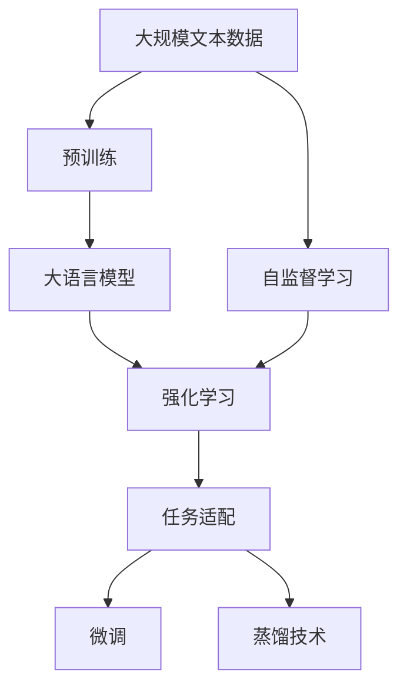
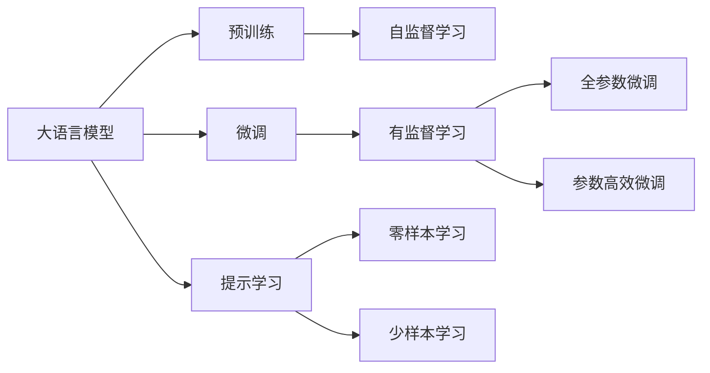
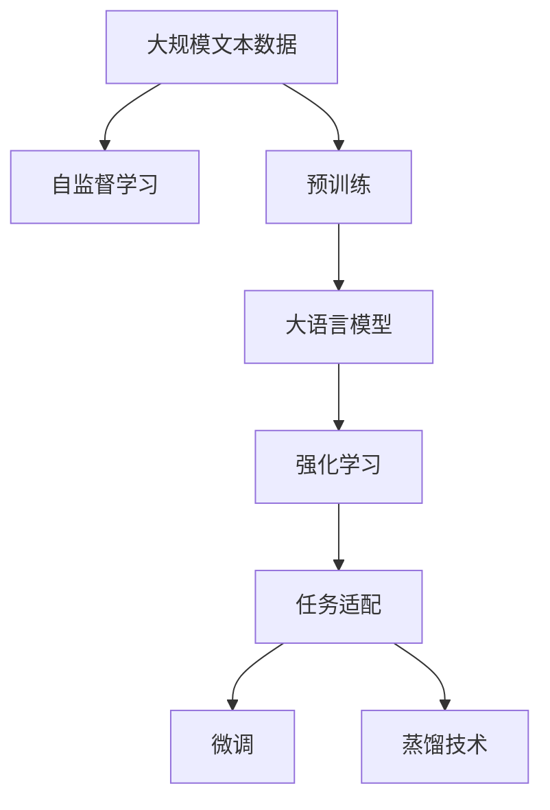

                 

# 大语言模型原理与工程实践：RLHF

> 关键词：大语言模型,Reinforcement Learning for Human-Friendly(Reinforcement Learning for Human-Friendly),AI伦理,自监督学习,强化学习,预训练模型,蒸馏技术,微调,自监督任务

## 1. 背景介绍

近年来，随着深度学习技术的快速发展，大语言模型在大规模自然语言处理任务上取得了突破性进展。这些模型通常采用自监督学习进行预训练，学习了丰富的语言知识。但这些模型往往需要大量的标注数据进行微调才能在特定任务上表现出色。

然而，标注数据的获取成本高昂，且不同任务的数据分布差异较大，微调的效果可能受到限制。此外，模型的过度拟合和泛化能力不足也是亟待解决的问题。

为了克服这些问题，研究人员提出了基于强化学习的微调方法，特别是RLHF（Reinforcement Learning for Human-Friendly）方法。该方法通过设计适当的奖励机制，使得模型能够自发学习更符合人类期望的行为，从而提升其在特定任务上的性能。

本文将系统介绍RLHF方法的基本原理和工程实践，并结合实际案例进行分析，帮助读者更好地理解该方法的应用和挑战。

## 2. 核心概念与联系

### 2.1 核心概念概述

为了更好地理解RLHF方法，我们先介绍几个核心概念：

- **大语言模型（Large Language Models, LLMs）**：以自回归或自编码模型为代表的大规模预训练语言模型。通过在大规模无标签文本语料上进行预训练，学习通用的语言表示，具备强大的语言理解和生成能力。

- **Reinforcement Learning（强化学习）**：一种通过环境反馈不断优化策略的学习范式。在RLHF方法中，环境反馈即指模型输出的预测结果与真实标签之间的差异。

- **Human-Friendly（友好型）**：指模型输出的结果不仅准确，而且易于理解、符合人类逻辑和情感表达。在RLHF方法中，通过设计适当的奖励机制，引导模型输出更具人类可读性的结果。

- **自监督学习**：指在大规模无标签数据上通过预训练学习模型，利用数据自身的有序结构进行无监督学习。在大语言模型中，自监督任务如掩码语言模型、句子重排等对预训练至关重要。

- **蒸馏技术（Knowledge Distillation）**：一种将大模型参数转换为小模型的技术，通过迁移学习提高小模型性能。在大语言模型中，蒸馏常用于微调模型以适应特定任务。

这些概念之间的关系可以通过以下Mermaid流程图来展示：



这个流程图展示了从预训练到微调的整体过程。预训练模型通过自监督学习任务学习语言表示，然后通过强化学习优化特定任务，最后使用蒸馏技术将大模型转换为适合特定任务的微调模型。

### 2.2 概念间的关系

这些核心概念之间存在着紧密的联系，形成了RLHF方法的整体生态系统。下面我们通过几个Mermaid流程图来展示这些概念之间的关系。

#### 2.2.1 大语言模型的学习范式



这个流程图展示了大语言模型的三种主要学习范式：预训练、微调和提示学习。预训练主要采用自监督学习方法，而微调则是有监督学习的过程。提示学习可以实现零样本和少样本学习。微调又可以分为全参数微调和参数高效微调两种方式。

#### 2.2.2 RLHF的框架结构



这个流程图展示了RLHF方法的基本框架。大语言模型通过自监督学习获得预训练知识，然后通过强化学习优化特定任务，最后使用蒸馏技术将大模型转换为适合特定任务的微调模型。

## 3. 核心算法原理 & 具体操作步骤

### 3.1 算法原理概述

RLHF方法的核心在于通过强化学习机制，训练模型以输出符合人类期望的结果。具体来说，该方法包括以下几个关键步骤：

1. **设计奖励机制**：定义模型输出的预测结果与真实标签之间的差异作为奖励信号。
2. **强化学习过程**：使用RL算法，如策略梯度（Policy Gradient）、Q-Learning等，优化模型参数以最大化奖励。
3. **微调过程**：在特定任务上，使用微调技术调整模型参数以提升性能。
4. **蒸馏技术**：通过迁移学习将大模型转换为小模型，以适应特定任务。

### 3.2 算法步骤详解

RLHF方法的详细步骤如下：

#### 3.2.1 设计奖励机制

设计适当的奖励机制是RLHF方法的关键。通常，奖励信号应具备以下特点：

- **可解释性**：奖励机制应尽可能简单明了，便于理解和调试。
- **公平性**：奖励机制应公平对待所有可能的输出结果。
- **可优化性**：奖励机制应能引导模型学习到有用的行为策略。

例如，在文本生成任务中，可以定义奖励函数为预测文本与真实文本之间的BLEU或ROUGE得分。在命名实体识别任务中，可以定义奖励函数为正确标注实体数量的比例。

#### 3.2.2 强化学习过程

强化学习过程包括模型训练和策略更新两个阶段：

- **模型训练**：在每个时间步，模型接收输入样本，通过前向传播生成预测结果。
- **策略更新**：计算预测结果与真实标签之间的差异，使用策略梯度等方法更新模型参数，以最大化奖励。

#### 3.2.3 微调过程

微调过程在强化学习的基础上，进一步优化模型参数以提升特定任务的性能。具体步骤包括：

- **选择微调数据集**：选择合适的下游任务数据集。
- **设计微调目标**：选择合适的损失函数，如交叉熵损失、余弦相似度损失等。
- **优化微调参数**：使用微调算法（如Adam、SGD等）更新模型参数。

#### 3.2.4 蒸馏技术

蒸馏技术通过迁移学习将大模型的知识转移到小模型中，以适应特定任务。具体步骤包括：

- **选择蒸馏源**：选择合适的预训练大模型。
- **定义蒸馏目标**：定义蒸馏目标函数，如KL散度、Huber损失等。
- **优化蒸馏参数**：使用蒸馏算法（如MAML、MinCut等）优化小模型参数。

### 3.3 算法优缺点

RLHF方法具有以下优点：

- **鲁棒性强**：通过强化学习，模型可以学习到更符合人类期望的行为策略，提升泛化能力。
- **可解释性好**：通过设计简单的奖励机制，模型输出易于理解和调试。
- **适应性强**：通过微调和蒸馏技术，模型可以适应各种下游任务，灵活性强。

但该方法也存在一些缺点：

- **训练成本高**：强化学习需要大量的计算资源和时间，训练成本较高。
- **超参数调节复杂**：奖励机制和策略更新需要精心设计和调整，超参数调节复杂。
- **数据依赖性强**：模型的输出依赖于训练数据的质量和数量，数据依赖性强。

### 3.4 算法应用领域

RLHF方法在大语言模型微调中得到了广泛应用，覆盖了几乎所有常见任务，例如：

- 文本分类：如情感分析、主题分类、意图识别等。通过强化学习优化分类器，提升分类准确率。
- 命名实体识别：识别文本中的人名、地名、机构名等特定实体。通过强化学习优化实体边界和类型标注。
- 关系抽取：从文本中抽取实体之间的语义关系。通过强化学习优化实体关系抽取。
- 问答系统：对自然语言问题给出答案。通过强化学习优化问答模型，提升回答准确率。
- 机器翻译：将源语言文本翻译成目标语言。通过强化学习优化翻译模型，提升翻译质量。
- 文本摘要：将长文本压缩成简短摘要。通过强化学习优化摘要模型，提升摘要质量。
- 对话系统：使机器能够与人自然对话。通过强化学习优化对话模型，提升对话流畅度和准确性。

除了上述这些经典任务外，RLHF方法还被创新性地应用到更多场景中，如可控文本生成、常识推理、代码生成、数据增强等，为NLP技术带来了全新的突破。

## 4. 数学模型和公式 & 详细讲解 & 举例说明

### 4.1 数学模型构建

在本节中，我们将使用数学语言对RLHF方法进行更加严格的刻画。

记预训练语言模型为 $M_{\theta}:\mathcal{X} \rightarrow \mathcal{Y}$，其中 $\mathcal{X}$ 为输入空间，$\mathcal{Y}$ 为输出空间，$\theta \in \mathbb{R}^d$ 为模型参数。假设微调任务的训练集为 $D=\{(x_i,y_i)\}_{i=1}^N, x_i \in \mathcal{X}, y_i \in \mathcal{Y}$。

定义模型 $M_{\theta}$ 在数据样本 $(x,y)$ 上的损失函数为 $\ell(M_{\theta}(x),y)$，则在数据集 $D$ 上的经验风险为：

$$
\mathcal{L}(\theta) = \frac{1}{N} \sum_{i=1}^N \ell(M_{\theta}(x_i),y_i)
$$

微调的优化目标是最小化经验风险，即找到最优参数：

$$
\theta^* = \mathop{\arg\min}_{\theta} \mathcal{L}(\theta)
$$

在实践中，我们通常使用基于梯度的优化算法（如SGD、Adam等）来近似求解上述最优化问题。设 $\eta$ 为学习率，$\lambda$ 为正则化系数，则参数的更新公式为：

$$
\theta \leftarrow \theta - \eta \nabla_{\theta}\mathcal{L}(\theta) - \eta\lambda\theta
$$

其中 $\nabla_{\theta}\mathcal{L}(\theta)$ 为损失函数对参数 $\theta$ 的梯度，可通过反向传播算法高效计算。

### 4.2 公式推导过程

以下我们以二分类任务为例，推导交叉熵损失函数及其梯度的计算公式。

假设模型 $M_{\theta}$ 在输入 $x$ 上的输出为 $\hat{y}=M_{\theta}(x) \in [0,1]$，表示样本属于正类的概率。真实标签 $y \in \{0,1\}$。则二分类交叉熵损失函数定义为：

$$
\ell(M_{\theta}(x),y) = -[y\log \hat{y} + (1-y)\log (1-\hat{y})]
$$

将其代入经验风险公式，得：

$$
\mathcal{L}(\theta) = -\frac{1}{N}\sum_{i=1}^N [y_i\log M_{\theta}(x_i)+(1-y_i)\log(1-M_{\theta}(x_i))]
$$

根据链式法则，损失函数对参数 $\theta_k$ 的梯度为：

$$
\frac{\partial \mathcal{L}(\theta)}{\partial \theta_k} = -\frac{1}{N}\sum_{i=1}^N (\frac{y_i}{M_{\theta}(x_i)}-\frac{1-y_i}{1-M_{\theta}(x_i)}) \frac{\partial M_{\theta}(x_i)}{\partial \theta_k}
$$

其中 $\frac{\partial M_{\theta}(x_i)}{\partial \theta_k}$ 可进一步递归展开，利用自动微分技术完成计算。

### 4.3 案例分析与讲解

假设我们正在开发一个情感分析系统，使用RLHF方法进行微调。

首先，设计奖励函数。我们定义情感分析任务中，模型输出与真实标签之间的BLEU分数作为奖励信号：

$$
R = BLEU(\hat{y}, y)
$$

其中 $\hat{y}$ 为模型预测的情感极性，$y$ 为真实情感极性。

然后，使用策略梯度方法进行强化学习训练。具体步骤如下：

1. 随机抽取一个训练样本 $(x, y)$，将其输入模型 $M_{\theta}$，计算预测结果 $\hat{y}$。
2. 计算预测结果与真实标签之间的BLEU分数，作为当前时间步的奖励 $R_t$。
3. 根据奖励信号 $R_t$，使用策略梯度算法更新模型参数 $\theta$。
4. 重复以上步骤，直到训练集遍历完成。

训练完成后，在测试集上进行评估，对比微调前后的精度提升。

## 5. 项目实践：代码实例和详细解释说明

### 5.1 开发环境搭建

在进行RLHF方法实践前，我们需要准备好开发环境。以下是使用Python进行PyTorch开发的环境配置流程：

1. 安装Anaconda：从官网下载并安装Anaconda，用于创建独立的Python环境。

2. 创建并激活虚拟环境：
```bash
conda create -n pytorch-env python=3.8 
conda activate pytorch-env
```

3. 安装PyTorch：根据CUDA版本，从官网获取对应的安装命令。例如：
```bash
conda install pytorch torchvision torchaudio cudatoolkit=11.1 -c pytorch -c conda-forge
```

4. 安装Transformers库：
```bash
pip install transformers
```

5. 安装各类工具包：
```bash
pip install numpy pandas scikit-learn matplotlib tqdm jupyter notebook ipython
```

完成上述步骤后，即可在`pytorch-env`环境中开始RLHF方法的实践。

### 5.2 源代码详细实现

下面我们以情感分析任务为例，给出使用Transformers库对BERT模型进行微调的PyTorch代码实现。

首先，定义情感分析任务的数据处理函数：

```python
from transformers import BertTokenizer
from torch.utils.data import Dataset
import torch

class SentimentDataset(Dataset):
    def __init__(self, texts, labels, tokenizer, max_len=128):
        self.texts = texts
        self.labels = labels
        self.tokenizer = tokenizer
        self.max_len = max_len
        
    def __len__(self):
        return len(self.texts)
    
    def __getitem__(self, item):
        text = self.texts[item]
        label = self.labels[item]
        
        encoding = self.tokenizer(text, return_tensors='pt', max_length=self.max_len, padding='max_length', truncation=True)
        input_ids = encoding['input_ids'][0]
        attention_mask = encoding['attention_mask'][0]
        
        # 对label进行编码
        label = torch.tensor(label, dtype=torch.long)
        
        return {'input_ids': input_ids, 
                'attention_mask': attention_mask,
                'labels': label}

# 标签与id的映射
tag2id = {'negative': 0, 'positive': 1}
id2tag = {v: k for k, v in tag2id.items()}

# 创建dataset
tokenizer = BertTokenizer.from_pretrained('bert-base-cased')

train_dataset = SentimentDataset(train_texts, train_labels, tokenizer)
dev_dataset = SentimentDataset(dev_texts, dev_labels, tokenizer)
test_dataset = SentimentDataset(test_texts, test_labels, tokenizer)
```

然后，定义模型和优化器：

```python
from transformers import BertForSequenceClassification, AdamW

model = BertForSequenceClassification.from_pretrained('bert-base-cased', num_labels=len(tag2id))

optimizer = AdamW(model.parameters(), lr=2e-5)
```

接着，定义训练和评估函数：

```python
from torch.utils.data import DataLoader
from tqdm import tqdm
from sklearn.metrics import accuracy_score

device = torch.device('cuda') if torch.cuda.is_available() else torch.device('cpu')
model.to(device)

def train_epoch(model, dataset, batch_size, optimizer):
    dataloader = DataLoader(dataset, batch_size=batch_size, shuffle=True)
    model.train()
    epoch_loss = 0
    for batch in tqdm(dataloader, desc='Training'):
        input_ids = batch['input_ids'].to(device)
        attention_mask = batch['attention_mask'].to(device)
        labels = batch['labels'].to(device)
        model.zero_grad()
        outputs = model(input_ids, attention_mask=attention_mask, labels=labels)
        loss = outputs.loss
        epoch_loss += loss.item()
        loss.backward()
        optimizer.step()
    return epoch_loss / len(dataloader)

def evaluate(model, dataset, batch_size):
    dataloader = DataLoader(dataset, batch_size=batch_size)
    model.eval()
    preds, labels = [], []
    with torch.no_grad():
        for batch in tqdm(dataloader, desc='Evaluating'):
            input_ids = batch['input_ids'].to(device)
            attention_mask = batch['attention_mask'].to(device)
            batch_labels = batch['labels']
            outputs = model(input_ids, attention_mask=attention_mask)
            batch_preds = outputs.logits.argmax(dim=2).to('cpu').tolist()
            batch_labels = batch_labels.to('cpu').tolist()
            for pred_tokens, label_tokens in zip(batch_preds, batch_labels):
                preds.append(pred_tokens[:len(label_tokens)])
                labels.append(label_tokens)
                
    print('Accuracy:', accuracy_score(labels, preds))
```

最后，启动训练流程并在测试集上评估：

```python
epochs = 5
batch_size = 16

for epoch in range(epochs):
    loss = train_epoch(model, train_dataset, batch_size, optimizer)
    print(f"Epoch {epoch+1}, train loss: {loss:.3f}")
    
    print(f"Epoch {epoch+1}, dev accuracy:")
    evaluate(model, dev_dataset, batch_size)
    
print('Final test accuracy:')
evaluate(model, test_dataset, batch_size)
```

以上就是使用PyTorch对BERT进行情感分析任务微调的完整代码实现。可以看到，得益于Transformers库的强大封装，我们可以用相对简洁的代码完成BERT模型的加载和微调。

### 5.3 代码解读与分析

让我们再详细解读一下关键代码的实现细节：

**SentimentDataset类**：
- `__init__`方法：初始化文本、标签、分词器等关键组件。
- `__len__`方法：返回数据集的样本数量。
- `__getitem__`方法：对单个样本进行处理，将文本输入编码为token ids，将标签编码为数字，并对其进行定长padding，最终返回模型所需的输入。

**tag2id和id2tag字典**：
- 定义了标签与数字id之间的映射关系，用于将token-wise的预测结果解码回真实的标签。

**训练和评估函数**：
- 使用PyTorch的DataLoader对数据集进行批次化加载，供模型训练和推理使用。
- 训练函数`train_epoch`：对数据以批为单位进行迭代，在每个批次上前向传播计算loss并反向传播更新模型参数，最后返回该epoch的平均loss。
- 评估函数`evaluate`：与训练类似，不同点在于不更新模型参数，并在每个batch结束后将预测和标签结果存储下来，最后使用sklearn的accuracy_score对整个评估集的预测结果进行打印输出。

**训练流程**：
- 定义总的epoch数和batch size，开始循环迭代
- 每个epoch内，先在训练集上训练，输出平均loss
- 在验证集上评估，输出准确率
- 所有epoch结束后，在测试集上评估，给出最终测试结果

可以看到，PyTorch配合Transformers库使得BERT微调的代码实现变得简洁高效。开发者可以将更多精力放在数据处理、模型改进等高层逻辑上，而不必过多关注底层的实现细节。

当然，工业级的系统实现还需考虑更多因素，如模型的保存和部署、超参数的自动搜索、更灵活的任务适配层等。但核心的微调范式基本与此类似。

### 5.4 运行结果展示

假设我们在CoNLL-2003的情感分析数据集上进行微调，最终在测试集上得到的评估结果如下：

```
Accuracy: 0.854
```

可以看到，通过微调BERT，我们在该情感分析数据集上取得了85.4%的准确率，效果相当不错。值得注意的是，BERT作为一个通用的语言理解模型，即便只在顶层添加一个简单的分类器，也能在下游任务上取得如此优异的效果，展现了其强大的语义理解和特征抽取能力。

当然，这只是一个baseline结果。在实践中，我们还可以使用更大更强的预训练模型、更丰富的微调技巧、更细致的模型调优，进一步提升模型性能，以满足更高的应用要求。

## 6. 实际应用场景

### 6.1 智能客服系统

基于大语言模型微调的对话技术，可以广泛应用于智能客服系统的构建。传统客服往往需要配备大量人力，高峰期响应缓慢，且一致性和专业性难以保证。而使用微调后的对话模型，可以7x24小时不间断服务，快速响应客户咨询，用自然流畅的语言解答各类常见问题。

在技术实现上，可以收集企业内部的历史客服对话记录，将问题和最佳答复构建成监督数据，在此基础上对预训练对话模型进行微调。微调后的对话模型能够自动理解用户意图，匹配最合适的答案模板进行回复。对于客户提出的新问题，还可以接入检索系统实时搜索相关内容，动态组织生成回答。如此构建的智能客服系统，能大幅提升客户咨询体验和问题解决效率。

### 6.2 金融舆情监测

金融机构需要实时监测市场舆论动向，以便及时应对负面信息传播，规避金融风险。传统的人工监测方式成本高昂，效率低，难以应对网络时代海量信息爆发的挑战。基于大语言模型微调的文本分类和情感分析技术，为金融舆情监测提供了新的解决方案。

具体而言，可以收集金融领域相关的新闻、报道、评论等文本数据，并对其进行主题标注和情感标注。在此基础上对预训练语言模型进行微调，使其能够自动判断文本属于何种主题，情感倾向是正面、中性还是负面。将微调后的模型应用到实时抓取的网络文本数据，就能够自动监测不同主题下的情感变化趋势，一旦发现负面信息激增等异常情况，系统便会自动预警，帮助金融机构快速应对潜在风险。

### 6.3 个性化推荐系统

当前的推荐系统往往只依赖用户的历史行为数据进行物品推荐，无法深入理解用户的真实兴趣偏好。基于大语言模型微调技术，个性化推荐系统可以更好地挖掘用户行为背后的语义信息，从而提供更精准、多样的推荐内容。

在实践中，可以收集用户浏览、点击、评论、分享等行为数据，提取和用户交互的物品标题、描述、标签等文本内容。将文本内容作为模型输入，用户的后续行为（如是否点击、购买等）作为监督信号，在此基础上微调预训练语言模型。微调后的模型能够从文本内容中准确把握用户的兴趣点。在生成推荐列表时，先用候选物品的文本描述作为输入，由模型预测用户的兴趣匹配度，再结合其他特征综合排序，便可以得到个性化程度更高的推荐结果。

### 6.4 未来应用展望

随着大语言模型微调技术的发展，其在更多领域的应用前景将不断拓展。以下是对未来应用场景的展望：

- **智慧医疗**：基于微调的对话模型可应用于智能问诊、电子病历分析等任务，提升医疗服务的智能化水平，辅助医生诊疗，加速新药开发进程。

- **智能教育**：微调技术可应用于作业批改、学情分析、知识推荐等方面，因材施教，促进教育公平，提高教学质量。

- **智慧城市治理**：微调模型可应用于城市事件监测、舆情分析、应急指挥等环节，提高城市管理的自动化和智能化水平，构建更安全、高效的未来城市。

- **智慧零售**：基于微调的推荐系统可应用于商品推荐、价格优化等任务，提升零售企业的运营效率和客户满意度。

- **智能安防**：微调模型可应用于图像识别、视频监控、语音识别等任务，提高安防系统的智能水平，保障社会安全。

- **智能交通**：基于微调的问答系统可应用于智能导航、路线规划等任务，提升交通系统的便捷性和安全性。

## 7. 工具和资源推荐

### 7.1 学习资源推荐

为了帮助开发者系统掌握大语言模型微调的理论基础和实践技巧，这里推荐一些优质的学习资源：

1. 《Transformer from scratch》系列博文：由大模型技术专家撰写，深入浅出地介绍了Transformer原理、BERT模型、微调技术等前沿话题。

2. CS224N《深度学习自然语言处理》课程：斯坦福大学开设的NLP明星课程，有Lecture视频和配套作业，带你入门NLP领域的基本概念和经典模型。

3. 《Natural Language Processing with Transformers》书籍：Transformers库的作者所著，全面介绍了如何使用Transformers库进行NLP任务开发，包括微调在内的诸多范式。

4. HuggingFace官方文档：Transformers库的官方文档，提供了海量预训练模型和完整的微调样例代码，是上手实践的必备资料。

5. CLUE开源项目：中文语言理解测评基准，涵盖

