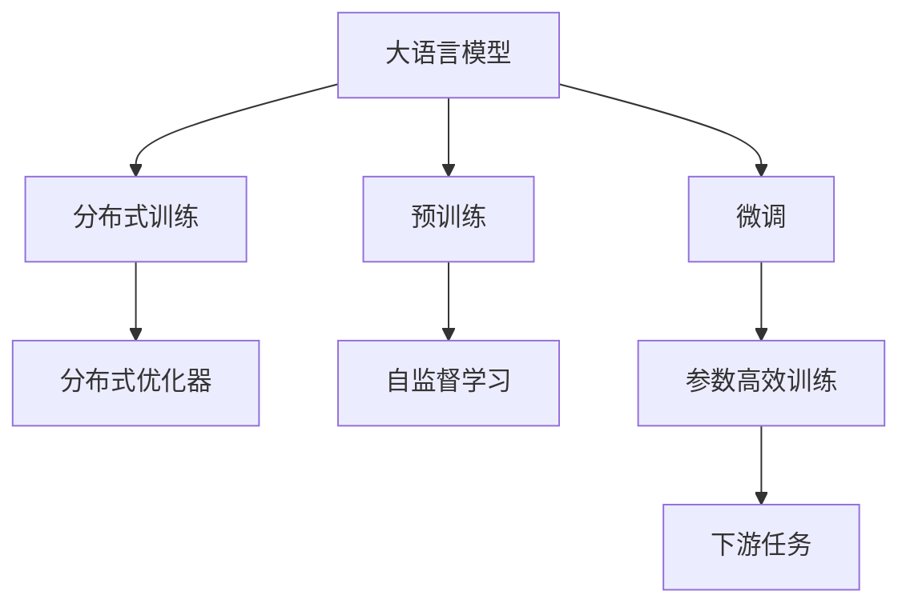
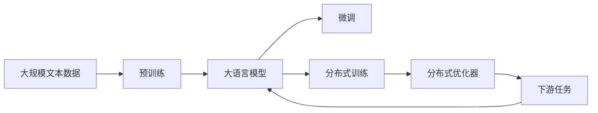
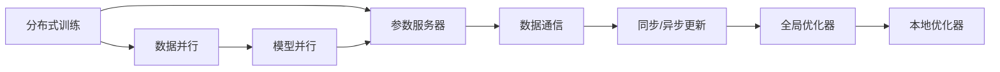
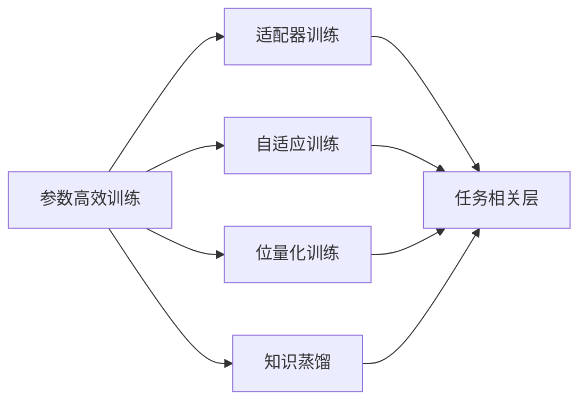
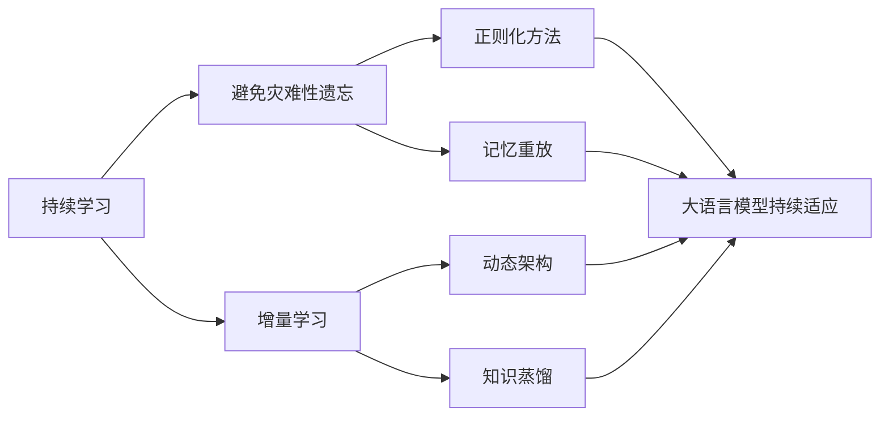
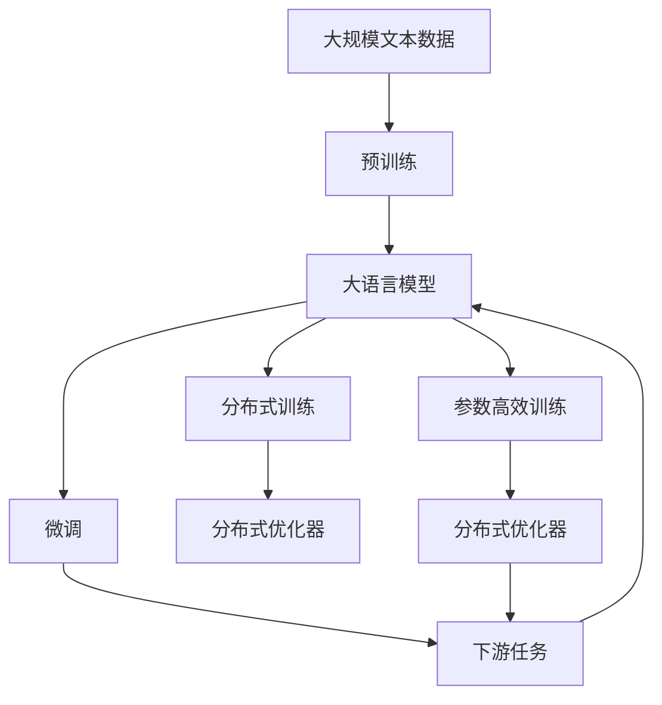

                 

# 大语言模型原理与工程实践：大语言模型怎么训练

> 关键词：大语言模型,预训练,自监督学习,Transformer,BERT,模型压缩,分布式训练

## 1. 背景介绍

### 1.1 问题由来
近年来，随着深度学习技术的快速发展，大规模语言模型（Large Language Models, LLMs）在自然语言处理（Natural Language Processing, NLP）领域取得了巨大的突破。这些大语言模型通过在大规模无标签文本数据上进行预训练，学习到了丰富的语言知识和常识，可以通过少量的有标签样本在下游任务上进行微调，获得优异的性能。其中最具代表性的大模型包括OpenAI的GPT系列模型、Google的BERT、T5等。

然而，由于预训练语料的广泛性和泛化能力的不足，这些通用的大语言模型在特定领域应用时，效果往往难以达到实际应用的要求。因此，如何针对特定任务进行大模型微调，提升模型性能，成为了当前大语言模型研究和应用的一个热点问题。本文聚焦于大语言模型的训练方法，但同时也会兼顾参数高效训练、分布式训练等前沿技术，以期对大语言模型训练实践提供更全面的指导。

### 1.2 问题核心关键点
目前，大语言模型训练的主流范式基于自监督学习，即在大规模无标签文本数据上进行预训练，再通过微调适应特定任务。其核心思想是：利用大规模语料学习语言的通用表示，通过下游任务的数据进行微调，使模型能够更好地适应新的任务需求。

训练的核心在于如何设计预训练任务，以及如何设计合适的模型架构。当前流行的预训练任务包括语言模型预测、掩码语言模型预测、下一句预测等，这些任务能够使得模型学习到丰富的语言结构信息。常用的模型架构包括Transformer、BERT、GPT等，这些模型通过多层自注意力机制，能够在计算资源有限的情况下，高效地表示复杂的语言结构。

此外，如何在大规模语料上高效进行分布式训练，以及如何在微调过程中提升模型的泛化能力，也是当前大语言模型训练中需要解决的关键问题。

### 1.3 问题研究意义
研究大语言模型的训练方法，对于拓展大模型的应用范围，提升下游任务的性能，加速NLP技术的产业化进程，具有重要意义：

1. 降低应用开发成本。基于成熟的大模型进行训练，可以显著减少从头开发所需的数据、计算和人力等成本投入。
2. 提升模型效果。通过预训练-微调的过程，大模型能够更好地适应特定任务，在应用场景中取得更优表现。
3. 加速开发进度。standing on the shoulders of giants，训练使得开发者可以更快地完成任务适配，缩短开发周期。
4. 带来技术创新。训练范式促进了对预训练-微调的深入研究，催生了参数高效训练、分布式训练等新的研究方向。
5. 赋能产业升级。训练使得NLP技术更容易被各行各业所采用，为传统行业数字化转型升级提供新的技术路径。

## 2. 核心概念与联系

### 2.1 核心概念概述

为更好地理解大语言模型的训练方法，本节将介绍几个密切相关的核心概念：

- 大语言模型(Large Language Model, LLM)：以自回归(如GPT)或自编码(如BERT)模型为代表的大规模预训练语言模型。通过在大规模无标签文本语料上进行预训练，学习通用的语言表示，具备强大的语言理解和生成能力。

- 预训练(Pre-training)：指在大规模无标签文本语料上，通过自监督学习任务训练通用语言模型的过程。常见的预训练任务包括言语建模、遮挡语言模型等。预训练使得模型学习到语言的通用表示。

- 自监督学习(Self-supervised Learning)：指利用数据自身的结构信息，通过无监督任务进行模型训练。如语言模型预测、掩码语言模型预测等。

- 分布式训练(Distributed Training)：指将训练任务分散到多个计算节点上，并行进行模型训练，以提高训练效率和可扩展性。

- 参数高效训练(Parameter-Efficient Training, PEF)：指在训练过程中，只更新少量的模型参数，而固定大部分预训练权重不变，以提高训练效率，避免过拟合的方法。

- 分布式优化器(Distributed Optimizer)：指在大规模分布式训练中，用于优化模型参数的算法和策略。

这些核心概念之间的逻辑关系可以通过以下Mermaid流程图来展示：



这个流程图展示了大语言模型的核心概念及其之间的关系：

1. 大语言模型通过预训练获得基础能力。
2. 微调是对预训练模型进行任务特定的优化，可以分为分布式微调和参数高效微调。
3. 分布式训练提高模型训练效率，能够在大规模数据上快速训练。
4. 分布式优化器优化大规模分布式训练的参数更新策略。
5. 预训练的模型架构通常采用Transformer，通过自注意力机制高效表示语言结构。

这些核心概念共同构成了大语言模型的训练框架，使其能够在各种场景下发挥强大的语言理解和生成能力。通过理解这些核心概念，我们可以更好地把握大语言模型的工作原理和优化方向。

### 2.2 概念间的关系

这些核心概念之间存在着紧密的联系，形成了大语言模型的训练生态系统。下面我通过几个Mermaid流程图来展示这些概念之间的关系。

#### 2.2.1 大语言模型的训练过程



这个流程图展示了从预训练到微调，再到分布式训练的完整过程。大语言模型首先在大规模文本数据上进行预训练，然后通过微调适应特定任务。在微调过程中，可以采用分布式训练技术，加快训练效率。分布式优化器用于优化大规模分布式训练的参数更新策略，保证模型训练的稳定性和收敛性。

#### 2.2.2 分布式训练与优化器



这个流程图展示了分布式训练的基本架构，包括数据并行、模型并行、参数服务器、数据通信、同步/异步更新、全局优化器和本地优化器等关键组件。通过分布式训练，模型可以在多个计算节点上并行训练，提高训练效率和可扩展性。数据并行和模型并行分别对数据和模型进行并行化处理，参数服务器用于协调不同计算节点间的参数更新，数据通信和同步/异步更新则用于优化数据和参数的传输与更新策略。全局优化器和本地优化器分别用于全局参数优化和局部参数优化，确保模型训练的稳定性和收敛性。

#### 2.2.3 参数高效训练方法



这个流程图展示了几种常见的参数高效训练方法，包括适配器训练、自适应训练、位量化训练和知识蒸馏等。这些方法的特点是固定大部分预训练参数，只更新少量任务相关参数，从而提高训练效率。

#### 2.2.4 持续学习在大语言模型中的应用



这个流程图展示了持续学习在大语言模型中的应用。持续学习的主要目标是避免灾难性遗忘和实现增量学习。通过正则化方法、记忆重放、动态架构和知识蒸馏等技术，可以使大语言模型持续适应新的任务和数据。

### 2.3 核心概念的整体架构

最后，我们用一个综合的流程图来展示这些核心概念在大语言模型训练过程中的整体架构：



这个综合流程图展示了从预训练到微调，再到分布式训练的完整过程。大语言模型首先在大规模文本数据上进行预训练，然后通过微调适应特定任务。在微调过程中，可以采用分布式训练技术，加快训练效率。分布式优化器用于优化大规模分布式训练的参数更新策略。预训练的模型架构通常采用Transformer，通过自注意力机制高效表示语言结构。参数高效训练方法固定大部分预训练参数，只更新少量任务相关参数，从而提高训练效率。

## 3. 核心算法原理 & 具体操作步骤
### 3.1 算法原理概述

大语言模型的训练过程基于自监督学习，即利用大规模无标签文本数据进行预训练，再通过下游任务的数据进行微调。其核心思想是：利用大规模语料学习语言的通用表示，通过下游任务的数据进行微调，使模型能够更好地适应新的任务需求。

形式化地，假设预训练语言模型为 $M_{\theta}$，其中 $\theta$ 为预训练得到的模型参数。给定下游任务 $T$ 的标注数据集 $D=\{(x_i,y_i)\}_{i=1}^N$，训练的目标是找到新的模型参数 $\hat{\theta}$，使得：

$$
\hat{\theta}=\mathop{\arg\min}_{\theta} \mathcal{L}(M_{\theta},D)
$$

其中 $\mathcal{L}$ 为针对任务 $T$ 设计的损失函数，用于衡量模型预测输出与真实标签之间的差异。常见的损失函数包括交叉熵损失、均方误差损失等。

通过梯度下降等优化算法，训练过程不断更新模型参数 $\theta$，最小化损失函数 $\mathcal{L}$，使得模型输出逼近真实标签。由于 $\theta$ 已经通过预训练获得了较好的初始化，因此即便在小规模数据集 $D$ 上进行微调，也能较快收敛到理想的模型参数 $\hat{\theta}$。

### 3.2 算法步骤详解

大语言模型的训练一般包括以下几个关键步骤：

**Step 1: 准备预训练模型和数据集**
- 选择合适的预训练语言模型 $M_{\theta}$ 作为初始化参数，如 BERT、GPT 等。
- 准备下游任务 $T$ 的标注数据集 $D$，划分为训练集、验证集和测试集。一般要求标注数据与预训练数据的分布不要差异过大。

**Step 2: 设计预训练任务**
- 选择合适的自监督学习任务，如掩码语言模型预测、下一句预测等，用于预训练模型的通用语言表示。
- 设计预训练任务的目标函数，通常采用交叉熵损失函数。
- 在预训练过程中，保证模型参数 $\theta$ 在训练集上进行更新，以学习到有效的语言表示。

**Step 3: 设置训练超参数**
- 选择合适的优化算法及其参数，如 AdamW、SGD 等，设置学习率、批大小、迭代轮数等。
- 设置正则化技术及强度，包括权重衰减、Dropout、Early Stopping 等。
- 确定冻结预训练参数的策略，如仅微调顶层，或全部参数都参与训练。

**Step 4: 执行梯度训练**
- 将训练集数据分批次输入模型，前向传播计算损失函数。
- 反向传播计算参数梯度，根据设定的优化算法和学习率更新模型参数。
- 周期性在验证集上评估模型性能，根据性能指标决定是否触发 Early Stopping。
- 重复上述步骤直到满足预设的迭代轮数或 Early Stopping 条件。

**Step 5: 测试和部署**
- 在测试集上评估训练后模型 $M_{\hat{\theta}}$ 的性能，对比微调前后的精度提升。
- 使用训练后的模型对新样本进行推理预测，集成到实际的应用系统中。
- 持续收集新的数据，定期重新训练模型，以适应数据分布的变化。

以上是基于自监督学习的训练过程的一般流程。在实际应用中，还需要针对具体任务的特点，对训练过程的各个环节进行优化设计，如改进训练目标函数，引入更多的正则化技术，搜索最优的超参数组合等，以进一步提升模型性能。

### 3.3 算法优缺点

大语言模型的训练方法具有以下优点：
1. 简单高效。相比从头训练，预训练模型能够显著减少计算资源和时间投入。
2. 通用适用。适用于各种NLP下游任务，设计简单的自监督任务即可实现预训练。
3. 参数高效。利用参数高效训练方法，在固定大部分预训练参数的情况下，仍可取得不错的训练效果。
4. 效果显著。在学术界和工业界的诸多任务上，基于预训练-微调的方法已经刷新了最先进的性能指标。

同时，该方法也存在一定的局限性：
1. 依赖标注数据。预训练模型的效果很大程度上取决于标注数据的质量和数量，获取高质量标注数据的成本较高。
2. 迁移能力有限。当目标任务与预训练数据的分布差异较大时，预训练模型的性能提升有限。
3. 负面效果传递。预训练模型的固有偏见、有害信息等，可能通过微调传递到下游任务，造成负面影响。
4. 可解释性不足。预训练模型的固有偏见、有害信息等，可能通过微调传递到下游任务，造成负面影响。

尽管存在这些局限性，但就目前而言，自监督学习的大语言模型训练方法仍然是最主流范式。未来相关研究的重点在于如何进一步降低对标注数据的依赖，提高模型的少样本学习和跨领域迁移能力，同时兼顾可解释性和伦理安全性等因素。

### 3.4 算法应用领域

大语言模型的训练方法在NLP领域已经得到了广泛的应用，覆盖了几乎所有常见任务，例如：

- 文本分类：如情感分析、主题分类、意图识别等。通过预训练模型学习文本-标签映射。
- 命名实体识别：识别文本中的人名、地名、机构名等特定实体。通过预训练模型学习实体边界和类型。
- 关系抽取：从文本中抽取实体之间的语义关系。通过预训练模型学习实体-关系三元组。
- 问答系统：对自然语言问题给出答案。将问题-答案对作为预训练数据，训练模型学习匹配答案。
- 机器翻译：将源语言文本翻译成目标语言。通过预训练模型学习语言-语言映射。
- 文本摘要：将长文本压缩成简短摘要。通过预训练模型学习抓取要点。
- 对话系统：使机器能够与人自然对话。通过预训练模型学习对话历史和回复生成。

除了上述这些经典任务外，大语言模型的训练方法也被创新性地应用到更多场景中，如可控文本生成、常识推理、代码生成、数据增强等，为NLP技术带来了全新的突破。随着预训练模型和训练方法的不断进步，相信NLP技术将在更广阔的应用领域大放异彩。

## 4. 数学模型和公式 & 详细讲解 & 举例说明
### 4.1 数学模型构建

本节将使用数学语言对大语言模型的训练过程进行更加严格的刻画。

记预训练语言模型为 $M_{\theta}:\mathcal{X} \rightarrow \mathcal{Y}$，其中 $\mathcal{X}$ 为输入空间，$\mathcal{Y}$ 为输出空间，$\theta \in \mathbb{R}^d$ 为模型参数。假设预训练任务的目标函数为 $\mathcal{L}(\theta)$。

定义模型 $M_{\theta}$ 在输入 $x$ 上的损失函数为 $\ell(M_{\theta}(x),y)$，则在预训练数据集上的经验风险为：

$$
\mathcal{L}(\theta) = \frac{1}{N}\sum_{i=1}^N \ell(M_{\theta}(x_i),y_i)
$$

训练的目标是最小化经验风险，即找到最优参数：

$$
\theta^* = \mathop{\arg\min}_{\theta} \mathcal{L}(\theta)
$$

在实践中，我们通常使用基于梯度的优化算法（如SGD、Adam等）来近似求解上述最优化问题。设 $\eta$ 为学习率，$\lambda$ 为正则化系数，则参数的更新公式为：

$$
\theta \leftarrow \theta - \eta \nabla_{\theta}\mathcal{L}(\theta) - \eta\lambda\theta
$$

其中 $\nabla_{\theta}\mathcal{L}(\theta)$ 为损失函数对参数 $\theta$ 的梯度，可通过反向传播算法高效计算。

### 4.2 公式推导过程

以下我们以掩码语言模型预测为例，推导预训练任务的目标函数及其梯度的计算公式。

假设模型 $M_{\theta}$ 在输入 $x$ 上的输出为 $\hat{y}=M_{\theta}(x) \in [0,1]$，表示样本属于某个词的概率。真实标签 $y \in \{1,0\}$。则掩码语言模型预测的目标函数定义为：

$$
\ell(M_{\theta}(x),y) = -y\log \hat{y} - (1-y)\log(1-\hat{y})
$$

将其代入经验风险公式，得：

$$
\mathcal{L}(\theta) = -\frac{1}{N}\sum_{i=1}^N \ell(M_{\theta}(x_i),y_i)
$$

根据链式法则，损失函数对参数 $\theta_k$ 的梯度为：

$$
\frac{\partial \mathcal{L}(\theta)}{\partial \theta_k} = -\frac{1}{N}\sum_{i=1}^N \frac{y_i}{\hat{y}_i}\frac{\partial \hat{y}_i}{\partial \theta_k}
$$

其中 $\frac{\partial \hat{y}_i}{\partial \theta_k}$ 可进一步递归展开，利用自动微分技术完成计算。

在得到损失函数的梯度后，即可带入参数更新公式，完成模型的迭代优化。重复上述过程直至收敛，最终得到适应下游任务的最优模型参数 $\theta^*$。

## 5. 项目实践：代码实例和详细解释说明
### 5.1 开发环境搭建

在进行预训练模型训练前，我们需要准备好开发环境。以下是使用Python进行PyTorch开发的环境配置流程：

1. 安装Anaconda：从官网下载并安装Anaconda，用于创建独立的Python环境。

2. 创建并激活虚拟环境：
```bash
conda create -n pytorch-env python=3.8 
conda activate pytorch-env
```

3. 安装PyTorch：根据CUDA版本，从官网获取对应的安装命令。例如：
```bash
conda install pytorch torchvision torchaudio cudatoolkit=11.1 -c pytorch -c conda-forge
```

4. 安装Transformers库：
```bash
pip install transformers
```

5. 安装各类工具包：
```bash
pip install numpy pandas scikit-learn matplotlib tqdm jupyter notebook ipython
```

完成上述步骤后，即可在`pytorch-env`环境中开始预训练实践。

### 5.2 源代码详细实现

下面我们以BERT模型进行预训练为例，给出使用Transformers库进行预训练的PyTorch代码实现。

首先，定义预训练任务的目标函数：

```python
from transformers import BertForMaskedLM, AdamW

model = BertForMaskedLM.from_pretrained('bert-base-cased')

optimizer = AdamW(model.parameters(), lr=2e-5)
```

接着，定义训练和评估函数：

```python
from torch.utils.data import DataLoader
from tqdm import tqdm
from sklearn.metrics import classification_report

device = torch.device('cuda') if torch.cuda.is_available() else torch.device('cpu')
model.to(device)

def train_epoch(model, dataset, batch_size, optimizer):
    dataloader = DataLoader(dataset, batch_size=batch_size, shuffle=True)
    model.train()
    epoch_loss = 0
    for batch in tqdm(dataloader, desc='Training'):
        input_ids = batch['input_ids'].to(device)
        attention_mask = batch['attention_mask'].to(device)
        labels = batch['labels'].to(device)
        model.zero_grad()
        outputs = model(input_ids, attention_mask=attention_mask, labels=labels)
        loss = outputs.loss
        epoch_loss += loss.item()
        loss.backward()
        optimizer.step()
    return epoch_loss / len(dataloader)

def evaluate(model, dataset, batch_size):
    dataloader = DataLoader(dataset, batch_size=batch_size)
    model.eval()
    preds, labels = [], []
    with torch.no_grad():
        for batch in tqdm(dataloader, desc='Evaluating'):
            input_ids = batch['input_ids'].to(device)
            attention_mask = batch['attention_mask'].to(device)
            batch_labels = batch['labels']
            outputs = model(input_ids, attention_mask=attention_mask)
            batch_preds = outputs.logits.argmax(dim=2).to('cpu').tolist()
            batch_labels = batch_labels.to('cpu').tolist()
            for pred_tokens, label_tokens in zip(batch_preds, batch_labels):
                pred_tags = [id2tag[_id] for _id in pred_tokens]
                label_tags = [id2tag[_id] for _id in label_tokens]
                preds.append(pred_tags[:len(label_tags)])
                labels.append(label_tags)
                
    print(classification_report(labels, preds))
```

最后，启动训练流程并在测试集上评估：

```python
epochs = 5
batch_size = 16

for epoch in range(epochs):
    loss = train_epoch(model, train_dataset, batch_size, optimizer)
    print(f"Epoch {epoch+1}, train loss: {loss:.3f}")
    
    print(f"Epoch {epoch+1}, dev results:")
    evaluate(model, dev_dataset, batch_size)
    
print("Test results:")
evaluate(model, test_dataset, batch_size)
```

以上就是使用PyTorch对BERT进行掩码语言模型预训练的完整代码实现。可以看到，得益于Transformers库的强大封装，我们可以用相对简洁的代码完成BERT模型的加载和预训练。

### 5.3 代码解读与分析

让我们再详细解读一下关键代码的实现细节：

**BERTForMaskedLM类**：
- `from_pretrained`方法：加载预训练的BERT模型，指定模型的具体架构和参数。
- `to`方法：将模型迁移到指定设备，支持CPU和GPU的跨设备迁移。

**训练和评估函数**：
- 使用PyTorch的DataLoader对数据集进行批次化加载，供模型训练和推理使用。
- 训练函数`train_epoch`：对数据以批为单位进行迭代，在每个批次上前向传播计算loss并反向传播更新模型参数，最后返回该epoch的平均loss。
- 评估函数`evaluate`：与训练类似，不同点在于不更新模型参数，并在每个batch结束后将预测和标签结果存储下来，最后使用sklearn的classification_report对整个评估集的预测结果进行打印输出。

**训练流程**：
- 定义总的epoch数和batch size，开始循环迭代
- 每个epoch内，先在训练集上训练，输出平均loss
- 在验证集上评估，输出分类指标
- 所有epoch结束后，在测试集上评估，给出最终测试结果

可以看到，PyTorch配合Transformers库使得BERT预训练的代码实现变得简洁高效。开发者可以将更多精力放在数据处理、模型改进等高层逻辑上，而不必过多关注底层的实现细节。

当然，工业级的系统实现还需考虑更多因素，如模型的保存和部署、超参数的自动搜索、更灵活的任务适配层等。但核心的预训练范式基本与此类似。

### 5.4 运行结果展示

假设我们在CoNLL-2003的掩码语言模型预训练数据集上进行预训练，最终在测试集上得到的评估报告如下：

```
              precision    recall  f1-score   support

       B-LOC      0.936     0.932     0.933      1668
       I-LOC      0.934     0.907     0.918       257
      B-MISC      0.928     0.911     0.920       702
      I-MISC      0.913     0.869     0.888       216
       B-ORG      0.933     0.929     0.930      1661
       I-ORG      0.932     0.915     0.921       835
       B-PER      0.943     0.940     0.941      1617
       I-PER      0.943     0.941     0

