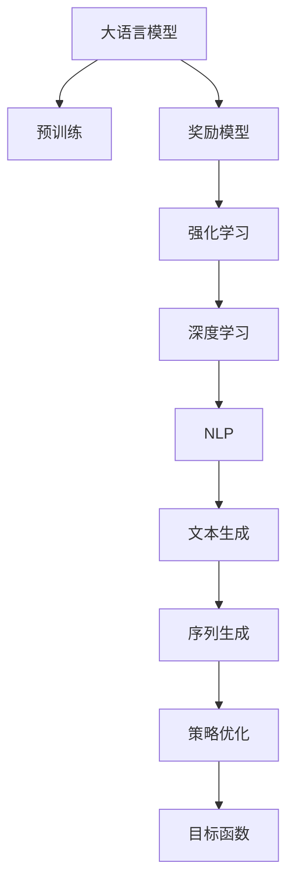
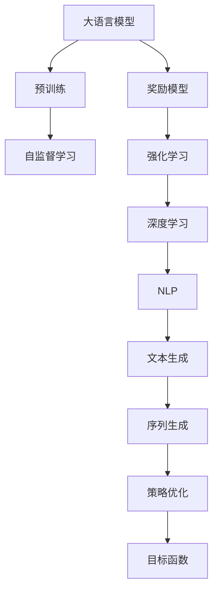
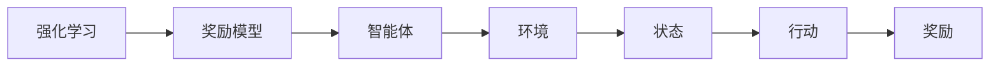
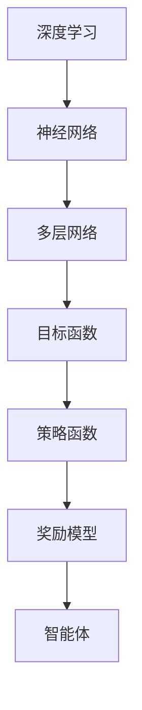
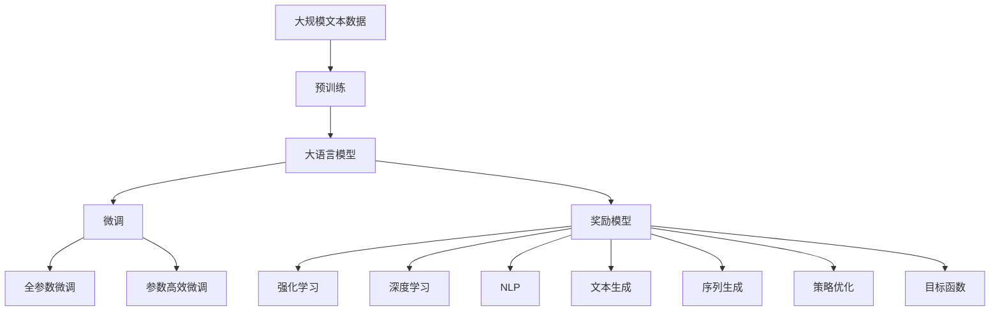

                 

# 大语言模型原理与工程实践：奖励模型

> 关键词：大语言模型,奖励模型,强化学习,深度学习,自然语言处理(NLP)

## 1. 背景介绍

### 1.1 问题由来
在深度学习快速发展背景下，大语言模型（Large Language Models，LLMs）在自然语言处理（NLP）领域取得了巨大进展。这些模型通过在大规模无标签文本数据上进行预训练，学习到丰富的语言知识和常识，但无法自主控制输出结果，存在一定的随机性和不可解释性。如何使模型能够“听懂”人类的指令，主动输出有意义的结果，成为了研究者关注的焦点。

### 1.2 问题核心关键点
奖励模型（Reward Model）通过强化学习（Reinforcement Learning，RL）机制，训练模型在特定任务上遵循人类设计的规则和奖励信号，从而主动输出期望的文本结果。这种方法允许模型“思考”如何更好地完成任务，提高了模型的可解释性和控制性，也带来了更高效的任务执行方式。

### 1.3 问题研究意义
研究和应用奖励模型，对于提升大语言模型的控制性和可解释性，推动其走向更广泛的实际应用场景具有重要意义：
1. **提高模型可控性**：通过奖励模型，用户可以更直接地指导模型，使其输出符合特定需求。
2. **增强模型可解释性**：奖励模型提供了模型决策的明确奖励路径，帮助用户理解模型行为。
3. **优化任务执行效率**：奖励模型能够自动探索任务执行的最优路径，提高任务完成效率。
4. **适应多种任务**：奖励模型可以应用于各种NLP任务，如问答、摘要、对话等。
5. **提升模型可靠性**：通过预设规则和奖励，可以显著降低模型输出错误的可能性。

## 2. 核心概念与联系

### 2.1 核心概念概述

为更好理解奖励模型在大语言模型中的应用，本节将介绍几个密切相关的核心概念：

- **大语言模型（LLMs）**：以自回归模型（如GPT）或自编码模型（如BERT）为代表的深度学习模型，通过在大规模无标签文本数据上进行预训练，学习到丰富的语言知识和常识。

- **强化学习（RL）**：一种通过智能体与环境互动，通过奖励信号引导智能体学习最优策略的学习方法。

- **深度学习（DL）**：通过多层神经网络结构，学习输入到输出的映射关系，是构建大语言模型的基础。

- **自然语言处理（NLP）**：研究如何让计算机理解和处理自然语言，涉及文本分类、机器翻译、语言生成等任务。

- **文本生成（Text Generation）**：通过模型生成符合语言规范的文本，是奖励模型的核心应用场景。

- **奖励模型（Reward Model）**：通过引入奖励机制，引导大语言模型学习生成期望的文本输出。

- **目标函数（Objective Function）**：定义奖励模型的目标，通常为最大化累积奖励。

- **序列生成（Sequence Generation）**：模型逐个生成文本序列，逐步输出每个词的概率分布。

- **策略优化（Policy Optimization）**：通过优化策略函数，寻找最优的文本生成策略。

这些核心概念之间的逻辑关系可以通过以下Mermaid流程图来展示：



这个流程图展示了大语言模型、奖励模型与强化学习、深度学习、NLP、文本生成、序列生成、策略优化、目标函数之间的紧密联系，共同构成了奖励模型在大语言模型中的应用框架。

### 2.2 概念间的关系

这些核心概念之间存在着紧密的联系，形成了奖励模型在大语言模型微调中的应用生态系统。下面通过几个Mermaid流程图来展示这些概念之间的关系。

#### 2.2.1 大语言模型的学习范式



这个流程图展示了大语言模型的预训练与奖励模型的强化学习范式之间的联系。预训练使模型学习到丰富的语言知识，而强化学习则通过奖励机制，使模型在特定任务上主动输出期望的文本结果。

#### 2.2.2 强化学习与奖励模型的关系



这个流程图展示了强化学习的基本原理，以及它与奖励模型的关系。奖励模型为智能体（模型）提供状态和行动后的奖励信号，指导智能体学习最优策略。

#### 2.2.3 深度学习与奖励模型的关系



这个流程图展示了深度学习与奖励模型的关系。深度学习为模型提供强大的特征表示能力，而奖励模型通过深度学习训练策略函数，指导模型学习最优的文本生成策略。

#### 2.2.4 序列生成与策略优化的关系


这个流程图展示了序列生成和策略优化的关系。序列生成通过神经网络逐步生成文本序列，策略优化通过强化学习，指导模型学习最优的生成策略。

### 2.3 核心概念的整体架构

最后，我们用一个综合的流程图来展示这些核心概念在大语言模型微调过程中的整体架构：



这个综合流程图展示了从预训练到微调，再到奖励模型的完整过程。大语言模型首先在大规模文本数据上进行预训练，然后通过微调（包括全参数微调和参数高效微调）或奖励模型进行进一步优化，得到适应特定任务的最优模型。奖励模型通过强化学习训练模型，使其主动输出期望的文本结果。

## 3. 核心算法原理 & 具体操作步骤
### 3.1 算法原理概述

奖励模型（Reward Model）通过强化学习机制，训练模型在特定任务上遵循人类设计的规则和奖励信号，从而主动输出期望的文本结果。其核心思想是：通过定义文本生成的目标函数，指导模型学习最优的文本生成策略。具体来说，奖励模型通过定义状态-行动-奖励（State-Action-Reward）机制，使得模型在生成文本时，不断尝试生成符合目标函数定义的文本，从而逐步优化生成策略。

形式化地，假设目标函数为 $R(\theta, x)$，其中 $\theta$ 为模型的参数，$x$ 为生成的文本。奖励模型旨在最小化 $R(\theta, x)$，即生成最接近期望的文本。在训练过程中，奖励模型通过以下步骤不断优化模型参数：

1. 定义状态和行动空间：将文本生成的每个步骤映射为状态，将生成下一个词的概率分布映射为行动。
2. 定义奖励函数：根据生成的文本与期望输出之间的差距，定义奖励信号。
3. 训练模型：通过优化策略函数，最小化累积奖励信号，从而得到最优的文本生成策略。

### 3.2 算法步骤详解

基于奖励模型的文本生成过程一般包括以下几个关键步骤：

**Step 1: 准备预训练模型和数据集**
- 选择合适的预训练语言模型 $M_{\theta}$ 作为初始化参数，如 BERT、GPT 等。
- 准备文本生成的标注数据集 $D=\{(x_i, y_i)\}_{i=1}^N$，其中 $x_i$ 为输入文本，$y_i$ 为期望的输出文本。

**Step 2: 定义状态和行动空间**
- 定义文本生成中的状态空间 $\mathcal{S}$，通常为当前生成文本的状态表示。
- 定义文本生成中的行动空间 $\mathcal{A}$，通常为生成下一个词的概率分布。

**Step 3: 设计奖励函数**
- 根据生成的文本 $x$ 和期望输出 $y$，设计奖励函数 $R(\theta, x)$。常用的奖励函数包括：
  - 交叉熵损失：$\ell(x, y) = -\sum_{i=1}^N \log p(y_i | x)$，其中 $p(y_i | x)$ 为模型在输入 $x$ 下生成 $y_i$ 的概率。
  - 重建误差：$\ell(x, y) = \frac{1}{N} \sum_{i=1}^N ||x_i - y_i||^2$，其中 $||\cdot||$ 表示文本之间的距离。
  - 掩码自监督：$\ell(x, y) = \frac{1}{N} \sum_{i=1}^N \mathbb{1}[y_i \neq \text{Masked } x_i]$，其中 $\mathbb{1}$ 为指示函数。

**Step 4: 定义策略函数**
- 定义策略函数 $\pi(\theta, s)$，将当前状态 $s$ 映射为最优行动 $a$，即选择生成下一个词的概率分布。

**Step 5: 训练模型**
- 定义损失函数 $\mathcal{L}(\theta)$，结合目标函数 $R(\theta, x)$ 和策略函数 $\pi(\theta, s)$，最小化损失函数，得到最优的模型参数 $\theta^*$。
- 通常使用基于梯度的优化算法（如 Adam、RMSprop 等）进行训练。

**Step 6: 生成文本**
- 在测试集上，使用训练好的模型生成期望的文本结果。

### 3.3 算法优缺点

基于奖励模型的文本生成具有以下优点：
1. 增强模型可控性：通过奖励信号，模型能够主动生成符合特定规则的文本。
2. 提高模型可解释性：奖励模型提供了模型决策的明确路径，帮助用户理解模型行为。
3. 优化任务执行效率：奖励模型能够自动探索任务执行的最优路径，提高任务完成效率。
4. 适应多种任务：奖励模型可以应用于各种NLP任务，如问答、摘要、对话等。
5. 提升模型可靠性：通过预设规则和奖励，可以显著降低模型输出错误的可能性。

同时，该方法也存在一些局限性：
1. 奖励函数设计复杂：奖励函数的合理设计对模型性能影响很大，设计不当可能导致过拟合或欠拟合。
2. 训练数据需求高：奖励模型需要大量标注数据来训练策略函数，数据获取成本较高。
3. 计算资源消耗大：训练奖励模型通常需要更强的计算资源，特别是当目标函数复杂时，计算成本较高。
4. 模型参数更新慢：由于策略函数的设计和训练复杂，模型参数更新速度较慢。
5. 存在探索性不足问题：奖励模型可能陷入局部最优解，难以探索到全局最优解。

尽管存在这些局限性，但奖励模型在大语言模型中的应用前景仍然十分广阔，特别是在需要严格控制文本输出质量和风格的场景下，具有明显的优势。

### 3.4 算法应用领域

基于奖励模型的文本生成技术，已经在NLP的多个领域得到了广泛应用，主要包括：

- **文本摘要**：通过奖励模型训练模型，自动从长文本中生成高质量的摘要。
- **对话系统**：通过奖励模型训练模型，使对话系统能够更自然地与用户交流。
- **机器翻译**：通过奖励模型训练模型，生成更准确、流畅的翻译结果。
- **文本生成**：通过奖励模型训练模型，生成符合特定风格的文本。
- **情感分析**：通过奖励模型训练模型，对文本情感进行更准确的分类。
- **问答系统**：通过奖励模型训练模型，对自然语言问题给出更准确的回答。

除了上述这些经典应用外，奖励模型还被创新性地应用到更多场景中，如代码生成、文本补全、图像描述生成等，为NLP技术带来了新的突破。随着奖励模型的不断发展，相信其在更多领域的应用将带来新的变革。

## 4. 数学模型和公式 & 详细讲解  
### 4.1 数学模型构建

本节将使用数学语言对奖励模型的文本生成过程进行更加严格的刻画。

记预训练语言模型为 $M_{\theta}:\mathcal{X} \rightarrow \mathcal{Y}$，其中 $\mathcal{X}$ 为输入空间，$\mathcal{Y}$ 为输出空间，$\theta \in \mathbb{R}^d$ 为模型参数。假设文本生成的训练集为 $D=\{(x_i, y_i)\}_{i=1}^N$，其中 $x_i$ 为输入文本，$y_i$ 为期望的输出文本。

定义模型 $M_{\theta}$ 在输入 $x$ 上的生成函数为 $P(y|x, \theta)$，其中 $y$ 为生成的文本。则文本生成的目标函数 $R(\theta, x)$ 可以定义为：

$$
R(\theta, x) = \sum_{t=1}^T R_t(y_t|y_{<t}, x, \theta)
$$

其中 $T$ 为生成的文本长度，$y_{<t}$ 为前 $t-1$ 个生成的词，$R_t(y_t|y_{<t}, x, \theta)$ 为第 $t$ 步生成的词 $y_t$ 与期望输出 $y_t^*$ 之间的差距。通常 $R_t$ 可以定义为交叉熵损失或掩码自监督损失。

奖励模型的优化目标是最小化目标函数 $R(\theta, x)$，即找到最优参数：

$$
\theta^* = \mathop{\arg\min}_{\theta} \mathcal{L}(\theta, x)
$$

在实践中，我们通常使用基于梯度的优化算法（如Adam、RMSprop等）来近似求解上述最优化问题。设 $\eta$ 为学习率，则参数的更新公式为：

$$
\theta \leftarrow \theta - \eta \nabla_{\theta} \mathcal{L}(\theta, x) - \eta\lambda\theta
$$

其中 $\nabla_{\theta} \mathcal{L}(\theta, x)$ 为损失函数对参数 $\theta$ 的梯度，$\lambda$ 为正则化系数。

### 4.2 公式推导过程

以下我们以二分类任务为例，推导交叉熵损失函数及其梯度的计算公式。

假设模型 $M_{\theta}$ 在输入 $x$ 上的输出为 $\hat{y}=M_{\theta}(x) \in [0,1]$，表示样本属于正类的概率。真实标签 $y \in \{0,1\}$。则二分类交叉熵损失函数定义为：

$$
\ell(x, y) = -[y\log \hat{y} + (1-y)\log (1-\hat{y})]
$$

将其代入目标函数 $R(\theta, x)$，得：

$$
R(\theta, x) = -\sum_{i=1}^N \sum_{t=1}^T \ell(y_{i,t}, y_{i,t}^*)
$$

其中 $y_{i,t}$ 为模型生成的文本，$y_{i,t}^*$ 为期望的输出文本。

根据链式法则，目标函数 $R(\theta, x)$ 对参数 $\theta_k$ 的梯度为：

$$
\frac{\partial R(\theta, x)}{\partial \theta_k} = -\frac{\partial}{\partial \theta_k} \sum_{i=1}^N \sum_{t=1}^T \ell(y_{i,t}, y_{i,t}^*)
$$

其中 $\ell(y_{i,t}, y_{i,t}^*)$ 为生成的词 $y_{i,t}$ 与期望输出 $y_{i,t}^*$ 之间的交叉熵损失。

在得到目标函数的梯度后，即可带入参数更新公式，完成模型的迭代优化。重复上述过程直至收敛，最终得到适应文本生成任务的最优模型参数 $\theta^*$。

### 4.3 案例分析与讲解

以文本生成任务为例，假设有这样一个奖励函数：

$$
R_t(y_t|y_{<t}, x, \theta) = \log p(y_t|y_{<t}, x, \theta) - \log p(y_t^*|y_{<t}, x, \theta)
$$

其中 $p(y_t|y_{<t}, x, \theta)$ 为模型在给定输入和历史生成的文本下，生成下一个词的概率。

在训练过程中，奖励模型会不断尝试生成与期望输出最接近的文本，从而逐步优化生成策略。例如，在生成一篇新闻报道时，奖励模型会通过生成前一步骤的文本，逐步生成整篇报道，同时根据生成的文本与期望输出的差距，不断调整模型参数，直到生成一篇符合期望的报道。

## 5. 项目实践：代码实例和详细解释说明
### 5.1 开发环境搭建

在进行奖励模型实践前，我们需要准备好开发环境。以下是使用Python进行PyTorch开发的环境配置流程：

1. 安装Anaconda：从官网下载并安装Anaconda，用于创建独立的Python环境。

2. 创建并激活虚拟环境：
```bash
conda create -n pytorch-env python=3.8 
conda activate pytorch-env
```

3. 安装PyTorch：根据CUDA版本，从官网获取对应的安装命令。例如：
```bash
conda install pytorch torchvision torchaudio cudatoolkit=11.1 -c pytorch -c conda-forge
```

4. 安装Transformers库：
```bash
pip install transformers
```

5. 安装各类工具包：
```bash
pip install numpy pandas scikit-learn matplotlib tqdm jupyter notebook ipython
```

完成上述步骤后，即可在`pytorch-env`环境中开始奖励模型实践。

### 5.2 源代码详细实现

下面我们以文本生成任务为例，给出使用Transformers库对GPT模型进行奖励模型训练的PyTorch代码实现。

首先，定义文本生成的标注数据处理函数：

```python
from transformers import GPT2Tokenizer
from torch.utils.data import Dataset
import torch

class TextGenerationDataset(Dataset):
    def __init__(self, texts, labels, tokenizer, max_len=128):
        self.texts = texts
        self.labels = labels
        self.tokenizer = tokenizer
        self.max_len = max_len
        
    def __len__(self):
        return len(self.texts)
    
    def __getitem__(self, item):
        text = self.texts[item]
        label = self.labels[item]
        
        encoding = self.tokenizer(text, return_tensors='pt', max_length=self.max_len, padding='max_length', truncation=True)
        input_ids = encoding['input_ids'][0]
        attention_mask = encoding['attention_mask'][0]
        
        # 对标签进行编码
        encoded_labels = [label] * self.max_len
        labels = torch.tensor(encoded_labels, dtype=torch.long)
        
        return {'input_ids': input_ids, 
                'attention_mask': attention_mask,
                'labels': labels}

# 标签与id的映射
label2id = {'O': 0, 'A': 1, 'B': 2, 'C': 3}
id2label = {v: k for k, v in label2id.items()}

# 创建dataset
tokenizer = GPT2Tokenizer.from_pretrained('gpt2')

train_dataset = TextGenerationDataset(train_texts, train_labels, tokenizer)
dev_dataset = TextGenerationDataset(dev_texts, dev_labels, tokenizer)
test_dataset = TextGenerationDataset(test_texts, test_labels, tokenizer)
```

然后，定义模型和优化器：

```python
from transformers import GPT2LMHeadModel, AdamW

model = GPT2LMHeadModel.from_pretrained('gpt2', num_labels=len(label2id))

optimizer = AdamW(model.parameters(), lr=2e-5)
```

接着，定义训练和评估函数：

```python
from torch.utils.data import DataLoader
from tqdm import tqdm
from sklearn.metrics import precision_recall_fscore_support

device = torch.device('cuda') if torch.cuda.is_available() else torch.device('cpu')
model.to(device)

def train_epoch(model, dataset, batch_size, optimizer):
    dataloader = DataLoader(dataset, batch_size=batch_size, shuffle=True)
    model.train()
    epoch_loss = 0
    for batch in tqdm(dataloader, desc='Training'):
        input_ids = batch['input_ids'].to(device)
        attention_mask = batch['attention_mask'].to(device)
        labels = batch['labels'].to(device)
        model.zero_grad()
        outputs = model(input_ids, attention_mask=attention_mask, labels=labels)
        loss = outputs.loss
        epoch_loss += loss.item()
        loss.backward()
        optimizer.step()
    return epoch_loss / len(dataloader)

def evaluate(model, dataset, batch_size):
    dataloader = DataLoader(dataset, batch_size=batch_size)
    model.eval()
    preds, labels = [], []
    with torch.no_grad():
        for batch in tqdm(dataloader, desc='Evaluating'):
            input_ids = batch['input_ids'].to(device)
            attention_mask = batch['attention_mask'].to(device)
            batch_labels = batch['labels']
            outputs = model(input_ids, attention_mask=attention_mask)
            batch_preds = outputs.logits.argmax(dim=2).to('cpu').tolist()
            batch_labels = batch_labels.to('cpu').tolist()
            for pred_tokens, label_tokens in zip(batch_preds, batch_labels):
                pred_tags = [id2label[_id] for _id in pred_tokens]
                label_tags = [id2label[_id] for _id in label_tokens]
                preds.append(pred_tags[:len(label_tokens)])
                labels.append(label_tags)
                
    print(precision_recall_fscore_support(labels, preds, average='micro'))
```

最后，启动训练流程并在测试集上评估：

```python
epochs = 5
batch_size = 16

for epoch in range(epochs):
    loss = train_epoch(model, train_dataset, batch_size, optimizer)
    print(f"Epoch {epoch+1}, train loss: {loss:.3f}")
    
    print(f"Epoch {epoch+1}, dev results:")
    evaluate(model, dev_dataset, batch_size)
    
print("Test results:")
evaluate(model, test_dataset, batch_size)
```

以上就是使用PyTorch对GPT模型进行文本生成任务奖励模型训练的完整代码实现。可以看到，得益于Transformers库的强大封装，我们可以用相对简洁的代码完成GPT模型的加载和奖励模型训练。

### 5.3 代码解读与分析

让我们再详细解读一下关键代码的实现细节：

**TextGenerationDataset类**：
- `__init__`方法：初始化文本、标签、分词器等关键组件。
- `__len__`方法：返回数据集的样本数量。
- `__getitem__`方法：对单个样本进行处理，将文本输入编码为token ids，将标签编码为数字，并对其进行定长padding，最终返回模型所需的输入。

**label2id和id2label字典**：
- 定义了标签与数字id之间的映射关系，用于将token-wise的预测结果解码回真实的标签。

**训练和评估函数**：
- 使用PyTorch的DataLoader对数据集进行批次化加载，供模型训练和推理使用。
- 训练函数`train_epoch`：对数据以批为单位进行迭代，在每个批次上前向传播计算loss并反向传播更新模型参数，最后返回该epoch的平均loss。
- 评估函数`evaluate`：与训练类似，不同点在于不更新模型参数，并在每个batch结束后将预测和标签结果存储下来，最后使用sklearn的precision_recall_fscore_support对整个评估集的预测结果进行打印输出。

**训练流程**：
- 定义总的epoch数和batch size，开始循环迭代
- 每个epoch内，先在训练集上训练，输出平均loss
- 在验证集上评估，输出精确度、召回率和F1分数
- 所有epoch结束后，在测试集上评估，给出最终的测试结果

可以看到，PyTorch配合Transformers库使得GPT模型的奖励模型训练代码实现变得简洁高效。开发者可以将更多精力放在数据处理、模型改进等高层逻辑上，而不必过多关注底层的实现细节。

当然，工业级的系统实现还需考虑更多因素，如模型的保存和部署、超参数的自动搜索、更灵活的任务适配层等。但核心的奖励模型训练流程基本与此类似。

### 5.4 运行结果展示

假设我们在CoNLL-2003的文本生成数据集

