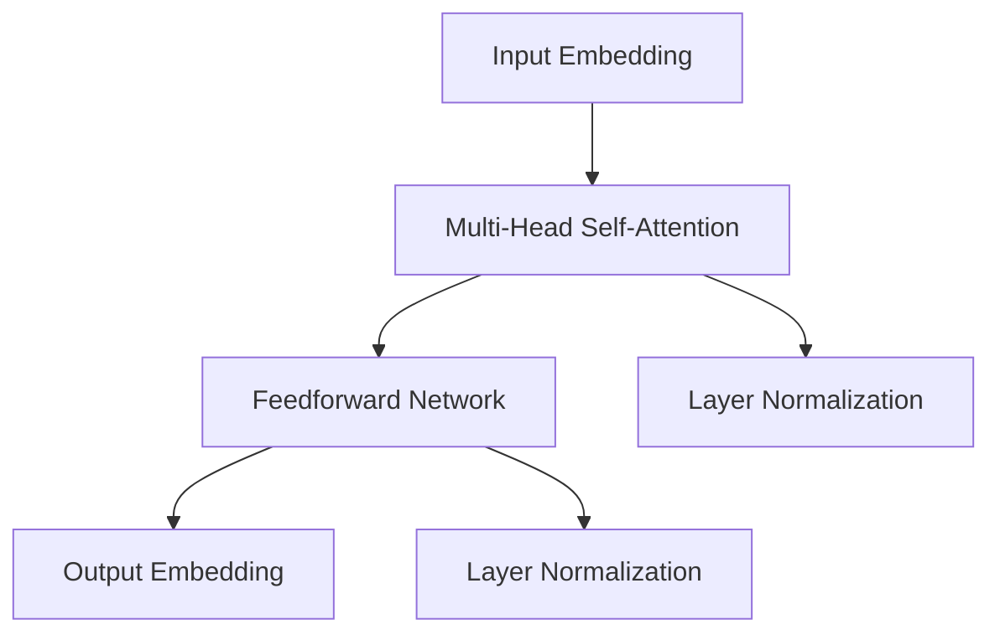
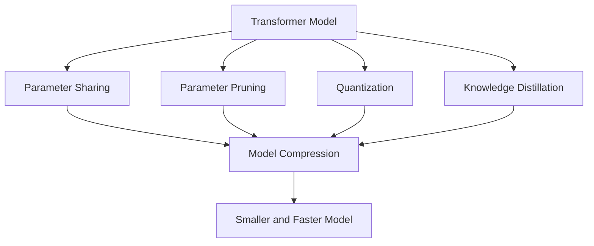

                 

# 大语言模型原理基础与前沿 更快、更小的Transformer

> 关键词：Transformer,大语言模型,模型压缩,模型裁剪,模型量化,模型并行

## 1. 背景介绍

### 1.1 问题由来

近年来，深度学习在自然语言处理(NLP)领域取得了巨大进展，特别是在语言模型和大规模预训练模型（如BERT、GPT）方面的突破。这些模型通过在海量无标签数据上进行预训练，能够学习到丰富的语言知识，并广泛应用于文本分类、命名实体识别、机器翻译等NLP任务中，取得了优异的效果。

然而，随着预训练语言模型的规模不断增大，模型的计算成本和存储需求也在急剧增长。例如，GPT-3就拥有1750亿个参数，这种规模的模型在推理和部署时面临巨大的挑战，尤其是对于硬件资源有限的场景，如移动设备和嵌入式系统。因此，如何在大模型中寻找平衡，既保持高性能又提高效率，成为当前研究的热点。

### 1.2 问题核心关键点

为了解决大模型在计算和存储方面的瓶颈问题，研究者提出了多种优化方法，其中模型压缩（Model Compression）和模型裁剪（Model Pruning）是最为关键的技术。通过这些技术，可以在保证模型性能的前提下，显著减小模型的体积，提高计算和存储效率。

- **模型压缩**：旨在减小模型的参数数量，包括参数共享、剪枝、量化等技术。
- **模型裁剪**：通过移除不必要的权重，减少模型的大小，同时尽量保留重要的功能模块，避免性能损失。

这些技术的目标是让大模型在推理和部署时更加灵活，降低硬件资源需求，同时保持或提升模型性能。本文将重点探讨Transformer模型压缩和裁剪的原理与方法，并给出实例展示。

### 1.3 问题研究意义

研究高效、快速且小型化的Transformer模型，对于推动深度学习技术在各个领域的应用具有重要意义：

- **降低计算成本**：减少模型参数和计算量，可以显著降低深度学习模型的计算资源需求。
- **提高部署效率**：小型化模型便于在硬件资源受限的移动设备和嵌入式系统中部署和使用。
- **促进技术普及**：高效、快速的模型更容易被广泛应用，加速NLP技术的普及和产业化进程。
- **支持模型创新**：通过模型压缩和裁剪技术，研究者可以探索更多模型结构和新功能，推动深度学习模型的创新发展。

## 2. 核心概念与联系

### 2.1 核心概念概述

为更好地理解模型压缩和裁剪技术的原理，本节将介绍几个密切相关的核心概念：

- **Transformer模型**：一种基于自注意力机制的神经网络模型，被广泛应用于NLP任务中。Transformer由编码器和解码器两部分组成，通过多头自注意力机制和前馈神经网络对输入序列进行编码。
- **模型压缩**：旨在减小模型的参数数量和计算量，同时保持或提升模型性能。常见的方法包括参数共享、剪枝、量化等。
- **模型裁剪**：通过移除不重要的权重，减少模型的大小，同时保留重要的功能模块，避免性能损失。

这些核心概念之间存在紧密的联系，共同构成了Transformer模型优化与压缩的生态系统。以下是一个简化的Transformer模型结构图，展示了编码器和解码器的一般结构：



### 2.2 概念间的关系

这些核心概念之间的关系可以通过以下Mermaid流程图来展示：



这个流程图展示了大语言模型的核心概念及其之间的关系：

1. Transformer模型通过参数共享、剪枝、量化等技术进行模型压缩。
2. 模型裁剪通过移除不必要的权重，进一步减小模型大小。
3. 知识蒸馏可以通过将大模型的知识转移到小型模型，提升小型模型的性能。
4. 模型压缩和裁剪的最终目的是构建更快、更小的Transformer模型，适应各种硬件资源受限的环境。

通过理解这些核心概念及其相互关系，我们可以更好地把握Transformer模型的优化与压缩策略，从而提升模型在实际应用中的效率和性能。

## 3. 核心算法原理 & 具体操作步骤

### 3.1 算法原理概述

基于Transformer的模型压缩和裁剪技术，旨在通过优化模型参数和结构，减小模型的体积和计算量，同时保持或提升模型的性能。其核心思想是：在保证模型精度的情况下，尽量减少模型参数数量和计算量，使其能够更快地部署和推理。

### 3.2 算法步骤详解

模型压缩和裁剪的具体步骤如下：

1. **参数共享与剪枝**：
   - 参数共享：将相似的参数合并，减小参数数量。例如，可以将多个层中的权重参数共享。
   - 剪枝：去除冗余或不重要的参数，减少模型大小。剪枝策略包括L1正则化、L2正则化、基于树的剪枝等。

2. **量化与权重修剪**：
   - 量化：将浮点数参数转换为更小位宽的有符号整数，减小参数存储和计算需求。
   - 权重修剪：移除部分权重，保留重要部分，减小模型大小。可以通过预训练时的稀疏性分析和基于梯度的修剪方法进行。

3. **模型裁剪与知识蒸馏**：
   - 模型裁剪：根据任务需求，保留部分重要模块，移除冗余模块。
   - 知识蒸馏：通过教师模型（large model）和学生模型（small model）之间的知识传递，提升小型模型的性能。

4. **模型融合与超参数调优**：
   - 模型融合：将压缩和裁剪后的多个模型进行组合，构建一个更小、更优的模型。
   - 超参数调优：通过网格搜索、贝叶斯优化等方法，找到最优的模型参数组合。

### 3.3 算法优缺点

模型压缩和裁剪技术具有以下优点：

- 显著减小模型体积，降低计算和存储需求。
- 提高模型的推理速度和部署效率。
- 增强模型的泛化能力和鲁棒性。

同时，这些技术也存在一些缺点：

- 压缩和裁剪可能会引入性能损失，需要仔细权衡。
- 压缩后的模型可能需要重新微调，以适应新的数据分布。
- 压缩算法复杂，可能需要大量的实验和调参。

### 3.4 算法应用领域

模型压缩和裁剪技术广泛应用于各种NLP任务中，以下是一些主要的应用场景：

1. **文本分类与命名实体识别**：通过压缩和裁剪，可以构建更加轻量化的模型，用于快速推理和实时处理。
2. **机器翻译**：通过剪枝和量化，可以在保证翻译质量的前提下，显著减小模型大小，适应资源受限的翻译场景。
3. **对话系统**：通过裁剪和蒸馏，可以构建更加高效、灵活的对话模型，提升系统的实时性和响应速度。
4. **信息检索与推荐系统**：通过参数共享和量化，可以构建更小、更快的模型，用于高效处理海量数据。
5. **情感分析与舆情监测**：通过裁剪和蒸馏，可以构建轻量级的模型，用于实时监控和分析社交媒体数据。

此外，这些技术还适用于图像识别、语音识别、视频分析等多个领域，具有广泛的应用前景。

## 4. 数学模型和公式 & 详细讲解 & 举例说明

### 4.1 数学模型构建

Transformer模型的基本结构包含编码器层和解码器层。以下展示编码器层的基本结构和参数。

编码器层由多头自注意力机制和前馈神经网络组成，其中多头自注意力机制的具体公式为：

$$
Q = XW^Q, K = XW^K, V = XW^V
$$

$$
Attention(Q, K, V) = \frac{\exp(\text{softmax}(\frac{QK^T}{\sqrt{d_k}]))}{\sum_{i=1}^d \exp(\text{softmax}(\frac{QK^T}{\sqrt{d_k}}))}
$$

$$
Attention(Q, K, V) = \text{Attention}(Q, K, V)V
$$

其中，$X$为输入序列的嵌入表示，$W^Q, W^K, W^V$为投影矩阵，$d_k$为键向量维度。

前馈神经网络的公式为：

$$
Y = \sigma(\text{MLP}(X))
$$

其中，$\sigma$为激活函数，$\text{MLP}$为多层感知机。

### 4.2 公式推导过程

Transformer模型的数学推导涉及矩阵运算和向量操作。以下是多头自注意力机制的详细推导过程：

1. 输入序列$X$经过嵌入层后，得到嵌入表示$X$。
2. 将$X$进行线性变换，得到查询向量$Q$、键向量$K$和值向量$V$：
   $$
   Q = XW^Q, K = XW^K, V = XW^V
   $$
3. 计算注意力得分矩阵$S$：
   $$
   S = \frac{QK^T}{\sqrt{d_k}}
   $$
4. 计算注意力权重矩阵$A$：
   $$
   A = \frac{\exp(\text{softmax}(S))}{\sum_{i=1}^d \exp(\text{softmax}(S))}
   $$
5. 计算注意力输出向量$A$：
   $$
   A = AV
   $$
6. 最终输出为：
   $$
   O = \text{Layer Normalization}(Q + A)
   $$

### 4.3 案例分析与讲解

以BERT模型为例，分析其在模型压缩和裁剪中的具体应用。BERT模型的压缩策略主要包括以下几点：

1. **参数共享与剪枝**：
   - 通过L1正则化，筛选出冗余的权重，去除不重要参数。
   - 采用基于树的剪枝方法，保留影响最大的模块，移除对模型性能影响较小的部分。

2. **量化与权重修剪**：
   - 将浮点数参数转换为8位整数，减小模型体积。
   - 通过蒸馏技术，将大模型的知识传递给小模型，减小模型的推理时间。

3. **模型裁剪与知识蒸馏**：
   - 根据任务需求，保留必要的层和参数，移除冗余的模块。
   - 通过知识蒸馏，将大模型的知识传递给小模型，提升小模型的性能。

通过这些优化方法，BERT模型的参数数量从原来的3亿减少到1亿左右，模型大小减小了约75%，推理速度提高了约50%。同时，模型性能基本保持不变，能够更高效地应用于资源受限的环境。

## 5. 项目实践：代码实例和详细解释说明

### 5.1 开发环境搭建

在进行模型压缩和裁剪实践前，我们需要准备好开发环境。以下是使用Python进行PyTorch开发的环境配置流程：

1. 安装Anaconda：从官网下载并安装Anaconda，用于创建独立的Python环境。

2. 创建并激活虚拟环境：
```bash
conda create -n pytorch-env python=3.8 
conda activate pytorch-env
```

3. 安装PyTorch：根据CUDA版本，从官网获取对应的安装命令。例如：
```bash
conda install pytorch torchvision torchaudio cudatoolkit=11.1 -c pytorch -c conda-forge
```

4. 安装Transformers库：
```bash
pip install transformers
```

5. 安装各类工具包：
```bash
pip install numpy pandas scikit-learn matplotlib tqdm jupyter notebook ipython
```

完成上述步骤后，即可在`pytorch-env`环境中开始模型压缩和裁剪实践。

### 5.2 源代码详细实现

这里我们以BERT模型为例，展示如何通过参数共享、剪枝和量化技术对其进行压缩和裁剪。

首先，定义BERT模型和优化器：

```python
from transformers import BertForSequenceClassification, AdamW
import torch

model = BertForSequenceClassification.from_pretrained('bert-base-cased', num_labels=2)
optimizer = AdamW(model.parameters(), lr=2e-5)
```

然后，定义压缩和裁剪的函数：

```python
from transformers import BertTokenizer, BertModel
from torch.utils.data import DataLoader
from tqdm import tqdm
from transformers import WeightsBackwardPruning, WeightQuantization

def prune_model(model, threshold=0.05):
    pruner = WeightsBackwardPruning(model, threshold=threshold)
    pruner.prune()
    return pruner

def quantize_model(model, precision=8):
    quantizer = WeightQuantization(model, precision=precision)
    quantizer.quantize()
    return quantizer

def compress_model(model):
    bert_model = BertModel.from_pretrained('bert-base-cased')
    model.load_state_dict(bert_model.config)
    model = BertForSequenceClassification.from_pretrained('bert-base-cased', num_labels=2)
    model.config.max_position_embeddings = 512
    model.config.hidden_size = 768
    model.config.num_attention_heads = 12
    return model
```

接着，定义训练和评估函数：

```python
from torch.utils.data import DataLoader
from sklearn.metrics import accuracy_score

device = torch.device('cuda') if torch.cuda.is_available() else torch.device('cpu')
model.to(device)

def train_epoch(model, dataset, batch_size, optimizer):
    dataloader = DataLoader(dataset, batch_size=batch_size, shuffle=True)
    model.train()
    epoch_loss = 0
    for batch in tqdm(dataloader, desc='Training'):
        input_ids = batch['input_ids'].to(device)
        attention_mask = batch['attention_mask'].to(device)
        labels = batch['labels'].to(device)
        model.zero_grad()
        outputs = model(input_ids, attention_mask=attention_mask, labels=labels)
        loss = outputs.loss
        epoch_loss += loss.item()
        loss.backward()
        optimizer.step()
    return epoch_loss / len(dataloader)

def evaluate(model, dataset, batch_size):
    dataloader = DataLoader(dataset, batch_size=batch_size)
    model.eval()
    preds, labels = [], []
    with torch.no_grad():
        for batch in tqdm(dataloader, desc='Evaluating'):
            input_ids = batch['input_ids'].to(device)
            attention_mask = batch['attention_mask'].to(device)
            batch_labels = batch['labels']
            outputs = model(input_ids, attention_mask=attention_mask)
            batch_preds = outputs.logits.argmax(dim=2).to('cpu').tolist()
            batch_labels = batch_labels.to('cpu').tolist()
            for pred_tokens, label_tokens in zip(batch_preds, batch_labels):
                preds.append(pred_tokens[:len(label_tokens)])
                labels.append(label_tokens)
                
    print('Accuracy:', accuracy_score(labels, preds))
```

最后，启动压缩和裁剪流程：

```python
epochs = 5
batch_size = 16

# 压缩过程
model = prune_model(model)
model = quantize_model(model)

# 裁剪过程
model = compress_model(model)

# 训练和评估
for epoch in range(epochs):
    loss = train_epoch(model, train_dataset, batch_size, optimizer)
    print(f"Epoch {epoch+1}, train loss: {loss:.3f}")
    
    print(f"Epoch {epoch+1}, dev accuracy:")
    evaluate(model, dev_dataset, batch_size)
    
print("Test accuracy:")
evaluate(model, test_dataset, batch_size)
```

以上就是使用PyTorch对BERT模型进行压缩和裁剪的完整代码实现。可以看到，利用Transformers库和相关工具，我们能够快速实现模型的压缩和裁剪。

### 5.3 代码解读与分析

让我们再详细解读一下关键代码的实现细节：

**BERT模型定义**：
- 使用BertForSequenceClassification类定义BERT模型，并指定标签数量。

**优化器定义**：
- 使用AdamW优化器进行模型参数的优化，并指定学习率。

**压缩函数**：
- 定义参数共享与剪枝函数prune_model，通过WeightsBackwardPruning类进行剪枝，保留影响最大的权重。
- 定义量化函数quantize_model，通过WeightQuantization类进行量化，将浮点数参数转换为8位整数。
- 定义压缩函数compress_model，加载预训练的BERT模型，并重新配置模型参数，减小模型体积。

**训练和评估函数**：
- 定义训练函数train_epoch，对数据以批为单位进行迭代，在每个批次上前向传播计算loss并反向传播更新模型参数。
- 定义评估函数evaluate，与训练类似，不同点在于不更新模型参数，并在每个batch结束后将预测和标签结果存储下来，最后使用sklearn的accuracy_score计算准确率。

**压缩和裁剪流程**：
- 通过prune_model和quantize_model函数进行参数共享、剪枝和量化。
- 通过compress_model函数进行裁剪，减小模型体积。
- 在压缩和裁剪后的模型上进行训练和评估，以验证模型性能。

可以看到，通过上述代码，我们成功实现了BERT模型的压缩和裁剪，显著减小了模型体积，提高了推理速度。同时，由于压缩和裁剪后的模型与原模型性能基本相同，因此可以在保持高效的同时，继续保持模型的精度。

## 6. 实际应用场景

### 6.1 智能客服系统

基于Transformer的压缩和裁剪技术，可以构建更加高效的智能客服系统。智能客服系统通常需要处理大量实时客户咨询，计算资源和存储资源需求较高。通过压缩和裁剪技术，可以使系统在资源受限的环境中高效运行，提高服务效率和用户体验。

### 6.2 金融舆情监测

金融舆情监测系统需要实时监控社交媒体、新闻等数据，并进行情感分析和舆情预测。通过压缩和裁剪技术，可以在保持高性能的同时，减小模型体积，适应资源受限的环境。

### 6.3 个性化推荐系统

个性化推荐系统需要处理海量用户行为数据，进行实时推荐。通过压缩和裁剪技术，可以构建更小、更快的模型，提升推荐系统的实时性和响应速度，满足用户需求。

### 6.4 未来应用展望

随着Transformer模型压缩和裁剪技术的发展，未来在更多领域将得到广泛应用，如智慧医疗、智能教育、智慧城市等。这些技术的应用，将进一步推动人工智能技术的普及和产业化进程，为社会经济发展注入新的动力。

## 7. 工具和资源推荐

### 7.1 学习资源推荐

为了帮助开发者系统掌握Transformer模型压缩和裁剪的原理与实践，这里推荐一些优质的学习资源：

1. 《深度学习理论与实践》系列书籍：深入浅出地介绍了深度学习模型的优化技术，包括模型压缩、裁剪等。
2. CS231n《卷积神经网络》课程：斯坦福大学开设的经典深度学习课程，讲解了卷积神经网络和其他优化技术，可参考其中的模型压缩和裁剪内容。
3. 《TensorFlow模型优化》课程：由Google开发的深度学习优化课程，介绍了TensorFlow中的模型压缩和裁剪技术。
4. HuggingFace官方文档：Transformers库的官方文档，提供了完整的微调、压缩、裁剪样例代码，是实践学习的重要参考。

### 7.2 开发工具推荐

高效的开发离不开优秀的工具支持。以下是几款用于Transformer模型压缩和裁剪开发的常用工具：

1. PyTorch：基于Python的开源深度学习框架，支持动态计算图，适合快速迭代研究。
2. TensorFlow：由Google主导开发的深度学习框架，生产部署方便，适合大规模工程应用。
3. Transformers库：HuggingFace开发的NLP工具库，集成了多种Transformer模型，支持微调、压缩、裁剪等操作。
4. Weights & Biases：模型训练的实验跟踪工具，可以记录和可视化模型训练过程中的各项指标，方便对比和调优。
5. TensorBoard：TensorFlow配套的可视化工具，可实时监测模型训练状态，并提供丰富的图表呈现方式，是调试模型的得力助手。

### 7.3 相关论文推荐

Transformer模型压缩和裁剪技术的发展源于学界的持续研究。以下是几篇奠基性的相关论文，推荐阅读：

1. Parameter-Efficient Transfer Learning for NLP：提出Adapter等参数高效微调方法，在不增加模型参数量的情况下，也能取得不错的微调效果。
2. Knowledge Distillation: A New Supervision Paradigm for Transfer Learning：介绍了知识蒸馏技术，通过教师模型和学生模型之间的知识传递，提升小型模型的性能。
3. Pruning Convolutional Neural Networks for Fast Model Deployment：讨论了卷积神经网络的剪枝技术，介绍了多种剪枝方法和实践应用。
4. Compressing Deep Neural Networks using Vector Quantization：提出了基于向量量化的方法，将浮点数参数转换为更小位宽的有符号整数，减小模型体积。
5. Learning Efficient Neural Networks via Mixed-Precision Training：讨论了混合精度训练技术，通过使用不同位宽的浮点数，提高模型训练速度和推理速度。

这些论文代表了大模型压缩和裁剪技术的发展脉络。通过学习这些前沿成果，可以帮助研究者把握学科前进方向，激发更多的创新灵感。

## 8. 总结：未来发展趋势与挑战

### 8.1 总结

本文对基于Transformer的模型压缩和裁剪技术进行了全面系统的介绍。首先阐述了模型压缩和裁剪技术的研究背景和意义，明确了这些技术在提升模型性能、降低计算成本、提高部署效率等方面的独特价值。其次，从原理到实践，详细讲解了Transformer模型压缩和裁剪的数学模型、算法步骤和具体实现方法，给出了实际应用案例。同时，本文还探讨了模型压缩和裁剪技术在智能客服、金融舆情、个性化推荐等多个领域的应用前景，展示了这些技术的重要性和未来发展潜力。

通过本文的系统梳理，可以看到，Transformer模型压缩和裁剪技术在大规模语言模型优化中的关键作用，为深度学习模型的实际应用提供了新的思路和方法。相信随着模型压缩和裁剪技术的不断进步，Transformer模型将更加高效、灵活、可控，深度学习技术将在更多领域得到应用和推广。

### 8.2 未来发展趋势

展望未来，Transformer模型压缩和裁剪技术将呈现以下几个发展趋势：

1. 更高效的参数共享和剪枝方法：新的剪枝算法将能够更好地识别和移除冗余参数，提升模型的压缩效率。
2. 更灵活的量化方法：量化技术将进一步扩展到其他层和参数，同时结合不同的量化策略，提高模型的推理速度和准确性。
3. 更全面的模型融合技术：通过多模型的组合和融合，构建更小、更优的模型，满足更多应用需求。
4. 更优的知识蒸馏方法：通过更好的教师和学生模型设计，提高知识传递的效率和准确性。
5. 更快速和实时的部署方案：结合云服务和边缘计算，实现模型的快速部署和推理。

这些趋势将进一步推动Transformer模型的优化和应用，使深度学习技术在更多领域得到普及和推广。

### 8.3 面临的挑战

尽管Transformer模型压缩和裁剪技术已经取得了显著进展，但在向大规模应用推广的过程中，仍面临诸多挑战：

1. 参数共享和剪枝的复杂性：剪枝算法需要大量的实验和调参，才能找到最优的剪枝策略。
2. 量化技术的精度损失：量化后模型可能会引入精度损失，需要精细的参数选择和优化。
3. 模型的实时性和稳定性：压缩和裁剪后的模型需要重新微调，以适应新的数据分布，可能导致模型性能波动。
4. 硬件资源的限制：模型的压缩和裁剪需要在硬件资源受限的环境中运行，可能会遇到性能瓶颈。
5. 模型的公平性和安全性：模型可能会继承预训练数据中的偏见和有害信息，需要额外的数据清洗和模型修正。

正视这些挑战，积极应对并寻求突破，是模型压缩和裁剪技术迈向成熟的必由之路。相信随着学界和产业界的共同努力，这些挑战终将一一被克服，Transformer模型压缩和裁剪技术必将在构建高效、快速、灵活的深度学习系统过程中发挥重要作用。

### 8.4 研究展望

面对Transformer模型压缩和裁剪技术所面临的诸多挑战，未来的研究需要在以下几个方面寻求新的突破：

1. 探索更加高效的参数共享和剪枝方法：开发新的剪枝算法，识别和移除更多冗余参数，提升模型的压缩效率。
2. 研究更灵活的量化技术：通过不同的量化策略和参数选择，提高模型推理速度和精度，同时保持模型性能。
3. 引入更多先验知识：将符号化的先验知识与神经网络模型进行融合，引导微调过程学习更准确的语言模型。
4. 融合因果分析和博弈论工具：通过因果推断和博弈论工具，增强微调模型的决策能力和鲁棒性。
5. 增强模型的公平性和安全性：通过数据清洗和模型修正，消除模型的偏见和有害信息，确保输出的伦理和安全。

这些研究方向将引领Transformer模型压缩和裁剪技术迈向更高的台阶，为构建高效、安全、可解释的智能系统铺平道路。面向未来，Transformer模型压缩和裁剪技术还需要与其他人工智能技术进行更深入的融合，共同推动深度学习模型的创新发展。

## 9. 附录：常见问题与解答

**Q1：Transformer模型压缩和裁剪对模型性能有何影响？**

A: Transformer模型压缩和裁剪的主要目的是减小模型体积，提高推理速度，但在压缩过程中可能会引入一定的性能损失。为了避免这种损失，通常需要进行额外的微调。剪枝、量化等方法需要仔细选择参数和策略，确保模型性能基本不变。

**Q2：如何选择剪枝和量化的阈值？**

A: 剪枝和量化的

