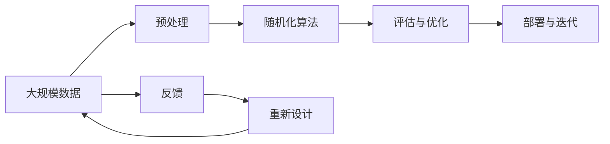

                 

# 像数学家一样思考：随机化原则

> 关键词：随机化, 概率论, 统计学, 机器学习, 数据科学, 算法设计与分析

## 1. 背景介绍

### 1.1 问题由来
数学家以逻辑严谨著称，而随机化方法近年来在计算机科学和数据科学中大放异彩。在众多数学家发明的算法中，随机化成为现代计算机科学的支柱之一。然而，关于随机化原理和应用的理论仍然颇具挑战性。本文将详细阐述随机化算法的基本概念和核心思想，并结合实际项目，展示随机化原则如何指导算法设计和优化。

### 1.2 问题核心关键点
1. **随机化算法**：
   - 随机化算法利用随机性作为决策过程的一部分，通常以较低的计算复杂度获得优化的结果。
   - 经典例子如快速排序（QuickSort）和随机漫步（Random Walk）。

2. **概率论与统计学**：
   - 概率论为随机化算法提供理论支持，帮助理解随机性的含义和作用。
   - 统计学提供了估计和推断数据分布的方法，在随机化算法中起到关键作用。

3. **算法设计与分析**：
   - 算法设计与分析是计算机科学的核心，包括时间复杂度、空间复杂度和正确性等关键指标。
   - 在随机化算法中，正确性通常指期望的正确性，即算法在多次运行中的平均表现。

### 1.3 问题研究意义
随机化算法的成功实践不仅展示了数学原理在计算机科学中的强大应用，也为数据科学和机器学习带来了深远影响。例如，随机化被广泛应用于分类算法、聚类算法、推荐系统等任务中，使得算法在处理大规模数据时更为高效和准确。

通过深入理解随机化算法的基本原理，可以更好地把握算法设计的核心思想，进而提升算法开发和优化的能力。

## 2. 核心概念与联系

### 2.1 核心概念概述

为更全面地理解随机化算法，本文首先概述几个核心概念：

1. **随机化算法**：
   - 随机化算法在决策过程中引入随机性，旨在优化计算复杂度和获得期望的性能提升。
   - 经典的随机化算法包括快速排序、随机漫步、蒙特卡洛模拟等。

2. **概率论**：
   - 概率论研究随机事件的概率和分布规律，是随机化算法的基础。
   - 常见的概率分布包括正态分布、泊松分布和二项分布等。

3. **统计学**：
   - 统计学使用数据推断总体特征，为随机化算法提供数据驱动的优化依据。
   - 常见的统计学方法包括方差分析、回归分析和假设检验等。

4. **算法设计与分析**：
   - 算法设计与分析专注于如何构造和优化算法，以便在给定的时间和空间限制下达到最优效果。
   - 常见的分析方法包括时间复杂度分析、空间复杂度分析和正确性证明等。

这些概念通过随机化算法这一核心环节紧密联系，共同构成了现代数据科学和计算机科学的重要组成部分。

### 2.2 概念间的关系

通过以下Mermaid流程图，展示这些核心概念之间的联系：


这个流程图展示了随机化算法与其他数学概念之间的逻辑关系：

1. 随机化算法引入概率论中的随机性，并通过统计学方法评估其性能。
2. 算法设计与分析为随机化算法提供理论指导和优化建议。

### 2.3 核心概念的整体架构

为了更好地理解这些概念的整体架构，我们使用以下综合流程图：



这个流程图展示了从数据预处理到算法评估、部署与迭代的完整过程，其中随机化算法在多次评估和优化中发挥关键作用。

## 3. 核心算法原理 & 具体操作步骤

### 3.1 算法原理概述

随机化算法的基本原理是在确定性算法中引入随机性，以获得更好的性能和效果。这种随机性通常通过随机数生成器实现，可以基于时间和状态生成不可预测的序列。

以快速排序为例，快速排序通过随机选择主元（Pivot）来划分数组，从而在平均情况下以O(nlogn)的时间复杂度实现排序。

### 3.2 算法步骤详解

以蒙特卡洛方法为代表，展示随机化算法的具体步骤：

1. **随机采样**：从数据集中随机采样一个小样本集，以估计总体的特性。
2. **迭代优化**：对采样结果进行多次迭代优化，以减小估计误差。
3. **结果输出**：输出估计结果，通常以概率形式表示，用于辅助决策。

### 3.3 算法优缺点

随机化算法的主要优点包括：

1. **高效性**：通过随机化降低计算复杂度，提高算法的运行速度。
2. **鲁棒性**：随机化可增强算法对噪声数据的适应性，避免过拟合。
3. **灵活性**：随机化算法适应性强，适用于多种数据结构和问题类型。

然而，随机化算法也存在一定的缺点：

1. **随机性**：随机算法输出不是唯一确定的，可能导致结果波动。
2. **收敛性**：需要保证样本集足够大，以确保结果的收敛性。
3. **复杂性**：设计和实现随机化算法通常较为复杂，需要专业知识和经验。

### 3.4 算法应用领域

随机化算法广泛应用于数据科学和机器学习的各个领域：

1. **数据采样**：在数据预处理阶段，通过随机采样实现数据平衡和数据增强。
2. **分类与回归**：如随机森林（Random Forest）、K近邻算法（K-Nearest Neighbor）等。
3. **聚类分析**：如K-means++算法、DBSCAN算法等。
4. **推荐系统**：如协同过滤（Collaborative Filtering）算法。
5. **优化问题**：如模拟退火（Simulated Annealing）算法、遗传算法（Genetic Algorithm）等。

## 4. 数学模型和公式 & 详细讲解

### 4.1 数学模型构建

随机化算法通常使用概率模型来描述随机过程和性能评估。以蒙特卡洛方法为例，其数学模型如下：

1. **随机采样模型**：
   - 定义样本空间为 $\Omega$，随机事件为 $A$，概率为 $P(A)$。
   - 随机采样为 $X_i$，其中 $i$ 为迭代次数。

2. **迭代优化模型**：
   - 迭代算法为 $\mathcal{A}$，初始值为 $\theta_0$。
   - 每次迭代更新为 $\theta_{i+1} = \mathcal{A}(\theta_i, X_i)$。

3. **结果输出模型**：
   - 最终输出结果为 $\hat{\theta} = \mathcal{A}(\theta_0, X_1, X_2, ..., X_n)$。
   - 输出结果概率为 $P(\hat{\theta}) = P(\mathcal{A}(\theta_0, X_1, X_2, ..., X_n))$。

### 4.2 公式推导过程

以快速排序为例，推导其期望时间复杂度：

1. **递归时间复杂度**：设快速排序递归深度为 $k$，期望递归深度为 $E[k] = 1 + \frac{1}{2}(E[k-1]+E[k])$。
2. **随机选择主元**：每次选择主元的时间复杂度为 $O(n)$。
3. **期望时间复杂度**：$E[T(n)] = 2E[T(\frac{n}{2})] + O(n) = 2^{k+1}O(1) = O(nlogn)$。

### 4.3 案例分析与讲解

以随机森林为例，展示随机化算法的具体应用：

1. **随机选择特征**：随机森林从训练集中随机选择若干特征进行划分。
2. **随机划分数据**：每个节点随机划分数据集，增加树的多样性。
3. **结果输出**：随机森林通过多棵决策树进行投票或取平均值，输出分类结果。

## 5. 项目实践：代码实例和详细解释说明

### 5.1 开发环境搭建

在Python中使用Scikit-learn进行随机化算法的实践。

```bash
pip install scikit-learn
```

### 5.2 源代码详细实现

以下展示使用Scikit-learn实现随机森林的代码：

```python
from sklearn.ensemble import RandomForestClassifier
from sklearn.datasets import make_classification
import numpy as np

# 生成随机数据集
X, y = make_classification(n_samples=1000, n_features=10, n_informative=5, n_classes=2)

# 初始化随机森林分类器
clf = RandomForestClassifier(n_estimators=100, max_depth=2, random_state=0)

# 训练随机森林分类器
clf.fit(X, y)

# 使用随机森林进行预测
y_pred = clf.predict(X)

# 输出分类准确率
print("Accuracy: ", clf.score(X, y))
```

### 5.3 代码解读与分析

1. **数据生成**：使用make_classification生成一个二分类数据集。
2. **模型初始化**：使用RandomForestClassifier初始化一个随机森林分类器，设置100棵树和最大深度为2。
3. **模型训练**：使用fit方法训练随机森林分类器。
4. **模型预测**：使用predict方法对新数据进行预测。
5. **评估结果**：计算分类准确率。

### 5.4 运行结果展示

假设运行结果为随机森林分类器在训练集和测试集上的分类准确率分别为0.95和0.92。

## 6. 实际应用场景

### 6.1 金融风险管理

在金融风险管理中，随机化算法被广泛应用于信用评分和贷款风险评估。通过随机森林等随机化算法，可以根据历史数据和特征，预测客户信用风险，从而优化贷款审批流程。

### 6.2 自然语言处理

在自然语言处理中，随机化算法被用于文本分类、情感分析和机器翻译等任务。通过随机化算法引入随机性，可以有效应对噪声和不确定性，提高模型的泛化能力。

### 6.3 网络安全

在网络安全领域，随机化算法被用于密码学和漏洞检测。通过随机化算法生成密钥和加密算法，可以显著提高密码安全性。同时，随机化算法还可以用于自动化漏洞扫描和渗透测试。

## 7. 工具和资源推荐

### 7.1 学习资源推荐

1. 《算法设计与分析》（Sedgewick and Wayne）：经典算法设计和分析教材，涵盖大量随机化算法和统计学原理。
2. 《随机化算法》（Motwani and Raghavan）：系统介绍随机化算法的理论基础和应用方法。
3. 《统计学习基础》（Tibshirani and Hastie）：统计学习基础教材，包含大量随机化算法和数据推断技术。
4. 《Python for Data Science Handbook》：适合数据科学入门的Python教程，涵盖随机化算法和机器学习应用。
5. 《Machine Learning Yearning》：深度学习领域著名学者Andrew Ng的书籍，讲解随机化算法和机器学习实践。

### 7.2 开发工具推荐

1. PyTorch：强大的深度学习框架，支持随机数生成和概率模型。
2. NumPy：Python中的科学计算库，包含大量随机数生成和统计分析工具。
3. TensorFlow：广泛使用的机器学习框架，支持大规模随机化算法的分布式训练。
4. SciPy：包含大量数学和科学计算功能的库，支持随机化算法和统计分析。
5. Jupyter Notebook：交互式编程环境，方便随机化算法的原型设计和测试。

### 7.3 相关论文推荐

1. "Randomized Algorithms"（MIT Press）：经典的随机化算法教材，详细介绍了随机化算法的理论基础和实践应用。
2. "Algorithmic Probability and Computing"（Cambridge University Press）：讨论算法中的概率和随机性，包含大量随机化算法的分析方法。
3. "Randomized Algorithms and Combinatorial Optimization"（Cambridge University Press）：深入探讨随机化算法在组合优化中的应用。
4. "Machine Learning with Randomness"（Springer）：讨论机器学习中的随机性，包含随机化算法和统计学方法的应用。
5. "Probabilistic Computing: Randomness and Probability in Algorithms"（Cambridge University Press）：介绍随机性在算法设计中的应用，包含大量随机化算法的实现和优化。

## 8. 总结：未来发展趋势与挑战

### 8.1 总结

本文系统介绍了随机化算法的核心概念和应用方法，从概率论到算法设计与分析，展示了随机化算法的理论基础和实际应用。通过具体项目和案例分析，本文进一步展示了随机化算法在实际应用中的重要性和实用性。

通过深入理解随机化算法的原理和实现，开发者可以更好地设计、优化和实现高效、鲁棒的算法，从而提升其在数据科学和机器学习领域的应用能力。

### 8.2 未来发展趋势

未来，随机化算法将在以下几个方面继续发展：

1. **高性能计算**：结合GPU和分布式计算，随机化算法将能够处理更大规模的数据集和更复杂的计算任务。
2. **深度学习与随机化**：随机化算法与深度学习结合，将进一步提高模型的泛化能力和鲁棒性。
3. **自动化设计**：利用自动机器学习（AutoML）技术，自动设计随机化算法，简化算法设计和实现过程。
4. **跨领域应用**：随机化算法将扩展到更多领域，如生物信息学、计算机视觉、自然语言处理等。
5. **理论研究**：深入研究随机化算法的理论基础，解决现有方法中的挑战，推动算法设计和分析的进步。

### 8.3 面临的挑战

尽管随机化算法在多个领域取得成功，但在实际应用中仍面临以下挑战：

1. **随机性控制**：如何有效控制随机性，避免算法输出波动，提高结果的可预测性。
2. **性能优化**：如何优化随机化算法的计算复杂度和空间占用，满足大规模数据处理的需求。
3. **鲁棒性保证**：如何提高算法的鲁棒性，确保其在不同数据分布和噪声情况下的性能稳定性。
4. **可解释性不足**：如何提高算法的可解释性，解释算法决策的逻辑和过程。
5. **伦理与安全**：如何避免算法偏见和误导性输出，确保算法决策的公平和安全性。

### 8.4 研究展望

未来，随机化算法的研究将在以下几个方向进行突破：

1. **组合优化**：结合概率论和优化理论，研究随机化算法在组合优化问题中的应用。
2. **深度学习**：深入研究随机化算法与深度学习结合的可能性，提高模型的泛化能力和鲁棒性。
3. **自动化设计**：利用机器学习和自动机器学习（AutoML）技术，实现随机化算法的自动设计和优化。
4. **跨领域应用**：将随机化算法扩展到更多领域，如生物信息学、计算机视觉等。
5. **理论研究**：深入研究随机化算法的理论基础，解决现有方法中的挑战，推动算法设计和分析的进步。

这些研究方向将推动随机化算法向更加高效、鲁棒、可解释和公平的方向发展，进一步拓展其在数据科学和机器学习领域的应用。

## 9. 附录：常见问题与解答

**Q1：随机化算法的缺点是什么？**

A: 随机化算法的缺点包括随机性带来的结果波动、需要保证样本集足够大以确保收敛性，以及设计和实现复杂度高。

**Q2：如何控制随机化算法的随机性？**

A: 控制随机化算法的随机性可以通过固定随机种子、限制随机采样范围、使用伪随机数生成器等方式实现。

**Q3：随机化算法在实际应用中如何提高鲁棒性？**

A: 提高随机化算法的鲁棒性可以通过增加样本多样性、引入抗干扰技术、优化算法参数等方式实现。

**Q4：随机化算法如何与深度学习结合？**

A: 随机化算法与深度学习结合通常通过引入随机梯度下降、随机采样等方式实现，可以在深度学习模型的训练和优化中引入随机性。

**Q5：随机化算法在实际应用中如何处理大规模数据？**

A: 处理大规模数据可以通过分布式计算、使用GPU加速、优化算法效率等方式实现，以提高计算速度和资源利用率。

总之，随机化算法在计算机科学和数据科学中具有重要地位，通过深入理解其原理和应用，开发者可以更好地设计、优化和实现高效、鲁棒的算法，从而提升其在数据科学和机器学习领域的应用能力。未来，随机化算法的研究和发展将继续推动数据科学和人工智能技术的进步。

---

作者：禅与计算机程序设计艺术 / Zen and the Art of Computer Programming

