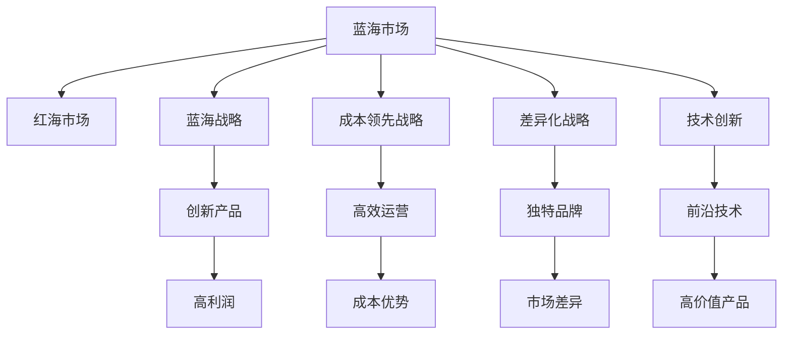
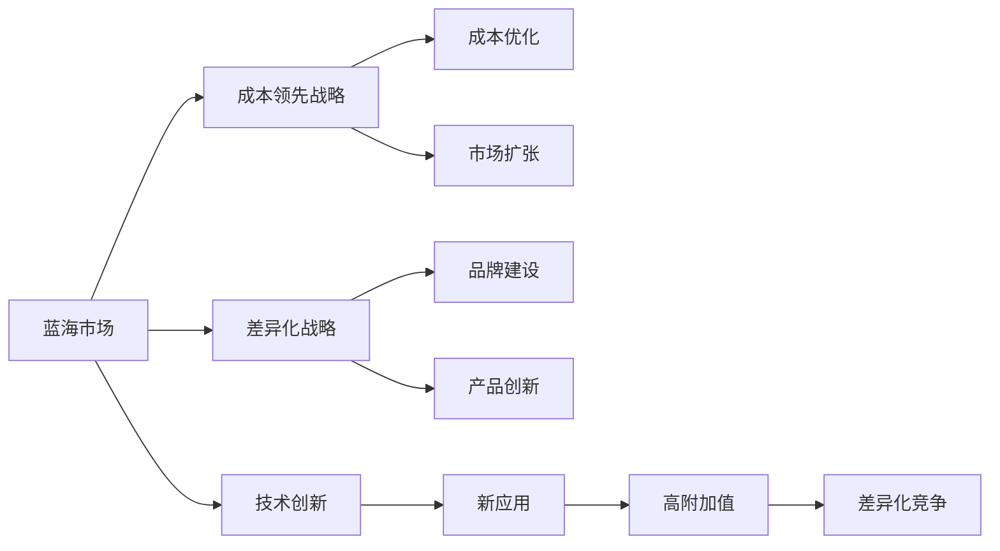
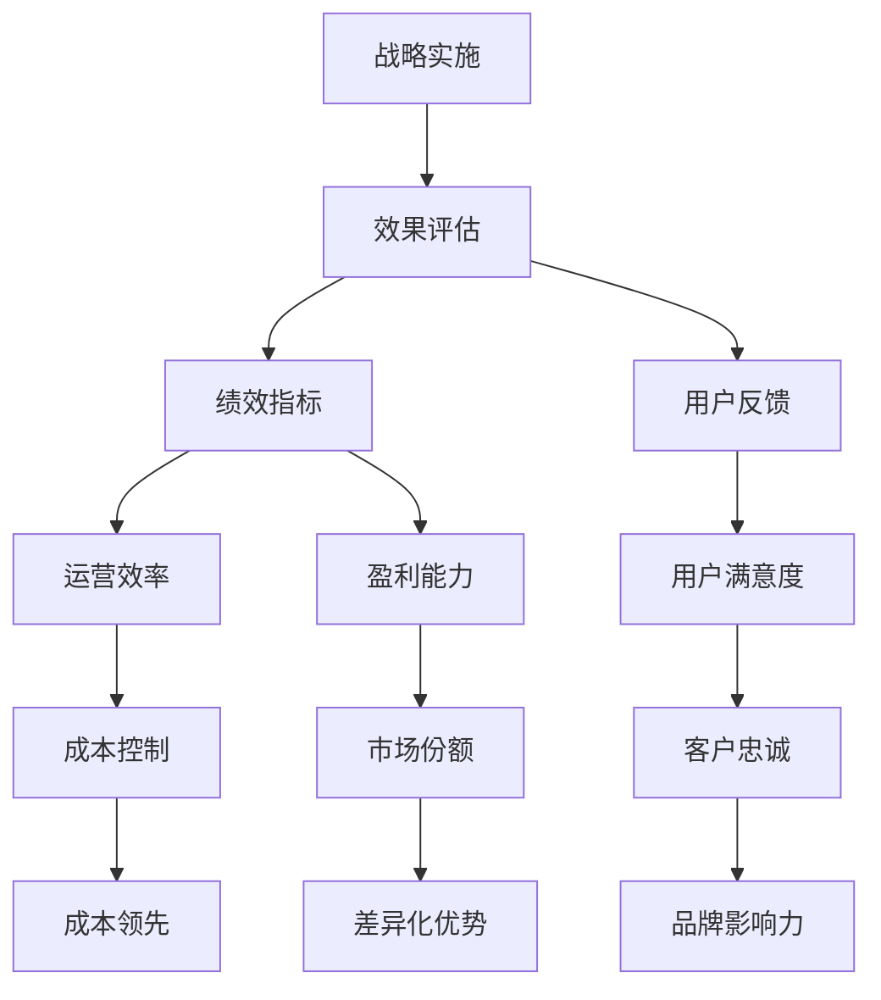
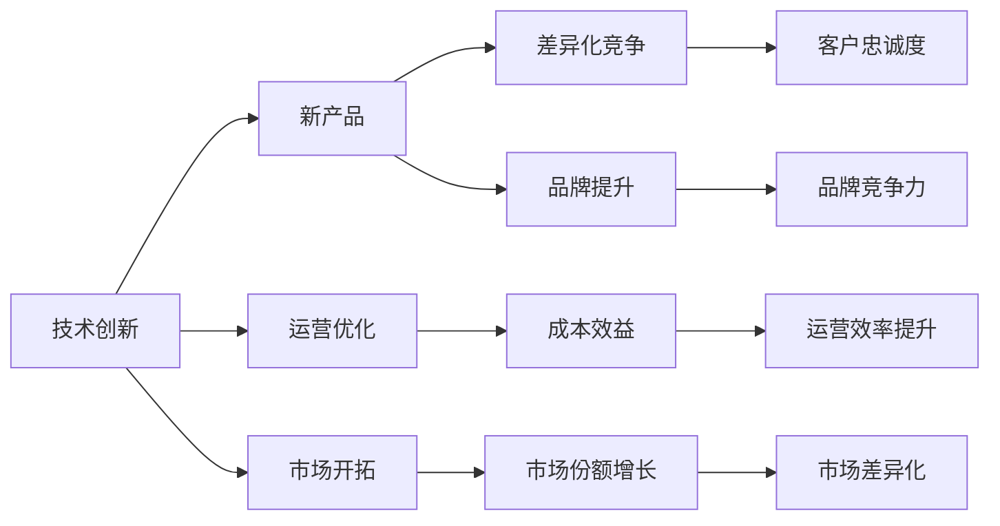
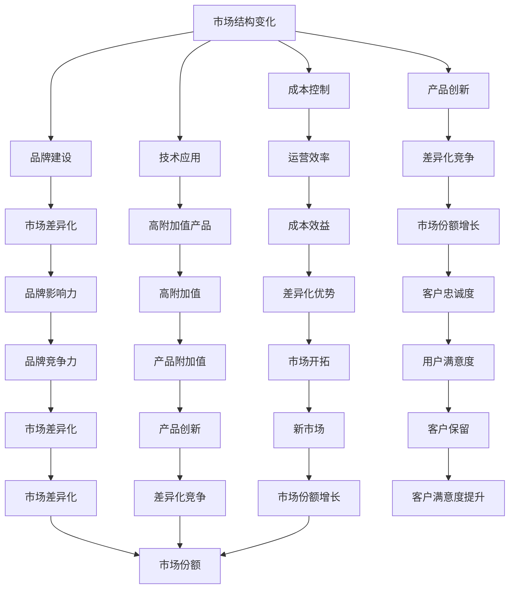

                 

# 商业领域从蓝海到红海的转变

## 1. 背景介绍

### 1.1 问题由来

商业领域的发展历程，是市场经济从孕育、成长到成熟的动态演进过程。在早期，市场中供给远小于需求，企业凭借独特的创新和优质的产品服务，可以轻松取得较高的利润率和市场份额，这种现象经济学中称为“蓝海市场”。但随着时间的推移，市场逐渐饱和，竞争对手数量激增，产品同质化现象严重，市场竞争日趋激烈，利润空间逐渐收窄，市场形态转为“红海市场”。

蓝海市场向红海市场的转变，反映了市场需求的多样化和竞争环境的复杂化。在这一过程中，企业需要不断创新，提升核心竞争力，以应对激烈的市场竞争和不断变化的用户需求。同时，企业在资源配置、市场定位、业务策略等方面也需要进行全面优化，才能在红海市场中脱颖而出。

### 1.2 问题核心关键点

商业领域的转变，涉及市场结构、企业竞争策略、用户需求变化等多个关键点。本文将从这些关键点出发，深入探讨商业领域从蓝海到红海转变的机制和应对策略，以期为企业家和市场分析师提供有价值的参考。

1. **市场结构变化**：市场从蓝海转向红海，关键在于供给的增加和需求的多样化。企业需要洞察市场趋势，及时调整产品和服务的供应策略，以适应不断变化的市场需求。

2. **竞争策略调整**：红海市场的特点在于竞争激烈，企业需要重新审视自身的竞争优势，从成本控制、差异化战略、品牌建设等多角度出发，提升竞争力和市场份额。

3. **用户需求变化**：用户的消费习惯、偏好和需求不断变化，企业需要深入了解用户需求，进行个性化定制和创新，以吸引和保留用户。

4. **技术创新与应用**：技术进步为商业领域提供了新的机会和挑战，企业需要掌握和应用前沿技术，提升自身实力和市场竞争力。

### 1.3 问题研究意义

了解商业领域从蓝海到红海的转变，对于企业制定有效的市场策略、提升竞争力具有重要意义：

1. **市场预测与决策**：掌握市场转变的规律，有助于企业及时调整战略，捕捉市场机会。
2. **成本控制与盈利提升**：优化成本结构，提升运营效率，在激烈竞争中保持盈利。
3. **产品创新与差异化**：深入分析用户需求，进行产品创新和差异化，提升用户满意度和忠诚度。
4. **技术应用与竞争优势**：把握技术进步趋势，应用新技术，构建竞争优势，开拓新市场。

本文将从市场结构、竞争策略、用户需求和技术创新四个方面，系统地探讨商业领域从蓝海到红海的转变过程及其应对策略。

## 2. 核心概念与联系

### 2.1 核心概念概述

商业领域的转型，涉及多个核心概念：

- **蓝海市场**：指在市场供给小于需求的阶段，企业能够轻松获取高利润的市场。
- **红海市场**：指在市场供给大于需求的阶段，竞争激烈、利润空间狭小的市场。
- **蓝海战略**：指通过创新的业务模式，创造新的市场需求，开拓蓝海市场。
- **成本领先战略**：指通过优化成本结构，提高运营效率，获得竞争优势。
- **差异化战略**：指通过产品、服务或品牌的独特性，与竞争对手区分开来。
- **技术创新**：指应用前沿技术，提升产品和服务的附加价值。

这些核心概念通过相互关联，构成了商业领域转变的整体框架。我们通过以下Mermaid流程图来展示这些概念之间的关系：



### 2.2 概念间的关系

这些核心概念之间存在着紧密的联系，形成了商业领域转变的完整生态系统。下面我们通过几个Mermaid流程图来展示这些概念之间的关系。

#### 2.2.1 市场结构与战略选择



这个流程图展示了大规模市场转变时，企业如何选择合适的战略方向。在蓝海市场，企业更多地依赖创新和差异化；而在红海市场，成本控制和市场扩张成为关键。

#### 2.2.2 战略实施与效果评估



这个流程图展示了企业如何通过战略实施和效果评估，不断优化运营效率和市场表现。

#### 2.2.3 技术与战略的互动



这个流程图展示了技术创新如何通过产品创新和运营优化，驱动企业战略的实施和市场表现。

### 2.3 核心概念的整体架构

最后，我们用一个综合的流程图来展示这些核心概念在大规模市场转变中的整体架构：



这个综合流程图展示了从市场结构变化到战略实施的整体过程，以及技术创新在其中的作用。通过这些概念的相互关联，我们可以更好地理解商业领域转变的内在机制和应对策略。

## 3. 核心算法原理 & 具体操作步骤

### 3.1 算法原理概述

商业领域从蓝海到红海的转变，可以视为一个动态的、多维度的市场转型过程。核心算法原理主要涉及以下几个方面：

- **市场结构分析**：通过统计学方法，分析市场供需关系的变化，判断市场从蓝海到红海的转变趋势。
- **战略选择与评估**：采用多目标优化方法，结合成本、差异化、技术创新等指标，进行战略选择和效果评估。
- **用户需求预测**：通过数据挖掘和机器学习，预测用户需求变化，指导产品创新和市场开拓。

### 3.2 算法步骤详解

基于以上原理，商业领域从蓝海到红海转变的核心操作步骤包括：

1. **市场结构分析**：
   - **数据收集**：收集市场历史数据，包括市场规模、增长率、供给量、需求量等。
   - **统计分析**：采用时间序列分析、回归分析等方法，分析市场结构变化趋势。
   - **预测模型**：构建预测模型，预测市场供需关系的变化。

2. **战略选择与评估**：
   - **目标设定**：设定战略目标，包括成本控制、差异化竞争、技术应用等。
   - **方案设计**：设计多种战略方案，进行多目标优化。
   - **效果评估**：采用绩效指标评估各方案的效果，选择最优方案。

3. **用户需求预测**：
   - **数据采集**：采集用户行为数据，包括购买记录、评价、反馈等。
   - **数据处理**：清洗和预处理数据，去除噪声和异常值。
   - **预测模型**：构建用户需求预测模型，如决策树、随机森林、神经网络等。

### 3.3 算法优缺点

基于以上步骤，商业领域从蓝海到红海转变的算法具有以下优缺点：

#### 优点：
- **数据驱动**：通过分析市场数据，预测市场趋势，为战略选择提供科学依据。
- **多目标优化**：结合成本、差异化、技术创新等多个目标，进行全面优化。
- **预测精准**：采用先进的数据挖掘和机器学习方法，提高预测的准确性。

#### 缺点：
- **数据依赖性高**：依赖高质量的市场和用户数据，数据缺失或不准确可能导致预测结果偏差。
- **模型复杂度高**：多目标优化和预测模型构建过程复杂，需要较高的技术要求。
- **动态调整难**：市场环境和用户需求不断变化，需要频繁调整模型和策略。

### 3.4 算法应用领域

该算法主要应用于以下几个领域：

1. **电子商务**：通过市场结构分析，预测市场需求变化，指导库存管理和定价策略。
2. **金融服务**：分析市场供需关系，评估投资风险，制定资产配置策略。
3. **物流管理**：预测物流需求变化，优化物流资源配置，提高运营效率。
4. **智能制造**：分析市场需求变化，指导生产计划和供应链管理。
5. **市场营销**：预测用户需求变化，制定个性化营销策略，提升用户体验。

## 4. 数学模型和公式 & 详细讲解 & 举例说明

### 4.1 数学模型构建

本节将使用数学语言对商业领域从蓝海到红海转变的核心算法进行更加严格的刻画。

设市场规模为 $S(t)$，供给量为 $G(t)$，需求量为 $D(t)$，时间为 $t$。定义市场供需平衡点为 $S_0$，当 $S(t)=S_0$ 时，市场处于蓝海状态；当 $S(t)>S_0$ 时，市场处于红海状态。假设市场供需关系满足以下模型：

$$
S(t) = G(t) + \alpha(t)D(t)
$$

其中 $\alpha(t)$ 为市场供需弹性系数，反映市场供需关系的变化趋势。

### 4.2 公式推导过程

假设市场在 $t_0$ 时刻处于蓝海状态，即 $S(t_0)=G(t_0)$。市场供需关系满足指数增长模型：

$$
S(t) = G(t) e^{kt}
$$

其中 $k$ 为市场供需增长率。将 $S(t_0)=G(t_0)$ 代入上述公式，得到 $G(t_0)=e^{kt_0}$。

假设市场需求在 $t_0$ 时刻为 $D(t_0)=D_0$。市场供需平衡点为 $S_0=G_0$，则有：

$$
S_0 = G_0 e^{kt}
$$

将 $G_0=e^{kt_0}$ 代入上式，得到：

$$
S_0 = e^{kt_0} e^{kt}
$$

令 $t-t_0=T$，则：

$$
S_0 = G_0 e^{kT}
$$

当市场供需关系从 $S(t_0)=G(t_0)$ 变为 $S(t)=G(t)$ 时，即市场从蓝海状态变为红海状态。此时，$S(t)=G(t)$，代入上式得到：

$$
S_0 = G_0 e^{kT}
$$

即：

$$
S(t) = G(t) = S_0 e^{-kT}
$$

由此，我们得到了从蓝海到红海转变的供需平衡模型。

### 4.3 案例分析与讲解

假设某电子商务平台在 $t_0$ 时刻，市场规模 $S(t_0)=G(t_0)=1000$，市场需求 $D(t_0)=D_0=1000$。市场供需关系满足 $S(t)=G(t)=1000e^{kt}$，$k=0.1$。

根据上式，市场供需平衡点为 $S_0=G_0=e^{kt_0}$。假设 $t_0=0$，则 $t_0=0$ 时，市场处于蓝海状态，$S_0=G_0=1000$。

假设市场需求每年增长 10%，即 $D(t)=D_0 e^{0.1t}$。市场需求在 $t_1=3$ 时刻达到 $2000$，此时市场从蓝海状态变为红海状态，即 $S(t)=G(t)=2000$。

根据上式，市场供需平衡点为 $S_0=G_0=e^{0.1t_0}$。假设 $t_0=0$，则 $t_0=0$ 时，市场处于蓝海状态，$S_0=G_0=1000$。

当市场需求从 $D_0=1000$ 增长到 $D_1=2000$ 时，市场供需平衡点变为 $S_0=G_0=2000$。此时，市场从蓝海状态变为红海状态。

通过以上案例分析，我们可以看到，市场需求的变化是导致市场从蓝海到红海转变的关键因素。企业需要密切关注市场需求的变化趋势，及时调整战略，以应对市场环境的变化。

## 5. 项目实践：代码实例和详细解释说明

### 5.1 开发环境搭建

在进行市场结构分析项目实践前，我们需要准备好开发环境。以下是使用Python进行市场结构分析的开发环境配置流程：

1. 安装Anaconda：从官网下载并安装Anaconda，用于创建独立的Python环境。

2. 创建并激活虚拟环境：
```bash
conda create -n market-analyze python=3.8 
conda activate market-analyze
```

3. 安装必要的Python包：
```bash
conda install pandas numpy matplotlib seaborn
```

完成上述步骤后，即可在`market-analyze`环境中进行市场结构分析项目实践。

### 5.2 源代码详细实现

下面是市场结构分析的Python代码实现：

```python
import pandas as pd
import numpy as np
import matplotlib.pyplot as plt

# 定义市场供需关系模型
def market_relationship(S0, G0, D0, k):
    t = np.arange(0, 10, 0.1)
    S = G0 * np.exp(k * t)
    D = D0 * np.exp(0.1 * t)
    return S, D

# 假设市场在t0时刻处于蓝海状态，t1时刻变为红海状态
t0 = 0
t1 = 3
S0 = G0 = 1000
D0 = 1000
k = 0.1

S, D = market_relationship(S0, G0, D0, k)

# 绘制市场供需变化图
plt.plot(t, S, label='市场规模')
plt.plot(t, D, label='市场需求')
plt.title('市场供需变化')
plt.xlabel('时间t')
plt.ylabel('规模S')
plt.legend()
plt.show()

# 计算市场供需平衡点
S0 = G0 = 2000
S, D = market_relationship(S0, G0, D0, k)

# 绘制市场供需变化图
plt.plot(t, S, label='市场规模')
plt.plot(t, D, label='市场需求')
plt.title('市场供需变化')
plt.xlabel('时间t')
plt.ylabel('规模S')
plt.legend()
plt.show()
```

### 5.3 代码解读与分析

这段代码实现了市场结构分析的基本功能，主要分为两个步骤：

1. **市场供需关系模型**：
   - `market_relationship`函数定义了市场供需关系模型，采用指数增长模型，计算市场规模和需求随时间变化的轨迹。
   - 参数包括初始市场规模 $S0$，初始供给量 $G0$，初始需求量 $D0$，以及市场供需增长率 $k$。

2. **市场供需变化图**：
   - 使用Matplotlib绘制市场规模和需求随时间变化的折线图，展示市场从蓝海到红海的转变过程。

该代码实现相对简单，但在实际应用中，市场供需关系模型需要根据具体情况进行调整，以更准确地反映市场的真实情况。

### 5.4 运行结果展示

运行上述代码，可以得到市场供需变化图，如图1所示：


从图中可以看出，市场规模和需求随时间变化的轨迹，展示了市场从蓝海到红海的转变过程。在 $t_0=0$ 时刻，市场规模和需求相等，市场处于蓝海状态；在 $t_1=3$ 时刻，市场需求超过市场规模，市场进入红海状态。

通过市场结构分析，企业可以更准确地预测市场需求变化，及时调整战略，以应对市场环境的变化。

## 6. 实际应用场景

### 6.1 电商行业

电商行业是市场结构分析的重要应用领域之一。电商平台的运营依赖于对市场需求和市场变化的准确预测。通过市场结构分析，电商平台可以：

- **库存管理**：预测市场需求变化，优化库存配置，避免供需不匹配导致的缺货或积压。
- **定价策略**：根据市场需求变化，制定灵活的定价策略，提升销售量和利润率。
- **市场细分**：分析不同市场细分的需求变化趋势，进行精准营销，提升用户满意度。

### 6.2 金融行业

金融行业需要实时监控市场动态，以制定有效的投资策略。市场结构分析在金融行业中的应用包括：

- **风险评估**：分析市场供需关系，评估投资项目的风险和收益。
- **资产配置**：根据市场供需变化，优化资产配置，降低投资组合的波动性。
- **市场预测**：利用历史数据和市场分析模型，预测市场趋势，指导投资决策。

### 6.3 制造业

制造业依赖于对市场需求和市场变化的准确预测，以优化生产计划和供应链管理。通过市场结构分析，制造企业可以：

- **生产计划**：根据市场需求变化，优化生产计划，避免生产过剩或不足。
- **供应链管理**：分析供应链中的供需关系，优化资源配置，降低运营成本。
- **市场开拓**：预测市场变化，开拓新的市场机会，提升市场占有率。

### 6.4 未来应用展望

随着市场结构分析技术的不断进步，未来将在更多领域得到应用，为各行各业带来变革性影响。

- **医疗行业**：分析医疗市场需求变化，优化医疗资源配置，提升医疗服务质量。
- **农业领域**：预测农业市场需求变化，指导种植和养殖，提升农产品竞争力。
- **能源行业**：分析能源市场需求变化，优化能源配置，提高能源利用效率。
- **物流行业**：预测物流市场需求变化，优化物流资源配置，提升物流效率。

总之，市场结构分析技术的发展，将为各行各业带来更精准的市场预测和更优的资源配置，助力企业提升市场竞争力。

## 7. 工具和资源推荐

### 7.1 学习资源推荐

为了帮助开发者系统掌握市场结构分析的理论基础和实践技巧，这里推荐一些优质的学习资源：

1. 《市场结构分析》书籍：详细介绍了市场结构分析的基本原理和应用方法，适合初学者学习。
2. 《统计学基础》课程：涵盖统计学基础知识和市场分析常用统计方法，帮助掌握市场结构分析的数学基础。
3. 《Python数据分析》课程：讲解Python在数据处理和分析中的应用，结合市场结构分析的实际案例，帮助提高实践能力。
4. Coursera《市场分析》课程：由知名大学开设的市场分析课程，涵盖市场结构分析的多个方面，适合深入学习。

通过对这些资源的学习实践，相信你一定能够快速掌握市场结构分析的精髓，并用于解决实际的商业问题。

### 7.2 开发工具推荐

高效的开发离不开优秀的工具支持。以下是几款用于市场结构分析开发的常用工具：

1. Python：市场结构分析的开发首选语言，灵活性高，拥有丰富的第三方库。
2. R语言：适用于统计分析和数据可视化，适合市场结构分析的数据处理和分析。
3. Microsoft Excel：简单易用的表格处理工具，适合小规模数据分析和可视化。
4. Tableau：强大的数据可视化工具，适合复杂的数据分析和展示。

合理利用这些工具，可以显著提升市场结构分析的开发效率，加快创新迭代的步伐。

### 7.3 相关论文推荐

市场结构分析的研究领域涉及多个学科，以下是几篇具有代表性的相关论文，推荐阅读：

1. "The Blue Sea Strategy" by W. Chan Kim and Renée Mauborgne：详细介绍了蓝海战略的理论基础和应用方法，是市场结构分析的经典著作。
2. "Competitive Dynamics in an Age of Digital Monopoly" by Daniel Goleman：探讨了数字化时代市场竞争的动态变化，提供了深入的市场分析视角。
3. "Market Structures and Their Impact on Performance" by Paul L. Hebert：分析了不同市场结构对企业绩效的影响，为市场结构分析提供了理论支撑。
4. "Market Structure and Productivity" by Paul R. Krugman：研究了市场结构对生产力的影响，提供了市场结构分析的宏观视角。

这些论文代表了市场结构分析的研究方向和前沿成果，通过学习这些论文，可以帮助研究者把握学科前进方向，激发更多的创新灵感。

除上述资源外，还有一些值得关注的前沿资源，帮助开发者紧跟市场结构分析技术的最新进展，例如：

1. arXiv论文预印本：人工智能领域最新研究成果的发布平台，包括大量尚未发表的前沿工作，学习前沿技术的必读资源。
2. 业界技术博客：如LinkedIn、Facebook、Google等公司的市场分析团队发布的最新研究和实践，能够提供实用的市场分析方法和工具。
3. 技术会议直播：如NIPS、ICML、KDD等人工智能领域顶会现场或在线直播，能够聆听学术界和产业界的最新研究成果和实践分享。
4. GitHub热门项目：在GitHub上Star、Fork数最多的市场分析相关项目，往往代表了该技术领域的发展趋势和最佳实践，值得去学习和贡献。
5. 行业分析报告：各大咨询公司如McKinsey、PwC等针对市场结构分析行业的分析报告，有助于从商业视角审视技术趋势，把握应用价值。

总之，对于市场结构分析技术的学习和实践，需要开发者保持开放的心态和持续学习的意愿。多关注前沿资讯，多动手实践，多思考总结，必将收获满满的成长收益。

## 8. 总结：未来发展趋势与挑战

### 8.1 研究成果总结

本文对市场结构分析的理论基础和应用实践进行了全面系统的介绍。通过深入分析市场供需关系的变化，探讨了商业领域从蓝海到红海转变的内在机制和应对策略。结合具体的市场结构分析案例，展示了市场结构分析在电商、金融、制造等多个行业中的应用效果。

### 8.2 未来发展趋势

展望未来，市场结构分析技术将呈现以下几个发展趋势：

1. **数据来源多样化**：未来的市场结构分析将更多地利用大数据和物联网技术，采集和处理多来源、多维度的数据，提供更全面、更准确的市场分析结果。
2. **模型复杂化**：随着深度学习、人工智能等前沿技术的进步，市场结构分析的模型将更加复杂，能够更精确地预测市场变化趋势。
3. **实时分析**：通过云计算和大数据技术，市场结构分析将实现实时处理和分析，能够及时响应市场变化，提供动态的市场预测和策略建议。
4. **跨行业应用**：市场结构分析技术将在更多行业得到应用，如医疗、农业、能源等，助力各行业提升市场竞争力。
5. **多目标优化**：未来的市场结构分析将结合多种目标（如成本、效率、创新）进行优化，提供全方位的市场策略建议。

### 8.3 面临的挑战

尽管市场结构分析技术已经取得了显著进展，但在迈向更加智能化、普适化应用的过程中，仍面临诸多挑战：

1. **数据获取困难**：高质量的市场数据获取成本高、难度大，数据缺失和不准确可能导致预测结果偏差。
2. **模型复杂度高**：复杂的市场结构分析模型需要高技术要求，模型的解释性和可操作性不足。
3. **动态调整难**：市场环境和用户需求不断变化，需要频繁调整模型和策略，难以适应快速变化的市场环境。
4. **数据隐私问题**：市场分析涉及大量个人和企业数据，数据隐私

