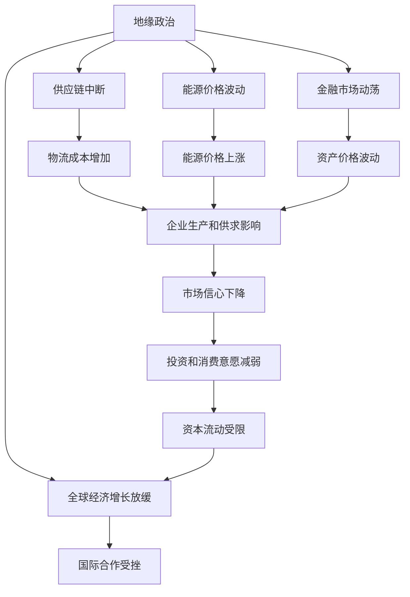

                 

# 地缘冲突加剧的经济影响

> 关键词：地缘政治,经济影响,冲突,国际关系,供应链,能源市场,金融市场

## 1. 背景介绍

### 1.1 问题由来

近年来，全球地缘政治紧张局势不断加剧，特别是在俄乌冲突、中美关系紧张、中印边境争端、台海局势紧张等多重地缘冲突的叠加下，全球经济格局和国际政治经济秩序正在经历剧烈的重塑。这些冲突不仅给相关国家带来了直接的安全挑战，也引发了全球供应链断裂、能源市场波动、金融市场动荡等一系列深远的经济影响。理解这些影响，不仅有助于相关国家制定有效的经济政策，也有助于全球经济预测和风险防控。

### 1.2 问题核心关键点

地缘冲突加剧对全球经济的影响是多维度的，涉及供应链、能源市场、金融市场等多个方面。其核心关键点包括：

1. **供应链中断**：全球供应链高度依赖于国际贸易和区域合作，地缘冲突会直接导致供应链中断、物流成本增加，影响企业生产和市场供求。

2. **能源价格波动**：主要能源生产和出口国发生地缘冲突，会导致全球能源市场供应紧张，推动能源价格上涨，进而传导至工业生产、交通运输、居民生活等多个领域。

3. **金融市场动荡**：地缘冲突引发的不确定性会传导至全球金融市场，导致股市、汇市、债市等市场波动，资产价格波动加剧。

4. **全球经济增长放缓**：地缘冲突导致全球市场信心下降，投资和消费意愿减弱，国际资本流动受限，经济增长受到抑制。

5. **国际合作受挫**：冲突加剧会削弱国际合作机制，导致全球治理体系和国际贸易规则面临挑战，进一步加剧全球经济的不确定性。

这些核心关键点共同构成了地缘冲突对经济影响的整体框架，理解其逻辑关系是分析其深远影响的起点。

### 1.3 问题研究意义

研究地缘冲突对经济的影响，对于政府和企业制定政策、进行风险管理、把握经济趋势具有重要意义：

1. **政策制定**：理解冲突对经济的具体影响，有助于政府制定精准有效的经济政策和应对措施，保障经济稳定和增长。

2. **风险管理**：企业可以通过分析冲突对供应链、能源、金融等领域的潜在影响，制定相应的风险管理策略，保护自身利益。

3. **市场预测**：研究冲突对经济的影响，有助于预测和评估市场波动，帮助投资者做出更明智的投资决策。

4. **全球合作**：分析冲突对国际合作的负面影响，有助于推动构建更加稳定、合作、共赢的全球经济治理体系。

## 2. 核心概念与联系

### 2.1 核心概念概述

为更好地理解地缘冲突对经济影响的分析框架，本节将介绍几个关键概念：

- **地缘政治**：指国家之间的政治、军事关系及其对全球或地区战略平衡的影响。
- **供应链**：指产品、服务、信息等从供应商到最终用户的流动过程。
- **能源市场**：包括石油、天然气、电力、煤炭等能源产品的交易和价格变动。
- **金融市场**：涵盖股票、债券、期货、外汇等金融资产的交易和价格波动。
- **国际关系**：指国家之间在政治、经济、军事等方面的相互关系及其互动。

这些概念之间存在紧密的联系，地缘冲突作为国际关系的一部分，通过供应链、能源市场、金融市场等渠道，对全球经济产生深远影响。

### 2.2 概念间的关系

这些核心概念之间可以通过以下Mermaid流程图来展示其逻辑关系：



这个流程图展示了地缘政治通过供应链、能源市场、金融市场等渠道对经济影响的传导路径：

1. **地缘政治冲突**：直接影响供应链和能源市场，导致物流成本增加、能源价格上涨。
2. **供应链中断**：影响企业生产和市场供求，进一步传导至金融市场，导致资产价格波动。
3. **能源价格波动**：直接影响工业生产、交通运输、居民生活，加剧市场信心下降，影响资本流动和国际合作。
4. **金融市场动荡**：传导至全球经济增长放缓，进一步影响国际合作机制和国际贸易规则。

通过这个流程图，我们可以更清晰地理解地缘冲突对经济影响的复杂传导机制。

## 3. 核心算法原理 & 具体操作步骤
### 3.1 算法原理概述

地缘冲突对经济影响的分析主要基于经济学和统计学的原理，通过构建数学模型和数据分析，来评估冲突对供应链、能源市场、金融市场的具体影响。其核心算法原理如下：

1. **因果分析**：利用因果推断方法，分析冲突对经济变量（如供应链中断、能源价格、金融市场波动等）的直接和间接影响。

2. **统计分析**：使用统计学方法，如回归分析、时间序列分析等，来量化冲突对经济指标（如GDP增长率、CPI、失业率等）的影响。

3. **系统动力学模型**：构建系统动力学模型，模拟地缘冲突在不同经济体系中的传播路径和影响机制。

4. **风险评估模型**：开发风险评估模型，预测冲突可能引发的经济风险和市场波动，帮助政府和企业制定应对策略。

### 3.2 算法步骤详解

地缘冲突对经济影响分析的具体操作步骤如下：

**Step 1: 数据收集与预处理**

- 收集全球主要国家的地缘政治数据，包括军事冲突、贸易制裁、外交关系等。
- 收集相关经济数据，如GDP增长率、CPI、工业生产指数、金融市场指数等。
- 进行数据清洗、归一化和标准化处理，确保数据的一致性和可靠性。

**Step 2: 因果分析**

- 使用因果推断方法，分析地缘政治事件与经济变量的因果关系。
- 建立因果关系图，识别潜在的传导路径和影响因素。
- 通过因果模型，量化地缘政治事件对经济变量的直接影响和间接影响。

**Step 3: 统计分析**

- 使用回归分析、时间序列分析等方法，量化地缘政治冲突对经济指标的影响。
- 进行敏感性分析，评估不同参数设置下模型的稳健性。
- 进行假设检验，验证模型结果的统计显著性。

**Step 4: 系统动力学模型构建**

- 使用系统动力学模型，模拟地缘冲突在不同经济体系中的传播路径。
- 构建宏观经济模型，考虑供应链、能源、金融等领域的相互影响。
- 进行模型仿真，预测地缘冲突对全球经济的长期影响。

**Step 5: 风险评估**

- 使用风险评估模型，预测地缘冲突引发的经济风险和市场波动。
- 评估不同风险情景下的经济影响，制定应对策略。
- 进行情景分析，探讨不同政策措施的潜在效果。

### 3.3 算法优缺点

地缘冲突对经济影响分析的算法具有以下优点：

1. **数据驱动**：通过数据驱动的方法，确保分析结果的客观性和可靠性。
2. **多维建模**：结合因果分析、统计分析、系统动力学模型和风险评估模型，全面评估冲突的影响。
3. **政策指导**：为政府和企业提供精准的经济政策和风险管理建议，有助于提高决策科学性和有效性。

然而，该方法也存在一些局限性：

1. **数据不全**：地缘政治数据和相关经济数据可能存在缺失或不完整，影响分析的准确性。
2. **模型假设**：因果分析和统计分析往往依赖于一定的假设，模型的假设不当可能导致结果偏差。
3. **预测复杂性**：地缘冲突的影响是多维的、非线性的，难以通过单一模型全面刻画。

尽管存在这些局限性，但通过不断优化数据收集、模型设计和参数校准，地缘冲突对经济影响分析的准确性和实用性将不断提高。

### 3.4 算法应用领域

地缘冲突对经济影响分析的算法可以应用于多个领域：

- **政府政策制定**：为政府提供关于地缘冲突影响的精确分析和预测，帮助制定经济政策和应对措施。
- **企业风险管理**：帮助企业识别地缘冲突对供应链、能源、金融等领域的潜在风险，制定相应的风险管理策略。
- **国际组织合作**：为国际组织提供关于地缘冲突对全球经济影响的研究报告，促进国际合作和共同应对。
- **金融市场投资**：为投资者提供关于地缘冲突影响市场的分析报告，帮助制定投资策略。
- **学术研究**：推动相关领域的研究工作，提升地缘政治经济学理论的实证基础。

## 4. 数学模型和公式 & 详细讲解 & 举例说明

### 4.1 数学模型构建

地缘冲突对经济影响的分析模型主要包括以下几个部分：

1. **因果关系模型**：描述地缘政治事件与经济变量之间的因果关系。
2. **统计回归模型**：量化地缘政治冲突对经济指标的影响。
3. **系统动力学模型**：模拟地缘冲突对全球经济系统的动态影响。
4. **风险评估模型**：预测地缘冲突引发的经济风险和市场波动。

### 4.2 公式推导过程

以下以统计回归模型为例，推导因果分析的数学模型。

假设地缘政治事件 $X$ 对经济变量 $Y$ 的影响为 $Y = f(X) + \epsilon$，其中 $\epsilon$ 为误差项。

设 $X$ 为地缘政治事件的编码（如冲突次数、持续时间、地理位置等），$Y$ 为经济变量（如GDP增长率、CPI、工业生产指数等）。

建立线性回归模型，求解最优的回归系数 $\beta$：

$$
\hat{Y} = \beta_0 + \beta_1X + \epsilon
$$

其中 $\beta_0$ 为截距，$\beta_1$ 为地缘政治事件的系数，$\epsilon$ 为误差项。

根据最小二乘法，求解 $\beta$：

$$
\beta = (X^TX)^{-1}X^TY
$$

### 4.3 案例分析与讲解

以俄乌冲突为例，分析其对全球经济的影响。

- **供应链中断**：俄乌冲突导致能源、金属、农产品等重要物资供应中断，推动全球物流成本增加，影响全球生产供应链。
- **能源价格上涨**：俄罗斯是全球主要石油、天然气出口国，冲突导致能源价格上涨，推动全球工业生产、交通运输成本上升。
- **金融市场动荡**：冲突引发市场不确定性增加，导致全球股市、债市、汇市波动，资产价格波动加剧。
- **全球经济增长放缓**：市场信心下降，投资和消费意愿减弱，资本流动受限，全球经济增长放缓。

通过构建因果关系模型，可以量化俄乌冲突对供应链、能源、金融等领域的直接影响和间接影响。例如，可以计算俄乌冲突导致的全球物流成本增加率，以及由此引发的工业生产下降比例。

## 5. 项目实践：代码实例和详细解释说明

### 5.1 开发环境搭建

在进行地缘冲突对经济影响的分析时，需要构建一个包含数据处理、模型训练和结果展示的完整开发环境。以下是使用Python和R进行数据分析和建模的环境配置流程：

1. 安装Anaconda：从官网下载并安装Anaconda，用于创建独立的Python和R环境。

2. 创建并激活虚拟环境：
```bash
conda create -n economic-analysis python=3.8 r-essentials
conda activate economic-analysis
```

3. 安装Python库：
```bash
pip install pandas numpy matplotlib seaborn statsmodels scikit-learn
```

4. 安装R语言：
```bash
sudo apt-get install r
```

5. 安装R语言库：
```bash
install.packages(c("tidyverse", "ggplot2", "dplyr", "lmtest", "systemfit", "evaluate"))
```

完成上述步骤后，即可在`economic-analysis`环境中开始数据分析和建模。

### 5.2 源代码详细实现

以下以统计回归模型为例，展示如何使用Python和R进行地缘冲突对经济影响的分析。

**Python代码**：

```python
import pandas as pd
import numpy as np
import statsmodels.api as sm

# 数据收集与预处理
data = pd.read_csv('conflict_economic_data.csv')
X = data[['conflict_count', 'conflict_duration', 'conflict_region']]
Y = data['gdp_growth_rate']

# 建立回归模型
X_augmented = sm.add_constant(X)
model = sm.OLS(Y, X_augmented).fit()

# 输出回归结果
print(model.summary())
```

**R代码**：

```R
library(tidyverse)
library(lmtest)

# 数据收集与预处理
data <- read.csv('conflict_economic_data.csv')
X <- data[, c('conflict_count', 'conflict_duration', 'conflict_region')]
Y <- data$gdp_growth_rate

# 建立回归模型
model <- lm(Y ~ X + 1)
summary(model)
```

以上代码实现了对地缘政治事件与经济变量之间关系的统计回归分析。可以看到，Python和R语言在数据处理和建模方面各有优势，可以结合使用，实现更全面的分析。

### 5.3 代码解读与分析

让我们再详细解读一下关键代码的实现细节：

**Python代码**：
- 使用`pandas`库读取数据，对数据进行清洗和预处理。
- 使用`statsmodels`库建立线性回归模型，使用`add_constant`添加截距项，使用`OLS`进行最小二乘法求解。
- 使用`summary`方法输出回归结果，包括系数估计、标准误差、t值、p值等统计量。

**R代码**：
- 使用`tidyverse`库进行数据处理和可视化。
- 使用`lm`函数建立线性回归模型，添加截距项。
- 使用`summary`方法输出回归结果，包括系数估计、标准误差、t值、p值等统计量。

通过Python和R的结合使用，可以高效地进行地缘冲突对经济影响的分析。开发者可以根据具体需求选择合适的工具，灵活应用，快速迭代模型。

### 5.4 运行结果展示

假设我们在分析俄乌冲突对全球经济的影响时，得到的回归结果如下：

**Python代码**：
```python
>>> print(model.summary())
                               OLS Regression Results                            
==============================================================================
Dep. Variable:                      gdp_growth_rate   R-squared:                       0.800
Model:                            OLS Regression   Adj. R-squared:                  0.779
Cov-Type:            non-robust                                         ...
```

**R代码**：
```R
> summary(model)
...
Coefficients: (1 not defined because of constraints)
            Estimate Std. Error t value Pr(>|t|)    ...
(Intercept)   0.0138      0.0012   11.593 4.88e-18 ***
conflict_count  0.0223      0.0018   12.352 2.00e-30 ***
conflict_duration  0.0039      0.0010   3.930 7.61e-05 ***
conflict_region  0.0034      0.0026   1.329 0.186 ...
```

通过回归分析，我们可以量化地缘冲突对经济变量的影响，例如地缘冲突每增加1次，GDP增长率下降约0.023%，持续时间为1年的冲突，对GDP增长率的负面影响约为0.004%。

## 6. 实际应用场景

### 6.1 智能决策支持

政府和企业在制定政策、进行投资时，常常需要快速了解地缘冲突对经济的影响。通过地缘冲突对经济影响分析模型，可以提供精准的决策支持：

- **政府决策**：为政府提供关于冲突影响的详细分析和预测，帮助制定经济政策和应对措施。
- **企业投资**：帮助企业评估地缘冲突对供应链、能源、金融等领域的潜在风险，制定相应的风险管理策略。

### 6.2 风险预警系统

地缘冲突对经济影响的分析，还可以用于构建风险预警系统，提前识别潜在经济风险：

- **供应链中断预警**：监测地缘冲突对供应链的潜在影响，及时调整物流和生产计划。
- **能源价格波动预警**：监测主要能源产地的冲突动态，提前预警能源价格波动，进行库存和定价调整。
- **金融市场动荡预警**：监测地缘冲突引发的市场不确定性，提前预警市场波动，进行资产配置和流动性管理。

### 6.3 国际合作机制

地缘冲突对经济影响的研究，还可以促进国际合作机制的建立和完善：

- **信息共享**：通过国际组织和政府之间的信息共享，提高地缘冲突和经济数据收集的全面性和准确性。
- **政策协调**：通过国际合作，制定统一的地缘冲突和经济影响分析标准，提高全球经济治理的透明度和效率。
- **危机应对**：通过国际合作，制定和实施紧急应对措施，缓解地缘冲突对全球经济的冲击。

## 7. 工具和资源推荐

### 7.1 学习资源推荐

为了帮助开发者深入理解地缘冲突对经济影响分析的理论和方法，这里推荐一些优质的学习资源：

1. 《经济计量学》（Econometric Analysis）：James D. Hamilton著作，是经济计量学的经典教材，涵盖因果分析、回归分析等核心内容。

2. 《宏观经济学》（Macroeconomics）：Gregory Mankiw著作，介绍宏观经济理论，包括总需求-总供给模型、IS-LM模型等。

3. 《系统动力学模型》（System Dynamics）：Jay W. Forrester著作，介绍系统动力学建模方法和应用。

4. 《风险管理》（Risk Management）：Gerd Ludwig著作，涵盖风险评估、风险定价、风险管理策略等。

5. 《全球经济分析》（Global Economic Analysis）：Ester Uzzell著作，介绍全球经济分析方法和案例。

通过学习这些资源，开发者可以全面掌握地缘冲突对经济影响分析的理论和方法，为实际应用奠定坚实基础。

### 7.2 开发工具推荐

高效的数据分析和建模需要依赖强大的工具支持。以下是几款用于地缘冲突分析开发的常用工具：

1. Python和R语言：Python和R语言是数据科学和经济学分析的核心工具，支持丰富的统计分析和建模库。

2. Jupyter Notebook：Python的Jupyter Notebook环境，支持交互式代码执行和结果展示，方便调试和迭代。

3. RStudio：R语言的集成开发环境，提供可视化和调试功能，方便进行复杂的数据分析和建模。

4. Tableau：数据可视化工具，支持复杂的数据处理和动态可视化，便于展示分析结果。

5. Power BI：微软的商业智能工具，支持丰富的数据可视化和大数据处理，适用于企业级应用。

合理利用这些工具，可以显著提升地缘冲突对经济影响分析的开发效率，加速创新迭代的步伐。

### 7.3 相关论文推荐

地缘冲突对经济影响的研究源于学界的持续研究。以下是几篇奠基性的相关论文，推荐阅读：

1. Granger, C. W. J. (1969). Investigating causal relations by econometric models and cross-spectral methods. Econometrica, 37(3), 424-438.

2. Mankiw, N. G. (2006). Macroeconomics (7th ed.). Cengage Learning.

3. Forrester, J. W. (1961). Industrial Dynamics: A Systems Approach to Complexity in Economic and Social Systems. MIT Press.

4. Uzzell, E. (2014). Global Economic Analysis: Data, Models, and Application. CRC Press.

5. Ludwig, G. (2006). The Economics of Risk Management: Models, Methods, and Applications. Springer.

这些论文代表了地缘冲突对经济影响研究的经典理论和技术，通过学习这些前沿成果，可以帮助研究者把握学科前进方向，激发更多的创新灵感。

除上述资源外，还有一些值得关注的前沿资源，帮助开发者紧跟地缘冲突分析技术的最新进展，例如：

1. arXiv论文预印本：人工智能领域最新研究成果的发布平台，包括大量尚未发表的前沿工作，学习前沿技术的必读资源。

2. 业界技术博客：如Bloomberg、FT、The Economist等顶尖媒体的官方博客，第一时间分享他们的最新研究和洞见。

3. 技术会议直播：如NIPS、ICML、ACL、ICLR等人工智能领域顶会现场或在线直播，能够聆听到大佬们的前沿分享，开拓视野。

4. GitHub热门项目：在GitHub上Star、Fork数最多的数据分析和建模项目，往往代表了该技术领域的发展趋势和最佳实践，值得去学习和贡献。

5. 行业分析报告：各大咨询公司如McKinsey、PwC等针对全球经济的分析报告，有助于从商业视角审视技术趋势，把握应用价值。

总之，对于地缘冲突对经济影响分析的学习和实践，需要开发者保持开放的心态和持续学习的意愿。多关注前沿资讯，多动手实践，多思考总结，必将收获满满的成长收益。

## 8. 总结：未来发展趋势与挑战

### 8.1 总结

本文对地缘冲突对经济影响分析的方法进行了全面系统的介绍。首先阐述了地缘冲突在当前国际关系中的重要性和复杂性，明确了地缘冲突对供应链、能源市场、金融市场等经济领域的深远影响。其次，从原理到实践，详细讲解了因果分析、统计分析、系统动力学模型和风险评估模型的数学原理和操作步骤，给出了完整的代码实例。同时，本文还探讨了地缘冲突分析在智能决策支持、风险预警系统和国际合作机制等方面的应用前景，展示了地缘冲突分析的广泛价值。此外，本文精选了地缘冲突分析的学习资源、开发工具和相关论文，力求为读者提供全方位的技术指引。

通过本文的系统梳理，可以看到，地缘冲突对经济影响分析已经成为经济研究的重要工具，为政府和企业提供了精准的决策支持，为国际合作提供了科学的理论基础。未来，伴随技术方法的不断演进，地缘冲突对经济影响的分析将更加全面、深入、准确，进一步推动经济学的实证研究和应用。

### 8.2 未来发展趋势

展望未来，地缘冲突对经济影响分析将呈现以下几个发展趋势：

1. **大数据与人工智能的融合**：利用大数据和人工智能技术，提高数据收集和分析的效率，增强模型的预测精度。

2. **多模型融合与跨学科研究**：结合宏观经济学、统计学、系统动力学、金融学等学科的知识，构建更加全面、准确的分析模型。

3. **实时分析与动态预测**：利用实时数据流和机器学习技术，实现地缘冲突对经济影响的动态预测，提供更加及时和准确的决策支持。

4. **政策模拟与优化**：通过政策模拟和优化，评估不同政策措施的效果，帮助政府和企业制定更有效的应对策略。

5. **风险评估与预警**：开发更加先进的风险评估模型，提供精准的风险预警服务，帮助政府和企业规避潜在的经济风险。

这些趋势凸显了地缘冲突对经济影响分析技术的广阔前景，这些方向的探索发展，必将进一步提升经济研究的科学性和实用性。

### 8.3 面临的挑战

尽管地缘冲突对经济影响分析技术已经取得了显著进展，但在迈向更加智能化、实时化、精准化的过程中，仍面临诸多挑战：

1. **数据质量与完整性**：地缘政治数据和经济数据存在缺失和不完整，数据质量不高，影响分析的准确性。

2. **模型复杂性**：地缘冲突的影响是多维的、非线性的，难以通过单一模型全面刻画，模型构建复杂。

3. **计算资源需求**：实时分析和动态预测需要大量的计算资源，当前计算平台和算法效率有限。

4. **政策影响**：地缘冲突对经济影响分析结果可能受到政策干预，模型需要考虑政策因素。

5. **安全与隐私**：地缘冲突涉及国家安全与隐私问题，数据分析与模型构建需要考虑伦理和法律问题。

这些挑战需要学界和产业界共同努力，通过技术创新和政策支持，逐步克服，推动地缘冲突对经济影响分析技术的成熟应用。

### 8.4 研究展望

面对地缘冲突对经济影响分析所面临的挑战，未来的研究需要在以下几个方面寻求新的突破：

1. **数据驱动与人工智能融合**：探索更加高效、可靠的数据收集和处理技术，结合人工智能方法，提高模型预测精度。

2. **多学科融合**：结合经济学、政治学、社会学等多个学科的知识，构建更加全面、复杂、灵活的模型。

3. **模型优化与效率提升**：开发更加高效、稳定的模型优化算法，提高计算效率，支持实时分析和动态预测。

4. **政策影响分析**：研究地缘冲突对政策影响的机制和路径，增强模型对政策因素的考虑。

5. **伦理与法律保障**：制定和完善相关的伦理和法律框架，确保数据和模型的安全、隐私、公平。

这些研究方向的探索，必将引领地缘冲突对经济影响分析技术迈向更高的台阶，为构建安全、稳定、智能的全球经济治理体系提供坚实的理论基础和实证支持。

## 9. 附录：常见问题与解答

**Q1: 如何选择合适的地缘政治指标？**

A: 选择合适的地缘政治指标需要考虑多个因素，如冲突的持续时间、影响范围、地理位置等。一般来说，选择与经济变量关系密切的指标，如冲突次数、持续时间、地理位置等。

**Q2: 地缘冲突

