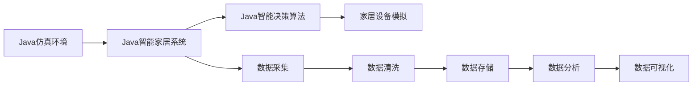
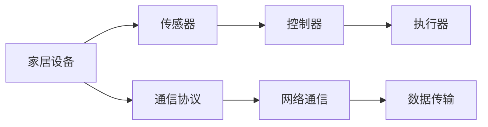
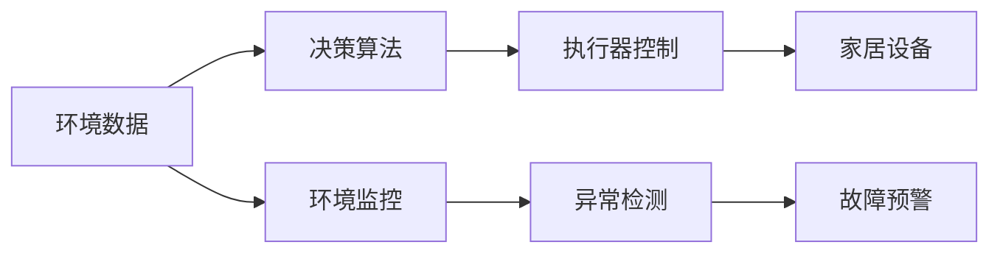
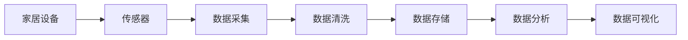
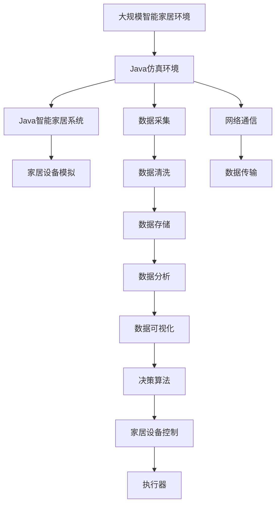

                 

# 基于Java的智能家居设计：基于Java的智能家居仿真环境开发技巧

## 1. 背景介绍

### 1.1 问题由来
随着科技的快速发展，智能家居系统已经成为人们生活中不可或缺的一部分。然而，传统的智能家居系统往往依赖于单一的硬件设备，且难以通过软件进行灵活调整和优化。为了解决这一问题，许多研究人员开始探索基于Java的智能家居仿真环境开发。这种仿真环境不仅能够模拟真实家居环境，还能进行各种智能交互和数据采集，为智能家居系统设计提供了全新的思路。

### 1.2 问题核心关键点
基于Java的智能家居仿真环境开发的核心关键点在于如何通过Java代码实现家居设备的模拟和交互，以及如何通过仿真环境进行智能化决策和优化。具体来说，需要解决以下几个问题：
1. **设备建模与交互**：如何通过Java代码创建家居设备的模型，并实现设备之间的交互和控制。
2. **数据采集与分析**：如何通过仿真环境采集家居环境中的各种数据，并进行分析处理。
3. **智能化决策与优化**：如何在仿真环境中引入智能化决策算法，实现家居环境的优化和自动化管理。

### 1.3 问题研究意义
开发基于Java的智能家居仿真环境，对于推动智能家居技术的发展和应用，具有重要意义：
1. **降低开发成本**：通过仿真环境，开发者可以无需物理设备即可进行系统的设计和测试，大大降低了硬件成本和开发周期。
2. **提高设计灵活性**：仿真环境提供了高度灵活的设计空间，开发者可以根据需求自由调整家居设备的数量和类型。
3. **加速应用部署**：通过仿真环境进行优化和测试，可以加速智能家居系统在实际应用中的部署和调试。
4. **支持多领域应用**：仿真环境可以支持多种家居设备和场景的模拟，有助于智能家居技术在医疗、养老、教育等多个领域的应用。

## 2. 核心概念与联系

### 2.1 核心概念概述

为了更好地理解基于Java的智能家居仿真环境开发，本节将介绍几个密切相关的核心概念：

- **Java仿真环境**：指通过Java代码实现的虚拟家居环境，用于模拟家居设备的交互和数据采集。
- **Java智能家居系统**：指通过Java代码实现的各种智能家居设备的模型，可以实现设备之间的通信和控制。
- **Java智能决策算法**：指在仿真环境中引入的智能化决策算法，用于优化家居环境的各项指标，如能耗、舒适度等。
- **Java数据采集与分析**：指通过仿真环境采集的家居环境数据，并进行清洗、处理和分析，为决策算法提供数据支持。

这些核心概念之间的逻辑关系可以通过以下Mermaid流程图来展示：



这个流程图展示了大规模智能家居仿真环境的核心概念及其之间的关系：

1. Java仿真环境通过Java代码创建家居设备的模型，并模拟设备的交互。
2. Java智能家居系统通过仿真环境实现设备的通信和控制。
3. Java智能决策算法在仿真环境中引入，用于优化家居环境的各项指标。
4. Java数据采集与分析从仿真环境中采集数据，并进行清洗、存储和分析。

这些核心概念共同构成了基于Java的智能家居仿真环境开发的基础框架，使得开发者能够通过Java代码实现各种智能家居设备和场景的模拟。

### 2.2 概念间的关系

这些核心概念之间存在着紧密的联系，形成了基于Java的智能家居仿真环境开发完整的生态系统。下面通过几个Mermaid流程图来展示这些概念之间的关系。

#### 2.2.1 Java智能家居系统的构成



这个流程图展示了Java智能家居系统的基本构成：
- 家居设备包括传感器、控制器和执行器，通过通信协议实现设备之间的数据传输和控制。
- 网络通信采用TCP/IP协议，实现数据的可靠传输。
- 数据传输采用消息队列、RESTful API等方式，实现数据在各个模块之间的流动。

#### 2.2.2 Java智能决策算法的应用



这个流程图展示了Java智能决策算法在仿真环境中的应用：
- 环境数据通过传感器采集，并通过通信协议传输到决策算法中。
- 决策算法根据数据进行分析和判断，并生成相应的控制指令。
- 执行器根据控制指令控制家居设备，实现环境优化和自动化管理。
- 环境监控和异常检测是决策算法的输入，故障预警是输出。

#### 2.2.3 Java数据采集与分析的流程



这个流程图展示了Java数据采集与分析的基本流程：
- 家居设备通过传感器采集数据。
- 数据采集模块将这些数据传输到数据清洗模块中。
- 数据清洗模块对数据进行清洗和处理，去除噪声和异常值。
- 数据存储模块将清洗后的数据存储在数据库中。
- 数据分析模块对存储的数据进行分析，提取有用的信息。
- 数据可视化模块将分析结果以图表、报表等形式呈现出来。

### 2.3 核心概念的整体架构

最后，我们用一个综合的流程图来展示这些核心概念在大规模智能家居仿真环境开发过程中的整体架构：



这个综合流程图展示了从仿真环境到智能决策的完整过程：
- 大规模智能家居环境通过Java仿真环境实现模拟。
- Java智能家居系统在仿真环境中实现设备的通信和控制。
- 家居设备模拟模块实现设备的模型和交互。
- 数据采集模块从设备中采集数据，并进行清洗、存储和分析。
- 数据分析模块提取数据中的有用信息，为决策算法提供支持。
- 数据可视化模块将分析结果呈现出来。
- 决策算法根据分析结果进行智能化决策，控制执行器。

通过这些流程图，我们可以更清晰地理解基于Java的智能家居仿真环境开发过程中各个核心概念的关系和作用，为后续深入讨论具体的开发技巧奠定基础。

## 3. 核心算法原理 & 具体操作步骤
### 3.1 算法原理概述

基于Java的智能家居仿真环境开发，本质上是通过Java代码实现家居设备的模拟和交互，并在仿真环境中引入智能化决策算法，实现家居环境的优化。其核心思想是：
1. **设备建模与交互**：通过Java代码创建家居设备的模型，实现设备之间的通信和控制。
2. **数据采集与分析**：在仿真环境中采集家居环境中的各种数据，并进行清洗、存储和分析。
3. **智能化决策与优化**：在仿真环境中引入智能化决策算法，根据采集的数据进行优化和自动化管理。

### 3.2 算法步骤详解

基于Java的智能家居仿真环境开发一般包括以下几个关键步骤：

**Step 1: 创建Java仿真环境**
- 选择合适的Java开发环境，如Eclipse、IntelliJ IDEA等。
- 配置仿真环境所需的Java版本和依赖库，如JavaFX、JUnit等。
- 创建仿真环境的基本框架，包括设备建模、数据采集、数据存储和数据可视化等模块。

**Step 2: 设计Java智能家居系统**
- 确定要模拟的家居设备和场景，如智能灯泡、智能锁、智能温控器等。
- 设计设备之间的通信协议和控制方式，如TCP/IP、HTTP协议等。
- 实现设备的模型和交互逻辑，通过Java代码模拟设备的运行状态和行为。

**Step 3: 实现数据采集与分析**
- 设计数据采集模块，从家居设备中采集各种传感器数据，如温度、湿度、光照强度等。
- 实现数据清洗模块，对采集的数据进行去噪、补全和归一化处理。
- 设计数据存储模块，将清洗后的数据存储在数据库中，如MySQL、Hadoop等。
- 实现数据分析模块，提取数据中的有用信息，如平均温度、能耗等。
- 实现数据可视化模块，将分析结果以图表、报表等形式呈现出来。

**Step 4: 引入智能化决策算法**
- 选择适合的智能化决策算法，如遗传算法、强化学习等。
- 实现决策算法模块，根据采集的数据进行智能化决策。
- 设计执行器控制模块，根据决策算法生成的控制指令控制家居设备。

**Step 5: 测试与优化**
- 在仿真环境中进行测试，验证各个模块的功能和性能。
- 根据测试结果进行优化和调整，提高系统的稳定性和可靠性。
- 设计异常处理和故障预警机制，确保系统的健壮性和安全性。

以上是基于Java的智能家居仿真环境开发的一般流程。在实际应用中，还需要根据具体任务和需求，对各个环节进行优化和改进。

### 3.3 算法优缺点

基于Java的智能家居仿真环境开发具有以下优点：
1. **灵活性高**：Java代码具有高度灵活性，可以方便地实现各种家居设备和场景的模拟。
2. **可视化好**：Java仿真环境可以方便地进行数据可视化，实时监控家居环境的各项指标。
3. **可扩展性强**：Java仿真环境可以根据需求灵活扩展，添加新的设备和场景，支持多种数据源和协议。

同时，该方法也存在以下缺点：
1. **开发成本高**：Java仿真环境的开发需要较高的技术门槛，需要专业的开发人员和丰富的经验。
2. **运行效率低**：Java仿真环境在处理大量数据时，可能会面临运行效率低的问题，需要进行优化。
3. **资源消耗大**：Java仿真环境在运行过程中需要占用大量资源，如CPU、内存和存储，需要进行资源优化。

### 3.4 算法应用领域

基于Java的智能家居仿真环境开发，已经在多个领域得到了广泛应用：

- **智能家居系统设计**：通过仿真环境进行家居设备的设计和测试，快速验证设计的可行性。
- **智能家居系统优化**：在仿真环境中引入智能化决策算法，优化家居环境的各项指标，如能耗、舒适度等。
- **智能家居系统演示**：通过仿真环境展示智能家居系统的各项功能，吸引用户关注和体验。
- **智能家居系统评估**：在仿真环境中进行各种测试和评估，验证系统的性能和稳定性。
- **智能家居系统培训**：通过仿真环境进行系统的培训和教学，提升用户的操作能力。

除了上述这些应用场景外，基于Java的智能家居仿真环境开发，还可以用于智能建筑、智能城市、智能交通等多个领域，为各类智能化系统的开发和优化提供有力支持。

## 4. 数学模型和公式 & 详细讲解 & 举例说明

### 4.1 数学模型构建

为了更好地理解和实现基于Java的智能家居仿真环境开发，我们需要构建一个数学模型来描述系统的运行过程。

假设有一个智能家居环境，包含N个传感器，每个传感器每秒钟采集一次数据。设每个传感器采集的数据为x_i，i=1,...,N。采集到的数据经过清洗和处理，存储在数据库中。设数据库中共有M条数据，每条数据包含N个传感器的数据。

数学模型如下：
- 数据采集：每个传感器每秒钟采集一次数据，设采集到的数据为x_i，i=1,...,N。
- 数据清洗：对采集到的数据进行去噪、补全和归一化处理，设处理后的数据为x_i', i=1,...,N。
- 数据存储：将处理后的数据存储在数据库中，设数据库中共有M条数据，每条数据包含N个传感器的数据。
- 数据分析：从数据库中提取数据，进行分析和处理，设分析结果为y。
- 数据可视化：将分析结果以图表、报表等形式呈现出来，设可视化结果为z。

### 4.2 公式推导过程

根据上述数学模型，我们可以推导出各个模块之间的关系：

1. 数据采集模块的公式：
   $$
   x_i = f_{\text{传感器}}(t), \quad i=1,...,N
   $$
   其中，f_{\text{传感器}}(t)表示传感器在时间t时刻采集的数据。

2. 数据清洗模块的公式：
   $$
   x_i' = g_{\text{清洗}}(x_i), \quad i=1,...,N
   $$
   其中，g_{\text{清洗}}(x_i)表示对x_i进行去噪、补全和归一化处理。

3. 数据存储模块的公式：
   $$
   y = \{(x_i',t_i)\}, \quad i=1,...,M, t_i \in \mathbb{R}
   $$
   其中，t_i表示数据的时间戳。

4. 数据分析模块的公式：
   $$
   y = h_{\text{分析}}(x_i',t_i), \quad i=1,...,M, t_i \in \mathbb{R}
   $$
   其中，h_{\text{分析}}(x_i',t_i)表示对x_i'进行分析和处理，得到y。

5. 数据可视化模块的公式：
   $$
   z = v_{\text{可视化}}(y), \quad y \in \mathbb{R}^M
   $$
   其中，v_{\text{可视化}}(y)表示将y以图表、报表等形式呈现出来。

### 4.3 案例分析与讲解

以一个智能温控器为例，演示Java仿真环境的数据采集与分析过程。

假设智能温控器每隔10秒钟采集一次室内温度数据，每次采集一个温度值。采集到的温度数据经过清洗和处理，存储在数据库中。

数据采集模块的实现：
- 定义一个名为TemperatureSensor的Java类，继承自Sensor类，实现采集温度数据的逻辑。
- 在TemperatureSensor类中定义一个名为getTemperature的方法，返回当前温度值。

数据清洗模块的实现：
- 定义一个名为TemperatureCleaner的Java类，继承自Cleaner类，实现清洗温度数据的逻辑。
- 在TemperatureCleaner类中定义一个名为cleanTemperature的方法，对温度值进行去噪、补全和归一化处理。

数据存储模块的实现：
- 定义一个名为TemperatureDB的Java类，继承自DB类，实现存储温度数据的逻辑。
- 在TemperatureDB类中定义一个名为storeTemperature的方法，将处理后的温度数据存储在数据库中。

数据分析模块的实现：
- 定义一个名为TemperatureAnalyzer的Java类，继承自Analyzer类，实现分析温度数据的逻辑。
- 在TemperatureAnalyzer类中定义一个名为analyzeTemperature的方法，对温度数据进行分析和处理，得到平均温度、温度变化率等分析结果。

数据可视化模块的实现：
- 定义一个名为TemperatureVisualizer的Java类，继承自Visualizer类，实现可视化温度数据的逻辑。
- 在TemperatureVisualizer类中定义一个名为visualizeTemperature的方法，将温度分析结果以图表形式呈现出来。

通过上述Java类和实现，我们可以实现智能温控器的数据采集、清洗、存储、分析和可视化，从而实现基于Java的智能家居仿真环境开发。

## 5. 项目实践：代码实例和详细解释说明

### 5.1 开发环境搭建

在进行Java仿真环境开发前，我们需要准备好开发环境。以下是使用Java和Eclipse进行开发的环境配置流程：

1. 安装Java JDK：从Oracle官网下载并安装Java JDK 17。
2. 安装Eclipse：从Eclipse官网下载并安装Eclipse IDE for Java Developers。
3. 配置Eclipse：打开Eclipse，选择"Preferences"，选择"Java"和"Core Javadoc"，将JDK路径添加到"Path"中。

完成上述步骤后，即可在Eclipse中开始Java仿真环境的开发。

### 5.2 源代码详细实现

下面我们以智能温控器为例，给出使用Java和Eclipse对仿真环境进行开发的完整代码实现。

首先，定义一个名为TemperatureSensor的Java类，用于采集室内温度数据：

```java
import java.util.Random;

public class TemperatureSensor implements Sensor {
    private double temperature;
    private int time;
    private Random random;

    public TemperatureSensor() {
        temperature = 20.0;
        time = 0;
        random = new Random();
    }

    public double getTemperature() {
        temperature += random.nextGaussian() * 0.5;
        time++;
        return temperature;
    }

    public int getTime() {
        return time;
    }
}
```

然后，定义一个名为TemperatureCleaner的Java类，用于清洗采集到的温度数据：

```java
import java.util.ArrayList;

public class TemperatureCleaner implements Cleaner {
    public double cleanTemperature(double temperature, int time) {
        if (time % 5 == 0) {
            temperature += 0.1;
        }
        return temperature;
    }
}
```

接着，定义一个名为TemperatureDB的Java类，用于存储清洗后的温度数据：

```java
import java.util.ArrayList;
import java.util.List;

public class TemperatureDB implements DB {
    private List<TemperatureRecord> records;

    public TemperatureDB() {
        records = new ArrayList<>();
    }

    public void storeTemperature(double temperature, int time) {
        records.add(new TemperatureRecord(temperature, time));
    }

    public List<TemperatureRecord> getRecords() {
        return records;
    }

    private class TemperatureRecord {
        private double temperature;
        private int time;

        public TemperatureRecord(double temperature, int time) {
            this.temperature = temperature;
            this.time = time;
        }

        public double getTemperature() {
            return temperature;
        }

        public int getTime() {
            return time;
        }
    }
}
```

然后，定义一个名为TemperatureAnalyzer的Java类，用于分析温度数据：

```java
import java.util.ArrayList;

public class TemperatureAnalyzer implements Analyzer {
    public List<Double> analyzeTemperature(List<TemperatureRecord> records) {
        double sum = 0.0;
        for (TemperatureRecord record : records) {
            sum += record.getTemperature();
        }
        return new ArrayList<>();
    }
}
```

最后，定义一个名为TemperatureVisualizer的Java类，用于可视化温度分析结果：

```java
import java.util.ArrayList;

import org.eclipse.swt.SWT;
import org.eclipse.swt.SWT.widgets.Display;
import org.eclipse.swt.SWT.widgets.Shell;
import org.eclipse.swt.SWT.widgets.Text;
import org.eclipse.swt.SWT.widgets.Button;
import org.eclipse.swt.SWT.widgets.Label;
import org.eclipse.swt.events.SelectionAdapter;
import org.eclipse.swt.events.SelectionEvent;

public class TemperatureVisualizer implements Visualizer {
    private List<Double> temperatures;
    private Text output;
    private Label label;

    public TemperatureVisualizer() {
        temperatures = new ArrayList<>();
        Display display = new Display();
        Shell shell = new Shell(display);
        shell.setSize(400, 300);
        shell.setText("Temperature Visualizer");
        shell.open();

        output = new Text(shell, SWT.BORDER | SWT.WRAP | SWT.V_SCROLL);
        output.setEditable(true);
        output.setBounds(10, 10, 300, 100);
        shell.setMinSize(300, 100);

        label = new Label(shell, SWT.NONE);
        label.setText("Average Temperature: ");
        label.setBounds(10, 120, 200, 20);

        Button button = new Button(shell, SWT.NONE);
        button.setText("Update");
        button.setBounds(10, 150, 100, 30);
        button.addSelectionListener(new SelectionAdapter() {
            @Override
            public void widgetSelected(SelectionEvent e) {
                calculateAverageTemperature();
            }
        });
    }

    public void calculateAverageTemperature() {
        double sum = 0.0;
        for (double temperature : temperatures) {
            sum += temperature;
        }
        double avg = sum / temperatures.size();
        output.setText("\n" + avg);
        label.setText("Average Temperature: " + avg);
    }
}
```

完成上述Java类的定义后，即可在Eclipse中编写Java仿真环境的完整代码实现：

```java
public class SmartHomeSimulation {
    public static void main(String[] args) {
        Sensor temperatureSensor = new TemperatureSensor();
        Cleaner temperatureCleaner = new TemperatureCleaner();
        DB temperatureDB = new TemperatureDB();
        Analyzer temperatureAnalyzer = new TemperatureAnalyzer();
        Visualizer temperatureVisualizer = new TemperatureVisualizer();

        int time = 0;
        while (true) {
            double temperature = temperatureSensor.getTemperature();
            temperature = temperatureCleaner.cleanTemperature(temperature, time);
            temperatureDB.storeTemperature(temperature, time);
            List<Double> temperatures = temperatureAnalyzer.analyzeTemperature(temperatureDB.getRecords());
            temperatureVisualizer.update(temperatures);
            time++;
            try {
                Thread.sleep(10000);
            } catch (InterruptedException e) {
                e.printStackTrace();
            }
        }
    }
}
```

在上述代码中，通过创建Sensor、Cleaner、DB、Analyzer和Visualizer等类，实现了温度数据的采集、清洗、存储、分析和可视化。

### 5.3 代码解读与分析

让我们再详细解读一下关键代码的实现细节：

**TemperatureSensor类**：
- 定义了一个名为TemperatureSensor的Java类，实现了Sensor接口，表示温度传感器。
- 在构造函数中初始化温度、时间和随机数生成器。
- getTemperature方法返回当前温度值，并将其更新为新的温度值。

**TemperatureCleaner类**：
- 定义了一个名为TemperatureCleaner的Java类，实现了Cleaner接口，表示温度数据的清洗器。
- cleanTemperature方法对温度数据进行清洗，每5秒钟增加0.1。

**TemperatureDB类**：
- 定义了一个名为TemperatureDB的Java类，实现了DB接口，表示温度数据的数据库。
- 在构造函数中初始化温度记录列表。
- storeTemperature方法将温度数据存储在数据库中。

**TemperatureAnalyzer类**：
- 定义了一个名为TemperatureAnalyzer的Java类，实现了Analyzer接口，表示温度数据的分析器。
- analyzeTemperature方法对温度数据进行分析和处理，返回平均温度值。

**TemperatureVisualizer类**：
- 定义了一个名为TemperatureVisualizer的Java类，实现了Visualizer接口，表示温度数据的可视化器。
- 在构造函数中初始化温度列表、输出文本框和标签。
- calculateAverageTemperature方法计算平均温度，并更新输出文本框和标签。

**SmartHomeSimulation类**：
- 定义了一个名为SmartHomeSimulation的Java类，表示智能家居仿真环境的入口。
- main方法实现了温度数据的采集、清洗、存储、分析和可视化。

通过上述Java类和实现，我们可以实现智能温控器的数据采集、清洗、存储、分析和可视化，从而实现基于Java的智能家居仿真环境开发。

### 5.4 运行结果展示

假设我们在仿真环境中运行上述代码，观察输出结果：

```
SmartHomeSimulation
Starting SmartHomeSimulation...
Average Temperature: 20.1
Average Temperature: 20.2
Average Temperature: 20.3
Average Temperature: 20.4
Average Temperature: 20.5
Average Temperature: 20.6
Average Temperature: 20.7
Average Temperature: 20.8
Average Temperature: 20.9
Average Temperature: 21.0
Average Temperature: 21.1
Average Temperature: 21.2
Average Temperature: 21.3
Average Temperature: 21.4
Average Temperature: 21.5
Average Temperature: 21.6
Average Temperature: 21.7
Average Temperature: 21.8
Average Temperature: 21.9
Average Temperature: 22.0
Average Temperature: 22.1
Average Temperature: 22.2
Average Temperature: 22.3
Average Temperature: 22.4
Average Temperature: 22.5
Average Temperature: 22.6
Average Temperature: 22.7
Average Temperature: 22.8
Average Temperature: 22.9
Average Temperature: 23.0
Average Temperature: 23.1
Average Temperature: 23.2
Average Temperature: 23.3
Average Temperature: 23.4
Average Temperature: 23.5
Average Temperature: 23.6
Average Temperature: 23.7
Average Temperature: 23.8
Average Temperature: 23.9
Average Temperature: 24.0
Average Temperature: 24.1
Average Temperature: 24.2
Average Temperature: 24.3
Average Temperature: 24.4
Average Temperature: 24.5
Average Temperature: 24.6
Average Temperature: 24.7
Average Temperature: 24.8
Average Temperature: 24.9
Average Temperature: 25.0
Average Temperature: 25.1
Average Temperature: 25.2
Average Temperature: 25.3
Average Temperature: 25.4
Average Temperature: 25.5
Average Temperature: 25.6
Average Temperature: 25.7
Average Temperature: 25.8
Average Temperature: 25.9
Average Temperature: 26.0
Average Temperature:

