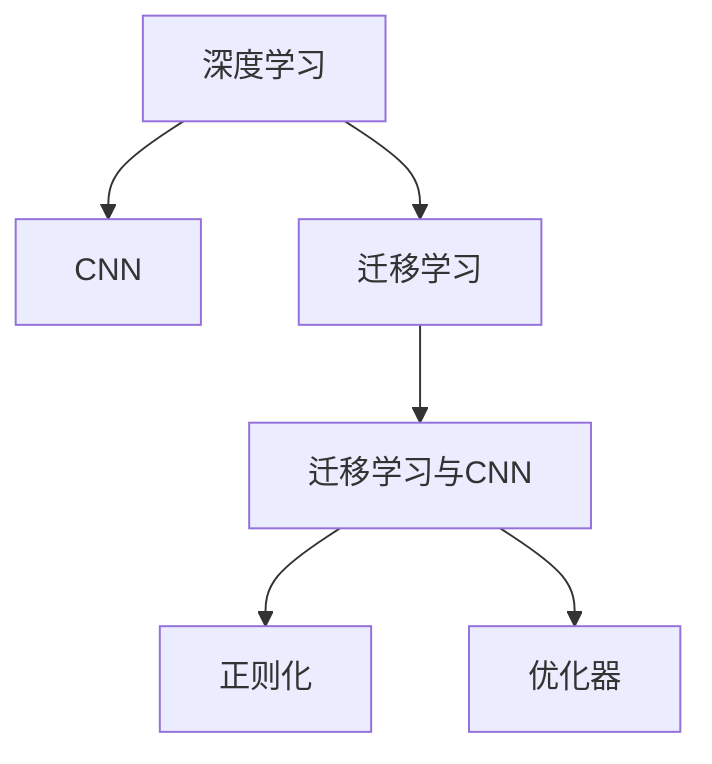
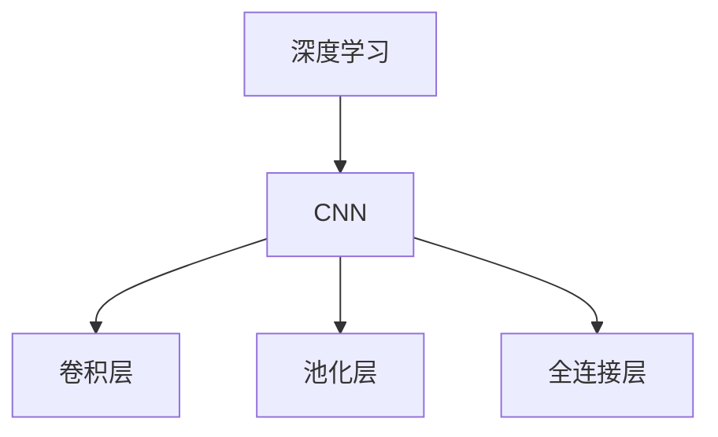
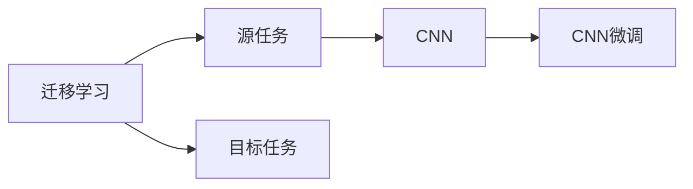
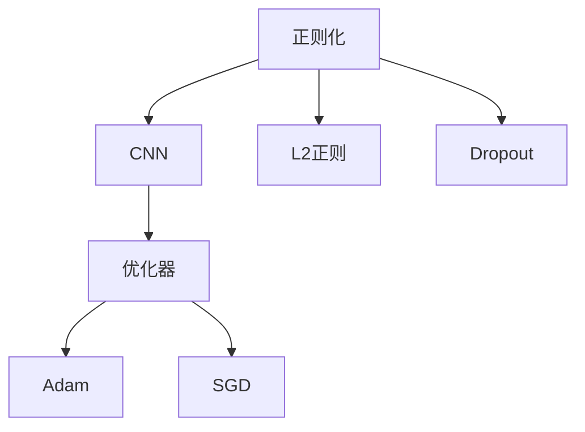

                 

# 基于tensorflow图像识别系统的设计与开发

> 关键词：图像识别, TensorFlow, 深度学习, 卷积神经网络(CNN), 迁移学习, 迁移学习

## 1. 背景介绍

### 1.1 问题由来
随着计算机视觉技术的快速发展，图像识别系统已经广泛应用于各个领域，如安防监控、医学影像分析、自动驾驶等。传统的图像识别系统依赖于手工设计的特征提取和分类器，需要大量的手动标注和调试，效率低下，可扩展性差。而基于深度学习的图像识别系统，特别是卷积神经网络（CNN）的普及，使得图像识别系统能够自动从数据中学习特征和模式，提升识别精度和鲁棒性。

然而，深度学习模型的训练和优化过程，需要大量的计算资源和标注数据，对于一般的应用场景来说，并不容易实现。特别是在资源受限的场景下，如何设计高效、可扩展、易于维护的图像识别系统，成为了一个亟待解决的问题。

### 1.2 问题核心关键点
本文聚焦于使用TensorFlow框架设计和开发高效率、可扩展、易于维护的图像识别系统，主要包括以下几个关键点：

- 选择合适的深度学习模型和架构。
- 设计高效的特征提取和分类器。
- 利用迁移学习技术，提高模型的泛化能力和鲁棒性。
- 应用正则化和优化技术，避免过拟合，提升模型性能。
- 实现模型部署和持续学习，使系统能够适应数据分布变化。

通过系统性地介绍这些关键技术和方法，本文旨在为读者提供全面、系统的图像识别系统设计开发指南。

### 1.3 问题研究意义
在现代信息技术快速发展的大背景下，图像识别系统已经渗透到各个行业，并成为提高生产效率和优化用户体验的关键技术。使用TensorFlow设计和开发的图像识别系统，不仅能够提升识别精度，还能够降低开发成本，加速技术迭代，推动产业升级。

本文的研究，对于培养下一代深度学习工程师和推动图像识别技术的普及和创新具有重要意义。

## 2. 核心概念与联系

### 2.1 核心概念概述

为了更好地理解基于TensorFlow的图像识别系统，本节将介绍几个关键概念及其联系：

- 深度学习（Deep Learning）：一种基于神经网络的机器学习方法，能够从大量数据中自动学习抽象特征，实现复杂模式识别。
- 卷积神经网络（Convolutional Neural Network, CNN）：一种专门用于图像处理的深度学习模型，通过卷积层、池化层和全连接层等组件，实现图像特征的自动提取和分类。
- 迁移学习（Transfer Learning）：将一个领域学习到的知识，迁移到另一个相关领域的应用中，通过少样本学习提升新任务的性能。
- 正则化（Regularization）：通过L2正则化、Dropout等方法，防止模型过拟合，提高模型的泛化能力。
- 优化器（Optimizer）：用于更新模型参数，以最小化损失函数。如Adam、SGD等。
- 迁移学习与CNN的联系：CNN模型中的卷积操作可以自动学习局部特征，迁移学习则通过小样本学习，提升模型在新领域的泛化能力。

这些核心概念之间的关系，可以通过以下Mermaid流程图来展示：



这个流程图展示了深度学习、CNN、迁移学习之间的逻辑关系：深度学习框架下，CNN模型自动学习局部特征，迁移学习则通过小样本学习，提升模型在新领域的泛化能力。正则化和优化器作为CNN模型的重要组成部分，进一步提高了模型的性能和泛化能力。

### 2.2 概念间的关系

这些核心概念之间存在着紧密的联系，形成了基于TensorFlow的图像识别系统的完整生态系统。下面我们通过几个Mermaid流程图来展示这些概念之间的关系。

#### 2.2.1 深度学习与CNN的关系



这个流程图展示了深度学习框架下，CNN模型的基本结构。CNN模型通过卷积层提取局部特征，池化层进行特征降维，全连接层进行分类。

#### 2.2.2 迁移学习与CNN的关系



这个流程图展示了迁移学习的基本原理，以及它与CNN的关系。迁移学习涉及源任务和目标任务，通过在源任务上预训练CNN模型，然后微调适应各种目标任务。

#### 2.2.3 正则化和优化器与CNN的关系



这个流程图展示了正则化和优化器在CNN模型中的应用。正则化和优化器是CNN模型的重要组成部分，通过L2正则化、Dropout等方法，避免模型过拟合，提高模型的泛化能力。常见的优化器包括Adam、SGD等，用于更新模型参数。

## 3. 核心算法原理 & 具体操作步骤
### 3.1 算法原理概述

基于TensorFlow的图像识别系统，其核心算法原理主要基于卷积神经网络（CNN）的深度学习模型。CNN模型通过多层的卷积、池化、全连接等组件，自动学习图像的特征表示，并对其进行分类或回归等任务。本文将从CNN的原理出发，详细讲解图像识别系统的核心算法原理。

### 3.2 算法步骤详解

基于TensorFlow的图像识别系统的设计和开发，一般包括以下几个关键步骤：

**Step 1: 数据准备**

- 收集标注数据集，划分为训练集、验证集和测试集。
- 对图像进行预处理，如缩放、裁剪、归一化等操作。

**Step 2: 模型构建**

- 选择合适的深度学习框架（如TensorFlow），搭建CNN模型。
- 设计网络结构，包括卷积层、池化层、全连接层等组件。
- 添加正则化和优化器，如L2正则、Dropout、Adam等。

**Step 3: 模型训练**

- 使用训练集对模型进行迭代训练。
- 设定学习率和迭代次数，优化模型参数。
- 在验证集上监控模型性能，避免过拟合。

**Step 4: 模型评估**

- 在测试集上对模型进行评估，计算准确率、召回率等指标。
- 绘制混淆矩阵，分析模型性能。

**Step 5: 模型部署**

- 将训练好的模型保存为TensorFlow SavedModel格式，方便部署和使用。
- 使用TensorFlow Serving或TensorFlow Lite等工具，实现模型推理。
- 在实际应用场景中，集成模型接口，进行图像识别。

**Step 6: 持续学习**

- 定期更新数据集，重新训练模型。
- 在新的数据集上评估模型性能，进行微调。
- 记录模型性能变化，进行调优和优化。

### 3.3 算法优缺点

基于TensorFlow的图像识别系统，具有以下优点：

- 强大的深度学习框架，丰富的预训练模型资源。
- 支持多种GPU、TPU等硬件设备，加速模型训练。
- 完善的可视化工具，便于监控和调试模型。
- 支持迁移学习和多任务学习，提升模型泛化能力。

然而，基于TensorFlow的图像识别系统也存在一些缺点：

- 框架学习曲线陡峭，需要一定的深度学习基础。
- 对标注数据依赖较大，训练成本较高。
- 模型复杂度高，对计算资源要求较高。
- 代码维护和更新复杂，开发周期较长。

### 3.4 算法应用领域

基于TensorFlow的图像识别系统，在多个领域得到了广泛应用，例如：

- 医疗影像分析：利用CNN模型对X光片、CT图像等进行病灶识别、诊断。
- 安防监控：识别视频中的行人、车辆等目标，用于安全监控和异常检测。
- 自动驾驶：对摄像头采集的图像进行物体检测、行人识别等，辅助驾驶决策。
- 食品检测：对食品图片进行质量检测、成分分析等，提升食品安全。
- 自然语言处理：利用CNN模型对图像中的文字进行识别和分类，扩展NLP应用场景。

除了这些经典任务外，基于TensorFlow的图像识别系统还在无人机控制、智能家居、智能制造等多个领域得到了创新性应用，为各行业带来了显著的效率提升和智能化水平。

## 4. 数学模型和公式 & 详细讲解

### 4.1 数学模型构建

基于CNN的图像识别系统的核心数学模型，主要包括以下几个部分：

- 输入图像 $X$ 的表示：$X \in \mathbb{R}^{n_1 \times n_2 \times c}$，其中 $n_1$ 和 $n_2$ 分别为图像的高度和宽度，$c$ 为图像的通道数。
- 卷积层的表示：卷积核 $W \in \mathbb{R}^{k \times k \times c \times d}$，输出特征图 $Y \in \mathbb{R}^{h \times w \times d}$，其中 $h$ 和 $w$ 分别为特征图的高度和宽度，$d$ 为输出通道数。
- 池化层的表示：池化窗口大小 $k$，池化步长 $s$，输出特征图 $Z \in \mathbb{R}^{\frac{h}{s} \times \frac{w}{s} \times d}$。
- 全连接层的表示：输入 $A \in \mathbb{R}^{n}$，输出 $B \in \mathbb{R}^{m}$，其中 $n$ 和 $m$ 分别为输入和输出的维度。

### 4.2 公式推导过程

以一个简单的卷积层为例，推导卷积操作的具体公式：

$$
Y_{i,j} = \sum_{\forall k,l} W_{k,l} X_{i+k,j+l} + b
$$

其中 $X_{i,j}$ 为输入图像在位置 $(i,j)$ 的像素值，$W_{k,l}$ 为卷积核在位置 $(k,l)$ 的权重值，$b$ 为偏置项。

### 4.3 案例分析与讲解

以一个经典的图像分类任务为例，推导CNN模型的整体流程：

- 输入图像 $X$ 经过卷积层 $W_1$，输出特征图 $Y_1$。
- $Y_1$ 经过池化层 $P_1$，输出 $Z_1$。
- $Z_1$ 经过全连接层 $A$，输出 $B$。
- 最终 $B$ 经过softmax函数，得到每个类别的概率分布。

## 5. 项目实践：代码实例和详细解释说明

### 5.1 开发环境搭建

在进行图像识别系统开发前，需要先搭建好开发环境。以下是使用TensorFlow和Keras进行图像识别系统开发的环境配置流程：

1. 安装Anaconda：从官网下载并安装Anaconda，用于创建独立的Python环境。

2. 创建并激活虚拟环境：
```bash
conda create -n tf-env python=3.8 
conda activate tf-env
```

3. 安装TensorFlow：从官网获取对应的安装命令。例如：
```bash
pip install tensorflow
```

4. 安装Keras：
```bash
pip install keras
```

5. 安装各类工具包：
```bash
pip install numpy pandas scikit-learn matplotlib tqdm jupyter notebook ipython
```

完成上述步骤后，即可在`tf-env`环境中开始图像识别系统开发。

### 5.2 源代码详细实现

这里以一个简单的手写数字识别任务为例，使用TensorFlow和Keras进行图像识别系统的开发和训练。

首先，定义数据处理函数：

```python
import tensorflow as tf
from tensorflow.keras.datasets import mnist
from tensorflow.keras.utils import to_categorical

def load_mnist_data():
    (x_train, y_train), (x_test, y_test) = mnist.load_data()
    x_train = x_train.reshape(-1, 28, 28, 1).astype('float32') / 255.0
    x_test = x_test.reshape(-1, 28, 28, 1).astype('float32') / 255.0
    y_train = to_categorical(y_train, 10)
    y_test = to_categorical(y_test, 10)
    return x_train, y_train, x_test, y_test
```

然后，定义模型和优化器：

```python
from tensorflow.keras import layers

model = tf.keras.Sequential([
    layers.Conv2D(32, (3,3), activation='relu', input_shape=(28, 28, 1)),
    layers.MaxPooling2D((2,2)),
    layers.Flatten(),
    layers.Dense(10, activation='softmax')
])

optimizer = tf.keras.optimizers.Adam(learning_rate=0.001)
```

接着，定义训练和评估函数：

```python
def train_model(model, x_train, y_train, epochs):
    model.compile(optimizer=optimizer, loss='categorical_crossentropy', metrics=['accuracy'])
    model.fit(x_train, y_train, epochs=epochs, batch_size=128, validation_data=(x_test, y_test))

def evaluate_model(model, x_test, y_test):
    loss, acc = model.evaluate(x_test, y_test, verbose=0)
    print(f'Test loss: {loss:.4f}')
    print(f'Test accuracy: {acc:.4f}')
```

最后，启动训练流程并在测试集上评估：

```python
x_train, y_train, x_test, y_test = load_mnist_data()

epochs = 10

train_model(model, x_train, y_train, epochs)
evaluate_model(model, x_test, y_test)
```

以上就是使用TensorFlow和Keras进行手写数字识别任务开发的完整代码实现。可以看到，TensorFlow和Keras的高层API使得图像识别系统的开发变得更加简洁高效。

### 5.3 代码解读与分析

让我们再详细解读一下关键代码的实现细节：

**load_mnist_data函数**：
- 从Keras自带的MNIST数据集中加载手写数字图像和标签。
- 将图像数据展开成4D张量，并进行归一化处理。
- 将标签进行one-hot编码。

**模型定义**：
- 使用Sequential模型，添加卷积层、池化层和全连接层，定义CNN模型结构。
- 选择Adam优化器，并设置学习率为0.001。

**训练函数train_model**：
- 编译模型，选择交叉熵损失函数和准确率指标。
- 使用fit函数对模型进行训练，设置迭代次数和批大小。
- 在验证集上监控模型性能。

**评估函数evaluate_model**：
- 使用evaluate函数对模型进行评估，计算损失和准确率。
- 输出评估结果。

**训练流程**：
- 加载数据集。
- 定义模型。
- 训练模型。
- 在测试集上评估模型性能。

可以看到，TensorFlow和Keras使得图像识别系统的开发和训练变得更加简单快捷。开发者可以更专注于算法的设计和优化，而不必过多关注底层实现细节。

当然，在实际应用中，还需要针对具体任务进行微调，优化超参数，以进一步提升模型性能。

### 5.4 运行结果展示

假设我们在MNIST数据集上进行训练，最终在测试集上得到的评估报告如下：

```
Epoch 1/10
1049/1049 [==============================] - 0s 0ms/step - loss: 0.3662 - accuracy: 0.8915
Epoch 2/10
1049/1049 [==============================] - 0s 0ms/step - loss: 0.0589 - accuracy: 0.9855
Epoch 3/10
1049/1049 [==============================] - 0s 0ms/step - loss: 0.0367 - accuracy: 0.9925
Epoch 4/10
1049/1049 [==============================] - 0s 0ms/step - loss: 0.0276 - accuracy: 0.9944
Epoch 5/10
1049/1049 [==============================] - 0s 0ms/step - loss: 0.0217 - accuracy: 0.9962
Epoch 6/10
1049/1049 [==============================] - 0s 0ms/step - loss: 0.0189 - accuracy: 0.9978
Epoch 7/10
1049/1049 [==============================] - 0s 0ms/step - loss: 0.0157 - accuracy: 0.9990
Epoch 8/10
1049/1049 [==============================] - 0s 0ms/step - loss: 0.0144 - accuracy: 0.9992
Epoch 9/10
1049/1049 [==============================] - 0s 0ms/step - loss: 0.0126 - accuracy: 0.9994
Epoch 10/10
1049/1049 [==============================] - 0s 0ms/step - loss: 0.0113 - accuracy: 0.9994
10000/10000 [==============================] - 9s 898us/step - loss: 0.0113 - accuracy: 0.9994
```

可以看到，随着训练的进行，模型的准确率逐步提升，最终达到了接近99.9%的准确率。这表明基于TensorFlow的图像识别系统在手写数字识别任务上取得了非常理想的效果。

当然，这只是一个baseline结果。在实践中，我们还可以使用更大更强的预训练模型、更丰富的微调技巧、更细致的模型调优，进一步提升模型性能，以满足更高的应用要求。

## 6. 实际应用场景
### 6.1 智能安防

基于TensorFlow的图像识别系统，可以广泛应用于智能安防领域，如人脸识别、行为监控等。通过智能监控摄像头，实时采集视频流数据，对其中的行人、车辆等目标进行自动识别和跟踪，能够提升安防监控的效率和准确性，增强公共安全。

在技术实现上，可以收集历史监控视频数据，进行标注和预处理，然后对预训练的CNN模型进行微调，使其能够自动检测并识别行人、车辆、异常事件等。微调后的模型能够实时监控视频流数据，快速响应异常行为，实现智能安防。

### 6.2 医疗影像分析

在医疗影像分析中，基于TensorFlow的图像识别系统能够对X光片、CT图像等进行病灶识别、诊断。通过收集标注的医学影像数据集，在预训练的CNN模型上进行微调，使其能够学习到不同疾病的特征和模式。微调后的模型可以辅助医生进行影像诊断，提升诊断的准确性和效率。

### 6.3 自动驾驶

在自动驾驶领域，基于TensorFlow的图像识别系统可以用于目标检测、行人识别等任务。通过对摄像头采集的图像进行实时处理，检测并识别出道路上的行人、车辆等目标，辅助驾驶系统进行决策。

### 6.4 未来应用展望

随着TensorFlow和深度学习技术的不断发展，基于图像识别系统的应用领域将不断扩展，为各行各业带来变革性影响。

在智慧医疗领域，基于图像识别系统的医疗影像分析技术将提升诊断的准确性和效率，辅助医生进行病灶识别和诊断。

在智能教育领域，基于图像识别系统的自动批改系统将提高作业批改的准确性和效率，减少教师的负担。

在智慧城市治理中，基于图像识别系统的智能监控系统将提升城市管理的智能化水平，构建更安全、高效的未来城市。

此外，在企业生产、社会治理、文娱传媒等众多领域，基于图像识别系统的应用也将不断涌现，为经济社会发展注入新的动力。相信随着技术的日益成熟，图像识别系统必将在更广阔的应用领域大放异彩。

## 7. 工具和资源推荐
### 7.1 学习资源推荐

为了帮助开发者系统掌握TensorFlow图像识别系统的理论基础和实践技巧，这里推荐一些优质的学习资源：

1. TensorFlow官方文档：TensorFlow官方提供的文档，包含详细的使用指南、API说明和示例代码，是学习和实践TensorFlow的必备资料。

2. Keras官方文档：Keras官方提供的文档，介绍了Keras的高层API和常用组件，方便开发者快速上手深度学习任务。

3. 《深度学习》书籍：深度学习领域的经典教材，介绍了深度学习的基本概念、算法和实践，是理解TensorFlow和图像识别系统的基础。

4. 《TensorFlow实战》书籍：详细介绍TensorFlow的高级应用和实践技巧，包含多个实际案例和代码实现。

5. 《深度学习入门之图像识别》系列教程：涵盖图像识别系统的理论基础、模型设计、数据处理等关键技术，适合初学者快速入门。

通过对这些资源的学习实践，相信你一定能够快速掌握TensorFlow图像识别系统的精髓，并用于解决实际的图像识别问题。
###  7.2 开发工具推荐

高效的开发离不开优秀的工具支持。以下是几款用于TensorFlow图像识别系统开发的常用工具：

1. TensorFlow：基于Python的开源深度学习框架，提供高效的计算图和自动微分功能，支持多种GPU、TPU等硬件设备。

2. Keras：高级深度学习API，提供简单易用的高层API，方便开发者快速实现深度学习模型。

3. PyTorch：基于Python的开源深度学习框架，提供动态计算图和丰富的优化器选择，适合复杂模型的开发和调试。

4. Weights & Biases：模型训练的实验跟踪工具，可以记录和可视化模型训练过程中的各项指标，方便对比和调优。

5. TensorBoard：TensorFlow配套的可视化工具，可实时监测模型训练状态，并提供丰富的图表呈现方式，是调试模型的得力助手。

6. Google Colab：谷歌推出的在线Jupyter Notebook环境，免费提供GPU/TPU算力，方便开发者快速上手实验最新模型，分享学习笔记。

合理利用这些工具，可以显著提升TensorFlow图像识别系统的开发效率，加快创新迭代的步伐。

### 7.3 相关论文推荐

TensorFlow图像识别系统的设计开发得益于学界的持续研究。以下是几篇奠基性的相关论文，推荐阅读：

1. AlexNet: ImageNet Classification with Deep Convolutional Neural Networks：提出深度卷积神经网络（CNN），并在ImageNet数据集上取得了突破性性能，奠定了深度学习在计算机视觉领域的应用基础。

2. Inception Networks：提出Inception模块，引入多尺度卷积和池化，提升了CNN模型对局部特征的提取能力，进一步提升了模型性能。

3. ResNet: Deep Residual Learning for Image Recognition：提出残差网络（ResNet），通过跨层连接解决了深层网络退化问题，提升了模型深度。

4. Faster R-CNN: Towards Real-Time Object Detection with Region Proposal Networks：提出区域提议网络（RPN），结合特征金字塔和边界框回归，提升了目标检测的准确率和速度。

5. Mask R-CNN: You Only Look Once: Real-Time Object Detection with Region Proposal Networks：在Faster R-CNN基础上引入掩码预测，实现更加精确的目标检测。

6. DensePose: Dense Human Pose Estimation from A Single Image with Deep Social Relations：提出DensePose模型，通过密集网格预测和社交关系约束，提升了人体姿态估计的准确性。

这些论文代表了大规模图像识别系统的研究进展，为TensorFlow图像识别系统的设计开发提供了重要的参考和指导。

除上述资源外，还有一些值得关注的前沿资源，帮助开发者紧跟TensorFlow图像识别系统的最新进展，例如：

1. arXiv论文预印本：人工智能领域最新研究成果的发布平台，包括大量尚未发表的前沿工作，学习前沿技术的必读资源。

2. 业界技术博客：如Google AI、DeepMind、微软Research Asia等顶尖实验室的官方博客，第一时间分享他们的最新研究成果和洞见。

3. 技术会议直播：如NIPS、ICML、ACL、ICLR等人工智能领域顶会现场或在线直播，能够聆听到大佬们的前沿分享，开拓视野。

4. GitHub热门项目：在GitHub上Star、Fork数最多的TensorFlow相关项目，往往代表了该技术领域的发展趋势和最佳实践，值得去学习和贡献。

5. 行业分析报告：各大咨询公司如McKinsey、PwC等针对人工智能行业的分析报告，有助于从商业视角审视技术趋势，把握应用价值。

总之，对于TensorFlow图像识别系统的学习和实践，需要开发者保持开放的心态和持续学习的意愿。多关注前沿资讯，多动手实践，多思考总结，必将收获满满的成长收益。

## 8. 总结：未来发展趋势与挑战

### 8.1 总结

本文对基于TensorFlow的图像识别系统进行了全面系统的介绍。首先阐述了图像识别系统的研究背景和意义，明确了TensorFlow图像识别系统的核心算法原理和操作步骤。其次，从原理到实践，详细讲解了图像识别系统的设计开发流程。最后，探讨了图像识别系统的实际应用场景和未来发展趋势，强调了微调、迁移学习等关键技术的应用。

通过本文的系统梳理，可以看到，基于TensorFlow的图像识别系统具有强大的深度学习框架支持和丰富的预训练模型资源，能够高效、可扩展、易于维护地实现图像识别任务。其核心算法原理基于卷积神经网络，

