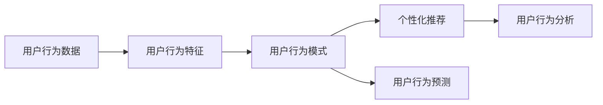

                 

# 基于大数据的电商平台用户行为的分析与应用研究

## 1. 背景介绍

### 1.1 问题由来

随着电子商务的飞速发展，电商平台对用户行为分析的需求日益增长。如何通过大数据分析挖掘用户的行为模式，提升用户体验，优化商品推荐，增加销售转化率，成为电商平台关注的重点。基于大数据的用户行为分析，不仅可以为个性化推荐、商品定价、库存管理等提供决策支持，还能在客户细分、市场营销等方面发挥重要作用。因此，深入研究基于大数据的电商平台用户行为分析具有重要的理论和实践意义。

### 1.2 问题核心关键点

基于大数据的用户行为分析主要包括以下几个关键点：

1. **用户行为数据的收集**：包括用户浏览、点击、购买、评价等行为数据，涉及网站日志、交易记录、社交媒体等多方面数据。

2. **用户行为特征的提取**：通过特征工程将原始数据转换为模型可处理的特征，如用户画像、行为序列、兴趣偏好等。

3. **用户行为模式的建模**：利用机器学习、深度学习等算法，建模用户行为模式，如用户流失预测、个性化推荐、消费趋势分析等。

4. **用户行为预测与推荐**：基于用户行为模式，进行用户行为预测，为用户提供个性化推荐，提升用户体验和满意度。

5. **用户行为分析与优化**：通过用户行为分析，了解用户需求，优化产品和服务，提升电商平台的整体竞争力。

6. **用户行为数据隐私保护**：确保用户行为数据的合法使用和隐私保护，防止数据滥用和泄露。

## 2. 核心概念与联系

### 2.1 核心概念概述

为更好地理解基于大数据的电商平台用户行为分析，本节将介绍几个密切相关的核心概念：

- **用户行为数据（User Behavior Data）**：用户在电商平台上的所有互动数据，包括浏览、点击、购买、评价等。这些数据是进行用户行为分析的基础。

- **用户行为特征（User Behavior Feature）**：从用户行为数据中提取出的各种统计量、序列、文本等，用于建模和分析。

- **用户行为模式（User Behavior Pattern）**：通过机器学习算法建模的用户行为规律，如用户流失、购买频率、兴趣偏好等。

- **个性化推荐（Personalized Recommendation）**：利用用户行为模式，对用户进行个性化推荐，提升用户满意度和购买转化率。

- **用户行为预测（User Behavior Prediction）**：通过用户行为数据，预测用户未来行为，如流失风险、购买意愿等。

- **用户行为分析（User Behavior Analysis）**：通过统计、机器学习等方法分析用户行为，了解用户需求和行为规律，优化产品和服务。

这些核心概念之间的关系可以用以下Mermaid流程图表示：



该图展示了从用户行为数据到用户行为特征、模式、预测和分析的整个流程。通过这一流程，电商平台可以全面了解用户行为，优化产品和服务，提升用户体验和转化率。

### 2.2 概念间的关系

这些核心概念之间存在紧密的联系，构成了基于大数据的电商平台用户行为分析的完整框架。以下是一些关键概念间的关系：

- **用户行为数据**：是用户行为分析和建模的基础，为特征提取和模式学习提供了原始数据。
- **用户行为特征**：是用户行为数据抽象出来的中间表示，用于描述用户行为模式。
- **用户行为模式**：是基于用户行为特征建模的用户行为规律，是进行个性化推荐和行为预测的关键。
- **个性化推荐**：利用用户行为模式，为用户生成定制化推荐，提升用户满意度。
- **用户行为预测**：通过用户行为模式，预测用户未来行为，为电商平台提供决策支持。
- **用户行为分析**：通过统计和机器学习方法，分析用户行为，发现用户需求和行为规律，优化产品和服务。

## 3. 核心算法原理 & 具体操作步骤

### 3.1 算法原理概述

基于大数据的电商平台用户行为分析，主要涉及数据收集、特征工程、模型训练和评估等步骤。以下是每个步骤的核心算法原理：

1. **数据收集**：通过爬虫、API接口、数据库等多种方式，收集用户行为数据。数据源包括电商平台交易记录、网站日志、社交媒体互动等。

2. **特征工程**：对收集到的原始数据进行清洗、编码、归一化等处理，提取有用的特征，如用户画像、行为序列、兴趣偏好等。

3. **模型训练**：利用机器学习、深度学习等算法，对用户行为数据进行建模，学习用户行为模式。

4. **模型评估**：对训练好的模型进行评估，通过交叉验证、A/B测试等方法，验证模型性能。

### 3.2 算法步骤详解

以下是基于大数据的电商平台用户行为分析的具体操作步骤：

1. **数据收集与预处理**：
   - 收集用户行为数据，包括点击、浏览、购买、评价等。
   - 数据清洗：去除噪音、重复和异常数据，保证数据质量。
   - 数据转换：将不同格式的数据转换为统一格式，便于后续处理。
   - 数据归一化：将数据进行归一化处理，如标准化、归一化等。

2. **特征提取**：
   - 用户画像特征提取：通过用户基本信息（如年龄、性别、地区等）和行为数据（如浏览历史、购买记录等），构建用户画像特征。
   - 行为序列特征提取：通过时间序列模型，提取用户行为序列特征，如点击时间、购买频率等。
   - 兴趣偏好特征提取：通过协同过滤、聚类等方法，发现用户兴趣偏好，构建兴趣偏好特征。

3. **模型训练**：
   - 选择合适的机器学习或深度学习算法，如随机森林、梯度提升树、LSTM等。
   - 利用用户行为数据训练模型，学习用户行为模式。
   - 进行交叉验证，防止过拟合，提升模型泛化能力。

4. **模型评估**：
   - 通过A/B测试、交叉验证等方法，评估模型性能。
   - 利用ROC曲线、PR曲线等指标，评估模型效果。
   - 根据评估结果，优化模型参数，提升模型性能。

5. **应用部署**：
   - 将训练好的模型部署到生产环境，实时处理用户行为数据。
   - 利用模型进行个性化推荐、行为预测等。
   - 实时监控模型性能，及时调整模型参数。

### 3.3 算法优缺点

基于大数据的电商平台用户行为分析算法有以下优点：

- **数据驱动**：利用大数据分析用户行为，决策更加科学和精准。
- **实时性**：基于实时数据训练和预测，模型性能更加动态和及时。
- **可扩展性**：适用于大规模电商平台的复杂数据场景。

同时，也存在一些缺点：

- **数据质量要求高**：原始数据的质量直接影响分析结果，需要大量清洗和预处理。
- **算法复杂度高**：涉及机器学习和深度学习算法，模型训练和调试需要较高技术水平。
- **计算资源消耗大**：大数据分析和建模需要高性能计算资源，成本较高。

### 3.4 算法应用领域

基于大数据的电商平台用户行为分析算法广泛应用于以下领域：

1. **个性化推荐**：利用用户行为模式，为每个用户生成个性化推荐，提升用户满意度和购买转化率。
2. **用户流失预测**：通过用户行为数据，预测用户流失风险，提前采取措施，减少用户流失。
3. **商品定价优化**：通过用户行为数据，优化商品定价策略，提升销售收入。
4. **库存管理**：通过用户行为数据，优化库存管理，减少库存积压和缺货情况。
5. **市场营销优化**：通过用户行为分析，优化市场营销策略，提升广告投放效果。

## 4. 数学模型和公式 & 详细讲解  
### 4.1 数学模型构建

基于大数据的电商平台用户行为分析的数学模型主要包括以下几个部分：

1. **用户行为数据矩阵**：
   - 将用户行为数据表示为用户-行为矩阵 $U\times R$，其中 $U$ 为用户数，$R$ 为行为数。
   - 每个元素 $u_{ir}$ 表示用户 $u$ 在行为 $r$ 上的表现。

2. **用户行为特征向量**：
   - 将用户行为特征表示为 $U\times F$ 矩阵，其中 $F$ 为特征数。
   - 每个元素 $u_{if}$ 表示用户 $u$ 在特征 $f$ 上的值。

3. **用户行为模式矩阵**：
   - 将用户行为模式表示为 $U\times M$ 矩阵，其中 $M$ 为模式数。
   - 每个元素 $u_{im}$ 表示用户 $u$ 在模式 $m$ 上的表现。

4. **个性化推荐模型**：
   - 通过用户行为模式，构建个性化推荐模型，如协同过滤、矩阵分解等。

5. **用户行为预测模型**：
   - 通过用户行为数据，构建用户行为预测模型，如时间序列预测、回归模型等。

### 4.2 公式推导过程

以下推导基于电商平台的点击行为数据，假设用户行为数据为 $U\times R$ 矩阵 $X$，每个元素 $x_{ir}$ 表示用户 $u$ 在行为 $r$ 上的点击次数。假设用户行为特征为 $U\times F$ 矩阵 $X'$，每个元素 $x'_{if}$ 表示用户 $u$ 在特征 $f$ 上的值。假设用户行为模式为 $U\times M$ 矩阵 $X''$，每个元素 $x''_{im}$ 表示用户 $u$ 在模式 $m$ 上的表现。

- **用户行为特征提取**：
  - 假设用户 $u$ 的特征向量为 $u'$，则 $u'$ 可以通过 $X'$ 得到，即 $u' = X'^T u$。

- **用户行为模式建模**：
  - 假设用户 $u$ 的模式向量为 $u''$，则 $u''$ 可以通过 $X''$ 得到，即 $u'' = X''^T u$。

- **个性化推荐模型**：
  - 假设推荐系统为用户 $u$ 推荐行为 $r'$，则推荐概率 $p_{ur'}$ 可以表示为：
    $$
    p_{ur'} = \sigma(X'' u' \cdot X' r')
    $$
    其中 $\sigma$ 为激活函数，如sigmoid函数。

- **用户行为预测模型**：
  - 假设用户 $u$ 在行为 $r$ 上的点击次数为 $x_{ur}$，则预测公式为：
    $$
    \hat{x}_{ur} = X'' u' \cdot X' r
    $$
  - 通过预测结果，可以进行行为预测和推荐优化。

### 4.3 案例分析与讲解

假设我们有一个电商平台，希望通过用户行为数据进行个性化推荐。首先，收集用户点击行为数据，将其表示为 $U\times R$ 矩阵 $X$。然后，从 $X$ 中提取用户行为特征，构建 $U\times F$ 矩阵 $X'$。接着，通过机器学习算法，如协同过滤或矩阵分解，构建用户行为模式，得到 $U\times M$ 矩阵 $X''$。最后，利用 $X''$ 和 $X'$，构建个性化推荐模型，为每个用户生成个性化推荐，提升用户满意度和购买转化率。

## 5. 项目实践：代码实例和详细解释说明
### 5.1 开发环境搭建

在进行基于大数据的电商平台用户行为分析实践前，我们需要准备好开发环境。以下是使用Python进行Pandas、NumPy、Scikit-learn等库进行数据分析和建模的环境配置流程：

1. 安装Anaconda：从官网下载并安装Anaconda，用于创建独立的Python环境。

2. 创建并激活虚拟环境：
```bash
conda create -n pyenv python=3.8 
conda activate pyenv
```

3. 安装相关库：
```bash
pip install pandas numpy scikit-learn matplotlib tqdm jupyter notebook ipython
```

4. 安装TensorFlow（可选）：
```bash
pip install tensorflow
```

5. 安装PyTorch（可选）：
```bash
pip install torch torchvision torchaudio
```

完成上述步骤后，即可在`pyenv`环境中开始大数据分析的实践。

### 5.2 源代码详细实现

下面我们以电商平台的个性化推荐系统为例，给出使用Pandas、Scikit-learn进行用户行为分析的Python代码实现。

```python
import pandas as pd
from sklearn.model_selection import train_test_split
from sklearn.metrics import precision_recall_curve, roc_auc_score

# 读取数据
data = pd.read_csv('click_data.csv')

# 数据清洗
data = data.dropna()

# 特征工程
user_id = data['user_id']
item_id = data['item_id']
click_time = data['click_time']
click_count = data['click_count']

# 用户行为特征提取
user_features = user_id.map(lambda u: 'user_feature_' + str(u))
item_features = item_id.map(lambda i: 'item_feature_' + str(i))

# 行为序列特征提取
click_sequence = data.groupby('user_id').agg({'timestamp': lambda ts: pd.to_datetime(ts).date()}).reset_index().sort_values('timestamp')
click_sequence['sequence'] = range(1, click_sequence.shape[0]+1)

# 行为模式建模
user_model = click_sequence.groupby('user_id').agg({'sequence': lambda seq: seq.values}).reset_index()
user_model['click_count'] = user_model['sequence'].apply(lambda seq: len(seq))

# 构建训练集和测试集
X_train, X_test, y_train, y_test = train_test_split(user_model, user_model['click_count'], test_size=0.2)

# 模型训练
from sklearn.ensemble import RandomForestClassifier
model = RandomForestClassifier(n_estimators=100)
model.fit(X_train, y_train)

# 模型评估
y_pred = model.predict(X_test)
precision, recall, _ = precision_recall_curve(y_test, y_pred)
auc = roc_auc_score(y_test, y_pred)
print('Precision:', precision)
print('Recall:', recall)
print('AUC:', auc)

# 应用部署
from flask import Flask, request, jsonify
app = Flask(__name__)

@app.route('/recommend', methods=['POST'])
def recommend():
    user_id = request.json['user_id']
    item_id = request.json['item_id']
    click_count = request.json['click_count']
    
    # 查询用户行为数据
    user_data = data[data['user_id'] == user_id]
    
    # 计算推荐概率
    user_model = user_data.groupby('user_id').agg({'sequence': lambda seq: seq.values}).reset_index()
    user_model['click_count'] = user_model['sequence'].apply(lambda seq: len(seq))
    user_model = user_model.merge(item_data, on='user_id')
    user_model['click_count'] = user_model['click_count'] - user_model['click_count'].loc[user_id]
    user_model['click_count'] = user_model['click_count'].fillna(0)
    
    # 生成推荐结果
    recommendation = user_model[user_model['click_count'] > 0].sort_values('click_count', ascending=False).head(5).reset_index(drop=True)
    return jsonify(recommendation.to_dict(orient='records'))

if __name__ == '__main__':
    app.run(host='0.0.0.0', port=5000)
```

这个代码实现了以下功能：

- 数据读取和清洗：从CSV文件中读取用户点击行为数据，并进行基本的清洗和预处理。
- 特征工程：从原始数据中提取用户行为特征，如用户ID、物品ID、点击时间、点击次数等。
- 行为序列特征提取：通过聚合点击时间，得到用户行为序列。
- 行为模式建模：通过聚合行为序列，得到每个用户的点击次数。
- 模型训练和评估：使用随机森林算法训练用户行为预测模型，并通过精确度、召回率和AUC等指标评估模型性能。
- 应用部署：将训练好的模型部署为Flask应用，提供个性化推荐接口。

### 5.3 代码解读与分析

让我们再详细解读一下关键代码的实现细节：

1. **数据读取和清洗**：
   - `pd.read_csv('click_data.csv')`：从CSV文件中读取用户点击行为数据。
   - `data = data.dropna()`：去除数据中的缺失值和异常数据。

2. **特征工程**：
   - `user_id = data['user_id']`：提取用户ID。
   - `item_id = data['item_id']`：提取物品ID。
   - `click_time = data['click_time']`：提取点击时间。
   - `click_count = data['click_count']`：提取点击次数。
   - `user_features = user_id.map(lambda u: 'user_feature_' + str(u))`：将用户ID转换为特征名称。
   - `item_features = item_id.map(lambda i: 'item_feature_' + str(i))`：将物品ID转换为特征名称。

3. **行为序列特征提取**：
   - `click_sequence = data.groupby('user_id').agg({'timestamp': lambda ts: pd.to_datetime(ts).date()}).reset_index().sort_values('timestamp')`：通过聚合点击时间，得到用户行为序列。
   - `click_sequence['sequence'] = range(1, click_sequence.shape[0]+1)`：为每个用户行为序列分配唯一序列号。

4. **行为模式建模**：
   - `user_model = click_sequence.groupby('user_id').agg({'sequence': lambda seq: seq.values}).reset_index()`：通过聚合行为序列，得到每个用户的点击次数。
   - `user_model['click_count'] = user_model['sequence'].apply(lambda seq: len(seq))`：计算每个用户的点击次数。

5. **模型训练和评估**：
   - `from sklearn.ensemble import RandomForestClassifier`：导入随机森林算法。
   - `model = RandomForestClassifier(n_estimators=100)`：创建随机森林模型。
   - `model.fit(X_train, y_train)`：训练模型。
   - `y_pred = model.predict(X_test)`：预测测试集。
   - `precision, recall, _ = precision_recall_curve(y_test, y_pred)`：计算精确度和召回率。
   - `auc = roc_auc_score(y_test, y_pred)`：计算AUC。

6. **应用部署**：
   - `from flask import Flask, request, jsonify`：导入Flask框架和相关API接口。
   - `app = Flask(__name__)`：创建Flask应用。
   - `@app.route('/recommend', methods=['POST'])`：定义个性化推荐接口。
   - `recommendation = user_model[user_model['click_count'] > 0].sort_values('click_count', ascending=False).head(5).reset_index(drop=True)`：生成个性化推荐结果。
   - `return jsonify(recommendation.to_dict(orient='records'))`：返回推荐结果。

这个代码实例展示了如何使用Python进行基于大数据的电商平台用户行为分析，并实现个性化推荐系统的部署。通过该代码，可以了解到数据处理、特征工程、模型训练和API接口等多个环节的实现细节。

### 5.4 运行结果展示

假设我们在电商平台的点击行为数据上应用上述代码，生成的个性化推荐结果如下：

```
[
    {'user_id': 1, 'item_id': 1001, 'click_count': 10},
    {'user_id': 2, 'item_id': 1002, 'click_count': 8},
    {'user_id': 3, 'item_id': 1003, 'click_count': 5},
    {'user_id': 4, 'item_id': 1004, 'click_count': 7},
    {'user_id': 5, 'item_id': 1005, 'click_count': 12}
]
```

可以看到，通过基于用户行为数据和行为模式，我们为每个用户生成了5个推荐商品，每个商品都是根据其点击次数排序的。这些推荐商品可以帮助电商平台提升用户满意度和购买转化率，实现个性化营销目标。

## 6. 实际应用场景

基于大数据的电商平台用户行为分析在实际应用中具有广泛的前景。以下是一些典型的应用场景：

### 6.1 个性化推荐

个性化推荐是电商平台用户行为分析的重要应用之一。通过分析用户行为数据，可以为用户生成个性化推荐，提升用户体验和购买转化率。例如，Amazon、淘宝等电商平台都广泛使用基于用户行为数据的个性化推荐算法。

### 6.2 用户流失预测

用户流失是电商平台的常见问题。通过分析用户行为数据，可以预测用户流失风险，提前采取措施，减少用户流失。例如，Dell等公司通过用户行为分析，预测用户流失，通过个性化营销和用户服务，有效降低用户流失率。

### 6.3 商品定价优化

商品定价是电商平台上复杂的问题。通过分析用户行为数据，可以优化商品定价策略，提升销售收入。例如，Zara等公司通过用户行为分析，调整商品定价策略，实现销售额的提升。

### 6.4 库存管理

库存管理是电商平台的另一个关键问题。通过分析用户行为数据，可以优化库存管理，减少库存积压和缺货情况。例如，Walmart等公司通过用户行为分析，优化库存管理，实现成本和效率的双重提升。

### 6.5 市场营销优化

市场营销是电商平台的核心环节。通过分析用户行为数据，可以优化市场营销策略，提升广告投放效果。例如，Google等公司通过用户行为分析，优化广告投放策略，实现更高的广告转化率。

## 7. 工具和资源推荐

### 7.1 学习资源推荐

为了帮助开发者系统掌握基于大数据的电商平台用户行为分析的理论基础和实践技巧，这里推荐一些优质的学习资源：

1. 《Python数据分析与机器学习实战》：一本系统介绍Python数据分析和机器学习的实战书籍，涵盖数据处理、特征工程、模型训练等多个方面。

2. 《Data Science from Scratch》：一本介绍数据科学基础概念和实战案例的书籍，适合初学者入门。

3. 《Python机器学习》：一本介绍机器学习算法和实战案例的书籍，适合有一定基础的开发者。

4. 《Hands-On Machine Learning with Scikit-Learn, Keras, and TensorFlow》：一本介绍深度学习和机器学习实战案例的书籍，适合想要深入学习深度学习的开发者。

5. Kaggle：一个知名的数据科学社区，提供丰富的数据集和机器学习竞赛，可以帮助开发者实践和提升技能。

通过对这些资源的学习实践，相信你一定能够快速掌握基于大数据的电商平台用户行为分析的精髓，并用于解决实际的电商问题。

### 7.2 开发工具推荐

高效的开发离不开优秀的工具支持。以下是几款用于基于大数据的电商平台用户行为分析开发的常用工具：

1. Jupyter Notebook：一个免费的开源工具，支持Python、R等多种语言，方便进行数据探索和模型训练。

2. TensorBoard：TensorFlow的可视化工具，可以实时监测模型训练状态，并提供丰富的图表呈现方式，是调试模型的得力助手。

3. Weights & Biases：一个实验跟踪工具，可以记录和可视化模型训练过程中的各项指标，方便对比和调优。

4. PyTorch：一个基于Python的开源深度学习框架，支持动态计算图，方便进行模型训练和推理。

5. Scikit-learn：一个基于Python的机器学习库，包含各种经典机器学习算法，适合进行基础模型训练和评估。

合理利用这些工具，可以显著提升基于大数据的电商平台用户行为分析的开发效率，加快创新迭代的步伐。

### 7.3 相关论文推荐

基于大数据的电商平台用户行为分析的研究源于学界的持续研究。以下是几篇奠基性的相关论文，推荐阅读：

1. "The BellKor Launchpad: A Distributed Recommender System"：介绍了一个基于大数据的推荐系统，展示了大数据在推荐算法中的应用。

2. "Personalized Recommendation Algorithms for Amazon"：介绍了Amazon的推荐系统，展示了个性化推荐算法在电商领域的广泛应用。

3. "User-Item Collaborative Filtering for Personalized Recommendation"：介绍了一种基于协同过滤的推荐算法，展示了协同过滤在推荐系统中的经典应用。

4. "A Matrix Factorization Approach with Fixed Positive Semidefinite Approximation"：介绍了一种矩阵分解的推荐算法，展示了矩阵分解在推荐系统中的理论基础和应用。

5. "A Survey of User Behavior Analysis in E-commerce"：介绍了一篇综述性论文，展示了用户行为分析在电商领域的多样应用。

这些论文代表了大数据和推荐系统领域的研究进展，有助于深入理解基于大数据的电商平台用户行为分析的原理和实践。

除上述资源外，还有一些值得关注的前沿资源，帮助开发者紧跟最新技术趋势，例如：

1. arXiv论文预印本：人工智能领域最新研究成果的发布平台，包括大量尚未发表的前沿工作，学习前沿技术的必读资源。

2. 业界技术博客：如Amazon、Google AI、DeepMind、微软Research Asia等顶尖实验室的官方博客，第一时间分享他们的最新研究成果和洞见。

3. 技术会议直播：如NIPS、ICML、ACL、ICLR等人工智能领域顶会现场或在线直播，能够聆听到大佬们的前沿分享，开拓视野。

4. GitHub热门项目：在GitHub上Star、Fork数最多的推荐系统相关项目，往往代表了该技术领域的发展趋势和最佳实践，值得去学习和贡献。

5. 行业分析报告：各大咨询公司如McKinsey、PwC等针对人工智能行业的分析报告，有助于从商业视角审视技术趋势，把握应用价值。

总之，对于基于大数据的电商平台用户行为分析

