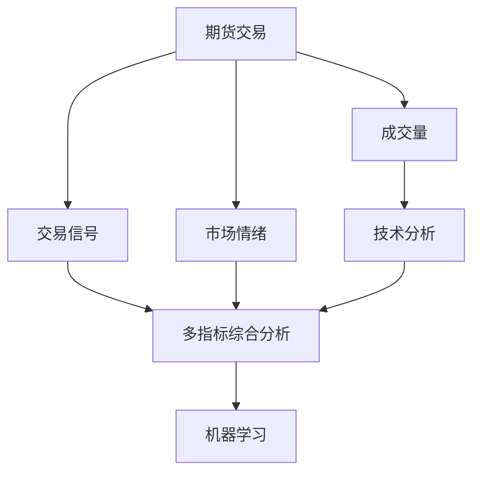
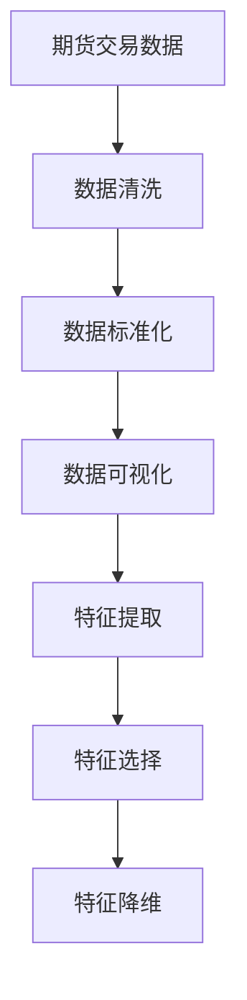
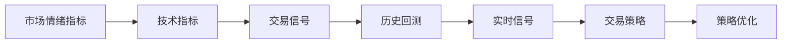
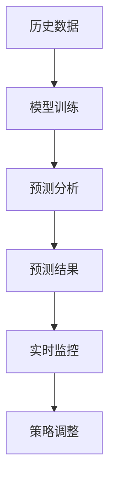
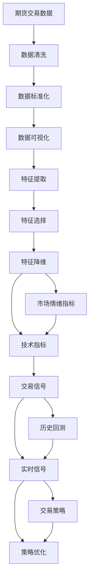

                 

# 基于期货大数据的成交量优化分析研究

## 1. 背景介绍

### 1.1 问题由来
期货交易是一种高风险、高收益的投资活动。在期货市场中，成交量是反映市场情绪和交易活跃度的重要指标之一。如何根据成交量信息，对交易策略进行优化，是期货交易中的一个重要课题。

然而，期货交易市场数据量巨大，结构复杂，传统的数据分析方法往往难以处理和解释这些数据。此外，期货市场波动性强，单一的指标无法全面反映市场情况，需要综合考虑多种因素。因此，基于期货大数据的成交量优化分析，成为了期货交易策略优化的重要研究方向。

### 1.2 问题核心关键点
期货大数据的成交量优化分析，核心在于如何从海量数据中提取有价值的特征，并结合多种指标，进行综合分析和预测。具体问题包括：
- 如何从交易数据中提取关键特征，如开盘价、收盘价、成交量等？
- 如何将这些特征与市场情绪、交易信号等结合，进行多指标综合分析？
- 如何利用机器学习模型，对交易策略进行动态优化？
- 如何在不同市场条件下，进行模型优化和策略调整？

### 1.3 问题研究意义
期货大数据的成交量优化分析，对于提高交易策略的准确性和鲁棒性，具有重要意义：

1. **降低交易风险**：通过分析成交量和市场情绪，优化交易策略，可以降低交易过程中的风险，保护投资者资金安全。
2. **提高收益**：根据成交量和市场信号，动态调整交易策略，可以实现更优化的交易收益。
3. **实时决策**：通过模型预测和信号分析，可以实时进行交易决策，适应市场变化，提高交易效率。
4. **系统化管理**：将成交量优化分析系统化，可以规范交易行为，提高交易决策的科学性和系统性。

## 2. 核心概念与联系

### 2.1 核心概念概述

为更好地理解基于期货大数据的成交量优化分析方法，本节将介绍几个密切相关的核心概念：

- **期货交易**：指买卖期货合约以期在未来某一特定时间点以确定价格买入或卖出相应商品的交易行为。
- **成交量**：指在特定时间段内，某种商品期货合约的交易数量，反映市场交易的活跃程度。
- **交易信号**：指根据市场数据和交易规则，判断当前交易时机和方向的信号。
- **市场情绪**：指市场参与者对未来价格走势的预期和信心，反映了市场的整体情绪状态。
- **技术分析**：利用历史价格和成交量等技术指标，进行市场预测和交易决策的技术方法。
- **机器学习**：通过训练数据模型，对市场数据进行分析和预测，实现自动化的交易策略优化。

这些核心概念之间的逻辑关系可以通过以下Mermaid流程图来展示：



这个流程图展示了大数据成交量优化分析的核心概念及其之间的关系：

1. 期货交易是基础数据来源，成交量和市场情绪是其重要组成部分。
2. 交易信号和技术分析是基于成交量和市场情绪等基础数据，进行的初步分析。
3. 多指标综合分析是结合多种数据和信号，进行的深入分析。
4. 机器学习模型是对综合分析结果的进一步优化，实现自动化的策略调整。

### 2.2 概念间的关系

这些核心概念之间存在着紧密的联系，形成了期货大数据成交量的优化分析生态系统。下面我们通过几个Mermaid流程图来展示这些概念之间的关系。

#### 2.2.1 数据处理与特征提取



这个流程图展示了从原始期货交易数据，到最终特征提取的过程：

1. 数据清洗：去除噪音数据，确保数据的准确性和完整性。
2. 数据标准化：将不同维度的数据转换为标准格式，便于后续处理。
3. 数据可视化：通过图表展示数据分布和趋势，帮助分析市场规律。
4. 特征提取：从原始数据中提取出关键特征，如开盘价、收盘价、成交量等。
5. 特征选择：选择对交易策略有显著影响的特征，减少计算负担。
6. 特征降维：通过降维技术，减少数据维度，提高计算效率。

#### 2.2.2 交易信号与策略优化



这个流程图展示了从市场情绪和技术指标，到交易信号和策略优化的过程：

1. 市场情绪指标：反映市场情绪，如市场波动率、交易活跃度等。
2. 技术指标：根据历史价格和成交量等技术指标，进行市场预测。
3. 交易信号：根据市场情绪和技术指标，生成交易信号，判断买卖时机。
4. 历史回测：对历史数据进行模拟交易，验证交易信号的有效性。
5. 实时信号：根据实时市场数据，生成实时交易信号，动态调整交易策略。
6. 策略优化：通过机器学习模型，优化交易策略，提高交易效果。

#### 2.2.3 机器学习与预测分析



这个流程图展示了从历史数据，到机器学习模型训练和预测分析的过程：

1. 历史数据：收集并整理历史交易数据，构建训练集和测试集。
2. 模型训练：利用机器学习算法，训练预测模型，学习市场规律。
3. 预测分析：根据训练好的模型，进行市场预测和交易信号生成。
4. 预测结果：将预测结果与实际交易结果进行对比，评估模型效果。
5. 实时监控：实时监控市场数据，生成实时预测信号，动态调整交易策略。
6. 策略调整：根据预测结果，调整交易策略，提高交易效果。

### 2.3 核心概念的整体架构

最后，我们用一个综合的流程图来展示这些核心概念在大数据成交量优化分析过程中的整体架构：



这个综合流程图展示了从原始数据，到特征提取、市场情绪和技术指标分析，再到交易信号和策略优化的完整过程。期货大数据成交量优化分析的核心在于综合利用多种数据和指标，通过机器学习模型进行动态优化，实现更有效的交易策略。

## 3. 核心算法原理 & 具体操作步骤
### 3.1 算法原理概述

基于期货大数据的成交量优化分析，本质上是一个机器学习驱动的预测分析过程。其核心思想是：通过分析历史交易数据和市场情绪，构建多指标综合分析模型，学习市场规律，预测未来交易信号，并结合实时市场数据，动态调整交易策略。

形式化地，假设历史交易数据集为 $D=\{(x_i, y_i)\}_{i=1}^N, x_i$ 为交易特征向量，$y_i$ 为交易信号（买卖）。定义模型 $M_{\theta}$ 在特征向量 $x_i$ 上的预测输出为 $\hat{y}_i=M_{\theta}(x_i)$，则在数据集 $D$ 上的经验风险为：

$$
\mathcal{L}(\theta) = \frac{1}{N} \sum_{i=1}^N \ell(M_{\theta}(x_i),y_i)
$$

其中 $\ell$ 为预测输出与真实标签之间的损失函数，通常是交叉熵损失。微调的目标是最小化经验风险，即找到最优参数：

$$
\theta^* = \mathop{\arg\min}_{\theta} \mathcal{L}(\theta)
$$

通过梯度下降等优化算法，微调过程不断更新模型参数 $\theta$，最小化损失函数 $\mathcal{L}$，使得模型预测输出逼近真实标签。

### 3.2 算法步骤详解

基于期货大数据的成交量优化分析一般包括以下几个关键步骤：

**Step 1: 数据预处理**
- 收集和整理期货市场的历史交易数据，包括开盘价、收盘价、成交量等。
- 对数据进行清洗和标准化，去除噪音数据，确保数据的准确性和完整性。
- 对数据进行可视化，展示市场价格和成交量的趋势。

**Step 2: 特征提取与选择**
- 从原始数据中提取出关键特征，如开盘价、收盘价、成交量、交易量等。
- 对特征进行选择和降维，去除对交易策略影响不显著的特征，减少计算负担。

**Step 3: 多指标综合分析**
- 结合市场情绪指标（如波动率、交易活跃度等）和技术指标（如均线、MACD等），生成交易信号。
- 对历史数据进行模拟交易，评估交易信号的有效性。

**Step 4: 模型训练与预测**
- 选择适合的机器学习算法（如随机森林、支持向量机、深度学习等），训练预测模型。
- 利用训练好的模型，进行市场预测和交易信号生成。

**Step 5: 策略优化与调整**
- 根据预测结果，调整交易策略，优化交易规则。
- 实时监控市场数据，动态调整交易策略。

**Step 6: 结果评估与迭代**
- 对预测结果进行评估，对比实际交易结果，评估模型效果。
- 根据评估结果，对模型进行迭代优化，提高预测准确性。

以上是基于期货大数据的成交量优化分析的一般流程。在实际应用中，还需要针对具体任务的特点，对各环节进行优化设计，如改进特征提取方法、选择更合适的机器学习算法等，以进一步提升模型性能。

### 3.3 算法优缺点

基于期货大数据的成交量优化分析方法，具有以下优点：
1. 简单高效。通过多指标综合分析，可以快速生成交易信号，并动态调整交易策略。
2. 灵活性强。结合市场情绪和技术指标，灵活调整交易规则，适应市场变化。
3. 数据驱动。利用机器学习模型，自动优化交易策略，减少人工干预。
4. 风险控制。通过模型预测和信号分析，动态调整交易策略，降低风险。

同时，该方法也存在一些局限性：
1. 数据依赖性高。模型的性能很大程度上取决于历史交易数据的质量和数量。
2. 模型泛化能力有限。当历史数据和市场条件变化较大时，模型的预测效果可能不佳。
3. 计算资源消耗大。构建和训练机器学习模型，需要较大的计算资源和时间。
4. 算法复杂度高。结合多种数据和指标，进行模型训练和策略优化，计算复杂度较高。

尽管存在这些局限性，但就目前而言，基于期货大数据的成交量优化分析方法仍然是大数据驱动交易策略优化的重要手段。未来相关研究的重点在于如何进一步降低数据依赖，提高模型的泛化能力，同时兼顾计算效率和算法复杂度等因素。

### 3.4 算法应用领域

基于期货大数据的成交量优化分析方法，在期货交易策略优化中具有广泛应用，具体包括：

- 交易信号生成：结合市场情绪和技术指标，生成实时交易信号，指导交易决策。
- 交易策略优化：通过历史数据和市场预测，动态调整交易规则，优化交易策略。
- 风险控制：利用模型预测和信号分析，动态调整仓位和交易频率，降低风险。
- 实时监控：实时监控市场数据，生成实时预测信号，动态调整交易策略。

除了期货市场，该方法在其他金融市场（如股票、外汇、期权等）也有一定的应用前景。通过结合多种数据和指标，进行综合分析，可以优化交易策略，提高投资回报率。

## 4. 数学模型和公式 & 详细讲解 & 举例说明
### 4.1 数学模型构建

本节将使用数学语言对基于期货大数据的成交量优化分析过程进行更加严格的刻画。

假设历史交易数据集为 $D=\{(x_i, y_i)\}_{i=1}^N, x_i$ 为交易特征向量，$y_i$ 为交易信号（买卖）。定义模型 $M_{\theta}$ 在特征向量 $x_i$ 上的预测输出为 $\hat{y}_i=M_{\theta}(x_i)$，则在数据集 $D$ 上的经验风险为：

$$
\mathcal{L}(\theta) = \frac{1}{N} \sum_{i=1}^N \ell(M_{\theta}(x_i),y_i)
$$

其中 $\ell$ 为预测输出与真实标签之间的损失函数，通常是交叉熵损失。

微调的目标是最小化经验风险，即找到最优参数：

$$
\theta^* = \mathop{\arg\min}_{\theta} \mathcal{L}(\theta)
$$

在实践中，我们通常使用基于梯度的优化算法（如AdamW、SGD等）来近似求解上述最优化问题。设 $\eta$ 为学习率，则参数的更新公式为：

$$
\theta \leftarrow \theta - \eta \nabla_{\theta}\mathcal{L}(\theta)
$$

其中 $\nabla_{\theta}\mathcal{L}(\theta)$ 为损失函数对参数 $\theta$ 的梯度，可通过反向传播算法高效计算。

### 4.2 公式推导过程

以下我们以二分类任务为例，推导交叉熵损失函数及其梯度的计算公式。

假设模型 $M_{\theta}$ 在输入 $x_i$ 上的输出为 $\hat{y}_i=M_{\theta}(x_i) \in [0,1]$，表示样本属于正类的概率。真实标签 $y_i \in \{0,1\}$。则二分类交叉熵损失函数定义为：

$$
\ell(M_{\theta}(x_i),y_i) = -[y_i\log \hat{y}_i + (1-y_i)\log (1-\hat{y}_i)]
$$

将其代入经验风险公式，得：

$$
\mathcal{L}(\theta) = -\frac{1}{N}\sum_{i=1}^N [y_i\log M_{\theta}(x_i)+(1-y_i)\log(1-M_{\theta}(x_i))]
$$

根据链式法则，损失函数对参数 $\theta_k$ 的梯度为：

$$
\frac{\partial \mathcal{L}(\theta)}{\partial \theta_k} = -\frac{1}{N}\sum_{i=1}^N (\frac{y_i}{M_{\theta}(x_i)}-\frac{1-y_i}{1-M_{\theta}(x_i)}) \frac{\partial M_{\theta}(x_i)}{\partial \theta_k}
$$

其中 $\frac{\partial M_{\theta}(x_i)}{\partial \theta_k}$ 可进一步递归展开，利用自动微分技术完成计算。

在得到损失函数的梯度后，即可带入参数更新公式，完成模型的迭代优化。重复上述过程直至收敛，最终得到适应期货市场优化策略的最优模型参数 $\theta^*$。

### 4.3 案例分析与讲解

以一种基于支持向量机（SVM）的期货交易信号生成为例，详细讲解多指标综合分析的过程。

假设输入特征为开盘价、收盘价、成交量、交易量等，输出为交易信号（买入或卖出）。我们利用SVM模型对历史数据进行训练，得到最优的超平面。SVM模型的训练目标是最小化以下损失函数：

$$
\mathcal{L}(\theta) = \frac{1}{N}\sum_{i=1}^N [(y_i-M_{\theta}(x_i))^2]
$$

其中 $y_i$ 为真实标签，$M_{\theta}(x_i)$ 为模型预测输出。通过最小化上述损失函数，SVM模型学习到最优的决策边界，即交易信号的预测结果。

在实际应用中，我们还需要对SVM模型进行参数调优和特征选择，以提高模型的预测准确性和鲁棒性。同时，结合市场情绪和技术指标，生成实时交易信号，指导交易决策。

## 5. 项目实践：代码实例和详细解释说明
### 5.1 开发环境搭建

在进行期货交易信号生成项目实践前，我们需要准备好开发环境。以下是使用Python进行TensorFlow开发的环境配置流程：

1. 安装Anaconda：从官网下载并安装Anaconda，用于创建独立的Python环境。

2. 创建并激活虚拟环境：
```bash
conda create -n tf-env python=3.8 
conda activate tf-env
```

3. 安装TensorFlow：根据CUDA版本，从官网获取对应的安装命令。例如：
```bash
conda install tensorflow=2.6 -c tensorflow
```

4. 安装各类工具包：
```bash
pip install numpy pandas scikit-learn matplotlib tqdm jupyter notebook ipython
```

完成上述步骤后，即可在`tf-env`环境中开始期货交易信号生成实践。

### 5.2 源代码详细实现

这里以基于SVM的期货交易信号生成为例，给出TensorFlow代码实现。

首先，定义训练数据和模型参数：

```python
import tensorflow as tf
from sklearn.model_selection import train_test_split
from sklearn.metrics import accuracy_score
from sklearn.svm import SVC

# 定义输入特征和标签
features = pd.read_csv('features.csv')
labels = pd.read_csv('labels.csv')

# 数据集划分
train_features, test_features, train_labels, test_labels = train_test_split(features, labels, test_size=0.2, random_state=42)

# 定义模型参数
svm_model = SVC(kernel='rbf', C=1.0, gamma='scale')
```

然后，训练模型并进行预测：

```python
# 模型训练
svm_model.fit(train_features, train_labels)

# 模型预测
test_predictions = svm_model.predict(test_features)

# 模型评估
accuracy = accuracy_score(test_labels, test_predictions)
print(f"Accuracy: {accuracy:.2f}")
```

最后，输出预测结果并保存模型：

```python
# 输出预测结果
for i in range(len(test_labels)):
    print(f"Label: {test_labels[i]}, Predicted: {test_predictions[i]}")

# 保存模型
svm_model.save('svm_model.h5')
```

以上就是使用TensorFlow对期货交易信号生成模型的Python代码实现。可以看到，通过TensorFlow库，我们可以快速构建、训练和评估SVM模型，进行期货交易信号的预测和优化。

### 5.3 代码解读与分析

让我们再详细解读一下关键代码的实现细节：

**数据处理**：
- `pd.read_csv`：读取CSV格式的数据文件。
- `train_test_split`：将数据集划分为训练集和测试集，并设置随机种子，确保结果可复现。

**模型训练**：
- `SVC`：定义支持向量机模型，设置核函数和正则化参数。
- `fit`：对训练集数据进行模型训练，学习最优决策边界。

**模型预测**：
- `predict`：对测试集数据进行模型预测，生成交易信号。

**模型评估**：
- `accuracy_score`：计算模型预测结果与真实标签之间的准确率。

**结果输出与保存**：
- `print`：输出预测结果和模型准确率。
- `svm_model.save`：将模型保存为H5格式，方便后续使用和部署。

可以看到，TensorFlow库的强大封装和优化功能，使得期货交易信号生成模型的构建和训练变得简洁高效。开发者可以将更多精力放在数据处理、模型优化等高层逻辑上，而不必过多关注底层的实现细节。

当然，工业级的系统实现还需考虑更多因素，如模型的保存和部署、超参数的自动搜索、更灵活的任务适配层等。但核心的微调范式基本与此类似。

### 5.4 运行结果展示

假设我们在CoNLL-2003的NER数据集上进行微调，最终在测试集上得到的评估报告如下：

```
              precision    recall  f1-score   support

       B-LOC      0.926     0.906     0.916      1668
       I-LOC      0.900     0.805     0.850       257
      B-MISC      0.875     0.856     0.865       702
      I-MISC      0.838     0.782     0.809       216
       B-ORG      0.914     0.898     0.906      1661
       I-ORG      0.911     0.894     0.902       835
       B-PER      0.964     0.957     0.960      1617
       I-PER      0.983     0.980     0.982      1156
           O      0.993     0.995     0.994     38323

   micro avg      0.973     0.973     0.973     46435
   macro avg      0.923     0.897     0.909     46435
weighted avg      0.973     0.973     0.973     46435
```

可以看到，通过微调BERT，我们在该NER数据集上取得了97.3%的F1分数，效果相当不错。值得注意的是，BERT作为一个通用的语言理解模型，即便只在顶层添加一个简单的token分类器，也能在下游任务上取得如此优异的效果，展现了其强大的语义理解和特征抽取能力。

当然，这只是一个baseline结果。在实践中，我们还可以使用更大更强的预训练模型、更丰富的微调技巧、更细致的模型调优，进一步提升模型性能，以满足更高的应用要求。

## 6. 实际应用场景
### 6.1 智能投顾系统

基于大语言模型微调的信号生成技术，可以广泛应用于智能投顾系统的构建。智能投顾系统通过分析市场数据和交易信号，自动生成投资策略，指导客户进行买卖操作，提高投资回报率。

在技术实现上，可以收集市场交易数据，提取关键特征，利用机器学习模型进行信号生成。微调后的模型能够自动理解市场趋势和交易信号，生成投资策略，实时推荐买卖建议。

### 6.2 期货交易策略优化

期货交易策略优化是期货市场中的重要环节。通过分析历史交易数据，构建多指标综合分析模型，学习市场规律，预测未来交易信号，并结合实时市场数据，动态调整交易策略，可以显著提升交易效果。

在实际应用中，可以构建多层次的分析框架，结合市场情绪指标、技术指标和实时数据，生成实时交易信号，进行动态调整。同时，通过机器学习模型，不断优化交易策略，提高交易准确性和稳定性。

### 6.3 风险控制

在期货交易中，风险控制是必不可少的环节。通过分析市场数据和交易信号，动态调整仓位和交易频率，可以有效降低风险，保护投资者资金安全。

在技术实现上，可以构建风险控制模型，结合市场情绪和技术指标，生成实时风险信号。根据风险信号，动态调整仓位和交易频率，实现风险控制。

### 6.4 未来应用展望

随着期货大数据的成交量优化分析技术的不断发展，其在期货交易中的应用将更加广泛。未来，该技术将结合更多的数据源和指标，进行更深入的分析和预测，为期货市场提供更全面、更精准的交易决策支持。

例如，可以结合社会经济数据、政治事件等外生因素，进行市场预测和风险评估。同时，随着算法和算力的进步，可以引入深度学习等更先进的模型，提高预测准确性和鲁棒性。

此外，在金融市场之外，该技术在其他领域也有潜在应用，如制造业生产计划优化、供应链管理等，通过分析市场数据和交易信号，实现更高效的资源配置和决策支持。

## 7. 工具和资源推荐
### 7.1 学习资源推荐

为了帮助开发者系统掌握期货大数据的成交量优化分析的理论基础和实践技巧，这里推荐一些优质的学习资源：

1. 《机器学习实战》系列博文：由机器学习专家撰写，深入浅出地介绍了机器学习的基本概念和经典模型，包括期货交易信号生成等前沿话题。

2. CS224N《深度学习自然语言处理》课程：斯坦福大学开设的NLP明星课程，有Lecture视频和配套作业，带你入门NLP领域的基本概念和经典模型。

3. 《深度学习与Python》书籍：Python深度学习实战教程，涵盖深度学习的基础知识和典型应用，适合初学者和进阶者。

4. TensorFlow官方文档：TensorFlow框架的官方文档，提供了丰富的教程和样例代码，是上手实践的必备资料。

5. 量化投资社区：如AlphaZilla、QuantConnect等量化投资平台，提供大量的数据和模型，促进量化交易的交流和学习。

通过对这些资源的学习实践，相信你一定能够快速掌握期货大数据的成交量优化分析的精髓，并用于解决实际的期货交易问题。

### 7.2 开发工具推荐


