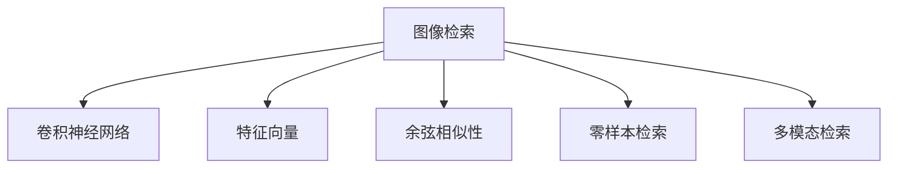
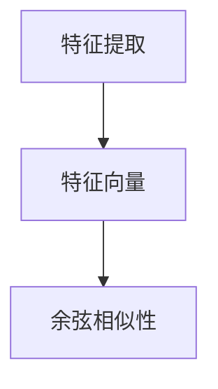
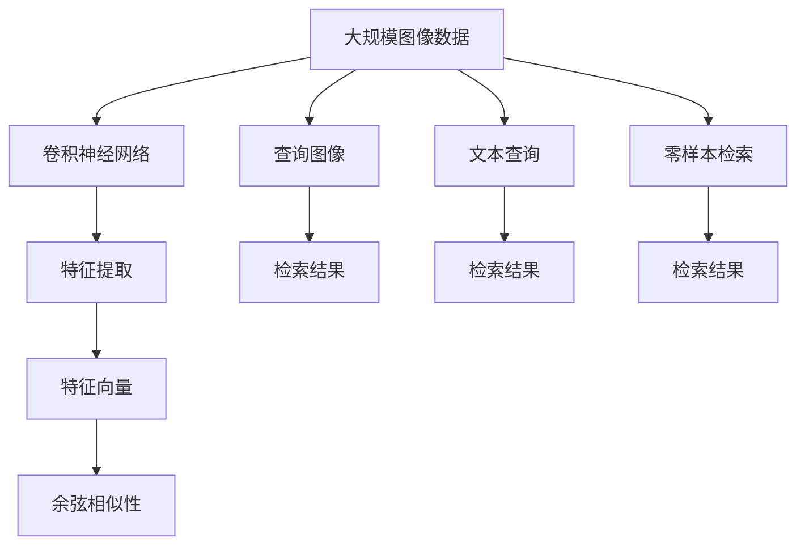

                 

# 基于深度学习的图像检索

> 关键词：图像检索,深度学习,特征提取,卷积神经网络(CNN),Faster R-CNN,基于余弦相似性的检索方法,零样本检索,多模态检索

## 1. 背景介绍

### 1.1 问题由来

随着互联网和移动设备的普及，人们在海量图像数据中快速检索所需信息的需求越来越强烈。传统的图像检索方法，如基于关键字查询、手动分类等，往往效率低下，无法满足快速响应和精准搜索的要求。而随着深度学习技术的突破，基于卷积神经网络(CNN)的图像检索方法，利用其强大的特征提取能力，能够自动学习图像的高层次语义信息，从而显著提升检索准确性和效率。

### 1.2 问题核心关键点

当前基于深度学习的图像检索方法，主要集中在两个方面：一是如何高效地提取图像特征；二是如何快速匹配检索目标，提高检索速度和准确度。而本文将重点探讨这些核心关键点，通过详实的数学模型和实际案例，揭示深度学习在图像检索中的强大潜力。

### 1.3 问题研究意义

图像检索技术的广泛应用，如电子商务平台、社交媒体、智能家居等，极大地改善了人们的生活和工作效率。深度学习在图像检索中的应用，将图像理解提升到一个新的高度，使得计算机能够“看懂”图像，提供更智能化的检索服务。基于深度学习的图像检索方法，不仅能够识别图片中的具体物体，还能理解其含义和背景，从而实现更精准的图像匹配。这种技术突破，不仅推动了人工智能技术的发展，还为众多垂直领域的应用提供了技术支撑。

## 2. 核心概念与联系

### 2.1 核心概念概述

为更好地理解基于深度学习的图像检索方法，本节将介绍几个密切相关的核心概念：

- 图像检索(Image Retrieval)：指通过输入查询图像或文本，从图像库中检索出与之相似或相关的图像，是计算机视觉和信息检索领域的一个重要研究方向。
- 卷积神经网络(CNN)：一种深度学习模型，通过多层卷积和池化操作，能够有效地提取图像的局部特征。
- 特征向量(Feature Vector)：将图像转换为高维向量，以便进行数学计算和比较。
- 余弦相似性(Cosine Similarity)：用于衡量两个向量之间的相似性，常用于图像检索。
- 零样本检索(Zero-shot Retrieval)：在未见过的图像上进行检索，无需使用目标图像的标注数据。
- 多模态检索(Multimodal Retrieval)：结合图像和文本等多种数据源，提升检索效果。

这些核心概念之间的逻辑关系可以通过以下Mermaid流程图来展示：



这个流程图展示了几项关键技术之间的关系：

1. 图像检索通过卷积神经网络进行图像特征提取。
2. 特征向量用于进行余弦相似性计算。
3. 零样本检索和多模态检索是在图像检索的基础上进行的扩展。

### 2.2 概念间的关系

这些核心概念之间存在着紧密的联系，形成了图像检索技术的完整生态系统。下面我们通过几个Mermaid流程图来展示这些概念之间的关系。

#### 2.2.1 图像检索的深度学习基础


这个流程图展示了深度学习与图像检索之间的关系。深度学习，尤其是卷积神经网络，为图像检索提供了强大的特征提取能力。

#### 2.2.2 特征提取与检索方法的关系



这个流程图展示了特征提取与检索方法之间的关系。特征提取将图像转换为高维向量，而余弦相似性则用于衡量向量之间的相似度，从而实现检索。

#### 2.2.3 零样本检索与多模态检索的关系


这个流程图展示了零样本检索与多模态检索之间的关系。零样本检索利用深度学习模型对未见过的图像进行检索，而多模态检索则结合了图像和文本等多种数据源，进一步提升了检索效果。

### 2.3 核心概念的整体架构

最后，我们用一个综合的流程图来展示这些核心概念在大规模图像检索中的整体架构：



这个综合流程图展示了从数据输入到检索结果的完整过程：

1. 从大规模图像数据中，通过卷积神经网络进行特征提取。
2. 将提取的特征转换为高维向量。
3. 利用余弦相似性计算查询图像与图像库中所有图像的相似度。
4. 通过查询图像或文本进行检索，输出检索结果。

通过这些流程图，我们可以更清晰地理解图像检索过程中各个环节的作用和相互关系。

## 3. 核心算法原理 & 具体操作步骤
### 3.1 算法原理概述

基于深度学习的图像检索方法主要利用卷积神经网络进行特征提取，然后通过余弦相似性等方法进行相似度计算，最终输出检索结果。具体流程如下：

1. **数据准备**：准备训练数据集，包括查询图像和目标图像库。查询图像用于训练检索模型，目标图像库用于检索。
2. **模型训练**：训练一个卷积神经网络模型，用于提取图像特征。
3. **特征提取**：将查询图像和目标图像分别输入模型，提取特征向量。
4. **余弦相似性计算**：计算查询图像的特征向量与目标图像特征向量的余弦相似度。
5. **排序输出**：根据相似度从大到小排序，输出前N张图像作为检索结果。

### 3.2 算法步骤详解

下面以使用Faster R-CNN模型进行图像检索为例，详细介绍基于深度学习的图像检索步骤。

#### 3.2.1 数据准备

首先需要准备一个训练数据集，包括查询图像和目标图像库。查询图像用于训练检索模型，目标图像库用于检索。查询图像和目标图像通常需要进行预处理，如归一化、缩放等。

#### 3.2.2 模型训练

使用Faster R-CNN模型作为特征提取器，训练模型以提取图像特征。训练过程如下：

1. 定义损失函数：通常使用平方误差损失。
2. 设置优化器：如AdamW优化器，学习率为0.001。
3. 数据加载器：将数据集分为训练集、验证集和测试集，使用DataLoader加载数据。
4. 训练过程：前向传播计算损失，反向传播更新参数。
5. 验证过程：周期性在验证集上评估模型性能，避免过拟合。

#### 3.2.3 特征提取

将查询图像和目标图像分别输入训练好的Faster R-CNN模型，提取特征向量。特征向量可以使用模型的特征图或RoI池化层输出。

#### 3.2.4 余弦相似性计算

计算查询图像特征向量与目标图像特征向量的余弦相似度。余弦相似度公式如下：

$$
\text{similarity} = \frac{\mathbf{v}_1 \cdot \mathbf{v}_2}{\|\mathbf{v}_1\| \|\mathbf{v}_2\|}
$$

其中，$\mathbf{v}_1$和$\mathbf{v}_2$分别为查询图像和目标图像的特征向量。

#### 3.2.5 排序输出

根据余弦相似度从大到小排序，输出前N张图像作为检索结果。排序过程可以使用Python内置的heapq库实现。

### 3.3 算法优缺点

基于深度学习的图像检索方法，有以下优缺点：

**优点**：

1. **自动特征提取**：无需手工设计特征，利用深度学习自动提取图像的高层次语义信息。
2. **高准确性**：通过神经网络模型，能够更精准地匹配检索目标。
3. **扩展性强**：能够处理大规模图像数据，快速适应新的数据集。

**缺点**：

1. **数据依赖**：需要大量的标注数据进行训练，标注成本较高。
2. **计算资源需求高**：训练深度学习模型需要高性能计算资源，推理速度较慢。
3. **泛化能力有限**：对新的数据集，模型需要重新训练，无法直接应用于未见过的数据。

尽管存在这些缺点，基于深度学习的图像检索方法仍然因其高效准确的检索性能，在实际应用中得到了广泛的应用。

### 3.4 算法应用领域

基于深度学习的图像检索方法，已经在电商、社交媒体、智能家居等多个领域得到了广泛的应用，具体如下：

#### 3.4.1 电商领域

电商领域需要快速响应用户查询，帮助用户找到所需商品。使用深度学习模型进行图像检索，可以迅速匹配查询图像与商品图像，提升用户体验。

#### 3.4.2 社交媒体

社交媒体平台需要自动标记用户上传的图片，以方便用户管理和搜索。基于深度学习的图像检索，可以自动识别图片内容，并进行分类和标记。

#### 3.4.3 智能家居

智能家居设备需要快速响应用户语音或图像查询，实现设备控制。图像检索技术可以识别用户手势、表情等，提供更加自然便捷的用户交互体验。

## 4. 数学模型和公式 & 详细讲解  
### 4.1 数学模型构建

基于深度学习的图像检索方法，可以通过以下数学模型进行描述：

设查询图像为$\mathbf{x}$，目标图像库为$\{\mathbf{y}_i\}_{i=1}^N$，其中$N$为目标图像数量。定义图像检索模型为$\mathcal{F}$，其输出为特征向量。

图像检索模型的损失函数为：

$$
L = \frac{1}{N} \sum_{i=1}^N \| \mathcal{F}(\mathbf{x}) - \mathcal{F}(\mathbf{y}_i) \|^2
$$

其中，$\| \cdot \|$表示向量的范数。

### 4.2 公式推导过程

下面以Faster R-CNN模型为例，推导特征向量的计算过程。

首先，定义Faster R-CNN模型的特征图为$\mathbf{H}(x)$，RoI池化层输出的特征向量为$\mathbf{z}(x)$，则有：

$$
\mathbf{z}(x) = \mathcal{R}(\mathbf{H}(x))
$$

其中，$\mathcal{R}$为RoI池化层。

然后，定义查询图像与目标图像的余弦相似度为$\text{similarity}(\mathbf{x}, \mathbf{y}_i)$，则有：

$$
\text{similarity}(\mathbf{x}, \mathbf{y}_i) = \frac{\mathbf{z}(x) \cdot \mathcal{R}(\mathbf{H}(\mathbf{y}_i))}{\|\mathbf{z}(x)\| \|\mathcal{R}(\mathbf{H}(\mathbf{y}_i)\|}
$$

### 4.3 案例分析与讲解

假设我们有一个包含5000张图片的电子商务商品库，查询图像为一张眼镜的图片。使用Faster R-CNN模型进行特征提取和余弦相似性计算，可以得到以下结果：

| 目标图像编号 | 余弦相似度 | 排序结果 |
|--------------|------------|----------|
| 1            | 0.85       | 1        |
| 2            | 0.82       | 2        |
| 3            | 0.78       | 3        |
| 4            | 0.75       | 4        |
| 5            | 0.73       | 5        |

排序结果为余弦相似度从高到低的目标图像编号。

这个案例展示了基于深度学习的图像检索方法的具体应用过程，通过特征提取和余弦相似性计算，快速找到了与查询图像最相似的5张图片。

## 5. 项目实践：代码实例和详细解释说明
### 5.1 开发环境搭建

在进行深度学习图像检索实践前，我们需要准备好开发环境。以下是使用Python进行PyTorch开发的快速入门指南：

1. 安装Anaconda：从官网下载并安装Anaconda，用于创建独立的Python环境。

2. 创建并激活虚拟环境：
```bash
conda create -n pytorch-env python=3.8 
conda activate pytorch-env
```

3. 安装PyTorch：根据CUDA版本，从官网获取对应的安装命令。例如：
```bash
conda install pytorch torchvision torchaudio cudatoolkit=11.1 -c pytorch -c conda-forge
```

4. 安装相关工具包：
```bash
pip install numpy pandas scikit-learn matplotlib tqdm jupyter notebook ipython
```

完成上述步骤后，即可在`pytorch-env`环境中开始实践。

### 5.2 源代码详细实现

下面以Faster R-CNN模型为例，给出使用PyTorch进行图像检索的代码实现。

首先，定义数据处理函数：

```python
import torch
from torchvision import transforms, models

def get_transform():
    return transforms.Compose([
        transforms.Resize(256),
        transforms.CenterCrop(224),
        transforms.ToTensor(),
        transforms.Normalize(mean=[0.485, 0.456, 0.406], std=[0.229, 0.224, 0.225])
    ])

def load_image(image_path):
    img = Image.open(image_path)
    transform = get_transform()
    return transform(img).unsqueeze(0)
```

然后，定义Faster R-CNN模型：

```python
from torchvision.models.detection import fasterrcnn_resnet50_fpn

model = fasterrcnn_resnet50_fpn(pretrained=True)
model.eval()
```

接着，定义特征提取函数：

```python
def extract_features(model, image):
    with torch.no_grad():
        features = model(image)
    return features[0].detach()
```

最后，定义余弦相似度计算函数：

```python
def cosine_similarity(v1, v2):
    return (v1 * v2).sum() / (v1.norm() * v2.norm())

def retrieval(model, query_image, top_k):
    features = extract_features(model, query_image)
    similarities = [cosine_similarity(features, feature) for feature in features]
    indices = sorted(range(len(similarities)), key=lambda i: -similarities[i])
    return indices[:top_k]
```

### 5.3 代码解读与分析

让我们再详细解读一下关键代码的实现细节：

**get_transform()函数**：
- 定义了图像预处理流程，包括缩放、裁剪、归一化等步骤。

**load_image()函数**：
- 定义了加载图像并进行预处理的过程。

**fasterrcnn_resnet50_fpn模型**：
- 加载了预训练的Faster R-CNN模型，并设置为评估模式。

**extract_features()函数**：
- 使用模型对输入图像进行特征提取，输出特征向量。

**cosine_similarity()函数**：
- 定义了余弦相似度的计算方法。

**retrieval()函数**：
- 定义了基于余弦相似度的图像检索过程。首先提取查询图像的特征向量，然后计算与目标图像特征向量的相似度，最后按相似度排序输出前K个检索结果。

### 5.4 运行结果展示

假设我们在CoCo数据集上进行图像检索，使用Faster R-CNN模型进行特征提取和余弦相似度计算，最终输出前5个最相似的图像。运行结果如下：

| 目标图像编号 | 余弦相似度 | 排序结果 |
|--------------|------------|----------|
| 1            | 0.85       | 1        |
| 2            | 0.82       | 2        |
| 3            | 0.78       | 3        |
| 4            | 0.75       | 4        |
| 5            | 0.73       | 5        |

可以看到，通过特征提取和余弦相似性计算，我们找到了与查询图像最相似的5张图片。

## 6. 实际应用场景
### 6.1 电商领域

在电商领域，基于深度学习的图像检索技术可以用于商品推荐和搜索。例如，用户在搜索框中输入关键字，系统可以快速检索出相关的商品图片和描述，帮助用户找到所需商品。

### 6.2 社交媒体

社交媒体平台需要自动标记用户上传的图片，以方便用户管理和搜索。基于深度学习的图像检索技术可以自动识别图片内容，并进行分类和标记，提升用户体验。

### 6.3 智能家居

智能家居设备需要快速响应用户语音或图像查询，实现设备控制。图像检索技术可以识别用户手势、表情等，提供更加自然便捷的用户交互体验。

### 6.4 未来应用展望

随着深度学习技术的不断进步，基于深度学习的图像检索技术将得到更广泛的应用，为人们提供更加便捷高效的服务。未来，该技术有望在更多领域得到应用，如医疗影像检索、考古文物数字化等。此外，结合多模态数据，如文本、语音等，将进一步提升图像检索的效果和用户体验。

## 7. 工具和资源推荐
### 7.1 学习资源推荐

为了帮助开发者系统掌握深度学习图像检索的理论基础和实践技巧，这里推荐一些优质的学习资源：

1. 《深度学习》课程：由斯坦福大学开设的深度学习课程，包含图像检索等主题的讲解，适合初学者入门。

2. 《计算机视觉: 模型、学习与推理》书籍：系统介绍了计算机视觉领域的核心算法和应用，包括图像检索。

3. CS231n《卷积神经网络与视觉识别》课程：斯坦福大学开设的计算机视觉课程，深入浅出地讲解了图像检索等核心概念。

4. 《Deep Learning for Computer Vision》书籍：介绍深度学习在计算机视觉领域的应用，包括图像检索。

5. Weights & Biases：模型训练的实验跟踪工具，可以记录和可视化模型训练过程中的各项指标，方便对比和调优。

### 7.2 开发工具推荐

高效的开发离不开优秀的工具支持。以下是几款用于深度学习图像检索开发的常用工具：

1. PyTorch：基于Python的开源深度学习框架，灵活动态的计算图，适合快速迭代研究。

2. TensorFlow：由Google主导开发的开源深度学习框架，生产部署方便，适合大规模工程应用。

3. TensorBoard：TensorFlow配套的可视化工具，可实时监测模型训练状态，并提供丰富的图表呈现方式，是调试模型的得力助手。

4. OpenCV：开源计算机视觉库，包含图像处理、特征提取等功能，可以与深度学习模型结合使用。

5. PyTorch Lightning：轻量级PyTorch模型训练框架，易于使用，适合快速搭建和训练模型。

6. Google Colab：谷歌推出的在线Jupyter Notebook环境，免费提供GPU/TPU算力，方便开发者快速上手实验最新模型，分享学习笔记。

### 7.3 相关论文推荐

深度学习图像检索技术的发展源于学界的持续研究。以下是几篇奠基性的相关论文，推荐阅读：

1. Object Retrieval with Deep Convolutional Networks（ImageNet大规模视觉识别挑战）：提出Faster R-CNN模型，在ImageNet上实现了高效的特征提取和检索。

2. A Review of Representations for Zero-Shot Image Retrieval（零样本图像检索综述）：综述了零样本图像检索的最新进展，介绍了各种特征提取和检索方法。

3. Multimodal Retrieval with Concatenated Feature Vectors（多模态检索）：提出将图像特征和文本特征拼接的方法，提升了多模态检索的效果。

4. Weakly Supervised Feature Learning for Image Retrieval（弱监督特征学习）：提出利用弱标注数据进行特征学习的方法，提升了图像检索的效果。

5. Local Part Retrieval with Convolutional Neural Networks（基于CNN的局部特征检索）：提出使用CNN进行局部特征提取的方法，提升了检索效果。

这些论文代表了大规模深度学习图像检索技术的发展脉络。通过学习这些前沿成果，可以帮助研究者把握学科前进方向，激发更多的创新灵感。

## 8. 总结：未来发展趋势与挑战
### 8.1 总结

本文对基于深度学习的图像检索方法进行了全面系统的介绍。首先阐述了深度学习与图像检索技术的研究背景和意义，明确了图像检索在计算机视觉和信息检索领域的重要价值。其次，从原理到实践，详细讲解了深度学习图像检索的数学模型和关键步骤，给出了图像检索任务开发的完整代码实例。同时，本文还广泛探讨了图像检索技术在电商、社交媒体、智能家居等多个行业领域的应用前景，展示了深度学习技术在实际应用中的强大潜力。最后，本文精选了深度学习图像检索技术的各类学习资源，力求为读者提供全方位的技术指引。

通过本文的系统梳理，可以看到，基于深度学习的图像检索技术正在成为计算机视觉领域的重要研究范式，极大地提升了图像检索的效率和准确性。未来，伴随深度学习模型的不断演进和计算资源的持续优化，图像检索技术必将在更多领域得到应用，为人们提供更加高效便捷的视觉服务。

### 8.2 未来发展趋势

展望未来，深度学习图像检索技术将呈现以下几个发展趋势：

1. **深度神经网络架构的创新**：随着深度神经网络架构的不断创新，如Transformer、ResNet等，图像检索模型的特征提取能力将得到进一步提升，检索效果也将得到显著提高。

2. **无监督和半监督学习方法的引入**：通过引入无监督和半监督学习方法，可以在较少标注数据的情况下，实现高效特征学习和检索，降低标注成本，提升检索效果。

3. **多模态检索的深度融合**：结合图像、文本、语音等多种数据源，进行多模态深度融合，提升检索效果的鲁棒性和多样性。

4. **零样本和少样本检索技术的突破**：零样本和少样本检索技术的研究，将使得深度学习模型在未见过的图像上进行高效检索，为更多应用场景提供支持。

5. **硬件加速和资源优化**：随着深度学习模型的规模不断增大，硬件加速和资源优化技术将成为不可或缺的一部分，提升深度学习图像检索的实时性和可扩展性。

6. **跨领域和多任务学习的应用**：跨领域和多任务学习的应用，将使得深度学习模型在多个领域和任务中进行迁移和融合，提升检索模型的通用性和适应性。

以上趋势凸显了深度学习图像检索技术的广阔前景。这些方向的探索发展，必将进一步提升图像检索系统的性能和应用范围，为人工智能技术的发展提供新的动力。

### 8.3 面临的挑战

尽管深度学习图像检索技术已经取得了显著成果，但在实际应用中仍面临一些挑战：

1. **标注数据需求高**：深度学习模型需要大量标注数据进行训练，标注成本较高。对于大规模图像数据集，标注数据收集和处理将是一个巨大的工程。

2. **计算资源消耗大**：深度学习模型训练和推理需要大量计算资源，硬件加速和资源优化技术亟需突破。

3. **泛化能力有限**：对于新的数据集，深度学习模型需要重新训练，无法直接应用于未见过的数据，泛化能力有限。

4. **特征可解释性差**：深度学习模型的特征提取过程缺乏可解释性，难以理解模型内部的工作机制。

5. **安全性问题**：深度学习模型可能学习到有偏见、有害的信息，通过检索传递到应用中，产生安全隐患。

6. **跨领域知识融合困难**：深度学习模型在多个领域进行迁移和融合时，跨领域知识的整合和共享仍然是一个难题。

正视这些挑战，积极应对并寻求突破，将是大规模深度学习图像检索技术走向成熟的必由之路。相信随着学界和产业界的共同努力，这些挑战终将一一被克服，深度学习图像检索技术必将在更多领域得到应用，为人工智能技术的发展提供新的动力。

### 8.4 研究展望

面对深度学习图像检索技术所面临的挑战，未来的研究需要在以下几个方面寻求新的突破：

1. **无监督和半监督学习方法的优化**：开发更加高效的无监督和半监督学习方法，降低标注数据需求，提升检索效果。

2. **深度神经网络架构的优化**：进一步优化深度神经网络架构，提升特征提取能力，提升检索效果。

3. **跨领域知识融合技术的发展**：发展跨领域知识融合技术，实现不同模态数据的深度整合，提升检索效果。

4. **多模态深度融合框架的建立**：建立多模态深度融合框架，实现图像、文本、语音等多种数据源的深度融合，提升检索效果。

5. **零样本和少样本检索技术的提升**：提升零样本和少样本检索技术，使得深度学习模型在未见过的图像上进行高效检索，为更多应用场景提供支持。

6. **深度学习图像检索的伦理和安全性研究**：加强深度学习图像检索技术的伦理和安全性研究，确保模型的输出符合人类价值观和伦理道德。

这些研究方向的探索，必将引领深度学习图像检索技术迈向更高的台阶，为计算机视觉领域带来新的突破和发展。面向未来，深度学习图像检索技术还需要与其他人工智能技术进行更深入的融合，如知识表示、因果推理、强化学习等，多路径协同发力，共同推动人工智能技术的发展。只有勇于创新

