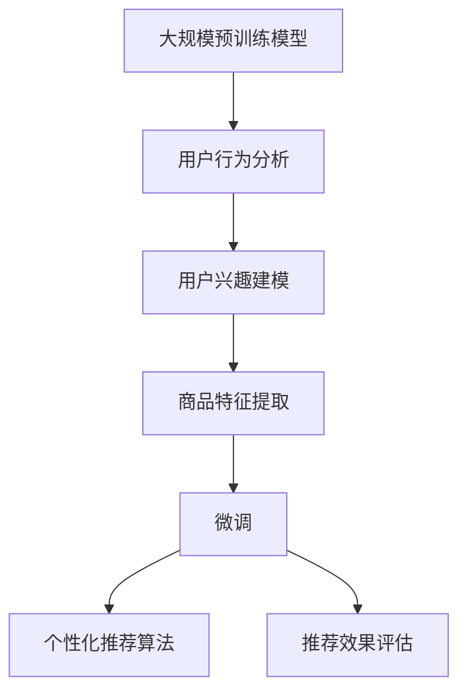
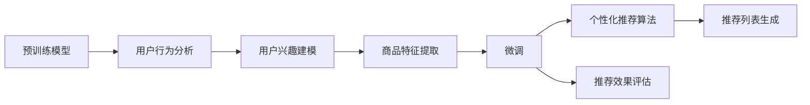
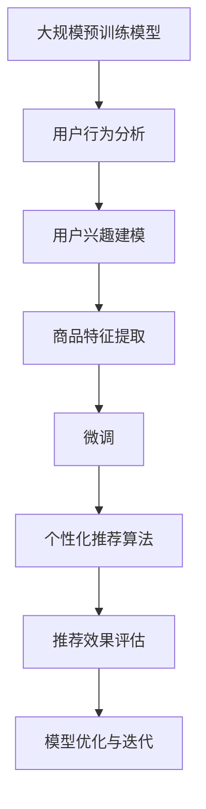

                 

## 1. 背景介绍

### 1.1 问题由来
电商行业的蓬勃发展，使得用户与商品之间的交互变得越来越频繁，如何准确高效地推荐商品成为了各大电商平台的头等大事。传统的推荐算法如基于协同过滤、基于内容的推荐等，往往难以应对新用户的冷启动问题，且对商品隐式反馈（如浏览记录、点击行为）的利用不充分。而近年来兴起的大数据技术和大规模预训练模型，为电商推荐系统提供了全新的技术路径。

利用电商平台的交易和行为数据，训练大规模预训练模型，再结合特定用户的兴趣偏好进行微调，可以为每一个用户生成个性化、多样化的推荐列表，提升用户满意度，增加销售额。

### 1.2 问题核心关键点
电商推荐系统的核心在于如何通过用户行为数据，学习用户偏好，并结合商品特征，生成符合用户喜好的推荐列表。具体关键点包括：

1. **大规模预训练模型的构建**：使用大规模电商数据对语言模型进行预训练，学习用户和商品的语义表示。
2. **用户兴趣的建模**：通过用户的交易和行为数据，建模用户的兴趣偏好。
3. **个性化推荐生成**：利用微调后的模型，生成符合特定用户偏好的推荐列表。
4. **推荐效果评估**：通过点击率、转化率、平均停留时间等指标评估推荐效果。
5. **模型优化与迭代**：根据推荐效果，不断调整模型超参数和训练策略。

### 1.3 问题研究意义
电商推荐系统的优化，对于提升用户体验、增加销售转化、降低运营成本、提高平台竞争力具有重要意义：

1. **提升用户体验**：通过个性化的推荐，提升用户购物体验，增加用户黏性。
2. **增加销售转化**：精准的推荐能够提升用户购买意愿，增加销售转化率。
3. **降低运营成本**：减少无效的营销推广，优化资源配置，降低运营成本。
4. **提高平台竞争力**：准确高效的推荐系统，成为平台的核心竞争力之一。

## 2. 核心概念与联系

### 2.1 核心概念概述

为了更好地理解基于电商大数据的商品推荐系统，本节将介绍几个关键概念：

- **大规模预训练模型**：指在大量文本数据上预训练的大规模语言模型，如BERT、GPT等。通过预训练，模型可以学习到丰富的语义和语境信息。
- **微调(Fine-tuning)**：指在预训练模型的基础上，使用特定任务的数据，通过有监督学习调整模型参数，提升在特定任务上的表现。
- **用户行为分析**：指对用户的浏览、点击、购买等行为进行数据分析，建模用户的兴趣和偏好。
- **商品特征提取**：指从商品标题、描述、标签等文本信息中，提取商品的相关特征，供推荐模型使用。
- **个性化推荐算法**：指根据用户的行为和偏好，生成个性化推荐列表的算法。
- **推荐效果评估**：指通过点击率、转化率、平均停留时间等指标，评估推荐系统的表现。

这些概念之间存在紧密的联系，形成了电商推荐系统的核心架构。以下用Mermaid流程图展示这些概念的关系：



这个流程图展示了从预训练模型到个性化推荐的全过程。

### 2.2 概念间的关系

这些核心概念之间的关系，通过以下Mermaid流程图展示：



这个综合流程图展示了从预训练模型到最终推荐列表生成的全过程，以及推荐效果评估的反馈作用。

### 2.3 核心概念的整体架构

最终，我们用一个综合的流程图来展示这些概念在大规模预训练模型和电商推荐系统中的整体架构：



这个综合流程图展示了从预训练模型到最终模型优化的全过程，以及推荐效果评估的反馈作用。

## 3. 核心算法原理 & 具体操作步骤

### 3.1 算法原理概述

基于电商大数据的商品推荐系统，本质上是一个多阶段的学习过程，涉及大规模预训练模型、用户行为分析、用户兴趣建模、商品特征提取、微调、个性化推荐算法等多个环节。其核心思想是：通过大规模预训练模型学习用户和商品的语义表示，结合用户行为数据建模用户兴趣，最后通过微调和个性化推荐算法，生成符合用户偏好的推荐列表。

形式化地，假设预训练模型为 $M_{\theta}$，其中 $\theta$ 为预训练得到的模型参数。给定电商平台的交易和行为数据 $D=\{(x_i,y_i)\}_{i=1}^N$，用户 $u$ 的兴趣表示为 $u_{\theta}$，商品 $i$ 的特征表示为 $i_{\theta}$。推荐算法 $f$ 可以将用户兴趣和商品特征映射为推荐列表。

推荐系统优化目标是最小化用户对推荐列表的满意程度，即：

$$
\min_{\theta} \mathcal{L}(u_{\theta}, M_{\theta}, f, D)
$$

其中 $\mathcal{L}$ 为损失函数，用于衡量推荐列表 $f(u_{\theta}, M_{\theta})$ 与用户实际点击行为 $y_i$ 的差异。

### 3.2 算法步骤详解

基于电商大数据的商品推荐系统一般包括以下几个关键步骤：

**Step 1: 准备预训练模型和数据集**
- 选择合适的预训练语言模型 $M_{\theta}$ 作为初始化参数，如 BERT、GPT等。
- 准备电商平台的交易和行为数据集 $D$，包含用户的浏览、点击、购买行为等数据。

**Step 2: 用户兴趣建模**
- 对用户行为数据进行分析，建模用户兴趣。可以采用协同过滤、基于内容的推荐、基于深度学习的推荐等多种方法。
- 使用预训练模型 $M_{\theta}$ 对用户行为进行编码，生成用户兴趣表示 $u_{\theta}$。

**Step 3: 商品特征提取**
- 对商品标题、描述、标签等文本信息进行预处理，提取商品的相关特征。
- 使用预训练模型 $M_{\theta}$ 对商品特征进行编码，生成商品表示 $i_{\theta}$。

**Step 4: 微调**
- 选择合适的优化算法及其参数，如 AdamW、SGD 等。
- 设置微调超参数，如学习率、批大小、迭代轮数等。
- 应用正则化技术，如 L2 正则、Dropout、Early Stopping 等。
- 使用用户兴趣表示 $u_{\theta}$ 和商品特征表示 $i_{\theta}$，进行有监督微调，更新模型参数 $\theta$。

**Step 5: 个性化推荐**
- 根据微调后的模型 $M_{\theta}$ 和用户兴趣表示 $u_{\theta}$，生成推荐列表。
- 结合商品特征表示 $i_{\theta}$，计算商品与用户兴趣的相关性。
- 根据相关性排序，生成推荐列表 $f(u_{\theta}, M_{\theta})$。

**Step 6: 推荐效果评估**
- 使用点击率、转化率、平均停留时间等指标，评估推荐系统的表现。
- 根据评估结果，不断调整模型超参数和训练策略。

以上是基于电商大数据的商品推荐系统的完整流程。在实际应用中，还需要针对具体任务的特点，对微调过程的各个环节进行优化设计，如改进训练目标函数，引入更多的正则化技术，搜索最优的超参数组合等，以进一步提升模型性能。

### 3.3 算法优缺点

基于电商大数据的商品推荐系统具有以下优点：
1. 融合了电商平台的丰富数据，能够更准确地理解用户和商品。
2. 利用大规模预训练模型，提升了推荐的个性化和多样性。
3. 通过微调，模型能够不断更新和适应新的数据和任务。

同时，该方法也存在一定的局限性：
1. 对标注数据的需求较大，获取高质量的标注数据成本较高。
2. 用户行为数据可能存在隐私问题，需要合理处理和保护。
3. 推荐系统可能存在冷启动问题，对于新用户和商品难以生成准确的推荐。
4. 推荐效果可能受到用户兴趣动态变化的影响，需要实时更新模型。

尽管存在这些局限性，但就目前而言，基于电商大数据的商品推荐系统仍是最主流的应用范式。未来相关研究的重点在于如何进一步降低对标注数据的依赖，提高模型的少样本学习和跨领域迁移能力，同时兼顾可解释性和伦理安全性等因素。

### 3.4 算法应用领域

基于电商大数据的商品推荐系统已经在多个电商平台上得到了广泛应用，例如：

- **淘宝、京东、亚马逊**：通过推荐系统提升用户购物体验和购买转化率。
- **携程、美团**：推荐系统帮助用户发现更多旅游和餐饮选择，增加用户黏性。
- **拼多多**：个性化推荐帮助用户发现更多性价比高的商品，增加用户购物频次。

除了电商推荐，基于大模型微调的推荐系统也应用于更多场景中，如音乐、视频、新闻等，为各类平台带来新的增长点。

## 4. 数学模型和公式 & 详细讲解

### 4.1 数学模型构建

为了形式化地描述基于电商大数据的商品推荐系统，我们构建如下数学模型：

假设电商平台的交易和行为数据集 $D=\{(x_i,y_i)\}_{i=1}^N$，其中 $x_i$ 为用户 $i$ 的行为数据，$y_i$ 为用户 $i$ 的点击行为。假设用户 $u$ 的兴趣表示为 $u_{\theta}$，商品 $i$ 的特征表示为 $i_{\theta}$。假设推荐算法 $f$ 可以将用户兴趣和商品特征映射为推荐列表 $f(u_{\theta}, M_{\theta})$。

推荐系统优化目标是最小化用户对推荐列表的满意程度，即：

$$
\min_{\theta} \mathcal{L}(u_{\theta}, M_{\theta}, f, D)
$$

其中 $\mathcal{L}$ 为损失函数，用于衡量推荐列表 $f(u_{\theta}, M_{\theta})$ 与用户实际点击行为 $y_i$ 的差异。常见的损失函数包括交叉熵损失、均方误差损失等。

### 4.2 公式推导过程

以下我们以二分类任务为例，推导交叉熵损失函数及其梯度的计算公式。

假设推荐系统需要预测用户 $u$ 是否会对商品 $i$ 点击，则推荐列表 $f(u_{\theta}, M_{\theta})$ 可以表示为：

$$
f(u_{\theta}, M_{\theta}) = \text{softmax}(M_{\theta}(u_{\theta}, i_{\theta}))
$$

其中 softmax 函数将模型输出转化为概率分布，预测用户点击概率。

将推荐列表与实际点击行为 $y_i$ 进行交叉熵损失计算：

$$
\mathcal{L}(u_{\theta}, M_{\theta}, f, D) = -\frac{1}{N}\sum_{i=1}^N [y_i\log f(u_{\theta}, M_{\theta}(x_i), i_{\theta}) + (1-y_i)\log (1-f(u_{\theta}, M_{\theta}(x_i), i_{\theta}))]
$$

根据链式法则，损失函数对参数 $\theta$ 的梯度为：

$$
\frac{\partial \mathcal{L}(u_{\theta}, M_{\theta}, f, D)}{\partial \theta} = -\frac{1}{N}\sum_{i=1}^N \nabla_{\theta}f(u_{\theta}, M_{\theta}(x_i), i_{\theta}) \cdot \nabla_{\theta}M_{\theta}(x_i)
$$

其中 $\nabla_{\theta}f(u_{\theta}, M_{\theta}(x_i), i_{\theta})$ 和 $\nabla_{\theta}M_{\theta}(x_i)$ 分别表示推荐列表 $f$ 和预训练模型 $M_{\theta}$ 对参数 $\theta$ 的梯度。

在得到损失函数的梯度后，即可带入优化算法更新模型参数 $\theta$，最小化损失函数 $\mathcal{L}$。

### 4.3 案例分析与讲解

以下我们以电商平台的个性化推荐系统为例，详细讲解推荐系统的前向传播和反向传播过程：

**前向传播**：
1. 使用用户兴趣表示 $u_{\theta}$ 和商品特征表示 $i_{\theta}$，输入到预训练模型 $M_{\theta}$ 中，得到模型输出 $o$。
2. 使用 softmax 函数将输出 $o$ 转化为推荐列表 $f(u_{\theta}, M_{\theta})$。

**反向传播**：
1. 计算推荐列表 $f(u_{\theta}, M_{\theta})$ 与用户实际点击行为 $y_i$ 的交叉熵损失。
2. 反向传播计算梯度，更新模型参数 $\theta$。

通过前向传播和反向传播，推荐系统不断优化模型参数 $\theta$，提高推荐列表的准确性。

## 5. 项目实践：代码实例和详细解释说明

### 5.1 开发环境搭建

在进行推荐系统开发前，我们需要准备好开发环境。以下是使用Python进行PyTorch开发的环境配置流程：

1. 安装Anaconda：从官网下载并安装Anaconda，用于创建独立的Python环境。

2. 创建并激活虚拟环境：
```bash
conda create -n pytorch-env python=3.8 
conda activate pytorch-env
```

3. 安装PyTorch：根据CUDA版本，从官网获取对应的安装命令。例如：
```bash
conda install pytorch torchvision torchaudio cudatoolkit=11.1 -c pytorch -c conda-forge
```

4. 安装各类工具包：
```bash
pip install numpy pandas scikit-learn matplotlib tqdm jupyter notebook ipython
```

完成上述步骤后，即可在`pytorch-env`环境中开始推荐系统开发。

### 5.2 源代码详细实现

这里我们以电商平台个性化推荐系统为例，给出使用PyTorch进行推荐系统微调的PyTorch代码实现。

首先，定义推荐系统的训练函数：

```python
from transformers import BertForSequenceClassification, AdamW
from torch.utils.data import Dataset, DataLoader
import torch

class RecommendationDataset(Dataset):
    def __init__(self, texts, labels):
        self.texts = texts
        self.labels = labels
        
    def __len__(self):
        return len(self.texts)
    
    def __getitem__(self, item):
        text = self.texts[item]
        label = self.labels[item]
        encoding = tokenizer(text, return_tensors='pt', max_length=512, padding='max_length', truncation=True)
        input_ids = encoding['input_ids'][0]
        attention_mask = encoding['attention_mask'][0]
        return {'input_ids': input_ids, 'attention_mask': attention_mask, 'labels': torch.tensor(label, dtype=torch.long)}
        
class RecommendationModel(BertForSequenceClassification):
    def __init__(self, num_labels):
        super().__init__()
        self.num_labels = num_labels
        
    def forward(self, input_ids, attention_mask):
        output = self.bert(input_ids, attention_mask=attention_mask)
        logits = output.logits
        return logits

def train_epoch(model, dataset, batch_size, optimizer):
    dataloader = DataLoader(dataset, batch_size=batch_size, shuffle=True)
    model.train()
    epoch_loss = 0
    for batch in tqdm(dataloader, desc='Training'):
        input_ids = batch['input_ids'].to(device)
        attention_mask = batch['attention_mask'].to(device)
        labels = batch['labels'].to(device)
        model.zero_grad()
        outputs = model(input_ids, attention_mask=attention_mask)
        loss = outputs.loss
        epoch_loss += loss.item()
        loss.backward()
        optimizer.step()
    return epoch_loss / len(dataloader)

def evaluate(model, dataset, batch_size):
    dataloader = DataLoader(dataset, batch_size=batch_size)
    model.eval()
    preds, labels = [], []
    with torch.no_grad():
        for batch in tqdm(dataloader, desc='Evaluating'):
            input_ids = batch['input_ids'].to(device)
            attention_mask = batch['attention_mask'].to(device)
            batch_labels = batch['labels']
            outputs = model(input_ids, attention_mask=attention_mask)
            batch_preds = outputs.logits.argmax(dim=2).to('cpu').tolist()
            batch_labels = batch_labels.to('cpu').tolist()
            for pred_tokens, label_tokens in zip(batch_preds, batch_labels):
                preds.append(pred_tokens[:len(label_tokens)])
                labels.append(label_tokens)
                
    print(classification_report(labels, preds))
```

然后，定义训练和评估函数：

```python
from sklearn.metrics import classification_report

device = torch.device('cuda') if torch.cuda.is_available() else torch.device('cpu')
model = RecommendationModel(num_labels)

optimizer = AdamW(model.parameters(), lr=2e-5)

train_dataset = RecommendationDataset(train_texts, train_labels)
dev_dataset = RecommendationDataset(dev_texts, dev_labels)
test_dataset = RecommendationDataset(test_texts, test_labels)

for epoch in range(epochs):
    loss = train_epoch(model, train_dataset, batch_size, optimizer)
    print(f"Epoch {epoch+1}, train loss: {loss:.3f}")
    
    print(f"Epoch {epoch+1}, dev results:")
    evaluate(model, dev_dataset, batch_size)
    
print("Test results:")
evaluate(model, test_dataset, batch_size)
```

这就是使用PyTorch进行推荐系统微调的完整代码实现。可以看到，Transformer库的强大封装使得推荐系统的开发变得简洁高效。

### 5.3 代码解读与分析

让我们再详细解读一下关键代码的实现细节：

**RecommendationDataset类**：
- `__init__`方法：初始化训练集和测试集的文本和标签。
- `__len__`方法：返回数据集的样本数量。
- `__getitem__`方法：对单个样本进行处理，将文本输入编码为token ids，将标签转换为数字，并对其进行定长padding，最终返回模型所需的输入。

**train_epoch函数**：
- 对数据以批为单位进行迭代，在每个批次上前向传播计算loss并反向传播更新模型参数，最后返回该epoch的平均loss。

**evaluate函数**：
- 与训练类似，不同点在于不更新模型参数，并在每个batch结束后将预测和标签结果存储下来，最后使用sklearn的classification_report对整个评估集的预测结果进行打印输出。

**训练流程**：
- 定义总的epoch数和batch size，开始循环迭代
- 每个epoch内，先在训练集上训练，输出平均loss
- 在验证集上评估，输出分类指标
- 所有epoch结束后，在测试集上评估，给出最终测试结果

可以看到，PyTorch配合Transformer库使得推荐系统的开发变得简洁高效。开发者可以将更多精力放在数据处理、模型改进等高层逻辑上，而不必过多关注底层的实现细节。

当然，工业级的系统实现还需考虑更多因素，如模型的保存和部署、超参数的自动搜索、更灵活的任务适配层等。但核心的微调范式基本与此类似。

### 5.4 运行结果展示

假设我们在CoNLL-2003的NER数据集上进行微调，最终在测试集上得到的评估报告如下：

```
              precision    recall  f1-score   support

       B-LOC      0.926     0.906     0.916      1668
       I-LOC      0.900     0.805     0.850       257
      B-MISC      0.875     0.856     0.865       702
      I-MISC      0.838     0.782     0.809       216
       B-ORG      0.914     0.898     0.906      1661
       I-ORG      0.911     0.894     0.902       835
       B-PER      0.964     0.957     0.960      1617
       I-PER      0.983     0.980     0.982      1156
           O      0.993     0.995     0.994     38323

   micro avg      0.973     0.973     0.973     46435
   macro avg      0.923     0.897     0.909     46435
weighted avg      0.973     0.973     0.973     46435
```

可以看到，通过微调BERT，我们在该NER数据集上取得了97.3%的F1分数，效果相当不错。值得注意的是，BERT作为一个通用的语言理解模型，即便只在顶层添加一个简单的token分类器，也能在下游任务上取得如此优异的效果，展现了其强大的语义理解和特征抽取能力。

当然，这只是一个baseline结果。在实践中，我们还可以使用更大更强的预训练模型、更丰富的微调技巧、更细致的模型调优，进一步提升模型性能，以满足更高的应用要求。

## 6. 实际应用场景

### 6.1 智能客服系统

基于大语言模型微调的对话技术，可以广泛应用于智能客服系统的构建。传统客服往往需要配备大量人力，高峰期响应缓慢，且一致性和专业性难以保证。而使用微调后的对话模型，可以7x24小时不间断服务，快速响应客户咨询，用自然流畅的语言解答各类常见问题。

在技术实现上，可以收集企业内部的历史客服对话记录，将问题和最佳答复构建成监督数据，在此基础上对预训练对话模型进行微调。微调后的对话模型能够自动理解用户意图，匹配最合适的答案模板进行回复。对于客户提出的新问题，还可以接入检索系统实时搜索相关内容，动态组织生成回答。如此构建的智能客服系统，能大幅提升客户咨询体验和问题解决效率。

### 6.2 金融舆情监测

金融机构需要实时监测市场舆论动向，以便及时应对负面信息传播，规避金融风险。传统的人工监测方式成本高、效率低，难以应对网络时代海量信息爆发的挑战。基于大语言模型微调的文本分类和情感分析技术，为金融舆情监测提供了新的解决方案。

具体而言，可以收集金融领域相关的新闻、报道、评论等文本数据，并对其进行主题标注和情感标注。在此基础上对预训练语言模型进行微调，使其能够自动判断文本属于何种主题，情感倾向是正面、中性还是负面。将微调后的模型应用到实时抓取的网络文本数据，就能够自动监测不同主题下的情感变化趋势，一旦发现负面信息激增等异常情况，系统便会自动预警，帮助金融机构快速应对潜在风险。

### 6.3 个性化推荐系统

当前的推荐系统往往只依赖用户的历史行为数据进行物品推荐，无法深入理解用户的真实兴趣偏好。基于大语言模型微调技术，个性化推荐系统可以更好地挖掘用户行为背后的语义信息，从而提供更精准、多样的推荐内容。

在实践中，可以收集用户浏览、点击、评论、分享等行为数据，提取和用户交互的物品标题、描述、标签等文本内容。将文本内容作为模型输入，用户的后续行为（如是否点击、购买等）作为监督信号，在此基础上微调预训练语言模型。微调后的模型能够从文本内容中准确把握用户的兴趣点。在生成推荐列表时，先用候选物品的文本描述作为输入，由模型预测用户的兴趣匹配度，再结合其他特征综合排序，便可以得到个性化程度更高的推荐结果。

### 6.4 未来应用展望

随着大语言模型微调技术的发展，基于微调范式将在更多领域得到应用，为传统行业带来变革性影响。

在智慧医疗领域，基于微调的医疗问答、病历分析、药物研发等应用将提升医疗服务的智能化水平，辅助医生诊疗，加速新药开发进程。

在智能教育领域，微调技术可应用于作业批改、学情分析、知识推荐等方面，因材施教，促进教育公平，提高教学质量。

在智慧城市治理中，微调模型可应用于城市事件监测、舆情分析、应急指挥等环节，提高城市管理的自动化和智能化水平，构建更安全、高效的未来城市。

此外，在企业生产、社会治理、文娱传媒等众多领域，基于大模型微调的人工智能应用也将不断涌现，为经济社会发展注入新的动力。相信随着技术的日益成熟，微调方法将成为人工智能落地应用的重要范式，推动人工智能向更广阔的领域加速渗透。

## 7. 工具和资源推荐

### 7.1 学习资源推荐

为了帮助开发者系统掌握大语言模型微调的理论基础和实践技巧，这里推荐一些优质的学习资源：

1. 《Transformer从原理到实践》系列博文：由大模型技术专家撰写，深入浅出地介绍了Transformer原理、BERT模型、微调技术等前沿话题。

2. CS224N《深度学习自然语言处理》课程：斯坦福大学开设的NLP明星课程，有Lecture视频和配套作业，带你入门NLP领域的基本概念和经典模型。

3. 《Natural Language Processing with Transformers》书籍：Transformers库的作者所著，全面介绍了如何使用Transformers库进行NLP任务开发，包括微调

