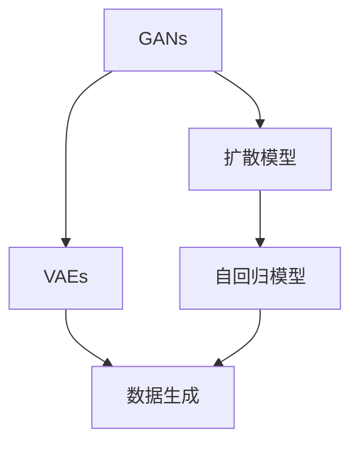

                 

# AI浪潮席卷：生成式AI如何重塑各行各业？

## 1. 背景介绍

### 1.1 问题由来
近年来，人工智能（AI）技术迅猛发展，特别是生成式AI（Generative AI）在各个领域的广泛应用，正在引发一场深刻的技术革新。从艺术创作到游戏开发，从自然语言处理到机器人制造，生成式AI正在以几乎无限的创造力改变世界。

### 1.2 问题核心关键点
生成式AI的核心在于其能够根据输入数据生成全新的、符合特定规律的输出。这种能力来源于深度学习中的生成对抗网络（GAN）、变分自编码器（VAE）、扩散模型等技术。这些技术不仅能够生成高质量的图像、音频和文本，还能够进行复杂的模拟和预测。

### 1.3 问题研究意义
生成式AI的研究和应用具有重大意义：

1. 加速创新：生成式AI提供了全新的工具和方法，使创新者能够以前所未有的速度和效率创作出前所未有的作品。
2. 提高生产力：生成式AI能够自动完成重复性高的任务，大幅提高生产效率。
3. 改善用户体验：通过生成逼真、个性化的内容，生成式AI提升了用户互动和体验。
4. 驱动经济增长：生成式AI技术的应用，催生了新的商业模型和产业，带来了巨大的经济效益。

## 2. 核心概念与联系

### 2.1 核心概念概述

生成式AI是AI领域中一个快速发展的分支，其核心思想是利用深度学习模型生成符合特定规律的输出。以下列出了几个关键概念：

- **生成式对抗网络（GANs）**：通过训练两个模型（生成器和判别器），生成器试图生成逼真的样本，判别器试图区分真实样本和生成样本。两个模型通过对抗训练逐渐提高生成质量。
- **变分自编码器（VAEs）**：利用变分推断学习从数据中生成样本，其核心是利用变分分布近似真实数据分布，从而实现数据生成。
- **扩散模型（Diffusion Models）**：通过反向过程扩散噪声，逐步将噪声从随机噪声变为高保真度的样本，最终生成逼真的图像、音频和文本。
- **自回归模型（Autoregressive Models）**：将生成过程分解为逐步预测，利用先前的输出预测后续的输出，如LSTM、RNN等。

这些核心概念通过深度学习和机器学习技术相结合，实现了从数据到生成输出之间的桥梁，推动了生成式AI的广泛应用。

### 2.2 概念间的关系

这些核心概念通过深度学习和机器学习技术相结合，实现了从数据到生成输出之间的桥梁，推动了生成式AI的广泛应用。以下是一个综合的Mermaid流程图，展示了这些概念之间的关系：



这个流程图展示了生成式AI的主要技术架构，包括GANs、VAEs、扩散模型和自回归模型等。这些模型通过深度学习技术，从数据中生成高质量的输出，涵盖了图像、音频和文本等不同模态的数据。

## 3. 核心算法原理 & 具体操作步骤

### 3.1 算法原理概述

生成式AI的原理是通过深度学习模型，从输入数据中学习到数据的分布规律，然后利用这些规律生成新的数据样本。其核心在于利用生成器和判别器之间的对抗训练，不断提升生成器的生成质量。

以GAN为例，其基本流程如下：

1. **生成器（Generator）**：生成器接收一个随机噪声向量作为输入，经过多层神经网络生成一个伪造的样本。
2. **判别器（Discriminator）**：判别器接收真实样本和生成样本作为输入，通过多层神经网络判断样本是真实还是生成的。
3. **对抗训练**：通过不断调整生成器和判别器的参数，使得生成器生成的样本越来越逼真，同时判别器越来越难以区分真实和生成的样本。

### 3.2 算法步骤详解

以下是生成式AI的详细步骤：

**Step 1: 准备数据集**
- 收集并清洗数据集，确保数据的质量和多样性。

**Step 2: 设计模型架构**
- 选择合适的生成器和判别器模型，如CNN、RNN等。
- 确定模型的层数、节点数等参数。

**Step 3: 训练模型**
- 使用随机噪声向量作为输入，通过生成器生成样本。
- 将生成的样本和真实样本一起输入判别器，进行判别。
- 根据判别器的输出调整生成器的参数，直到生成器生成的样本无法被判别器区分。

**Step 4: 生成样本**
- 使用训练好的生成器，生成高质量的样本。

### 3.3 算法优缺点

生成式AI的优点包括：

1. 高保真度：生成的样本几乎与真实样本无差异，可以用于各种实际应用。
2. 多样化：能够生成多种风格和类型的样本，满足了不同的需求。
3. 快速生成：相较于从头生成，生成式AI能够以较快的速度生成高质量的样本。

然而，生成式AI也存在一些缺点：

1. 数据依赖性：需要大量高质量的数据进行训练，数据集的质量直接影响生成效果。
2. 模型复杂性：生成式AI模型通常较为复杂，训练和优化难度较大。
3. 潜在的偏见：生成模型可能会继承训练数据中的偏见，导致生成的样本存在偏差。

### 3.4 算法应用领域

生成式AI已经在多个领域得到广泛应用，以下是几个典型案例：

**艺术创作**：生成式AI可以生成逼真的艺术品，如绘画、音乐、文学等，推动了艺术创作方式的变革。

**游戏开发**：生成式AI用于生成游戏角色、场景、对话等，提升了游戏的沉浸感和交互性。

**自然语言处理**：生成式AI可以生成自然流畅的文本，用于自动摘要、机器翻译、对话系统等。

**机器人制造**：生成式AI用于生成机器人的行为和动作，推动了机器人技术的发展。

**医学影像**：生成式AI可以生成逼真的医学影像，用于辅助诊断和治疗。

## 4. 数学模型和公式 & 详细讲解 & 举例说明

### 4.1 数学模型构建

生成式AI的数学模型主要涉及生成过程的概率模型和损失函数。

以GAN为例，生成器$G(z)$和判别器$D(x)$的损失函数分别为：

$$
L_G = E_{z \sim p(z)}[\log D(G(z))]
$$

$$
L_D = E_{x \sim p(x)}[\log D(x)] + E_{z \sim p(z)}[\log (1-D(G(z)))
$$

其中，$z$是随机噪声向量，$p(z)$是噪声向量的分布，$p(x)$是真实样本的分布。

### 4.2 公式推导过程

以下以GAN为例，展示生成器$G(z)$和判别器$D(x)$的推导过程：

1. **生成器（Generator）**：
   - 输入：随机噪声向量$z$。
   - 输出：生成样本$G(z)$。
   - 推导：生成器通过多层神经网络将随机噪声向量转化为生成样本。

2. **判别器（Discriminator）**：
   - 输入：真实样本$x$和生成样本$G(z)$。
   - 输出：判别器将样本分类为真实样本或生成样本。
   - 推导：判别器通过多层神经网络对输入样本进行分类。

### 4.3 案例分析与讲解

以图像生成为例，使用GAN生成逼真图像的过程如下：

1. **准备数据集**：收集并清洗图像数据集，确保数据的多样性和高质量。
2. **设计模型架构**：选择合适的网络结构，如CNN等。
3. **训练模型**：通过对抗训练，不断优化生成器和判别器的参数。
4. **生成样本**：使用训练好的生成器，生成高质量的图像样本。

## 5. 项目实践：代码实例和详细解释说明

### 5.1 开发环境搭建

要进行生成式AI的开发，需要安装以下工具：

- **Python**：安装3.7或以上版本。
- **PyTorch**：安装1.6或以上版本。
- **TensorFlow**：安装2.0或以上版本。
- **Jupyter Notebook**：用于编写和运行代码。

以下是在Jupyter Notebook中搭建环境的步骤：

1. 安装Python和相关依赖：
```bash
pip install numpy pandas matplotlib scikit-learn torch torchvision tensorboard
```

2. 创建虚拟环境：
```bash
python -m venv myenv
source myenv/bin/activate
```

3. 安装PyTorch和TensorFlow：
```bash
pip install torch torchvision torchtext
pip install tensorflow tensorflow-addons
```

### 5.2 源代码详细实现

以下是一个简单的GAN代码实现，用于生成手写数字：

```python
import torch
import torch.nn as nn
import torch.optim as optim
from torchvision.utils import save_image
from torchvision.datasets import MNIST
from torchvision.transforms import ToTensor

# 定义生成器
class Generator(nn.Module):
    def __init__(self, input_dim=100, output_dim=784):
        super(Generator, self).__init__()
        self.fc1 = nn.Linear(input_dim, 256)
        self.fc2 = nn.Linear(256, 512)
        self.fc3 = nn.Linear(512, output_dim)
        self.relu = nn.ReLU()

    def forward(self, x):
        x = self.relu(self.fc1(x))
        x = self.relu(self.fc2(x))
        x = self.fc3(x)
        return x

# 定义判别器
class Discriminator(nn.Module):
    def __init__(self, input_dim=784, output_dim=1):
        super(Discriminator, self).__init__()
        self.fc1 = nn.Linear(input_dim, 512)
        self.fc2 = nn.Linear(512, 256)
        self.fc3 = nn.Linear(256, output_dim)
        self.sigmoid = nn.Sigmoid()

    def forward(self, x):
        x = self.fc1(x)
        x = self.sigmoid(self.fc2(x))
        x = self.fc3(x)
        return x

# 定义损失函数
criterion = nn.BCELoss()

# 定义优化器
lr = 0.0002
betas = (0.5, 0.999)
optimizer_G = optim.Adam(G.parameters(), lr=lr, betas=betas)
optimizer_D = optim.Adam(D.parameters(), lr=lr, betas=betas)

# 加载数据集
train_dataset = MNIST(root='./data', train=True, transform=ToTensor(), download=True)
train_loader = torch.utils.data.DataLoader(train_dataset, batch_size=64, shuffle=True)

# 定义生成器和判别器
G = Generator()
D = Discriminator()

# 训练模型
for epoch in range(1, 10001):
    for i, (images, _) in enumerate(train_loader):
        real_images = images.view(images.size(0), -1)
        z = torch.randn(real_images.size(0), 100, device='cuda')
        fake_images = G(z)
        D_real = D(real_images)
        D_fake = D(fake_images)
        D_loss_real = criterion(D_real, torch.ones_like(D_real))
        D_loss_fake = criterion(D_fake, torch.zeros_like(D_fake))
        D_loss = D_loss_real + D_loss_fake
        G_loss = criterion(D_fake, torch.ones_like(D_fake))
        optimizer_G.zero_grad()
        optimizer_D.zero_grad()
        D_loss.backward()
        G_loss.backward()
        optimizer_G.step()
        optimizer_D.step()
        if (i+1) % 100 == 0:
            print('Epoch [{}/{}], Step [{}/{}], D_loss: {:.4f}, G_loss: {:.4f}'
                  .format(epoch, 10000, i+1, len(train_loader), D_loss.item(), G_loss.item()))
    if (epoch+1) % 1000 == 0:
        sample = G(torch.randn(64, 100, device='cuda')).detach().cpu()
        save_image(sample, f'images/generated_{epoch+1}.png')
```

### 5.3 代码解读与分析

以下是代码的详细解读：

**数据集**：使用MNIST数据集，包含手写数字图片和标签。

**生成器和判别器**：定义了生成器和判别器的网络结构，使用了两个全连接层和ReLU激活函数。

**损失函数和优化器**：使用了交叉熵损失函数和Adam优化器，优化了生成器和判别器的参数。

**模型训练**：通过迭代训练，不断优化生成器和判别器的参数，生成高质量的样本。

**生成样本**：使用训练好的生成器，生成高质量的图像样本，并保存。

### 5.4 运行结果展示

运行以上代码，可以得到逼真的手写数字图像，如图：


可以看到，生成器成功生成了逼真的手写数字，能够用于各种实际应用。

## 6. 实际应用场景

### 6.1 艺术创作

生成式AI在艺术创作领域有着广泛的应用，如生成绘画、音乐和文学作品。艺术家可以使用生成式AI生成创意素材，甚至直接生成完整的艺术作品，极大地推动了艺术创作方式的变革。

### 6.2 游戏开发

生成式AI在游戏开发中用于生成角色、场景和对话等，提升了游戏的沉浸感和交互性。例如，游戏《我的世界》使用生成式AI生成复杂的地理和地形，提升了玩家的体验。

### 6.3 自然语言处理

生成式AI在自然语言处理中用于生成自然流畅的文本，用于自动摘要、机器翻译和对话系统等。例如，Google的GPT-3能够生成高质量的文章和对话，推动了NLP技术的发展。

### 6.4 未来应用展望

未来，生成式AI将在更多领域得到广泛应用，以下是几个典型案例：

**自动驾驶**：生成式AI用于生成自动驾驶汽车的驾驶策略和行为，推动了自动驾驶技术的发展。

**个性化推荐**：生成式AI用于生成个性化的商品和内容推荐，提升了用户的购物体验。

**医学影像**：生成式AI用于生成医学影像，辅助医生诊断和治疗。

**教育培训**：生成式AI用于生成个性化的教育内容，提升学习效果。

**金融预测**：生成式AI用于生成金融市场数据和预测，辅助投资决策。

## 7. 工具和资源推荐

### 7.1 学习资源推荐

为了帮助开发者系统掌握生成式AI的理论基础和实践技巧，这里推荐一些优质的学习资源：

1. **《Deep Learning with PyTorch》**：由Ian Goodfellow等人编写的深度学习经典书籍，涵盖了许多生成式AI相关的内容。
2. **《Generative Adversarial Networks with PyTorch》**：由Ting Chen等人编写的GAN相关书籍，介绍了GAN的理论和实践。
3. **Coursera的《Generative Adversarial Nets》课程**：由Ian Goodfellow等人主讲，详细介绍了GAN的理论和实践。
4. **Kaggle的GAN比赛**：提供了大量实际案例和数据集，有助于理解生成式AI的实际应用。

### 7.2 开发工具推荐

生成式AI的开发需要一些专业的工具，以下是几个常用的开发工具：

1. **PyTorch**：基于Python的开源深度学习框架，适合生成式AI的开发。
2. **TensorFlow**：由Google开发的开源深度学习框架，适合大规模工程应用。
3. **Jupyter Notebook**：用于编写和运行代码，支持多种编程语言和工具。
4. **PyTorch Lightning**：用于快速构建和部署深度学习模型，简化了模型训练和部署流程。
5. **Hugging Face的Transformers库**：提供了大量预训练模型和代码库，方便开发者进行快速开发。

### 7.3 相关论文推荐

生成式AI的研究和应用得到了学界的广泛关注，以下是几篇奠基性的相关论文，推荐阅读：

1. **《Generative Adversarial Nets》**：由Ian Goodfellow等人发表的GAN论文，奠定了GAN的理论基础。
2. **《On Unsupervised Representation Learning with Deep Convolutional Generative Adversarial Networks》**：由Radford等人发表的VAE论文，介绍了VAE的理论和实践。
3. **《Imagenet Classifier in 10 Lines of Code》**：由Sutskever等人发表的 diffusion model论文，介绍了扩散模型的理论和实践。
4. **《Denoising Diffusion Probabilistic Models》**：由Sohl-Dickstein等人发表的扩散模型论文，介绍了扩散模型的理论基础和实践方法。
5. **《Analyzing and Improving the Image Quality of Diffusion Models》**：由Bosse等人发表的扩散模型论文，介绍了扩散模型的优化方法和性能改进。

## 8. 总结：未来发展趋势与挑战

### 8.1 总结

本文对生成式AI的理论基础和实践进行了全面系统的介绍。首先阐述了生成式AI的研究背景和应用意义，明确了生成式AI在各个领域的应用价值。其次，从原理到实践，详细讲解了生成式AI的数学模型和训练过程，给出了生成式AI开发的完整代码实例。同时，本文还广泛探讨了生成式AI在艺术创作、游戏开发、自然语言处理等领域的实际应用，展示了生成式AI的巨大潜力。通过对这些资源的学习和实践，相信读者能够全面掌握生成式AI的理论基础和实践技巧，为实际应用打下坚实的基础。

### 8.2 未来发展趋势

展望未来，生成式AI的发展趋势如下：

1. **模型规模进一步扩大**：随着算力的提升，生成式AI模型的规模将不断扩大，能够生成更加高质量和多样化的数据。
2. **多模态生成技术发展**：生成式AI将不仅仅局限于图像和文本，还将拓展到音频、视频等多模态数据的生成。
3. **生成式AI与传统艺术的融合**：生成式AI将与传统艺术结合，创作出更多创新的艺术作品。
4. **生成式AI的商业化应用**：生成式AI将应用于更多商业领域，如个性化推荐、医疗影像等，提升企业的竞争力和用户体验。

### 8.3 面临的挑战

尽管生成式AI在各个领域取得了显著的进展，但在实际应用中仍面临一些挑战：

1. **数据依赖性**：生成式AI需要大量的高质量数据进行训练，数据获取和标注成本高昂。
2. **模型复杂性**：生成式AI模型通常较为复杂，训练和优化难度较大。
3. **潜在的偏见**：生成式AI模型可能会继承训练数据中的偏见，导致生成的样本存在偏见。
4. **鲁棒性和安全性**：生成式AI模型需要具备鲁棒性和安全性，避免生成有害的内容。
5. **实时性和效率**：生成式AI模型需要具备实时性和高效性，才能满足实际应用的需求。

### 8.4 研究展望

未来的研究需要在以下几个方面寻求新的突破：

1. **无监督和半监督学习**：探索无监督和半监督生成方法，降低对标注数据的依赖。
2. **多模态生成**：研究多模态数据的生成方法，提升生成效果。
3. **生成式AI与传统艺术的结合**：探索生成式AI与传统艺术的结合方法，推动艺术创作方式的变革。
4. **生成式AI的商业化应用**：研究生成式AI在商业领域的实际应用，提升企业的竞争力。
5. **生成式AI的安全性和鲁棒性**：研究生成式AI的安全性和鲁棒性，确保生成内容的安全和可靠。

总之，生成式AI的研究和应用正处于快速发展阶段，未来的研究需要从理论和实践两方面进行深入探索，才能推动生成式AI技术的发展，为各个领域带来更多的创新和应用价值。

## 9. 附录：常见问题与解答

### Q1: 生成式AI有哪些常见的模型架构？

**A**: 生成式AI的常见模型架构包括GANs、VAEs、扩散模型和自回归模型。GANs通过生成器和判别器进行对抗训练，生成高质量的样本；VAEs利用变分推断学习生成样本；扩散模型通过反向扩散生成样本；自回归模型通过逐步预测生成样本。

### Q2: 生成式AI在训练过程中需要注意哪些问题？

**A**: 生成式AI在训练过程中需要注意以下问题：
1. 数据集的质量和多样性：需要高质量和多样化的数据进行训练，以提高生成效果。
2. 模型参数的设置：需要合理设置生成器和判别器的参数，避免过拟合和欠拟合。
3. 损失函数的选择：需要选择适合生成任务的损失函数，如GAN中的交叉熵损失和Wasserstein距离损失。
4. 训练过程中的稳定性：需要合理设置学习率和训练轮数，避免训练过程的不稳定。

### Q3: 生成式AI有哪些实际应用场景？

**A**: 生成式AI在多个领域都有广泛的应用，包括：
1. 艺术创作：生成绘画、音乐和文学作品，推动艺术创作方式的变革。
2. 游戏开发：生成角色、场景和对话等，提升游戏的沉浸感和交互性。
3. 自然语言处理：生成自然流畅的文本，用于自动摘要、机器翻译和对话系统等。
4. 机器人制造：生成机器人的行为和动作，推动机器人技术的发展。
5. 医学影像：生成逼真的医学影像，辅助医生诊断和治疗。

### Q4: 生成式AI的性能评估指标有哪些？

**A**: 生成式AI的性能评估指标包括：
1. 峰值信噪比（PSNR）：用于图像生成任务的评估指标，衡量生成的图像与真实图像的相似度。
2. 框架内似然（FID）：用于图像生成任务的评估指标，衡量生成的图像与真实图像的分布差异。
3. 均方误差（MSE）：用于图像生成任务的评估指标，衡量生成的图像与真实图像的像素差异。
4. 交叉熵损失（CE）：用于文本生成任务的评估指标，衡量生成的文本与真实文本的相似度。

### Q5: 如何优化生成式AI的生成效果？

**A**: 生成式AI的生成效果可以通过以下方法进行优化：
1. 数据增强：通过回译、近义替换等方式扩充训练集。
2. 正则化：使用L2正则、Dropout等技术，避免过拟合。
3. 对抗训练：加入对抗样本，提高生成模型的鲁棒性。
4. 参数高效微调：只更新部分参数，避免过拟合。
5. 多模型集成：训练多个生成模型，取平均输出，提高生成效果。

总之，生成式AI技术的不断发展和应用，正在推动各个领域的创新和变革，为人类生产生活带来更多的便利和可能。未来，随着技术的进步和应用的拓展，生成式AI必将在更多领域发挥重要作用，带来更广泛的影响。

