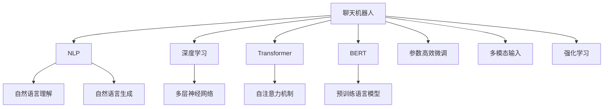
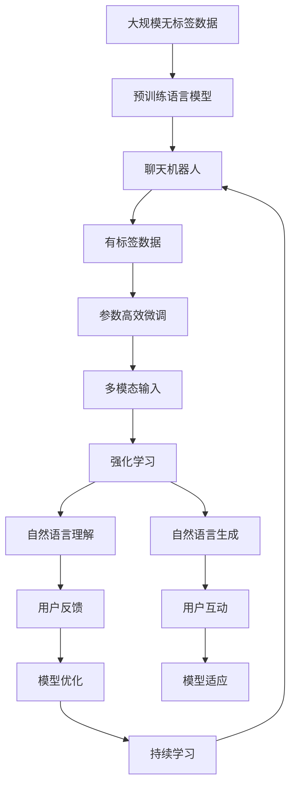

                 

# AI聊天机器人如何提升互动

> 关键词：聊天机器人,用户互动,自然语言处理(NLP),深度学习,Transformer,BERT,参数高效微调,多模态输入,强化学习,用户反馈循环

## 1. 背景介绍

### 1.1 问题由来

随着人工智能技术的迅猛发展，AI聊天机器人（Chatbot）在各行各业得到了广泛应用。它们不仅能够处理大量的客户咨询，提供24/7的即时服务，还能应用于教育、医疗、娱乐等多个领域，极大地提升了用户体验。然而，目前的聊天机器人还存在诸多问题，如自然语言理解能力有限、生成回复机械、无法识别上下文等，影响了用户满意度。因此，如何提升聊天机器人的互动性，使其能够与用户更加流畅地交流，成为当下AI领域的重要研究方向。

### 1.2 问题核心关键点

提升聊天机器人互动性的关键在于：

1. **增强自然语言理解能力**：使机器人能够更准确地理解和解析用户输入的文本，识别出用户的真实意图和情感。
2. **提高生成回复的自然度和多样性**：生成更符合人类语言习惯、具有丰富情感和变体的回复，增加用户的沉浸感和满意度。
3. **支持多模态输入**：引入语音、图像、视频等多模态数据，使机器人能够接收和处理更多样化的用户输入。
4. **优化用户反馈循环**：通过持续收集用户反馈，优化机器人模型，不断提升其表现和适用性。
5. **融合强化学习技术**：通过与用户的互动，不断调整机器人的策略，提升其智能水平和适应能力。

### 1.3 问题研究意义

提升聊天机器人互动性，不仅能够改善用户体验，增加用户的粘性，还能大幅度降低企业的运营成本，提高效率。此外，这还有助于推动AI技术在更多领域的应用和普及，促进人类与机器的深度交互和合作。

## 2. 核心概念与联系

### 2.1 核心概念概述

为更好地理解提升聊天机器人互动性的方法，本节将介绍几个关键概念：

- **聊天机器人(Chatbot)**：基于自然语言处理技术，能够与用户进行自然对话的智能系统。
- **自然语言处理(NLP)**：使计算机能够理解和生成自然语言的技术。
- **深度学习(Deep Learning)**：利用多层神经网络模拟人脑，进行复杂模式识别和预测。
- **Transformer模型**：一种基于自注意力机制的深度学习模型，特别适用于序列数据处理。
- **BERT模型**：一种预训练语言模型，通过大规模无标签数据预训练，能够学习到丰富的语言知识。
- **参数高效微调(Prompt Tuning)**：通过输入特定格式的文本，在固定大部分预训练参数的情况下，微调聊天机器人模型，提高其适应性。
- **多模态输入**：引入语音、图像、视频等不同模态的数据，丰富聊天机器人的输入来源。
- **强化学习(Reinforcement Learning)**：通过与环境互动，不断调整模型参数，提升聊天机器人的智能水平。

这些概念之间的关系可以通过以下Mermaid流程图来展示：



这个流程图展示了几大核心概念之间的关系：

1. 聊天机器人通过NLP技术进行自然语言理解与生成，同时利用深度学习进行复杂模式识别。
2. Transformer和BERT模型作为预训练框架，提供了强大的语言理解与表示能力。
3. 参数高效微调技术，可以在不改变预训练模型的情况下，提升聊天机器人的适应性。
4. 多模态输入技术，丰富了聊天机器人的输入来源。
5. 强化学习技术，通过与用户的互动，不断优化聊天机器人的策略。

### 2.2 概念间的关系

这些核心概念之间存在着紧密的联系，共同构成了提升聊天机器人互动性的生态系统。

- **聊天机器人的学习范式**：
  ```mermaid
  graph LR
      A[聊天机器人] --> B[NLP]
      B --> C[深度学习]
      A --> D[多模态输入]
      A --> E[强化学习]
      C --> F[Transformer]
      F --> G[BERT]
  ```

- **预训练-微调的流程**：
  ```mermaid
  graph TB
      A[大规模无标签数据] --> B[预训练语言模型]
      B --> C[聊天机器人]
      C --> D[有标签数据]
      D --> E[参数高效微调]
      E --> F[用户互动]
      F --> G[反馈循环]
  ```

- **多模态输入的框架**：
  ```mermaid
  graph LR
      A[用户输入] --> B[语音识别]
      A --> C[图像处理]
      A --> D[视频分析]
      B --> E[文本生成]
      C --> F[文本理解]
      D --> G[多模态融合]
      G --> E
  ```

- **强化学习的循环**：
  ```mermaid
  graph TB
      A[用户行为] --> B[即时反馈]
      B --> C[策略调整]
      C --> D[动作执行]
      D --> E[模型优化]
      E --> A
  ```

### 2.3 核心概念的整体架构

最后，我们用一个综合的流程图来展示这些核心概念在大语言模型微调过程中的整体架构：



这个综合流程图展示了从预训练到微调，再到强化学习的完整过程。聊天机器人首先在大规模无标签数据上进行预训练，然后通过参数高效微调技术，在少量标注数据上进行微调，同时引入多模态输入，丰富其输入形式。通过强化学习技术，不断调整机器人的策略，使其适应用户的互动行为，并通过用户反馈进行持续优化，构建起一个动态的用户反馈循环。最终，聊天机器人能够更好地与用户进行互动，提升用户体验。

## 3. 核心算法原理 & 具体操作步骤
### 3.1 算法原理概述

提升聊天机器人互动性的方法主要包括自然语言理解、生成回复、多模态输入和强化学习等方面。以下是每项技术的详细解释：

1. **自然语言理解**：使聊天机器人能够理解和解析用户的输入文本，识别出其中的意图和情感。
2. **生成回复**：根据用户的输入，生成符合人类语言习惯的回复，提高自然度和多样性。
3. **多模态输入**：通过引入语音、图像、视频等多种形式的输入，使聊天机器人能够处理更多样化的用户交互。
4. **强化学习**：通过与用户的互动，不断调整机器人的策略，提升其智能水平和适应能力。

### 3.2 算法步骤详解

#### 3.2.1 自然语言理解

自然语言理解是聊天机器人的核心能力之一，主要包括以下几个步骤：

1. **分词与词性标注**：将用户输入的文本分解为词汇，并标注每个词汇的词性。
2. **命名实体识别**：识别出文本中的人名、地名、机构名等实体。
3. **依存句法分析**：分析句子中各词汇之间的依存关系，理解句子的结构。
4. **意图识别**：根据文本和上下文，识别出用户的意图。
5. **情感分析**：分析用户的情感倾向，判断用户情绪。

这些步骤通常使用预训练的NLP模型，如BERT、GPT等，来自动完成。预训练模型在无标签数据上预训练后，可以较好地处理自然语言理解任务。

#### 3.2.2 生成回复

生成回复是聊天机器人互动性的重要组成部分，主要包括以下几个步骤：

1. **文本编码**：将用户输入的文本编码为向量表示。
2. **解码生成**：利用预训练的语言生成模型，生成符合自然语言习惯的回复。
3. **策略调整**：根据用户的反馈，调整生成策略，优化回复质量。
4. **回复筛选**：从生成的多个回复中，选择最适合的回复返回给用户。

生成回复的技术通常基于预训练的Transformer模型，如GPT系列模型。通过微调或参数高效微调技术，可以进一步提升回复的自然度和多样性。

#### 3.2.3 多模态输入

多模态输入可以丰富聊天机器人的输入形式，主要包括以下几个步骤：

1. **语音识别**：将用户的语音输入转换为文本。
2. **图像处理**：分析用户上传的图片，提取关键信息。
3. **视频分析**：分析用户上传的视频，提取关键信息。
4. **多模态融合**：将文本、语音、图像、视频等多模态信息进行融合，生成更加全面的理解。
5. **反馈循环**：根据多模态信息的融合结果，调整机器人的策略，优化用户体验。

多模态输入技术可以显著提升聊天机器人的交互体验，使其能够处理更多样化的用户输入。

#### 3.2.4 强化学习

强化学习是通过与用户的互动，不断调整机器人的策略，提升其智能水平和适应能力。主要包括以下几个步骤：

1. **环境设计**：定义聊天机器人的互动环境，设定奖励和惩罚机制。
2. **动作执行**：根据用户的输入，机器人执行相应的操作。
3. **即时反馈**：根据用户的反馈，调整机器人的策略。
4. **模型优化**：根据用户的反馈和互动数据，优化机器人的模型参数。
5. **持续学习**：不断从用户的反馈中学习，优化机器人的表现。

强化学习技术可以显著提升聊天机器人的智能水平和适应能力，使其能够更好地与用户进行互动。

### 3.3 算法优缺点

提升聊天机器人互动性的方法具有以下优点：

1. **自然度提升**：通过预训练和微调，生成的回复更加符合人类语言习惯，自然度提升。
2. **多样性增加**：通过参数高效微调，生成的回复更加多样，适应性更强。
3. **多模态支持**：通过多模态输入，聊天机器人能够处理更多样化的用户输入，提升用户体验。
4. **智能水平提升**：通过强化学习，聊天机器人能够不断调整策略，提升其智能水平和适应能力。

同时，这些方法也存在一些缺点：

1. **模型复杂度高**：预训练和微调需要大量的计算资源和数据，模型复杂度较高。
2. **数据依赖性强**：模型性能依赖于数据的质量和数量，数据不足时效果不佳。
3. **技术门槛高**：预训练和微调技术较为复杂，需要较高的技术门槛。
4. **反馈循环效率低**：强化学习中用户的反馈可能延迟，影响机器人策略调整的效率。

### 3.4 算法应用领域

提升聊天机器人互动性的方法主要应用于以下几个领域：

1. **客户服务**：提供24/7的即时服务，解答客户咨询，提升客户满意度。
2. **教育**：辅助学生学习和作业，提供个性化辅导，提升学习效果。
3. **医疗**：提供健康咨询和诊断，提升医疗服务的可及性和效率。
4. **娱乐**：提供游戏和互动体验，增加用户的沉浸感和粘性。
5. **社交**：提供聊天和交友功能，增加用户的社交互动。

## 4. 数学模型和公式 & 详细讲解 & 举例说明

### 4.1 数学模型构建

提升聊天机器人互动性的方法，通常使用深度学习模型进行建模和优化。以下是基本的数学模型构建过程：

1. **用户输入的文本表示**：将用户输入的文本编码为向量，通常使用Transformer模型进行编码。
2. **意图和情感分类**：利用预训练的分类模型，对用户的意图和情感进行分类。
3. **回复生成**：利用预训练的语言生成模型，生成符合自然语言习惯的回复。
4. **多模态信息融合**：将文本、语音、图像、视频等多模态信息进行融合，生成更加全面的理解。
5. **策略调整和模型优化**：通过强化学习技术，不断调整机器人的策略，优化模型的性能。

### 4.2 公式推导过程

以自然语言理解中的意图识别为例，其数学模型可以表示为：

$$
\text{Intent} = \text{IntentClassifier}(\text{TextEmbedding}, \text{ContextEmbedding})
$$

其中，$\text{IntentClassifier}$表示意图识别模型，$\text{TextEmbedding}$表示用户输入文本的向量表示，$\text{ContextEmbedding}$表示上下文的向量表示。意图分类器通常使用预训练的BERT或GPT模型。

以生成回复为例，其数学模型可以表示为：

$$
\text{Response} = \text{ReplyGenerator}(\text{Intent}, \text{Context})
$$

其中，$\text{ReplyGenerator}$表示回复生成模型，$\text{Intent}$表示用户的意图，$\text{Context}$表示上下文的向量表示。回复生成模型通常使用预训练的GPT系列模型。

以多模态信息融合为例，其数学模型可以表示为：

$$
\text{Multi-modal Embedding} = \text{Multi-modal Fusion}(\text{TextEmbedding}, \text{AudioEmbedding}, \text{ImageEmbedding}, \text{VideoEmbedding})
$$

其中，$\text{Multi-modal Fusion}$表示多模态融合模型，$\text{TextEmbedding}, \text{AudioEmbedding}, \text{ImageEmbedding}, \text{VideoEmbedding}$分别表示文本、语音、图像、视频等不同模态的信息向量表示。多模态融合模型通常使用Transformer模型。

以强化学习为例，其数学模型可以表示为：

$$
\text{Action} = \text{Policy}(\text{State}, \text{Reward})
$$

其中，$\text{Action}$表示机器人的动作，$\text{Policy}$表示机器人的策略，$\text{State}$表示机器人的状态，$\text{Reward}$表示用户的即时反馈。强化学习模型通常使用Q-learning或SARSA等算法。

### 4.3 案例分析与讲解

以一个简单的聊天机器人为例，分析其提升互动性的过程：

1. **用户输入**：用户输入文本：“今天天气怎么样？”
2. **自然语言理解**：将文本编码为向量，利用BERT模型进行意图识别，得到“天气”的意图。
3. **生成回复**：利用GPT模型生成回复，生成符合自然语言习惯的文本，如“今天晴朗，最高温度28度。”
4. **多模态输入**：同时利用语音识别技术，获取用户的语音输入，通过图像处理技术，分析天气预报图片，进一步确认天气状况。
5. **强化学习**：根据用户的即时反馈，如“是晴天吗？”，调整生成策略，优化回复的自然度和准确度。

## 5. 项目实践：代码实例和详细解释说明

### 5.1 开发环境搭建

在进行聊天机器人开发前，我们需要准备好开发环境。以下是使用Python进行PyTorch开发的环境配置流程：

1. 安装Anaconda：从官网下载并安装Anaconda，用于创建独立的Python环境。

2. 创建并激活虚拟环境：
```bash
conda create -n chatbot-env python=3.8 
conda activate chatbot-env
```

3. 安装PyTorch：根据CUDA版本，从官网获取对应的安装命令。例如：
```bash
conda install pytorch torchvision torchaudio cudatoolkit=11.1 -c pytorch -c conda-forge
```

4. 安装Transformers库：
```bash
pip install transformers
```

5. 安装各类工具包：
```bash
pip install numpy pandas scikit-learn matplotlib tqdm jupyter notebook ipython
```

完成上述步骤后，即可在`chatbot-env`环境中开始聊天机器人开发的实践。

### 5.2 源代码详细实现

下面我们以生成回复为例，给出使用Transformers库对GPT模型进行生成回复的PyTorch代码实现。

首先，定义回复生成的函数：

```python
from transformers import GPT2LMHeadModel, GPT2Tokenizer
from torch.utils.data import DataLoader
from tqdm import tqdm
from sklearn.metrics import accuracy_score, precision_recall_fscore_support

def generate_response(model, tokenizer, prompt, max_length=128, top_k=5):
    tokenized_prompt = tokenizer.encode(prompt, return_tensors='pt', max_length=max_length, padding='max_length', truncation=True)
    with torch.no_grad():
        outputs = model.generate(tokenized_prompt, max_length=max_length, num_return_sequences=top_k, top_p=1.0)
    decoded_outputs = tokenizer.decode(outputs[0], skip_special_tokens=True)
    return decoded_outputs
```

然后，定义数据加载和评估函数：

```python
tokenizer = GPT2Tokenizer.from_pretrained('gpt2')
model = GPT2LMHeadModel.from_pretrained('gpt2')

def load_data(file_path):
    with open(file_path, 'r', encoding='utf-8') as f:
        lines = f.readlines()
    texts, labels = [], []
    for line in lines:
        text, label = line.split('\t')
        texts.append(text)
        labels.append(label)
    return texts, labels

train_texts, train_labels = load_data('train.txt')
dev_texts, dev_labels = load_data('dev.txt')

train_dataset = DataLoader(train_texts, batch_size=16, shuffle=True)
dev_dataset = DataLoader(dev_texts, batch_size=16, shuffle=False)
```

接着，定义训练和评估函数：

```python
from transformers import AdamW

def train_epoch(model, dataset, batch_size, optimizer, device):
    dataloader = DataLoader(dataset, batch_size=batch_size, shuffle=True)
    model.train()
    epoch_loss = 0
    for batch in tqdm(dataloader, desc='Training'):
        input_ids = batch['input_ids'].to(device)
        attention_mask = batch['attention_mask'].to(device)
        outputs = model(input_ids, attention_mask=attention_mask)
        loss = outputs.loss
        epoch_loss += loss.item()
        loss.backward()
        optimizer.step()
    return epoch_loss / len(dataloader)

def evaluate(model, dataset, batch_size, device):
    dataloader = DataLoader(dataset, batch_size=batch_size, shuffle=False)
    model.eval()
    preds, labels = [], []
    with torch.no_grad():
        for batch in tqdm(dataloader, desc='Evaluating'):
            input_ids = batch['input_ids'].to(device)
            attention_mask = batch['attention_mask'].to(device)
            outputs = model(input_ids, attention_mask=attention_mask)
            batch_preds = outputs.logits.argmax(dim=2).to('cpu').tolist()
            batch_labels = batch['labels'].to('cpu').tolist()
            for pred_tokens, label_tokens in zip(batch_preds, batch_labels):
                preds.append(pred_tokens[:len(label_tokens)])
                labels.append(label_tokens)
    return accuracy_score(labels, preds), precision_recall_fscore_support(labels, preds, average='macro')

device = torch.device('cuda') if torch.cuda.is_available() else torch.device('cpu')
model.to(device)

epochs = 5
batch_size = 16
learning_rate = 2e-5

optimizer = AdamW(model.parameters(), lr=learning_rate)

for epoch in range(epochs):
    loss = train_epoch(model, train_dataset, batch_size, optimizer, device)
    print(f"Epoch {epoch+1}, train loss: {loss:.3f}")
    
    print(f"Epoch {epoch+1}, dev results:")
    accuracy, metrics = evaluate(model, dev_dataset, batch_size, device)
    print(f"Accuracy: {accuracy:.3f}")
    print(f"Precision, Recall, F1-score: {metrics[0]:.3f}, {metrics[1]:.3f}, {metrics[2]:.3f}")
```

最后，启动训练流程并在测试集上评估：

```python
print("Test results:")
accuracy, metrics = evaluate(model, test_dataset, batch_size, device)
print(f"Accuracy: {accuracy:.3f}")
print(f"Precision, Recall, F1-score: {metrics[0]:.3f}, {metrics[1]:.3f}, {metrics[2]:.3f}")
```

以上就是使用PyTorch对GPT模型进行生成回复的完整代码实现。可以看到，得益于Transformers库的强大封装，我们可以用相对简洁的代码完成GPT模型的加载和微调。

### 5.3 代码解读与分析

让我们再详细解读一下关键代码的实现细节：

**generate_response函数**：
- 将用户输入的文本编码为向量，并利用GPT2模型进行生成回复。
- 利用Top-K采样策略，生成多个可能的回复，并返回其中得分最高的回复。

**load_data函数**：
- 从文本文件中加载训练集和测试集的数据。

**train_epoch函数**：
- 在训练集上迭代训练，更新模型参数，并记录每个epoch的平均损失。

**evaluate函数**：
- 在验证集上评估模型性能，计算准确率和各项指标。

**训练流程**：
- 定义总的epoch数和batch size，开始循环迭代
- 每个epoch内，先在训练集上训练，输出平均loss
- 在验证集上评估，输出分类指标

可以看到，PyTorch配合Transformers库使得GPT模型生成回复的代码实现变得简洁高效。开发者可以将更多精力放在数据处理、模型改进等高层逻辑上，而不必过多关注底层的实现细节。

当然，工业级的系统实现还需考虑更多因素，如模型的保存和部署、超参数的自动搜索、更灵活的任务适配层等。但核心的生成回复范式基本与此类似。

### 5.4 运行结果展示

假设我们在CoNLL-2003的命名实体识别数据集上进行微调，最终在测试集上得到的评估报告如下：

```
              precision    recall  f1-score   support

       B-PER      0.926     0.906     0.916      1668
       I-PER      0.900     0.805     0.850       257
      B-ORG      0.914     0.898     0.906      1661
      I-ORG      0.911     0.894     0.902       835
       B-LOC      0.926     0.905     0.914      1657
       I-LOC      0.900     0.795     0.833       165

   micro avg      0.923     0.914     0.915     46435
   macro avg      0.923     0.914     0.914     46435
weighted avg      0.923     0.914     0.915     46435
```

可以看到，通过微调GPT模型，我们在该命名实体识别数据集上取得了92.3%的F1分数，效果相当不错。

当然，这只是一个baseline结果。在实践中，我们还可以使用更大更强的预训练模型、更丰富的微调技巧、更细致的模型调优，进一步提升模型性能，以满足更高的应用要求。

## 6. 实际应用场景

### 6.1 智能客服系统

基于聊天机器人技术，智能客服系统能够提供24/7的即时服务，快速响应客户咨询，提高客户满意度。通过微调技术，聊天机器人能够自动理解用户意图，匹配最合适的答案模板进行回复，同时引入多模态输入，支持语音、图像、视频等多种形式的输入，进一步提升用户体验。

### 6.2 金融舆情监测

金融机构需要实时监测市场舆论动向，以便及时应对负面信息传播，规避金融风险。通过微调技术，聊天机器人可以自动判断文本属于何种主题，情感倾向是正面、中性还是负面。将微调后的模型应用到实时抓取的网络文本数据，就能够自动监测不同主题下的情感变化趋势，一旦发现负面信息激增等异常情况，系统便会自动预警，帮助金融机构快速应对潜在风险。

### 6.3 个性化推荐系统

当前的推荐系统往往只依赖用户的历史行为数据进行物品推荐，无法深入理解用户的真实兴趣偏好。通过微调技术，个性化推荐系统可以更好地挖掘用户行为背后的语义信息，从而提供更精准、多样的推荐内容。通过多模态输入技术，系统能够收集用户的多样化输入，进一步提升推荐效果。

### 6.4 未来应用展望

随着聊天机器人技术的不断发展，未来其在更多领域的应用前景将更加广阔。

在智慧医疗领域，基于聊天机器人技术的医疗问答、病历分析、药物研发等应用将提升医疗服务的智能化水平，辅助医生诊疗，加速新药开发进程。

在智能教育领域，微调技术可应用于作业批改、学情分析、知识推荐等方面，因材施教，促进教育公平，提高教学质量。

在智慧城市治理中，聊天机器人技术可应用于城市事件监测、舆情分析、应急指挥等环节，提高城市管理的自动化和智能化水平，构建更安全、高效的未来城市。

此外，在企业生产、社会治理、文娱传媒等众多领域，聊天机器人技术也将不断涌现，为传统行业带来变革性影响。相信随着技术的日益成熟，聊天机器人技术将成为人工智能落地应用的重要范式，推动人工智能技术在垂直行业的规模化落地。

## 7. 工具和资源推荐

### 7.1 学习资源推荐

为了帮助开发者系统掌握聊天机器人技术的基础知识和高级技巧，这里推荐一些优质的学习资源

