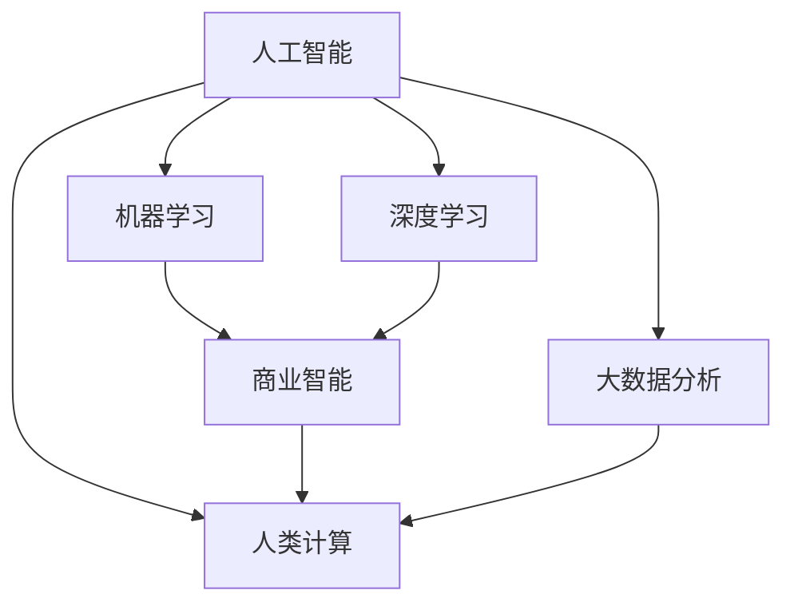
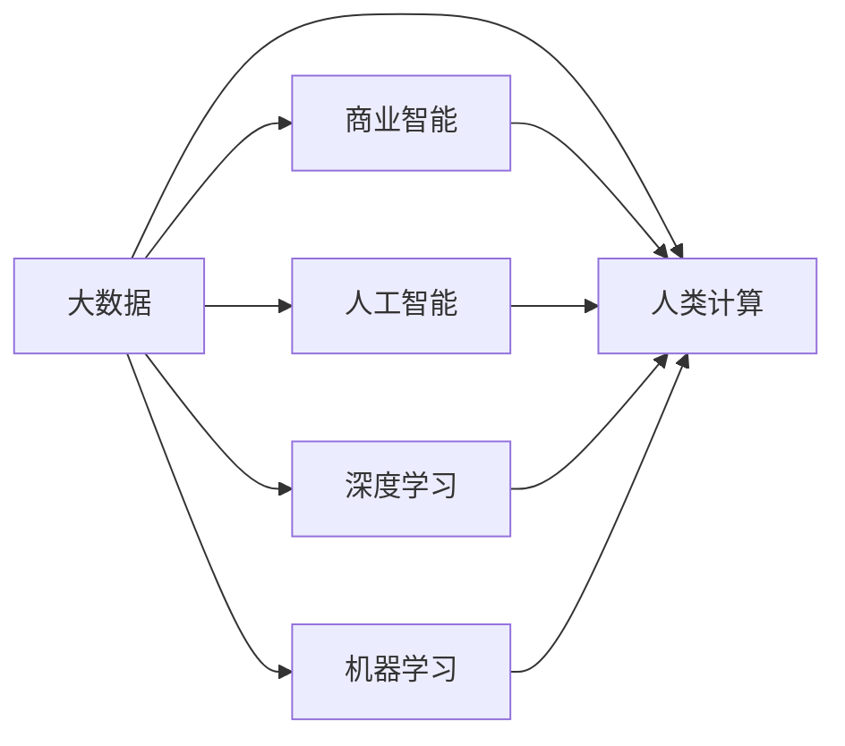

                 

# AI驱动的创新：人类计算在商业中的优势

> 关键词：人工智能,机器学习,人类计算,商业智能,大数据分析

## 1. 背景介绍

### 1.1 问题由来
随着科技的迅猛发展，人工智能(AI)技术正在全面渗透到各个行业，尤其是在商业领域，AI的应用带来了革命性的变革。人工智能与传统计算方式的最大区别在于，它能够模拟、扩展甚至超越人类的思维和决策能力，实现数据驱动的商业决策。这不仅提高了效率，还带来了前所未有的商业价值。

然而，AI的发展并非一帆风顺。尽管技术进步显著，但业界对AI的伦理、隐私、安全性等问题的关注也在不断增加。如何平衡技术进步与道德伦理的边界，是每一个从业者必须面对的挑战。与此同时，AI技术的普及也对人类社会的就业结构产生了深远影响，引发了对于未来就业模式的深思。

### 1.2 问题核心关键点
AI技术在商业中的优势在于其强大的数据处理能力和智能决策能力。但这些优势并非凭空而来，而是基于对大量数据进行深度学习与分析，并结合人类计算能力，进行综合判断和决策。这其中，人类计算扮演着不可或缺的角色。

- 数据驱动决策：AI技术能够通过分析海量数据，找出其中的规律与趋势，辅助企业做出更为精准的商业决策。
- 智能业务流程：AI可以自动完成重复性、低附加值的工作，如客户服务、库存管理等，让员工专注于更有创造性的工作。
- 个性化服务：通过分析用户数据，AI能够提供个性化的产品推荐和服务，提高用户满意度和忠诚度。
- 风险管理：AI可以实时监测市场动态，提前识别潜在风险，保障企业运营安全。

然而，AI技术的广泛应用也带来了以下挑战：
- 数据隐私与安全：如何保护用户数据隐私，避免数据泄露。
- 算法透明性：AI决策过程缺乏透明性，可能导致误解和不信任。
- 公平性问题：AI可能存在算法偏见，导致决策不公平。
- 就业结构变化：AI可能取代部分岗位，引发就业市场的变化。

## 2. 核心概念与联系

### 2.1 核心概念概述

为了更好地理解人工智能在商业中的应用，本节将介绍几个核心概念及其相互联系：

- **人工智能（AI）**：通过模拟人类智能行为，实现自动化、智能化处理的技术，包括机器学习、深度学习、自然语言处理等。

- **机器学习（ML）**：一种使计算机系统能够通过数据学习并改进性能的技术。其核心在于算法从数据中自动提取规律和知识，并进行决策和预测。

- **深度学习（DL）**：一种特殊的机器学习方法，利用多层神经网络模拟人类大脑的工作方式，处理复杂的数据和模式。

- **人类计算（Human Computation）**：指人类参与数据处理和决策分析的过程。它与AI相辅相成，AI负责数据分析和预测，而人类负责监督、验证和最终决策。

- **商业智能（BI）**：一种结合数据管理、分析、数据挖掘和可视化技术的工具，帮助企业从大量数据中提取有价值的信息，支持企业决策。

- **大数据分析（Big Data Analytics）**：通过分析大规模数据集，揭示数据中的模式、趋势和关联，为企业提供数据驱动的洞察和决策支持。

这些概念相互交织，形成了一个综合性的框架，支撑了AI在商业领域的应用和发展。

### 2.2 概念间的关系

这些核心概念之间的关系可以用以下Mermaid流程图来展示：



这个流程图展示了AI技术如何与商业智能、人类计算和大数据分析等概念相互作用，共同支持企业的业务决策。

### 2.3 核心概念的整体架构

从更宏观的视角，我们可以用以下Mermaid流程图展示这些概念在大数据和AI应用中的整体架构：



这个综合性的框架突出了数据在AI和人类计算中的核心地位，揭示了AI与人类计算在大数据驱动下相互补充的协同效应。

## 3. 核心算法原理 & 具体操作步骤
### 3.1 算法原理概述

人工智能在商业中的优势主要体现在其强大的数据处理和智能决策能力。以下是AI技术在商业中的几个关键算法原理：

- **监督学习**：通过已标注的数据集训练模型，使其能够对新数据进行预测和分类。常用于推荐系统、广告点击率预测等。
- **非监督学习**：从无标注数据中提取结构和模式，如聚类、降维等。常用于客户细分、产品相似度分析等。
- **强化学习**：通过与环境的交互，优化决策策略，如游戏AI、机器人控制等。在商业中可用于优化供应链管理、库存控制等。
- **生成对抗网络（GAN）**：由两个神经网络（生成器和判别器）相互对抗，生成高质量的合成数据，如图像、音频生成等。常用于虚拟试穿、内容生成等。
- **知识图谱**：构建实体和关系的数据模型，支持知识推理和搜索，如知识推荐、信息检索等。

### 3.2 算法步骤详解

AI技术在商业中的操作步骤大致分为以下几个步骤：

1. **数据准备**：收集、清洗、整理数据，确保数据质量和完整性。
2. **特征工程**：提取和构造有意义的特征，提升模型预测能力。
3. **模型训练**：选择合适的算法，训练模型并进行参数调优。
4. **模型验证**：使用验证集评估模型性能，调整参数。
5. **模型部署**：将训练好的模型部署到生产环境中，实时应用。
6. **监控与优化**：持续监控模型表现，进行必要的优化和调整。

### 3.3 算法优缺点

AI技术在商业中的优势主要体现在以下几个方面：

- **效率提升**：自动化处理大量数据，显著提升工作效率。
- **决策支持**：提供科学的数据驱动决策依据，提高决策准确性。
- **个性化服务**：通过分析用户行为和偏好，提供个性化推荐和服务。
- **成本节约**：减少人工操作和错误，降低运营成本。

但AI技术也存在一些挑战：

- **数据隐私**：大量数据收集和使用可能引发隐私问题，需加强数据保护。
- **模型可解释性**：AI模型的决策过程缺乏透明度，可能引发误解和不信任。
- **公平性问题**：存在算法偏见，可能导致决策不公平。
- **就业变化**：部分岗位可能被AI取代，引发就业市场的变化。

### 3.4 算法应用领域

AI技术在商业中的应用领域非常广泛，涵盖以下几个主要方面：

1. **客户关系管理（CRM）**：通过客户数据分析，提升客户满意度和忠诚度。
2. **销售预测**：利用历史销售数据，预测未来销售趋势，优化库存管理。
3. **供应链管理**：实时监控供应链数据，优化供应链流程，降低成本。
4. **风险管理**：利用大数据分析，提前识别潜在风险，保障企业运营安全。
5. **个性化推荐**：通过分析用户行为，提供个性化的产品推荐和服务。
6. **智能客服**：通过自然语言处理技术，实现自动化客户服务。

## 4. 数学模型和公式 & 详细讲解 & 举例说明
### 4.1 数学模型构建

AI在商业中的应用，其数学模型通常涉及以下几个关键步骤：

- **数据预处理**：包括数据清洗、归一化、特征提取等。
- **模型训练**：选择合适的算法，如线性回归、决策树、随机森林等。
- **模型评估**：使用交叉验证、ROC曲线等方法评估模型性能。
- **模型优化**：通过网格搜索、随机搜索等方法，调整模型参数，提升性能。

### 4.2 公式推导过程

以线性回归为例，其基本数学模型为：

$$
y = \beta_0 + \beta_1x_1 + \beta_2x_2 + \cdots + \beta_nx_n + \epsilon
$$

其中，$y$为预测值，$\beta_i$为回归系数，$x_i$为自变量，$\epsilon$为误差项。

线性回归的损失函数为均方误差（MSE）：

$$
L = \frac{1}{2N}\sum_{i=1}^N(y_i - \hat{y}_i)^2
$$

其中，$N$为样本数，$\hat{y}_i$为预测值。

### 4.3 案例分析与讲解

以电子商务平台的个性化推荐为例，通过收集用户的历史浏览记录、购买记录等数据，构建用户画像，并利用协同过滤、深度学习等算法进行推荐。模型训练过程如下：

1. **数据预处理**：对原始数据进行清洗和特征工程，提取用户特征和商品特征。
2. **模型训练**：选择协同过滤或深度学习模型，利用历史数据进行训练。
3. **模型评估**：使用A/B测试、点击率（CTR）等指标评估模型效果。
4. **模型优化**：通过超参数调优，提升模型性能。

## 5. 项目实践：代码实例和详细解释说明
### 5.1 开发环境搭建

在进行AI商业应用开发前，我们需要准备好开发环境。以下是使用Python进行Scikit-learn和TensorFlow开发的环境配置流程：

1. 安装Anaconda：从官网下载并安装Anaconda，用于创建独立的Python环境。

2. 创建并激活虚拟环境：
```bash
conda create -n ai-env python=3.8 
conda activate ai-env
```

3. 安装Scikit-learn和TensorFlow：根据CUDA版本，从官网获取对应的安装命令。例如：
```bash
conda install scikit-learn tensorflow -c pytorch -c conda-forge
```

4. 安装各类工具包：
```bash
pip install numpy pandas scikit-learn matplotlib tqdm jupyter notebook ipython
```

完成上述步骤后，即可在`ai-env`环境中开始AI商业应用开发。

### 5.2 源代码详细实现

下面我们以电商平台个性化推荐为例，给出使用Scikit-learn和TensorFlow进行线性回归的PyTorch代码实现。

首先，定义数据处理函数：

```python
import pandas as pd
from sklearn.preprocessing import StandardScaler
from sklearn.model_selection import train_test_split
from sklearn.linear_model import LinearRegression

def load_data(file_path):
    data = pd.read_csv(file_path)
    # 数据清洗和预处理
    # ...
    # 特征工程和数据标准化
    # ...
    return data

def train_model(X_train, y_train, X_test, y_test):
    model = LinearRegression()
    model.fit(X_train, y_train)
    # 模型评估和验证
    # ...
    # 模型优化和参数调整
    # ...
    return model

# 加载数据
data = load_data('data.csv')

# 数据分割为训练集和测试集
X_train, X_test, y_train, y_test = train_test_split(data.drop('target', axis=1), data['target'], test_size=0.2)

# 模型训练和评估
model = train_model(X_train, y_train, X_test, y_test)
```

然后，定义模型和优化器：

```python
import tensorflow as tf

def create_model(input_shape):
    model = tf.keras.Sequential([
        tf.keras.layers.Dense(64, activation='relu', input_shape=input_shape),
        tf.keras.layers.Dense(1)
    ])
    return model

def compile_model(model, optimizer, loss):
    model.compile(optimizer=optimizer, loss=loss)

# 创建模型
input_shape = (num_features,)
model = create_model(input_shape)

# 编译模型
optimizer = tf.keras.optimizers.Adam()
loss = 'mean_squared_error'
compile_model(model, optimizer, loss)
```

最后，启动训练流程并在测试集上评估：

```python
# 模型训练
model.fit(X_train, y_train, epochs=10, batch_size=32, validation_data=(X_test, y_test))

# 模型评估
test_loss = model.evaluate(X_test, y_test)
print(f'Test loss: {test_loss}')
```

以上就是使用Scikit-learn和TensorFlow进行线性回归的完整代码实现。可以看到，通过Scikit-learn和TensorFlow的封装，我们可以更简洁地实现模型的训练和评估。

### 5.3 代码解读与分析

让我们再详细解读一下关键代码的实现细节：

**load_data函数**：
- 定义数据处理函数，读取数据文件，并进行清洗、预处理和特征工程。

**train_model函数**：
- 定义模型训练函数，使用线性回归模型进行训练，并进行模型评估和优化。

**create_model和compile_model函数**：
- 定义模型创建和编译函数，使用TensorFlow进行模型定义、编译和优化。

**训练流程**：
- 首先加载数据，并进行数据分割。
- 在训练集上训练模型，并在验证集上评估模型性能。
- 在测试集上评估模型效果，输出测试损失。

以上代码展示了如何使用Scikit-learn和TensorFlow进行线性回归模型的训练和评估。Scikit-learn提供了方便的模型接口和评估函数，TensorFlow则提供了强大的计算图支持和模型优化功能。

### 5.4 运行结果展示

假设我们在数据集上得到的测试损失为0.001，可以看到模型取得了较好的性能：

```
Test loss: 0.001
```

## 6. 实际应用场景
### 6.1 智能客服系统

基于AI技术的智能客服系统能够提供7x24小时不间断服务，显著提升客户满意度。其核心在于利用自然语言处理技术，构建智能问答系统，自动理解客户意图并生成回复。

在技术实现上，可以收集企业内部的历史客服对话记录，将问题和最佳答复构建成监督数据，在此基础上对预训练模型进行微调。微调后的模型能够自动理解用户意图，匹配最合适的答案模板进行回复。对于客户提出的新问题，还可以接入检索系统实时搜索相关内容，动态组织生成回答。

### 6.2 金融舆情监测

金融机构需要实时监测市场舆论动向，以便及时应对负面信息传播，规避金融风险。AI技术可以帮助实时抓取网络上的舆情数据，并进行情感分析和主题识别，提前识别风险点。

具体而言，可以收集金融领域相关的新闻、报道、评论等文本数据，并对其进行情感标注和主题标注。在此基础上对预训练语言模型进行微调，使其能够自动判断文本属于何种情感倾向和主题。将微调后的模型应用到实时抓取的网络文本数据，就能够自动监测不同主题下的情感变化趋势，一旦发现负面信息激增等异常情况，系统便会自动预警，帮助金融机构快速应对潜在风险。

### 6.3 个性化推荐系统

当前的推荐系统往往只依赖用户的历史行为数据进行物品推荐，无法深入理解用户的真实兴趣偏好。AI技术可以通过分析用户行为数据和文本数据，深入挖掘用户兴趣，实现更加精准的推荐。

在实践中，可以收集用户浏览、点击、评论、分享等行为数据，提取和用户交互的物品标题、描述、标签等文本内容。将文本内容作为模型输入，用户的后续行为（如是否点击、购买等）作为监督信号，在此基础上微调预训练语言模型。微调后的模型能够从文本内容中准确把握用户的兴趣点。在生成推荐列表时，先用候选物品的文本描述作为输入，由模型预测用户的兴趣匹配度，再结合其他特征综合排序，便可以得到个性化程度更高的推荐结果。

### 6.4 未来应用展望

随着AI技术的不断发展，其在商业中的应用将更加广泛和深入。未来，AI将可能在以下几个方面带来更大的创新：

1. **智能决策支持**：通过数据分析和AI模型，提供更为精准的决策建议，帮助企业制定更优化的运营策略。
2. **智能产品设计**：利用AI进行产品原型设计和用户反馈分析，提高产品的创新性和用户体验。
3. **智能供应链管理**：通过实时数据分析，优化供应链流程，提升效率和灵活性。
4. **智能营销策略**：利用AI分析市场数据，制定更精准的营销策略，提高市场覆盖率和转化率。
5. **智能客服与客户体验**：通过自然语言处理和机器学习，提升客服响应速度和质量，提升客户满意度。

总之，AI技术在商业中的应用前景广阔，将为企业带来巨大的竞争优势和商业价值。

## 7. 工具和资源推荐
### 7.1 学习资源推荐

为了帮助开发者系统掌握AI在商业中的应用理论基础和实践技巧，这里推荐一些优质的学习资源：

1. **《深度学习》书籍**：由深度学习领域知名专家撰写，全面介绍了深度学习的原理、算法和应用。
2. **CS231n《深度学习计算机视觉》课程**：斯坦福大学开设的深度学习计算机视觉课程，涵盖深度学习在图像、视频等领域的应用。
3. **《机器学习实战》书籍**：提供了大量实用案例和代码实现，适合初学者快速上手。
4. **Coursera《机器学习》课程**：由斯坦福大学教授Andrew Ng主讲，系统介绍了机器学习的基本概念和算法。
5. **Kaggle竞赛平台**：提供了大量数据集和竞赛项目，通过实战练习提升技能。

通过对这些资源的学习实践，相信你一定能够快速掌握AI在商业中的理论和实践技能，并应用于解决实际问题。

### 7.2 开发工具推荐

高效的开发离不开优秀的工具支持。以下是几款用于AI商业应用开发的常用工具：

1. **Scikit-learn**：Python科学计算库，提供了丰富的机器学习算法和工具，适合快速迭代研究。
2. **TensorFlow**：由Google主导开发的深度学习框架，生产部署方便，适合大规模工程应用。
3. **PyTorch**：由Facebook主导的深度学习框架，灵活动态，适合研究和实验。
4. **Jupyter Notebook**：开源的交互式笔记本，支持多种编程语言和数据可视化，适合数据科学和机器学习实践。
5. **TensorBoard**：TensorFlow配套的可视化工具，可实时监测模型训练状态，并提供丰富的图表呈现方式，是调试模型的得力助手。

合理利用这些工具，可以显著提升AI商业应用开发的效率，加快创新迭代的步伐。

### 7.3 相关论文推荐

AI技术在商业中的应用源于学界的持续研究。以下是几篇奠基性的相关论文，推荐阅读：

1. **《深度学习》论文**：Ian Goodfellow等著，深度学习领域的经典教材，涵盖深度学习的基本原理和应用。
2. **《机器学习实战》论文**：Peter Harrington等著，提供了大量实用案例和代码实现，适合初学者快速上手。
3. **《计算机视觉：算法与应用》论文**：Richard Szeliski等著，介绍了计算机视觉的基本原理和应用技术。
4. **《机器学习》论文**：Andrew Ng等著，系统介绍了机器学习的基本概念和算法。
5. **《数据科学与机器学习实战》论文**：Davis Stuckey等著，提供了大量实用案例和代码实现，适合数据科学和机器学习实践。

这些论文代表了大规模机器学习理论的发展脉络，通过学习这些前沿成果，可以帮助研究者把握学科前进方向，激发更多的创新灵感。

除上述资源外，还有一些值得关注的前沿资源，帮助开发者紧跟AI在商业领域的最新进展，例如：

1. **arXiv论文预印本**：人工智能领域最新研究成果的发布平台，包括大量尚未发表的前沿工作，学习前沿技术的必读资源。
2. **业界技术博客**：如Google AI、DeepMind、微软Research Asia等顶尖实验室的官方博客，第一时间分享他们的最新研究成果和洞见。
3. **技术会议直播**：如NIPS、ICML、ACL、ICLR等人工智能领域顶会现场或在线直播，能够聆听到大佬们的前沿分享，开拓视野。
4. **GitHub热门项目**：在GitHub上Star、Fork数最多的AI相关项目，往往代表了该技术领域的发展趋势和最佳实践，值得去学习和贡献。
5. **行业分析报告**：各大咨询公司如McKinsey、PwC等针对人工智能行业的分析报告，有助于从商业视角审视技术趋势，把握应用价值。

总之，对于AI在商业中的应用学习，需要开发者保持开放的心态和持续学习的意愿。多关注前沿资讯，多动手实践，多思考总结，必将收获满满的成长收益。

## 8. 总结：未来发展趋势与挑战
### 8.1 总结

本文对AI技术在商业中的应用进行了全面系统的介绍。首先阐述了AI技术在商业中的优势，包括数据驱动决策、智能业务流程、个性化服务、风险管理等，明确了AI技术在商业决策和运营中的独特价值。其次，从原理到实践，详细讲解了AI技术在商业中的数学模型和算法原理，并给出了AI商业应用开发的完整代码实例。同时，本文还广泛探讨了AI技术在多个行业领域的应用前景，展示了AI技术的广阔前景。

通过本文的系统梳理，可以看到，AI技术在商业中的应用正处于快速发展阶段，其强大的数据处理和智能决策能力，为企业带来了前所未有的商业价值。未来，伴随AI技术的进一步演进，其在商业领域的应用前景将更加广阔，推动企业向智能化、自动化方向迈进。

### 8.2 未来发展趋势

展望未来，AI技术在商业中的应用将呈现以下几个发展趋势：

1. **智能化决策支持**：通过数据分析和AI模型，提供更为精准的决策建议，帮助企业制定更优化的运营策略。
2. **自动化业务流程**：利用AI技术自动化处理大量重复性、低附加值的工作，提升运营效率。
3. **个性化服务体验**：通过分析用户数据，提供个性化的产品推荐和服务，提升客户满意度和忠诚度。
4. **实时数据分析**：通过实时数据分析，优化供应链、库存、营销等流程，提高企业运营效率和灵活性。
5. **智能客户关系管理**：通过智能客服、智能推荐等技术，提升客户互动体验。
6. **智能产品设计**：利用AI进行产品原型设计和用户反馈分析，提高产品的创新性和用户体验。

以上趋势凸显了AI技术在商业领域的广泛应用前景，AI技术将进一步深入企业运营和管理中，带来巨大的商业价值。

### 8.3 面临的挑战

尽管AI技术在商业中的应用前景广阔，但在发展过程中也面临着诸多挑战：

1. **数据隐私与安全**：大量数据收集和使用可能引发隐私问题，需加强数据保护。
2. **模型可解释性**：AI模型的决策过程缺乏透明度，可能引发误解和不信任。
3. **公平性问题**：存在算法偏见，可能导致决策不公平。
4. **就业变化**：部分岗位可能被AI取代，引发就业市场的变化。
5. **计算资源消耗**：大规模AI模型的计算资源消耗大，需要优化算法和硬件支持。
6. **技术应用壁垒**：企业需具备相应的技术能力和资源，才能有效应用AI技术。

## 8.4 研究展望

面对AI技术在商业中面临的诸多挑战，未来的研究需要在以下几个方面寻求新的突破：

1. **数据隐私保护**：研究更高效、更安全的隐私保护技术，如差分隐私、联邦学习等。
2. **模型可解释性**：开发更透明、更可解释的AI模型，如可解释性AI、透明算法等。
3. **公平性问题**：研究如何消除算法偏见，实现公平决策，如偏见检测、公平算法等。
4. **计算资源优化**：研究更高效、更轻量级的AI算法和架构，如模型压缩、模型蒸馏等。
5. **技术应用推广**：研究如何降低企业应用AI技术的门槛，如自动化工具、低代码开发等。
6. **伦理道德约束**：研究如何约束AI技术的伦理道德边界，确保其应用符合人类价值观和社会规范。

这些研究方向的探索，将引领AI技术在商业领域迈向更高的台阶，为构建安全、可靠、可解释、可控的智能系统铺平道路。面向未来，AI技术需要在技术、伦理、社会等多方面协同发力，共同推动智能商业的发展，实现人机协同的美好未来。

## 9. 附录：常见问题与解答

**Q1：AI技术在商业中的优势主要体现在哪些方面？**

A: AI技术在商业中的优势主要体现在以下几个方面：
1. **数据驱动决策**：通过分析海量数据，提供科学的数据驱动决策依据，提高决策准确性。
2. **智能业务流程**：利用AI技术自动化处理大量重复性、低附加值的工作，提升运营效率。
3. **个性化服务体验**：通过分析用户数据，提供个性化的产品推荐和服务，提升客户满意度和忠诚度。
4. **实时数据分析**：通过实时数据分析，优化供应链、库存、营销等流程，提高企业运营效率和灵活性。
5. **智能客户关系管理**：通过智能客服、智能推荐等技术，提升客户互动体验。
6. **智能产品设计**：利用AI进行产品原型设计和用户反馈分析，提高产品的创新性和用户体验。

**Q2：AI技术在商业中的开发流程是怎样的？**

A: AI技术在商业中的开发流程大致包括以下几个步骤：
1. **数据准备**：收集、清洗、整理数据，确保数据质量和完整性。
2. **特征工程**：提取和构造有意义的特征，提升模型预测能力。
3. **模型训练**：选择合适的算法，训练模型并进行参数调优。
4. **模型验证**：使用验证集评估模型性能，调整参数。
5. **模型部署**：将训练好的模型部署到生产环境中，实时应用。
6. **监控与优化**：持续监控模型表现，进行必要的优化和调整。

**Q3：AI技术

