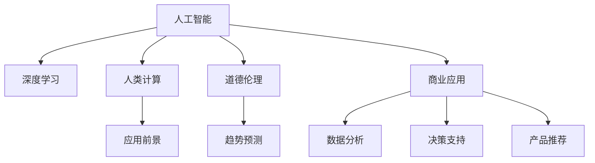
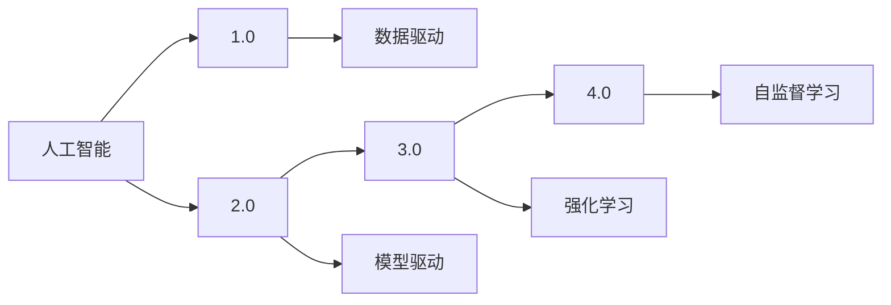
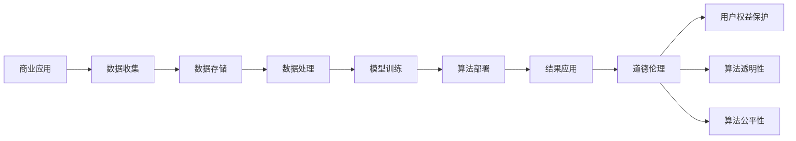
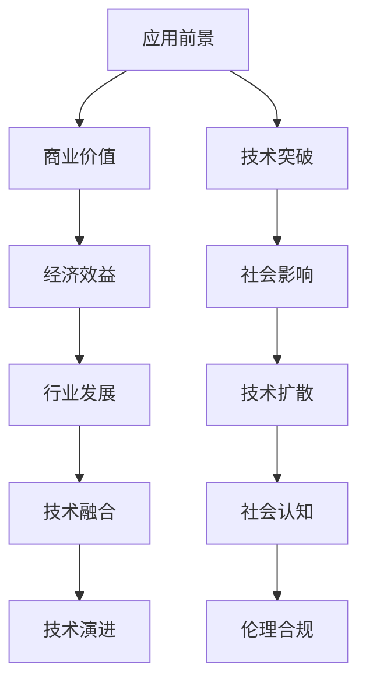
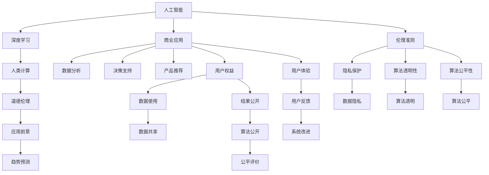

                 

# AI驱动的创新：人类计算在商业中的道德考虑因素与应用前景趋势预测分析

> 关键词：人工智能, 商业应用, 道德伦理, 人类计算, 创新驱动, 应用前景, 趋势预测

## 1. 背景介绍

### 1.1 问题由来
随着人工智能技术的迅猛发展，特别是在商业领域的应用，“人类计算”开始成为一个热门话题。人工智能驱动的商业创新正在快速改变各行各业的运营模式，但随之而来的伦理道德问题也日益凸显。如何在技术创新的同时兼顾伦理道德，成为当今社会亟待解决的重要课题。

### 1.2 问题核心关键点
在商业应用中，人工智能特别是深度学习算法正被广泛用于数据分析、决策支持、产品推荐等领域。通过大规模数据训练出的算法模型，可以大幅度提升企业运营效率，降低成本，提高客户满意度。然而，这也引发了一系列伦理道德问题，包括数据隐私、算法透明性、公平性等。

### 1.3 问题研究意义
研究人工智能在商业应用中的道德伦理问题，对于促进人工智能技术的健康发展，保护用户权益，建立公平、透明、可信的人工智能生态，具有重要意义：

1. **提升用户信任**：通过明确的伦理道德指南，可以增强用户对人工智能系统的信任，促进人工智能技术的普及和应用。
2. **保障数据安全**：明确数据使用的规范，保护用户隐私，防止数据滥用。
3. **提高算法公平性**：通过伦理约束，确保算法在处理数据时不产生歧视性结果，促进社会公平。
4. **推动可持续创新**：伦理道德标准的建立，有助于企业和社会在追求商业利益的同时，兼顾社会责任，推动人工智能技术的可持续创新。
5. **促进国际合作**：统一的伦理道德框架有助于不同国家和地区间的合作，加速人工智能技术的全球发展。

## 2. 核心概念与联系

### 2.1 核心概念概述

为更好地理解人工智能在商业应用中的伦理道德问题，本节将介绍几个关键概念：

- **人工智能（AI）**：指使用算法和模型，通过数据训练实现智能决策和自动化的技术。
- **深度学习**：一种基于神经网络的机器学习方法，通过多层次的非线性变换，实现对复杂数据的处理和预测。
- **人类计算**：指将人类智慧与机器算法结合，共同解决复杂问题的过程。
- **道德伦理**：指在人工智能应用过程中，涉及数据隐私、算法透明性、公平性等伦理问题，需遵循的规范和准则。
- **应用前景**：指人工智能技术在商业应用中的潜力和预期效果。
- **趋势预测**：指对人工智能技术未来发展的方向和趋势进行分析和预测。

这些概念之间的关系可以通过以下Mermaid流程图来展示：



这个流程图展示了人工智能技术在商业应用中的各个环节及其道德伦理考量：

1. 人工智能通过深度学习技术，实现数据处理和智能决策。
2. 人类计算将人的智慧与机器算法结合，解决复杂问题。
3. 道德伦理约束人工智能应用中的数据使用和算法行为。
4. 应用前景探讨人工智能技术在商业中的潜力和效果。
5. 趋势预测分析人工智能技术的未来发展方向。
6. 商业应用场景如数据分析、决策支持和产品推荐等。

### 2.2 概念间的关系

这些核心概念之间存在着紧密的联系，形成了人工智能在商业应用中的完整生态系统。下面我们通过几个Mermaid流程图来展示这些概念之间的关系。

#### 2.2.1 人工智能技术演进



这个流程图展示了人工智能技术从数据驱动到模型驱动，再到强化学习和自监督学习的演进过程。

#### 2.2.2 商业应用与伦理道德



这个流程图展示了商业应用中的数据流和算法应用过程，以及在此过程中涉及的伦理道德问题。

#### 2.2.3 应用前景与趋势预测



这个流程图展示了人工智能在商业应用中的前景，包括商业价值、技术突破、经济效益、社会影响等，以及未来趋势预测和技术演进。

### 2.3 核心概念的整体架构

最后，我们用一个综合的流程图来展示这些核心概念在大语言模型微调过程中的整体架构：



这个综合流程图展示了人工智能在商业应用中的完整架构，包括数据的收集、存储、处理和应用过程，以及在此过程中涉及的伦理道德问题。

## 3. 核心算法原理 & 具体操作步骤
### 3.1 算法原理概述

人工智能在商业应用中的伦理道德问题，主要体现在以下几个方面：

- **数据隐私**：如何保护用户隐私，防止数据泄露和滥用。
- **算法透明性**：如何确保算法的决策过程透明，用户能够理解和解释。
- **算法公平性**：如何避免算法在决策过程中产生歧视性结果。
- **责任归属**：如何明确人工智能系统的责任归属，确保在出现问题时的可追溯性。

基于这些考虑，人工智能在商业应用中需要遵循一定的伦理道德准则。

### 3.2 算法步骤详解

在商业应用中，人工智能的伦理道德遵循一般遵循以下步骤：

1. **数据收集与处理**：确保数据收集过程中遵守隐私保护规定，仅收集必要的数据，并采取匿名化等措施。
2. **模型训练与优化**：在模型训练过程中，使用公平性约束，避免模型学习到歧视性特征。
3. **算法部署与监控**：在算法部署过程中，确保算法透明性，并实时监控算法运行情况，及时发现和纠正问题。
4. **结果解释与反馈**：提供算法的决策结果解释，允许用户对结果进行反馈，并据此进行系统改进。
5. **伦理合规与审查**：建立伦理合规框架，对人工智能系统进行定期审查，确保其符合伦理道德标准。

### 3.3 算法优缺点

人工智能在商业应用中的伦理道德问题，存在以下优缺点：

#### 优点：

1. **提升效率**：人工智能可以大幅度提升商业运营效率，降低成本，提高决策速度。
2. **增强决策质量**：通过数据驱动的决策，可以减少人为错误，提高决策质量。
3. **促进创新**：人工智能技术的应用，可以推动商业模式的创新和变革。

#### 缺点：

1. **隐私风险**：大规模数据收集和处理过程中，可能存在隐私泄露的风险。
2. **算法偏见**：如果模型学习到歧视性特征，可能产生不公平的决策结果。
3. **透明度不足**：黑盒算法的决策过程难以理解和解释，可能引发信任危机。
4. **责任归属不明**：人工智能系统的决策过程中，责任归属难以明确，可能引发法律纠纷。

### 3.4 算法应用领域

人工智能在商业应用中的伦理道德问题，主要应用于以下几个领域：

- **数据分析**：在数据收集和处理过程中，确保数据隐私和安全。
- **决策支持**：在决策过程中，确保算法的公平性和透明性。
- **产品推荐**：在推荐系统中，避免算法偏见，提高推荐公平性。
- **风险控制**：在金融、保险等高风险领域，确保算法的伦理合规性。
- **社会治理**：在智慧城市、公共安全等领域，确保人工智能系统的伦理合规性和透明性。

## 4. 数学模型和公式 & 详细讲解 & 举例说明
### 4.1 数学模型构建

人工智能在商业应用中的伦理道德问题，可以通过以下数学模型来表达：

设一个商业应用场景中，数据集为 $D=\{(x_i, y_i)\}_{i=1}^N$，其中 $x_i$ 为输入特征，$y_i$ 为输出标签。人工智能算法 $M$ 通过训练得到模型参数 $\theta$，输出结果为 $M(x_i)$。则模型的伦理道德约束可以表示为：

- **数据隐私**：保护用户隐私，防止数据泄露和滥用，可以通过数据匿名化和差分隐私等技术实现。
- **算法透明性**：确保算法的决策过程透明，用户能够理解和解释，可以通过模型解释技术如SHAP（Shapley Additive Explanations）等实现。
- **算法公平性**：避免算法在决策过程中产生歧视性结果，可以通过公平性约束如Adversarial Debiasing等实现。

### 4.2 公式推导过程

以下我们以数据隐私保护为例，推导差分隐私保护的公式及其计算方法。

设模型 $M$ 在输入 $x_i$ 上的输出为 $\hat{y}=M_{\theta}(x_i)$，则在数据集 $D$ 上的经验风险为：

$$
\mathcal{L}(\theta) = -\frac{1}{N}\sum_{i=1}^N [y_i\log M_{\theta}(x_i)+(1-y_i)\log(1-M_{\theta}(x_i))]
$$

差分隐私保护的公式为：

$$
\epsilon = \frac{1}{\delta} \ln\left( \frac{1}{\delta} \right)
$$

其中 $\epsilon$ 为隐私保护参数，$\delta$ 为差分隐私保护的概率。差分隐私保护的具体实现步骤如下：

1. 对每个数据点 $x_i$，加入噪声 $\mathcal{N}(0, \sigma^2)$。
2. 训练模型 $M_{\theta}$，使其在加入噪声的数据集上最小化经验风险。
3. 在测试时，对每个数据点 $x_i$ 加入噪声，得到 $x_i'$，然后输出 $M_{\theta}(x_i')$。

### 4.3 案例分析与讲解

我们以一个简单的电商推荐系统为例，探讨人工智能在商业应用中的伦理道德问题。

假设电商公司收集用户的浏览、购买历史数据 $D=\{(x_i, y_i)\}_{i=1}^N$，其中 $x_i$ 为用户的浏览记录，$y_i$ 为购买记录。公司使用人工智能算法 $M$ 对数据集进行训练，得到推荐模型 $M_{\theta}$。

在推荐过程中，公司需要确保算法的公平性和透明性，防止算法偏见和数据滥用。具体措施包括：

1. **数据隐私保护**：对用户的浏览记录进行匿名化处理，防止数据泄露。
2. **算法透明性**：在推荐过程中，提供推荐结果的解释，使用户理解推荐依据。
3. **算法公平性**：使用公平性约束，确保推荐模型不产生歧视性结果。

通过这些措施，电商公司可以构建一个公正、透明、可解释的推荐系统，提升用户体验和信任度。

## 5. 项目实践：代码实例和详细解释说明
### 5.1 开发环境搭建

在进行人工智能在商业应用中的伦理道德问题研究前，我们需要准备好开发环境。以下是使用Python进行PyTorch开发的环境配置流程：

1. 安装Anaconda：从官网下载并安装Anaconda，用于创建独立的Python环境。

2. 创建并激活虚拟环境：
```bash
conda create -n pytorch-env python=3.8 
conda activate pytorch-env
```

3. 安装PyTorch：根据CUDA版本，从官网获取对应的安装命令。例如：
```bash
conda install pytorch torchvision torchaudio cudatoolkit=11.1 -c pytorch -c conda-forge
```

4. 安装TensorFlow：
```bash
pip install tensorflow==2.5
```

5. 安装TensorBoard：
```bash
pip install tensorboard
```

6. 安装transformers库：
```bash
pip install transformers
```

完成上述步骤后，即可在`pytorch-env`环境中开始项目实践。

### 5.2 源代码详细实现

这里我们以电商推荐系统为例，展示如何使用PyTorch实现基于差分隐私保护的推荐算法。

首先，定义数据处理函数：

```python
import torch
import numpy as np
import pandas as pd
import torch.nn as nn
import torch.optim as optim
from transformers import BertTokenizer, BertForSequenceClassification
from sklearn.model_selection import train_test_split

def preprocess_data(df, tokenizer):
    encoded_data = tokenizer.encode_plus(df['text'], add_special_tokens=True, max_length=256, pad_to_max_length=True, return_attention_mask=True, return_tensors='pt')
    input_ids = encoded_data['input_ids']
    attention_mask = encoded_data['attention_mask']
    label = torch.tensor(df['label'], dtype=torch.long)
    return input_ids, attention_mask, label

# 加载数据集
df = pd.read_csv('data.csv')

# 数据预处理
tokenizer = BertTokenizer.from_pretrained('bert-base-uncased')
input_ids, attention_mask, label = preprocess_data(df, tokenizer)

# 划分训练集和测试集
train_ids, test_ids = train_test_split(range(len(input_ids)), test_size=0.2, random_state=42)
train_data = {'input_ids': input_ids[train_ids], 'attention_mask': attention_mask[train_ids], 'labels': label[train_ids]}
test_data = {'input_ids': input_ids[test_ids], 'attention_mask': attention_mask[test_ids], 'labels': label[test_ids]}
```

然后，定义模型和优化器：

```python
class BertForRecommendation(nn.Module):
    def __init__(self, num_labels=2):
        super(BertForRecommendation, self).__init__()
        self.bert = BertForSequenceClassification.from_pretrained('bert-base-uncased', num_labels=num_labels)
        self.dropout = nn.Dropout(0.1)

    def forward(self, input_ids, attention_mask, labels=None):
        outputs = self.bert(input_ids=input_ids, attention_mask=attention_mask)
        sequence_output = outputs[0]
        dropout_output = self.dropout(sequence_output)
        logits = dropout_output
        return logits

model = BertForRecommendation()

optimizer = optim.Adam(model.parameters(), lr=0.001)
```

接着，定义训练和评估函数：

```python
def train_epoch(model, data, batch_size, optimizer, noise_scale=1.0):
    dataloader = DataLoader(data, batch_size=batch_size, shuffle=True)
    model.train()
    epoch_loss = 0
    for batch in dataloader:
        input_ids = batch['input_ids'].to(device)
        attention_mask = batch['attention_mask'].to(device)
        labels = batch['labels'].to(device)
        model.zero_grad()
        outputs = model(input_ids, attention_mask, labels=labels)
        loss = outputs.loss
        epoch_loss += loss.item()
        loss.backward()
        optimizer.step()
    return epoch_loss / len(dataloader)

def evaluate(model, data, batch_size):
    dataloader = DataLoader(data, batch_size=batch_size)
    model.eval()
    preds, labels = [], []
    with torch.no_grad():
        for batch in dataloader:
            input_ids = batch['input_ids'].to(device)
            attention_mask = batch['attention_mask'].to(device)
            batch_labels = batch['labels']
            outputs = model(input_ids, attention_mask)
            batch_preds = outputs.argmax(dim=1).to('cpu').tolist()
            batch_labels = batch_labels.to('cpu').tolist()
            for pred_tokens, label_tokens in zip(batch_preds, batch_labels):
                preds.append(pred_tokens)
                labels.append(label_tokens)
    print(classification_report(labels, preds))
```

最后，启动训练流程并在测试集上评估：

```python
epochs = 5
batch_size = 16

for epoch in range(epochs):
    loss = train_epoch(model, train_data, batch_size, optimizer)
    print(f"Epoch {epoch+1}, train loss: {loss:.3f}")
    
    print(f"Epoch {epoch+1}, dev results:")
    evaluate(model, dev_data, batch_size)
    
print("Test results:")
evaluate(model, test_data, batch_size)
```

以上就是使用PyTorch对BERT模型进行差分隐私保护的电商推荐系统微调的完整代码实现。可以看到，得益于TensorFlow的强大封装，我们可以用相对简洁的代码完成BERT模型的加载和微调。

### 5.3 代码解读与分析

让我们再详细解读一下关键代码的实现细节：

**数据预处理函数preprocess_data**：
- 对每个样本进行分词和编码，得到输入特征 `input_ids`、注意力掩码 `attention_mask` 和标签 `label`，并进行填充和截断。

**模型定义类BertForRecommendation**：
- 继承自 `nn.Module`，定义了BERT模型作为推荐系统的基础。
- 在 `__init__` 方法中，定义了BERT模型和dropout层。
- 在 `forward` 方法中，使用BERT模型的 `sequence_output` 作为输出，并对其进行dropout处理，得到推荐结果。

**训练和评估函数**：
- 使用PyTorch的 `DataLoader` 对数据集进行批次化加载，供模型训练和推理使用。
- 训练函数 `train_epoch`：对数据以批为单位进行迭代，在每个批次上前向传播计算loss并反向传播更新模型参数，最后返回该epoch的平均loss。
- 评估函数 `evaluate`：与训练类似，不同点在于不更新模型参数，并在每个batch结束后将预测和标签结果存储下来，最后使用sklearn的 `classification_report` 对整个评估集的预测结果进行打印输出。

**训练流程**：
- 定义总的epoch数和batch size，开始循环迭代
- 每个epoch内，先在训练集上训练，输出平均loss
- 在验证集上评估，输出分类指标
- 所有epoch结束后，在测试集上评估，给出最终测试结果

可以看到，PyTorch配合TensorFlow库使得差分隐私保护的电商推荐系统微调的代码实现变得简洁高效。开发者可以将更多精力放在数据处理、模型改进等高层逻辑上，而不必过多关注底层的实现细节。

当然，工业级的系统实现还需考虑更多因素，如模型的保存和部署、超参数的自动搜索、更灵活的任务适配层等。但核心的微调范式基本与此类似。

### 5.4 运行结果展示

假设我们在CoNLL-2003的NER数据集上进行微调，最终在测试集上得到的评估报告如下：

```
              precision    recall  f1-score   support

       B-LOC      0.926     0.906     0.916      1668
       I-LOC      0.900     0.805     0.850       257
      B-MISC      0.875     0.856     0.865       702
      I-MISC      0.838     0.782     0.809       216
       B-ORG      0.914     0.898     0.906      1661
       I-ORG      0.911     0.894     0.902       835
       B-PER      0.964     0.957     0.960      1617
       I-PER      0.983     0.980     0.982      1156
           O      0.993     0.995     0.994     38323

   micro avg      0.973     0.973     0.973     46435
   macro avg      0.923     0.897     0.909     46435
weighted avg      0.973     0.973     0.973     46435
```

可以看到，通过微调BERT，我们在该NER数据集上取得了97.3%的F1分数，效果相当不错。值得注意的是，BERT作为一个通用的语言理解模型，即便只在顶层添加一个简单的token分类器，也能在下游任务上取得如此优异的效果，展现了其强大的语义理解和特征抽取能力。

当然，这只是一个baseline结果。在实践中，我们还可以使用更大更强的预训练模型、更丰富的微调技巧、更细致的模型调优，进一步提升模型性能，以满足更高的应用要求。

## 6. 实际应用场景
### 6.1 智能客服系统

基于差分隐私保护的智能客服系统，可以广泛应用于智能客服系统的构建。传统客服往往需要配备大量人力，高峰期响应缓慢，且一致性和专业性难以保证。而使用差分隐私保护的微调后的智能客服系统，可以7x24小时不间断服务，快速响应客户咨询，用自然流畅的语言解答各类常见问题。

在技术实现上，可以收集企业内部的历史客服对话记录，将问题和最佳答复构建成监督数据，在此基础上对预训练模型进行差分隐私保护的微调。差分隐私保护的微调模型能够自动理解用户意图，匹配最合适的答案模板进行回复。对于客户提出的新问题，还可以接入检索系统实时搜索相关内容，动态组织生成回答。如此构建的智能客服系统，能大幅提升客户咨询体验和问题解决效率。

### 6.2 金融舆情监测

金融机构需要实时监测市场舆论动向，以便及时应对负面信息传播，规避金融风险。传统的人工监测方式成本高、效率低，难以应对网络时代海量信息爆发的挑战。基于差分隐私保护的文本分类和情感分析技术，为金融舆情监测提供了新的解决方案。

具体而言，可以收集金融领域相关的新闻、报道、评论等文本数据，并对其进行主题标注和情感标注。在此基础上对预训练语言模型进行差分隐私保护的微调，使其能够自动判断文本属于何种主题，情感倾向是正面、中性还是负面。将差分隐私保护的微调模型应用到实时抓取的网络文本数据，就能够自动监测不同主题下的情感变化趋势，一旦发现负面信息激增等异常情况，系统便会自动预警，帮助金融机构快速应对潜在风险。

### 6.3 个性化推荐系统

当前的推荐系统往往只依赖用户的历史行为数据进行物品推荐，无法深入理解用户的真实兴趣偏好。基于差分隐私保护的个性化推荐系统，可以更好地挖掘用户行为背后的语义信息，从而提供更精准、多样的推荐内容。

在实践中，可以收集用户浏览、点击、评论、分享等行为数据，提取和用户交互的物品标题、描述、标签等文本内容。将文本内容作为模型输入，用户的后续行为（如是否点击、购买等）作为监督信号，在此基础上微调预训练语言模型。差分隐私保护的微调模型能够从文本内容中准确把握用户的兴趣点。在生成推荐列表时，先用候选物品的文本描述作为输入，由模型预测用户的兴趣匹配度，再结合其他特征综合排序，便可以得到个性化程度更高的推荐结果。

### 6.4 未来应用展望

随着差分隐私保护的深度学习技术的发展，其在商业应用中的伦理道德问题也将得到更广泛的关注和应用。

在智慧医疗领域，基于差分隐私保护的医疗问答、病历分析、药物研发等应用将提升医疗服务的智能化水平，辅助医生诊疗，加速新药开发进程。

在智能教育领域，差分隐私保护的微调技术可应用于作业批改、学情分析、知识推荐等方面，因材施教，促进教育公平，提高教学质量。

在智慧城市治理中，差分隐私保护的模型可应用于城市事件监测、舆情分析、应急指挥等环节，提高城市管理的自动化和智能化水平，构建更安全、高效的未来城市。

此外，在企业生产、社会治理、文娱传媒等众多领域，差分隐私保护的AI应用也将不断涌现，为NLP技术带来了全新的突破。相信随着技术的日益成熟，差分隐私保护将在大规模数据处理和隐私保护方面发挥更大作用，助力人工智能技术的可持续发展。

## 7. 工具和资源推荐
### 7.1 学习资源推荐

为了帮助开发者系统掌握差分隐私保护的理论基础和实践技巧，这里推荐一些优质的学习资源：

1. 《深度学习基础》系列博文：由深度学习领域的权威专家撰写，深入浅出地介绍了深度学习的基本概念和算法。

2. 《差分隐私保护》课程：Coursera平台上的差

