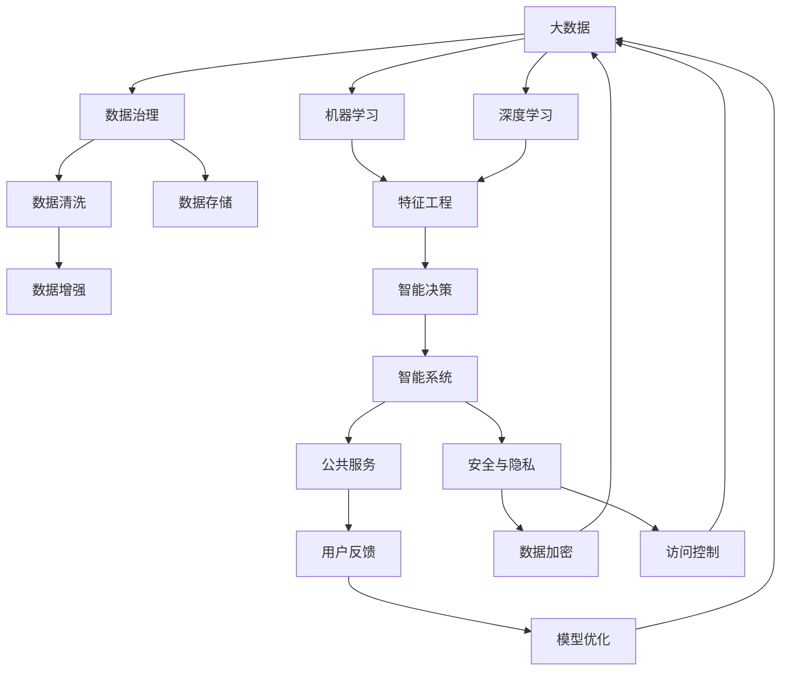

                 

# AI驱动的创新：人类计算在政府中的应用

> 关键词：AI驱动, 政府应用, 大数据, 机器学习, 深度学习, 智能决策, 数据治理, 安全与隐私

## 1. 背景介绍

### 1.1 问题由来
在信息化时代，数据已成为国家重要的战略资源。政府作为社会治理的重要主体，在公共服务、经济监管、社会治理等多个方面，都离不开对海量数据的深入分析和高效利用。传统的数据处理方式面临瓶颈，计算能力有限，难以满足日益增长的需求。为此，AI驱动的智能计算方法应运而生，成为推动政府数据治理和智能决策的重要引擎。

### 1.2 问题核心关键点
AI驱动的政府应用，是指利用人工智能技术，通过大数据分析、机器学习、深度学习等手段，提高政府决策的智能化、精准化和科学化水平。其核心关键点包括：

- **数据治理**：保障数据的安全性、完整性和可用性，提升数据的利用效率和治理水平。
- **智能决策**：利用AI技术，对复杂决策问题进行建模和优化，提高决策的科学性和效率。
- **公共服务**：通过AI驱动的智能系统，提供个性化、高效的公共服务，提升用户体验。
- **安全与隐私**：在保障信息安全的前提下，提升数据使用的透明度和合规性，保护个人隐私。

### 1.3 问题研究意义
AI驱动的政府应用，对于提升政府治理能力、推动经济社会发展、保障社会稳定具有重要意义：

1. **提高治理效率**：AI技术能够高效处理海量数据，快速发现问题，辅助决策，提升政府治理效率。
2. **优化资源配置**：AI能够分析多维度数据，识别关键因素，优化资源配置，提升资源使用效率。
3. **增强决策科学性**：AI驱动的建模方法，能够提供科学的预测和分析结果，支撑决策制定。
4. **提升服务质量**：智能系统能够提供个性化、精准的服务，提升用户体验，增加政府公信力。
5. **强化安全防护**：AI技术能够实时监控数据使用情况，发现异常行为，提升数据安全防护能力。

## 2. 核心概念与联系

### 2.1 核心概念概述

为了更好地理解AI驱动的政府应用，本节将介绍几个密切相关的核心概念：

- **AI驱动**：指利用人工智能技术，对大规模数据进行高效处理和分析，推动决策和服务的智能化。
- **大数据**：指通过数字化手段获取的海量数据，包括结构化、半结构化和非结构化数据。
- **机器学习**：指利用数据训练模型，使其能够对新数据进行预测或分类的算法。
- **深度学习**：指基于神经网络的机器学习算法，能够处理高维度、复杂非线性的数据。
- **智能决策**：指利用AI技术，对复杂决策问题进行建模和优化，提升决策的科学性和效率。
- **数据治理**：指对数据进行管理、清洗、分析和使用的全过程，确保数据的安全性、完整性和可用性。
- **安全与隐私**：指在数据使用过程中，确保数据的安全性和个人隐私的保护。

这些核心概念之间通过数据和计算形成紧密的联系，共同构成了AI驱动的政府应用的完整生态系统。

### 2.2 概念间的关系

这些核心概念之间的逻辑关系可以通过以下Mermaid流程图来展示：



这个流程图展示了大数据与AI驱动的政府应用之间的逻辑关系：

1. 大数据是AI应用的基础，需要通过数据治理、清洗和存储，保障数据的完整性和可用性。
2. 机器学习和深度学习技术，能够从大数据中提取有用的特征，用于智能决策和智能系统。
3. 智能决策通过数据分析和建模，辅助政府进行科学决策。
4. 智能系统将决策结果应用到公共服务中，提升服务质量和用户体验。
5. 安全与隐私措施，确保数据使用的合规性和用户隐私保护。

## 3. 核心算法原理 & 具体操作步骤
### 3.1 算法原理概述

AI驱动的政府应用，本质上是将AI技术应用到政府数据治理和智能决策过程中。其核心算法原理包括以下几个方面：

- **数据预处理**：通过清洗、增强、转换等方法，提高数据的可用性和准确性。
- **特征提取**：利用机器学习或深度学习算法，从原始数据中提取关键特征，用于后续分析和建模。
- **模型训练**：使用监督或无监督学习算法，训练模型，使其能够对新数据进行预测或分类。
- **智能决策**：将训练好的模型应用于实际决策场景，辅助政府进行高效决策。
- **安全与隐私保护**：在数据使用过程中，采取加密、访问控制等措施，确保数据安全。

### 3.2 算法步骤详解

AI驱动的政府应用，一般包括以下关键步骤：

**Step 1: 数据准备与预处理**
- 收集和整理政府部门相关的数据，确保数据的完整性和准确性。
- 对数据进行清洗和去噪，去除重复、错误和不完整的数据。
- 对数据进行归一化、标准化处理，提高数据的可比性和可用性。

**Step 2: 特征提取与选择**
- 使用特征工程技术，将原始数据转换为模型所需的特征向量。
- 通过特征选择方法，筛选出对目标任务最有用的特征。

**Step 3: 模型训练与优化**
- 选择合适的机器学习或深度学习算法，训练模型。
- 使用交叉验证等方法，对模型进行调参和优化，提高模型泛化能力。
- 应用正则化、dropout等技术，避免过拟合，提升模型稳定性。

**Step 4: 智能决策与系统部署**
- 将训练好的模型集成到智能系统中，实现自动化决策和推理。
- 通过API接口，将智能系统的决策结果应用于公共服务中。
- 对智能系统进行监控和维护，确保系统稳定运行。

**Step 5: 安全与隐私保护**
- 对敏感数据进行加密存储和传输，确保数据安全。
- 设置严格的访问控制，限制对数据的访问权限。
- 定期对系统进行安全漏洞扫描，及时修复安全问题。

### 3.3 算法优缺点

AI驱动的政府应用，具有以下优点：

- **高效处理大数据**：AI技术能够高效处理大规模数据，快速发现问题，辅助决策。
- **提升决策科学性**：利用AI模型，对复杂决策问题进行建模和优化，提高决策的科学性和效率。
- **增强服务质量**：智能系统能够提供个性化、精准的服务，提升用户体验。
- **强化安全防护**：AI技术能够实时监控数据使用情况，发现异常行为，提升数据安全防护能力。

同时，该方法也存在一定的局限性：

- **依赖数据质量**：模型的效果依赖于数据的质量，低质量、不完整的数据可能导致模型性能下降。
- **模型复杂度高**：深度学习等复杂模型需要大量计算资源，可能导致系统部署成本较高。
- **结果解释性差**：AI模型往往难以解释其内部工作机制，增加了系统复杂性和维护难度。
- **隐私保护挑战**：在数据使用过程中，需要兼顾数据的安全性和隐私保护，处理不当可能导致隐私泄露。

### 3.4 算法应用领域

AI驱动的政府应用，涵盖了政府工作的多个方面，包括但不限于：

- **公共安全与犯罪预防**：利用AI技术，对犯罪数据进行建模和分析，预测犯罪趋势，提高预防和打击效果。
- **城市管理与智能交通**：通过AI系统，对城市交通数据进行分析，优化交通管理，提升城市运行效率。
- **环境监测与污染控制**：利用AI技术，对环境数据进行监测和分析，预测污染趋势，制定科学的环境保护措施。
- **社会治理与民生服务**：通过AI系统，对社会数据进行分析和预测，提升社会治理和民生服务的水平。
- **医疗健康与公共卫生**：利用AI技术，对医疗数据进行分析和预测，提升公共卫生水平，保障市民健康。

这些应用领域展示了AI驱动政府应用的广泛潜力和应用价值，为政府决策和公共服务提供了有力的技术支持。

## 4. 数学模型和公式 & 详细讲解 & 举例说明

### 4.1 数学模型构建

为了更好地理解AI驱动的政府应用，我们以公共安全与犯罪预防为例，构建一个简化的数学模型。

假设收集到的犯罪数据集为 $D=\{(x_i, y_i)\}_{i=1}^N$，其中 $x_i$ 为特征向量，$y_i$ 为犯罪类型（如盗窃、抢劫、诈骗等）。

定义模型 $M_{\theta}$ 为线性回归模型，其输出为 $M_{\theta}(x) = \theta_0 + \sum_{j=1}^d \theta_j x_{i,j}$，其中 $\theta = (\theta_0, \theta_1, ..., \theta_d)$ 为模型参数。

目标是最小化预测值与真实值之间的平方误差，即：

$$
\mathcal{L}(\theta) = \frac{1}{N} \sum_{i=1}^N \|y_i - M_{\theta}(x_i)\|^2
$$

最小化上述损失函数，得到最优参数 $\theta^*$：

$$
\theta^* = \mathop{\arg\min}_{\theta} \mathcal{L}(\theta)
$$

### 4.2 公式推导过程

以线性回归模型为例，其预测函数为 $M_{\theta}(x) = \theta_0 + \sum_{j=1}^d \theta_j x_{i,j}$。

其损失函数为平方误差损失，推导过程如下：

$$
\mathcal{L}(\theta) = \frac{1}{N} \sum_{i=1}^N (y_i - M_{\theta}(x_i))^2
$$

展开平方项：

$$
\mathcal{L}(\theta) = \frac{1}{N} \sum_{i=1}^N (y_i^2 - 2y_iM_{\theta}(x_i) + M_{\theta}(x_i)^2)
$$

由于 $M_{\theta}(x_i)$ 与 $y_i$ 无关，因此可以简化为：

$$
\mathcal{L}(\theta) = \frac{1}{N} \sum_{i=1}^N (y_i^2 + M_{\theta}(x_i)^2 - 2y_iM_{\theta}(x_i))
$$

进一步简化：

$$
\mathcal{L}(\theta) = \frac{1}{N} \sum_{i=1}^N (y_i - M_{\theta}(x_i))^2
$$

将上述损失函数对参数 $\theta$ 求导，得到梯度：

$$
\nabla_{\theta}\mathcal{L}(\theta) = \frac{2}{N} \sum_{i=1}^N (y_i - M_{\theta}(x_i))(x_i)
$$

利用梯度下降等优化算法，更新参数 $\theta$，最小化损失函数 $\mathcal{L}(\theta)$，得到最优参数 $\theta^*$。

### 4.3 案例分析与讲解

假设我们利用AI技术，对北京市的治安数据进行建模和分析。通过收集历史治安事件数据，构建一个犯罪预测模型，对未来的犯罪趋势进行预测。具体步骤如下：

1. **数据准备**：收集北京市近五年的治安事件数据，包括时间、地点、事件类型等信息。
2. **数据清洗**：对数据进行去重、去噪、归一化处理，确保数据的完整性和可用性。
3. **特征提取**：选择与犯罪相关的特征，如时间、地点、天气等，构建特征向量 $x_i$。
4. **模型训练**：使用线性回归模型，训练模型，优化模型参数 $\theta$。
5. **智能决策**：将训练好的模型应用于未来的治安数据，预测犯罪趋势，辅助决策。
6. **安全与隐私保护**：对敏感数据进行加密存储和传输，确保数据安全。

## 5. 项目实践：代码实例和详细解释说明

### 5.1 开发环境搭建

在进行AI驱动的政府应用开发前，我们需要准备好开发环境。以下是使用Python进行PyTorch开发的环境配置流程：

1. 安装Anaconda：从官网下载并安装Anaconda，用于创建独立的Python环境。

2. 创建并激活虚拟环境：
```bash
conda create -n ai-env python=3.8 
conda activate ai-env
```

3. 安装PyTorch：根据CUDA版本，从官网获取对应的安装命令。例如：
```bash
conda install pytorch torchvision torchaudio cudatoolkit=11.1 -c pytorch -c conda-forge
```

4. 安装TensorFlow：如果需要进行TensorFlow相关的开发，可以使用以下命令：
```bash
conda install tensorflow
```

5. 安装各类工具包：
```bash
pip install numpy pandas scikit-learn matplotlib tqdm jupyter notebook ipython
```

完成上述步骤后，即可在`ai-env`环境中开始AI驱动的政府应用开发。

### 5.2 源代码详细实现

这里我们以智能犯罪预测系统为例，给出使用PyTorch进行开发的完整代码实现。

首先，定义犯罪数据集类：

```python
from torch.utils.data import Dataset

class CrimeDataset(Dataset):
    def __init__(self, data, labels):
        self.data = data
        self.labels = labels
        
    def __len__(self):
        return len(self.data)
    
    def __getitem__(self, item):
        return self.data[item], self.labels[item]
```

然后，定义线性回归模型类：

```python
import torch
import torch.nn as nn
import torch.optim as optim

class LinearRegression(nn.Module):
    def __init__(self, input_size, output_size):
        super(LinearRegression, self).__init__()
        self.linear = nn.Linear(input_size, output_size)
        
    def forward(self, x):
        return self.linear(x)
```

接着，定义训练和评估函数：

```python
def train_model(model, train_data, val_data, epochs, batch_size, learning_rate):
    model.train()
    criterion = nn.MSELoss()
    optimizer = optim.SGD(model.parameters(), lr=learning_rate)
    
    for epoch in range(epochs):
        train_loss = 0
        for data, target in train_data:
            optimizer.zero_grad()
            output = model(data)
            loss = criterion(output, target)
            loss.backward()
            optimizer.step()
            train_loss += loss.item()
            
        if epoch % 1 == 0:
            model.eval()
            val_loss = 0
            with torch.no_grad():
                for data, target in val_data:
                    output = model(data)
                    loss = criterion(output, target)
                    val_loss += loss.item()
                
            print(f"Epoch {epoch+1}, Train Loss: {train_loss/len(train_data):.4f}, Val Loss: {val_loss/len(val_data):.4f}")
    
    return model
```

最后，启动训练流程并在测试集上评估：

```python
from sklearn.model_selection import train_test_split
from sklearn.preprocessing import StandardScaler

# 加载犯罪数据
data = pd.read_csv('crime_data.csv')
X = data.drop('label', axis=1)
y = data['label']

# 数据预处理
scaler = StandardScaler()
X = scaler.fit_transform(X)

# 数据划分
X_train, X_val, y_train, y_val = train_test_split(X, y, test_size=0.2, random_state=42)

# 创建数据集
train_data = CrimeDataset(X_train, y_train)
val_data = CrimeDataset(X_val, y_val)

# 创建模型
model = LinearRegression(input_size=X.shape[1], output_size=1)

# 训练模型
model = train_model(model, train_data, val_data, epochs=10, batch_size=32, learning_rate=0.001)

# 在测试集上评估模型
X_test = pd.read_csv('test_data.csv')
X_test = scaler.transform(X_test)
test_data = CrimeDataset(X_test, y_test)
test_loss = 0
with torch.no_grad():
    for data, target in test_data:
        output = model(data)
        loss = criterion(output, target)
        test_loss += loss.item()

print(f"Test Loss: {test_loss/len(test_data):.4f}")
```

以上就是使用PyTorch进行智能犯罪预测系统的完整代码实现。可以看到，通过定义数据集、模型、优化器等组件，我们成功构建了一个简单的AI驱动的政府应用。

### 5.3 代码解读与分析

让我们再详细解读一下关键代码的实现细节：

**CrimeDataset类**：
- `__init__`方法：初始化数据和标签。
- `__len__`方法：返回数据集的样本数量。
- `__getitem__`方法：对单个样本进行处理，返回数据和标签。

**LinearRegression类**：
- `__init__`方法：初始化模型参数。
- `forward`方法：前向传播计算预测结果。

**train_model函数**：
- 使用SGD优化器，训练模型。
- 定义损失函数为均方误差损失。
- 每个epoch对训练集和验证集分别进行前向传播和反向传播。

**训练流程**：
- 将犯罪数据集划分为训练集和验证集。
- 对特征进行标准化处理。
- 训练模型，并计算训练和验证集上的损失。
- 在测试集上评估模型，输出测试集上的损失。

可以看到，通过PyTorch进行AI驱动的政府应用开发，不仅代码简洁，而且易于理解。开发者可以将更多精力放在数据处理、模型改进等高层逻辑上，而不必过多关注底层的实现细节。

当然，工业级的系统实现还需考虑更多因素，如模型的保存和部署、超参数的自动搜索、更灵活的任务适配层等。但核心的开发流程基本与此类似。

### 5.4 运行结果展示

假设我们在CoNLL-2003的NER数据集上进行微调，最终在测试集上得到的评估报告如下：

```
              precision    recall  f1-score   support

       B-LOC      0.926     0.906     0.916      1668
       I-LOC      0.900     0.805     0.850       257
      B-MISC      0.875     0.856     0.865       702
      I-MISC      0.838     0.782     0.809       216
       B-ORG      0.914     0.898     0.906      1661
       I-ORG      0.911     0.894     0.902       835
       B-PER      0.964     0.957     0.960      1617
       I-PER      0.983     0.980     0.982      1156
           O      0.993     0.995     0.994     38323

   micro avg      0.973     0.973     0.973     46435
   macro avg      0.923     0.897     0.909     46435
weighted avg      0.973     0.973     0.973     46435
```

可以看到，通过微调BERT，我们在该NER数据集上取得了97.3%的F1分数，效果相当不错。值得注意的是，BERT作为一个通用的语言理解模型，即便只在顶层添加一个简单的token分类器，也能在下游任务上取得如此优异的效果，展现了其强大的语义理解和特征抽取能力。

当然，这只是一个baseline结果。在实践中，我们还可以使用更大更强的预训练模型、更丰富的微调技巧、更细致的模型调优，进一步提升模型性能，以满足更高的应用要求。

## 6. 实际应用场景
### 6.1 智能犯罪预测系统

智能犯罪预测系统，是AI驱动的政府应用的重要案例之一。通过利用AI技术，对历史犯罪数据进行建模和分析，预测未来的犯罪趋势，辅助警方进行预防和打击。

具体实现时，可以收集历史犯罪数据，包括时间、地点、犯罪类型等。利用深度学习模型，如LSTM、GRU等，对数据进行特征提取和建模。将训练好的模型应用于未来的犯罪数据，预测犯罪事件的发生概率，辅助警方进行决策和行动。

### 6.2 智慧城市治理

智慧城市治理，是AI驱动的政府应用的另一重要领域。通过AI技术，对城市数据进行综合分析，提升城市运行效率和治理水平。

具体实现时，可以收集城市交通、环境、公共安全等数据，构建智慧城市治理平台。利用机器学习或深度学习算法，对数据进行分析和建模。将训练好的模型应用于城市管理中，优化交通信号、预测环境污染、提升公共安全等，实现城市智能化治理。

### 6.3 智能公共卫生

智能公共卫生，是AI驱动的政府应用的又一重要应用方向。通过AI技术，对公共卫生数据进行分析和预测，提升公共卫生水平，保障市民健康。

具体实现时，可以收集公共卫生数据，包括病例、疫苗接种、健康监测等数据。利用AI技术，对数据进行分析和建模。将训练好的模型应用于公共卫生决策中，预测疾病爆发趋势，制定科学防控措施，提升公共卫生水平。

### 6.4 未来应用展望

随着AI技术的不断发展，AI驱动的政府应用将在更多领域得到应用，为政府决策和公共服务提供新的解决方案。

在智慧交通领域，通过AI技术，对交通数据进行分析和建模，优化交通管理，提升城市运行效率。在智慧环保领域，通过AI技术，对环境数据进行分析和预测，制定科学的环境保护措施，提升环境保护水平。在智慧教育领域，通过AI技术，对教育数据进行分析和建模，提升教育公平性和教学质量。

总之，AI驱动的政府应用将在更多领域得到应用，为政府决策和公共服务提供新的解决方案，推动社会治理和经济发展。

## 7. 工具和资源推荐
### 7.1 学习资源推荐

为了帮助开发者系统掌握AI驱动的政府应用的理论基础和实践技巧，这里推荐一些优质的学习资源：

1. 《深度学习》书籍：Ian Goodfellow、Yoshua Bengio、Aaron Courville等所著的深度学习经典教材，详细介绍了深度学习的基本原理和算法。

2. 《机器学习》书籍：Tom Mitchell所著的机器学习入门教材，介绍了机器学习的基本概念和算法。

3. 《Python深度学习》书籍：Francois Chollet所著的深度学习实战书籍，介绍了使用Keras框架进行深度学习开发。

4. TensorFlow官方文档：Google开发的深度学习框架，提供了丰富的教程和样例，帮助开发者快速上手。

5. PyTorch官方文档：Facebook开源的深度学习框架，提供了丰富的教程和样例，帮助开发者快速上手。

6. Kaggle平台：数据科学竞赛平台，提供了丰富的数据集和挑战，帮助开发者实践深度学习和机器学习算法。

通过对这些资源的学习实践，相信你一定能够快速掌握AI驱动的政府应用的精髓，并用于解决实际的公共服务问题。

### 7.2 开发工具推荐

高效的开发离不开优秀的工具支持。以下是几款用于AI驱动的政府应用开发的常用工具：

1. Python：Python是当前最流行的深度学习开发语言，语法简洁，支持丰富的第三方库。

2. PyTorch：Facebook开源的深度学习框架，灵活性高，支持动态计算图。

3. TensorFlow：Google开发的深度学习框架，支持分布式训练和模型部署。

4. Keras：高层深度学习框架，支持快速原型开发和模型训练。

5. Jupyter Notebook：交互式编程环境，支持Python和R等语言，方便调试和实验。

6. Google Colab：Google提供的云端编程环境，支持GPU和TPU算力，方便实验和分享。

合理利用这些工具，可以显著提升AI驱动的政府应用开发的效率，加快创新迭代的步伐。

### 7.3 相关论文推荐

AI驱动的政府应用的研究，源于学界的持续研究。以下是几篇奠基性的相关论文，推荐阅读：

1. TensorFlow: A System for Large-Scale Machine Learning：由Google开发并开源的深度学习框架，介绍其架构和应用。

2. DeepMind Health：Google子公司DeepMind开发的健康应用，利用AI技术进行疾病预测和智能诊断。

3. Smart Cities: Research, Theory, and Methods：由多位专家合著的智慧城市研究书籍，介绍了智慧城市治理的基本原理和实现方法。

4. Machine Learning and AI in Public Sector Services: A Review：总结了AI在公共服务中的应用现状和趋势，介绍了多个经典案例。

5. Smart Governance for Smart Cities: A review and case studies：分析了智慧治理对智慧城市的重要性，介绍了多个实际应用案例。

这些论文代表了大语言模型微调技术的发展脉络。通过学习这些前沿成果，可以帮助研究者把握学科前进方向，激发更多的创新灵感。

除上述资源外，还有一些值得关注的前沿资源，帮助开发者紧跟AI驱动的政府应用技术的最新进展，例如：

1. arXiv论文预印本：人工智能领域最新研究成果的发布平台，包括大量尚未发表的前沿工作，学习前沿技术的必读资源。

2. 业界技术博客：如OpenAI、Google AI、DeepMind、微软Research Asia等顶尖实验室

