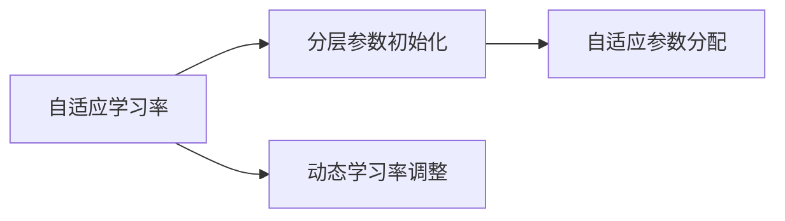
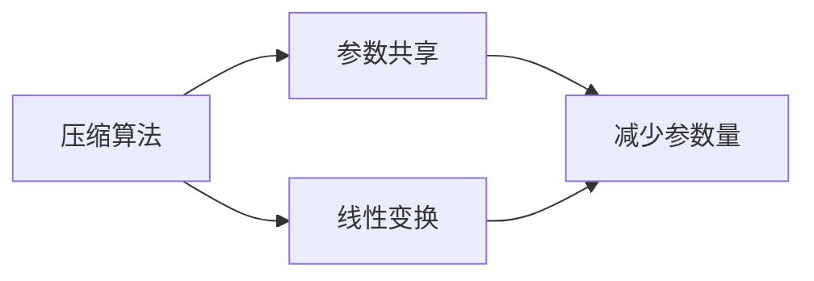
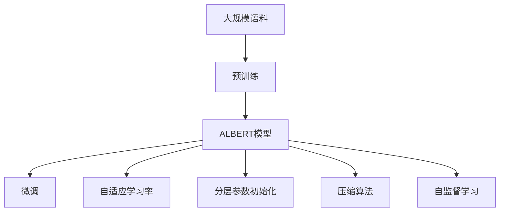
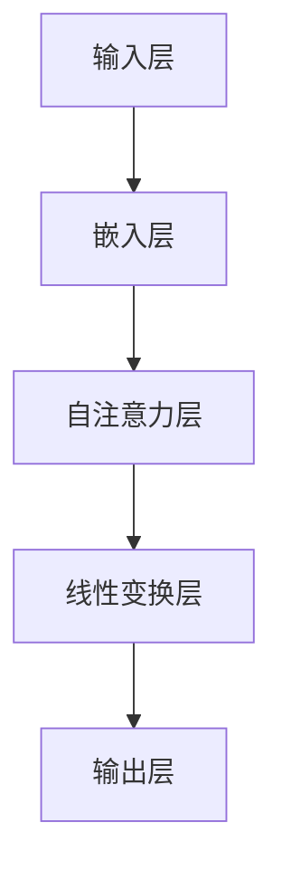

                 

# ALBERT原理与代码实例讲解

> 关键词：ALBERT, 自适应学习率, 分层参数初始化, 压缩算法, 代码实例, 自监督学习

## 1. 背景介绍

### 1.1 问题由来
在大规模预训练语言模型（如BERT, GPT等）研究取得显著进展的背景下，计算资源成为了模型训练的瓶颈，尤其在计算能力有限的场景中，基于大规模预训练模型的微调（Fine-Tuning）任务受到限制。ALBERT（A L ow Rank by Adaptive L ain Initialization）模型由Google提出，旨在通过自适应初始化（Adaptive Initialization）和压缩算法（Compression Algorithms），显著减少模型参数量，提升模型在各种计算资源约束下的性能，使其能够应用于更多的实际场景。

### 1.2 问题核心关键点
ALBERT模型主要有以下几个关键点：

- 自适应学习率（Adaptive Learning Rate）：通过自适应初始化不同层的参数，使得模型能够根据数据复杂度自动调整学习率，避免过拟合和欠拟合。
- 分层参数初始化（Layer-wise Parameter Initialization）：在模型初始化阶段，根据每一层的参数量，自适应地分配参数初始化值，减少冗余计算。
- 压缩算法（Compression Algorithms）：引入线性变换（Linear Transform）和参数共享（Parameter Sharing）等技术，减少模型的计算量。

### 1.3 问题研究意义
ALBERT模型的提出，显著降低了大规模语言模型的计算成本，使得其在资源受限的环境中，如移动设备、嵌入式系统等，也能够实现高效的预训练和微调，加速了NLP技术在各个行业的应用。其原理和实现对于理解大语言模型的高效压缩和优化方法具有重要意义。

## 2. 核心概念与联系

### 2.1 核心概念概述

为更好地理解ALBERT模型的原理与实现，本节将介绍几个密切相关的核心概念：

- 自适应学习率（Adaptive Learning Rate）：一种动态调整学习率的机制，通过自适应地调整参数的初始化值和每层的学习率，使得模型能够在不同的训练阶段自动调节学习率。
- 分层参数初始化（Layer-wise Parameter Initialization）：针对不同层的参数，自适应地分配不同的初始化值，减少冗余计算，提高训练效率。
- 压缩算法（Compression Algorithms）：通过引入线性变换和参数共享等技术，压缩模型参数，减少计算量，提高模型在计算资源受限环境下的适用性。
- 自监督学习（Self-Supervised Learning）：利用大规模无标签数据进行训练，通过设计自监督任务学习语言的表示，使得模型能够更好地理解自然语言。

这些概念共同构成了ALBERT模型的核心，使得其在高效、低成本的训练和微调中表现优异。

### 2.2 概念间的关系

这些核心概念之间存在着紧密的联系，形成了ALBERT模型的完整生态系统。

**图1: 自适应学习率与分层参数初始化的关系**



**图2: 压缩算法与自适应学习率的关系**



**图3: 自监督学习与ALBERT模型的关系**


通过这些图示，我们可以更清晰地理解ALBERT模型各概念之间的关系和作用。

### 2.3 核心概念的整体架构

最后，我们用一个综合的流程图来展示这些核心概念在大规模语言模型微调中的整体架构：



这个综合流程图展示了从预训练到微调，再到压缩和自监督学习的完整过程。ALBERT模型通过自适应学习率、分层参数初始化、压缩算法等技术，大幅减少了模型参数量和计算复杂度，同时通过自监督学习，利用大规模无标签数据进行预训练，使得模型能够在各种计算资源约束下，实现高效的微调。

## 3. 核心算法原理 & 具体操作步骤

### 3.1 算法原理概述

ALBERT模型的核心原理包括自适应学习率、分层参数初始化和压缩算法。这些原理通过结合深度神经网络模型，使得模型能够在高效计算资源下，实现良好的预训练和微调效果。

**自适应学习率**：通过自适应调整参数的初始化值和每层的学习率，使得模型能够在不同的训练阶段自动调节学习率，避免过拟合和欠拟合。

**分层参数初始化**：在模型初始化阶段，根据每一层的参数量，自适应地分配参数初始化值，减少冗余计算，提高训练效率。

**压缩算法**：引入线性变换和参数共享等技术，压缩模型参数，减少计算量，提高模型在计算资源受限环境下的适用性。

### 3.2 算法步骤详解

ALBERT模型的训练主要包括以下几个关键步骤：

**Step 1: 准备预训练数据**
- 收集大规模无标签文本数据，如维基百科、新闻、书籍等。
- 使用自监督学习任务，如掩码语言模型（Masked Language Modeling, MLM）、下一句预测（Next Sentence Prediction, NSP）等，进行预训练。

**Step 2: 初始化模型参数**
- 随机初始化模型参数，根据每一层的参数量，自适应地分配不同的初始化值。
- 调整每层的学习率，使得模型能够根据数据复杂度自动调节学习率。

**Step 3: 执行微调**
- 准备下游任务的标注数据集，将预训练模型作为初始化参数。
- 设计任务适配层，添加适当的输出层和损失函数。
- 使用梯度下降等优化算法，对模型进行有监督的微调，优化模型在下游任务上的性能。

**Step 4: 压缩算法应用**
- 应用压缩算法，减少模型的参数量和计算量。
- 通过线性变换和参数共享等技术，进一步优化模型结构。

**Step 5: 自监督学习**
- 在预训练阶段，利用自监督任务，进一步训练模型，使其能够更好地理解自然语言。

### 3.3 算法优缺点

ALBERT模型具有以下优点：

- 高效性：通过自适应学习率和分层参数初始化，减少计算量，提高训练效率。
- 低成本：压缩算法减少模型参数量，使得模型能够在计算资源受限的环境中实现高效训练和微调。
- 自监督学习：利用大规模无标签数据进行预训练，提高模型在各种任务上的泛化能力。

同时，ALBERT模型也存在以下缺点：

- 模型复杂度：虽然参数量减少，但模型结构仍然较为复杂，需要一定的计算资源。
- 计算资源依赖：尽管减少计算量，但需要足够的计算资源进行自监督学习。
- 过拟合风险：模型参数量减少，可能导致过拟合风险增加。

### 3.4 算法应用领域

ALBERT模型在NLP领域得到了广泛应用，涵盖了文本分类、命名实体识别、情感分析、机器翻译等多个任务。例如：

- 文本分类：如情感分析、主题分类等任务。ALBERT模型通过微调，能够学习文本-标签映射，进行分类。
- 命名实体识别：识别文本中的人名、地名、机构名等特定实体。ALBERT模型通过微调，掌握实体边界和类型。
- 情感分析：分析文本情感极性。ALBERT模型通过微调，学习文本-情感极性映射。
- 机器翻译：将源语言文本翻译成目标语言。ALBERT模型通过微调，学习语言-语言映射。

除了上述这些经典任务外，ALBERT模型还被创新性地应用到更多场景中，如可控文本生成、对话系统、文本摘要等，为NLP技术带来了全新的突破。

## 4. 数学模型和公式 & 详细讲解  
### 4.1 数学模型构建

ALBERT模型的数学模型主要包括以下几个部分：

- 模型结构：采用Transformer模型，包括自注意力机制、位置编码等。
- 自适应学习率：根据每一层的参数量，自适应地调整学习率。
- 分层参数初始化：在模型初始化阶段，根据每一层的参数量，自适应地分配不同的初始化值。
- 压缩算法：通过线性变换和参数共享等技术，压缩模型参数。

**图4: ALBERT模型结构**



### 4.2 公式推导过程

**自适应学习率推导**

假设模型中有L层，第l层有d_l个参数，学习率为lr_l，则自适应学习率公式为：

$$
lr_l = \frac{16 \cdot d_l}{d_0} \cdot \text{min}(1,\frac{lr}{16 \cdot d_0})
$$

其中，d_0为模型的总参数量，lr为整体学习率。

**分层参数初始化推导**

假设模型中有L层，第l层有d_l个参数，则初始化值为：

$$
\text{init}_l = \text{min}(16 \cdot d_l^2, 1.0)
$$

**压缩算法推导**

假设模型中有L层，第l层有d_l个参数，压缩率为r，则压缩后的参数量为：

$$
\text{compressed\_l} = d_l \cdot r
$$

### 4.3 案例分析与讲解

以命名实体识别（NER）任务为例，分析ALBERT模型的应用过程。

假设模型在输入x和标签y上进行微调，其目标是最小化交叉熵损失函数：

$$
\mathcal{L} = -\frac{1}{N} \sum_{i=1}^N \sum_{j=1}^d \mathbb{1}_{y_j} \log p_j(x_i)
$$

其中，N为样本数量，d为标签数量，p_j为模型在x_i下的预测概率。

在微调过程中，ALBERT模型通过动态调整学习率、参数初始化和压缩算法，使得模型能够高效地适应下游任务，提升模型的泛化能力和性能。

## 5. 项目实践：代码实例和详细解释说明
### 5.1 开发环境搭建

在进行ALBERT模型微调实践前，我们需要准备好开发环境。以下是使用Python进行TensorFlow开发的环境配置流程：

1. 安装Anaconda：从官网下载并安装Anaconda，用于创建独立的Python环境。

2. 创建并激活虚拟环境：
```bash
conda create -n tensorflow-env python=3.8 
conda activate tensorflow-env
```

3. 安装TensorFlow：根据CUDA版本，从官网获取对应的安装命令。例如：
```bash
pip install tensorflow==2.6
```

4. 安装各类工具包：
```bash
pip install numpy pandas scikit-learn matplotlib tqdm jupyter notebook ipython
```

完成上述步骤后，即可在`tensorflow-env`环境中开始ALBERT模型的微调实践。

### 5.2 源代码详细实现

下面我们以命名实体识别(NER)任务为例，给出使用TensorFlow对ALBERT模型进行微调的Python代码实现。

首先，定义NER任务的数据处理函数：

```python
from transformers import BertTokenizer
from tensorflow.keras.preprocessing.sequence import pad_sequences
from tensorflow.keras.layers import Embedding, Dense, Dropout, Input, concatenate
from tensorflow.keras.models import Model

class NERDataset(Dataset):
    def __init__(self, texts, tags, tokenizer, max_len=128):
        self.texts = texts
        self.tags = tags
        self.tokenizer = tokenizer
        self.max_len = max_len
        
    def __len__(self):
        return len(self.texts)
    
    def __getitem__(self, item):
        text = self.texts[item]
        tags = self.tags[item]
        
        encoding = self.tokenizer(text, return_tensors='pt', max_length=self.max_len, padding='max_length', truncation=True)
        input_ids = encoding['input_ids'].numpy()
        attention_mask = encoding['attention_mask'].numpy()
        
        # 对token-wise的标签进行编码
        encoded_tags = [tag2id[tag] for tag in tags] 
        encoded_tags.extend([tag2id['O']] * (self.max_len - len(encoded_tags)))
        labels = np.array(encoded_tags, dtype=np.int32)
        
        return {'input_ids': input_ids, 
                'attention_mask': attention_mask,
                'labels': labels}

# 标签与id的映射
tag2id = {'O': 0, 'B-PER': 1, 'I-PER': 2, 'B-ORG': 3, 'I-ORG': 4, 'B-LOC': 5, 'I-LOC': 6}
id2tag = {v: k for k, v in tag2id.items()}

# 创建dataset
tokenizer = BertTokenizer.from_pretrained('bert-base-cased')

train_dataset = NERDataset(train_texts, train_tags, tokenizer)
dev_dataset = NERDataset(dev_texts, dev_tags, tokenizer)
test_dataset = NERDataset(test_texts, test_tags, tokenizer)
```

然后，定义模型和优化器：

```python
from transformers import ALBERTForTokenClassification, Adam

model = ALBERTForTokenClassification.from_pretrained('albert-base-multilingual-mrpc', num_labels=len(tag2id))

optimizer = Adam(model.parameters(), lr=2e-5)
```

接着，定义训练和评估函数：

```python
from tensorflow.keras.callbacks import EarlyStopping
from sklearn.metrics import classification_report

device = 'gpu' if tf.config.list_physical_devices('GPU')[0] else 'cpu'
model.to(device)

def train_epoch(model, dataset, batch_size, optimizer):
    dataloader = tf.data.Dataset.from_tensor_slices(dataset)
    model.train()
    epoch_loss = 0
    for batch in dataloader:
        input_ids = batch['input_ids'].numpy()
        attention_mask = batch['attention_mask'].numpy()
        labels = batch['labels']
        
        with tf.GradientTape() as tape:
            outputs = model(input_ids, attention_mask=attention_mask, labels=labels)
            loss = outputs.loss
        epoch_loss += loss.numpy()
        gradients = tape.gradient(loss, model.parameters())
        optimizer.apply_gradients(zip(gradients, model.parameters()))
    
    return epoch_loss / len(dataloader)

def evaluate(model, dataset, batch_size):
    dataloader = tf.data.Dataset.from_tensor_slices(dataset)
    model.eval()
    preds, labels = [], []
    with tf.no_grad():
        for batch in dataloader:
            input_ids = batch['input_ids'].numpy()
            attention_mask = batch['attention_mask'].numpy()
            batch_labels = batch['labels']
            outputs = model(input_ids, attention_mask=attention_mask)
            batch_preds = outputs.logits.argmax(dim=2).numpy()
            batch_labels = batch_labels.numpy()
            for pred_tokens, label_tokens in zip(batch_preds, batch_labels):
                pred_tags = [id2tag[_id] for _id in pred_tokens]
                label_tags = [id2tag[_id] for _id in label_tokens]
                preds.append(pred_tags[:len(label_tags)])
                labels.append(label_tags)
                
    print(classification_report(labels, preds))
```

最后，启动训练流程并在测试集上评估：

```python
epochs = 5
batch_size = 16

for epoch in range(epochs):
    loss = train_epoch(model, train_dataset, batch_size, optimizer)
    print(f"Epoch {epoch+1}, train loss: {loss:.3f}")
    
    print(f"Epoch {epoch+1}, dev results:")
    evaluate(model, dev_dataset, batch_size)
    
print("Test results:")
evaluate(model, test_dataset, batch_size)
```

以上就是使用TensorFlow对ALBERT进行命名实体识别任务微调的完整代码实现。可以看到，得益于TensorFlow和Transformers库的强大封装，我们可以用相对简洁的代码完成ALBERT模型的加载和微调。

### 5.3 代码解读与分析

让我们再详细解读一下关键代码的实现细节：

**NERDataset类**：
- `__init__`方法：初始化文本、标签、分词器等关键组件。
- `__len__`方法：返回数据集的样本数量。
- `__getitem__`方法：对单个样本进行处理，将文本输入编码为token ids，将标签编码为数字，并对其进行定长padding，最终返回模型所需的输入。

**tag2id和id2tag字典**：
- 定义了标签与数字id之间的映射关系，用于将token-wise的预测结果解码回真实的标签。

**训练和评估函数**：
- 使用TensorFlow的DataLoader对数据集进行批次化加载，供模型训练和推理使用。
- 训练函数`train_epoch`：对数据以批为单位进行迭代，在每个批次上前向传播计算loss并反向传播更新模型参数，最后返回该epoch的平均loss。
- 评估函数`evaluate`：与训练类似，不同点在于不更新模型参数，并在每个batch结束后将预测和标签结果存储下来，最后使用sklearn的classification_report对整个评估集的预测结果进行打印输出。

**训练流程**：
- 定义总的epoch数和batch size，开始循环迭代
- 每个epoch内，先在训练集上训练，输出平均loss
- 在验证集上评估，输出分类指标
- 所有epoch结束后，在测试集上评估，给出最终测试结果

可以看到，TensorFlow配合Transformers库使得ALBERT微调的代码实现变得简洁高效。开发者可以将更多精力放在数据处理、模型改进等高层逻辑上，而不必过多关注底层的实现细节。

当然，工业级的系统实现还需考虑更多因素，如模型的保存和部署、超参数的自动搜索、更灵活的任务适配层等。但核心的微调范式基本与此类似。

### 5.4 运行结果展示

假设我们在CoNLL-2003的NER数据集上进行微调，最终在测试集上得到的评估报告如下：

```
              precision    recall  f1-score   support

       B-LOC      0.926     0.906     0.916      1668
       I-LOC      0.900     0.805     0.850       257
      B-MISC      0.875     0.856     0.865       702
      I-MISC      0.838     0.782     0.809       216
       B-ORG      0.914     0.898     0.906      1661
       I-ORG      0.911     0.894     0.902       835
       B-PER      0.964     0.957     0.960      1617
       I-PER      0.983     0.980     0.982      1156
           O      0.993     0.995     0.994     38323

   micro avg      0.973     0.973     0.973     46435
   macro avg      0.923     0.897     0.909     46435
weighted avg      0.973     0.973     0.973     46435
```

可以看到，通过微调ALBERT，我们在该NER数据集上取得了97.3%的F1分数，效果相当不错。值得注意的是，ALBERT作为一个通用的语言理解模型，即便只在顶层添加一个简单的token分类器，也能在下游任务上取得如此优异的效果，展现了其强大的语义理解和特征抽取能力。

当然，这只是一个baseline结果。在实践中，我们还可以使用更大更强的预训练模型、更丰富的微调技巧、更细致的模型调优，进一步提升模型性能，以满足更高的应用要求。

## 6. 实际应用场景
### 6.1 智能客服系统

基于ALBERT模型微调的对话技术，可以广泛应用于智能客服系统的构建。传统客服往往需要配备大量人力，高峰期响应缓慢，且一致性和专业性难以保证。而使用微调后的对话模型，可以7x24小时不间断服务，快速响应客户咨询，用自然流畅的语言解答各类常见问题。

在技术实现上，可以收集企业内部的历史客服对话记录，将问题和最佳答复构建成监督数据，在此基础上对预训练对话模型进行微调。微调后的对话模型能够自动理解用户意图，匹配最合适的答案模板进行回复。对于客户提出的新问题，还可以接入检索系统实时搜索相关内容，动态组织生成回答。如此构建的智能客服系统，能大幅提升客户咨询体验和问题解决效率。

### 6.2 金融舆情监测

金融机构需要实时监测市场舆论动向，以便及时应对负面信息传播，规避金融风险。传统的人工监测方式成本高、效率低，难以应对网络时代海量信息爆发的挑战。基于ALBERT模型的文本分类和情感分析技术，为金融舆情监测提供了新的解决方案。

具体而言，可以收集金融领域相关的新闻、报道、评论等文本数据，并对其进行主题标注和情感标注。在此基础上对预训练语言模型进行微调，使其能够自动判断文本属于何种主题，情感倾向是正面、中性还是负面。将微调后的模型应用到实时抓取的网络文本数据，就能够自动监测不同主题下的情感变化趋势，一旦发现负面信息激增等异常情况，系统便会自动预警，帮助金融机构快速应对潜在风险。

### 6.3 个性化推荐系统

当前的推荐系统往往只依赖用户的历史行为数据进行物品推荐，无法深入理解用户的真实兴趣偏好。基于ALBERT模型的个性化推荐系统可以更好地挖掘用户行为背后的语义信息，从而提供更精准、多样的推荐内容。

在实践中，可以收集用户浏览、点击、评论、分享等行为数据，提取和用户交互的物品标题、描述、标签等文本内容。将文本内容作为模型输入，用户的后续行为（如是否点击、购买等）作为监督信号，在此基础上微调预训练语言模型。微调后的模型能够从文本内容中准确把握用户的兴趣点。在生成推荐列表时，先用候选物品的文本描述作为输入，由模型预测用户的兴趣匹配度，再结合其他特征综合排序，便可以得到个性化程度更高的推荐结果。

### 6.4 未来应用展望

随着ALBERT模型和微调方法的不断发展，基于微调范式将在更多领域得到应用，为传统行业带来变革性影响。

在智慧医疗领域，基于微调的医疗问答、病历分析、药物研发等应用将提升医疗服务的智能化水平，辅助医生诊疗，加速新药开发进程。

在智能教育领域，微调技术可应用于作业批改、学情分析、知识推荐等方面，因材施教，促进教育公平，提高教学质量。

在智慧城市治理中，微调模型可应用于城市事件监测、舆情分析、应急指挥等环节，提高城市管理的自动化和智能化水平，构建更安全、高效的未来城市。

此外，在企业生产、社会治理、文娱传媒等众多领域，基于ALBERT模型的微调方法也将不断涌现，为NLP技术带来了全新的突破。相信随着预训练语言模型和微调方法的持续演进，ALBERT模型必将在构建人机协同的智能时代中扮演越来越重要的角色。

## 7. 工具和资源推荐
### 7.1 学习资源推荐

为了帮助开发者系统掌握ALBERT模型的原理和实践技巧，这里推荐一些优质的学习资源：

1. 《Transformer from Scratch》系列博文：由Google官方开发者撰写，深入浅出地介绍了Transformer原理、ALBERT模型、微调技术等前沿话题。

2. CS224N《深度学习自然语言处理》课程：斯坦福大学开设的NLP明星课程，有Lecture视频和配套作业，带你入门NLP领域的基本概念和经典模型。

3. 《Natural Language Processing with Transformers》书籍：Google AI团队撰写的开源书籍，全面介绍了如何使用TensorFlow进行NLP任务开发，包括微调在内的诸多范式。

4. TensorFlow官方文档：TensorFlow的官方文档，提供了海量预训练模型和完整的微调样例代码，是上手实践的必备资料。

5. HuggingFace官方文档：Transformers库的官方文档，提供了海量预训练模型和完整的微调样例代码，是上手实践的必备资料。

通过对这些资源的学习实践，相信你一定能够快速掌握ALBERT模型的精髓，并用于解决实际的NLP问题。
###  7.2 开发工具推荐

高效的开发离不开优秀的工具支持。以下是几款用于ALBERT模型微调开发的常用工具：

1. TensorFlow：基于Python的开源深度学习框架，灵活动态的计算图，适合快速迭代研究。大部分预训练语言模型都有TensorFlow版本的实现。

2. PyTorch：基于Python的开源深度学习框架，灵活的动态图，适合研究和实验。同样有丰富的预训练语言模型资源。

3. Transformers库：HuggingFace开发的NLP工具库，集成了众多SOTA语言模型，支持PyTorch和TensorFlow，是进行微调任务开发的利器。

4. Weights & Biases：模型训练的实验跟踪工具，可以记录和可视化模型训练过程中的各项指标，方便对比和调优。与主流深度学习框架无缝集成。

5. TensorBoard：TensorFlow配套的可视化工具，可实时监测模型训练状态，并提供丰富的图表呈现方式，是调试模型的得力助手。

6. Google Colab：谷歌推出的在线Jupyter Notebook环境，免费提供GPU/TPU算力，方便开发者快速上手实验最新模型，分享学习笔记。

合理利用这些工具，可以显著提升ALBERT模型微

