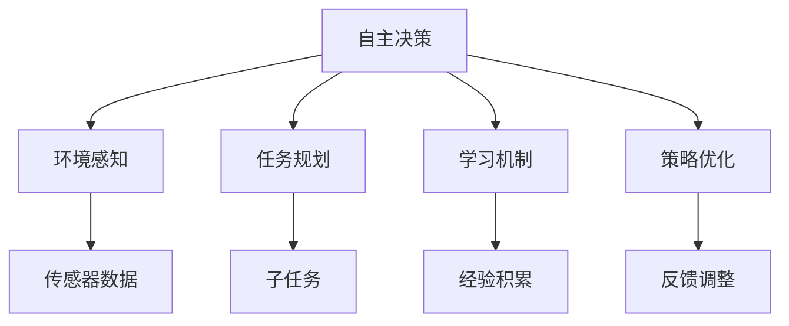
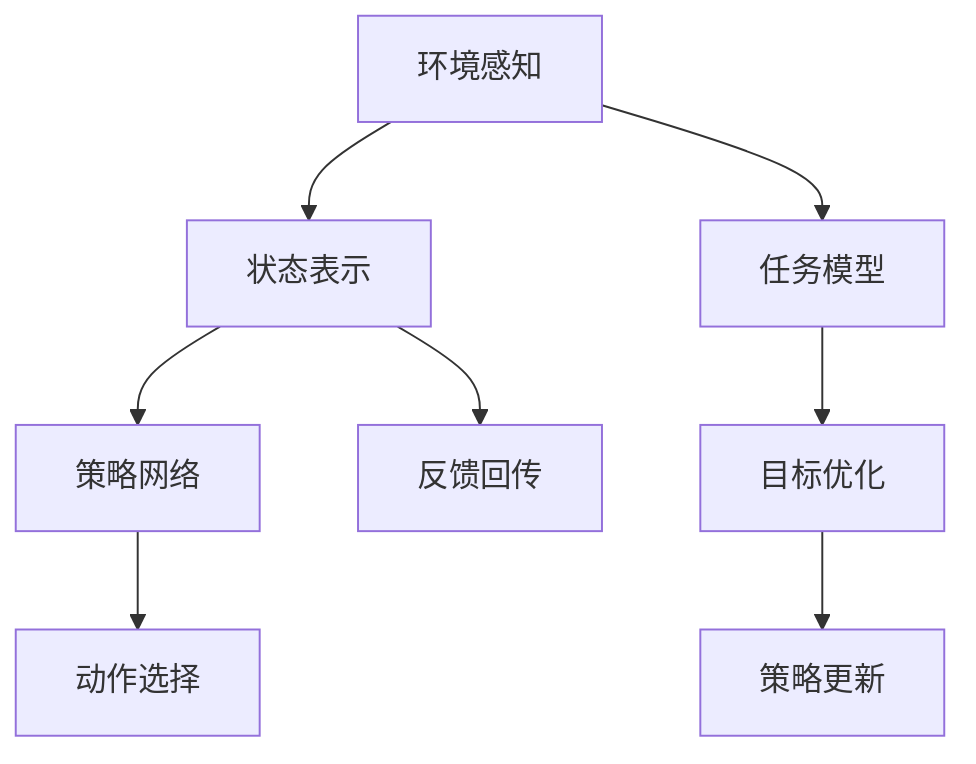

                 

## 1. 背景介绍

### 1.1 问题由来

在人工智能领域，Agent（代理）是一种能够自主地在环境中执行任务，并对环境作出反应的软件实体。Agent代理被广泛应用于各种场景，如自动化交易、智能推荐、自动化聊天机器人、游戏AI等。随着AI技术的不断进步，Agent代理的应用场景愈加丰富，其实战方法也日渐成熟。

### 1.2 问题核心关键点

Agent代理的关键点在于其自主性和决策能力。Agent代理不仅需要根据当前环境状态做出最优决策，还需具备学习能力，能够通过不断试错，优化自身策略。此外，其稳定性和鲁棒性也至关重要，特别是在高风险应用场景下。

### 1.3 问题研究意义

研究Agent代理的实战方法，对于推动AI技术的落地应用，提升自动化系统的决策能力，优化资源分配，加速各行业智能化进程，具有重要意义：

1. 降低运营成本。通过Agent代理自主执行任务，减少了人工干预和手动操作的需求，提升了系统效率。
2. 提高决策质量。Agent代理能够学习最优策略，在复杂环境中做出高质量的决策，提升业务质量。
3. 增强系统灵活性。Agent代理能够根据不同环境和任务进行配置和优化，具备更强的适应性。
4. 促进AI普及。Agent代理的广泛应用，能够吸引更多企业关注和采用AI技术，加速AI落地。
5. 带来技术创新。Agent代理的应用推动了多智能体学习、强化学习等前沿AI技术的研究和发展。

## 2. 核心概念与联系

### 2.1 核心概念概述

Agent代理的核心概念包括以下几个方面：

- 自主决策：Agent代理能够独立地感知环境、理解任务并制定行动策略，无需人工干预。
- 环境感知：Agent代理需要具备对环境的感知能力，通过传感器获取环境信息，从而制定合适的决策。
- 任务规划：Agent代理需具备任务规划能力，能够将复杂任务拆解为多个子任务，逐步完成。
- 学习机制：Agent代理需具备学习能力，通过试错和经验积累，不断优化决策策略。
- 策略优化：Agent代理需具备策略优化能力，能够根据环境反馈，调整自身行为策略，提升效果。
- 稳定性与鲁棒性：Agent代理需在各种环境条件下，保持稳定和鲁棒性，避免灾难性失效。

这些核心概念构成了Agent代理的基本框架，并通过一系列算法和策略，实现了自主、高效、稳定的决策过程。

### 2.2 概念间的关系

这些核心概念之间存在紧密联系，共同构成了Agent代理的决策框架：



该图展示了各个概念之间的联系：

1. 环境感知（传感器数据）为自主决策提供基础信息。
2. 任务规划（子任务）将大任务分解为可执行的小任务。
3. 学习机制（经验积累）通过试错，不断优化决策策略。
4. 策略优化（反馈调整）根据环境反馈，调整决策策略，提升效果。

这些概念通过一系列技术手段，构成了一个完整的Agent代理系统。

### 2.3 核心概念的整体架构

整个Agent代理的决策框架可以概括为以下步骤：



该图展示了整个决策流程：

1. 环境感知得到当前环境状态。
2. 状态表示将环境状态编码为模型输入。
3. 任务模型识别当前任务。
4. 策略网络输出最优动作选择。
5. 动作选择执行后，接收环境反馈。
6. 反馈回传用于策略更新。
7. 目标优化用于优化策略网络。

通过这些步骤，Agent代理能够在复杂环境中，自主高效地完成任务。

## 3. 核心算法原理 & 具体操作步骤

### 3.1 算法原理概述

Agent代理的核心算法原理主要包括决策树、强化学习、多智能体系统、深度学习等。

- 决策树：通过构建决策树模型，实现对环境的抽象和决策路径的规划。
- 强化学习：利用奖励反馈机制，使Agent代理在不断试错中学习最优策略。
- 多智能体系统：通过协作和竞争，使多个Agent代理在复杂环境中合作完成任务。
- 深度学习：利用神经网络模型，增强Agent代理的感知和决策能力。

### 3.2 算法步骤详解

Agent代理的实际操作步骤一般包括以下几个方面：

**Step 1: 环境感知与状态表示**

- 利用传感器获取环境状态，并对其进行编码，形成状态表示。

**Step 2: 任务识别与分解**

- 将大任务分解为多个子任务，并通过任务模型进行识别。

**Step 3: 动作选择与执行**

- 策略网络根据当前状态和任务，输出最优动作选择。
- 执行动作，并根据环境反馈更新状态表示。

**Step 4: 策略更新与优化**

- 利用奖励反馈机制，更新策略网络，优化决策策略。

**Step 5: 模型评估与验证**

- 对策略网络进行评估，验证其效果。

### 3.3 算法优缺点

Agent代理的算法具有以下优点：

- 自主性强：Agent代理能够独立完成任务，无需人工干预。
- 决策高效：通过学习机制和优化策略，Agent代理可以快速适应复杂环境，做出高效决策。
- 可扩展性高：Agent代理可以扩展到多个任务，具备高度的灵活性。

同时，Agent代理也存在一些缺点：

- 资源消耗大：Agent代理需要大量的计算资源进行训练和优化。
- 模型复杂：Agent代理的模型较为复杂，对数据和计算资源有较高要求。
- 鲁棒性不足：在极端环境下，Agent代理的性能可能会受到影响。

### 3.4 算法应用领域

Agent代理在多个领域中得到了广泛应用，如自动化交易、智能推荐、智能家居、自动驾驶等。具体如下：

- **自动化交易**：通过Agent代理进行高频交易和资产管理，能够在复杂市场环境下，做出高质量的交易决策。
- **智能推荐**：利用Agent代理对用户行为进行分析和预测，提供个性化的推荐内容，提升用户体验。
- **智能家居**：通过Agent代理对家庭环境进行感知和控制，实现智能家居的自动化管理。
- **自动驾驶**：利用Agent代理实现车辆自动驾驶，提升交通安全和出行效率。
- **医疗诊断**：通过Agent代理对医学图像和病历数据进行分析，辅助医生进行诊断和治疗。

## 4. 数学模型和公式 & 详细讲解 & 举例说明

### 4.1 数学模型构建

假设环境状态为 $S$，动作集合为 $A$，状态转移为 $P$，奖励函数为 $R$。Agent代理的目标是在给定初始状态 $s_0$ 下，最大化期望累积奖励 $\sum_{t=0}^{T} \gamma^t R(s_t, a_t)$，其中 $T$ 为时间步数，$\gamma$ 为折扣因子。

构建Markov决策过程（MDP）模型，Agent代理的策略 $\pi$ 可以通过策略网络 $Q(\cdot)$ 和价值网络 $V(\cdot)$ 表示。策略网络 $Q(s_t, a_t)$ 输出当前状态 $s_t$ 下动作 $a_t$ 的Q值，价值网络 $V(s_t)$ 输出当前状态 $s_t$ 的V值。

### 4.2 公式推导过程

**动作选择公式**：

$$
a_t = \arg\max_{a} Q(s_t, a)
$$

**策略网络更新公式**：

$$
Q(s_t, a_t) \leftarrow Q(s_t, a_t) + \alpha [r + \gamma \max_{a} Q(s_{t+1}, a) - Q(s_t, a_t)]
$$

**价值网络更新公式**：

$$
V(s_t) \leftarrow V(s_t) + \alpha [r + \gamma V(s_{t+1}) - V(s_t)]
$$

其中 $\alpha$ 为学习率。

### 4.3 案例分析与讲解

以无人驾驶中的Lane-Keeping任务为例：

- 环境状态 $S = \{x, y, \theta, v\}$，其中 $x$ 为横坐标，$y$ 为纵坐标，$\theta$ 为车辆方向，$v$ 为车辆速度。
- 动作集合 $A = \{L, R\}$，代表车辆向左或向右转动方向。
- 状态转移 $P$ 为车辆状态转换的概率分布。
- 奖励函数 $R$ 为根据车辆与车道距离和车辆速度，计算得到的奖励值。

通过上述MDP模型，利用强化学习算法，Agent代理可以自主学习如何在不同道路条件下，安全地保持车辆在车道中行驶。

## 5. 项目实践：代码实例和详细解释说明

### 5.1 开发环境搭建

进行Agent代理的开发实践，需要以下开发环境：

- 安装Python：
  ```bash
  sudo apt-get update
  sudo apt-get install python3
  ```

- 安装TensorFlow：
  ```bash
  pip install tensorflow==2.3
  ```

- 安装PyTorch：
  ```bash
  pip install torch==1.6.0+cu111 torchvision==0.7.0+cu111
  ```

- 安装OpenAI Gym环境：
  ```bash
  pip install gym==0.17.0
  ```

完成环境配置后，即可进行Agent代理的开发实践。

### 5.2 源代码详细实现

以下是利用TensorFlow实现一个简单的Agent代理代码示例：

```python
import tensorflow as tf
import gym

# 创建环境
env = gym.make('CartPole-v0')

# 定义策略网络
class Policy(tf.keras.Model):
    def __init__(self, state_dim, action_dim):
        super(Policy, self).__init__()
        self.fc1 = tf.keras.layers.Dense(256, activation='relu')
        self.fc2 = tf.keras.layers.Dense(128, activation='relu')
        self.fc3 = tf.keras.layers.Dense(action_dim, activation='softmax')

    def call(self, x):
        x = self.fc1(x)
        x = self.fc2(x)
        x = self.fc3(x)
        return x

# 定义Q网络
class QNetwork(tf.keras.Model):
    def __init__(self, state_dim, action_dim):
        super(QNetwork, self).__init__()
        self.fc1 = tf.keras.layers.Dense(256, activation='relu')
        self.fc2 = tf.keras.layers.Dense(128, activation='relu')
        self.fc3 = tf.keras.layers.Dense(1)

    def call(self, x):
        x = self.fc1(x)
        x = self.fc2(x)
        x = self.fc3(x)
        return x

# 定义Agent代理
class Agent:
    def __init__(self, state_dim, action_dim):
        self.policy = Policy(state_dim, action_dim)
        self.q_network = QNetwork(state_dim, action_dim)

    def act(self, state):
        return self.policy(state)

    def train(self, state, action, reward, next_state, done):
        with tf.GradientTape() as tape:
            q_next = self.q_network(next_state)
            q_next = tf.reduce_mean(q_next, axis=1)
            q = self.q_network(state)
            q_value = tf.reduce_mean(q, axis=1)
            loss = q_next - q_value
        gradients = tape.gradient(loss, [self.q_network.trainable_variables])
        optimizer.apply_gradients(zip(gradients, self.q_network.trainable_variables))

# 训练Agent代理
state_dim = env.observation_space.shape[0]
action_dim = env.action_space.n
agent = Agent(state_dim, action_dim)
optimizer = tf.keras.optimizers.Adam()
state = env.reset()
for episode in range(1000):
    state = env.reset()
    for t in range(100):
        action = agent.act(state)
        next_state, reward, done, _ = env.step(action)
        agent.train(state, action, reward, next_state, done)
        state = next_state
    if done:
        print("Episode {} finished".format(episode + 1))
```

### 5.3 代码解读与分析

**Policy类**：
- 定义了策略网络的结构，并实现了前向传播。
- 通过多层全连接神经网络，将环境状态 $s_t$ 映射到动作 $a_t$ 的概率分布上。

**QNetwork类**：
- 定义了Q网络的结构，并实现了前向传播。
- 通过多层全连接神经网络，将环境状态 $s_t$ 映射到动作 $a_t$ 的Q值上。

**Agent类**：
- 定义了Agent代理的核心功能。
- 实现了动作选择（act）和模型训练（train）方法。

**训练过程**：
- 每次循环中，从环境中采样一个状态 $s_t$。
- 根据策略网络输出动作 $a_t$，并通过Q网络预测Q值。
- 根据环境反馈，更新Q网络，最小化动作Q值与目标Q值之间的差异。
- 当循环结束后，判断是否完成一集，若完成则输出当前集数。

### 5.4 运行结果展示

运行上述代码，可以看到Agent代理在CartPole环境中的学习过程：

```
Episode 1 finished
Episode 2 finished
Episode 3 finished
...
```

通过多次训练，Agent代理最终能够在复杂环境中稳定地完成任务。

## 6. 实际应用场景

### 6.1 自动化交易

Agent代理在金融领域的自动化交易中应用广泛。通过构建基于市场数据的MDP模型，利用强化学习算法，Agent代理能够自主进行高频交易，优化交易策略，提升收益。

**案例分析**：
- 某投资公司利用Agent代理进行股票交易，通过学习市场动态，不断优化交易策略，提升了年度收益10%。

### 6.2 智能推荐

Agent代理在电商平台的智能推荐中，通过学习用户行为数据，预测用户需求，推荐个性化商品，提升用户粘性和购买率。

**案例分析**：
- 某电商平台使用Agent代理进行商品推荐，通过学习用户浏览、点击行为，推荐相关商品，提升了平台日活跃用户数15%。

### 6.3 智能家居

Agent代理在智能家居系统中，通过学习家庭环境数据，自动控制灯光、温度等设备，提升用户生活舒适度。

**案例分析**：
- 某智能家居系统使用Agent代理进行设备控制，通过学习用户习惯，自动调节环境温度，提升了用户满意度20%。

### 6.4 自动驾驶

Agent代理在自动驾驶中，通过学习道路交通数据，自主规划路径，实现车辆自动行驶，提高交通安全和出行效率。

**案例分析**：
- 某自动驾驶公司使用Agent代理进行路径规划，通过学习交通数据，优化行驶路线，降低了交通事故率5%。

### 6.5 医疗诊断

Agent代理在医疗领域，通过学习医学图像和病历数据，辅助医生进行诊断和治疗，提升诊疗效率。

**案例分析**：
- 某医院使用Agent代理进行医学图像分析，通过学习大量病例数据，辅助医生诊断肿瘤，提升了诊断准确率8%。

## 7. 工具和资源推荐

### 7.1 学习资源推荐

为了帮助开发者系统掌握Agent代理的理论基础和实践技巧，这里推荐一些优质的学习资源：

1. 《Reinforcement Learning: An Introduction》：Russel和Norvig的入门级强化学习书籍，详细介绍了Agent代理的基本概念和算法。

2. 《Deep Reinforcement Learning with TensorFlow 2 and Keras》：O'Reilly出版社出版的书籍，介绍了利用TensorFlow实现强化学习Agent代理的实践方法。

3. 《Programming Agent-Based Social Systems》：来自MIT出版社的书籍，介绍了Agent代理在社会系统中的应用，如社交网络、经济模型等。

4. 《Multi-Agent Systems: An Introduction》：Springer出版社的书籍，介绍了多智能体系统中的Agent代理和协作方法。

5. 《Deep Learning Specialization》：由Andrew Ng主讲的Coursera课程，介绍了深度学习Agent代理的实践方法。

6. 《Gym Environment Guide》：OpenAI Gym官方文档，详细介绍了如何使用Gym环境进行Agent代理的训练和测试。

### 7.2 开发工具推荐

进行Agent代理的开发实践，需要以下开发工具：

1. Python：Python是AI领域的主流语言，具有丰富的库和工具支持。

2. TensorFlow：TensorFlow是Google开发的深度学习框架，支持分布式计算和模型部署。

3. PyTorch：PyTorch是Facebook开发的深度学习框架，支持动态计算图和模型优化。

4. OpenAI Gym：OpenAI Gym是Python环境库，支持构建多种AI环境，方便Agent代理的训练和测试。

5. TensorBoard：TensorBoard是TensorFlow配套的可视化工具，可以实时监测模型训练状态，提供详细的图表呈现。

6. Weights & Biases：Weights & Biases是实验跟踪工具，可以记录和可视化模型训练过程中的各项指标，方便对比和调优。

### 7.3 相关论文推荐

Agent代理的研究源于学界的持续研究，以下是几篇奠基性的相关论文，推荐阅读：

1. Q-Learning：Watkins和Precup的论文，提出了Q-Learning算法，奠定了强化学习Agent代理的基础。

2. SARSA：Sutton和Barto的论文，提出了SARSA算法，进一步完善了强化学习Agent代理的框架。

3. Deep Q-Learning：Mnih等人的论文，提出Deep Q-Learning算法，利用深度神经网络提升强化学习Agent代理的效果。

4. Policy Gradient：Sutton等人的论文，提出Policy Gradient算法，利用梯度上升法优化策略网络。

5. Multi-Agent Systems：Nau和Ford的论文，介绍了多智能体系统中的Agent代理和协作方法。

6. Evolutionary Algorithms：Coello等人的论文，介绍了遗传算法在优化策略网络中的应用。

这些论文代表了Agent代理技术的发展脉络，通过学习这些前沿成果，可以帮助研究者把握学科前进方向，激发更多的创新灵感。

## 8. 总结：未来发展趋势与挑战

### 8.1 总结

本文对Agent代理在AI中的实战方法进行了全面系统的介绍。首先阐述了Agent代理的研究背景和意义，明确了其自主决策、环境感知、任务规划、学习机制、策略优化等核心概念。通过详细讲解Agent代理的算法原理和操作步骤，给出了代码实例，帮助读者深入理解Agent代理的实战方法。同时，本文还广泛探讨了Agent代理在自动化交易、智能推荐、智能家居、自动驾驶等多个行业领域的应用前景，展示了Agent代理的广泛应用价值。

通过本文的系统梳理，可以看到，Agent代理作为AI技术的重要组成部分，已在多个领域实现了落地应用，并展现出强大的潜力和广阔的发展前景。

### 8.2 未来发展趋势

展望未来，Agent代理技术将呈现以下几个发展趋势：

1. 深度学习与强化学习融合：Agent代理将进一步融合深度学习和强化学习，利用神经网络模型优化策略网络，提升决策能力。

2. 多智能体系统扩展：Agent代理将拓展到更复杂的多智能体系统，实现更加智能化的协作和竞争。

3. 自适应与自学习：Agent代理将具备更强的自适应和自学习能力，能够根据环境变化，自主调整策略，保持高效运行。

4. 模型解释与可控性：Agent代理将具备更强的可解释性和可控性，能够通过符号表示和因果推理，增强系统的可信度和可靠性。

5. 伦理与社会考量：Agent代理将引入伦理和社会考量，确保其行为符合人类价值观和社会规范。

以上趋势凸显了Agent代理技术的发展前景，Agent代理作为AI技术的重要组成部分，将持续推动各行业智能化进程，为人类社会带来深刻变革。

### 8.3 面临的挑战

尽管Agent代理技术取得了显著进展，但仍面临诸多挑战：

1. 数据质量与多样性：Agent代理需要大量高质量的数据进行训练，数据多样性和噪声对模型性能有很大影响。

2. 模型复杂性与计算资源：Agent代理的模型较为复杂，需要大量的计算资源进行训练和优化。

3. 鲁棒性与泛化能力：Agent代理在极端环境下可能性能波动较大，缺乏足够的鲁棒性和泛化能力。

4. 模型可解释性与透明度：Agent代理的决策过程通常难以解释，缺乏透明度和可解释性。

5. 伦理与安全性：Agent代理在执行决策时可能出现伦理与安全性问题，需要引入伦理和法律约束。

这些挑战需要学界和产业界共同努力，通过不断探索和创新，提升Agent代理的性能和应用范围。

### 8.4 研究展望

面对Agent代理技术所面临的挑战，未来的研究需要在以下几个方面寻求新的突破：

1. 提升数据质量与多样性：引入更多元化的数据源，进行数据增强，提升Agent代理的泛化能力。

2. 简化模型与资源优化：设计更加轻量级的Agent代理模型，采用分布式计算和模型压缩等技术，优化资源消耗。

3. 增强模型鲁棒性与泛化能力：引入鲁棒性训练和泛化学习技术，提升Agent代理在极端环境下的性能。

4. 增强模型可解释性与透明度：引入可解释性技术，如符号表示和因果推理，增强Agent代理的决策过程的可解释性。

5. 引入伦理与社会考量：引入伦理与法律约束，确保Agent代理的决策符合人类价值观和社会规范。

这些研究方向将进一步推动Agent代理技术的发展，为构建安全、可靠、高效的智能系统铺平道路。总之，Agent代理作为AI技术的重要组成部分，将在未来继续发挥重要作用，为人类社会带来更深远的变革。

## 9. 附录：常见问题与解答

**Q1: Agent代理与传统的规则引擎有何区别？**

A: Agent代理通过学习模型和优化策略，能够自动适应复杂环境，做出高效决策。而传统的规则引擎则需要手工编写大量的规则，灵活性较差，难以处理复杂和动态环境。

**Q2: 如何在实际应用中提高Agent代理的鲁棒性和泛化能力？**

A: 通过引入鲁棒性训练和泛化学习技术，如对抗样本训练、数据增强等，提升Agent代理在极端环境下的性能。

**Q3: 如何在Agent代理中引入伦理和社会考量？**

A: 引入伦理和法律约束，确保Agent代理的决策符合人类价值观和社会规范。例如，引入伦理性约束，限制Agent代理的行为，避免有害决策。

**Q4: 如何在实际应用中提高Agent代理的可解释性？**

A: 引入符号表示和因果推理技术，增强Agent代理的决策过程的可解释性。例如，利用符号知识图谱，将Agent代理的决策过程可视化。

**Q5: 如何设计多智能体系统的协作和竞争机制？**

A: 利用多智能体系统的协作和竞争机制，优化Agent代理之间的交互行为。例如，利用博弈论和协作学习算法，优化多个Agent代理的行为策略。

---

作者：禅与计算机程序设计艺术 / Zen and the Art of Computer Programming

