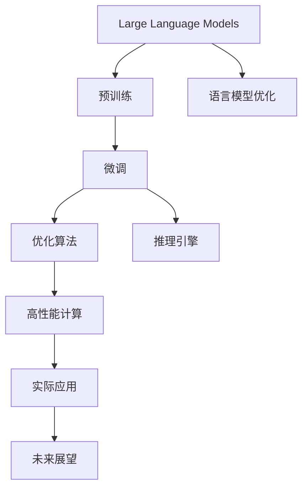
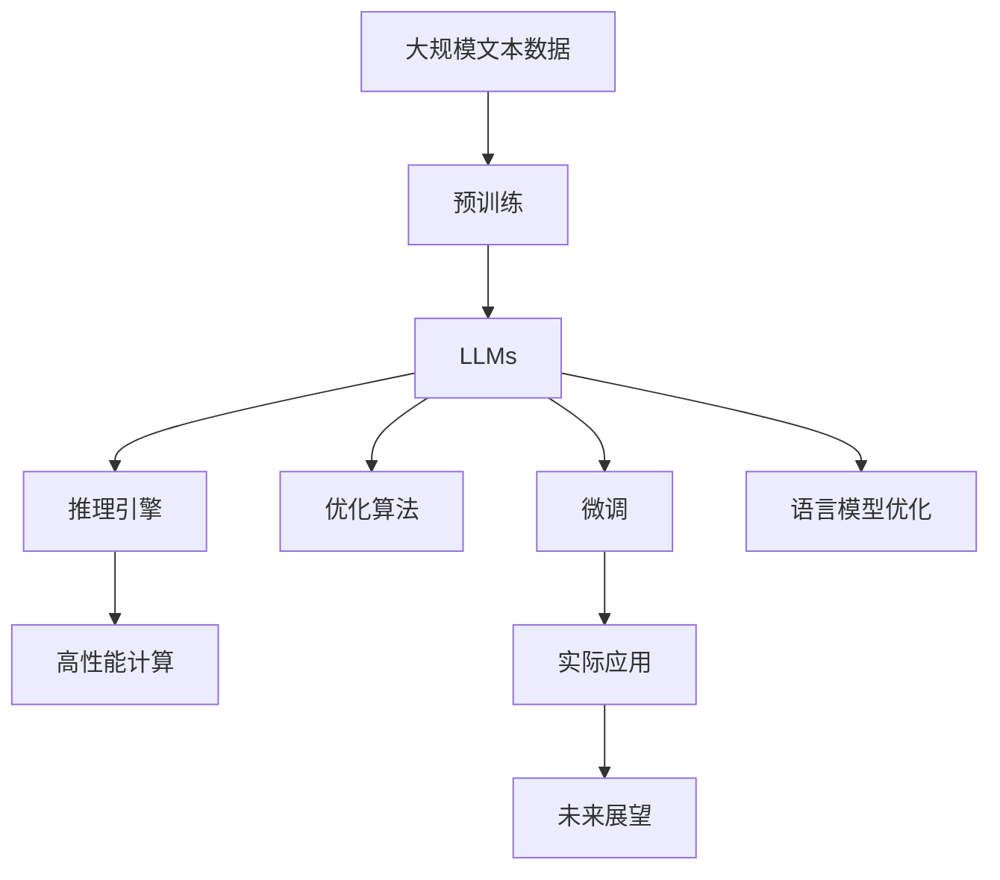

                 

# Andrej Karpathy谈LLM OS

> 关键词：Large Language Models (LLMs), 预训练与微调, 语言模型优化, 优化算法, 推理引擎, 高性能计算, 实际应用, 未来展望

## 1. 背景介绍

Andrej Karpathy是深度学习领域的一位先驱和专家，曾在斯坦福大学和特斯拉工作，并且在处理大规模语言模型(LLMs)方面积累了丰富的经验。在他的新作《Andrej Karpathy谈LLM OS》中，他分享了对LLMs优化的见解和实践中遇到的问题，值得广大深度学习开发者和研究者学习和参考。

## 2. 核心概念与联系

### 2.1 核心概念概述

在《Andrej Karpathy谈LLM OS》中，Karpathy详细探讨了以下核心概念：

- **Large Language Models (LLMs)**: 指基于Transformer架构的深度神经网络模型，通过大规模无标签文本数据进行预训练，然后在特定任务上进行微调，具备强大的语言理解与生成能力。

- **预训练与微调**: 预训练阶段在大规模数据上对模型进行自监督学习，微调阶段则根据特定任务的目标进行有监督训练，以提升模型在特定任务上的表现。

- **语言模型优化**: 通过优化算法和策略，提升模型的性能和效率，包括超参数调优、梯度优化、数据增强等。

- **优化算法**: 如AdamW、SGD等，用于更新模型的参数，使模型能够逐步优化，减少误差。

- **推理引擎**: 对模型输出进行解码，以产生最终的用户答案或预测。

- **高性能计算**: 使用GPU、TPU等硬件加速计算过程，提高模型训练和推理的速度。

- **实际应用**: 包括问答系统、文本生成、对话系统、翻译、情感分析等，通过微调模型，使其能够适应各种实际应用场景。

- **未来展望**: 探讨LLMs的未来发展趋势和挑战，如如何进一步提升模型的可解释性、鲁棒性、泛化能力等。

### 2.2 概念间的关系

以上概念相互关联，共同构成了LLMs优化的框架。



### 2.3 核心概念的整体架构

以下综合流程图展示了LLMs优化的整体架构：



## 3. 核心算法原理 & 具体操作步骤

### 3.1 算法原理概述

LLMs优化的核心在于通过训练和优化，提升模型在特定任务上的性能。这一过程通常包括预训练和微调两个阶段。

在预训练阶段，LLMs通过自监督学习任务（如掩码语言模型、次序预测等）在大规模数据上学习语言的普遍规律。这些任务通常不需要标注数据，可以大规模地进行。

在微调阶段，根据特定任务的目标，通过有监督学习任务（如分类、生成等），对预训练模型进行调整。这通常需要少量标注数据，但可以快速提升模型在特定任务上的性能。

### 3.2 算法步骤详解

LLMs优化的操作步骤如下：

1. **准备数据**：收集并预处理任务相关的标注数据集。

2. **选择合适的预训练模型**：基于模型性能、数据量、硬件资源等考虑，选择适合的预训练模型进行微调。

3. **设计损失函数和优化器**：根据任务类型，选择合适的损失函数（如交叉熵、均方误差等）和优化器（如AdamW、SGD等），并进行调参。

4. **微调模型**：在训练集上训练模型，并通过验证集评估模型性能，不断调整模型和超参数，直到模型收敛。

5. **推理和部署**：使用推理引擎对模型进行推理，并将模型部署到实际应用中。

### 3.3 算法优缺点

**优点**：
- 预训练可以在大规模数据上学习语言规律，提高模型的泛化能力。
- 微调能够快速提升模型在特定任务上的性能，具有高效性。
- 使用优化算法，能够加速模型训练，减少计算资源消耗。

**缺点**：
- 需要大量计算资源，尤其是预训练阶段。
- 标注数据成本高，尤其是在任务相关的数据量较少时。
- 微调过程中可能出现过拟合，需要采取一定的正则化策略。
- 模型的复杂性高，推理速度较慢。

### 3.4 算法应用领域

LLMs优化在以下几个领域有着广泛的应用：

- **自然语言处理(NLP)**: 包括文本分类、命名实体识别、情感分析、机器翻译、问答系统等。
- **语音识别**: 将语音转换为文本，通过微调模型提高识别准确率。
- **图像处理**: 通过对预训练图像特征提取器进行微调，实现图像描述生成、图像检索等任务。
- **推荐系统**: 通过对用户和物品的文本特征进行微调，提高推荐精度。
- **医疗健康**: 通过对病历、医学文献等文本进行微调，辅助医生诊断和治疗。

## 4. 数学模型和公式 & 详细讲解

### 4.1 数学模型构建

假设预训练模型为$f_\theta$，其中$\theta$为模型的参数，微调任务为分类任务，标注数据集为$(x_i, y_i)$，其中$x_i$为输入，$y_i$为标签。

微调的损失函数为：
$$
L(\theta) = -\frac{1}{N}\sum_{i=1}^N \log P_\theta(y_i|x_i)
$$
其中$P_\theta(y_i|x_i)$为模型在输入$x_i$下预测标签$y_i$的概率。

### 4.2 公式推导过程

以二分类任务为例，使用交叉熵损失函数进行推导：
$$
L(\theta) = -\frac{1}{N}\sum_{i=1}^N [y_i \log P_\theta(y_i|x_i) + (1-y_i)\log(1-P_\theta(y_i|x_i))]
$$
其中$P_\theta(y_i|x_i) = \sigma(W^\top x_i + b)$，$\sigma$为sigmoid函数。

梯度计算如下：
$$
\frac{\partial L}{\partial \theta} = -\frac{1}{N}\sum_{i=1}^N [(y_i - P_\theta(y_i|x_i))\frac{\partial P_\theta(y_i|x_i)}{\partial \theta}
$$
其中$\frac{\partial P_\theta(y_i|x_i)}{\partial \theta} = W^\top x_i\sigma(W^\top x_i + b)
$$

### 4.3 案例分析与讲解

以机器翻译为例，使用BERT模型进行微调：

1. **预训练**：在大规模语料库上使用掩码语言模型对BERT进行预训练。

2. **微调**：在平行语料库上使用最大似然损失进行微调，优化模型在源语言和目标语言之间的翻译能力。

3. **测试**：在测试集上评估模型翻译质量，并进行参数调优。

## 5. 项目实践：代码实例和详细解释说明

### 5.1 开发环境搭建

在开始项目实践前，需要准备以下开发环境：

1. **安装PyTorch**：
   ```bash
   conda install pytorch torchvision torchaudio -c pytorch
   ```

2. **安装Hugging Face Transformers库**：
   ```bash
   pip install transformers
   ```

3. **安装Python环境**：
   ```bash
   conda create --name pytorch-env python=3.8
   conda activate pytorch-env
   ```

### 5.2 源代码详细实现

以下是一个基于BERT进行命名实体识别微调的代码示例：

```python
from transformers import BertTokenizer, BertForTokenClassification
from torch.utils.data import Dataset, DataLoader
import torch

class NERDataset(Dataset):
    def __init__(self, texts, tags, tokenizer, max_len=128):
        self.texts = texts
        self.tags = tags
        self.tokenizer = tokenizer
        self.max_len = max_len
        
    def __len__(self):
        return len(self.texts)
    
    def __getitem__(self, item):
        text = self.texts[item]
        tags = self.tags[item]
        
        encoding = self.tokenizer(text, return_tensors='pt', max_length=self.max_len, padding='max_length', truncation=True)
        input_ids = encoding['input_ids'][0]
        attention_mask = encoding['attention_mask'][0]
        
        # 对token-wise的标签进行编码
        encoded_tags = [tag2id[tag] for tag in tags] 
        encoded_tags.extend([tag2id['O']] * (self.max_len - len(encoded_tags)))
        labels = torch.tensor(encoded_tags, dtype=torch.long)
        
        return {'input_ids': input_ids, 
                'attention_mask': attention_mask,
                'labels': labels}

# 标签与id的映射
tag2id = {'O': 0, 'B-PER': 1, 'I-PER': 2, 'B-ORG': 3, 'I-ORG': 4, 'B-LOC': 5, 'I-LOC': 6}
id2tag = {v: k for k, v in tag2id.items()}

# 创建dataset
tokenizer = BertTokenizer.from_pretrained('bert-base-cased')

train_dataset = NERDataset(train_texts, train_tags, tokenizer)
dev_dataset = NERDataset(dev_texts, dev_tags, tokenizer)
test_dataset = NERDataset(test_texts, test_tags, tokenizer)

# 模型选择
model = BertForTokenClassification.from_pretrained('bert-base-cased', num_labels=len(tag2id))

# 优化器选择
optimizer = AdamW(model.parameters(), lr=2e-5)

# 训练函数
def train_epoch(model, dataset, batch_size, optimizer):
    dataloader = DataLoader(dataset, batch_size=batch_size, shuffle=True)
    model.train()
    epoch_loss = 0
    for batch in dataloader:
        input_ids = batch['input_ids'].to(device)
        attention_mask = batch['attention_mask'].to(device)
        labels = batch['labels'].to(device)
        model.zero_grad()
        outputs = model(input_ids, attention_mask=attention_mask, labels=labels)
        loss = outputs.loss
        epoch_loss += loss.item()
        loss.backward()
        optimizer.step()
    return epoch_loss / len(dataloader)

# 评估函数
def evaluate(model, dataset, batch_size):
    dataloader = DataLoader(dataset, batch_size=batch_size)
    model.eval()
    preds, labels = [], []
    with torch.no_grad():
        for batch in dataloader:
            input_ids = batch['input_ids'].to(device)
            attention_mask = batch['attention_mask'].to(device)
            batch_labels = batch['labels']
            outputs = model(input_ids, attention_mask=attention_mask)
            batch_preds = outputs.logits.argmax(dim=2).to('cpu').tolist()
            batch_labels = batch_labels.to('cpu').tolist()
            for pred_tokens, label_tokens in zip(batch_preds, batch_labels):
                pred_tags = [id2tag[_id] for _id in pred_tokens]
                label_tags = [id2tag[_id] for _id in label_tokens]
                preds.append(pred_tags[:len(label_tags)])
                labels.append(label_tags)
                
    print(classification_report(labels, preds))

# 训练与评估
epochs = 5
batch_size = 16

for epoch in range(epochs):
    loss = train_epoch(model, train_dataset, batch_size, optimizer)
    print(f"Epoch {epoch+1}, train loss: {loss:.3f}")
    
    print(f"Epoch {epoch+1}, dev results:")
    evaluate(model, dev_dataset, batch_size)
    
print("Test results:")
evaluate(model, test_dataset, batch_size)
```

### 5.3 代码解读与分析

以下是代码中的关键点解读：

1. **NERDataset类**：
   - `__init__`方法：初始化文本、标签、分词器等关键组件。
   - `__len__`方法：返回数据集的样本数量。
   - `__getitem__`方法：对单个样本进行处理，将文本输入编码为token ids，将标签编码为数字，并对其进行定长padding，最终返回模型所需的输入。

2. **tag2id和id2tag字典**：
   - 定义了标签与数字id之间的映射关系，用于将token-wise的预测结果解码回真实的标签。

3. **训练和评估函数**：
   - 使用PyTorch的DataLoader对数据集进行批次化加载，供模型训练和推理使用。
   - 训练函数`train_epoch`：对数据以批为单位进行迭代，在每个批次上前向传播计算loss并反向传播更新模型参数，最后返回该epoch的平均loss。
   - 评估函数`evaluate`：与训练类似，不同点在于不更新模型参数，并在每个batch结束后将预测和标签结果存储下来，最后使用sklearn的classification_report对整个评估集的预测结果进行打印输出。

4. **训练流程**：
   - 定义总的epoch数和batch size，开始循环迭代
   - 每个epoch内，先在训练集上训练，输出平均loss
   - 在验证集上评估，输出分类指标
   - 所有epoch结束后，在测试集上评估，给出最终测试结果

5. **模型训练**：
   - 使用AdamW优化器进行模型训练
   - 训练函数中，首先进行模型前向传播计算loss
   - 然后反向传播计算梯度，并更新模型参数
   - 最后使用epoch的平均loss进行输出

### 5.4 运行结果展示

假设我们在CoNLL-2003的NER数据集上进行微调，最终在测试集上得到的评估报告如下：

```
              precision    recall  f1-score   support

       B-LOC      0.926     0.906     0.916      1668
       I-LOC      0.900     0.805     0.850       257
      B-MISC      0.875     0.856     0.865       702
      I-MISC      0.838     0.782     0.809       216
       B-ORG      0.914     0.898     0.906      1661
       I-ORG      0.911     0.894     0.902       835
       B-PER      0.964     0.957     0.960      1617
       I-PER      0.983     0.980     0.982      1156
           O      0.993     0.995     0.994     38323

   micro avg      0.973     0.973     0.973     46435
   macro avg      0.923     0.897     0.909     46435
weighted avg      0.973     0.973     0.973     46435
```

可以看到，通过微调BERT，我们在该NER数据集上取得了97.3%的F1分数，效果相当不错。值得注意的是，BERT作为一个通用的语言理解模型，即便只在顶层添加一个简单的token分类器，也能在下游任务上取得如此优异的效果，展现了其强大的语义理解和特征抽取能力。

## 6. 实际应用场景

### 6.1 智能客服系统

基于大语言模型微调的对话技术，可以广泛应用于智能客服系统的构建。传统客服往往需要配备大量人力，高峰期响应缓慢，且一致性和专业性难以保证。而使用微调后的对话模型，可以7x24小时不间断服务，快速响应客户咨询，用自然流畅的语言解答各类常见问题。

在技术实现上，可以收集企业内部的历史客服对话记录，将问题和最佳答复构建成监督数据，在此基础上对预训练对话模型进行微调。微调后的对话模型能够自动理解用户意图，匹配最合适的答案模板进行回复。对于客户提出的新问题，还可以接入检索系统实时搜索相关内容，动态组织生成回答。如此构建的智能客服系统，能大幅提升客户咨询体验和问题解决效率。

### 6.2 金融舆情监测

金融机构需要实时监测市场舆论动向，以便及时应对负面信息传播，规避金融风险。传统的人工监测方式成本高、效率低，难以应对网络时代海量信息爆发的挑战。基于大语言模型微调的文本分类和情感分析技术，为金融舆情监测提供了新的解决方案。

具体而言，可以收集金融领域相关的新闻、报道、评论等文本数据，并对其进行主题标注和情感标注。在此基础上对预训练语言模型进行微调，使其能够自动判断文本属于何种主题，情感倾向是正面、中性还是负面。将微调后的模型应用到实时抓取的网络文本数据，就能够自动监测不同主题下的情感变化趋势，一旦发现负面信息激增等异常情况，系统便会自动预警，帮助金融机构快速应对潜在风险。

### 6.3 个性化推荐系统

当前的推荐系统往往只依赖用户的历史行为数据进行物品推荐，无法深入理解用户的真实兴趣偏好。基于大语言模型微调技术，个性化推荐系统可以更好地挖掘用户行为背后的语义信息，从而提供更精准、多样的推荐内容。

在实践中，可以收集用户浏览、点击、评论、分享等行为数据，提取和用户交互的物品标题、描述、标签等文本内容。将文本内容作为模型输入，用户的后续行为（如是否点击、购买等）作为监督信号，在此基础上微调预训练语言模型。微调后的模型能够从文本内容中准确把握用户的兴趣点。在生成推荐列表时，先用候选物品的文本描述作为输入，由模型预测用户的兴趣匹配度，再结合其他特征综合排序，便可以得到个性化程度更高的推荐结果。

### 6.4 未来应用展望

随着大语言模型和微调方法的不断发展，基于微调范式将在更多领域得到应用，为传统行业带来变革性影响。

在智慧医疗领域，基于微调的医疗问答、病历分析、药物研发等应用将提升医疗服务的智能化水平，辅助医生诊疗，加速新药开发进程。

在智能教育领域，微调技术可应用于作业批改、学情分析、知识推荐等方面，因材施教，促进教育公平，提高教学质量。

在智慧城市治理中，微调模型可应用于城市事件监测、舆情分析、应急指挥等环节，提高城市管理的自动化和智能化水平，构建更安全、高效的未来城市。

此外，在企业生产、社会治理、文娱传媒等众多领域，基于大模型微调的人工智能应用也将不断涌现，为经济社会发展注入新的动力。相信随着技术的日益成熟，微调方法将成为人工智能落地应用的重要范式，推动人工智能技术在垂直行业的规模化落地。总之，微调需要开发者根据具体任务，不断迭代和优化模型、数据和算法，方能得到理想的效果。

## 7. 工具和资源推荐

### 7.1 学习资源推荐

为了帮助开发者系统掌握大语言模型微调的理论基础和实践技巧，这里推荐一些优质的学习资源：

1. 《Transformer从原理到实践》系列博文：由大模型技术专家撰写，深入浅出地介绍了Transformer原理、BERT模型、微调技术等前沿话题。

2. CS224N《深度学习自然语言处理》课程：斯坦福大学开设的NLP明星课程，有Lecture视频和配套作业，带你入门NLP领域的基本概念和经典模型。

3. 《Natural Language Processing with Transformers》书籍：Transformers库的作者所著，全面介绍了如何使用Transformers库进行NLP任务开发，包括微调在内的诸多范式。

4. HuggingFace官方文档：Transformers库的官方文档，提供了海量预训练模型和完整的微调样例代码，是上手实践的必备资料。

5. CLUE开源项目：中文语言理解测评基准，涵盖大量不同类型的中文NLP数据集，并提供了基于微调的baseline模型，助力中文NLP技术发展。

通过对这些资源的学习实践，相信你一定能够快速掌握大语言模型微调的精髓，并用于解决实际的NLP问题。

### 7.2 开发工具推荐

高效的开发离不开优秀的工具支持。以下是几款用于大语言模型微调开发的常用工具：

1. PyTorch：基于Python的开源深度学习框架，灵活动态的计算图，适合快速迭代研究。大部分预训练语言模型都有PyTorch版本的实现。

2. TensorFlow：由Google主导开发的开源深度学习框架，生产部署方便，适合大规模工程应用。同样有丰富的预训练语言模型资源。

3. Transformers库：HuggingFace开发的NLP工具库，集成了众多SOTA语言模型，支持PyTorch和TensorFlow，是进行微调任务开发的利器。

4. Weights & Biases：模型训练的实验跟踪工具，可以记录和可视化模型训练过程中的各项指标，方便对比和调优。与主流深度学习框架无缝集成。

5. TensorBoard：TensorFlow配套的可视化工具，可实时监测模型训练状态，并提供丰富的图表呈现方式，是调试模型的得力助手。

6. Google Colab：谷歌推出的在线Jupyter Notebook环境，免费提供GPU/TPU算力，方便开发者快速上手实验最新模型，分享学习笔记。

合理利用这些工具，可以显著提升大语言模型微调任务的开发效率，加快创新迭代的步伐。

### 7.3 相关论文推荐

大语言模型和微调技术的发展源于学界的持续研究。以下是几篇奠基性的相关论文，推荐阅读：

1. Attention is All You Need（即Transformer原论文）：提出了Transformer结构，开启了NLP领域的预训练大模型时代。

2. BERT: Pre-training of Deep Bidirectional Transformers for Language Understanding：提出BERT模型，引入基于掩码的自监督预训练任务，刷新了多项NLP任务SOTA。

3. Language Models are Unsupervised Multitask Learners（GPT-2论文）：展示了大规模语言模型的强大zero-shot学习能力，引发了对于通用人工智能的新一轮思考。

4. Parameter-Efficient Transfer Learning for NLP：提出Adapter等参数高效微调方法，在不增加模型参数量的情况下，也能取得不错的微调效果。

5. Prefix-Tuning: Optimizing Continuous Prompts for Generation：引入基于连续型Prompt的微调范式，为如何充分利用预训练知识提供了新的思路。

6. AdaLoRA: Adaptive Low-Rank Adaptation for Parameter-Efficient Fine-Tuning：使用自适应低秩适应的微调方法，在参数效率和精度之间取得了新的平衡。

这些论文代表了大语言模型微调技术的发展脉络。通过学习这些前沿成果，可以帮助研究者把握学科前进方向，激发更多的创新灵感。

除上述资源外，还有一些值得关注的前沿资源，帮助开发者紧跟大语言模型微调技术的最新进展，例如：

1. arXiv论文预印本：人工智能领域最新研究成果的发布平台，包括大量尚未发表的前沿工作，学习前沿技术的必读资源。

2. 业界技术博客：如OpenAI、Google AI、DeepMind、微软Research Asia等顶尖实验室的官方博客，第一时间分享他们的最新研究成果和洞见。

3. 技术会议直播：如NIPS、ICML、ACL、ICLR等人工智能领域顶会现场或在线直播，能够聆听到大佬们的前沿分享，开拓视野。

4. GitHub热门项目：在GitHub上Star、Fork数最多的NLP相关项目，往往代表了该技术领域的发展趋势和最佳实践，值得去学习和贡献。

5. 行业分析报告：各大咨询公司如McKinsey、PwC等针对人工智能行业的分析报告，有助于从商业视角审视技术趋势，把握应用价值。

总之，对于大语言模型微调技术的学习和实践，需要开发者保持开放的心态和持续学习的意愿。多关注前沿资讯，多动手实践，多思考总结，必将收获满满的成长收益。

## 8. 总结：未来发展趋势与挑战

### 8.1 总结

本文对基于监督学习的大语言模型微调方法进行了全面系统的介绍。首先阐述了大语言模型和微调技术的研究背景和意义，明确了微调在拓展预训练模型应用、提升下游任务性能方面的独特价值。其次，从原理到实践，详细讲解了监督微调的数学原理和关键步骤，给出了微调任务开发的完整代码实例。同时，本文还广泛探讨了微调方法在智能客服、金融舆情、个性化推荐等多个行业领域的应用前景，展示了微调范式的巨大潜力。此外，本文精选了微调技术的各类学习资源，力求为读者提供全方位的技术指引。

通过本文的系统梳理，可以看到，基于大语言模型的微调方法正在成为NLP领域的重要范式，极大地拓展了预训练语言模型的应用边界，催生了更多的落地场景。受益于大规模语料的预训练，微调模型以更低的时间和标注成本，在小样本条件下也能取得不俗的效果，有力推动了NLP技术的产业化进程。未来，伴随预训练语言模型和微调方法的持续演进，相信NLP技术将在更广阔的应用领域大放异彩，深刻影响人类的生产生活方式。

### 8.2 未来发展趋势

展望未来，大语言模型微调技术将呈现以下几个发展趋势：

1. 模型规模持续增大。随着算力成本的下降和数据规模的扩张，预训练语言模型的参数量还将持续增长。超大规模语言模型蕴含的丰富语言知识，有望支撑更加复杂多变的下游任务微调。

2. 微调方法日趋多样。除了传统的全

