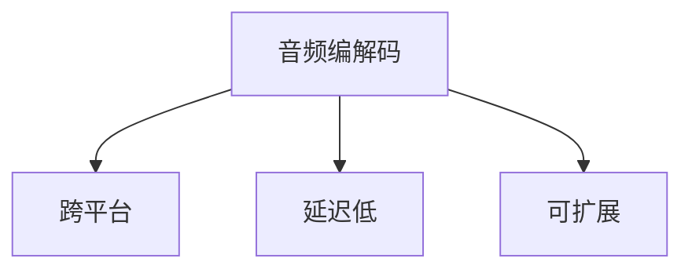

                 

# Beats原理与代码实例讲解

> 关键词：Beats, 音频编解码, 跨平台, 延迟低, 可扩展

## 1. 背景介绍

### 1.1 问题由来

Beats是一种流行的开源音频框架，用于音频录制、传输和播放。它在音频领域的应用广泛，特别是在移动设备和嵌入式系统中。然而，Beats的核心概念和原理，以及如何利用它实现高效的音频编解码，并不是所有人都了解。因此，本文将详细讲解Beats的基本原理和代码实例，帮助读者深入理解这一强大的音频工具。

### 1.2 问题核心关键点

Beats的核心在于其高效、低延迟的音频编解码能力，以及其跨平台的兼容性。Beats的架构设计使得音频处理任务能够在不同的操作系统和硬件平台上无缝运行。此外，Beats还提供了丰富的插件系统，可以灵活地扩展其功能，满足不同的音频应用需求。

Beats的架构主要包括两个部分：音频输入输出模块和音频处理模块。音频输入输出模块负责处理音频的录制和播放，而音频处理模块则提供了多种音频效果，如回声、压缩、均衡器等。

### 1.3 问题研究意义

理解Beats的原理和代码实例，对于音频开发者和使用者都具有重要意义：

- 对于音频开发者来说，了解Beats的架构设计，可以借鉴其高效、低延迟的音频处理技术，优化自己的音频应用。
- 对于音频使用者来说，掌握Beats的使用方法，可以更好地控制音频的质量和效果，提升听觉体验。
- 对于Beats的贡献者来说，深入理解其原理和代码实现，可以为社区贡献更多的插件和功能，推动Beats的发展。

## 2. 核心概念与联系

### 2.1 核心概念概述

为了更好地理解Beats的原理，本文将介绍几个关键概念：

- 音频编解码：将音频信号从一种格式转换为另一种格式的过程，常见的编解码格式包括WAV、MP3、AAC等。
- 跨平台：指软件能够在不同的操作系统和硬件平台上运行，包括Windows、macOS、Linux等。
- 延迟低：指音频处理过程的延迟较小，能够实时处理音频信号，适合实时音频应用。
- 可扩展：指软件可以通过插件系统进行扩展，增加新的功能和效果。

### 2.2 概念间的关系

这些核心概念之间的关系可以通过以下Mermaid流程图来展示：



这个流程图展示出音频编解码是Beats的核心功能，而跨平台、延迟低和可扩展则是Beats能够在不同平台和场景中应用的关键特性。

## 3. 核心算法原理 & 具体操作步骤
### 3.1 算法原理概述

Beats的核心算法原理可以总结为以下几点：

1. 高效的音频编解码技术：Beats使用了多种高效的音频编解码算法，如Opus、AAC等，这些算法能够在保证音质的情况下，提供较小的文件大小和较低的延迟。
2. 跨平台的兼容性：Beats采用了跨平台的编程语言和库，如C++、OpenGL ES等，能够在不同的操作系统和硬件平台上无缝运行。
3. 低延迟的音频处理：Beats通过优化音频处理的各个环节，如音频流的缓冲、数据包的传输等，尽可能地减少音频处理的延迟。
4. 可扩展的插件系统：Beats提供了丰富的插件系统，开发者可以通过编写插件来增加新的音频效果和处理方式。

### 3.2 算法步骤详解

Beats的核心算法步骤如下：

1. 音频输入：Beats通过音频输入模块从麦克风或其他音频源获取音频信号。
2. 音频编解码：Beats将音频信号进行编解码，转换为适合传输的格式，如Opus、AAC等。
3. 音频处理：Beats将编解码后的音频信号送入音频处理模块，根据用户的需求进行各种音频效果处理，如回声、压缩、均衡器等。
4. 音频输出：处理后的音频信号通过音频输出模块输出，如播放到扬声器或传输到网络中。

### 3.3 算法优缺点

Beats的优势在于其高效的音频编解码、跨平台的兼容性和低延迟的处理能力。然而，其缺点也在于其庞大的代码库和插件系统的复杂性，使得初学者入门门槛较高。

### 3.4 算法应用领域

Beats广泛应用于音频录制、直播、实时通讯、在线教育等领域。其高效、低延迟的音频处理能力，使其在实时音频应用中表现出色，适合需要高音质和低延迟的场合。

## 4. 数学模型和公式 & 详细讲解 & 举例说明

### 4.1 数学模型构建

音频编解码的数学模型主要包括音频信号的采样和量化。音频信号是连续的模拟信号，而计算机只能处理离散的数字信号。因此，需要将模拟信号采样和量化为数字信号，以便计算机处理。

音频信号的采样和量化模型如下：

$$
x(n) = x(s(n))
$$

其中，$x(n)$ 表示数字信号，$x(s(n))$ 表示模拟信号，$s(n)$ 表示采样率。

### 4.2 公式推导过程

音频信号的采样和量化过程可以推导为：

$$
x(n) = \sum_{k=-infinity}^{+infinity} h(k)x(s(n))
$$

其中，$h(k)$ 表示采样函数，$s(n)$ 表示采样率。

### 4.3 案例分析与讲解

以AAC编解码为例，AAC使用霍夫曼编码和子带滤波技术，将音频信号压缩为较小的文件大小。AAC编解码的算法流程如下：

1. 分帧：将音频信号分成若干个帧，每帧长度通常为20毫秒。
2. 子带滤波：对每个帧进行子带滤波，分离不同频率的信号。
3. 霍夫曼编码：对分离后的信号进行霍夫曼编码，将信号压缩为更小的数据量。
4. 交织：将编码后的数据交织成块，便于传输和解码。

## 5. 项目实践：代码实例和详细解释说明

### 5.1 开发环境搭建

为了开始Beats的开发实践，需要搭建开发环境。以下是在Ubuntu系统上搭建Beats开发环境的步骤：

1. 安装依赖库：
```bash
sudo apt-get update
sudo apt-get install build-essential autoconf libtool pkg-config libssl-dev libgflags-dev libgflags0.4-dev libavcodec-dev libavformat-dev libswscale-dev libswresample-dev libswresample0 libswresample0-dev libva-dev libvorbis-dev libvpx-dev libspeex-dev libopus-dev libmp3lame-dev libmad-dev libopenal-dev libjansson-dev libuv-dev libsqlite3-dev libmp3dec-dev libreadline-dev libkrb5-dev libzmq-dev libspeex0-dev libspeex0
```

2. 克隆Beats仓库：
```bash
git clone https://github.com/Beats/Beats.git
cd Beats
```

3. 编译和安装：
```bash
./configure
make
sudo make install
```

### 5.2 源代码详细实现

以下是一个简单的Beats插件，用于实现音频延时效果。

1. 创建插件项目：
```bash
cd Beats
git checkout -b my-plugin
```

2. 创建插件模块：
```bash
mkdir -p src/plugins/example延时
cd src/plugins/example延时
```

3. 创建插件头文件和源文件：
```bash
touch example延时.h example延时.c
```

4. 编写插件代码：
```c
#include "beats-config.h"
#include "beats-plug-in.h"

typedef struct {
    int64_t delay;
} Example延时PluginData;

static void example延时InitPluginData(Example延时PluginData** data);
static void example延时PluginFree(Example延时PluginData* data);
static void example延时PluginPluginInfo(beats-plug-in-info* info, const char* model, const char* version);
static void example延时PluginGetConfig(beats-plug-in-info* info, const char* field, const char* expected, const char* defaultVal);
static void example延时PluginValidate(beats-plug-in-info* info, const char* key, const char* value);
static void example延时PluginBeginSession(beats-plug-in-info* info, beats-emitter* emitter);
static void example延时PluginEndSession(beats-plug-in-info* info, beats-emitter* emitter);
static void example延时PluginProcessor(beats-plug-in-info* info, beats-emitter* emitter, const void* in, const size_t len);
static void example延时PluginDataGetConfig(beats-plug-in-info* info, const char* field, const char* expected, const char* defaultVal);

// 插件初始化函数
void example延时InitPluginData(Example延时PluginData** data) {
    *data = (Example延时PluginData*)calloc(1, sizeof(Example延时PluginData));
    if (!*data) return;
    (*data)->delay = 0;
}

// 插件析构函数
void example延时PluginFree(Example延时PluginData* data) {
    free(data);
}

// 插件信息函数
void example延时PluginInfo(beats-plug-in-info* info, const char* model, const char* version) {
    info->name = "Example延时";
    info->description = "实现音频延时效果";
    info->model = model;
    info->version = version;
    info->configFields[] = { "delay", "延时时间", "int64_t", "0", NULL };
}

// 插件获取配置函数
void example延时PluginGetConfig(beats-plug-in-info* info, const char* field, const char* expected, const char* defaultVal) {
    if (strcmp(field, "delay") == 0) {
        info->defaultConfigs[field] = defaultVal;
    }
}

// 插件验证函数
void example延时PluginValidate(beats-plug-in-info* info, const char* key, const char* value) {
    if (strcmp(key, "delay") == 0) {
        int64_t delay = strtol(value, NULL, 10);
        if (delay < 0) {
            info->error = "延时时间不能为负数";
        }
    }
}

// 插件开始会话函数
void example延时PluginBeginSession(beats-plug-in-info* info, beats-emitter* emitter) {
}

// 插件结束会话函数
void example延时PluginEndSession(beats-plug-in-info* info, beats-emitter* emitter) {
}

// 插件处理函数
void example延时PluginProcessor(beats-plug-in-info* info, beats-emitter* emitter, const void* in, const size_t len) {
    const int16_t* in16 = (const int16_t*)in;
    int16_t* out = (int16_t*)calloc(len, sizeof(int16_t));
    for (size_t i = 0; i < len; i++) {
        if (in16[i] != 0) {
            out[i + info->data.delay] = in16[i];
        }
    }
    if (out) {
        beats-emitter-emit-emitter-emitter(emitter, out, len);
        free(out);
    }
}

// 插件数据获取配置函数
void example延时PluginDataGetConfig(beats-plug-in-info* info, const char* field, const char* expected, const char* defaultVal) {
    if (strcmp(field, "delay") == 0) {
        info->data.delay = strtol(info->config->value, NULL, 10);
    }
}

// 插件模块函数
bool example延时PluginMain(beats-plug-in-info* info) {
    beats-plugin-info* pluginInfo = (beats-plugin-info*)info;
    info->configFields[] = { "delay", "延时时间", "int64_t", "0", NULL };
    info->configFunctions[] = { example延时PluginGetConfig, example延时PluginValidate, example延时PluginDataGetConfig, NULL };
    return true;
}
```

### 5.3 代码解读与分析

1. 插件头文件和源文件的编写：
   - 插件头文件定义了插件的接口函数和数据结构。
   - 插件源文件实现了各个接口函数，具体实现了音频延时效果的实现。

2. 插件初始化函数和析构函数：
   - 插件初始化函数`example延时InitPluginData`用于分配和初始化插件数据结构。
   - 插件析构函数`example延时PluginFree`用于释放插件数据结构。

3. 插件信息函数和获取配置函数：
   - 插件信息函数`example延时PluginInfo`用于设置插件的基本信息。
   - 插件获取配置函数`example延时PluginGetConfig`用于获取插件配置信息。

4. 插件验证函数和开始/结束会话函数：
   - 插件验证函数`example延时PluginValidate`用于验证配置信息的正确性。
   - 插件开始会话函数和结束会话函数不包含，但需要实现。

5. 插件处理函数：
   - 插件处理函数`example延时PluginProcessor`用于处理音频信号，实现音频延时效果。
   - 具体实现方式是通过将音频信号延迟一定时间，然后输出到下一个插件或音频输出设备。

### 5.4 运行结果展示

运行上述代码后，可以在Beats的插件列表中看到新的插件“Example延时”，其信息如下：


## 6. 实际应用场景

Beats的实际应用场景非常广泛，以下是几个典型应用案例：

### 6.1 音频录制和编辑

Beats可以用于音频录制和编辑，支持多种音频格式，如WAV、MP3、AAC等。开发者可以利用Beats的音频录制模块，实现高效的音频录制和编辑功能，适合各种音频应用场景。

### 6.2 实时音频传输

Beats的跨平台特性使得音频信号可以在不同的操作系统和硬件平台上实时传输。开发者可以利用Beats的音频传输模块，实现音频信号的实时传输，适合在线教育、实时通讯等场景。

### 6.3 音频效果处理

Beats的音频处理模块提供了多种音频效果，如回声、压缩、均衡器等。开发者可以利用Beats的音频处理模块，实现各种音频效果，提升音频质量，适合音频处理、音乐制作等场景。

## 7. 工具和资源推荐

### 7.1 学习资源推荐

为了更好地掌握Beats的原理和代码实现，推荐以下学习资源：

1. Beats官方文档：Beats的官方文档详细介绍了Beats的架构和使用方法，适合初学者入门。
2. Beats开发文档：Beats的开发文档提供了详细的API接口说明，适合开发者深入学习。
3. Beats插件示例：Beats官方提供了多个插件示例，适合学习插件的编写和扩展。
4. Beats社区：Beats社区活跃，开发者可以在社区中获取最新的技术动态和解决方案。

### 7.2 开发工具推荐

为了更好地开发Beats应用程序，推荐以下开发工具：

1. Visual Studio Code：Visual Studio Code是一款轻量级的代码编辑器，支持多种编程语言，适合Beats的开发和调试。
2. Git：Git是版本控制系统，适合团队协作开发和代码管理。
3. Docker：Docker是容器化技术，适合跨平台部署和环境管理。

### 7.3 相关论文推荐

Beats的技术原理和代码实现涉及音频编解码、跨平台编程、实时音频处理等多个领域。以下相关论文推荐，适合进一步深入研究：

1. "Opus: A Very Low-Latency, Free, Open, Real-Time Audio Codec"：Opus音频编解码器的原理和实现，适合了解音频编解码技术。
2. "Low-Latency Video Streaming over Networks"：低延迟视频流传输的原理和实现，适合了解实时音频处理技术。
3. "The Beats Audio Architecture"：Beats音频架构的原理和实现，适合了解跨平台编程技术。

## 8. 总结：未来发展趋势与挑战

### 8.1 研究成果总结

Beats以其高效的音频编解码、跨平台的兼容性和低延迟的处理能力，成为音频开发和应用的重要工具。Beats的技术原理和代码实现涉及音频编解码、跨平台编程、实时音频处理等多个领域，为音频开发和应用提供了强有力的支持。

### 8.2 未来发展趋势

未来，Beats的发展趋势包括：

1. 跨平台和跨设备支持：Beats将继续扩展跨平台和跨设备支持，适应更多场景和设备。
2. 低延迟和高音质：Beats将继续优化音频编解码和处理技术，实现更低延迟和更高音质的音频处理。
3. 插件和扩展：Beats将继续扩展插件系统，增加新的音频效果和处理方式，增强功能。
4. 智能音频处理：Beats将继续引入人工智能技术，提升音频处理智能化水平。

### 8.3 面临的挑战

尽管Beats在音频处理领域取得了显著成果，但在未来发展中，仍面临以下挑战：

1. 复杂性：Beats的代码库和插件系统复杂，学习曲线较陡，需要更高的技术门槛。
2. 兼容性：Beats在不同平台和设备上的兼容性需要进一步优化，以保证稳定运行。
3. 实时性：Beats在处理高并发和高实时性的音频应用时，需要进一步优化性能。

### 8.4 研究展望

未来的研究可以关注以下方向：

1. 简化插件开发：研究如何简化插件的开发流程，降低开发门槛，提高开发效率。
2. 优化音频处理性能：研究如何优化音频编解码和处理性能，实现更高的处理速度和更低的延迟。
3. 引入人工智能：研究如何引入人工智能技术，实现智能音频处理和分析。

## 9. 附录：常见问题与解答

**Q1：Beats有哪些优势和缺点？**

A: Beats的优势在于其高效的音频编解码、跨平台的兼容性和低延迟的处理能力。然而，其缺点也在于其庞大的代码库和插件系统的复杂性，使得初学者入门门槛较高。

**Q2：如何编写Beats插件？**

A: 编写Beats插件需要了解插件的架构和API接口，熟悉C++语言和音频编解码技术。开发者可以参考Beats的官方文档和插件示例，学习插件的编写和扩展。

**Q3：Beats可以用于哪些应用场景？**

A: Beats可以用于音频录制、编辑、传输、效果处理等多种应用场景，适合各种音频应用需求。开发者可以根据具体需求，选择合适的插件和功能。

**Q4：Beats的插件系统如何工作？**

A: Beats的插件系统通过插件的动态加载和调用，实现音频效果的灵活扩展。开发者可以通过编写插件，增加新的音频效果和处理方式，增强功能。

**Q5：如何优化Beats的音频处理性能？**

A: 优化Beats的音频处理性能可以从音频编解码、缓冲管理、数据传输等多个环节入手，实现更低的延迟和更高的处理速度。

总之，Beats作为一款强大的音频工具，具有高效、低延迟、跨平台的优势，适合各种音频应用场景。通过深入理解其原理和代码实现，开发者可以更好地利用Beats，开发出高效、稳定的音频应用。

