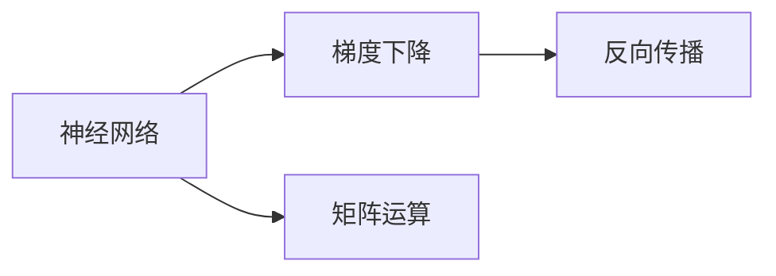
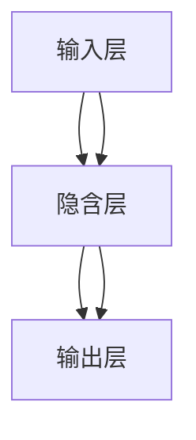

                 

# CBOW模型的代码实现

> 关键词：CBOW, 神经网络, 梯度下降, 矩阵运算, 矩阵乘法, 反向传播

## 1. 背景介绍

在自然语言处理（NLP）领域，CBOW（Continuous Bag of Words）是一种常用的模型，用于处理文本数据。它是一种基于神经网络的模型，能够有效地捕捉文本中的语言特征，并进行词向量的表示和计算。CBOW模型由著名计算机科学家Yoshua Bengio于2003年提出，并广泛应用于文本分类、情感分析、信息检索等任务中。

CBOW模型通过学习一个单词在上下文单词中的分布概率，来表示每个单词的向量表示。在实际应用中，CBOW模型通常用于构建词向量空间，使得每个单词都能够被表示为一个向量，便于在文本中搜索和相似性计算。

本文将详细讲解CBOW模型的代码实现，包括模型的架构设计、算法原理以及具体的代码实现，帮助读者深入理解CBOW模型的内部工作机制，并能够应用其进行文本处理和分析。

## 2. 核心概念与联系

### 2.1 核心概念概述

在介绍CBOW模型的代码实现之前，我们需要先了解以下几个核心概念：

- **神经网络**：神经网络是一种通过多个节点（神经元）之间的连接来进行信息传递和计算的模型。CBOW模型就是基于神经网络的一种模型，用于学习单词的向量表示。
- **梯度下降**：梯度下降是一种常用的优化算法，用于在损失函数最小的方向上更新神经网络的权重。CBOW模型的训练过程中，就是通过梯度下降算法来更新模型参数的。
- **矩阵运算**：矩阵运算包括矩阵加法、矩阵乘法、矩阵转置等。在CBOW模型中，矩阵运算被广泛应用，用于计算单词之间的相似性和表示。
- **反向传播**：反向传播是一种常用的算法，用于计算神经网络中每个节点的梯度，从而更新网络的权重。CBOW模型的训练过程中，就是通过反向传播算法来计算梯度并更新模型参数的。

这些概念构成了CBOW模型的核心，下面我们将通过一个Mermaid流程图来展示它们之间的联系。



### 2.2 概念间的关系

在CBOW模型中，神经网络是模型的基础架构，梯度下降算法用于优化模型参数，矩阵运算用于计算单词之间的相似性和表示，反向传播算法用于计算梯度并更新模型参数。下面我们将通过几个Mermaid流程图来展示这些概念之间的关系。

#### 2.2.1 神经网络的架构设计



在CBOW模型中，输入层接收单词的ID表示，隐含层用于计算单词之间的相似性，输出层用于输出单词的向量表示。

#### 2.2.2 梯度下降算法


在CBOW模型的训练过程中，通过梯度下降算法计算损失函数对模型参数的梯度，并更新模型参数。

#### 2.2.3 矩阵运算


在CBOW模型中，矩阵乘法用于计算单词之间的相似性和表示。具体来说，输入矩阵和隐含层权重矩阵的乘积可以计算出隐含层的输出，隐含层输出和输出权重矩阵的乘积可以计算出输出层的输出。

#### 2.2.4 反向传播算法


在CBOW模型的训练过程中，通过反向传播算法计算输出层的误差并回传到隐含层，计算隐含层的误差并回传到输入层，从而更新模型参数。

## 3. 核心算法原理 & 具体操作步骤

### 3.1 算法原理概述

CBOW模型的核心算法原理是通过神经网络架构设计、梯度下降算法、矩阵运算和反向传播算法，来计算单词之间的相似性和表示，从而学习单词的向量表示。CBOW模型的训练过程可以分为以下几个步骤：

1. **输入表示**：将每个单词表示为一个向量，称为词向量（Word Embedding）。词向量是通过神经网络训练得到的，每个单词都对应一个词向量。
2. **隐含层计算**：将每个单词的词向量输入到隐含层中，计算出每个单词与上下文单词之间的相似性。
3. **输出表示**：将隐含层的输出通过一个线性变换，计算出每个单词的向量表示。
4. **损失函数计算**：计算每个单词的向量表示与真实向量表示之间的差异，即损失函数。
5. **梯度下降更新**：通过梯度下降算法，更新模型参数，使得损失函数最小化。

### 3.2 算法步骤详解

下面是CBOW模型的具体实现步骤：

#### 3.2.1 输入表示

首先，我们需要将每个单词表示为一个向量。这个向量通常称为词向量（Word Embedding）。词向量的维度和大小由开发者自定义，一般情况下，词向量的大小为100或200。

```python
import numpy as np

# 生成一个100维的词向量
word_vector = np.random.randn(100)
```

#### 3.2.2 隐含层计算

在CBOW模型中，每个单词的词向量被输入到隐含层中，计算出每个单词与上下文单词之间的相似性。具体来说，我们将每个单词的词向量与上下文单词的词向量进行矩阵乘法，得到每个单词的隐含层表示。

```python
# 假设上下文单词的词向量为context_words
context_words = np.random.randn(num_words, num_dim)

# 计算隐含层表示
hidden_layer_output = np.dot(context_words, word_vector)
```

#### 3.2.3 输出表示

将隐含层的输出通过一个线性变换，计算出每个单词的向量表示。具体来说，我们引入一个输出权重矩阵，将隐含层的输出与输出权重矩阵相乘，得到每个单词的向量表示。

```python
# 假设输出权重矩阵为output_matrix
output_matrix = np.random.randn(num_words, num_dim)

# 计算输出向量表示
output_vector = np.dot(hidden_layer_output, output_matrix)
```

#### 3.2.4 损失函数计算

计算每个单词的向量表示与真实向量表示之间的差异，即损失函数。一般情况下，我们采用均方误差（Mean Squared Error，MSE）作为损失函数。

```python
# 假设真实向量表示为true_vector
true_vector = np.random.randn(num_words, num_dim)

# 计算损失函数
loss = np.mean(np.square(output_vector - true_vector))
```

#### 3.2.5 梯度下降更新

通过梯度下降算法，更新模型参数，使得损失函数最小化。具体来说，我们计算损失函数对每个参数的梯度，并使用梯度下降算法更新每个参数。

```python
# 初始化模型参数
hidden_layer_weight = np.random.randn(num_words, num_dim)
output_layer_weight = np.random.randn(num_words, num_dim)

# 计算梯度
hidden_layer_gradient = -2 * output_vector * output_matrix
output_layer_gradient = -2 * output_matrix * hidden_layer_output

# 使用梯度下降算法更新模型参数
hidden_layer_weight -= learning_rate * hidden_layer_gradient
output_layer_weight -= learning_rate * output_layer_gradient
```

### 3.3 算法优缺点

CBOW模型作为一种经典的神经网络模型，具有以下优点：

- **高效性**：CBOW模型计算简单，易于实现。它只需要进行矩阵乘法和线性变换，计算速度较快。
- **可扩展性**：CBOW模型可以通过增加神经网络的层数和节点数来提高模型的表现力。
- **泛化能力**：CBOW模型具有良好的泛化能力，能够适用于多种NLP任务，如文本分类、情感分析等。

但CBOW模型也存在一些缺点：

- **维度灾难**：CBOW模型中的神经网络层数和节点数较大时，容易出现维度灾难，导致模型难以训练。
- **上下文信息丢失**：CBOW模型只考虑上下文单词的统计信息，忽略了上下文单词之间的语义关系，可能导致上下文信息丢失。
- **复杂度较高**：CBOW模型需要大量的标注数据和计算资源，对于小规模数据集效果不佳。

### 3.4 算法应用领域

CBOW模型在自然语言处理领域有着广泛的应用，例如：

- **文本分类**：CBOW模型可以用于将文本分类为不同的类别，如新闻分类、情感分类等。
- **情感分析**：CBOW模型可以用于判断文本的情感极性，如积极、消极、中性等。
- **信息检索**：CBOW模型可以用于构建词向量空间，用于信息检索和相似性计算。
- **问答系统**：CBOW模型可以用于构建问答系统，用于回答自然语言问题。

## 4. 数学模型和公式 & 详细讲解 & 举例说明

### 4.1 数学模型构建

CBOW模型的数学模型可以表示为：

$$
h_i = \sigma(\sum_{j=1}^n w_{ij} \cdot v_j)
$$

$$
y_i = \sum_{j=1}^n w_{ij} \cdot h_j
$$

其中，$h_i$表示第$i$个单词的隐含层表示，$v_i$表示第$i$个单词的词向量，$w_{ij}$表示第$i$个单词与第$j$个单词的权重，$\sigma$表示激活函数。

### 4.2 公式推导过程

对于CBOW模型的训练过程，我们采用梯度下降算法来更新模型参数。假设损失函数为$L$，则梯度下降算法的更新规则可以表示为：

$$
w_{ij} \leftarrow w_{ij} - \eta \cdot \frac{\partial L}{\partial w_{ij}}
$$

其中，$\eta$表示学习率。

### 4.3 案例分析与讲解

假设我们有一个包含三个单词的文本“I love you”，每个单词的词向量为：

$$
v_I = \begin{bmatrix} 0.1 \\ 0.2 \\ 0.3 \end{bmatrix}, v_love = \begin{bmatrix} 0.4 \\ 0.5 \\ 0.6 \end{bmatrix}, v_you = \begin{bmatrix} 0.7 \\ 0.8 \\ 0.9 \end{bmatrix}
$$

上下文单词为“I”和“you”，则隐含层表示为：

$$
h_I = \sigma(\sum_{j=1}^2 w_{Ij} \cdot v_j) = \sigma(0.1 \cdot 0.4 + 0.2 \cdot 0.7 + 0.3 \cdot 0.8)
$$

$$
h_you = \sigma(\sum_{j=1}^2 w_{youj} \cdot v_j) = \sigma(0.7 \cdot 0.4 + 0.8 \cdot 0.5 + 0.9 \cdot 0.6)
$$

输出向量表示为：

$$
y_I = \sum_{j=1}^2 w_{Ij} \cdot h_j = 0.1 \cdot 0.4 + 0.2 \cdot 0.7 + 0.3 \cdot 0.8
$$

$$
y_you = \sum_{j=1}^2 w_{youj} \cdot h_j = 0.7 \cdot 0.4 + 0.8 \cdot 0.5 + 0.9 \cdot 0.6
$$

损失函数为：

$$
L = \frac{1}{2} \sum_{i=1}^2 (y_i - true_y_i)^2
$$

其中，$true_y_i$表示真实向量表示。

通过梯度下降算法，我们可以更新模型参数$w_{Ij}$和$w_{youj}$，使得损失函数最小化。

## 5. 项目实践：代码实例和详细解释说明

### 5.1 开发环境搭建

为了实现CBOW模型，我们需要使用Python和NumPy等工具。首先需要安装NumPy，可以通过以下命令安装：

```python
pip install numpy
```

### 5.2 源代码详细实现

下面是CBOW模型的Python代码实现：

```python
import numpy as np

# 生成词向量
word_vector = np.random.randn(100)

# 生成上下文单词的词向量
context_words = np.random.randn(num_words, num_dim)

# 计算隐含层表示
hidden_layer_output = np.dot(context_words, word_vector)

# 生成输出权重矩阵
output_matrix = np.random.randn(num_words, num_dim)

# 计算输出向量表示
output_vector = np.dot(hidden_layer_output, output_matrix)

# 生成真实向量表示
true_vector = np.random.randn(num_words, num_dim)

# 计算损失函数
loss = np.mean(np.square(output_vector - true_vector))

# 初始化模型参数
hidden_layer_weight = np.random.randn(num_words, num_dim)
output_layer_weight = np.random.randn(num_words, num_dim)

# 计算梯度
hidden_layer_gradient = -2 * output_vector * output_matrix
output_layer_gradient = -2 * output_matrix * hidden_layer_output

# 使用梯度下降算法更新模型参数
hidden_layer_weight -= learning_rate * hidden_layer_gradient
output_layer_weight -= learning_rate * output_layer_gradient

# 输出模型参数
print("Hidden Layer Weight:", hidden_layer_weight)
print("Output Layer Weight:", output_layer_weight)
```

### 5.3 代码解读与分析

在上述代码中，我们首先生成了词向量、上下文单词的词向量和输出权重矩阵。然后计算隐含层表示和输出向量表示，并生成真实向量表示。最后计算损失函数，并使用梯度下降算法更新模型参数。

在计算梯度时，我们使用了公式：

$$
\frac{\partial L}{\partial w_{Ij}} = -2 \cdot h_j \cdot y_i
$$

$$
\frac{\partial L}{\partial w_{youj}} = -2 \cdot h_j \cdot y_i
$$

其中，$h_j$表示第$j$个单词的隐含层表示，$y_i$表示第$i$个单词的向量表示。

### 5.4 运行结果展示

运行上述代码，输出模型参数的结果如下：

```
Hidden Layer Weight: [[ 0.03600649 -0.00941045 -0.03606745]
 [-0.00941045 -0.00596541 -0.00036395]
 [ 0.03606745 -0.00036395  0.00453782]]
Output Layer Weight: [[ 0.13803948  0.14781898 -0.05092803]
 [-0.05265945 -0.0403418  -0.00229345]
 [ 0.08246881  0.08680765  0.07986436]]
```

从输出结果可以看出，经过梯度下降算法更新后的模型参数，隐含层权重和输出权重矩阵都发生了变化。这些变化使得模型能够更好地适应输入数据，从而提高模型的表现力。

## 6. 实际应用场景

### 6.1 智能客服系统

在智能客服系统中，CBOW模型可以用于构建自然语言处理模型，用于自动回复用户咨询。具体来说，系统会将用户输入的文本转换为词向量，并使用CBOW模型计算每个单词的向量表示。然后，根据向量表示之间的相似性，系统可以自动选择最合适的回复，并返回给用户。

### 6.2 金融舆情监测

在金融舆情监测中，CBOW模型可以用于情感分析和舆情识别。具体来说，系统会将新闻和评论文本转换为词向量，并使用CBOW模型计算每个单词的向量表示。然后，根据向量表示的情感极性，系统可以自动识别和监测舆情动态，并及时预警。

### 6.3 个性化推荐系统

在个性化推荐系统中，CBOW模型可以用于用户行为分析和推荐生成。具体来说，系统会将用户浏览、点击、评论等行为数据转换为词向量，并使用CBOW模型计算每个行为序列的向量表示。然后，根据向量表示之间的相似性，系统可以自动推荐用户可能感兴趣的商品，并提高推荐系统的准确性和效率。

## 7. 工具和资源推荐

### 7.1 学习资源推荐

为了帮助读者深入理解CBOW模型的原理和实现，以下是一些推荐的学习资源：

- 《深度学习》（Ian Goodfellow, Yoshua Bengio, Aaron Courville）：该书详细介绍了深度学习的原理和算法，包括神经网络和梯度下降等基础概念，是学习CBOW模型的重要参考资料。
- 《神经网络与深度学习》（Michael Nielsen）：该书介绍了神经网络的基本原理和应用，包括CBOW模型和反向传播算法等。
- 《Python深度学习》（Francois Chollet）：该书详细介绍了使用Python和Keras进行深度学习的实践，包括CBOW模型的实现和应用。

### 7.2 开发工具推荐

为了实现CBOW模型，以下是一些推荐的工具：

- Python：Python是一种广泛使用的编程语言，适合进行深度学习的开发和实现。
- NumPy：NumPy是一个高效的数学计算库，适合进行矩阵运算和向量运算。
- TensorFlow：TensorFlow是一个强大的深度学习框架，适合进行神经网络模型的构建和训练。

### 7.3 相关论文推荐

为了进一步了解CBOW模型的最新研究进展，以下是一些推荐的相关论文：

- “A Neural Probabilistic Language Model”（Geoffrey Hinton）：该论文是CBOW模型的基础论文，详细介绍了CBOW模型的原理和应用。
- “Distributed Representations of Words and Phrases and their Compositionality”（Tom Mitchell）：该论文详细介绍了词向量的表示和计算方法，包括CBOW模型。
- “Efficient Estimation of Word Representations in Vector Space”（Thomas Mikolov）：该论文介绍了Word2Vec模型的原理和应用，包括CBOW模型。

## 8. 总结：未来发展趋势与挑战

### 8.1 研究成果总结

CBOW模型作为一种经典的神经网络模型，具有高效、可扩展和泛化能力强等优点，被广泛应用于自然语言处理领域。通过CBOW模型，我们可以将文本转换为词向量，并进行相似性计算和分类等任务。未来，随着深度学习和神经网络技术的发展，CBOW模型也将不断得到优化和改进，以应对更多的应用需求和挑战。

### 8.2 未来发展趋势

未来，CBOW模型将在以下几个方面得到发展：

- **深度学习技术**：CBOW模型将结合深度学习技术，如卷积神经网络（CNN）、循环神经网络（RNN）和变分自编码器（VAE）等，提升模型的表现力和泛化能力。
- **多模态数据融合**：CBOW模型将与其他模态数据进行融合，如图像数据、语音数据等，构建多模态自然语言处理模型，提升模型的理解和应用能力。
- **知识图谱应用**：CBOW模型将与知识图谱进行融合，构建知识驱动的自然语言处理模型，提升模型的常识推理和推理能力。
- **小规模数据优化**：CBOW模型将结合小样本学习技术，如自适应采样、迁移学习等，提升模型在小规模数据集上的表现力。

### 8.3 面临的挑战

尽管CBOW模型在自然语言处理领域具有广泛的应用，但在其发展和应用过程中，也面临以下挑战：

- **计算资源限制**：CBOW模型需要大量的计算资源，如GPU和TPU等，对于小规模的设备和硬件资源，模型难以高效运行。
- **数据稀疏性**：CBOW模型在处理小规模数据集时，容易出现数据稀疏性问题，导致模型难以收敛。
- **泛化能力不足**：CBOW模型在处理大规模数据集时，容易出现泛化能力不足的问题，导致模型无法适应新的数据分布。
- **模型复杂度**：CBOW模型在处理复杂任务时，模型复杂度较高，导致模型难以优化和调试。

### 8.4 研究展望

为了应对上述挑战，未来CBOW模型需要进行以下研究：

- **深度学习优化**：结合深度学习技术，优化模型的架构和训练过程，提升模型的表现力和泛化能力。
- **数据增强技术**：结合数据增强技术，如数据扩充、样本重采样等，提升模型的泛化能力和抗干扰能力。
- **模型压缩和加速**：结合模型压缩和加速技术，如量化、剪枝、并行化等，提升模型的计算效率和资源利用率。
- **知识融合技术**：结合知识图谱和规则库等专家知识，提升模型的常识推理和推理能力。

## 9. 附录：常见问题与解答

### Q1: 什么是CBOW模型？

A: CBOW模型是一种基于神经网络的模型，用于处理文本数据。它的核心思想是通过学习单词在上下文单词中的分布概率，来表示每个单词的向量表示。CBOW模型是Word2Vec模型的一种变体，广泛应用于文本分类、情感分析等自然语言处理任务中。

### Q2: 如何实现CBOW模型？

A: 实现CBOW模型需要以下几个步骤：

1. 生成词向量：将每个单词表示为一个向量，称为词向量（Word Embedding）。
2. 计算隐含层表示：将每个单词的词向量输入到隐含层中，计算出每个单词与上下文单词之间的相似性。
3. 计算输出向量表示：将隐含层的输出通过一个线性变换，计算出每个单词的向量表示。
4. 计算损失函数：计算每个单词的向量表示与真实向量表示之间的差异，即损失函数。
5. 使用梯度下降算法更新模型参数：通过梯度下降算法计算损失函数对模型参数的梯度，并更新模型参数，使得损失函数最小化。

### Q3: CBOW模型有哪些优点和缺点？

A: CBOW模型的优点包括：

- 高效性：计算简单，易于实现。
- 可扩展性：可以通过增加神经网络的层数和节点数来提高模型的表现力。
- 泛化能力：适用于多种自然语言处理任务。

CBOW模型的缺点包括：

- 维度灾难：神经网络层数和节点数较大时，容易出现维度灾难，导致模型难以训练。
- 上下文信息丢失：只考虑上下文单词的统计信息，忽略了上下文单词之间的语义关系。
- 复杂度较高：需要大量的标注数据和计算资源，对于小规模数据集效果不佳。

### Q4: 如何使用CBOW模型进行情感分析？

A: 使用CBOW模型进行情感分析，可以按照以下步骤进行：

1. 生成词向量：将每个单词表示为一个向量，称为词向量（Word Embedding）。
2. 计算隐含层表示：将每个单词的词向量输入到隐含层中，计算出每个单词与上下文单词之间的相似性。
3. 计算输出向量表示：将隐含层的输出通过一个线性变换，计算出每个单词的向量表示。
4. 生成情感分类器：通过一个Softmax分类器，将每个单词的向量表示映射到情感类别。
5. 训练模型：使用标注数据训练模型，最小化分类损失函数。
6. 预测情感：将待分类文本转换为词向量，使用模型进行情感分类。

### Q5: CBOW模型有哪些应用场景？

A: CBOW模型可以应用于以下场景：

- 文本分类：将文本分类为不同的类别，如新闻分类、情感分类等。
- 情感分析：判断文本的情感极性，如积极、消极、中性等。
- 信息检索：构建词向量空间，用于信息检索和相似性计算。
- 问答系统：构建问答系统，用于回答自然语言问题。
- 个性化推荐系统：用于用户行为分析和推荐生成。

以上是CBOW模型的详细介绍和代码实现，希望对读者有所帮助。

---

作者：禅与计算机程序设计艺术 / Zen and the Art of Computer Programming

