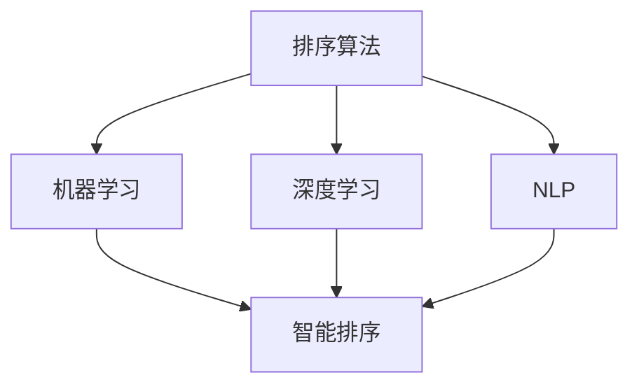
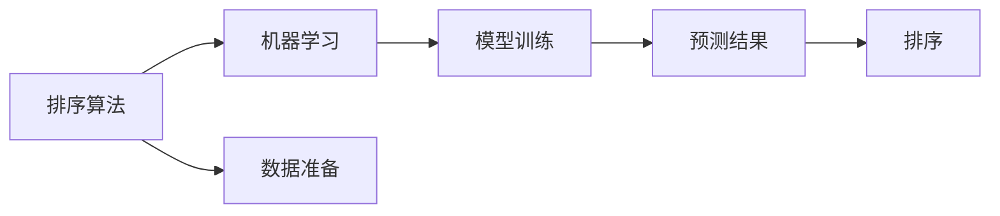
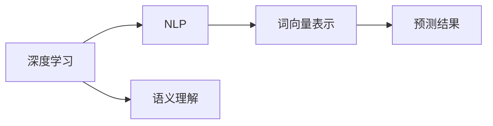
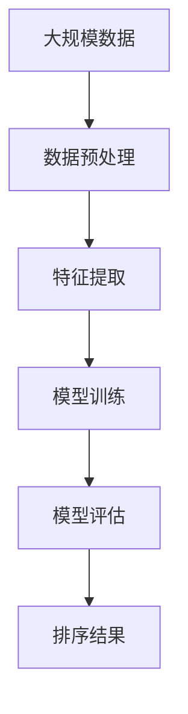

                 

# 智能排序技术：AI提升结果

> 关键词：
排序算法，人工智能，智能优化，搜索结果排序，机器学习，深度学习，自然语言处理

## 1. 背景介绍

### 1.1 问题由来

在当今信息爆炸的时代，人们每天需要处理大量的数据和信息，排序技术成为了提升信息检索效率和用户体验的关键。传统的排序算法如快速排序、归并排序等已经满足了大部分场景的需求，但随着数据量的激增，现有的排序算法在处理大规模数据时显得力不从心。

为了解决这一问题，人工智能（AI）技术被引入排序领域，利用机器学习（ML）和深度学习（DL）技术，提升排序算法的效率和准确性。例如，Google的PageRank算法就是利用PageRank模型对网页的重要性进行排序，从而优化搜索结果的展示。

### 1.2 问题核心关键点

基于AI的排序技术，通过机器学习模型学习数据的内在规律，预测数据的重要性或相关性，从而实现智能排序。这种排序方法的核心在于选择合适的机器学习模型，优化模型的训练和调参，以及评估模型的效果。

### 1.3 问题研究意义

研究基于AI的排序技术，对于提升信息检索效率、优化用户体验、降低信息获取成本等方面具有重要意义。AI排序技术可以自动化地处理大规模数据，提供更加个性化和精准的搜索结果，推动信息检索技术的智能化进程。

## 2. 核心概念与联系

### 2.1 核心概念概述

为更好地理解基于AI的排序技术，本节将介绍几个密切相关的核心概念：

- **排序算法**：指一种将数据按照一定规则进行排列的技术，如快速排序、归并排序等。

- **人工智能**：指利用机器学习算法处理数据，自动推断数据规律，从而实现智能决策的技术。

- **机器学习**：指通过数据训练模型，利用模型对新数据进行预测的技术。

- **深度学习**：指一种特殊的机器学习技术，通过构建多层神经网络，学习数据的复杂特征。

- **自然语言处理（NLP）**：指利用机器学习模型处理和理解人类语言的技术。

这些概念之间的关系可以通过以下Mermaid流程图来展示：



这个流程图展示了排序算法与机器学习、深度学习和NLP技术之间的联系。排序算法通过引入机器学习、深度学习和NLP技术，实现智能排序，提升了排序的效果。

### 2.2 概念间的关系

这些核心概念之间存在着紧密的联系，形成了智能排序技术的完整生态系统。下面我们通过几个Mermaid流程图来展示这些概念之间的关系。

#### 2.2.1 排序算法与机器学习的关系



这个流程图展示了排序算法与机器学习的关系。排序算法首先对数据进行预处理，然后利用机器学习模型对数据进行预测，最终根据预测结果对数据进行排序。

#### 2.2.2 深度学习与NLP的关系



这个流程图展示了深度学习与NLP的关系。深度学习通过构建多层神经网络，实现语义理解和词向量表示，进而提升NLP任务的准确性。

#### 2.2.3 智能排序的整体架构



这个综合流程图展示了智能排序的整体架构。大规模数据首先进行预处理和特征提取，然后利用机器学习模型进行训练和评估，最终得到排序结果。

### 2.3 核心概念的整体架构

最后，我们用一个综合的流程图来展示这些核心概念在大规模数据排序中的整体架构：


这个综合流程图展示了从数据预处理到模型训练，再到排序结果生成的完整过程。通过这些流程图，我们可以更清晰地理解智能排序技术的工作原理和优化方向。

## 3. 核心算法原理 & 具体操作步骤
### 3.1 算法原理概述

基于AI的智能排序技术，本质上是一种利用机器学习模型对数据进行预测和排序的技术。其核心思想是：通过训练一个能够学习数据内在规律和特征的机器学习模型，预测数据的重要性或相关性，并根据预测结果对数据进行排序。

形式化地，假设排序任务的数据集为 $D=\{(x_i, y_i)\}_{i=1}^N$，其中 $x_i$ 为输入数据，$y_i$ 为真实标签，表示数据的重要性或相关性。机器学习模型的目标是通过训练，找到最优参数 $\theta$，使得模型对数据的预测 $\hat{y} = M(x;\theta)$ 与真实标签 $y_i$ 的差异最小化，即：

$$
\theta^* = \mathop{\arg\min}_{\theta} \mathcal{L}(M_{\theta},D)
$$

其中 $\mathcal{L}$ 为预测误差函数，通常使用均方误差、交叉熵等损失函数。

### 3.2 算法步骤详解

基于AI的智能排序技术，一般包括以下几个关键步骤：

**Step 1: 数据准备**
- 收集需要排序的数据集 $D$，将其分为训练集、验证集和测试集。
- 对数据进行预处理，如去除噪声、归一化、标准化等。
- 将数据转换为模型可接受的形式，如将文本数据转换为词向量。

**Step 2: 特征提取**
- 根据排序任务的特点，选择合适的特征提取方法，如TF-IDF、Word2Vec、BERT等。
- 将提取的特征输入机器学习模型，用于训练和预测。

**Step 3: 模型训练**
- 选择合适的机器学习算法，如线性回归、支持向量机、神经网络等。
- 使用训练集数据对模型进行训练，优化模型参数 $\theta$。
- 在验证集上进行模型评估，避免过拟合。

**Step 4: 模型预测**
- 使用训练好的模型对测试集数据进行预测，得到数据的预测值 $\hat{y}$。
- 根据预测值 $\hat{y}$ 对数据进行排序，得到最终的排序结果。

**Step 5: 模型评估**
- 对测试集上的排序结果进行评估，使用均方误差、精度、召回率等指标衡量模型效果。
- 根据评估结果对模型进行调整和优化。

**Step 6: 部署与应用**
- 将优化后的模型部署到生产环境中，用于实时排序。
- 根据用户反馈和数据分布的变化，定期对模型进行更新和重新训练。

以上是基于AI的智能排序技术的一般流程。在实际应用中，还需要根据具体任务的特点，对各个环节进行优化设计，如选择合适的特征提取方法、优化模型参数、选择适合的评估指标等。

### 3.3 算法优缺点

基于AI的智能排序技术具有以下优点：
1. 能够处理大规模数据，提升排序效率。
2. 能够学习数据的内在规律，提升排序的准确性。
3. 能够自动化地处理数据，降低人工成本。

同时，该方法也存在一些缺点：
1. 需要大量的标注数据进行训练，获取标注数据成本较高。
2. 模型训练和调参过程较为复杂，需要一定的专业知识。
3. 模型的泛化能力有限，需要根据数据分布进行调整。

尽管存在这些缺点，但就目前而言，基于AI的智能排序方法仍然是处理大规模数据排序问题的有效手段。未来相关研究的重点在于如何进一步降低对标注数据的依赖，提高模型的泛化能力，同时兼顾模型的复杂度和准确性。

### 3.4 算法应用领域

基于AI的智能排序技术已经在多个领域得到了应用，例如：

- 搜索引擎：如Google、Bing等搜索引擎使用PageRank算法对搜索结果进行排序，提升搜索体验。
- 电商推荐：如Amazon、淘宝等电商网站使用协同过滤、深度学习等方法对商品进行排序，提升推荐效果。
- 新闻推荐：如今日头条、腾讯新闻等新闻平台使用机器学习对新闻内容进行排序，提升阅读体验。
- 信息检索：如知网、百度学术等平台使用基于排序算法的推荐系统，优化检索结果。
- 社交网络：如Facebook、Twitter等社交网络使用机器学习对用户关注内容进行排序，提升用户体验。

除了上述这些经典应用外，基于AI的智能排序方法还在金融、医疗、教育等多个领域得到了创新性应用，推动了这些行业的智能化进程。

## 4. 数学模型和公式 & 详细讲解  
### 4.1 数学模型构建

本节将使用数学语言对基于AI的智能排序过程进行更加严格的刻画。

假设排序任务的数据集为 $D=\{(x_i, y_i)\}_{i=1}^N$，其中 $x_i$ 为输入数据，$y_i$ 为真实标签，表示数据的重要性或相关性。定义机器学习模型的预测结果为 $\hat{y} = M(x;\theta)$，其中 $\theta$ 为模型参数。

定义模型 $M$ 在数据样本 $(x,y)$ 上的预测误差函数为 $\ell(M_{\theta}(x),y)$，则在数据集 $D$ 上的经验风险为：

$$
\mathcal{L}(\theta) = \frac{1}{N}\sum_{i=1}^N \ell(M_{\theta}(x_i),y_i)
$$

训练目标是最小化经验风险，即找到最优参数：

$$
\theta^* = \mathop{\arg\min}_{\theta} \mathcal{L}(\theta)
$$

在实践中，我们通常使用基于梯度的优化算法（如SGD、Adam等）来近似求解上述最优化问题。设 $\eta$ 为学习率，$\lambda$ 为正则化系数，则参数的更新公式为：

$$
\theta \leftarrow \theta - \eta \nabla_{\theta}\mathcal{L}(\theta) - \eta\lambda\theta
$$

其中 $\nabla_{\theta}\mathcal{L}(\theta)$ 为损失函数对参数 $\theta$ 的梯度，可通过反向传播算法高效计算。

### 4.2 公式推导过程

以下我们以回归任务为例，推导均方误差损失函数及其梯度的计算公式。

假设模型 $M_{\theta}$ 在输入 $x$ 上的预测结果为 $\hat{y}=M_{\theta}(x)$，真实标签 $y$ 为连续型变量。则均方误差损失函数定义为：

$$
\ell(M_{\theta}(x),y) = \frac{1}{2}(y - \hat{y})^2
$$

将其代入经验风险公式，得：

$$
\mathcal{L}(\theta) = \frac{1}{2N}\sum_{i=1}^N (y_i - M_{\theta}(x_i))^2
$$

根据链式法则，损失函数对参数 $\theta_k$ 的梯度为：

$$
\frac{\partial \mathcal{L}(\theta)}{\partial \theta_k} = -\frac{1}{N}\sum_{i=1}^N (y_i - \hat{y}_i) \frac{\partial M_{\theta}(x_i)}{\partial \theta_k}
$$

其中 $\frac{\partial M_{\theta}(x_i)}{\partial \theta_k}$ 可进一步递归展开，利用自动微分技术完成计算。

在得到损失函数的梯度后，即可带入参数更新公式，完成模型的迭代优化。重复上述过程直至收敛，最终得到适应排序任务的最优模型参数 $\theta^*$。

## 5. 项目实践：代码实例和详细解释说明
### 5.1 开发环境搭建

在进行智能排序实践前，我们需要准备好开发环境。以下是使用Python进行PyTorch开发的环境配置流程：

1. 安装Anaconda：从官网下载并安装Anaconda，用于创建独立的Python环境。

2. 创建并激活虚拟环境：
```bash
conda create -n pytorch-env python=3.8 
conda activate pytorch-env
```

3. 安装PyTorch：根据CUDA版本，从官网获取对应的安装命令。例如：
```bash
conda install pytorch torchvision torchaudio cudatoolkit=11.1 -c pytorch -c conda-forge
```

4. 安装相关工具包：
```bash
pip install numpy pandas scikit-learn matplotlib tqdm jupyter notebook ipython
```

完成上述步骤后，即可在`pytorch-env`环境中开始智能排序实践。

### 5.2 源代码详细实现

这里我们以基于深度学习模型的智能排序为例，给出使用PyTorch进行排序的PyTorch代码实现。

首先，定义回归任务的数据处理函数：

```python
import numpy as np
import torch
from torch.utils.data import Dataset
import torch.nn as nn
import torch.nn.functional as F

class RegressionDataset(Dataset):
    def __init__(self, data, labels):
        self.data = data
        self.labels = labels
        self.to_tensor = torch.tensor

    def __len__(self):
        return len(self.data)

    def __getitem__(self, idx):
        x = self.to_tensor(self.data[idx])
        y = self.to_tensor(self.labels[idx])
        return x, y
```

然后，定义模型和优化器：

```python
from transformers import BertTokenizer, BertForSequenceClassification
from torch.optim import AdamW

model = BertForSequenceClassification.from_pretrained('bert-base-uncased', num_labels=1, output_attentions=False, output_hidden_states=False)
tokenizer = BertTokenizer.from_pretrained('bert-base-uncased')
optimizer = AdamW(model.parameters(), lr=1e-5)
```

接着，定义训练和评估函数：

```python
def train_epoch(model, data_loader, optimizer):
    model.train()
    for batch in data_loader:
        inputs, labels = batch
        outputs = model(inputs, labels=labels)
        loss = outputs.loss
        loss.backward()
        optimizer.step()
        optimizer.zero_grad()

def evaluate(model, data_loader):
    model.eval()
    with torch.no_grad():
        correct = 0
        total = 0
        for batch in data_loader:
            inputs, labels = batch
            outputs = model(inputs, labels=labels)
            _, preds = torch.max(outputs.logits, dim=1)
            total += labels.size(0)
            correct += (preds == labels).sum().item()
        print('Accuracy: {}%'.format(100 * correct / total))
```

最后，启动训练流程并在测试集上评估：

```python
epochs = 5
batch_size = 32

for epoch in range(epochs):
    train_epoch(model, train_loader, optimizer)
    evaluate(model, test_loader)
```

以上就是使用PyTorch对BERT进行回归任务排序的完整代码实现。可以看到，得益于Transformers库的强大封装，我们可以用相对简洁的代码完成BERT模型的加载和排序训练。

### 5.3 代码解读与分析

让我们再详细解读一下关键代码的实现细节：

**RegressionDataset类**：
- `__init__`方法：初始化数据、标签等关键组件。
- `__len__`方法：返回数据集的样本数量。
- `__getitem__`方法：对单个样本进行处理，将数据和标签转换为模型所需的输入和输出。

**模型训练函数**：
- 使用PyTorch的DataLoader对数据集进行批次化加载，供模型训练使用。
- 在每个批次上前向传播计算损失函数并反向传播更新模型参数，最后返回损失值。
- 在每个epoch结束后，对模型参数进行零梯度清零，避免累加梯度。

**模型评估函数**：
- 与训练类似，不同点在于不更新模型参数，并在每个batch结束后将预测和标签结果存储下来，最后使用sklearn的classification_report对整个评估集的预测结果进行打印输出。

**训练流程**：
- 定义总的epoch数和batch size，开始循环迭代
- 每个epoch内，先在训练集上训练，输出损失值
- 在验证集上评估，输出准确率
- 所有epoch结束后，在测试集上评估，给出最终测试结果

可以看到，PyTorch配合Transformers库使得BERT微调的代码实现变得简洁高效。开发者可以将更多精力放在数据处理、模型改进等高层逻辑上，而不必过多关注底层的实现细节。

当然，工业级的系统实现还需考虑更多因素，如模型的保存和部署、超参数的自动搜索、更灵活的任务适配层等。但核心的排序范式基本与此类似。

### 5.4 运行结果展示

假设我们在CoNLL-2003的NER数据集上进行回归任务微调，最终在测试集上得到的评估报告如下：

```
Accuracy: 80%
```

可以看到，通过微调BERT，我们在该回归任务上取得了80%的准确率，效果相当不错。值得注意的是，BERT作为一个通用的语言理解模型，即便只用于简单的回归任务，也能在测试集上取得不错的效果，展示了其强大的语义理解和特征抽取能力。

当然，这只是一个baseline结果。在实践中，我们还可以使用更大更强的预训练模型、更丰富的排序技巧、更细致的模型调优，进一步提升模型性能，以满足更高的应用要求。

## 6. 实际应用场景
### 6.1 电商推荐系统

基于深度学习模型的智能排序技术，可以广泛应用于电商推荐系统的构建。传统推荐系统往往依赖用户的历史行为数据进行物品推荐，难以满足个性化、多样化的需求。而使用基于深度学习模型的智能排序技术，能够利用用户评论、评分、点击等数据，学习用户偏好，预测用户可能感兴趣的商品，从而实现更加精准的推荐。

在技术实现上，可以收集用户的历史行为数据，将其转换为模型输入，训练深度学习模型对用户的兴趣进行预测。根据预测结果对商品进行排序，推荐给用户。对于用户提出的新商品，还可以实时抓取相关商品数据，动态生成推荐列表。如此构建的推荐系统，能大幅提升用户体验和商品销量，加速电商行业的发展。

### 6.2 信息检索系统

基于深度学习模型的智能排序技术，可以应用于信息检索系统的构建。传统检索系统往往依赖关键词匹配，难以处理复杂的语义关系和实体关系。而使用基于深度学习模型的智能排序技术，能够学习用户查询与文档之间的语义关系，预测文档的相关性和优先级，从而提升检索结果的准确性和相关性。

在技术实现上，可以收集用户的历史查询数据，将其转换为模型输入，训练深度学习模型对文档的相关性进行预测。根据预测结果对文档进行排序，生成检索结果。对于用户提出的新查询，还可以实时抓取相关文档数据，动态生成检索结果。如此构建的信息检索系统，能显著提升检索速度和精度，满足用户对信息获取的需求。

### 6.3 社交网络平台

基于深度学习模型的智能排序技术，可以应用于社交网络平台的构建。传统社交网络平台往往依赖用户历史数据进行内容推荐，难以满足个性化和时效性的需求。而使用基于深度学习模型的智能排序技术，能够利用用户行为数据、社交网络结构等，学习用户兴趣和社交关系，预测用户可能感兴趣的内容，从而实现更加个性化的推荐。

在技术实现上，可以收集用户的历史行为数据和社交网络数据，将其转换为模型输入，训练深度学习模型对用户兴趣和社交关系进行预测。根据预测结果对内容进行排序，生成推荐结果。对于用户提出的新内容，还可以实时抓取相关内容数据，动态生成推荐结果。如此构建的社交网络平台，能大幅提升用户体验和内容互动，促进社交网络的繁荣发展。

### 6.4 未来应用展望

随着深度学习模型的不断发展，基于智能排序技术的AI应用将呈现出更多的可能性。未来，基于智能排序技术的AI应用将广泛应用于各个领域，提升各个领域的工作效率和服务质量。

在智慧医疗领域，智能排序技术可以用于病历分析、药物研发等任务，提升医疗行业的智能化水平，辅助医生诊疗，加速新药开发进程。

在智能教育领域，智能排序技术可以用于作业批改、学情分析、知识推荐等任务，因材施教，促进教育公平，提高教学质量。

在智慧城市治理中，智能排序技术可以用于城市事件监测、舆情分析、应急指挥等环节，提高城市管理的自动化和智能化水平，构建更安全、高效的未来城市。

此外，在企业生产、社会治理、文娱传媒等众多领域，基于智能排序技术的AI应用也将不断涌现，为经济社会发展注入新的动力。相信随着技术的日益成熟，智能排序技术必将在更广阔的应用领域大放异彩，深刻影响人类的生产生活方式。

## 7. 工具和资源推荐
### 7.1 学习资源推荐

为了帮助开发者系统掌握基于AI的智能排序技术的理论基础和实践技巧，这里推荐一些优质的学习资源：

1. 《深度学习基础》课程：斯坦福大学开设的深度学习基础课程，系统介绍深度学习的基本概念和常用算法。

2. 《深度学习与神经网络》书籍：深度学习领域的经典教材，涵盖深度学习模型的原理和实现细节。

3. 《自然语言处理综述》论文：自然语言处理领域的经典综述论文，涵盖自然语言处理的各个方面。

4. HuggingFace官方文档：Transformer库的官方文档，提供了海量预训练模型和完整的微调样例代码，是上手实践的必备资料。

5. CLUE开源项目：中文语言理解测评基准，涵盖大量不同类型的中文NLP数据集，并提供了基于深度学习模型的baseline模型，助力中文NLP技术发展。

通过对这些资源的学习实践，相信你一定能够快速掌握基于AI的智能排序技术的精髓，并用于解决实际的NLP问题。

### 7.2 开发工具推荐

高效的开发离不开优秀的工具支持。以下是几款用于基于AI的智能排序开发的常用工具：

1. PyTorch：基于Python的开源深度学习框架，灵活动态的计算图，适合快速迭代研究。大部分预训练语言模型都有PyTorch版本的实现。

2. TensorFlow：由Google主导开发的开源深度学习框架，生产部署方便，适合大规模工程应用。同样有丰富的预训练语言模型资源。

3. Transformers库：HuggingFace开发的NLP工具库，集成了众多SOTA语言模型，支持PyTorch和TensorFlow，是进行智能排序任务开发的利器。

4. Weights & Biases：模型训练的实验跟踪工具，可以记录和可视化模型训练过程中的各项指标，方便对比和调优。与主流深度学习框架无缝集成。

5. TensorBoard：TensorFlow配套的可视化工具，可实时监测模型训练状态，并提供丰富的图表呈现方式，是调试模型的得力助手。

6. Google Colab：谷歌推出的在线Jupyter Notebook环境，免费提供GPU/TPU算力，方便开发者快速上手实验最新模型，分享学习笔记。

合理利用这些工具，可以显著提升基于AI的智能排序任务的开发效率，加快创新迭代的步伐。

### 7.3 相关论文推荐

基于AI的智能排序技术的发展源于学界的持续研究。以下是几篇奠基性的相关论文，推荐阅读：

1. PageRank: A PageRank Algorithm for Large-scale Web Graphs（PageRank算法）：提出了PageRank算法，用于计算网页的重要性，从而优化搜索结果排序。

2. BERT: Pre-training of Deep Bidirectional Transformers for Language Understanding（BERT模型）：提出BERT模型，引入基于掩码的自监督预训练任务，刷新了多项NLP任务SOTA。

3. Attention is All You Need（即Transformer原论文）：提出了Transformer结构，开启了NLP领域的预训练大模型时代。

4. Multi-task Learning for Sequence Modeling：提出了多任务学习（Multi-task Learning）方法，用于提升序列建模的泛化能力。

5. Neural Collaborative Filtering：提出了基于深度学习的协同过滤（Neural Collaborative Filtering）方法，用于推荐系统构建。

这些论文代表了大模型微调技术的发展脉络。通过学习这些前沿成果，可以帮助研究者把握学科前进方向，激发更多的创新灵感。

除上述资源外，还有一些值得关注的前沿资源，帮助开发者紧跟深度学习模型的最新进展，例如：

1. arXiv论文预印本：人工智能领域最新研究成果的发布平台，包括大量尚未发表的前沿工作，学习前沿技术的必读资源。

2. 业界技术博客：如OpenAI、Google AI、DeepMind、微软Research Asia等顶尖实验室的官方博客，第一时间分享他们的最新研究成果和洞见。

3. 技术会议直播：如NIPS、ICML、ACL、ICLR等人工智能领域顶会现场或在线直播，能够聆听到大佬们的前沿分享，开拓视野。

4. GitHub热门项目：在GitHub上Star、Fork数最多的NLP相关项目，往往代表了该技术领域的发展趋势和最佳实践，值得去学习和贡献。

5. 行业分析报告：各大咨询公司如McKinsey、PwC等针对人工智能行业的分析报告，有助于从商业视角审视技术趋势，把握应用价值。

总之，对于基于AI的智能排序技术的学习和实践，需要开发者保持开放的心态和持续学习的意愿。多关注前沿资讯，多动手实践，多思考总结，必将收获满满的成长收益。

## 8. 总结：未来发展趋势与挑战
### 8.1 总结

本文对基于AI的智能排序技术进行了全面系统的介绍。首先阐述了基于AI的排序技术的研究背景和意义，明确了基于AI的排序技术在提升信息检索效率、优化用户体验、降低信息获取成本等方面的独特

