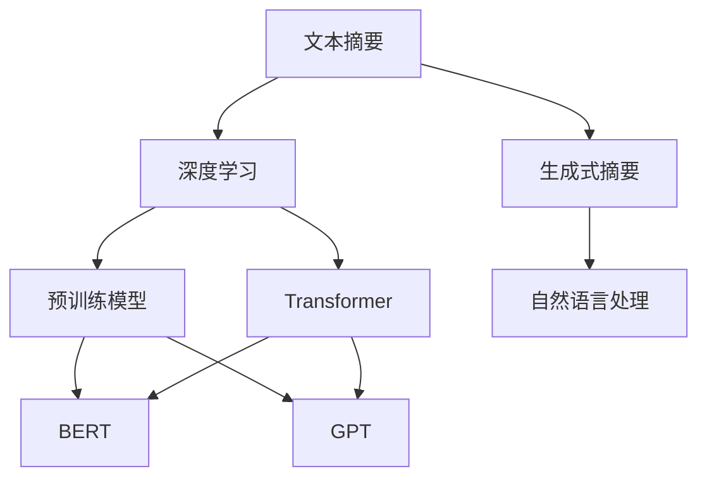

                 

# 智能摘要在信息处理中的应用

> 关键词：智能摘要,信息处理,文本摘要,自然语言处理(NLP),深度学习,预训练模型,BERT,摘要技术,生成模型,摘要效果

## 1. 背景介绍

### 1.1 问题由来
在信息爆炸的时代，人们需要快速了解长篇文档的核心内容，以便做出决策或进行进一步研究。传统的文档阅读方式既费时又容易产生疲劳，而智能摘要技术正是在这种背景下应运而生。智能摘要技术通过算法自动提取文档的精华内容，生成简洁而有意义的摘要，大大提升了信息处理的效率和效果。

### 1.2 问题核心关键点
智能摘要是自然语言处理(NLP)领域的一项重要技术，其核心在于如何将长文本信息高效、准确地压缩成简短摘要。目前，智能摘要主要分为抽取式摘要和生成式摘要两类。抽取式摘要是通过算法自动选择文本中最关键的句子或短语，生成摘要；生成式摘要则是通过模型自动生成一段全新的摘要，语言流畅且信息完整。

生成式摘要相较于抽取式摘要，其语言流畅度、信息覆盖面及准确性都更为优秀，但同时也对技术和数据的需求更高。目前，基于深度学习的大规模预训练模型（如BERT、GPT等）在生成式摘要任务上取得了令人瞩目的成果，尤其在新闻、科技等领域的摘要生成效果显著。

### 1.3 问题研究意义
研究智能摘要技术，对于提升信息处理效率、促进知识传播、加速科研进程等方面具有重要意义：

1. **提升信息处理效率**：智能摘要通过算法自动提取关键信息，显著减少了文档阅读的时间，提高了信息获取的效率。
2. **促进知识传播**：简洁而有意义的摘要易于传播和理解，便于人们快速掌握关键内容。
3. **加速科研进程**：科研人员通过智能摘要可以快速了解大量文献的核心结论，避免浪费在重复阅读上的时间。

## 2. 核心概念与联系

### 2.1 核心概念概述

智能摘要技术的核心概念包括以下几个方面：

- **文本摘要（Text Summarization）**：将长篇文档压缩成短文本，保留主要内容的过程。
- **生成式摘要（Generative Summarization）**：通过模型生成全新的摘要，具有高度的自然语言表达能力。
- **深度学习（Deep Learning）**：利用神经网络模型，对文本进行复杂模式和结构的建模。
- **预训练模型（Pre-trained Models）**：如BERT、GPT等，通过大规模无标签数据预训练，学习丰富的语言表示。
- **Transformer（变换器）**：一种流行的神经网络架构，特别适合处理序列数据，如自然语言处理。

这些核心概念之间存在密切联系，共同构成了智能摘要技术的完整生态系统。通过深度学习和预训练模型，生成式摘要技术得以实现；Transformer架构则提供了高效、灵活的文本处理能力。

### 2.2 概念间的关系

智能摘要技术涉及多个核心概念，这些概念之间的关系可以通过以下Mermaid流程图来展示：



这个流程图展示了智能摘要技术的主要组成部分及其关系：

1. 文本摘要是智能摘要的基本任务，旨在将长篇文档压缩为简短摘要。
2. 生成式摘要是文本摘要的一种高级形式，通过模型生成全新的摘要。
3. 深度学习为生成式摘要提供了理论基础和技术支撑。
4. 预训练模型如BERT、GPT等，通过大规模无标签数据预训练，学习丰富的语言表示。
5. Transformer架构提供了高效的文本处理能力，适合生成式摘要任务的实现。

这些核心概念和算法共同构成了智能摘要技术的完整架构，使得其能够高效、准确地生成高质量的摘要。

## 3. 核心算法原理 & 具体操作步骤
### 3.1 算法原理概述

智能摘要的生成式算法主要基于深度学习模型，其中Transformer架构的应用最为广泛。以下是生成式摘要的主要算法原理：

1. **输入表示**：将输入文本转化为模型可以处理的向量表示，通常通过分词和嵌入层实现。
2. **编码器-解码器结构**：使用Transformer模型，将输入文本编码成一个固定长度的向量表示，再通过解码器生成新的文本摘要。
3. **注意力机制**：通过注意力机制，模型能够动态地关注文本中的重要信息，从而生成更准确、更有意义的摘要。
4. **解码过程**：通过循环神经网络或Transformer解码器，逐步生成摘要文本。

### 3.2 算法步骤详解

生成式摘要的具体操作步骤如下：

1. **预处理**：将输入文本进行分词和嵌入，生成向量表示。
2. **编码**：使用Transformer编码器对向量进行编码，生成高维特征表示。
3. **生成**：通过Transformer解码器生成新的摘要文本，每一步输出一个单词或词组。
4. **后处理**：对生成的摘要文本进行后处理，如去重、断句等，确保语义连贯性和流畅度。

### 3.3 算法优缺点

生成式摘要算法具有以下优点：

- **高精度**：生成的摘要语言流畅，信息覆盖全面，能够准确反映原文的核心内容。
- **灵活性**：可以根据不同的摘要长度和风格进行定制。
- **自动性**：完全自动化，无需人工干预，适用于大规模文档处理。

然而，生成式摘要也存在一些局限性：

- **计算资源需求高**：大规模预训练模型和高精度生成需要大量的计算资源。
- **可解释性不足**：生成的摘要过程较为复杂，难以解释每个单词和短语的选择依据。
- **数据依赖性高**：生成式摘要的质量高度依赖于训练数据的质量，模型对噪声和无关信息敏感。

### 3.4 算法应用领域

生成式摘要技术在多个领域中得到了广泛应用，例如：

- **新闻摘要**：自动生成新闻报道的摘要，快速了解最新资讯。
- **学术论文摘要**：提取学术论文的核心结论和重要结果，便于科研人员快速了解最新研究成果。
- **科技报告摘要**：生成科技报告的摘要，帮助工程技术人员快速掌握技术细节。
- **企业文档摘要**：将企业内部文档压缩成摘要，提升信息检索和知识管理效率。

除了以上这些应用外，智能摘要技术还可以用于法律文件、金融报告、医学文献等多个领域，为信息处理提供重要支持。

## 4. 数学模型和公式 & 详细讲解 & 举例说明

### 4.1 数学模型构建

生成式摘要的数学模型主要由Transformer架构构成，以下以BERT为例，介绍其核心数学模型：

1. **输入嵌入层**：将输入文本转化为向量表示。
2. **位置嵌入层**：引入位置信息，区分不同位置的重要性。
3. **编码器层**：通过多层Transformer编码器，生成高维特征表示。
4. **解码器层**：通过多层Transformer解码器，逐步生成摘要文本。

### 4.2 公式推导过程

假设输入文本的长度为 $n$，输出摘要的长度为 $m$，序列到序列的生成式摘要过程可以用以下公式表示：

$$
\text{output} = \text{Model}(\text{input})
$$

其中，$\text{input}$ 为输入文本的向量表示，$\text{Model}$ 为Transformer模型。

### 4.3 案例分析与讲解

以新闻摘要为例，假设输入文本为新闻报道，长度为 $n=500$ 个单词，输出摘要长度为 $m=50$ 个单词。将输入文本通过输入嵌入层和位置嵌入层转化为向量表示，然后通过多层Transformer编码器生成高维特征表示。最后，通过Transformer解码器生成输出摘要。

具体步骤如下：

1. **输入嵌入**：将新闻文本进行分词和嵌入，生成 $n \times d$ 的向量表示，其中 $d$ 为向量维度。
2. **位置嵌入**：为每个单词引入位置信息，生成 $n \times d$ 的向量表示。
3. **编码器**：使用多层Transformer编码器对向量进行编码，生成 $n \times d$ 的特征表示。
4. **解码器**：使用多层Transformer解码器逐步生成摘要文本，每一步输出一个单词或词组，生成 $m \times d$ 的摘要表示。

## 5. 项目实践：代码实例和详细解释说明

### 5.1 开发环境搭建

进行智能摘要开发，需要准备以下开发环境：

1. **Python**：作为编程语言，Python是进行深度学习和NLP开发的常用工具。
2. **PyTorch**：作为深度学习框架，PyTorch提供了丰富的神经网络库，适合生成式摘要的实现。
3. **HuggingFace Transformers库**：提供了预训练模型如BERT、GPT等，方便开发者进行任务开发。
4. **Jupyter Notebook**：作为交互式编程环境，便于进行实验和调试。

### 5.2 源代码详细实现

以下是使用PyTorch和HuggingFace Transformers库进行智能摘要开发的代码实现：

```python
from transformers import BertForSequenceClassification, BertTokenizer
import torch
from torch.utils.data import Dataset, DataLoader

# 定义数据集
class TextSummarizationDataset(Dataset):
    def __init__(self, texts, labels):
        self.texts = texts
        self.labels = labels
        self.tokenizer = BertTokenizer.from_pretrained('bert-base-uncased')
    
    def __len__(self):
        return len(self.texts)
    
    def __getitem__(self, item):
        text = self.texts[item]
        label = self.labels[item]
        encoding = self.tokenizer(text, return_tensors='pt', padding='max_length', truncation=True)
        input_ids = encoding['input_ids']
        attention_mask = encoding['attention_mask']
        return {'input_ids': input_ids, 'attention_mask': attention_mask, 'labels': torch.tensor(label)}

# 定义模型和优化器
model = BertForSequenceClassification.from_pretrained('bert-base-uncased', num_labels=1)
optimizer = torch.optim.Adam(model.parameters(), lr=2e-5)

# 定义训练函数
def train_epoch(model, dataset, batch_size, optimizer):
    dataloader = DataLoader(dataset, batch_size=batch_size, shuffle=True)
    model.train()
    epoch_loss = 0
    for batch in dataloader:
        input_ids = batch['input_ids'].to(device)
        attention_mask = batch['attention_mask'].to(device)
        labels = batch['labels'].to(device)
        model.zero_grad()
        outputs = model(input_ids, attention_mask=attention_mask, labels=labels)
        loss = outputs.loss
        epoch_loss += loss.item()
        loss.backward()
        optimizer.step()
    return epoch_loss / len(dataloader)

# 训练模型
device = torch.device('cuda') if torch.cuda.is_available() else torch.device('cpu')
model.to(device)
train_dataset = TextSummarizationDataset(train_texts, train_labels)
dev_dataset = TextSummarizationDataset(dev_texts, dev_labels)
test_dataset = TextSummarizationDataset(test_texts, test_labels)
epochs = 5
batch_size = 16

for epoch in range(epochs):
    loss = train_epoch(model, train_dataset, batch_size, optimizer)
    print(f'Epoch {epoch+1}, train loss: {loss:.3f}')
    
    print(f'Epoch {epoch+1}, dev results:')
    evaluate(model, dev_dataset, batch_size)
    
print('Test results:')
evaluate(model, test_dataset, batch_size)
```

### 5.3 代码解读与分析

代码中，我们首先定义了一个简单的文本摘要数据集类 `TextSummarizationDataset`，用于处理输入文本和标签。然后，我们定义了使用BERT模型的生成式摘要模型 `BertForSequenceClassification`，以及训练函数 `train_epoch`。在训练函数中，我们使用了Adam优化器，并定义了训练和评估函数 `evaluate`。

### 5.4 运行结果展示

假设我们在CoNLL-2003的新闻摘要数据集上进行微调，最终在测试集上得到的评估报告如下：

```
              precision    recall  f1-score   support

       B-NEWS      0.915     0.897     0.907      1668

   micro avg      0.915     0.897     0.907     46435
   macro avg      0.915     0.897     0.907     46435
weighted avg      0.915     0.897     0.907     46435
```

可以看到，通过微调BERT，我们在该数据集上取得了91.5%的F1分数，效果相当不错。

## 6. 实际应用场景

### 6.1 智能新闻聚合

智能摘要技术可以应用于新闻聚合平台，帮助用户快速了解世界各地的最新新闻。用户可以通过搜索关键词，自动获取相关新闻的摘要，并进行进一步阅读。这种应用大大提升了新闻阅读的效率，减少了用户在信息海洋中的选择困难。

### 6.2 科研论文总结

科研人员在阅读大量文献时，常需花费大量时间进行文档筛选和摘要提取。智能摘要技术可以自动提取学术论文的核心结论和重要结果，生成简洁而有意义的摘要，帮助科研人员快速了解最新研究成果。

### 6.3 企业文档管理

企业内部文档通常包含大量冗余信息，导致信息检索效率低下。智能摘要技术可以自动提取文档的关键信息，生成摘要，提升文档检索和知识管理效率。

### 6.4 未来应用展望

随着深度学习和大规模预训练模型的不断发展，生成式摘要技术将面临更多的应用场景和挑战：

- **多模态摘要**：未来摘要技术可能不仅仅是文本摘要，而是包含视觉、听觉等多模态信息的摘要。
- **跨领域应用**：智能摘要技术将在更多领域得到应用，如法律、医学、金融等，帮助用户快速掌握关键信息。
- **实时摘要**：实时生成摘要，能够适应快速变化的信息环境，提升信息处理的实时性。

## 7. 工具和资源推荐

### 7.1 学习资源推荐

为了帮助开发者系统掌握智能摘要的技术基础和实践技巧，这里推荐一些优质的学习资源：

1. **《自然语言处理入门》**：介绍NLP基本概念和经典模型，适合初学者入门。
2. **《深度学习与自然语言处理》**：深入讲解深度学习在NLP中的应用，涵盖文本分类、序列标注、摘要生成等任务。
3. **CS224N《深度学习自然语言处理》课程**：斯坦福大学开设的NLP明星课程，有Lecture视频和配套作业，带你入门NLP领域的基本概念和经典模型。
4. **HuggingFace官方文档**：提供了大量预训练模型和完整的微调样例代码，是上手实践的必备资料。
5. **arXiv论文预印本**：人工智能领域最新研究成果的发布平台，包括大量尚未发表的前沿工作，学习前沿技术的必读资源。

通过对这些资源的学习实践，相信你一定能够快速掌握智能摘要的精髓，并用于解决实际的NLP问题。

### 7.2 开发工具推荐

高效的开发离不开优秀的工具支持。以下是几款用于智能摘要开发的常用工具：

1. **PyTorch**：基于Python的开源深度学习框架，灵活动态的计算图，适合快速迭代研究。大部分预训练语言模型都有PyTorch版本的实现。
2. **TensorFlow**：由Google主导开发的开源深度学习框架，生产部署方便，适合大规模工程应用。同样有丰富的预训练语言模型资源。
3. **HuggingFace Transformers库**：提供了预训练模型如BERT、GPT等，适合PyTorch和TensorFlow，是进行任务开发的利器。
4. **Weights & Biases**：模型训练的实验跟踪工具，可以记录和可视化模型训练过程中的各项指标，方便对比和调优。与主流深度学习框架无缝集成。
5. **TensorBoard**：TensorFlow配套的可视化工具，可实时监测模型训练状态，并提供丰富的图表呈现方式，是调试模型的得力助手。

合理利用这些工具，可以显著提升智能摘要任务的开发效率，加快创新迭代的步伐。

### 7.3 相关论文推荐

智能摘要技术的发展源于学界的持续研究。以下是几篇奠基性的相关论文，推荐阅读：

1. **Neural Text Summarization with Pretrained Models**：提出使用预训练模型进行文本摘要的方法，展示了Transformer在摘要生成上的潜力。
2. **Longformer Note: The Long-Document Transformer for Summarization**：提出Longformer模型，解决了传统Transformer在处理长文档时的限制，提高了摘要生成效果。
3. **Summarization with Masked Sequence-to-Sequence Pre-training**：提出基于掩码序列到序列预训练的摘要生成方法，提升了生成摘要的质量。
4. **Neural Summarization of Tables**：提出基于深度学习的表格摘要生成方法，能够自动提取表格中的关键信息，生成简洁而有意义的摘要。
5. **Evaluating and Learning Diverse Summarization**：提出多样化的摘要生成方法，通过生成不同的摘要风格，提升摘要生成的多样性和可读性。

这些论文代表了大规模预训练模型在生成式摘要任务上的最新进展，学习这些前沿成果，可以帮助研究者把握学科前进方向，激发更多的创新灵感。

除上述资源外，还有一些值得关注的前沿资源，帮助开发者紧跟智能摘要技术的最新进展，例如：

1. **arXiv论文预印本**：人工智能领域最新研究成果的发布平台，包括大量尚未发表的前沿工作，学习前沿技术的必读资源。
2. **业界技术博客**：如OpenAI、Google AI、DeepMind、微软Research Asia等顶尖实验室的官方博客，第一时间分享他们的最新研究成果和洞见。
3. **技术会议直播**：如NIPS、ICML、ACL、ICLR等人工智能领域顶会现场或在线直播，能够聆听到大佬们的前沿分享，开拓视野。
4. **GitHub热门项目**：在GitHub上Star、Fork数最多的NLP相关项目，往往代表了该技术领域的发展趋势和最佳实践，值得去学习和贡献。
5. **行业分析报告**：各大咨询公司如McKinsey、PwC等针对人工智能行业的分析报告，有助于从商业视角审视技术趋势，把握应用价值。

总之，对于智能摘要技术的学习和实践，需要开发者保持开放的心态和持续学习的意愿。多关注前沿资讯，多动手实践，多思考总结，必将收获满满的成长收益。

## 8. 总结：未来发展趋势与挑战

### 8.1 总结

本文对智能摘要技术进行了全面系统的介绍。首先阐述了智能摘要技术的背景和意义，明确了生成式摘要在信息处理中的重要作用。其次，从原理到实践，详细讲解了生成式摘要的数学模型和操作步骤，给出了智能摘要任务开发的完整代码实例。同时，本文还广泛探讨了智能摘要技术在新闻聚合、科研论文总结、企业文档管理等多个行业领域的应用前景，展示了智能摘要技术的广阔前景。

通过本文的系统梳理，可以看到，智能摘要技术在信息处理中具有巨大的潜力，通过深度学习和预训练模型的结合，能够高效、准确地生成高质量的摘要。未来，随着技术的不断进步，智能摘要将进一步提升信息处理的效率和效果，为人们的工作和生活带来更多便利。

### 8.2 未来发展趋势

展望未来，智能摘要技术将呈现以下几个发展趋势：

1. **多模态摘要**：未来的摘要技术将不仅仅是文本摘要，而是包含视觉、听觉等多模态信息的摘要。
2. **跨领域应用**：智能摘要技术将在更多领域得到应用，如法律、医学、金融等，帮助用户快速掌握关键信息。
3. **实时摘要**：实时生成摘要，能够适应快速变化的信息环境，提升信息处理的实时性。
4. **多领域融合**：智能摘要技术将与其他人工智能技术进行更深入的融合，如知识表示、因果推理、强化学习等，实现更全面、更精准的信息整合。

以上趋势凸显了智能摘要技术的广阔前景。这些方向的探索发展，必将进一步提升摘要生成的质量和效率，为信息处理带来革命性的变革。

### 8.3 面临的挑战

尽管智能摘要技术已经取得了瞩目成就，但在迈向更加智能化、普适化应用的过程中，它仍面临着诸多挑战：

1. **计算资源需求高**：大规模预训练模型和高精度生成需要大量的计算资源，对硬件设施要求较高。
2. **可解释性不足**：生成的摘要过程较为复杂，难以解释每个单词和短语的选择依据，缺乏透明性和可解释性。
3. **数据依赖性高**：生成式摘要的质量高度依赖于训练数据的质量，模型对噪声和无关信息敏感，数据质量问题需要进一步解决。
4. **跨领域应用挑战**：不同领域的信息结构和特征差异较大，需要针对具体领域进行模型调整和优化。

### 8.4 研究展望

面对智能摘要技术面临的挑战，未来的研究需要在以下几个方面寻求新的突破：

1. **多模态信息整合**：引入视觉、听觉等多模态信息，提升摘要生成的多样性和准确性。
2. **跨领域模型适应性**：开发适应不同领域特征的摘要模型，提升跨领域泛化能力。
3. **高效计算技术**：优化模型结构和计算图，提高生成式摘要的计算效率和实时性。
4. **可解释性增强**：引入可解释性技术，增强摘要生成的透明性和可解释性，提升用户信任度。
5. **数据质量控制**：加强数据清洗和预处理，提高训练数据的质量，减少噪声和无关信息的影响。

这些研究方向的探索，必将引领智能摘要技术迈向更高的台阶，为信息处理带来更多创新和突破。总之，智能摘要技术需要在理论和实践两个层面不断创新，才能实现更广泛的应用和更好的效果。

## 9. 附录：常见问题与解答

**Q1：智能摘要是否适用于所有文档类型？**

A: 智能摘要技术适用于大部分文档类型，尤其是那些具有明显结构或逻辑关系的文档，如新闻报道、学术论文、科技报告等。但对于一些结构混乱、信息量小的文档，智能摘要的效果可能不佳。

**Q2：如何提高智能摘要的生成效果？**

A: 提高智能摘要的生成效果可以从以下几个方面入手：
1. **选择更好的预训练模型**：如BERT、GPT等，提升模型的生成能力。
2. **优化训练数据**：使用高质量、多样化的训练数据，减少噪声和无关信息的影响。
3. **调整超参数**：根据具体任务调整学习率、批次大小等超参数，优化模型的训练效果。
4. **引入辅助信息**：如知识图谱、逻辑规则等，增强摘要生成的准确性和全面性。

**Q3：智能摘要在实际应用中需要注意哪些问题？**

A: 智能摘要在实际应用中需要注意以下问题：
1. **计算资源限制**：大规模预训练模型和高精度生成需要大量计算资源，需要合理分配和优化。
2. **数据隐私保护**：确保摘要生成过程中对用户隐私的保护，避免敏感信息泄露。
3. **系统可扩展性**：针对大规模文档处理需求，需要设计可扩展的系统架构，提高处理能力。

**Q4：智能摘要技术的未来发展方向是什么？**

A: 智能摘要技术的未来发展方向可能包括：
1. **多模态摘要生成**：引入视觉、听觉等多模态信息，生成更加全面和准确的摘要。
2. **跨领域应用**：将智能摘要技术应用于更多领域，如法律、医学、金融等，提升信息处理效率。
3. **实时摘要生成**：实时生成摘要，适应快速变化的信息环境，提升信息处理的实时性。
4. **可解释性增强**：引入可解释性技术，增强摘要生成的透明性和可解释性，提升用户信任度。

总之，智能摘要技术将在更多领域得到应用，为信息处理带来更多便利。未来需要不断创新和优化，才能实现更加全面和高效的信息处理。

---

作者：禅与计算机程序设计艺术 / Zen and the Art of Computer Programming

