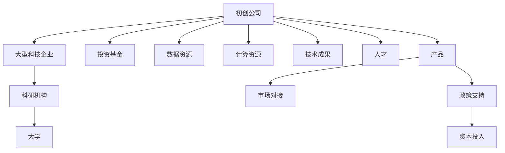
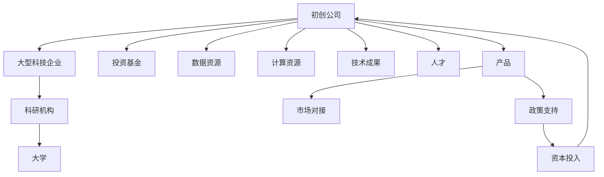

                 

# 构建充满活力的AI创业生态系统的挑战

## 1. 背景介绍

在人工智能(AI)蓬勃发展的今天，AI创业生态系统逐渐形成，成为推动AI技术创新和应用落地的重要力量。AI创业生态系统集成了技术创新、人才储备、资本投入、政策支持等多方面资源，形成了一个良性循环的生态圈。然而，随着技术的不断演进和应用场景的复杂化，构建和维护一个充满活力的AI创业生态系统也面临着诸多挑战。

### 1.1 问题由来

AI创业生态系统由多个组成部分构成，包括初创公司、大型科技企业、科研机构、大学、投资基金等。这些主体通过技术创新、产品开发、合作研究等方式，共同推动AI技术的发展和应用。然而，这些主体间的互动和合作机制尚未完全成熟，导致生态系统面临效率低、协作难、资金短缺、人才缺乏等诸多问题。

### 1.2 问题核心关键点

构建充满活力的AI创业生态系统，需要解决以下几个关键问题：

- **技术协同**：不同机构之间的技术协同合作，提高创新效率。
- **资源共享**：高效共享数据、计算资源、技术成果等，加速研发进程。
- **人才流动**：促进人才在各机构间自由流动，提高整体技术水平。
- **市场对接**：将AI技术转化为市场应用，实现商业化变现。
- **政策支持**：获得政策支持和资金投入，持续推动技术创新。

### 1.3 问题研究意义

构建充满活力的AI创业生态系统，对推动AI技术的产业化进程、促进经济社会发展具有重要意义：

- **加速技术创新**：通过协同合作，加速新技术的研发和落地。
- **优化资源配置**：高效共享资源，避免重复建设和资源浪费。
- **提升人才竞争力**：促进人才流动和培养，提升整体技术实力。
- **开拓市场应用**：将AI技术转化为现实生产力，推动经济发展。
- **形成创新生态**：形成良好的技术、人才、资金互动机制，增强生态系统的活力。

## 2. 核心概念与联系

### 2.1 核心概念概述

为更好地理解AI创业生态系统的构建与挑战，本节将介绍几个关键概念：

- **AI创业生态系统**：由初创公司、大型科技企业、科研机构、大学、投资基金等多方主体组成的互动系统。通过技术创新、产品开发、合作研究等方式，推动AI技术的发展和应用。

- **技术协同**：不同机构间在技术研发、产品开发、人才培养等方面的协同合作，共同推动技术进步。

- **资源共享**：高效共享数据、计算资源、技术成果等，加速研发进程。

- **人才流动**：人才在各机构间的自由流动，促进知识和技术传播。

- **市场对接**：将AI技术转化为市场应用，实现商业化变现。

- **政策支持**：获得政府和投资基金的支持，持续推动技术创新和应用。

- **资本投入**：获取足够的资金支持，用于技术研发和商业化开发。

这些核心概念之间存在着紧密的联系，共同构成了AI创业生态系统的整体框架。下面通过一个Mermaid流程图来展示这些概念之间的关系。



这个流程图展示了AI创业生态系统的主要组成部分及其关系：

1. 初创公司、大型科技企业、科研机构、大学等机构间进行技术协同、资源共享、人才流动。
2. 初创公司将技术成果转化为产品，并通过市场对接实现商业化。
3. 政府和投资基金提供政策支持和资金投入，促进生态系统的发展。

### 2.2 概念间的关系

这些核心概念之间存在着密切的联系，形成了AI创业生态系统的完整生态。通过以下Mermaid流程图来展示这些概念之间的联系：



这个综合流程图展示了AI创业生态系统的完整架构及其关键互动机制：

1. 各机构间通过技术协同、资源共享、人才流动，推动技术进步和产品开发。
2. 初创公司将技术成果转化为产品，并通过市场对接实现商业化。
3. 政府和投资基金提供政策支持和资金投入，促进生态系统的发展。

## 3. 核心算法原理 & 具体操作步骤

### 3.1 算法原理概述

AI创业生态系统的构建和维护，本质上是一个多主体互动的系统工程。其核心在于：

1. **技术协同**：通过跨机构的合作，提升技术创新效率。
2. **资源共享**：高效利用资源，加速研发进程。
3. **人才流动**：促进人才自由流动，提升整体技术实力。
4. **市场对接**：将技术转化为市场应用，实现商业化变现。
5. **政策支持**：获得政策支持和资金投入，推动技术创新。

### 3.2 算法步骤详解

AI创业生态系统的构建和维护，主要包括以下几个关键步骤：

**Step 1: 设计生态系统架构**
- 确定生态系统的主要组成部分，包括初创公司、大型科技企业、科研机构、大学等。
- 设计各主体间的互动机制，明确技术协同、资源共享、人才流动等协作方式。

**Step 2: 建立合作网络**
- 构建多个机构间的合作网络，通过合同、协议等方式明确各方责任和利益。
- 设立多个合作项目，促进技术、资源、人才的流动。

**Step 3: 优化资源配置**
- 优化数据、计算、技术等资源的配置，提高利用效率。
- 建立共享平台，促进资源的自由流动和高效利用。

**Step 4: 推动技术协同**
- 建立跨机构的研发团队，共同进行技术攻关。
- 共享技术成果，促进技术传播和应用。

**Step 5: 促进人才流动**
- 设立人才流动机制，促进人才在各机构间自由流动。
- 提供培训、学习机会，提升整体技术水平。

**Step 6: 实现市场对接**
- 通过合作项目和市场对接机制，将技术转化为市场应用。
- 建立市场反馈机制，不断改进技术应用效果。

**Step 7: 获取政策支持**
- 积极争取政府和投资基金的支持，获得政策资金保障。
- 参与国家科技计划，提升技术创新能力。

**Step 8: 评估和改进**
- 定期评估生态系统的运行效果，识别问题和改进点。
- 根据评估结果，不断优化生态系统结构和机制。

### 3.3 算法优缺点

构建充满活力的AI创业生态系统，具有以下优点：

- **加速技术创新**：通过跨机构的合作，提高技术创新效率。
- **优化资源配置**：高效利用资源，避免重复建设和资源浪费。
- **提升人才竞争力**：促进人才流动和培养，提升整体技术实力。
- **开拓市场应用**：将AI技术转化为现实生产力，推动经济发展。

同时，该方法也存在以下局限性：

- **协作难度**：不同机构间的沟通协调存在一定难度，影响协同效率。
- **资源共享问题**：资源共享机制不完善，可能导致资源利用不足。
- **人才流动瓶颈**：人才流动机制不健全，可能限制人才的自由流动。
- **市场对接风险**：市场对接机制不完善，可能导致技术转化效果不佳。
- **政策支持不足**：政策支持和资金投入不足，限制生态系统的发展。

尽管存在这些局限性，但就目前而言，通过跨机构合作构建AI创业生态系统，仍然是推动AI技术创新和应用落地的有效手段。未来相关研究的重点在于如何进一步优化协作机制、加强资源共享、促进人才流动、提高市场对接效率，同时获得更多的政策支持和资金投入。

### 3.4 算法应用领域

AI创业生态系统在多个领域已展现出广泛的应用前景：

- **医疗健康**：通过跨机构合作，推动医疗AI技术的发展和应用，提升医疗服务水平。
- **金融科技**：在金融领域，通过AI创业生态系统推动AI技术的应用，提升金融服务效率和风控能力。
- **智能制造**：在制造业，通过AI创业生态系统推动智能制造技术的发展和应用，提升生产效率和产品质量。
- **智慧城市**：在城市管理中，通过AI创业生态系统推动智慧城市建设，提升城市治理能力。
- **教育培训**：在教育领域，通过AI创业生态系统推动教育AI技术的发展和应用，提升教育质量。

## 4. 数学模型和公式 & 详细讲解 & 举例说明

### 4.1 数学模型构建

在AI创业生态系统中，涉及多个主体间的互动和资源配置。我们可以使用网络模型来描述这种互动关系。

假设生态系统中有 $n$ 个机构，记为 $A_1, A_2, ..., A_n$。各机构之间的互动关系可以用无向图 $G=(V,E)$ 来表示，其中 $V$ 是机构集合，$E$ 是互动边集合。边 $(A_i, A_j)$ 表示机构 $A_i$ 和 $A_j$ 之间有互动关系。

### 4.2 公式推导过程

为了描述各机构间的技术协同、资源共享、人才流动等关系，我们可以使用网络模型中的度、中心性等概念。

- **度**：表示机构在网络中的互动强度。机构 $A_i$ 的度 $d_i$ 定义为与其有互动关系的机构个数。
- **中心性**：表示机构在网络中的重要性。机构 $A_i$ 的中心性 $c_i$ 定义为与其他机构的互动强度之和。

基于这些概念，我们可以构建生态系统的数学模型。

### 4.3 案例分析与讲解

以下以医疗AI创业生态系统为例，展示如何使用网络模型描述生态系统中的互动关系。

假设一个医疗AI创业生态系统中有三个机构：初创公司 $A_1$、大型科技企业 $A_2$、科研机构 $A_3$。各机构间的互动关系如下：

- $A_1$ 与 $A_2$ 有合作研发项目，$(A_1, A_2)$ 为互动边。
- $A_2$ 提供数据资源支持 $A_1$，$(A_2, A_1)$ 为互动边。
- $A_3$ 提供技术支持 $A_1$，$(A_3, A_1)$ 为互动边。
- $A_1$ 与 $A_3$ 有人员交流机制，$(A_1, A_3)$ 为互动边。

构建无向图 $G=(V,E)$，其中 $V=\{A_1, A_2, A_3\}$，$E=\{(A_1, A_2), (A_2, A_1), (A_3, A_1), (A_1, A_3)\}$。

通过计算各机构的度 $d_i$ 和中心性 $c_i$，可以评估生态系统中各机构的重要性和互动强度。例如，$A_1$ 的度为 2，中心性为 3，表示 $A_1$ 与 $A_2$、$A_3$ 都有互动关系，且在网络中较为重要。

## 5. 项目实践：代码实例和详细解释说明

### 5.1 开发环境搭建

在进行AI创业生态系统构建的实践前，我们需要准备好开发环境。以下是使用Python进行网络图分析的开发环境配置流程：

1. 安装Anaconda：从官网下载并安装Anaconda，用于创建独立的Python环境。

2. 创建并激活虚拟环境：
```bash
conda create -n network-env python=3.8 
conda activate network-env
```

3. 安装相关库：
```bash
pip install networkx scipy matplotlib
```

4. 运行代码：
```bash
python network_analysis.py
```

完成上述步骤后，即可在`network-env`环境中进行网络图分析的实践。

### 5.2 源代码详细实现

以下是使用Python和NetworkX库构建和分析AI创业生态系统的示例代码：

```python
import networkx as nx
import scipy as sp

# 创建机构集合
institutions = ['A_1', 'A_2', 'A_3']

# 创建互动图
G = nx.Graph()
G.add_edges_from([('A_1', 'A_2'), ('A_2', 'A_1'), ('A_3', 'A_1'), ('A_1', 'A_3')])

# 计算各机构的度
degrees = nx.degree(G)

# 计算各机构的中心性
centrality = nx.eigenvector_centrality(G)

# 输出结果
print("机构度:", degrees)
print("机构中心性:", centrality)
```

### 5.3 代码解读与分析

让我们再详细解读一下关键代码的实现细节：

- `institutions`：定义机构集合。
- `G = nx.Graph()`：创建一个无向图 `G`。
- `G.add_edges_from()`：向图 `G` 中添加边，表示机构间的互动关系。
- `nx.degree(G)`：计算各机构的度。
- `nx.eigenvector_centrality(G)`：计算各机构的中心性。
- `print()`：输出结果。

## 6. 实际应用场景

### 6.1 智能医疗系统

在医疗领域，AI创业生态系统可以推动医疗AI技术的发展和应用，提升医疗服务水平。

具体而言，可以构建由初创公司、大型医院、科研机构等组成的AI医疗创业生态系统。初创公司负责提供前沿的AI技术，如疾病诊断、影像分析等；大型医院提供数据支持，参与实际应用测试；科研机构提供学术研究和技术支持。

通过跨机构的合作，可以实现技术、数据、人才的共享，提升医疗AI技术的创新和应用效果。例如，某初创公司开发的AI系统在诊断乳腺癌方面效果显著，通过与医院合作，将技术应用到实际诊疗中，显著提高了乳腺癌的诊断准确率。

### 6.2 金融科技平台

在金融领域，AI创业生态系统可以推动金融AI技术的发展和应用，提升金融服务效率和风控能力。

具体而言，可以构建由初创公司、大型银行、科技公司等组成的金融AI创业生态系统。初创公司负责提供金融数据分析、风险评估等技术；大型银行提供金融数据和实际应用场景；科技公司提供技术支持和平台建设。

通过跨机构的合作，可以实现技术、数据、人才的共享，提升金融AI技术的创新和应用效果。例如，某初创公司开发的AI系统在反欺诈方面效果显著，通过与银行合作，将技术应用到银行风控中，显著降低了金融欺诈的发生率。

### 6.3 智能制造系统

在制造业，AI创业生态系统可以推动智能制造技术的发展和应用，提升生产效率和产品质量。

具体而言，可以构建由初创公司、大型制造企业、科研机构等组成的智能制造创业生态系统。初创公司负责提供智能制造技术，如自动化生产、质量控制等；大型制造企业提供生产数据和实际应用场景；科研机构提供技术支持和学术研究。

通过跨机构的合作，可以实现技术、数据、人才的共享，提升智能制造技术的创新和应用效果。例如，某初创公司开发的AI系统在质量控制方面效果显著，通过与制造企业合作，将技术应用到生产管理中，显著提高了生产效率和产品质量。

### 6.4 智慧城市系统

在城市管理中，AI创业生态系统可以推动智慧城市建设，提升城市治理能力。

具体而言，可以构建由初创公司、政府部门、科研机构等组成的智慧城市创业生态系统。初创公司负责提供智慧城市技术，如城市交通管理、环境监测等；政府部门提供城市数据和政策支持；科研机构提供技术支持和学术研究。

通过跨机构的合作，可以实现技术、数据、人才的共享，提升智慧城市技术的创新和应用效果。例如，某初创公司开发的AI系统在城市交通管理方面效果显著，通过与政府部门合作，将技术应用到城市管理中，显著提高了交通运行效率。

## 7. 工具和资源推荐

### 7.1 学习资源推荐

为了帮助开发者系统掌握AI创业生态系统的构建和维护，这里推荐一些优质的学习资源：

1. 《网络科学导论》：介绍网络科学的基本概念和分析方法，适合初学者入门。
2. 《复杂网络：原理、算法与应用》：系统讲解复杂网络的原理、算法和应用，适合进阶学习。
3. 《数据科学导论》：讲解数据科学的基本概念和分析方法，适合了解数据在AI生态系统中的作用。
4. 《机器学习实战》：讲解机器学习的基本概念和实战案例，适合了解AI技术在实际应用中的应用。
5. 《深度学习框架实战》：讲解深度学习框架的使用方法，适合学习AI技术在实际项目中的应用。

通过对这些资源的学习实践，相信你一定能够快速掌握AI创业生态系统的构建和维护，并用于解决实际的AI技术问题。

### 7.2 开发工具推荐

高效的开发离不开优秀的工具支持。以下是几款用于AI创业生态系统构建和维护的常用工具：

1. Python：适合进行网络图分析和数据处理，拥有丰富的第三方库和框架。
2. NetworkX：Python中的网络图分析库，支持网络构建、分析、可视化等功能。
3. Scipy：Python中的科学计算库，提供矩阵计算、优化算法等功能。
4. Matplotlib：Python中的数据可视化库，支持绘制网络图和分析结果。
5. Jupyter Notebook：适合进行数据分析和模型实验，方便共享和学习。

合理利用这些工具，可以显著提升AI创业生态系统的构建和维护效率，加快创新迭代的步伐。

### 7.3 相关论文推荐

AI创业生态系统的发展得益于学界的持续研究。以下是几篇奠基性的相关论文，推荐阅读：

1. 《网络科学：原理、算法与应用》：讲解网络科学的基本概念和分析方法，适合了解生态系统的结构与演化。
2. 《复杂网络中的统计物理学》：介绍复杂网络中的统计物理学方法，适合理解生态系统中各主体的互动关系。
3. 《创新生态系统的设计：从生物到科技》：介绍创新生态系统的设计和案例，适合了解生态系统的构建机制。
4. 《网络演化中的社区结构》：分析网络演化中的社区结构，适合理解生态系统中各主体的协作模式。
5. 《AI创业生态系统的构建与优化》：研究AI创业生态系统的构建和优化方法，适合了解生态系统的实际应用。

这些论文代表了大生态系统构建与维护的研究方向，通过学习这些前沿成果，可以帮助研究者把握学科前进方向，激发更多的创新灵感。

除上述资源外，还有一些值得关注的前沿资源，帮助开发者紧跟AI创业生态系统的发展趋势，例如：

1. arXiv论文预印本：人工智能领域最新研究成果的发布平台，包括大量尚未发表的前沿工作，学习前沿技术的必读资源。
2. 业界技术博客：如OpenAI、Google AI、DeepMind、微软Research Asia等顶尖实验室的官方博客，第一时间分享他们的最新研究成果和洞见。
3. 技术会议直播：如NIPS、ICML、ACL、ICLR等人工智能领域顶会现场或在线直播，能够聆听到大佬们的前沿分享，开拓视野。
4. GitHub热门项目：在GitHub上Star、Fork数最多的AI创业生态系统相关项目，往往代表了该技术领域的发展趋势和最佳实践，值得去学习和贡献。
5. 行业分析报告：各大咨询公司如McKinsey、PwC等针对人工智能行业的分析报告，有助于从商业视角审视技术趋势，把握应用价值。

总之，对于AI创业生态系统的构建和维护，需要开发者保持开放的心态和持续学习的意愿。多关注前沿资讯，多动手实践，多思考总结，必将收获满满的成长收益。

## 8. 总结：未来发展趋势与挑战

### 8.1 总结

本文对AI创业生态系统的构建与挑战进行了全面系统的介绍。首先阐述了AI创业生态系统的研究背景和意义，明确了构建和维护生态系统对推动AI技术创新和应用落地的重要性。其次，从原理到实践，详细讲解了AI创业生态系统的核心算法和操作步骤，给出了构建AI创业生态系统的完整代码实例。同时，本文还广泛探讨了AI创业生态系统在多个领域的应用前景，展示了其广阔的应用前景。此外，本文精选了构建AI创业生态系统的各类学习资源，力求为读者提供全方位的技术指引。

通过本文的系统梳理，可以看到，构建充满活力的AI创业生态系统，对推动AI技术的产业化进程、促进经济社会发展具有重要意义。未来，伴随AI技术的不断演进和应用场景的复杂化，构建和维护AI创业生态系统仍将面临诸多挑战。但只有在不断优化协作机制、加强资源共享、促进人才流动、提高市场对接效率，同时获得更多的政策支持和资金投入，才能真正实现AI技术的创新和应用落地。

### 8.2 未来发展趋势

展望未来，AI创业生态系统将呈现以下几个发展趋势：

1. **技术协同增强**：通过跨机构的深度合作，提升技术创新效率，加速新科技的落地。
2. **资源共享优化**：优化数据、计算、技术等资源的配置，提高利用效率。
3. **人才流动加速**：促进人才在各机构间自由流动，提升整体技术实力。
4. **市场对接深化**：通过跨机构的合作，将AI技术转化为市场应用，实现商业化变现。
5. **政策支持增强**：获得政府和投资基金的更大支持，持续推动技术创新和应用。

### 8.3 面临的挑战

尽管AI创业生态系统已展现出广泛的应用前景，但在迈向更加智能化、普适化应用的过程中，仍面临诸多挑战：

1. **协作难度**：不同机构间的沟通协调存在一定难度，影响协同效率。
2. **资源共享问题**：资源共享机制不完善，可能导致资源利用不足。
3. **人才流动瓶颈**：人才流动机制不健全，可能限制人才的自由流动。
4. **市场对接风险**：市场对接机制不完善，可能导致技术转化效果不佳。
5. **政策支持不足**：政策支持和资金投入不足，限制生态系统的发展。

尽管存在这些挑战，但通过优化协作机制、加强资源共享、促进人才流动、提高市场对接效率，同时获得更多的政策支持和资金投入，AI创业生态系统必将在推动AI技术创新和应用落地方面发挥更大作用。

### 8.4 研究展望

面对AI创业生态系统所面临的挑战，未来的研究需要在以下几个方面寻求新的突破：

1. **优化协作机制**：通过建立更加紧密的合作网络，提升技术协同效率。
2. **加强资源共享**：优化资源配置，提高利用效率，建立共享平台。
3. **促进人才流动**：完善人才流动机制，促进知识和技术传播。
4. **提高市场对接效率**：优化市场对接机制，提升技术转化效果。
5. **获得更多政策支持**：积极争取政府和投资基金的支持，推动生态系统发展。

这些研究方向的探索，必将引领AI创业生态系统走向更高的台阶，为AI技术的产业化进程提供更有力的支持。面向未来，只有不断优化生态系统的协作机制和资源配置，加强人才流动和技术传播，提高市场对接效率，才能真正实现AI技术的创新和应用落地。

## 9. 附录：常见问题与解答

**Q1：构建AI创业生态系统需要哪些关键资源？**

A: 构建AI创业生态系统需要以下关键资源：

- **技术资源**：包括前沿技术、核心算法、开源框架等，是生态系统发展的基石。
- **数据资源**：包括行业数据、研究数据、公开数据等，是技术应用的基础。
- **人才资源**：包括科研人才、技术人才、管理人才等，是创新发展的核心。
- **资金资源**：包括投资基金、政府拨款、合作项目等，是持续发展的保障。
- **政策资源**：包括政府政策、行业标准、法律法规等，是生态系统健康发展的保障。

**Q2：如何优化AI创业生态系统的协作机制？**

A: 优化AI创业生态系统的协作机制，可以从以下几个方面入手：

- **建立长期合作协议**：通过签订合作协议，明确各机构的责任和利益，建立长期稳定的合作关系。
- **设立联合研发团队**：组建跨机构的研发团队，共同进行技术攻关和产品开发。
- **构建共享平台**：建立技术、数据、人才等共享平台，促进资源高效利用。
- **定期沟通交流**：定期举办技术交流会、研讨会等，促进信息共享和知识传播。
- **共同制定标准**：制定统一的技术标准和规范，确保各机构之间的数据和接口兼容。

**Q3：如何优化AI创业生态系统的资源配置？**

A: 优化AI创业生态系统的资源配置，可以从以下几个方面入手：

- **建立资源共享机制**：通过建立共享平台和机制，促进资源的高效利用。
- **优化资源分配策略**：根据各机构的贡献和需求，合理分配数据、计算、技术等资源。
- **引入外部资源**：引入外部资源，如云计算、边缘计算等，提高资源配置灵活性。
- **持续优化资源配置**：根据项目进展和需求变化，持续优化资源配置，提高利用效率。

