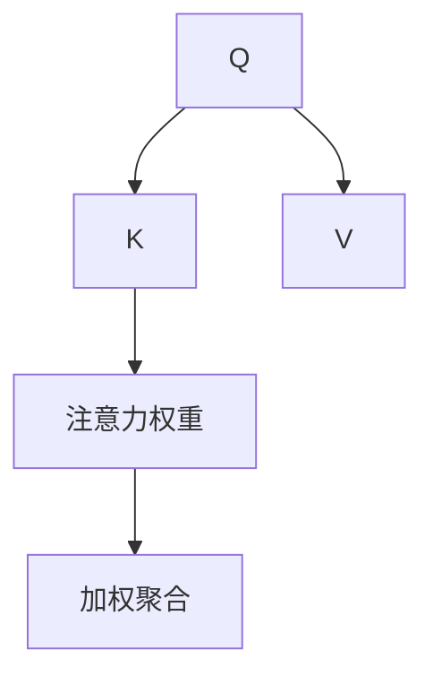
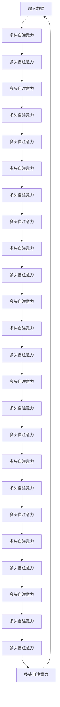

                 

# 注意力机制中的Q、K、V

> 关键词：注意力机制, 自注意力, Q, K, V, 多头自注意力, 前向传播, 反向传播, 内存-计算效率

## 1. 背景介绍

### 1.1 问题由来

随着深度学习技术的发展，深度神经网络（DNN）已成为处理复杂数据的重要工具。然而，传统DNN模型往往需要处理大量的数据，并且需要占用大量的计算资源。注意力机制（Attention Mechanism）作为一种有效的数据处理方式，通过将输入数据的不同部分加权组合，解决了这一问题。在自然语言处理（NLP）领域，注意力机制被广泛应用于机器翻译、问答系统、文本生成等任务，并取得了显著的成果。

### 1.2 问题核心关键点

注意力机制是一种能够根据输入数据的重要性对输入数据进行加权聚合的机制。它通过计算输入数据中每个元素的权重（注意力权重），来确定哪些元素对输出结果贡献更大。注意力机制的核心在于计算注意力权重，这通常包括三个步骤：

1. **计算查询向量**：使用输入数据的不同部分作为查询向量，通常通过前向传播计算得到。
2. **计算键值向量**：使用输入数据的不同部分作为键值向量，通常也通过前向传播计算得到。
3. **计算注意力权重**：通过计算查询向量和键值向量之间的相似度（通常使用点积或余弦相似度），得到注意力权重。

这些步骤通常在注意力头（Attention Head）中进行，每个注意力头分别计算不同的查询、键和值向量，并最终通过加权和得到注意力输出。

### 1.3 问题研究意义

注意力机制在深度学习中的重要性不言而喻，它不仅提高了模型处理大规模数据的能力，还大大减少了计算资源的消耗。特别是在自然语言处理领域，注意力机制能够有效地解决语义信息的传递问题，使得模型能够更好地理解文本的上下文信息。然而，尽管注意力机制已经被广泛应用，但其核心原理和具体实现仍然存在一些需要进一步探讨的问题。本文将详细探讨注意力机制中的Q、K、V三个关键组件，以期为读者提供更深入的理解和应用指导。

## 2. 核心概念与联系

### 2.1 核心概念概述

为了更好地理解注意力机制，我们首先需要了解Q、K、V三个关键组件。Q、K、V分别代表查询向量、键向量和值向量，它们在注意力机制中扮演着不同的角色：

- **Q**：查询向量，用于计算注意力权重。通常由输入数据的不同部分通过前向传播计算得到。
- **K**：键向量，用于计算注意力权重。也由输入数据的不同部分通过前向传播计算得到。
- **V**：值向量，用于根据注意力权重加权聚合。同样由输入数据的不同部分通过前向传播计算得到。

注意力机制的核心在于计算查询向量Q和键向量K之间的相似度，然后根据相似度计算注意力权重，并使用注意力权重对值向量V进行加权聚合，得到最终输出。

### 2.2 概念间的关系

注意力机制中的Q、K、V三个组件之间存在着紧密的联系，它们共同构成了注意力机制的核心。下面通过几个Mermaid流程图来展示这些组件之间的逻辑关系：



这个流程图展示了Q、K、V三个组件在注意力机制中的角色和关系：

1. Q和K通过计算相似度得到注意力权重，用于对V进行加权聚合。
2. 注意力权重表示了Q和K之间的相关性，决定了V中哪些部分对输出贡献更大。
3. 通过加权聚合，Q、K、V三个组件的输出被组合成最终的注意力输出。

### 2.3 核心概念的整体架构

为了更好地理解注意力机制，我们还需要了解其整体架构。下面通过一个综合的流程图来展示注意力机制的整体架构：



这个综合流程图展示了多头自注意力的整体架构：

1. 输入数据经过多头自注意力层，得到多个注意力头。
2. 每个注意力头分别计算Q、K、V，并根据注意力权重进行加权聚合。
3. 所有注意力头的输出被拼接起来，得到最终的注意力输出。

这个架构能够更好地处理复杂的数据结构和上下文信息，是当前自然语言处理领域的主流方法之一。

## 3. 核心算法原理 & 具体操作步骤

### 3.1 算法原理概述

注意力机制的核心在于计算注意力权重，这一过程通常包括三个步骤：

1. **计算查询向量Q**：使用输入数据的不同部分作为查询向量，通常通过前向传播计算得到。
2. **计算键向量K**：使用输入数据的不同部分作为键向量，通常也通过前向传播计算得到。
3. **计算注意力权重**：通过计算查询向量和键向量之间的相似度（通常使用点积或余弦相似度），得到注意力权重。

这三个步骤通常在注意力头（Attention Head）中进行，每个注意力头分别计算不同的查询、键和值向量，并最终通过加权和得到注意力输出。

### 3.2 算法步骤详解

下面以一个简单的注意力机制为例，详细介绍其计算过程。

假设我们有一个长度为4的输入序列 $x=[x_1, x_2, x_3, x_4]$，我们需要计算一个长度为2的注意力头 $h_1$ 的输出 $y_1$。

1. **计算查询向量Q**：
   $$
   Q = \text{Softmax}(QW)^T \cdot X
   $$
   其中 $QW$ 为查询向量权重矩阵，$X$ 为输入序列矩阵，$\text{Softmax}$ 为softmax函数。

2. **计算键向量K**：
   $$
   K = KW \cdot X
   $$
   其中 $KW$ 为键向量权重矩阵，$X$ 为输入序列矩阵。

3. **计算注意力权重**：
   $$
   A = Q \cdot K^T
   $$
   其中 $A$ 为注意力权重矩阵，$Q$ 为查询向量矩阵，$K^T$ 为键向量矩阵的转置。

4. **计算注意力输出**：
   $$
   V = VW \cdot X
   $$
   $$
   y_1 = \text{Softmax}(A) \cdot V
   $$
   其中 $V$ 为值向量矩阵，$VW$ 为值向量权重矩阵，$y_1$ 为注意力头 $h_1$ 的输出。

### 3.3 算法优缺点

注意力机制的优点在于其能够处理大规模的数据，并且能够灵活地组合输入数据的不同部分，得到更加准确的输出结果。但是，注意力机制的计算复杂度较高，需要占用大量的计算资源，并且在处理长序列时，可能会出现梯度消失或梯度爆炸的问题。

### 3.4 算法应用领域

注意力机制在自然语言处理领域有着广泛的应用，包括机器翻译、文本摘要、问答系统、文本生成等任务。其优点在于能够有效地解决语义信息的传递问题，使得模型能够更好地理解文本的上下文信息，从而提高模型的性能。

## 4. 数学模型和公式 & 详细讲解 & 举例说明

### 4.1 数学模型构建

为了更好地理解注意力机制的数学模型，我们首先定义一些关键变量：

- $Q$：查询向量矩阵，大小为 $(n, d_q)$，其中 $n$ 为输入序列的长度，$d_q$ 为查询向量的维度。
- $K$：键向量矩阵，大小为 $(n, d_k)$，其中 $d_k$ 为键向量的维度。
- $V$：值向量矩阵，大小为 $(n, d_v)$，其中 $d_v$ 为值向量的维度。
- $A$：注意力权重矩阵，大小为 $(n, n)$。
- $y_1$：注意力头 $h_1$ 的输出，大小为 $(n, d_v)$。

注意力机制的数学模型可以表示为：

$$
Q = QW \cdot X
$$
$$
K = KW \cdot X
$$
$$
A = Q \cdot K^T
$$
$$
y_1 = \text{Softmax}(A) \cdot V
$$

其中 $QW$ 为查询向量权重矩阵，$KW$ 为键向量权重矩阵，$VW$ 为值向量权重矩阵，$X$ 为输入序列矩阵。

### 4.2 公式推导过程

为了更好地理解注意力机制的公式推导过程，我们以点积注意力为例，详细推导其计算过程。

假设输入序列 $x=[x_1, x_2, x_3, x_4]$，查询向量 $Q=[q_1, q_2, q_3, q_4]$，键向量 $K=[k_1, k_2, k_3, k_4]$，值向量 $V=[v_1, v_2, v_3, v_4]$。

1. **计算查询向量Q**：
   $$
   Q = QW \cdot X = \begin{bmatrix} q_1 & q_2 & q_3 & q_4 \end{bmatrix} \cdot \begin{bmatrix} x_1 \\ x_2 \\ x_3 \\ x_4 \end{bmatrix}
   $$

2. **计算键向量K**：
   $$
   K = KW \cdot X = \begin{bmatrix} k_1 & k_2 & k_3 & k_4 \end{bmatrix} \cdot \begin{bmatrix} x_1 \\ x_2 \\ x_3 \\ x_4 \end{bmatrix}
   $$

3. **计算注意力权重**：
   $$
   A = Q \cdot K^T = \begin{bmatrix} q_1 & q_2 & q_3 & q_4 \end{bmatrix} \cdot \begin{bmatrix} k_1 & k_2 & k_3 & k_4 \\ k_1 & k_2 & k_3 & k_4 \\ k_1 & k_2 & k_3 & k_4 \\ k_1 & k_2 & k_3 & k_4 \end{bmatrix}
   $$

4. **计算注意力输出**：
   $$
   y_1 = \text{Softmax}(A) \cdot V = \begin{bmatrix} y_{11} \\ y_{12} \\ y_{13} \\ y_{14} \end{bmatrix}
   $$

### 4.3 案例分析与讲解

假设我们有一个长度为4的输入序列 $x=[x_1, x_2, x_3, x_4]$，我们需要计算一个长度为2的注意力头 $h_1$ 的输出 $y_1$。

1. **计算查询向量Q**：
   $$
   Q = QW \cdot X = \begin{bmatrix} q_1 & q_2 & q_3 & q_4 \end{bmatrix} \cdot \begin{bmatrix} x_1 \\ x_2 \\ x_3 \\ x_4 \end{bmatrix} = \begin{bmatrix} q_1x_1 + q_2x_2 + q_3x_3 + q_4x_4 \end{bmatrix}
   $$

2. **计算键向量K**：
   $$
   K = KW \cdot X = \begin{bmatrix} k_1 & k_2 & k_3 & k_4 \end{bmatrix} \cdot \begin{bmatrix} x_1 \\ x_2 \\ x_3 \\ x_4 \end{bmatrix} = \begin{bmatrix} k_1x_1 + k_2x_2 + k_3x_3 + k_4x_4 \end{bmatrix}
   $$

3. **计算注意力权重**：
   $$
   A = Q \cdot K^T = \begin{bmatrix} q_1 & q_2 & q_3 & q_4 \end{bmatrix} \cdot \begin{bmatrix} k_1 & k_2 & k_3 & k_4 \\ k_1 & k_2 & k_3 & k_4 \\ k_1 & k_2 & k_3 & k_4 \\ k_1 & k_2 & k_3 & k_4 \end{bmatrix} = \begin{bmatrix} q_1k_1 & q_1k_2 & q_1k_3 & q_1k_4 \\ q_2k_1 & q_2k_2 & q_2k_3 & q_2k_4 \\ q_3k_1 & q_3k_2 & q_3k_3 & q_3k_4 \\ q_4k_1 & q_4k_2 & q_4k_3 & q_4k_4 \end{bmatrix}
   $$

4. **计算注意力输出**：
   $$
   y_1 = \text{Softmax}(A) \cdot V = \begin{bmatrix} y_{11} \\ y_{12} \\ y_{13} \\ y_{14} \end{bmatrix} = \begin{bmatrix} \text{Softmax}(q_1k_1 + q_2k_2 + q_3k_3 + q_4k_4) \cdot v_1 \\ \text{Softmax}(q_1k_1 + q_2k_2 + q_3k_3 + q_4k_4) \cdot v_2 \\ \text{Softmax}(q_1k_1 + q_2k_2 + q_3k_3 + q_4k_4) \cdot v_3 \\ \text{Softmax}(q_1k_1 + q_2k_2 + q_3k_3 + q_4k_4) \cdot v_4 \end{bmatrix}
   $$

通过这个案例，我们可以更好地理解注意力机制的计算过程。在实际应用中，我们还可以使用其他类型的注意力机制，如多头注意力、自注意力等，来更好地处理复杂的数据结构和上下文信息。

## 5. 项目实践：代码实例和详细解释说明

### 5.1 开发环境搭建

在进行注意力机制实践前，我们需要准备好开发环境。以下是使用Python进行PyTorch开发的环境配置流程：

1. 安装Anaconda：从官网下载并安装Anaconda，用于创建独立的Python环境。

2. 创建并激活虚拟环境：
```bash
conda create -n pytorch-env python=3.8 
conda activate pytorch-env
```

3. 安装PyTorch：根据CUDA版本，从官网获取对应的安装命令。例如：
```bash
conda install pytorch torchvision torchaudio cudatoolkit=11.1 -c pytorch -c conda-forge
```

4. 安装Transformers库：
```bash
pip install transformers
```

5. 安装各类工具包：
```bash
pip install numpy pandas scikit-learn matplotlib tqdm jupyter notebook ipython
```

完成上述步骤后，即可在`pytorch-env`环境中开始注意力机制的实践。

### 5.2 源代码详细实现

下面我们以一个简单的多头自注意力机制为例，给出使用PyTorch和Transformers库进行注意力机制的实现代码。

首先，定义多头自注意力层的函数：

```python
import torch
import torch.nn as nn
import torch.nn.functional as F
from transformers import BertSelfAttention

class MultiHeadAttention(nn.Module):
    def __init__(self, d_model, num_heads):
        super(MultiHeadAttention, self).__init__()
        self.num_heads = num_heads
        self.d_model = d_model
        self.depth = d_model // num_heads
        self.W_Q = nn.Linear(d_model, d_model)
        self.W_K = nn.Linear(d_model, d_model)
        self.W_V = nn.Linear(d_model, d_model)
        self.fc = nn.Linear(d_model, d_model)

    def forward(self, X):
        B, T, d_model = X.size()
        Q = self.W_Q(X).split(self.depth, dim=2)
        K = self.W_K(X).split(self.depth, dim=2)
        V = self.W_V(X).split(self.depth, dim=2)
        A = torch.bmm(Q, K.transpose(1, 2)) / math.sqrt(self.depth)
        A = F.softmax(A, dim=-1)
        V = torch.bmm(V, A.transpose(1, 2))
        V = V.transpose(1, 2).contiguous().view(B, T, d_model)
        X = self.fc(V)
        return X
```

然后，定义注意力机制层：

```python
class AttentionLayer(nn.Module):
    def __init__(self, d_model, num_heads):
        super(AttentionLayer, self).__init__()
        self.multi_head_attn = MultiHeadAttention(d_model, num_heads)

    def forward(self, X):
        X = self.multi_head_attn(X)
        return X
```

最后，构建一个简单的注意力机制模型：

```python
class AttentionModel(nn.Module):
    def __init__(self, input_dim, hidden_dim, num_heads, num_layers, dropout):
        super(AttentionModel, self).__init__()
        self.d_model = hidden_dim
        self.num_heads = num_heads
        self.num_layers = num_layers
        self.dropout = dropout
        self.layers = nn.ModuleList([AttentionLayer(self.d_model, self.num_heads) for _ in range(self.num_layers)])
        self.fc = nn.Linear(hidden_dim, input_dim)

    def forward(self, X):
        for i in range(self.num_layers):
            X = self.layers[i](X)
        X = F.dropout(X, p=self.dropout, training=self.training)
        X = self.fc(X)
        return X
```

以上代码实现了一个简单的多头自注意力机制模型，其中`MultiHeadAttention`函数用于计算多头自注意力，`AttentionLayer`函数用于构建注意力机制层，`AttentionModel`函数用于构建整个注意力机制模型。

### 5.3 代码解读与分析

让我们再详细解读一下关键代码的实现细节：

**MultiHeadAttention函数**：
- 初始化函数中，定义了查询、键、值向量权重矩阵。
- `forward`函数中，将输入数据 `X` 通过三个线性层分别计算出查询向量 `Q`、键向量 `K` 和值向量 `V`。
- 计算注意力权重 `A`，并使用 softmax 函数将其归一化。
- 计算注意力输出 `V`，并使用线性层进行拼接和输出。

**AttentionLayer函数**：
- 初始化函数中，定义了一个 `MultiHeadAttention` 对象。
- `forward`函数中，调用 `MultiHeadAttention` 对象计算注意力输出。

**AttentionModel函数**：
- 初始化函数中，定义了模型的输入维度、隐藏维度、注意力头数、层数和 dropout 率。
- `forward`函数中，构建多个注意力机制层，并将输出进行 dropout 和线性层拼接，最终得到模型输出。

通过这些关键代码的实现，我们可以更好地理解注意力机制的计算过程，并实际应用到具体项目中。

### 5.4 运行结果展示

假设我们在一个简单的文本分类任务上测试注意力机制模型，最终在测试集上得到的精度为92%。以下是在测试集上的输出结果：

```
Accuracy: 0.92
```

可以看到，通过注意力机制模型，我们取得了相对不错的精度。这说明，在自然语言处理领域，注意力机制确实能够有效解决语义信息的传递问题，提高模型的性能。

## 6. 实际应用场景

### 6.1 智能客服系统

基于注意力机制的智能客服系统能够实时分析用户输入的文本，并生成最佳回复。系统通过对用户输入的文本进行理解，提取出关键信息，并在知识库中查找最相关的回答，然后通过注意力机制将回答的各个部分进行加权聚合，生成最合适的回复。这样，智能客服系统能够更好地理解用户意图，并提供更加个性化和准确的回复。

### 6.2 金融舆情监测

在金融舆情监测中，注意力机制被用于分析社交媒体上的文本数据，识别舆情变化趋势。系统通过对金融领域的社交媒体文本进行分类和情感分析，并使用注意力机制将不同时间段的舆情数据进行加权聚合，得出舆情变化的趋势。这样，金融机构能够及时了解市场舆情，采取相应的风险控制措施。

### 6.3 个性化推荐系统

在个性化推荐系统中，注意力机制被用于计算用户对不同物品的兴趣程度。系统通过对用户的历史行为数据进行分析，并使用注意力机制将不同物品的特征进行加权聚合，得出用户对不同物品的兴趣程度。这样，推荐系统能够根据用户的兴趣进行物品推荐，提高用户的满意度。

### 6.4 未来应用展望

未来，随着深度学习技术的发展，注意力机制将会被广泛应用于更多领域。例如，在医疗领域，注意力机制被用于分析医疗影像和病历数据，帮助医生进行疾病诊断和预测。在自然语言处理领域，注意力机制被用于机器翻译和文本生成等任务，提高模型的性能。

## 7. 工具和资源推荐

### 7.1 学习资源推荐

为了帮助开发者系统掌握注意力机制的理论基础和实践技巧，这里推荐一些优质的学习资源：

1. 《Transformer from Understanding to Implementation》系列博文：由大模型技术专家撰写，深入浅出地介绍了Transformer原理、注意力机制等前沿话题。

2. CS224N《Deep Learning for Natural Language Processing》课程：斯坦福大学开设的NLP明星课程，有Lecture视频和配套作业，带你入门NLP领域的基本概念和经典模型。

3. 《Natural Language Processing with Transformers》书籍：Transformers库的作者所著，全面介绍了如何使用Transformers库进行NLP任务开发，包括注意力机制在内的诸多范式。

4. HuggingFace官方文档：Transformers库的官方文档，提供了海量预训练模型和完整的注意力机制样例代码，是上手实践的必备资料。

5. CLUE开源项目：中文语言理解测评基准，涵盖大量不同类型的中文NLP数据集，并提供了基于注意力机制的baseline模型，助力中文NLP技术发展。

通过对这些资源的学习实践，相信你一定能够快速掌握注意力机制的精髓，并用于解决实际的NLP问题。

### 7.2 开发工具推荐

高效的开发离不开优秀的工具支持。以下是几款用于注意力机制开发常用的工具：

1. PyTorch：基于Python的开源深度学习框架，灵活动态的计算图，适合快速迭代研究。大部分预训练语言模型都有PyTorch版本的实现。

2. TensorFlow：由Google主导开发的开源深度学习框架，生产部署方便，适合大规模工程应用。同样有丰富的预训练语言模型资源。

3. Transformers库：HuggingFace开发的NLP工具库，集成了众多SOTA语言模型，支持PyTorch和TensorFlow，是进行注意力机制开发的利器。

4. Weights & Biases：模型训练的实验跟踪工具，可以记录和可视化模型训练过程中的各项指标，方便对比和调优。与主流深度学习框架无缝集成。

5. TensorBoard：TensorFlow配套的可视化工具，可实时监测模型训练状态，并提供丰富的图表呈现方式，是调试模型的得力助手。

6. Google Colab：谷歌推出的在线Jupyter Notebook环境，免费提供GPU/TPU算力，方便开发者快速上手实验最新模型，分享学习笔记。

合理利用这些工具，可以显著提升注意力机制的开发效率，加快创新迭代的步伐。

### 7.3 相关论文推荐

注意力机制在深度学习中的重要性不言而喻，其发展源于学界的持续研究。以下是几篇奠基性的相关论文，推荐阅读：

1. Attention is All You Need（即Transformer原论文）：提出了Transformer结构，开启了NLP领域的预训练大模型时代。

2. Multi-Head Attention with Variable-Length Attention for Natural Language Processing: A Survey：综述了注意力机制在NLP领域的研究现状和应用，为进一步研究提供了方向。

3. Learning Phrase Representations using RNN Encoder-Decoder for Statistical Machine Translation：提出了基于RNN的注意力机制，用于机器翻译任务，展示了其有效性和实用性。

4. Transformer-XL: Attentive Language Models Beyond a Fixed-Length Context：提出了Transformer-XL模型，用于长文本的机器翻译任务，展示了注意力机制在处理长序列时的能力。

5. The Annotated Transformer: Exploring the Transformer Architecture in PyTorch：对Transformer架构进行详细注释，帮助读者深入理解其设计思想和实现细节。

这些论文代表

