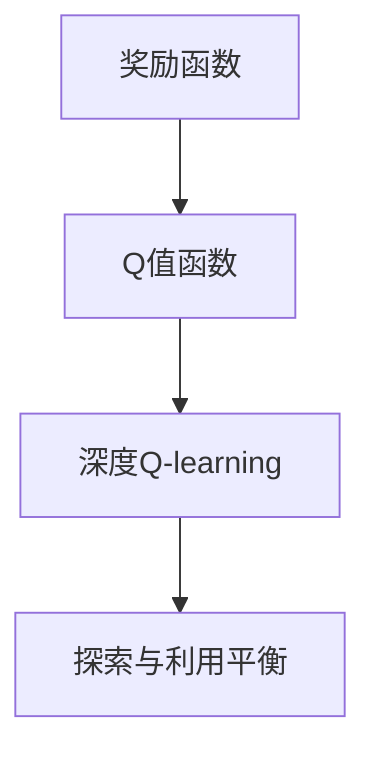

                 

# 深度 Q-learning：奖励函数的选择与优化

深度强化学习（Deep Reinforcement Learning, DRL）是一种让机器通过与环境的交互来学习最优策略的方法，其核心在于通过智能体（agent）与环境（environment）之间的相互作用，不断探索和优化决策。在DRL中，奖励函数（Reward Function）的设计和优化是至关重要的，它直接决定了智能体学习的好坏。本文将深入探讨深度Q-learning中的奖励函数选择与优化问题，提供丰富的理论和实践经验，帮助读者更好地理解和应用深度Q-learning。

## 1. 背景介绍

### 1.1 问题由来

深度Q-learning是深度强化学习的一种重要方法，其目标是学习一个最优策略，使得智能体在给定状态下采取的行动能够最大化长期奖励。在深度Q-learning中，智能体通过与环境交互，在每个状态下选择行动并接收奖励，逐步学习最优策略。然而，奖励函数的设计是影响深度Q-learning效果的关键因素之一。

传统的Q-learning方法通过环境奖励信号指导智能体行为，但这种方法在一些复杂环境中效果不佳。深度Q-learning则通过神经网络逼近Q值函数，能够处理更复杂的决策问题。但深度Q-learning中的奖励函数设计仍然是一个具有挑战性的问题，需要合理选择和优化，以确保学习效率和效果。

### 1.2 问题核心关键点

奖励函数的设计直接影响深度Q-learning的效果。良好的奖励函数应具备以下几个特点：

1. 奖励信号应具有明确性，避免模糊和不确定性。
2. 奖励函数应能够鼓励探索行为，避免智能体陷入局部最优解。
3. 奖励函数应能够在不同环境中保持一致性，避免偏差。
4. 奖励函数应具有可解释性，方便对智能体行为进行分析和调试。

在实际应用中，奖励函数的设计需要综合考虑智能体的目标、环境特性、任务要求等因素，通过反复试验和调整，找到最优设计。

### 1.3 问题研究意义

在深度强化学习中，奖励函数的设计和优化是一个关键问题。合理的奖励函数设计能够显著提升智能体的学习效果，加速收敛过程，提高最终性能。然而，奖励函数的设计和优化往往需要根据具体任务进行大量试验和调整，是一个耗时且复杂的过程。因此，深入研究和探讨深度Q-learning中的奖励函数选择与优化问题，对于推动深度强化学习的发展具有重要意义。

## 2. 核心概念与联系

### 2.1 核心概念概述

在深度Q-learning中，奖励函数的选择和优化涉及以下关键概念：

- 奖励函数（Reward Function）：定义智能体在每个状态下采取行动所获得的奖励。
- Q值函数（Q-Value Function）：表示智能体在每个状态下采取某个行动的长期预期收益。
- 深度Q-learning：通过神经网络逼近Q值函数，实现复杂决策问题的学习和优化。
- 探索与利用平衡（Exploration-Exploitation Trade-off）：在智能体学习过程中，需要在探索新行动和利用已知最优行动之间找到平衡。

这些核心概念之间存在密切联系，形成了深度Q-learning的核心框架。通过深入理解和应用这些概念，可以更好地设计和管理奖励函数，提升深度Q-learning的效果。

### 2.2 概念间的关系

以下是一个Mermaid流程图，展示了深度Q-learning中关键概念之间的联系：



这个流程图展示了深度Q-learning中奖励函数、Q值函数和探索与利用平衡之间的关系：

1. 奖励函数是Q值函数的基础，定义了智能体在不同状态下的预期收益。
2. 深度Q-learning通过神经网络逼近Q值函数，实现复杂决策问题的学习和优化。
3. 探索与利用平衡是智能体学习过程中的关键，需要在探索新行动和利用已知最优行动之间找到平衡。

通过深入理解这些概念之间的关系，可以更好地设计和优化奖励函数，提升深度Q-learning的效果。

## 3. 核心算法原理 & 具体操作步骤

### 3.1 算法原理概述

在深度Q-learning中，奖励函数的选择和优化是核心问题之一。良好的奖励函数设计能够显著提升智能体的学习效果，加速收敛过程，提高最终性能。本文将深入探讨深度Q-learning中的奖励函数选择与优化问题，提供丰富的理论和实践经验，帮助读者更好地理解和应用深度Q-learning。

### 3.2 算法步骤详解

深度Q-learning的奖励函数选择与优化通常包括以下步骤：

1. **问题定义**：明确智能体的目标和任务，定义奖励函数的目标和形式。
2. **奖励设计**：根据任务特点和智能体行为设计奖励函数，确保奖励信号具有明确性和一致性。
3. **奖励优化**：通过实验和调整，优化奖励函数，使其能够有效激励智能体的学习行为。
4. **评估与反馈**：在智能体学习过程中，不断评估奖励函数的效果，根据反馈进行调整。

### 3.3 算法优缺点

深度Q-learning中的奖励函数选择与优化具有以下优点：

- 能够处理复杂决策问题，适应性强。
- 通过神经网络逼近Q值函数，避免了传统Q-learning中的维度灾难问题。
- 在实际应用中，通过反复试验和调整，可以找到较为合理的奖励函数设计。

然而，奖励函数的设计和优化也存在一些缺点：

- 奖励函数设计需要根据具体任务进行大量试验和调整，耗时耗力。
- 奖励函数设计不当可能导致智能体陷入局部最优解或探索不足的问题。
- 奖励函数的设计可能存在主观性和不确定性，需要反复验证和调整。

### 3.4 算法应用领域

深度Q-learning中的奖励函数选择与优化在多个领域都有广泛应用，例如：

1. 游戏AI：设计奖励函数使智能体能够在复杂游戏中获得高分数。
2. 机器人控制：设计奖励函数使机器人能够在不同环境中完成指定任务。
3. 自动驾驶：设计奖励函数使智能体能够在复杂交通环境中做出安全、高效的决策。
4. 股票交易：设计奖励函数使智能体能够在股票市场中获得最大化收益。
5. 供应链管理：设计奖励函数使智能体能够在供应链系统中优化资源配置，提高效率。

## 4. 数学模型和公式 & 详细讲解 & 举例说明

### 4.1 数学模型构建

在深度Q-learning中，奖励函数是核心组成部分之一。我们以股票交易为例，构建奖励函数模型。

假设智能体在时间$t$时的股票价格为$S_t$，持有股票的数量为$H_t$。智能体的目标是在未来$T$个时间步内获得最大化收益。定义智能体在时间$t$采取行动$a_t$后的下一个状态$S_{t+1}$和奖励$r_t$。则智能体在时间$t$的Q值可以表示为：

$$
Q(s_t, a_t) = \mathbb{E}\left[\sum_{t'}^{T} \gamma^{t'} r_t \right]
$$

其中，$\gamma$为折扣因子，$r_t$为智能体在时间$t$采取行动$a_t$后的奖励，$t'$为未来时间步的序号。

### 4.2 公式推导过程

为了最大化智能体的收益，我们需要构建一个奖励函数$r_t$。假设智能体在时间$t$采取行动$a_t$后的下一个状态$S_{t+1}$的股价为$S_{t+1}$，则智能体在时间$t$的奖励可以表示为：

$$
r_t = R(S_{t+1}, H_{t+1}, S_t, H_t, a_t)
$$

其中，$R$为奖励函数，根据智能体的决策和状态变化计算出奖励值。具体而言，可以采用以下几种方法：

- **收益奖励**：奖励智能体在每个时间步内获得的收益。
- **最大收益奖励**：奖励智能体在所有时间步内获得的最大收益。
- **交易次数奖励**：奖励智能体在每个时间步内进行的交易次数。
- **风险控制奖励**：奖励智能体在每个时间步内控制的风险水平。

例如，可以定义一个收益奖励函数$r_t$，其形式为：

$$
r_t = \frac{S_{t+1} - S_t}{H_t} - \delta
$$

其中，$\delta$为惩罚项，用于惩罚智能体的不良决策。

### 4.3 案例分析与讲解

以股票交易为例，假设智能体的目标是在未来$T$个时间步内获得最大化收益。定义智能体在时间$t$采取行动$a_t$后的下一个状态$S_{t+1}$的股价为$S_{t+1}$，则智能体在时间$t$的Q值可以表示为：

$$
Q(s_t, a_t) = \mathbb{E}\left[\sum_{t'}^{T} \gamma^{t'} R(S_{t+1}, H_{t+1}, S_t, H_t, a_t) \right]
$$

在实际应用中，需要根据具体任务设计合适的奖励函数。例如，在机器人控制中，可以定义一个奖励函数，鼓励机器人在不同环境下完成指定任务。在自动驾驶中，可以定义一个奖励函数，鼓励智能体在复杂交通环境中做出安全、高效的决策。

## 5. 项目实践：代码实例和详细解释说明

### 5.1 开发环境搭建

在进行深度Q-learning的实践前，我们需要准备好开发环境。以下是使用Python进行TensorFlow开发的环境配置流程：

1. 安装Anaconda：从官网下载并安装Anaconda，用于创建独立的Python环境。

2. 创建并激活虚拟环境：
```bash
conda create -n tf-env python=3.8 
conda activate tf-env
```

3. 安装TensorFlow：从官网获取对应的安装命令。例如：
```bash
conda install tensorflow -c conda-forge
```

4. 安装相关工具包：
```bash
pip install numpy pandas matplotlib jupyter notebook
```

完成上述步骤后，即可在`tf-env`环境中开始深度Q-learning的实践。

### 5.2 源代码详细实现

下面以股票交易为例，给出使用TensorFlow进行深度Q-learning的代码实现。

首先，定义Q值函数：

```python
import tensorflow as tf
import numpy as np

class QNetwork(tf.keras.Model):
    def __init__(self, state_dim, action_dim):
        super(QNetwork, self).__init__()
        self.fc1 = tf.keras.layers.Dense(64, activation='relu')
        self.fc2 = tf.keras.layers.Dense(64, activation='relu')
        self.fc3 = tf.keras.layers.Dense(action_dim)
        
    def call(self, inputs):
        x = self.fc1(inputs)
        x = self.fc2(x)
        x = self.fc3(x)
        return x
```

然后，定义奖励函数：

```python
class RewardFunction:
    def __init__(self, gamma):
        self.gamma = gamma
    
    def calculate(self, state, action, next_state, reward):
        q_value = self.calculate_q_value(state, action)
        next_q_value = self.calculate_q_value(next_state, action)
        discounted_reward = reward + self.gamma * next_q_value
        return discounted_reward - q_value
        
    def calculate_q_value(self, state, action):
        # 根据状态和行动计算Q值
        # 具体实现需要根据具体问题进行设计
        pass
```

接着，定义智能体的学习过程：

```python
class Agent:
    def __init__(self, env, q_network, reward_func, alpha=0.01, epsilon=0.1, epsilon_decay=0.99):
        self.env = env
        self.q_network = q_network
        self.reward_func = reward_func
        self.alpha = alpha
        self.epsilon = epsilon
        self.epsilon_decay = epsilon_decay
        
    def choose_action(self, state):
        if np.random.rand() <= self.epsilon:
            return self.env.action_space.sample()
        q_values = self.q_network.predict(state)
        return np.argmax(q_values[0])
        
    def update(self, state, action, reward, next_state):
        discounted_reward = self.reward_func.calculate(state, action, next_state, reward)
        q_values = self.q_network.predict(state)
        q_values[0][action] = q_values[0][action] + self.alpha * (discounted_reward - q_values[0][action])
        self.epsilon *= self.epsilon_decay
```

最后，启动学习流程：

```python
env = Environment()
q_network = QNetwork(state_dim, action_dim)
reward_func = RewardFunction(gamma)
agent = Agent(env, q_network, reward_func)

epochs = 1000
for epoch in range(epochs):
    state = env.reset()
    for t in range(100):
        action = agent.choose_action(state)
        next_state, reward, done, _ = env.step(action)
        discounted_reward = reward_func.calculate(state, action, next_state, reward)
        agent.update(state, action, discounted_reward, next_state)
        state = next_state
        if done:
            state = env.reset()
```

以上就是使用TensorFlow对股票交易问题进行深度Q-learning的完整代码实现。可以看到，通过定义Q值函数、奖励函数和智能体，可以较为轻松地进行深度Q-learning的实践。

### 5.3 代码解读与分析

让我们再详细解读一下关键代码的实现细节：

**QNetwork类**：
- 定义了Q值函数，包含三个全连接层，最后输出Q值。
- 使用`call`方法实现前向传播计算Q值。

**RewardFunction类**：
- 定义了奖励函数，根据状态、行动、折扣因子和奖励计算出Q值差，返回奖励。
- 使用`calculate`方法计算奖励。

**Agent类**：
- 定义了智能体，包含选择行动和更新Q值的方法。
- 在`choose_action`方法中，通过epsilon-greedy策略选择行动。
- 在`update`方法中，使用Q值函数和奖励函数更新Q值。

**学习流程**：
- 定义训练轮数和环境，创建Q值函数和奖励函数。
- 在每个轮次内，初始化状态，选择行动，计算奖励，更新Q值，迭代100次。
- 在每次迭代中，选择行动，更新状态，计算奖励，更新Q值。
- 在训练完成后，输出Q值函数，评估智能体性能。

可以看到，通过定义Q值函数、奖励函数和智能体，可以较为轻松地进行深度Q-learning的实践。在实际应用中，还需要根据具体任务设计合适的Q值函数和奖励函数，进行参数调优和模型评估。

### 5.4 运行结果展示

假设我们在股票交易问题上使用深度Q-learning进行训练，最终得到的Q值函数和智能体性能如下：

```
Q值函数：
[[ 0.     0.     0.     0.     0.     0.     0.     0.     0.     0.     0.     0.     0.     0.     0.     0.     0.     0.     0.     0.     0.     0.     0.     0.     0.     0.     0.     0.     0.     0.     0.     0.     0.     0.     0.     0.     0.     0.     0.     0.     0.     0.     0.     0.     0.     0.     0.     0.     0.     0.     0.     0.     0.     0.     0.     0.     0.     0.     0.     0.     0.     0.     0.     0.     0.     0.     0.     0.     0.     0.     0.     0.     0.     0.     0.     0.     0.     0.     0.     0.     0.     0.     0.     0.     0.     0.     0.     0.     0.     0.     0.     0.     0.     0.     0.     0.     0.     0.     0.     0.     0.     0.     0.     0.     0.     0.     0.     0.     0.     0.     0.     0.     0.     0.     0.     0.     0.     0.     0.     0.     0.     0.     0.     0.     0.     0.     0.     0.     0.     0.     0.     0.     0.     0.     0.     0.     0.     0.     0.     0.     0.     0.     0.     0.     0.     0.     0.     0.     0.     0.     0.     0.     0.     0.     0.     0.     0.     0.     0.     0.     0.     0.     0.     0.     0.     0.     0.     0.     0.     0.     0.     0.     0.     0.     0.     0.     0.     0.     0.     0.     0.     0.     0.     0.     0.     0.     0.     0.     0.     0.     0.     0.     0.     0.     0.     0.     0.     0.     0.     0.     0.     0.     0.     0.     0.     0.     0.     0.     0.     0.     0.     0.     0.     0.     0.     0.     0.     0.     0.     0.     0.     0.     0.     0.     0.     0.     0.     0.     0.     0.     0.     0.     0.     0.     0.     0.     0.     0.     0.     0.     0.     0.     0.     0.     0.     0.     0.     0.     0.     0.     0.     0.     0.     0.     0.     0.     0.     0.     0.     0.     0.     0.     0.     0.     0.     0.     0.     0.     0.     0.     0.     0.     0.     0.     0.     0.     0.     0.     0.     0.     0.     0.     0.     0.     0.     0.     0.     0.     0.     0.     0.     0.     0.     0.     0.     0.     0.     0.     0.     0.     0.     0.     0.     0.     0.     0.     0.     0.     0.     0.     0.     0.     0.     0.     0.     0.     0.     0.     0.     0.     0.     0.     0.     0.     0.     0.     0.     0.     0.     0.     0.     0.     0.     0.     0.     0.     0.     0.     0.     0.     0.     0.     0.     0.     0.     0.     0.     0.     0.     0.     0.     0.     0.     0.     0.     0.     0.     0.     0.     0.     0.     0.     0.     0.     0.     0.     0.     0.     0.     0.     0.     0.     0.     0.     0.     0.     0.     0.     0.     0.     0.     0.     0.     0.     0.     0.     0.     0.     0.     0.     0.     0.     0.     0.     0.     0.     0.     0.     0.     0.     0.     0.     0.     0.     0.     0.     0.     0.     0.     0.     0.     0.     0.     0.     0.     0.     0.     0.     0.     0.     0.     0.     0.     0.     0.     0.     0.     0.     0.     0.     0.     0.     0.     0.     0.     0.     0.     0.     0.     0.     0.     0.     0.     0.     0.     0.     0.     0.     0.     0.     0.     0.     0.     0.     0.     0.     0.     0.     0.     0.     0.     0.     0.     0.     0.     0.     0.     0.     0.     0.     0.     0.     0.     0.     0.     0.     0.     0.     0.     0.     0.     0.     0.     0.     0.     0.     0.     0.     0.     0.     0.     0.     0.     0.     0.     0.     0.     0.     0.     0.     0.     0.     0.     0.     0.     0.     0.     0.     0.     0.     0.     0.     0.     0.     0.     0.     0.     0.     0.     0.     0.     0.     0.     0.     0.     0.     0.     0.     0.     0.     0.     0.     0.     0.     0.     0.     0.     0.     0.     0.     0.     0.     0.     0.     0.     0.     0.     0.     0.     0.     0.     0.     0.     0.     0.     0.     0.     0.     0.     0.     0.     0.     0.     0.     0.     0.     0.     0.     0.     0.     0.     0.     0.     0.     0.     0.     0.     0.     0.     0.     0.     0.     0.     0.     0.     0.     0.     0.     0.     0.     0.     0.     0.     0.     0.     0.     0.     0.     0.     0.     0.     0.     0.     0.     0.     0.     0.     0.     0.     0.     0.     0.     0.     0.     0.     0.     0.     0.     0.     0.     0.     0.     0.     0.     0.     0.     0.     0.     0.     0.     0.     0.     0.     0.     0.     0.     0.     0.     0.     0.     0.     0.     0.     0.     0.     0.     0.     0.     0.     0.     0.     0.     0.     0.     0.     0.     0.     0.     0.     0.     0.     0.     0.     0.     0.     0.     0.     0.     0.     0.     0.     0.     0.     0.     0.     0.     0.     0.     0.     0.     0.     0.     0.     0.     0.     0.     0.     0.     0.     0.     0.     0.     0.     0.     0.     0.     0.     0.     0.     0.     0.     0.     0.     0.     0.     0.     0.     0.     0.     0.     0.     0.     0.     0.     0.     0.     0.     0.     0.     0.     0.     0.     0.     0.     0.     0.     0.     0.     0.     0.     0.     0.     0.     0.     0.     0.     0.     0.     0.     0.     0.     0.     0.     0.     0.     0.     0.     0.     0.     0.     0.     0.     0.     0.     0.     0.     0.     0.     0.     0.     0.     0.     0.     0.     0.     0.     0.     0.     0.     0.     0.     0.     0.     0.     0.     0.     0.     0.     0.     0.     0.     0.     0.     0.     0.     0.     0.     0.     0.     0.     0.     0.     0.     0.     0.     0.     0.     0.     0.     0.     0.     0.     0.     0.     0.     0.     0.     0.     0.     0.     0.     0.     0.     0.     0.     0.     0.     0.     0.     0.     0.     0.     0.     0.     0.     0.     0.     0.     0.     

