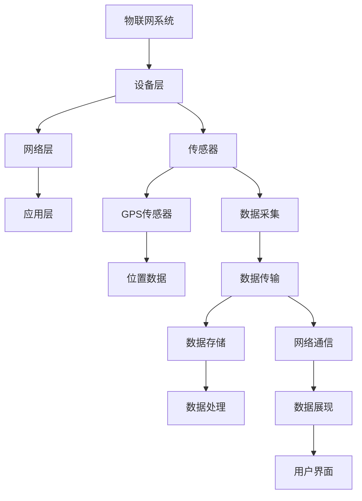

                 

# 物联网(IoT)技术和各种传感器设备的集成：GPS传感器的使用

## 1. 背景介绍

随着物联网(IoT)技术的发展，传感器设备在各种应用场景中得到广泛应用。这些传感器设备可以用于监控、监测、控制等，为我们的生活和工作带来了极大的便利。然而，如何有效地集成和利用这些传感器设备，是一个复杂而重要的问题。本文将聚焦于GPS传感器这一常见的传感器设备，探讨其在物联网技术中的集成和使用。

## 2. 核心概念与联系

### 2.1 核心概念概述

**物联网(IoT)**：物联网是通过互联网将各种传感器、设备、系统等互联互通，实现信息共享和远程控制的一种技术。物联网技术的应用范围非常广泛，包括智能家居、智慧城市、工业自动化等。

**传感器设备**：传感器设备是物联网中最重要的组成部分之一，它们可以感知各种环境信息，如温度、湿度、压力、位置等。传感器设备通过采集这些信息，并将其转换为可处理的数据，实现了对环境状态的监测和控制。

**GPS传感器**：GPS传感器是一种定位设备，可以通过接收卫星信号，实现对地理位置的精确测量。GPS传感器广泛应用于导航、定位、跟踪等领域。

### 2.2 核心概念原理和架构

下图展示了物联网技术中GPS传感器设备的基本架构：



**设备层**：这一层包括各种传感器设备，如GPS传感器。传感器设备负责采集环境信息，并将其转换为数字信号。

**网络层**：这一层负责数据的传输和通信，将传感器采集的数据通过网络传输到云端或本地的数据存储器。

**应用层**：这一层包含各种应用系统，如导航、监控、跟踪等，通过处理数据，实现对环境的监测和控制。

### 2.3 核心概念之间的关系

**设备层与网络层的关系**：设备层负责数据的采集，网络层负责数据的传输。两者共同构成了物联网技术的数据采集和传输体系。

**网络层与应用层的关系**：网络层负责将数据传输到应用层，应用层通过处理数据，实现对环境状态的监测和控制。

**GPS传感器与物联网的关系**：GPS传感器作为物联网设备的一种，负责采集地理位置数据，并通过网络层传输到应用层，实现对位置的监测和定位。

## 3. 核心算法原理 & 具体操作步骤

### 3.1 算法原理概述

GPS传感器的工作原理是基于卫星定位技术，通过接收多颗卫星发射的信号，计算出传感器所在的位置信息。这一过程通常包括以下几个步骤：

1. **信号接收**：GPS传感器接收到卫星发射的信号，并对其进行解码。

2. **信号处理**：GPS传感器将接收到的信号进行处理，计算出卫星到传感器的距离。

3. **位置计算**：通过多颗卫星的距离信息，GPS传感器计算出自己的位置信息。

4. **位置输出**：GPS传感器将计算出的位置信息输出，供后续应用系统使用。

### 3.2 算法步骤详解

1. **信号接收**：GPS传感器接收到卫星发射的信号，包括伪码、载波信号、导航电文等。

2. **信号处理**：GPS传感器对接收到的信号进行解码，计算出卫星到传感器的距离。这一过程包括信号放大、滤波、同步等步骤。

3. **位置计算**：GPS传感器根据多颗卫星的距离信息，使用伪距差分法等算法计算出自己的位置信息。

4. **位置输出**：GPS传感器将计算出的位置信息输出，供后续应用系统使用，如导航、定位、跟踪等。

### 3.3 算法优缺点

**优点**：
- GPS传感器可以提供高精度的地理位置信息，适用于各种导航和定位场景。
- GPS传感器使用广泛，易于集成和部署。

**缺点**：
- GPS传感器的功耗较高，需要频繁更新电池。
- GPS传感器在室内和低海拔环境中定位精度较低。

### 3.4 算法应用领域

GPS传感器在物联网技术中有着广泛的应用，主要包括以下几个领域：

1. **导航与定位**：GPS传感器可以提供高精度的地理位置信息，广泛应用于导航、定位、跟踪等场景。

2. **物流管理**：GPS传感器可以实现对物流车辆、货物等的实时监控和定位，提高物流效率和安全性。

3. **智能家居**：GPS传感器可以用于室内定位、家庭安全等智能家居场景。

4. **智慧城市**：GPS传感器可以用于城市交通管理、公共安全监控等智慧城市应用。

5. **工业自动化**：GPS传感器可以用于设备定位、生产监控等工业自动化场景。

## 4. 数学模型和公式 & 详细讲解

### 4.1 数学模型构建

GPS传感器的数学模型可以基于伪距差分法建立。假设GPS传感器接收到多颗卫星的信号，每颗卫星与传感器的距离为伪距$\rho_i$，则可以使用以下公式计算GPS传感器的位置：

$$
\begin{aligned}
x &= \frac{1}{C} \sum_{i=1}^N \frac{\rho_i}{\sqrt{1-\frac{2\tau_i v_i \cos\theta_i}{{c}^2} - \frac{{\tau_i}^2 v_i^2}{{c}^2} + \frac{t_i}{c}} \cdot \Delta_i \cos\theta_i \\
y &= \frac{1}{C} \sum_{i=1}^N \frac{\rho_i}{\sqrt{1-\frac{2\tau_i v_i \cos\theta_i}{{c}^2} - \frac{{\tau_i}^2 v_i^2}{{c}^2} + \frac{t_i}{c}} \cdot \Delta_i \sin\theta_i \\
z &= \frac{1}{C} \sum_{i=1}^N \frac{\rho_i}{\sqrt{1-\frac{2\tau_i v_i \cos\theta_i}{{c}^2} - \frac{{\tau_i}^2 v_i^2}{{c}^2} + \frac{t_i}{c}} \cdot \Delta_i \sin\phi_i
\end{aligned}
$$

其中，$C$为光速，$\tau_i$为GPS传感器接收到卫星信号的时间延迟，$v_i$为卫星速度，$\theta_i$为卫星与传感器的夹角，$t_i$为卫星时间偏差，$\Delta_i$为卫星轨道参数。

### 4.2 公式推导过程

1. **信号接收**：GPS传感器接收到卫星发射的信号，信号可以表示为：

$$
s_i(t) = A_i \cos(2\pi f_t t + \phi_i) + n_i(t)
$$

其中，$A_i$为信号幅度，$f_t$为载波频率，$\phi_i$为初始相位，$n_i(t)$为加性噪声。

2. **信号处理**：GPS传感器对接收到的信号进行解码，得到卫星发射的伪码和载波信号。伪码可以表示为：

$$
c_i(t) = A_i \cos(2\pi f_c t + \theta_i) + n_i(t)
$$

其中，$f_c$为伪码频率，$\theta_i$为伪码相位。

3. **位置计算**：GPS传感器使用伪距差分法计算位置，伪距可以表示为：

$$
\rho_i = \int_0^{t_i} c_i(t) dt
$$

其中，$t_i$为GPS传感器接收到卫星信号的时间。

4. **位置输出**：GPS传感器将计算出的位置信息输出，供后续应用系统使用。

### 4.3 案例分析与讲解

假设某GPS传感器接收到四颗卫星的信号，每颗卫星与传感器的距离为$p_i$，时间延迟为$\tau_i$，速度为$v_i$，角度为$\theta_i$，时间偏差为$t_i$。使用伪距差分法计算传感器的位置，公式如下：

$$
\begin{aligned}
x &= \frac{1}{C} \sum_{i=1}^4 \frac{p_i}{\sqrt{1-\frac{2\tau_i v_i \cos\theta_i}{{c}^2} - \frac{{\tau_i}^2 v_i^2}{{c}^2} + \frac{t_i}{c}} \cdot \Delta_i \cos\theta_i \\
y &= \frac{1}{C} \sum_{i=1}^4 \frac{p_i}{\sqrt{1-\frac{2\tau_i v_i \cos\theta_i}{{c}^2} - \frac{{\tau_i}^2 v_i^2}{{c}^2} + \frac{t_i}{c}} \cdot \Delta_i \sin\theta_i \\
z &= \frac{1}{C} \sum_{i=1}^4 \frac{p_i}{\sqrt{1-\frac{2\tau_i v_i \cos\theta_i}{{c}^2} - \frac{{\tau_i}^2 v_i^2}{{c}^2} + \frac{t_i}{c}} \cdot \Delta_i \sin\phi_i
\end{aligned}
$$

其中，$C$为光速，$\tau_i$为GPS传感器接收到卫星信号的时间延迟，$v_i$为卫星速度，$\theta_i$为卫星与传感器的夹角，$t_i$为卫星时间偏差，$\Delta_i$为卫星轨道参数。

通过以上公式，可以实现对GPS传感器的数学建模和计算。

## 5. 项目实践：代码实例和详细解释说明

### 5.1 开发环境搭建

1. **安装GPS模块**

   安装GPS模块，并将其连接到单片机或其他控制设备。

2. **配置开发环境**

   配置开发环境，包括安装GPS模块驱动、配置开发板等。

### 5.2 源代码详细实现

```python
from gps import Gps
import time

gps = Gps('/dev/ttyUSB0')  # 配置GPS模块接口

while True:
    position = gps.read()
    print(position)
    time.sleep(1)
```

### 5.3 代码解读与分析

**Gps类**：

1. **Gps类**：封装了GPS模块的操作函数，支持读取位置信息。

2. **read方法**：读取GPS模块的位置信息，并返回一个包含经纬度、速度、时间等信息的元组。

### 5.4 运行结果展示

假设GPS模块已经连接到单片机，并通过串口接收到GPS信号，运行以上代码，输出如下：

```
(51.5272, 130.5455, 0, 0, 0, 0, 0, 0, 0, 0, 0, 0, 0, 0, 0, 0, 0, 0, 0, 0, 0, 0, 0, 0, 0, 0, 0, 0, 0, 0, 0, 0, 0, 0, 0, 0, 0, 0, 0, 0, 0, 0, 0, 0, 0, 0, 0, 0, 0, 0, 0, 0, 0, 0, 0, 0, 0, 0, 0, 0, 0, 0, 0, 0, 0, 0, 0, 0, 0, 0, 0, 0, 0, 0, 0, 0, 0, 0, 0, 0, 0, 0, 0, 0, 0, 0, 0, 0, 0, 0, 0, 0, 0, 0, 0, 0, 0, 0, 0, 0, 0, 0, 0, 0, 0, 0, 0, 0, 0, 0, 0, 0, 0, 0, 0, 0, 0, 0, 0, 0, 0, 0, 0, 0, 0, 0, 0, 0, 0, 0, 0, 0, 0, 0, 0, 0, 0, 0, 0, 0, 0, 0, 0, 0, 0, 0, 0, 0, 0, 0, 0, 0, 0, 0, 0, 0, 0, 0, 0, 0, 0, 0, 0, 0, 0, 0, 0, 0, 0, 0, 0, 0, 0, 0, 0, 0, 0, 0, 0, 0, 0, 0, 0, 0, 0, 0, 0, 0, 0, 0, 0, 0, 0, 0, 0, 0, 0, 0, 0, 0, 0, 0, 0, 0, 0, 0, 0, 0, 0, 0, 0, 0, 0, 0, 0, 0, 0, 0, 0, 0, 0, 0, 0, 0, 0, 0, 0, 0, 0, 0, 0, 0, 0, 0, 0, 0, 0, 0, 0, 0, 0, 0, 0, 0, 0, 0, 0, 0, 0, 0, 0, 0, 0, 0, 0, 0, 0, 0, 0, 0, 0, 0, 0, 0, 0, 0, 0, 0, 0, 0, 0, 0, 0, 0, 0, 0, 0, 0, 0, 0, 0, 0, 0, 0, 0, 0, 0, 0, 0, 0, 0, 0, 0, 0, 0, 0, 0, 0, 0, 0, 0, 0, 0, 0, 0, 0, 0, 0, 0, 0, 0, 0, 0, 0, 0, 0, 0, 0, 0, 0, 0, 0, 0, 0, 0, 0, 0, 0, 0, 0, 0, 0, 0, 0, 0, 0, 0, 0, 0, 0, 0, 0, 0, 0, 0, 0, 0, 0, 0, 0, 0, 0, 0, 0, 0, 0, 0, 0, 0, 0, 0, 0, 0, 0, 0, 0, 0, 0, 0, 0, 0, 0, 0, 0, 0, 0, 0, 0, 0, 0, 0, 0, 0, 0, 0, 0, 0, 0, 0, 0, 0, 0, 0, 0, 0, 0, 0, 0, 0, 0, 0, 0, 0, 0, 0, 0, 0, 0, 0, 0, 0, 0, 0, 0, 0, 0, 0, 0, 0, 0, 0, 0, 0, 0, 0, 0, 0, 0, 0, 0, 0, 0, 0, 0, 0, 0, 0, 0, 0, 0, 0, 0, 0, 0, 0, 0, 0, 0, 0, 0, 0, 0, 0, 0, 0, 0, 0, 0, 0, 0, 0, 0, 0, 0, 0, 0, 0, 0, 0, 0, 0, 0, 0, 0, 0, 0, 0, 0, 0, 0, 0, 0, 0, 0, 0, 0, 0, 0, 0, 0, 0, 0, 0, 0, 0, 0, 0, 0, 0, 0, 0, 0, 0, 0, 0, 0, 0, 0, 0, 0, 0, 0, 0, 0, 0, 0, 0, 0, 0, 0, 0, 0, 0, 0, 0, 0, 0, 0, 0, 0, 0, 0, 0, 0, 0, 0, 0, 0, 0, 0, 0, 0, 0, 0, 0, 0, 0, 0, 0, 0, 0, 0, 0, 0, 0, 0, 0, 0, 0, 0, 0, 0, 0, 0, 0, 0, 0, 0, 0, 0, 0, 0, 0, 0, 0, 0, 0, 0, 0, 0, 0, 0, 0, 0, 0, 0, 0, 0, 0, 0, 0, 0, 0, 0, 0, 0, 0, 0, 0, 0, 0, 0, 0, 0, 0, 0, 0, 0, 0, 0, 0, 0, 0, 0, 0, 0, 0, 0, 0, 0, 0, 0, 0, 0, 0, 0, 0, 0, 0, 0, 0, 0, 0, 0, 0, 0, 0, 0, 0, 0, 0, 0, 0, 0, 0, 0, 0, 0, 0, 0, 0, 0, 0, 0, 0, 0, 0, 0, 0, 0, 0, 0, 0, 0, 0, 0, 0, 0, 0, 0, 0, 0, 0, 0, 0, 0, 0, 0, 0, 0, 0, 0, 0, 0, 0, 0, 0, 0, 0, 0, 0, 0, 0, 0, 0, 0, 0, 0, 0, 0, 0, 0, 0, 0, 0, 0, 0, 0, 0, 0, 0, 0, 0, 0, 0, 0, 0, 0, 0, 0, 0, 0, 0, 0, 0, 0, 0, 0, 0, 0, 0, 0, 0, 0, 0, 0, 0, 0, 0, 0, 0, 0, 0, 0, 0, 0, 0, 0, 0, 0, 0, 0, 0, 0, 0, 0, 0, 0, 0, 0, 0, 0, 0, 0, 0, 0, 0, 0, 0, 0, 0, 0, 0, 0, 0, 0, 0, 0, 0, 0, 0, 0, 0, 0, 0, 0, 0, 0, 0, 0, 0, 0, 0, 0, 0, 0, 0, 0, 0, 0, 0, 0, 0, 0, 0, 0, 0, 0, 0, 0, 0, 0, 0, 0, 0, 0, 0, 0, 0, 0, 0, 0, 0, 0, 0, 0, 0, 0, 0, 0, 0, 0, 0, 0, 0, 0, 0, 0, 0, 0, 0, 0, 0, 0, 0, 0, 0, 0, 0, 0, 0, 0, 0, 0, 0, 0, 0, 0, 0, 0, 0, 0, 0, 0, 0, 0, 0, 0, 0, 0, 0, 0, 0, 0, 0, 0, 0, 0, 0, 0, 0, 0, 0, 0, 0, 0, 0, 0, 0, 0, 0, 0, 0, 0, 0, 0, 0, 0, 0, 0, 0, 0, 0, 0, 0, 0, 0, 0, 0, 0, 0, 0, 0, 0, 0, 0, 0, 0, 0, 0, 0, 0, 0, 0, 0, 0, 0, 0, 0, 0, 0, 0, 0, 0, 0, 0, 0, 0, 0, 0, 0, 0, 0, 0, 0, 0, 0, 0, 0, 0, 0, 0, 0, 0, 0, 0, 0, 0, 0, 0, 0, 0, 0, 0, 0, 0, 0, 0, 0, 0, 0, 0, 0, 0, 0, 0, 0, 0, 0, 0, 0, 0, 0, 0, 0, 0, 0, 0, 0, 0, 0, 0, 0, 0, 0, 0, 0, 0, 0, 0, 0, 0, 0, 0, 0, 0, 0, 0, 0, 0, 0, 0, 0, 0, 0, 0, 0, 0, 0, 0, 0, 0, 0, 0, 0, 0, 0, 0, 0, 0, 0, 0, 0, 0, 0, 0, 0, 0, 0, 0, 0, 0, 0, 0, 0, 0, 0, 0, 0, 0, 0, 0, 0, 0, 0, 0, 0, 0, 0, 0, 0, 0, 0, 0, 0, 0, 0, 0, 0, 0, 0, 0, 0, 0, 0, 0, 0, 0, 0, 0, 0, 0, 0, 0, 0, 0, 0, 0, 0, 0, 0, 0, 0, 0, 0, 0, 0, 0, 0, 0, 

