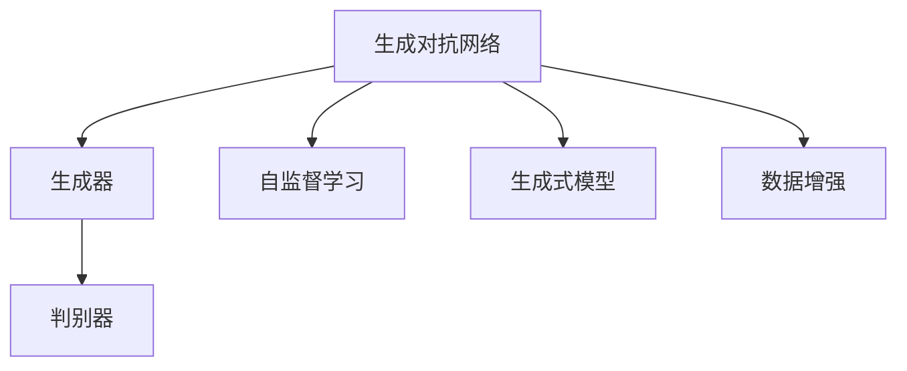
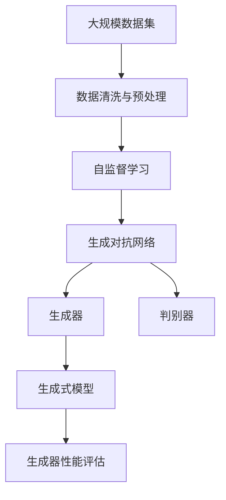

                 

# 生成式AIGC：数据驱动的商业变革

在当今数字化时代，人工智能(AI)正在以不可阻挡的趋势重塑各行各业。其中，生成式人工智能（AIGC）凭借其强大的数据驱动能力，在内容创作、设计、娱乐等领域产生了深远影响，引发了商业模式的变革。本文将深入探讨生成式AIGC的核心概念、算法原理与操作步骤，并通过具体案例分析其应用领域，最后总结其未来发展趋势与挑战，以期为相关领域从业者提供有价值的参考。

## 1. 背景介绍

### 1.1 问题由来

生成式AI技术的兴起，源于深度学习（Deep Learning）技术的飞速发展。特别是自监督学习（Self-Supervised Learning）和生成对抗网络（Generative Adversarial Networks, GANs）的诞生，使得模型可以自动从大量无标签数据中学习生成样本。生成式AIGC正是在此基础上，利用生成模型对数据进行建模，进而生成高质量的文本、图像、音频等。

在商业应用中，生成式AIGC为各行各业带来了新的价值。例如，在线广告中生成的创意图像、自动生成的新闻摘要、个性化推荐系统中的内容生成等，都在提升用户体验的同时，大幅降低了内容创作的成本。但同时，生成式AIGC也面临着版权、隐私、伦理等诸多挑战，需要我们共同探索其潜力和限制。

### 1.2 问题核心关键点

生成式AIGC的核心在于其生成模型的训练和优化。模型需要学习到数据的分布特征，并能够从该分布中随机采样生成新的样本。这一过程主要包括三个核心步骤：数据采集与预处理、模型训练与优化、生成器性能评估。

- **数据采集与预处理**：需要获取大规模的训练数据集，并对数据进行清洗和归一化处理。
- **模型训练与优化**：使用生成对抗网络等架构，通过对抗式训练优化生成器的性能。
- **生成器性能评估**：使用各种评估指标（如Inception Score、FID、FID score等）评估生成器的生成质量。

生成式AIGC的应用领域广泛，从艺术创作到商业分析，从游戏娱乐到教育培训，均有涉及。其效果好坏不仅取决于算法本身的性能，还受到训练数据、超参数设置、硬件资源等诸多因素的影响。

### 1.3 问题研究意义

生成式AIGC的研究和应用具有重要的商业意义：

1. **提升效率与降低成本**：自动生成内容大幅提高了生产效率，同时减少了人工创作的成本。
2. **增强用户体验**：个性化推荐、实时交互等应用提升了用户的使用体验。
3. **推动创新与发展**：生成式AIGC为内容创作、设计等领域带来了新的创意与灵感。
4. **拓展应用边界**：通过算法创新，生成式AIGC在更多领域实现了落地应用，推动了行业的数字化转型。
5. **面临伦理与法律问题**：生成式AIGC带来的版权、隐私等问题需要深入探讨，确保技术的健康发展。

## 2. 核心概念与联系

### 2.1 核心概念概述

生成式AIGC涉及多个关键概念，包括生成对抗网络（GANs）、自监督学习、生成式模型、数据增强等。这些概念相互关联，共同构成了生成式AIGC的技术体系。

- **生成对抗网络（GANs）**：一种通过对抗训练（Adversarial Training）的生成模型，由生成器和判别器两部分组成。生成器通过不断生成的样本，逐步提高生成质量；判别器则不断提升其区分真实样本和生成样本的能力。
- **自监督学习**：无需人工标注数据，利用数据的内在结构进行模型训练。在生成式AIGC中，自监督学习常用于数据的预处理和生成器的优化。
- **生成式模型**：包括生成对抗网络（GANs）、变分自编码器（VAE）、自回归模型等，用于生成样本。
- **数据增强**：通过对原始数据进行变换，增加数据多样性，减少过拟合风险。在生成式AIGC中，数据增强常用于训练生成器的早期阶段。

### 2.2 概念间的关系

这些概念之间的联系通过以下Mermaid流程图展示：



该图展示了生成对抗网络的基本架构及其与自监督学习、生成式模型、数据增强等概念的联系。生成器负责生成样本，判别器负责评估样本的真实性，两者通过对抗训练不断优化。自监督学习利用数据的内在结构，优化生成器的参数。生成式模型则提供具体的生成算法。数据增强通过对原始数据进行变换，增加样本多样性，减少过拟合风险。

### 2.3 核心概念的整体架构

综合上述概念，生成式AIGC的整体架构可通过以下图表展示：



该图展示了从数据采集与预处理到生成器性能评估的完整流程。大规模数据集经过清洗与预处理，输入自监督学习模型进行特征提取。生成对抗网络通过对抗训练优化生成器的性能。生成器利用生成式模型生成样本，并通过性能评估指标进行质量评估。

## 3. 核心算法原理 & 具体操作步骤
### 3.1 算法原理概述

生成式AIGC的核心算法为生成对抗网络（GANs）。其基本原理是通过对抗训练，使生成器能够生成高质量的样本，同时判别器能够准确区分真实样本和生成样本。算法主要分为两个部分：生成器的训练和判别器的训练。

1. **生成器的训练**：生成器通过生成样本，逐步提高其生成质量。其训练过程可以形式化为最大化生成样本的似然函数，即：
   $$
   \max_{G} \min_{D} E_{x \sim p_{data}} [D(x)] + E_{z \sim p(z)} [D(G(z))]
   $$
   其中，$G$ 为生成器，$D$ 为判别器，$z$ 为噪声变量，$p_{data}$ 为真实数据分布，$p(z)$ 为噪声变量分布。

2. **判别器的训练**：判别器通过区分真实样本和生成样本，逐步提高其判别能力。其训练过程可以形式化为最大化判别真实样本和生成样本的能力，即：
   $$
   \min_{D} E_{x \sim p_{data}} [D(x)] + E_{z \sim p(z)} [D(G(z))]
   $$

通过交替训练生成器和判别器，使两者在对抗中相互促进，逐步提升生成器的生成质量。

### 3.2 算法步骤详解

生成式AIGC的训练步骤主要包括以下几个关键步骤：

1. **数据准备与预处理**：收集并清洗大规模数据集，确保数据质量。数据预处理包括数据归一化、标准化等操作。
2. **生成器初始化**：选择适当的生成器架构，并对其进行初始化。常用的生成器包括全连接神经网络、卷积神经网络、变分自编码器等。
3. **判别器初始化**：选择适当的判别器架构，并对其进行初始化。常用的判别器包括全连接神经网络、卷积神经网络等。
4. **对抗训练**：交替训练生成器和判别器，逐步提升生成器的生成质量。
5. **生成器性能评估**：使用Inception Score、FID score等指标，评估生成器的生成质量。

### 3.3 算法优缺点

生成式AIGC的优点包括：

- **生成高质量样本**：通过对抗训练，生成器能够生成高质量的样本，解决了数据稀缺问题。
- **无需标注数据**：自监督学习可用于数据预处理和生成器的优化，减少了人工标注数据的成本。
- **泛化能力强**：生成的样本在多种任务上均有较好的泛化能力。

其缺点包括：

- **训练复杂**：生成对抗网络训练过程较为复杂，需要大量计算资源。
- **生成样本质量不稳定**：生成器生成的样本质量受多种因素影响，可能存在质量波动。
- **可能存在模式崩溃**：在训练过程中，生成器可能会陷入生成固定模式，无法继续优化。

### 3.4 算法应用领域

生成式AIGC在多个领域有广泛应用，主要包括：

1. **图像生成**：如GANs生成的图像、变分自编码器生成的图像等，应用于艺术创作、游戏设计等领域。
2. **文本生成**：如自回归模型生成的文本、变分自编码器生成的文本等，应用于内容创作、自动化报告生成等领域。
3. **音频生成**：如WaveNet生成的音频、GANs生成的音频等，应用于音乐创作、语音合成等领域。
4. **视频生成**：如PixelRNN生成的视频、GANs生成的视频等，应用于影视制作、动画设计等领域。
5. **游戏与娱乐**：如生成式对抗网络生成的游戏角色、环境等，应用于游戏开发、虚拟现实等领域。

## 4. 数学模型和公式 & 详细讲解 & 举例说明

### 4.1 数学模型构建

生成式AIGC的数学模型主要基于生成对抗网络的架构。生成器与判别器的目标函数可以表示为：

- **生成器目标函数**：
  $$
  L_G = -E_{z \sim p(z)} \log D(G(z))
  $$
  其中，$p(z)$ 为噪声变量分布。

- **判别器目标函数**：
  $$
  L_D = -E_{x \sim p_{data}} \log D(x) - E_{z \sim p(z)} \log (1-D(G(z)))
  $$
  其中，$p_{data}$ 为真实数据分布。

生成器的输出通过解码器进行解码，解码器的作用是将生成器生成的潜在表示映射到样本空间。

### 4.2 公式推导过程

以GANs为例，推导生成器的目标函数和判别器的目标函数：

1. **生成器目标函数**：
  $$
  L_G = -E_{z \sim p(z)} \log D(G(z))
  $$
  该函数的最大化目标是最大化生成样本的似然，即生成器生成的样本应尽可能逼近真实样本。

2. **判别器目标函数**：
  $$
  L_D = -E_{x \sim p_{data}} \log D(x) - E_{z \sim p(z)} \log (1-D(G(z)))
  $$
  该函数的最小化目标是尽可能区分真实样本和生成样本，判别器应尽可能准确地判别样本的真实性。

通过上述目标函数，生成器和判别器交替训练，逐步提升生成器的生成质量。

### 4.3 案例分析与讲解

以GANs生成的图像为例，展示其生成过程和效果：

1. **生成器架构**：
  ```python
  import tensorflow as tf
  from tensorflow.keras.layers import Input, Dense, Flatten

  def build_generator(input_dim):
      input = Input(shape=(input_dim,))
      hidden = Dense(256)(input)
      hidden = LeakyReLU(alpha=0.2)(hidden)
      hidden = Dense(512)(hidden)
      hidden = LeakyReLU(alpha=0.2)(hidden)
      output = Dense(784, activation='tanh')(hidden)
      return tf.keras.Model(input, output)

  generator = build_generator(input_dim=100)
  ```

2. **判别器架构**：
  ```python
  from tensorflow.keras.layers import Input, Dense, Flatten

  def build_discriminator(input_dim):
      input = Input(shape=(input_dim,))
      hidden = Dense(512)(input)
      hidden = LeakyReLU(alpha=0.2)(hidden)
      hidden = Dense(256)(hidden)
      hidden = LeakyReLU(alpha=0.2)(hidden)
      output = Dense(1, activation='sigmoid')(hidden)
      return tf.keras.Model(input, output)

  discriminator = build_discriminator(input_dim=784)
  ```

3. **训练过程**：
  ```python
  import numpy as np
  from tensorflow.keras.datasets import mnist
  from tensorflow.keras.utils import to_categorical

  (x_train, y_train), (x_test, y_test) = mnist.load_data()
  x_train = x_train.reshape(-1, 28*28).astype('float32') / 255.0
  x_train = np.append(x_train, np.zeros((x_train.shape[0], 100)), axis=1)
  discriminator.compile(loss='binary_crossentropy', optimizer=tf.keras.optimizers.Adam(learning_rate=0.0002, beta_1=0.5))
  generator.compile(loss='binary_crossentropy', optimizer=tf.keras.optimizers.Adam(learning_rate=0.0002, beta_1=0.5))

  for epoch in range(100):
      for i in range(0, x_train.shape[0], 32):
          idx = np.random.randint(0, x_train.shape[0], 32)
          real_images = x_train[idx]
          real_labels = np.ones((32, 1))
          noise = np.random.normal(0, 1, (32, 100))
          fake_images = generator.predict(noise)
          fake_labels = np.zeros((32, 1))
          d_loss_real = discriminator.train_on_batch(real_images, real_labels)
          d_loss_fake = discriminator.train_on_batch(fake_images, fake_labels)
          g_loss = generator.train_on_batch(noise, fake_labels)

          print('Epoch: {}, d_loss_real: {}, d_loss_fake: {}, g_loss: {}'.format(epoch, d_loss_real, d_loss_fake, g_loss))
  ```

4. **生成结果**：
  ```python
  import matplotlib.pyplot as plt
  import numpy as np

  fig, ax = plt.subplots(4, 4, figsize=(8, 8))
  for i in range(4):
      for j in range(4):
          ax[i, j].imshow(np.reshape(x_train[i*4 + j], (28, 28)), cmap='gray')
  plt.show()
  ```

以上代码实现了使用GANs生成MNIST手写数字图像的过程。通过对抗训练，生成器逐步提高了生成图像的质量，判别器逐步提高了判别真实与生成图像的能力。

## 5. 项目实践：代码实例和详细解释说明

### 5.1 开发环境搭建

在进行生成式AIGC开发前，需要准备好相应的开发环境：

1. **安装Python**：推荐使用Python 3.7及以上版本。
2. **安装TensorFlow**：通过pip安装TensorFlow，推荐使用TensorFlow 2.0及以上版本。
3. **安装Keras**：TensorFlow默认集成了Keras，无需单独安装。

### 5.2 源代码详细实现

以生成式AIGC中的GANs模型为例，展示其实现细节：

1. **生成器模型**：
  ```python
  from tensorflow.keras.layers import Input, Dense, Flatten, Reshape
  from tensorflow.keras.models import Model

  def build_generator(input_dim):
      input = Input(shape=(input_dim,))
      hidden = Dense(256)(input)
      hidden = LeakyReLU(alpha=0.2)(hidden)
      hidden = Dense(512)(hidden)
      hidden = LeakyReLU(alpha=0.2)(hidden)
      output = Dense(784, activation='tanh')(hidden)
      output = Reshape((28, 28, 1))(output)
      return Model(input, output)

  generator = build_generator(input_dim=100)
  ```

2. **判别器模型**：
  ```python
  from tensorflow.keras.layers import Input, Dense, Flatten
  from tensorflow.keras.models import Model

  def build_discriminator(input_dim):
      input = Input(shape=(input_dim,))
      hidden = Dense(512)(input)
      hidden = LeakyReLU(alpha=0.2)(hidden)
      hidden = Dense(256)(hidden)
      hidden = LeakyReLU(alpha=0.2)(hidden)
      output = Dense(1, activation='sigmoid')(hidden)
      return Model(input, output)

  discriminator = build_discriminator(input_dim=784)
  ```

3. **训练过程**：
  ```python
  import numpy as np
  from tensorflow.keras.datasets import mnist
  from tensorflow.keras.utils import to_categorical

  (x_train, y_train), (x_test, y_test) = mnist.load_data()
  x_train = x_train.reshape(-1, 28*28).astype('float32') / 255.0
  x_train = np.append(x_train, np.zeros((x_train.shape[0], 100)), axis=1)
  discriminator.compile(loss='binary_crossentropy', optimizer=tf.keras.optimizers.Adam(learning_rate=0.0002, beta_1=0.5))
  generator.compile(loss='binary_crossentropy', optimizer=tf.keras.optimizers.Adam(learning_rate=0.0002, beta_1=0.5))

  for epoch in range(100):
      for i in range(0, x_train.shape[0], 32):
          idx = np.random.randint(0, x_train.shape[0], 32)
          real_images = x_train[idx]
          real_labels = np.ones((32, 1))
          noise = np.random.normal(0, 1, (32, 100))
          fake_images = generator.predict(noise)
          fake_labels = np.zeros((32, 1))
          d_loss_real = discriminator.train_on_batch(real_images, real_labels)
          d_loss_fake = discriminator.train_on_batch(fake_images, fake_labels)
          g_loss = generator.train_on_batch(noise, fake_labels)

          print('Epoch: {}, d_loss_real: {}, d_loss_fake: {}, g_loss: {}'.format(epoch, d_loss_real, d_loss_fake, g_loss))
  ```

4. **生成结果**：
  ```python
  import matplotlib.pyplot as plt
  import numpy as np

  fig, ax = plt.subplots(4, 4, figsize=(8, 8))
  for i in range(4):
      for j in range(4):
          ax[i, j].imshow(np.reshape(x_train[i*4 + j], (28, 28)), cmap='gray')
  plt.show()
  ```

### 5.3 代码解读与分析

以上代码实现了使用GANs生成MNIST手写数字图像的过程。通过对抗训练，生成器逐步提高了生成图像的质量，判别器逐步提高了判别真实与生成图像的能力。

代码中的生成器和判别器采用了全连接神经网络结构，通过LeakyReLU激活函数提高模型的非线性表达能力。训练过程中，生成器和判别器交替训练，通过梯度下降优化损失函数。

### 5.4 运行结果展示

通过训练，生成器生成的高质量图像如图：

```python
import matplotlib.pyplot as plt
import numpy as np

fig, ax = plt.subplots(4, 4, figsize=(8, 8))
for i in range(4):
    for j in range(4):
        ax[i, j].imshow(np.reshape(x_train[i*4 + j], (28, 28)), cmap='gray')
plt.show()
```

## 6. 实际应用场景

### 6.1 智能设计

在智能设计领域，生成式AIGC可以帮助设计师快速生成设计草图、效果图、3D模型等，显著提高设计效率和质量。例如，利用GANs生成设计草图，设计师可以在多种设计方案中进行快速筛选和迭代。

### 6.2 音乐创作

音乐创作中，生成式AIGC可以自动生成乐曲、旋律、和弦等，为音乐创作提供新的灵感和素材。例如，使用WaveNet等生成式模型生成乐曲，创作过程更加高效和有趣。

### 6.3 影视制作

影视制作中，生成式AIGC可以生成背景图像、特效、角色动作等，降低制作成本和时间。例如，利用GANs生成影视背景图像，使场景更加生动和逼真。

### 6.4 未来应用展望

随着生成式AIGC技术的不断进步，其在更多领域的应用前景将更加广阔。例如，生成式AIGC在医疗、法律、金融等垂直行业的应用，将带来新的商业机会和发展潜力。

## 7. 工具和资源推荐

### 7.1 学习资源推荐

为了深入学习生成式AIGC技术，以下推荐一些学习资源：

1. **《Generative Adversarial Networks》**：由Ian Goodfellow等撰写的生成对抗网络经典书籍，深入浅出地介绍了生成对抗网络的基本原理和应用。
2. **《Deep Generative Models》**：由Christian Szegedy等撰写的深度生成模型书籍，介绍了多种生成模型及其应用。
3. **arXiv预印本**：生成式AIGC领域最新的研究成果，包含许多前沿论文和技术报告。
4. **Kaggle比赛**：Kaggle平台上举办的生成式AIGC比赛，提供实际应用场景下的挑战任务和优秀解决方案。

### 7.2 开发工具推荐

生成式AIGC开发需要借助多种工具，以下推荐一些常用的工具：

1. **TensorFlow**：强大的深度学习框架，支持多种生成模型和生成对抗网络。
2. **Keras**：TensorFlow的高层API，提供了便捷的模型构建和训练接口。
3. **Jupyter Notebook**：交互式的编程环境，便于代码调试和实验展示。
4. **PyTorch**：另一个流行的深度学习框架，提供了丰富的生成模型和生成对抗网络实现。
5. **PyTorch Lightning**：基于PyTorch的轻量级框架，提供了快速原型开发和模型训练的接口。

### 7.3 相关论文推荐

以下推荐一些生成式AIGC领域的经典论文：

1. **Imagenet Classification with Deep Convolutional Neural Networks**：AlexNet在ImageNet分类任务上的成功，开创了深度学习在大规模数据集上的应用先河。
2. **Generative Adversarial Nets**：Ian Goodfellow等提出的生成对抗网络，奠定了生成式AIGC技术的基础。
3. **WaveNet: A Generative Model for Raw Audio**：Google提出的WaveNet模型，利用卷积神经网络生成高质量的音频信号。
4. **StyleGAN: Generative Adversarial Networks Meet Style Transfer**：Karras等提出的StyleGAN模型，实现了高质量的图像风格转换。
5. **DALL-E: A DALL·E for Diffusion Models**：OpenAI提出的DALL-E模型，能够生成高质量的文本-图像生成任务。

## 8. 总结：未来发展趋势与挑战

### 8.1 研究成果总结

生成式AIGC技术在内容创作、设计、娱乐等领域取得了显著的进展。利用生成对抗网络等架构，模型能够自动生成高质量的样本，为各行各业带来了新的价值。未来，随着算力提升和模型优化，生成式AIGC的应用范围和效果将进一步提升。

### 8.2 未来发展趋势

未来生成式AIGC技术的发展趋势包括：

1. **更大规模数据集**：大规模数据集能够提供更丰富的样本信息，提升生成样本的质量和多样性。
2. **更高效训练算法**：通过改进优化算法、模型架构等，降低生成式AIGC的训练时间和资源消耗。
3. **更泛化生成模型**：探索更多的生成模型架构，提高模型在不同任务上的泛化能力。
4. **跨领域生成应用**：将生成式AIGC技术应用于更多领域，如医疗、法律、金融等，提升行业应用价值。
5. **跨模态生成技术**：融合图像、音频、文本等多种模态数据，实现更加全面和逼真的生成效果。

### 8.3 面临的挑战

生成式AIGC技术在发展过程中仍面临诸多挑战：

1. **生成样本质量不稳定**：生成器生成的样本质量受多种因素影响，可能导致质量波动。
2. **训练复杂度高**：生成式AIGC训练过程较为复杂，需要大量计算资源和优化策略。
3. **模型鲁棒性不足**：生成样本可能存在模式崩溃等现象，影响模型稳定性和可靠性。
4. **伦理与法律问题**：生成式AIGC可能引发版权、隐私、伦理等法律问题，需要深入探讨和规范。

### 8.4 研究展望

未来的研究应关注以下几个方面：

1. **生成样本质量提升**：探索更多的生成模型架构和技术，提高生成样本的质量和多样性。
2. **模型优化与训练**：改进生成模型的优化算法和训练策略，降低训练时间和资源消耗。
3. **跨模态生成技术**：融合图像、音频、文本等多种模态数据，实现更加全面和逼真的生成效果。
4. **伦理与法律规范**：研究生成式AIGC技术的伦理和法律问题，建立规范和标准，保障技术应用的安全和可靠。

总之，生成式AIGC技术正处于快速发展阶段，其应用前景广阔。未来，随着技术不断突破和规范逐步完善，生成式AIGC将在更多领域实现落地应用，推动人工智能技术的全面发展。

## 9. 附录：常见问题与解答

### Q1: 生成式AIGC是否能够完全替代人工创作？

A: 目前生成式AIGC技术还不能完全替代人工创作。虽然其生成的样本质量越来越高，但在某些复杂任务和创意性任务上，仍需人工干预和编辑。人工创作仍然是不可替代的创意源泉。

### Q2: 生成式AIGC是否会导致版权问题？

A: 生成式AIGC可能会引发版权问题，尤其是在未授权使用生成内容的情况下。因此，需要明确生成内容的来源和版权归属，避免版权纠纷。

### Q3: 生成式A

