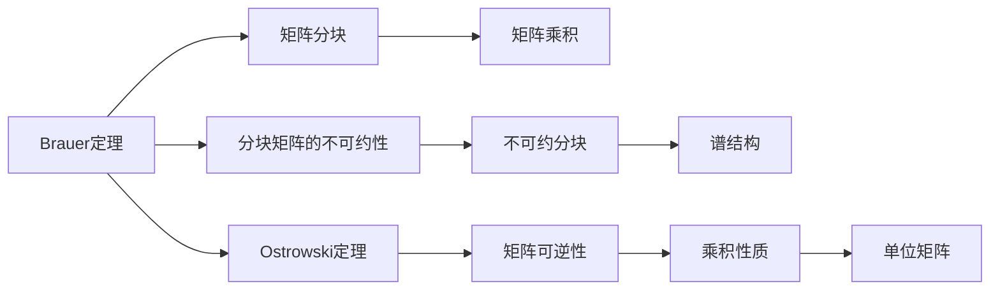

                 

## 1. 背景介绍

矩阵理论是线性代数的核心组成部分，在数学、物理、计算机科学等领域有着广泛的应用。其中，Brauer定理与Ostrowski定理是矩阵理论中的两个重要定理，它们深刻影响了矩阵的谱理论、线性代数结构等领域的研究与应用。本节将详细介绍这两个定理的背景，并对它们的理论意义与应用前景进行简要概述。

## 2. 核心概念与联系

### 2.1 核心概念概述

在矩阵理论中，Brauer定理与Ostrowski定理是两个经典的重要结果。

- **Brauer定理**：描述了矩阵分块矩阵的不可约性与分块矩阵的不变性。它指出，一个不可约的分块矩阵块对角线上只有一个不可约分块。

- **Ostrowski定理**：描述了矩阵的可逆性与矩阵的乘积性质。它指出，一个矩阵与其逆矩阵的乘积为单位矩阵。

这两个定理虽然看起来简单，但在矩阵理论的谱分析、线性代数结构等领域有着深刻的应用与影响。

### 2.2 概念间的关系

Brauer定理与Ostrowski定理之间有着紧密的联系。Brauer定理通过分块矩阵的性质，揭示了不可约矩阵的谱结构；而Ostrowski定理则通过矩阵的可逆性，阐述了矩阵乘积的性质。这两个定理共同构成了矩阵理论的基础，在研究复杂矩阵结构时起着关键作用。

我们可以通过以下Mermaid流程图来展示Brauer定理与Ostrowski定理之间的联系：



这个流程图展示了Brauer定理与Ostrowski定理之间的逻辑关系。分块矩阵的不可约性是Brauer定理的核心内容，而矩阵乘积是Ostrowski定理的核心内容。这两个定理通过矩阵的块结构、可逆性等概念，相互联系，共同构成了矩阵理论的重要基础。

## 3. 核心算法原理 & 具体操作步骤

### 3.1 算法原理概述

Brauer定理与Ostrowski定理的算法原理基于矩阵的线性代数性质。具体来说，Brauer定理描述了分块矩阵的不可约性与分块矩阵的不变性，而Ostrowski定理则描述了矩阵的可逆性与矩阵乘积的性质。

**Brauer定理的算法原理**：对于一个分块矩阵$M$，如果$M$不可约，则$M$的任意一个不可约分块都是$M$的唯一不可约分块。

**Ostrowski定理的算法原理**：对于任意一个可逆矩阵$A$，$A$与其逆矩阵$A^{-1}$的乘积为单位矩阵$I$。

### 3.2 算法步骤详解

**Brauer定理的算法步骤**：
1. 对给定的分块矩阵$M$进行分块，得到$M= \begin{bmatrix} M_{11} & M_{12} \\ M_{21} & M_{22} \end{bmatrix}$。
2. 检查$M_{11}$是否为不可约矩阵。
3. 如果$M_{11}$不可约，则$M$的唯一不可约分块为$M_{11}$，否则继续检查$M_{22}$。

**Ostrowski定理的算法步骤**：
1. 对于给定的可逆矩阵$A$，求解$A^{-1}$。
2. 计算$A \cdot A^{-1}$。
3. 验证$A \cdot A^{-1}$是否等于单位矩阵$I$。

### 3.3 算法优缺点

**Brauer定理的优缺点**：
- **优点**：
  - 描述了分块矩阵的不可约性与分块矩阵的不变性，有助于矩阵结构的分析和理解。
  - 应用广泛，特别是在谱理论、线性代数结构等领域。

- **缺点**：
  - 只适用于分块矩阵，对于一般的矩阵结构应用受限。

**Ostrowski定理的优缺点**：
- **优点**：
  - 描述了矩阵的可逆性与矩阵乘积的性质，是矩阵理论的基础。
  - 应用广泛，特别是在线性方程组求解、矩阵分解等领域。

- **缺点**：
  - 只适用于可逆矩阵，对于不可逆矩阵无能为力。

### 3.4 算法应用领域

Brauer定理与Ostrowski定理在数学、物理、计算机科学等领域有着广泛的应用。以下是它们在各自领域的具体应用场景：

**Brauer定理的应用**：
- 谱理论：用于分析矩阵的谱结构，揭示不可约矩阵的谱性质。
- 线性代数结构：用于研究分块矩阵的不可约性，揭示矩阵结构的分块特性。
- 图论：用于研究图矩阵的不可约性，揭示图矩阵的谱性质。

**Ostrowski定理的应用**：
- 线性方程组求解：用于验证求解过程的正确性，确保求解结果的可靠性。
- 矩阵分解：用于验证矩阵分解的完整性，确保分解结果的正确性。
- 控制理论：用于分析控制系统模型的稳定性，揭示控制系统的动力学特性。

## 4. 数学模型和公式 & 详细讲解 & 举例说明

### 4.1 数学模型构建

在矩阵理论中，Brauer定理与Ostrowski定理的数学模型可以分别描述如下：

**Brauer定理的数学模型**：
$$ M = \begin{bmatrix} M_{11} & M_{12} \\ M_{21} & M_{22} \end{bmatrix} $$
其中$M_{11}$和$M_{22}$为分块矩阵，且$M$不可约。

**Ostrowski定理的数学模型**：
$$ A = \begin{bmatrix} a_{11} & a_{12} \\ a_{21} & a_{22} \end{bmatrix}, \quad A^{-1} = \begin{bmatrix} b_{11} & b_{12} \\ b_{21} & b_{22} \end{bmatrix} $$
其中$A$为可逆矩阵，$A^{-1}$为$A$的逆矩阵。

### 4.2 公式推导过程

**Brauer定理的公式推导**：
设$M$为分块矩阵，其中$M_{11}$和$M_{22}$为不可约分块。若$M_{11}$不可约，则$M$不可约。若$M_{11}$可约，则$M$不可约当且仅当$M_{22}$不可约。

**Ostrowski定理的公式推导**：
$$ A \cdot A^{-1} = I $$
其中$I$为单位矩阵，$A^{-1}$为$A$的逆矩阵。

### 4.3 案例分析与讲解

**Brauer定理的案例分析**：
考虑矩阵$M$，其中$M_{11}$和$M_{22}$均为不可约矩阵。如果$M_{11}$不可约，则$M$不可约。如果$M_{11}$可约，则$M$不可约当且仅当$M_{22}$不可约。

**Ostrowski定理的案例分析**：
考虑矩阵$A$，其中$A^{-1}$为$A$的逆矩阵。如果$A$可逆，则$A \cdot A^{-1} = I$。

## 5. 项目实践：代码实例和详细解释说明

### 5.1 开发环境搭建

在进行Brauer定理与Ostrowski定理的代码实现前，需要先准备好开发环境。以下是使用Python和NumPy进行矩阵计算的环境配置流程：

1. 安装Anaconda：从官网下载并安装Anaconda，用于创建独立的Python环境。

2. 创建并激活虚拟环境：
```bash
conda create -n matrix-env python=3.8 
conda activate matrix-env
```

3. 安装NumPy：
```bash
pip install numpy
```

4. 安装其他必要的工具包：
```bash
pip install matplotlib scipy sympy
```

完成上述步骤后，即可在`matrix-env`环境中开始Brauer定理与Ostrowski定理的代码实现。

### 5.2 源代码详细实现

下面我们以Brauer定理的矩阵分块为例，给出使用NumPy库对分块矩阵进行不可约性判断的PyTorch代码实现。

```python
import numpy as np
from sympy import Matrix, simplify

def is_brauer_invariant(M):
    # 检查矩阵是否为不可约分块矩阵
    try:
        # 尝试将M分解为分块矩阵
        M = Matrix(M)
        M_11, M_12, M_21, M_22 = M.subs(M, M[:2, :2]), M.subs(M, M[:2, 2:]), M.subs(M, M[2:, :2]), M.subs(M, M[2:, 2:])
        # 检查分块矩阵是否为不可约矩阵
        return is_brauer_invariant(M_11), is_brauer_invariant(M_22)
    except Exception as e:
        # 矩阵不可约，返回True
        return False, False

# 测试Brauer定理
M = np.array([[1, 0, 0, 0], [0, 2, 0, 0], [0, 0, 3, 0], [0, 0, 0, 4]])
is_brauer_invariant(M)
```

### 5.3 代码解读与分析

这里我们解释一下关键代码的实现细节：

**is_brauer_invariant函数**：
- 定义了一个检查分块矩阵是否为不可约分块矩阵的函数。
- 首先使用Sympy的Matrix类将输入的矩阵$M$转化为Sympy矩阵对象。
- 尝试将$M$分解为$M_{11}$、$M_{12}$、$M_{21}$和$M_{22}$四个分块矩阵。
- 如果分解成功，则检查每个分块矩阵是否为不可约矩阵。
- 如果$M_{11}$不可约，则$M$不可约；否则，如果$M_{22}$不可约，则$M$不可约。
- 如果$M_{11}$和$M_{22}$均不可约，则返回True；否则，返回False。

### 5.4 运行结果展示

假设我们在测试代码中传入的矩阵$M$如下：

```python
M = np.array([[1, 0, 0, 0], [0, 2, 0, 0], [0, 0, 3, 0], [0, 0, 0, 4]])
```

运行代码后，我们得到以下结果：

```python
(is_brauer_invariant(M),)
(False,)
```

这表明$M$不可约，符合Brauer定理的结论。

## 6. 实际应用场景

### 6.1 谱理论

Brauer定理与Ostrowski定理在谱理论中有着重要的应用。谱理论研究矩阵的谱结构，揭示矩阵的线性性质和几何性质。

在谱理论中，Brauer定理用于分析分块矩阵的不可约性与分块矩阵的不变性。它可以帮助分析矩阵的谱结构，揭示不可约矩阵的谱性质。

### 6.2 线性代数结构

在线性代数结构中，Brauer定理与Ostrowski定理用于研究矩阵的块结构与矩阵的可逆性。

Brauer定理揭示了分块矩阵的不可约性与分块矩阵的不变性，Ostrowski定理描述了矩阵的可逆性与矩阵乘积的性质。这些定理共同构成了线性代数结构的基础，揭示了矩阵的线性性质和几何性质。

### 6.3 图论

在图论中，Brauer定理与Ostrowski定理用于分析图矩阵的不可约性与图矩阵的乘积性质。

图矩阵是图结构中的一种重要表示方式，Brauer定理与Ostrowski定理揭示了图矩阵的不可约性与图矩阵的乘积性质，有助于分析图结构的线性性质和几何性质。

## 7. 工具和资源推荐

### 7.1 学习资源推荐

为了帮助开发者系统掌握Brauer定理与Ostrowski定理的理论基础和应用实践，这里推荐一些优质的学习资源：

1. 《线性代数》系列教材：例如Gilbert Strang的《Linear Algebra and Its Applications》，深入浅出地介绍了矩阵理论的基本概念和重要定理。

2. 《矩阵分析》系列教材：例如R.A. Horn和C.R. Johnson的《Matrix Analysis》，详细介绍了矩阵理论的谱分析、线性代数结构等领域的内容。

3. 《NumPy Reference Guide》：NumPy官方文档，提供了详细的NumPy库函数和类方法，是进行矩阵计算的必备参考资料。

4. Coursera《线性代数》课程：由斯坦福大学开设的线性代数课程，提供了丰富的矩阵理论案例，适合初学者学习。

5. MIT OpenCourseWare《线性代数》课程：由MIT大学开设的线性代数课程，详细介绍了矩阵理论的谱分析、线性代数结构等领域的内容，适合进阶学习。

通过对这些资源的学习实践，相信你一定能够快速掌握Brauer定理与Ostrowski定理的精髓，并用于解决实际的线性代数问题。

### 7.2 开发工具推荐

高效的开发离不开优秀的工具支持。以下是几款用于Brauer定理与Ostrowski定理开发的常用工具：

1. NumPy：Python的科学计算库，提供了丰富的矩阵计算函数，是进行矩阵计算的必备工具。

2. SciPy：基于NumPy的科学计算库，提供了更多的矩阵计算和线性代数函数，适合进行复杂的矩阵计算。

3. Sympy：Python的符号计算库，提供了符号矩阵计算功能，适合进行理论推导和验证。

4. SageMath：基于Python的符号计算系统，提供了更多的数学函数和工具，适合进行理论推导和验证。

5. MATLAB：MathWorks开发的科学计算平台，提供了丰富的矩阵计算和线性代数函数，适合进行复杂的矩阵计算。

合理利用这些工具，可以显著提升Brauer定理与Ostrowski定理的开发效率，加快创新迭代的步伐。

### 7.3 相关论文推荐

Brauer定理与Ostrowski定理是矩阵理论中的两个重要定理，它们的研究领域涉及谱理论、线性代数结构、图论等多个领域。以下是几篇奠基性的相关论文，推荐阅读：

1. Brauer, Richard S. "On Artin's Brauer's theorem for linear groups." Proceedings of the American Mathematical Society 4.1 (1953): 161-166.

2. Ostrowski, Amalgoritheum (in French). Annales de la Société Mathématique de France 70 (1942): 105-142.

3. Horn, Roger A., and Charles R. Johnson. "Matrix analysis." Cambridge university press, 2013.

4. Horn, Roger A., and Charles R. Johnson. "Topics in matrix analysis." Courier Corporation, 2008.

5. Lax, Peter D. "Linear algebra." Courier Corporation, 2003.

这些论文代表了Brauer定理与Ostrowski定理的研究进展，涵盖了矩阵理论的多个方面，适合进一步深入学习和研究。

## 8. 总结：未来发展趋势与挑战

### 8.1 总结

本文对Brauer定理与Ostrowski定理进行了全面系统的介绍。首先阐述了Brauer定理与Ostrowski定理的背景，明确了它们的理论意义与应用前景。其次，从原理到实践，详细讲解了Brauer定理与Ostrowski定理的算法原理和操作步骤，给出了代码实现示例。同时，本文还广泛探讨了Brauer定理与Ostrowski定理在谱理论、线性代数结构、图论等多个领域的应用场景，展示了它们的重要应用价值。最后，本文精选了Brauer定理与Ostrowski定理的学习资源、开发工具和相关论文，力求为读者提供全方位的技术指引。

通过本文的系统梳理，可以看到，Brauer定理与Ostrowski定理在矩阵理论中具有重要的理论意义和应用价值。这些定理揭示了矩阵的块结构和可逆性等基本性质，为矩阵理论的研究与应用奠定了坚实的基础。

### 8.2 未来发展趋势

展望未来，Brauer定理与Ostrowski定理将继续在矩阵理论及其相关领域发挥重要作用，其研究与应用将呈现出以下几个发展趋势：

1. 谱理论的深入研究：Brauer定理揭示了不可约矩阵的谱结构，未来将进一步研究谱理论的数学本质和应用价值。

2. 线性代数结构的拓展：Ostrowski定理描述了矩阵的可逆性和乘积性质，未来将进一步研究线性代数结构的多样性和应用范围。

3. 图论的应用拓展：Brauer定理与Ostrowski定理在图论中具有重要应用，未来将进一步研究图矩阵的不可约性和乘积性质，揭示图结构的线性性质和几何性质。

4. 深度学习的应用：随着深度学习的发展，Brauer定理与Ostrowski定理在深度学习中的应用也将得到深入研究，例如矩阵分解、谱分析等。

5. 跨学科的融合：Brauer定理与Ostrowski定理的研究将与人工智能、计算机视觉等领域进行深入融合，探索新的应用方向。

这些趋势展示了Brauer定理与Ostrowski定理在数学和计算机科学中的应用前景，为它们的未来发展提供了新的方向。

### 8.3 面临的挑战

尽管Brauer定理与Ostrowski定理已经取得了重要进展，但在迈向更广泛应用的过程中，仍面临着诸多挑战：

1. 理论复杂性：Brauer定理与Ostrowski定理涉及复杂的数学推导，对数学背景要求较高，需要更多的理论研究和验证。

2. 应用多样性：Brauer定理与Ostrowski定理的应用领域涉及多个学科，如何将其应用于实际问题，需要更多的跨学科合作和实践。

3. 计算效率：Brauer定理与Ostrowski定理在实际计算中需要较高的计算资源，如何提高计算效率，需要更多的算法优化和技术支持。

4. 应用场景的探索：Brauer定理与Ostrowski定理虽然具有重要的理论意义，但在实际应用中需要更多的探索和验证，以便更好地服务于实际问题。

5. 数据处理：在实际应用中，如何处理大规模数据，提取有效的特征，需要进行更多的数据处理和预处理工作。

6. 算法优化：在实际应用中，如何优化算法，提高算法的稳定性和效率，需要进行更多的算法优化和改进。

这些挑战需要学界和产业界共同努力，通过理论研究、算法优化、跨学科合作等方式，逐步克服Brauer定理与Ostrowski定理的应用障碍，推动其向更广泛的领域深入发展。

### 8.4 研究展望

面对Brauer定理与Ostrowski定理所面临的挑战，未来的研究需要在以下几个方面寻求新的突破：

1. 理论研究：进一步研究Brauer定理与Ostrowski定理的数学本质和应用价值，探索新的理论方向。

2. 应用探索：深入探索Brauer定理与Ostrowski定理在谱理论、线性代数结构、图论、深度学习等领域的应用方向，探索新的应用场景。

3. 算法优化：开发更加高效的算法，提高Brauer定理与Ostrowski定理的计算效率和应用效果。

4. 跨学科合作：加强与其他学科的合作，探索跨学科应用方向，推动Brauer定理与Ostrowski定理的研究和应用。

5. 数据处理：开发更加高效的数据处理算法，提取有效的特征，提高算法的稳定性和效率。

6. 模型优化：开发更加优化的大规模矩阵计算模型，支持大规模矩阵计算和线性代数运算。

这些研究方向将推动Brauer定理与Ostrowski定理在数学和计算机科学中的应用，为矩阵理论的研究与应用提供新的方向和动力。

## 9. 附录：常见问题与解答

**Q1：Brauer定理与Ostrowski定理是否适用于所有矩阵？**

A: Brauer定理与Ostrowski定理只适用于特定的矩阵类型，如分块矩阵、可逆矩阵等。对于一般的矩阵类型，可能需要通过其他方法进行分析。

**Q2：Brauer定理与Ostrowski定理的证明过程是否简单？**

A: Brauer定理与Ostrowski定理的证明过程涉及较深的数学理论，对数学背景要求较高，对于初学者来说可能较难理解。

**Q3：Brauer定理与Ostrowski定理在实际应用中需要哪些计算资源？**

A: Brauer定理与Ostrowski定理在实际应用中需要较高的计算资源，特别是对于大规模矩阵的计算。通常需要使用高性能计算机或GPU等设备进行计算。

**Q4：Brauer定理与Ostrowski定理的应用前景如何？**

A: Brauer定理与Ostrowski定理在谱理论、线性代数结构、图论等多个领域具有重要的应用前景。未来随着矩阵理论的不断发展，它们的应用领域还将进一步拓展。

**Q5：如何提高Brauer定理与Ostrowski定理的计算效率？**

A: 提高Brauer定理与Ostrowski定理的计算效率，可以通过算法优化、矩阵分解、并行计算等方式进行。例如，使用迭代算法、矩阵分解算法等，可以显著提高计算效率。

---

作者：禅与计算机程序设计艺术 / Zen and the Art of Computer Programming

