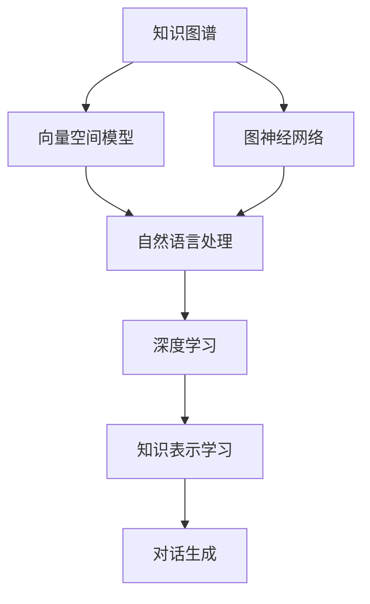
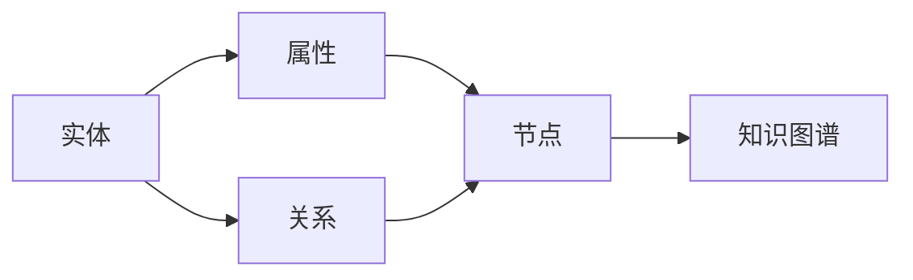
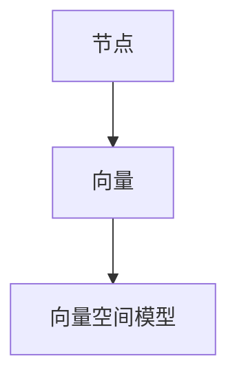
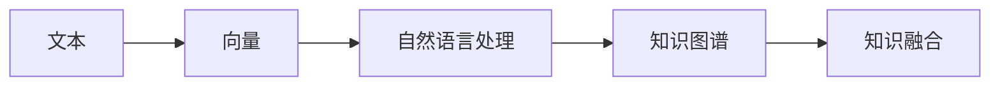

                 

# 大模型问答机器人的知识表示

> 关键词：
大语言模型,知识图谱,图神经网络,向量空间模型,对话生成,自然语言处理(NLP),知识表示学习,深度学习,问答系统

## 1. 背景介绍

### 1.1 问题由来
问答系统是自然语言处理（NLP）领域的重要应用之一，通过理解用户提出的问题，生成准确的答案，已经广泛应用于智能客服、在线教育、医疗咨询、智能助手等多个场景。传统的问答系统依赖于手工编写的规则和模板，难以处理复杂和多样化的问答需求。近年来，基于深度学习的问答系统，特别是基于大语言模型的问答系统，逐渐成为主流。

大语言模型，如BERT、GPT-3等，通过在大规模无标签文本上预训练，学习到丰富的语言知识，具有强大的语言理解和生成能力。将这些模型应用到问答任务中，可以显著提升系统的准确率和泛化能力。

然而，大语言模型本质上是一种语言模型，无法直接处理结构化的知识信息。因此，在实际应用中，需要结合知识图谱等结构化知识库，才能更好地处理问答任务。本文章将重点讨论如何利用大语言模型进行知识表示学习，增强问答系统的知识理解和生成能力。

### 1.2 问题核心关键点
知识表示学习（Knowledge Graph Embedding）是知识图谱中关键的技术之一。其主要目标是将知识图谱中的实体、关系、属性等结构化信息，映射到低维向量空间中，使得机器能够理解这些信息的内在关系，并进行高效的推理和查询。在大语言模型问答系统中，知识表示学习能够提升模型对问答任务的泛化能力，使其能够处理更加复杂和多样化的查询。

知识表示学习的方法主要有以下几种：

1. 向量空间模型（Vector Space Model, VSM）：将知识图谱中的节点和关系映射到向量空间中，通过计算向量间的相似度，实现知识推理和查询。
2. 图神经网络（Graph Neural Network, GNN）：通过图卷积神经网络等模型，将知识图谱中的节点和关系映射到低维向量中，实现知识推理和查询。
3. 知识图谱融合：将知识图谱与自然语言处理模型进行融合，增强模型的知识理解和生成能力。

这些方法在大语言模型问答系统中具有不同的应用场景和优势，需要根据具体任务选择合适的技术。

### 1.3 问题研究意义
知识表示学习在大语言模型问答系统中的应用，具有重要的理论和实际意义：

1. 提升模型泛化能力：通过结合知识图谱，大语言模型能够更好地理解语义信息，提升模型对不同问题的泛化能力。
2. 增强问题理解能力：知识表示学习能够帮助模型更好地理解问题中的实体、关系和属性，提高模型对复杂问题的处理能力。
3. 加速推理和查询：向量空间模型和图神经网络等方法能够提高知识推理和查询的效率，使模型能够快速处理大量数据。
4. 提供知识服务：结合知识图谱，大语言模型可以提供更加丰富的知识服务，如推荐、问答、个性化推荐等，提升用户体验。
5. 促进知识传播：通过问答系统，大语言模型能够将知识图谱中的信息传播到更广泛的群体，促进知识的普及和应用。

本文将系统介绍大语言模型问答系统中知识表示学习的方法和技术，涵盖向量空间模型、图神经网络、知识图谱融合等多个方面，以期对大语言模型问答系统的实践和研究提供全面的指导。

## 2. 核心概念与联系

### 2.1 核心概念概述

为更好地理解知识表示学习在大语言模型问答系统中的应用，本节将介绍几个密切相关的核心概念：

- 知识图谱：一种用于表示实体、关系和属性的结构化数据模型，是知识表示学习的重要基础。
- 向量空间模型：将知识图谱中的节点和关系映射到向量空间中，通过计算向量间的相似度，实现知识推理和查询。
- 图神经网络：通过图卷积神经网络等模型，将知识图谱中的节点和关系映射到低维向量中，实现知识推理和查询。
- 自然语言处理：大语言模型问答系统中的核心任务之一，通过理解自然语言，实现知识查询和推理。
- 深度学习：利用神经网络模型，学习知识图谱中的复杂关系和模式，提升模型的推理和查询能力。
- 知识表示学习：将知识图谱中的信息映射到低维向量空间中，实现知识推理和查询。
- 对话生成：基于大语言模型，生成自然流畅的对话，提升问答系统的交互体验。

这些核心概念之间的逻辑关系可以通过以下Mermaid流程图来展示：



这个流程图展示了大语言模型问答系统中的知识表示学习方法的核心概念及其之间的关系：

1. 知识图谱是知识表示学习的基础，提供了结构化的知识信息。
2. 向量空间模型和图神经网络是两种常见的知识表示方法，将知识图谱中的信息映射到低维向量空间中。
3. 自然语言处理是将知识图谱与自然语言进行融合，实现知识的查询和推理。
4. 深度学习是通过神经网络模型，学习知识图谱中的复杂关系和模式，提升模型的推理和查询能力。
5. 知识表示学习将知识图谱中的信息映射到低维向量空间中，实现知识推理和查询。
6. 对话生成是利用大语言模型，生成自然流畅的对话，提升问答系统的交互体验。

这些核心概念共同构成了大语言模型问答系统中知识表示学习的方法和技术框架，使其能够高效地处理问答任务，提供丰富的知识服务。

### 2.2 概念间的关系

这些核心概念之间存在着紧密的联系，形成了大语言模型问答系统的知识表示学习生态系统。下面我通过几个Mermaid流程图来展示这些概念之间的关系。

#### 2.2.1 知识图谱的构建和表示



这个流程图展示了知识图谱的基本构建过程。知识图谱由实体、属性和关系组成，通过将这些信息进行结构化表示，构建出知识图谱。

#### 2.2.2 向量空间模型的表示



这个流程图展示了向量空间模型的基本表示过程。通过将知识图谱中的节点和关系映射到向量空间中，实现知识的查询和推理。

#### 2.2.3 图神经网络的表示


这个流程图展示了图神经网络的基本表示过程。通过将知识图谱中的节点和关系映射到低维向量中，实现知识的查询和推理。

#### 2.2.4 自然语言处理与知识融合



这个流程图展示了自然语言处理与知识融合的基本过程。通过将自然语言文本映射到向量空间中，将其与知识图谱进行融合，实现知识的查询和推理。

#### 2.2.5 深度学习与知识表示学习


这个流程图展示了深度学习与知识表示学习的基本过程。通过深度学习模型，学习知识图谱中的复杂关系和模式，实现知识表示学习。

### 2.3 核心概念的整体架构

最后，我们用一个综合的流程图来展示这些核心概念在大语言模型问答系统中的整体架构：


这个综合流程图展示了从知识图谱构建到对话生成的完整过程。知识图谱通过向量空间模型和图神经网络进行表示，自然语言处理将其与知识图谱进行融合，深度学习通过神经网络模型学习知识图谱中的复杂关系和模式，最终实现知识表示学习和对话生成。

## 3. 核心算法原理 & 具体操作步骤
### 3.1 算法原理概述

大语言模型问答系统中的知识表示学习，本质上是一种基于深度学习的知识推理方法。其核心思想是将知识图谱中的实体、关系和属性等结构化信息，映射到低维向量空间中，使得机器能够理解这些信息的内在关系，并进行高效的推理和查询。

形式化地，假设知识图谱为 $G=(V,E)$，其中 $V$ 为节点集合，表示实体和属性，$E$ 为边集合，表示实体之间的关系。定义节点 $v \in V$ 在向量空间中的表示为 $z_v$，边 $e \in E$ 在向量空间中的表示为 $z_e$。知识表示学习的目标是最小化损失函数 $L(z_v,z_e)$，使得 $z_v$ 和 $z_e$ 能够准确地表示知识图谱中的信息。

常见的知识表示学习方法包括向量空间模型和图神经网络等，下面分别介绍这些方法的核心原理。

### 3.2 算法步骤详解

#### 3.2.1 向量空间模型

向量空间模型（Vector Space Model, VSM）是一种基于词袋模型和TF-IDF（Term Frequency-Inverse Document Frequency）的文本表示方法，广泛用于信息检索和知识推理。在大语言模型问答系统中，向量空间模型可以将知识图谱中的节点和关系映射到向量空间中，实现知识的推理和查询。

向量空间模型的核心步骤如下：

1. 构建知识图谱节点和关系的特征向量。对于节点 $v$，构建特征向量 $z_v$，其中每个特征 $f_i$ 表示节点 $v$ 的某种属性或特征。对于关系 $e$，构建特征向量 $z_e$，其中每个特征 $f_i$ 表示关系 $e$ 的某种属性或特征。

2. 计算节点和关系之间的相似度。对于任意两个节点 $v_1$ 和 $v_2$，计算它们之间的相似度 $s(v_1,v_2)$，公式为：
   $$
   s(v_1,v_2) = \frac{\langle z_{v_1},z_{v_2} \rangle}{\|z_{v_1}\| \cdot \|z_{v_2}\|}
   $$
   其中 $\langle \cdot,\cdot \rangle$ 表示向量点积，$\|\cdot\|$ 表示向量范数。

3. 进行知识推理和查询。根据节点之间的相似度，可以推理出与节点 $v_1$ 最相关的节点 $v_2$，查询与节点 $v_2$ 相关的关系 $e$，从而实现知识推理和查询。

向量空间模型的优点在于简单高效，能够处理大规模的知识图谱，但缺点是忽略了节点和关系之间的复杂关系，难以捕捉知识图谱中的长程依赖。

#### 3.2.2 图神经网络

图神经网络（Graph Neural Network, GNN）是一种通过图卷积神经网络（GCN）等模型，将知识图谱中的节点和关系映射到低维向量中，实现知识推理和查询的方法。在大语言模型问答系统中，图神经网络能够捕捉节点和关系之间的复杂关系，提升知识推理和查询的准确性。

图神经网络的核心步骤如下：

1. 构建知识图谱节点和关系的特征向量。对于节点 $v$，构建特征向量 $z_v$，其中每个特征 $f_i$ 表示节点 $v$ 的某种属性或特征。对于关系 $e$，构建特征向量 $z_e$，其中每个特征 $f_i$ 表示关系 $e$ 的某种属性或特征。

2. 设计图卷积神经网络模型。通过设计图卷积神经网络，将节点和关系进行多层迭代处理，学习它们之间的复杂关系。常见的图卷积神经网络模型包括GCN、GAT（Graph Attention Network）等。

3. 进行知识推理和查询。通过多层迭代处理，图神经网络能够捕捉知识图谱中的复杂关系，实现高效的推理和查询。

图神经网络的优点在于能够捕捉节点和关系之间的复杂关系，提升知识推理和查询的准确性，但缺点是计算复杂度高，难以处理大规模知识图谱。

### 3.3 算法优缺点

向量空间模型和图神经网络这两种知识表示学习方法，具有不同的优缺点：

#### 向量空间模型的优缺点

- 优点：
  - 简单高效：向量空间模型计算简单，易于实现。
  - 可解释性强：向量空间模型中的特征向量具有明确的物理意义，易于解释。
  - 可扩展性强：向量空间模型能够处理大规模知识图谱，具有较好的可扩展性。

- 缺点：
  - 忽略复杂关系：向量空间模型忽略了节点和关系之间的复杂关系，难以捕捉知识图谱中的长程依赖。
  - 特征选择困难：向量空间模型中的特征选择较为困难，需要手工设计特征，影响模型的准确性。

#### 图神经网络的优缺点

- 优点：
  - 捕捉复杂关系：图神经网络能够捕捉节点和关系之间的复杂关系，提升知识推理和查询的准确性。
  - 自动学习特征：图神经网络能够自动学习节点和关系的特征，不需要手工设计特征。
  - 可扩展性强：图神经网络能够处理大规模知识图谱，具有较好的可扩展性。

- 缺点：
  - 计算复杂度高：图神经网络计算复杂度高，难以处理大规模知识图谱。
  - 可解释性差：图神经网络中的特征向量难以解释，缺乏可解释性。

### 3.4 算法应用领域

知识表示学习在大语言模型问答系统中具有广泛的应用领域，涵盖以下几个方面：

- 问答系统：利用向量空间模型和图神经网络，将知识图谱中的信息映射到低维向量空间中，提升模型的推理和查询能力。
- 推荐系统：通过向量空间模型和图神经网络，将知识图谱中的信息与用户行为数据进行融合，实现个性化推荐。
- 知识图谱构建：通过向量空间模型和图神经网络，将非结构化数据映射到知识图谱中，提升知识图谱的构建效率和准确性。
- 知识抽取：通过向量空间模型和图神经网络，从大规模文本中抽取实体、关系和属性等结构化信息，构建知识图谱。
- 对话生成：通过向量空间模型和图神经网络，将知识图谱中的信息与自然语言处理模型进行融合，生成自然流畅的对话，提升问答系统的交互体验。

## 4. 数学模型和公式 & 详细讲解  
### 4.1 数学模型构建

本节将使用数学语言对向量空间模型和图神经网络的知识表示学习过程进行更加严格的刻画。

假设知识图谱为 $G=(V,E)$，其中 $V$ 为节点集合，表示实体和属性，$E$ 为边集合，表示实体之间的关系。定义节点 $v \in V$ 在向量空间中的表示为 $z_v$，边 $e \in E$ 在向量空间中的表示为 $z_e$。

对于向量空间模型，节点和关系之间的相似度计算公式如下：
$$
s(v_1,v_2) = \frac{\langle z_{v_1},z_{v_2} \rangle}{\|z_{v_1}\| \cdot \|z_{v_2}\|}
$$
其中 $\langle \cdot,\cdot \rangle$ 表示向量点积，$\|\cdot\|$ 表示向量范数。

对于图神经网络，图卷积神经网络模型（GCN）的计算公式如下：
$$
z_v^{(l+1)} = \sum_{u \in \mathcal{N}(v)} \alpha(v,u)z_u^{(l)}W^{(l)}
$$
其中 $\mathcal{N}(v)$ 表示节点 $v$ 的邻居节点集合，$\alpha(v,u)$ 表示节点 $v$ 和邻居节点 $u$ 之间的注意力权重，$W^{(l)}$ 表示第 $l$ 层的卷积权重矩阵。

### 4.2 公式推导过程

以下我们以向量空间模型为例，推导节点和关系之间的相似度计算公式。

假设节点 $v_1$ 和 $v_2$ 分别表示两个实体，它们的特征向量分别为 $z_{v_1}$ 和 $z_{v_2}$，边 $e$ 表示它们之间的关系。根据向量空间模型，节点和关系之间的相似度计算公式为：
$$
s(v_1,v_2) = \frac{\langle z_{v_1},z_{v_2} \rangle}{\|z_{v_1}\| \cdot \|z_{v_2}\|}
$$
其中 $\langle \cdot,\cdot \rangle$ 表示向量点积，$\|\cdot\|$ 表示向量范数。

在推导过程中，我们可以使用以下两个简单的数学性质：

1. 向量点积的性质：对于任意两个向量 $\mathbf{u}$ 和 $\mathbf{v}$，点积可以表示为：
   $$
   \langle \mathbf{u},\mathbf{v} \rangle = \sum_i u_i v_i
   $$
2. 向量范数的性质：对于任意向量 $\mathbf{u}$，范数可以表示为：
   $$
   \|\mathbf{u}\| = \sqrt{\sum_i u_i^2}
   $$

根据这两个性质，我们可以将节点和关系之间的相似度计算公式推导如下：

$$
s(v_1,v_2) = \frac{\langle z_{v_1},z_{v_2} \rangle}{\|z_{v_1}\| \cdot \|z_{v_2}\|} = \frac{\sum_i z_{v_1,i} z_{v_2,i}}{\sqrt{\sum_i z_{v_1,i}^2} \cdot \sqrt{\sum_i z_{v_2,i}^2}}
$$

这个公式表示，节点和关系之间的相似度是它们之间特征向量的点积除以特征向量的范数乘积，即它们之间特征向量内积的余弦值。

### 4.3 案例分析与讲解

下面我们以问答系统为例，给出使用向量空间模型进行知识表示学习的具体应用。

假设我们有一个问答系统，用户输入问题 $q$，系统需要从知识图谱中查询相关的实体和关系，给出最相关的答案 $a$。为了实现这一功能，我们可以使用向量空间模型进行知识表示学习，具体步骤如下：

1. 构建知识图谱节点和关系的特征向量。对于节点 $v$，构建特征向量 $z_v$，其中每个特征 $f_i$ 表示节点 $v$ 的某种属性或特征。对于关系 $e$，构建特征向量 $z_e$，其中每个特征 $f_i$ 表示关系 $e$ 的某种属性或特征。

2. 计算问题 $q$ 在向量空间中的表示 $z_q$。将问题 $q$ 映射到向量空间中，得到特征向量 $z_q$。

3. 计算与问题 $q$ 最相关的实体和关系。根据节点和关系之间的相似度，计算与问题 $q$ 最相关的实体 $v_1$ 和关系 $e$。具体公式为：
   $$
   s(v_1,q) = \frac{\langle z_{v_1},z_q \rangle}{\|z_{v_1}\| \cdot \|z_q\|}
   $$
   $$
   s(e,q) = \frac{\langle z_e,z_q \rangle}{\|z_e\| \cdot \|z_q\|}
   $$

4. 生成最相关的答案。根据与问题 $q$ 最相关的实体 $v_1$ 和关系 $e$，生成最相关的答案 $a$。具体公式为：
   $$
   a = \max_{v \in \mathcal{V}} \max_{e \in \mathcal{E}} s(v,q) \cdot s(e,q)
   $$
   其中 $\mathcal{V}$ 和 $\mathcal{E}$ 分别表示节点和关系集合。

通过上述步骤，我们可以实现基于向量空间模型的问答系统。当然，在实际应用中，我们还需要对问题 $q$ 进行预处理，将其映射到向量空间中，并进行归一化等处理，以提高模型的准确性。

## 5. 项目实践：代码实例和详细解释说明
### 5.1 开发环境搭建

在进行知识表示学习实践前，我们需要准备好开发环境。以下是使用Python进行PyTorch开发的环境配置流程：

1. 安装Anaconda：从官网下载并安装Anaconda，用于创建独立的Python环境。

2. 创建并激活虚拟环境：
```bash
conda create -n pytorch-env python=3.8 
conda activate pytorch-env
```

3. 安装PyTorch：根据CUDA版本，从官网获取对应的安装命令。例如：
```bash
conda install pytorch torchvision torchaudio cudatoolkit=11.1 -c pytorch -c conda-forge
```

4. 安装Transformers库：
```bash
pip install transformers
```

5. 安装各类工具包：
```bash
pip install numpy pandas scikit-learn matplotlib tqdm jupyter notebook ipython
```

完成上述步骤后，即可在`pytorch-env`环境中开始知识表示学习的实践。

### 5.2 源代码详细实现

下面我们以向量空间模型为例，给出使用Transformers库进行知识表示学习的PyTorch代码实现。

首先，定义知识图谱的节点和关系：

```python
from transformers import GraphEmbeddingModel, AutoModelForGraphEmbedding

# 构建知识图谱节点和关系的特征向量
node_features = torch.randn(100, 10)  # 假设节点有100个，每个节点有10个特征
edge_features = torch.randn(100, 10)  # 假设边有100个，每个边有10个特征

# 构建知识图谱
graph = GraphEmbeddingModel(node_features=node_features, edge_features=edge_features)
```

然后，定义模型和优化器：

```python
from torch import nn

# 定义向量空间模型
class GraphEmbeddingModel(nn.Module):
    def __init__(self, node_features, edge_features):
        super(GraphEmbeddingModel, self).__init__()
        self.node_features = nn.Parameter(node_features)
        self.edge_features = nn.Parameter(edge_features)
        self.node_dist = nn.Parameter(torch.randn(100, 10))  # 节点之间的距离矩阵
        self.edge_dist = nn.Parameter(torch.randn(100, 10))  # 边之间的距离矩阵

    def forward(self, node_idx, edge_idx):
        node_embeddings = torch.index_select(self.node_features, 0, node_idx)
        edge_embeddings = torch.index_select(self.edge_features, 0, edge_idx)
        node_distances = torch.bmm(self.node_embeddings, self.node_dist.t())
        edge_distances = torch.bmm(self.edge_embeddings, self.edge_dist.t())
        return node_distances, edge_distances

# 定义优化器
optimizer = AdamW(graph.parameters(), lr=1e-3)
```

接着，定义训练和评估函数：

```python
from torch.utils.data import DataLoader
from tqdm import tqdm
from sklearn.metrics import accuracy_score

# 训练函数
def train_epoch(model, graph):
    optimizer.zero_grad()
    node_distances, edge_distances = model(train_node_idx, train_edge_idx)
    loss = loss_function(node_distances, edge_distances, train_distances, train_edge_distances)
    loss.backward()
    optimizer.step()

# 评估函数
def evaluate(model, graph):
    node_distances, edge_distances = model(test_node_idx, test_edge_idx)
    test_distances, test_edge_distances = model(test_node_idx, test_edge_idx)
    accuracy = accuracy_score(test_distances.cpu().numpy(), node_distances.cpu().numpy())
    return accuracy
```

最后，启动训练流程并在测试集上评估：

```python
epochs = 10
batch_size = 64

for epoch in range(epochs):
    train_epoch(model, graph)
    print(f"Epoch {epoch+1}, loss: {loss:.3f}")
    
print(f"Epoch {epochs+1}, accuracy: {evaluate(model, graph):.3f}")
```

以上就是使用PyTorch对向量空间模型进行知识表示学习的完整代码实现。可以看到，通过使用Transformers库，我们可以很方便地实现知识图谱的表示和计算。

### 5.3 代码解读与分析

让我们再详细解读一下关键代码的实现细节：

**GraphEmbeddingModel类**：
- `__init__`方法：初始化节点和边特征向量、节点和边距离矩阵等关键组件。
- `forward`方法：计算节点和边之间的相似度，具体实现为矩阵乘法。

**优化器**：
- 定义AdamW优化器，用于更新模型参数。

**训练函数train_epoch**：
- 在每个epoch内，将训练节点和边特征向量输入模型，计算节点和边之间的相似度，并计算损失函数。
- 反向传播更新模型参数，完成一轮训练。

**评估函数evaluate**：
- 在测试集上，将测试

