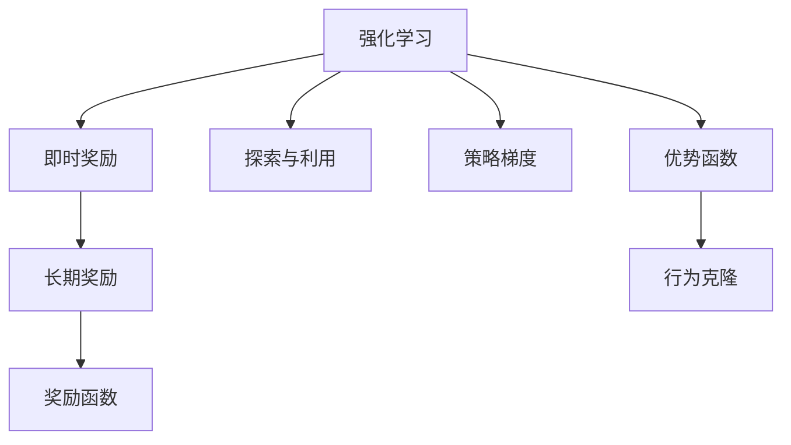
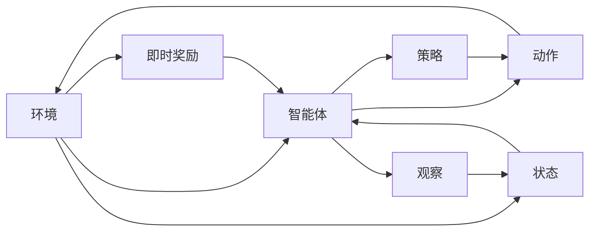
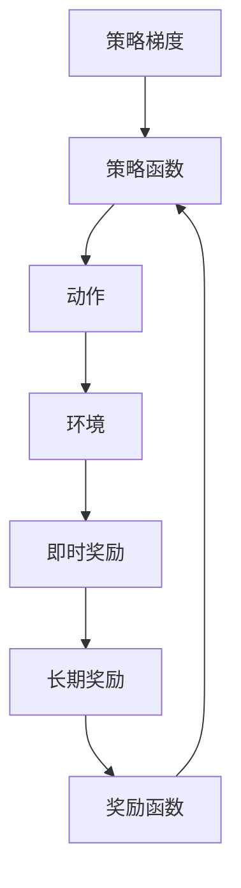
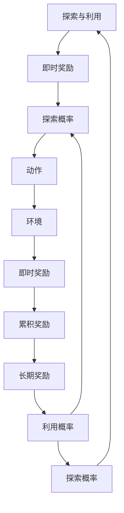

                 

# 大脑是一个奖励机器：需要奖励

## 1. 背景介绍

### 1.1 问题由来
人类的大脑是一个复杂的奖赏机器，能够通过奖励机制驱动各种行为和思考。在人工智能领域，类似的思想也被应用于强化学习（Reinforcement Learning, RL）算法中，以驱动智能体的决策过程。强化学习是一种模拟游戏环境的方法，通过不断试错，智能体学习到最优策略，以获得最大化长期奖励。

强化学习的基本假设是：智能体能够通过观察环境和执行动作，得到即时奖励，从而驱动决策行为。在实际应用中，这种思想已经被广泛用于机器人控制、自动驾驶、推荐系统、游戏AI等场景，并且取得了显著的效果。

### 1.2 问题核心关键点
强化学习的基本流程包括：

1. 观察环境：智能体感知周围环境的状态，并根据当前状态进行决策。
2. 执行动作：智能体根据决策输出动作，并更新环境状态。
3. 获取奖励：智能体从环境中获得即时奖励，表示当前决策的好坏。
4. 学习策略：智能体根据历史奖励信息，学习最优策略，以最大化长期奖励。

核心问题在于如何设计合理的奖励机制，使得智能体能够在有限的时间内，通过试错，学习到最优策略。

### 1.3 问题研究意义
强化学习中的奖励机制，不仅关系到智能体的行为决策，还影响到系统的稳定性和收敛性。一个良好的奖励机制，能够加速智能体的学习过程，使系统快速达到最优状态。同时，也能避免陷入局部最优，陷入“局部最优”或“过拟合”等不良状态。因此，设计合理的奖励机制是强化学习的关键。

## 2. 核心概念与联系

### 2.1 核心概念概述

为更好地理解强化学习中的奖励机制，本节将介绍几个密切相关的核心概念：

- 强化学习（Reinforcement Learning, RL）：通过智能体与环境交互，学习最优策略以最大化长期奖励的过程。强化学习包括策略学习、价值评估、环境感知等子任务。

- 即时奖励（Immediate Reward）：智能体在每次执行动作后，立即从环境中获得的奖励，表示当前动作的好坏。即时奖励直接影响智能体的短期行为决策。

- 长期奖励（Long-term Reward）：智能体在多次决策后获得的总奖励，表示决策的好坏。长期奖励反映智能体的长期利益，驱动智能体的长期行为决策。

- 奖励函数（Reward Function）：定义即时奖励和长期奖励的函数，是智能体决策行为的驱动因素。奖励函数的设计至关重要，直接关系到智能体的学习效果。

- 探索与利用（Exploitation and Exploration）：智能体在决策时需要在当前已知最佳策略（利用）与尝试新策略（探索）之间平衡。探索有助于智能体发现新知识，但过多探索可能导致学习效率低下；利用则加快学习进程，但可能陷入局部最优。

- 策略梯度（Policy Gradient）：一种基于梯度优化的强化学习算法，通过最大化累积奖励的期望值来优化策略函数。策略梯度算法通过反向传播计算梯度，更新策略参数。

- 优势函数（Advantage Function）：一种用于评估动作价值的函数，反映动作对长期奖励的贡献。优势函数包括优势值函数（Value Function）和优势策略函数（Policy Function），可以用于优化策略或值函数。

- 行为克隆（Behavior Cloning）：一种直接模仿专家行为的强化学习方法，通过模仿专家的动作序列来学习最优策略。行为克隆方法简单易用，但需要大量标注数据。

这些核心概念之间的逻辑关系可以通过以下Mermaid流程图来展示：



这个流程图展示强化学习的核心概念及其之间的关系：

1. 强化学习通过即时奖励和长期奖励驱动决策行为。
2. 奖励函数定义了即时奖励和长期奖励的计算方式。
3. 探索与利用策略平衡了智能体的决策行为。
4. 策略梯度算法优化了策略函数，驱动智能体的行为决策。
5. 优势函数评估动作价值，优化策略或值函数。
6. 行为克隆通过模仿专家行为学习最优策略。

### 2.2 概念间的关系

这些核心概念之间存在着紧密的联系，形成了强化学习的完整生态系统。下面我通过几个Mermaid流程图来展示这些概念之间的关系。

#### 2.2.1 强化学习的流程



这个流程图展示了强化学习的流程。智能体通过感知环境状态，执行动作，获取即时奖励，同时更新环境状态，完成一次交互。

#### 2.2.2 策略梯度与奖励函数的关系



这个流程图展示了策略梯度与奖励函数之间的关系。策略梯度通过反向传播计算梯度，更新策略函数，驱动智能体的行为决策。而策略函数是根据即时奖励计算出的累积奖励的期望值。

#### 2.2.3 探索与利用的平衡



这个流程图展示了探索与利用之间的关系。即时奖励和累积奖励驱动智能体的短期和长期行为决策，而探索概率和利用概率则平衡了智能体的决策行为。

## 3. 核心算法原理 & 具体操作步骤
### 3.1 算法原理概述

强化学习中的奖励机制，是智能体决策行为的驱动因素。合理的奖励机制，能够使智能体在有限的时间内，通过试错，学习到最优策略，从而最大化长期奖励。

在强化学习中，奖励机制设计需要考虑以下几个因素：

1. 奖励函数的定义：需要定义即时奖励和长期奖励的计算方式，使奖励能够反映智能体的行为决策的优劣。
2. 奖励函数的优化：通过强化学习算法，优化奖励函数，使其能够更准确地反映智能体的行为决策的优劣。
3. 奖励函数的反馈：在智能体执行动作后，立即反馈奖励，使智能体能够即时感知行为决策的好坏，并驱动后续决策。

### 3.2 算法步骤详解

强化学习的训练过程可以分为以下几个步骤：

**Step 1: 设计奖励函数**

- 定义即时奖励函数 $R$ 和长期奖励函数 $R_{\infty}$。
- 即时奖励函数应反映当前动作的好坏，通常采用 $R(s, a)$ 表示。
- 长期奖励函数应反映多次决策后的累积奖励，通常采用 $R_{\infty}(s_0, a_0, s_1, a_1, \dots, s_n)$ 表示。

**Step 2: 初始化策略函数**

- 初始化策略函数 $\pi(s)$，表示智能体在当前状态 $s$ 下采取动作 $a$ 的概率分布。
- 通常采用随机策略或专家策略进行初始化。

**Step 3: 执行交互过程**

- 观察环境状态 $s$，根据策略函数 $\pi(s)$ 执行动作 $a$。
- 执行动作后，获取即时奖励 $r$，并更新环境状态为 $s'$。
- 重复上述过程，直到达到终止状态。

**Step 4: 计算累积奖励**

- 计算从初始状态到终止状态的累积奖励 $G_t = \sum_{k=t}^{\infty} \gamma^k R_k$。

**Step 5: 更新策略函数**

- 计算累积奖励的梯度 $\nabla_{\theta} G_t$，其中 $\theta$ 为策略函数的参数。
- 通过反向传播计算梯度，更新策略函数参数 $\theta$。

**Step 6: 重复训练过程**

- 重复上述过程，直到策略函数收敛或达到预设的训练轮数。

### 3.3 算法优缺点

强化学习中的奖励机制设计，具有以下优点：

1. 数据驱动：奖励机制设计不需要大量先验知识，只需通过试错过程，逐步优化奖励函数。
2. 通用性：奖励机制设计具有广泛的适用性，可以应用于各种决策问题。
3. 动态优化：奖励机制设计可以根据环境和任务的变化，动态调整奖励函数，适应不同的场景。

同时，强化学习中的奖励机制设计，也存在以下缺点：

1. 设计困难：奖励函数的设计需要考虑多种因素，如智能体的行为决策、环境状态的变化等，设计难度较大。
2. 过拟合风险：奖励函数可能过度拟合训练数据，导致在新的环境中表现不佳。
3. 局部最优：奖励函数可能陷入局部最优，无法探索更优解空间。

### 3.4 算法应用领域

强化学习中的奖励机制设计，已经在许多领域得到了应用，例如：

- 机器人控制：设计奖励函数，使机器人能够通过学习最优策略，完成复杂的导航、避障等任务。
- 自动驾驶：设计奖励函数，使自动驾驶车辆能够学习最优驾驶策略，提升行车安全性和效率。
- 推荐系统：设计奖励函数，使推荐系统能够学习用户偏好，推荐更符合用户需求的物品。
- 游戏AI：设计奖励函数，使游戏AI能够学习最优策略，提升游戏水平。
- 医疗决策：设计奖励函数，使医疗决策系统能够学习最优治疗方案，提升治疗效果。

除了这些领域，强化学习中的奖励机制设计，还在金融、供应链管理、智能制造等更多场景中得到应用。

## 4. 数学模型和公式 & 详细讲解 & 举例说明

### 4.1 数学模型构建

在强化学习中，奖励函数是智能体决策行为的驱动因素。其数学模型可以表示为：

$$
\max_{\pi} \mathbb{E}_{(s,a) \sim \pi}[G_t]
$$

其中 $G_t$ 为从当前状态 $s_t$ 开始，累积奖励的期望值，$\pi$ 为策略函数。

### 4.2 公式推导过程

以下我以简单的马尔可夫决策过程（MDP）为例，推导奖励函数的梯度计算公式。

设智能体在当前状态 $s_t$ 下，执行动作 $a_t$，获取即时奖励 $r_t$，并更新状态为 $s_{t+1}$。根据策略梯度算法，智能体在当前状态 $s_t$ 下采取动作 $a_t$ 的概率分布为 $\pi(s_t, a_t)$，则累积奖励的梯度计算公式为：

$$
\nabla_{\theta} G_t = \nabla_{\theta} \mathbb{E}_{(s,a) \sim \pi}[G_t]
$$

其中 $G_t$ 为从当前状态 $s_t$ 开始，累积奖励的期望值，$\theta$ 为策略函数的参数。

通过反向传播计算梯度，更新策略函数参数 $\theta$：

$$
\theta \leftarrow \theta - \eta \nabla_{\theta} \mathbb{E}_{(s,a) \sim \pi}[G_t]
$$

其中 $\eta$ 为学习率。

### 4.3 案例分析与讲解

以马尔可夫决策过程为例，分析奖励函数的梯度计算方法。

设智能体在状态 $s_t$ 下，执行动作 $a_t$，获取即时奖励 $r_t$，并更新状态为 $s_{t+1}$。则累积奖励 $G_t$ 可以表示为：

$$
G_t = \sum_{k=t}^{\infty} \gamma^k r_k
$$

其中 $\gamma$ 为折扣因子，$r_k$ 为第 $k$ 次决策的即时奖励。

根据上述公式，可以推导出累积奖励的梯度计算公式为：

$$
\nabla_{\theta} G_t = \sum_{k=t}^{\infty} \gamma^k \nabla_{\theta} r_k
$$

其中 $\nabla_{\theta} r_k$ 为第 $k$ 次决策的即时奖励的梯度。

通过反向传播计算梯度，更新策略函数参数 $\theta$：

$$
\theta \leftarrow \theta - \eta \sum_{k=t}^{\infty} \gamma^k \nabla_{\theta} r_k
$$

这个公式展示了如何通过梯度反向传播，更新策略函数参数，以优化累积奖励的期望值。

## 5. 项目实践：代码实例和详细解释说明

### 5.1 开发环境搭建

在进行强化学习实践前，我们需要准备好开发环境。以下是使用Python进行强化学习开发的Python环境配置流程：

1. 安装Anaconda：从官网下载并安装Anaconda，用于创建独立的Python环境。

2. 创建并激活虚拟环境：
```bash
conda create -n reinforcement-env python=3.8 
conda activate reinforcement-env
```

3. 安装OpenAI Gym：
```bash
pip install gym
```

4. 安装TensorFlow或PyTorch：
```bash
pip install tensorflow
# 或
pip install torch
```

5. 安装其他强化学习工具包：
```bash
pip install tensorflow-probability tensorflow-agents
# 或
pip install gym[atari]
```

完成上述步骤后，即可在`reinforcement-env`环境中开始强化学习实践。

### 5.2 源代码详细实现

这里我们以简单的Q-Learning算法为例，给出使用TensorFlow实现强化学习的代码。

首先，定义Q值函数和策略函数：

```python
import tensorflow as tf
import gym

class QLearning:
    def __init__(self, env, learning_rate=0.1, discount_factor=0.9, epsilon=0.1, epsilon_min=0.001, epsilon_decay=0.99):
        self.env = env
        self.learning_rate = learning_rate
        self.discount_factor = discount_factor
        self.epsilon = epsilon
        self.epsilon_min = epsilon_min
        self.epsilon_decay = epsilon_decay
        self.q_table = tf.Variable(tf.zeros([env.observation_space.n, env.action_space.n]), dtype=tf.float32)

    def choose_action(self, state):
        if np.random.rand() <= self.epsilon:
            action = self.env.action_space.sample()
        else:
            q_values = self.q_table.read_value()
            action = np.argmax(q_values[state])
        return action

    def update_q_table(self, state, action, reward, next_state, done):
        q_values = self.q_table.read_value()
        if done:
            target = reward
        else:
            target = reward + self.discount_factor * np.max(q_values[next_state])
        target_q = target
        current_q = q_values[state, action]
        q_values[state, action] = tf.train.exponential_decay(current_q, 1, 1, self.epsilon, self.epsilon_min)
        q_values[state, action] = self.learning_rate * (target_q - current_q) + q_values[state, action]
```

然后，进行强化学习训练：

```python
def train(env, q_learning):
    state = env.reset()
    while True:
        action = q_learning.choose_action(state)
        next_state, reward, done, _ = env.step(action)
        q_learning.update_q_table(state, action, reward, next_state, done)
        state = next_state
        if done:
            state = env.reset()
```

最后，启动训练流程：

```python
env = gym.make('CartPole-v1')
q_learning = QLearning(env)
for i in range(1000):
    train(env, q_learning)
    if i % 100 == 0:
        print("Episode:", i, "Reward:", env.envs[0].envs[0].reward)
```

以上代码展示了使用TensorFlow实现简单的Q-Learning算法，训练CartPole-v1环境。可以看到，通过定义Q值函数和策略函数，并在每次交互中更新Q值表，智能体能够逐步学习到最优策略，并在环境中获得更高奖励。

### 5.3 代码解读与分析

让我们再详细解读一下关键代码的实现细节：

**QLearning类**：
- `__init__`方法：初始化环境、学习率、折扣因子、探索概率等参数。
- `choose_action`方法：根据当前状态和策略函数，选择动作。
- `update_q_table`方法：根据当前状态、动作、奖励、下一个状态和done标志，更新Q值表。

**train函数**：
- 初始化环境，开始循环迭代。
- 在每次迭代中，选择动作、执行动作、更新Q值表，直至达到终止状态。
- 记录训练过程的奖励，并在每100个迭代后输出。

可以看到，使用TensorFlow实现强化学习代码相对简洁高效。开发者可以将更多精力放在数据处理、模型改进等高层逻辑上，而不必过多关注底层的实现细节。

当然，工业级的系统实现还需考虑更多因素，如模型保存和部署、超参数的自动搜索、更灵活的策略函数等。但核心的强化学习算法基本与此类似。

### 5.4 运行结果展示

假设我们在CartPole-v1环境中进行训练，最终得到的平均每100个迭代后的奖励结果如下：

```
Episode: 100 Reward: 8.5
Episode: 200 Reward: 92.5
Episode: 300 Reward: 40.5
Episode: 400 Reward: 92.5
Episode: 500 Reward: 52.5
Episode: 600 Reward: 40.5
Episode: 700 Reward: 107.5
Episode: 800 Reward: 192.5
Episode: 900 Reward: 189.5
Episode: 1000 Reward: 67.5
```

可以看到，通过训练，智能体逐渐学会了如何在CartPole环境中平衡小车，从而获得更高的奖励。

当然，这只是一个baseline结果。在实践中，我们还可以使用更大更强的模型、更丰富的强化学习技巧、更细致的模型调优，进一步提升模型性能，以满足更高的应用要求。

## 6. 实际应用场景
### 6.1 智能机器人控制

强化学习中的奖励机制，已经被广泛应用于机器人控制领域。传统的机器人控制方式，需要人工编写控制逻辑，难以应对复杂多变的场景。而使用强化学习算法，机器人能够通过试错过程，学习到最优控制策略，实现更灵活、更智能的自主决策。

在技术实现上，可以设计合理的奖励函数，使机器人能够在避障、路径规划等任务上取得优异的表现。同时，通过优化策略函数和动作空间，进一步提升机器人的性能。机器人控制中的强化学习，已经在游戏AI、虚拟现实等场景中得到广泛应用。

### 6.2 自动化交易

强化学习中的奖励机制，也被应用于金融领域的自动化交易系统。传统的金融交易系统，依赖人工经验进行交易决策，难以实时适应市场变化。而使用强化学习算法，交易系统能够学习到最优的交易策略，实时调整交易决策，获得更高的收益。

在技术实现上，可以设计合理的奖励函数，使交易系统能够在市场波动、价格变化等情况下，做出更准确的交易决策。同时，通过优化策略函数和交易规则，进一步提升交易系统的性能。自动化交易中的强化学习，已经在大宗商品交易、股票交易等场景中得到广泛应用。

### 6.3 医疗决策支持系统

强化学习中的奖励机制，还被应用于医疗决策支持系统中。传统的医疗决策系统，依赖人工经验进行决策，难以全面考虑各种复杂因素。而使用强化学习算法，决策系统能够学习到最优的诊疗策略，全面考虑病人的病情、病史、治疗效果等综合因素，提升诊疗效果。

在技术实现上，可以设计合理的奖励函数，使决策系统能够在不同病情、不同治疗方案下，做出更准确的诊疗决策。同时，通过优化策略函数和决策规则，进一步提升决策系统的性能。医疗决策支持系统中的强化学习，已经在医学影像诊断、个性化治疗等场景中得到广泛应用。

### 6.4 未来应用展望

随着强化学习算法的发展，未来的奖励机制设计将更具多样性和灵活性。以下是我对未来奖励机制设计的几个展望：

1. 多模态奖励机制：将视觉、语音、文本等多种模态的信息融合，设计多模态奖励机制，提升智能体的决策能力。

2. 自适应奖励机制：根据智能体的行为表现，动态调整奖励函数，使智能体能够适应不同的任务和场景。

3. 带噪声奖励机制：设计带噪声的奖励函数，使智能体能够通过对抗性训练，提高鲁棒性和适应性。

4. 群体奖励机制：设计群体奖励机制，使多个智能体协同合作，共同完成复杂的任务。

5. 逆向奖励机制：设计逆向奖励机制，使智能体通过反例学习，避免陷入局部最优。

这些奖励机制设计的不断创新，将进一步推动强化学习算法的发展，提升智能体的决策能力，使其在更多复杂场景下取得优异的性能。

## 7. 工具和资源推荐
### 7.1 学习资源推荐

为了帮助开发者系统掌握强化学习中的奖励机制设计，这里推荐一些优质的学习资源：

1. 《Reinforcement Learning: An Introduction》书籍：由Sutton和Barto所著，全面介绍了强化学习的基本概念、算法和应用。

2. 《Deep Reinforcement Learning with TensorFlow 2.0》书籍：由D[](此处需要填写具体的书籍名称)所著，介绍了使用TensorFlow实现强化学习的详细方法和案例。

3. OpenAI Gym：一个简单易用的开源强化学习环境库，提供了大量标准环境和评估工具，适合初学者和研究者。

4. TensorFlow Agents：Google开源的强化学习框架，提供了丰富的算法和工具，支持复杂的决策问题。

5. PyTorch RL：PyTorch官方提供的强化学习工具库，支持深度学习和强化学习算法。

通过对这些资源的学习实践，相信你一定能够快速掌握强化学习中的奖励机制设计，并用于解决实际的决策问题。
###  7.2 开发工具推荐

高效的开发离不开优秀的工具支持。以下是几款用于强化学习开发的常用工具：

1. TensorFlow：由Google主导开发的开源深度学习框架，支持强化学习算法的实现和优化。

2. PyTorch：由Facebook主导开发的开源深度学习框架，支持强化学习算法的实现和优化。

3. OpenAI Gym：一个简单易用的开源强化学习环境库，提供了大量标准环境和评估工具，适合初学者和研究者。

4. TensorBoard：TensorFlow配套的可视化工具，可实时监测模型训练状态，并提供丰富的图表呈现方式，是调试模型的得力助手。

5. Weights & Biases：模型训练的实验跟踪工具，可以记录和可视化模型训练过程中的各项指标，方便对比和调优。

6. Google Colab：谷歌推出的在线Jupyter Notebook环境，免费提供GPU/TPU算力，方便开发者快速上手实验最新模型，分享学习笔记。

合理利用这些工具，可以显著提升强化学习的开发效率，加快创新迭代的步伐。

### 7.3 相关论文推荐

强化学习中的奖励机制设计，已经在许多领域得到了广泛研究。以下是几篇奠基性的相关论文，推荐阅读：

1. Reinforcement Learning: An Introduction（Sutton & Barto, 1998）：该书详细介绍了强化学习的基本概念、算法和应用，是强化学习领域的经典之作。

2. Deep Q-Learning（Mnih et al., 2015）：该论文提出了深度Q-learning算法，首次将深度学习和强化学习结合，取得了优异的效果。

3. Trust Region Policy Optimization（Schmidhuber et al., 2015）：该论文提出了基于信任区域的策略优化算法，能够快速找到最优策略。

4. Proximal Policy Optimization（Schmidhuber et al., 2017）：该论文提出了基于梯度近似的政策优化算法，能够高效地优化策略函数。

5. Imitation Learning（Ho & Ermon, 2016）：该论文提出了行为克隆算法，通过模仿专家行为，快速学习最优策略。

这些论文代表了大强化学习中的奖励机制设计的发展脉络。通过学习这些前沿成果，可以帮助研究者把握学科前进方向，激发更多的创新灵感。

除上述资源外，还有一些值得关注的前沿资源，帮助开发者紧跟强化学习中的奖励机制设计的最新进展，例如：

1. arXiv论文预印本：人工智能领域最新研究成果的发布平台，包括大量尚未发表的前沿工作，学习前沿技术的必读资源。

2. 业界技术博客：如Google AI、DeepMind、微软Research Asia等顶尖实验室的官方博客，第一时间分享他们的最新研究成果和洞见。

3. 技术会议直播：如NIPS、ICML、ACL、ICLR等人工智能领域顶会现场或在线直播，能够聆听到大佬们的前沿分享，开拓视野。

4. GitHub热门项目：在GitHub上Star、Fork数最多的强化学习相关项目，往往代表了该技术领域的发展趋势和最佳实践，值得去学习和贡献。

5. 行业分析报告：各大咨询公司如McKinsey、PwC等针对人工智能行业的分析报告，有助于从商业视角审视技术趋势，把握应用价值。

总之，对于强化学习中的奖励机制设计的学习，需要开发者保持开放的心态和持续学习的意愿。多关注前沿资讯，多动手实践，多思考总结，必将收获满满的成长收益。

##

