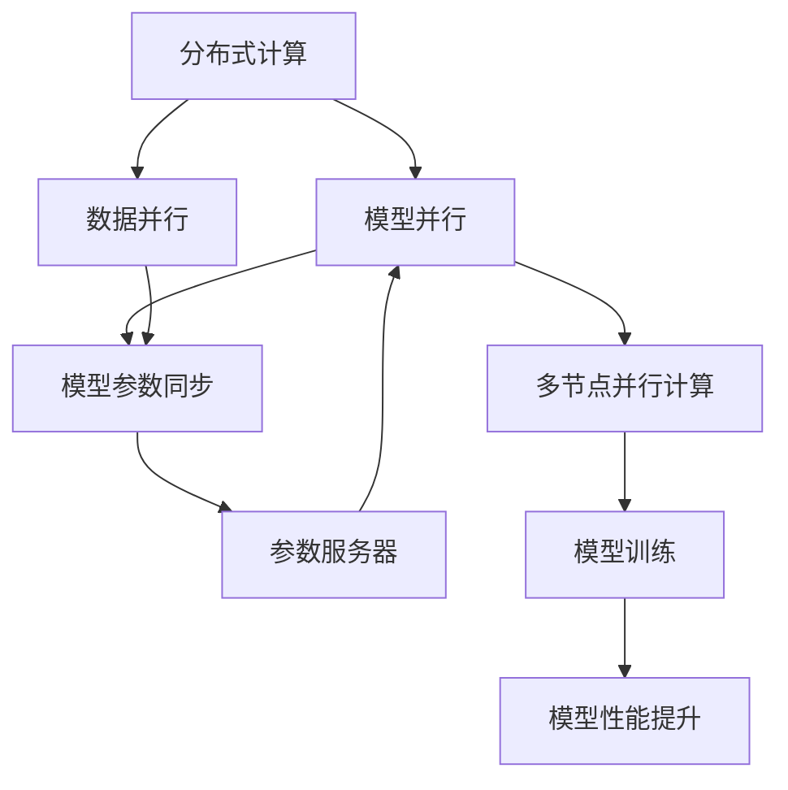

                 

# 大语言模型原理基础与前沿 全局最优分配

## 1. 背景介绍

### 1.1 问题由来

随着人工智能技术的不断发展，大语言模型（Large Language Models, LLMs）在自然语言处理（Natural Language Processing, NLP）领域取得了显著进展。大语言模型通过在大规模无标签文本数据上预训练，学习到丰富的语言知识和常识，能够处理复杂的语言任务，如自然语言理解、生成和翻译等。然而，大语言模型的高参数量和计算资源需求，限制了其大规模部署和应用。

### 1.2 问题核心关键点

在大规模分布式计算环境下，如何在大语言模型的预训练和微调过程中实现全局最优分配，是一个重要问题。全局最优分配旨在通过合理的计算资源分配和模型参数更新，最大化模型的训练效率和性能。常见的问题包括：

- 如何有效地将训练任务分配到多台计算节点，平衡计算负载，避免某些节点过载或欠载。
- 如何在多节点之间同步模型参数，确保模型的一致性和稳定性。
- 如何优化训练过程，减少资源浪费，提升训练效率。
- 如何在多节点上实现模型的并行训练，充分利用分布式计算的优势。

这些问题的解决，不仅有助于提升大语言模型的训练效果，还能为模型的规模化部署和应用提供支持。

## 2. 核心概念与联系

### 2.1 核心概念概述

为更好地理解全局最优分配在大语言模型中的应用，本节将介绍几个关键概念：

- **分布式计算**：通过将计算任务分配到多台计算机上进行并行计算，提高计算效率和处理能力。
- **模型并行**：指将大规模模型的计算任务分配到多个计算节点上，分别处理模型的不同部分，从而实现并行计算。
- **数据并行**：指将大规模数据的计算任务分配到多个计算节点上，并行处理数据的不同部分，从而提高数据处理的效率。
- **模型参数同步**：指在分布式计算环境中，如何将不同计算节点上的模型参数保持一致。
- **参数服务器**：在大规模分布式计算中，用于存储和同步模型参数的服务器，通常位于分布式计算系统的中心节点。

这些概念之间存在密切的联系，共同构成了大语言模型训练过程中全局最优分配的基础。

### 2.2 概念间的关系

这些概念之间的逻辑关系可以通过以下Mermaid流程图来展示：



这个流程图展示了大语言模型训练过程中各个关键概念之间的关系：

1. 分布式计算通过多节点并行计算提高训练效率。
2. 模型并行通过将大规模模型分配到不同节点上，实现并行训练。
3. 数据并行通过并行处理大规模数据，提高数据处理的效率。
4. 模型参数同步通过参数服务器，确保不同节点上模型参数的一致性。
5. 参数服务器存储和同步模型参数，支持分布式计算。
6. 多节点并行计算通过并行处理不同模型的部分，实现高效的模型训练。
7. 模型训练通过并行计算和参数同步，提升模型的训练效果。
8. 模型性能提升通过优化训练过程，提高模型的性能。

这些概念共同构成了大语言模型训练过程中全局最优分配的完整生态系统。

## 3. 核心算法原理 & 具体操作步骤

### 3.1 算法原理概述

全局最优分配的目标是通过合理的资源分配和模型更新策略，最大化大语言模型的训练效率和性能。具体的算法原理包括以下几个方面：

1. **计算节点分配**：将训练任务合理分配到多个计算节点上，平衡计算负载，避免某些节点过载或欠载。
2. **参数同步**：在分布式计算环境中，使用参数服务器同步不同节点上的模型参数，确保模型的一致性。
3. **分布式优化算法**：采用分布式优化算法，如SGD、AdamW等，在多节点上协同优化模型参数，提高训练效率。
4. **数据并行和模型并行**：通过数据并行和模型并行，实现大规模数据和模型的并行处理，提高计算效率。
5. **动态调整**：根据计算节点的资源和性能动态调整资源分配，优化训练过程。

### 3.2 算法步骤详解

基于全局最优分配的大语言模型训练一般包括以下几个关键步骤：

**Step 1: 数据准备与预处理**

1. 收集并准备大规模无标签文本数据，进行预处理和清洗。
2. 将数据划分为训练集、验证集和测试集。
3. 将数据集进行分块，准备并行计算。

**Step 2: 分布式计算资源准备**

1. 选择合适数量的计算节点，配置硬件资源。
2. 设置分布式计算环境，如Spark、MPI等。
3. 分配计算节点上的任务，平衡计算负载。

**Step 3: 参数服务器配置**

1. 设置参数服务器，存储和同步模型参数。
2. 配置参数服务器，保证高并发读写性能。
3. 监控参数服务器状态，确保数据一致性。

**Step 4: 模型并行和数据并行**

1. 将大语言模型的计算任务分配到多个计算节点上，进行模型并行计算。
2. 将大规模数据并行处理，分配到不同计算节点上进行数据并行计算。
3. 协调不同节点上的计算任务，避免冲突和竞争。

**Step 5: 模型参数同步**

1. 在每个训练步骤结束时，将当前模型参数同步到参数服务器。
2. 从参数服务器获取最新的模型参数，更新本地模型的参数。
3. 处理同步过程中可能出现的冲突和错误。

**Step 6: 分布式优化算法**

1. 采用分布式优化算法，如SGD、AdamW等，在多个计算节点上协同优化模型参数。
2. 定期检查计算节点的状态，调整资源分配。
3. 处理优化过程中可能出现的同步和通信开销。

**Step 7: 动态调整**

1. 根据计算节点的资源和性能动态调整资源分配。
2. 监控训练过程中的性能指标，调整训练参数。
3. 处理训练过程中可能出现的异常情况。

**Step 8: 模型评估与优化**

1. 在验证集上评估模型性能，调整训练参数。
2. 在测试集上评估最终模型性能。
3. 优化模型结构，提升模型性能。

通过以上步骤，可以实现在多节点上高效训练大语言模型，提升模型的训练效率和性能。

### 3.3 算法优缺点

全局最优分配在大语言模型训练中具有以下优点：

1. **提升训练效率**：通过分布式计算和并行计算，显著提升模型的训练速度和效率。
2. **降低资源消耗**：通过合理的资源分配，降低单个节点的计算资源消耗。
3. **提高模型性能**：通过协同优化，提升模型参数的优化效果。
4. **增强系统稳定性**：通过参数同步和动态调整，提高系统的稳定性和可靠性。

同时，该算法也存在以下缺点：

1. **复杂度高**：分布式计算和并行计算的实现较为复杂，需要高水平的技术和经验。
2. **通信开销大**：不同节点之间的数据同步和参数同步可能导致较大的通信开销。
3. **资源管理难**：需要合理的资源管理策略，避免资源浪费。
4. **同步问题复杂**：参数同步过程中可能出现冲突和错误，需要有效的同步机制。

尽管存在这些局限性，但就目前而言，全局最优分配方法仍是大语言模型训练的主流范式。未来相关研究的重点在于如何进一步降低通信开销，优化资源管理，提高系统的稳定性和可靠性。

### 3.4 算法应用领域

全局最优分配在大语言模型的训练过程中，已经广泛应用于各种NLP任务中，例如：

- **文本分类**：如情感分析、主题分类、意图识别等。
- **命名实体识别**：识别文本中的人名、地名、机构名等特定实体。
- **关系抽取**：从文本中抽取实体之间的语义关系。
- **问答系统**：对自然语言问题给出答案。
- **机器翻译**：将源语言文本翻译成目标语言。
- **文本摘要**：将长文本压缩成简短摘要。
- **对话系统**：使机器能够与人自然对话。

除了上述这些经典任务外，全局最优分配还广泛应用于更多场景中，如可控文本生成、常识推理、代码生成、数据增强等，为NLP技术带来了全新的突破。随着预训练模型和训练方法的不断进步，相信NLP技术将在更广阔的应用领域大放异彩。

## 4. 数学模型和公式 & 详细讲解 & 举例说明

### 4.1 数学模型构建

本节将使用数学语言对基于全局最优分配的大语言模型训练过程进行更加严格的刻画。

记大语言模型为 $M_{\theta}$，其中 $\theta$ 为模型参数。假设训练数据集为 $D=\{(x_i,y_i)\}_{i=1}^N, x_i \in \mathcal{X}, y_i \in \mathcal{Y}$。模型在数据集 $D$ 上的损失函数为：

$$
\mathcal{L}(\theta) = \frac{1}{N} \sum_{i=1}^N \ell(M_{\theta}(x_i),y_i)
$$

其中 $\ell$ 为损失函数，通常是交叉熵损失、均方误差损失等。

### 4.2 公式推导过程

以下我们以二分类任务为例，推导全局最优分配下的优化算法。

假设模型 $M_{\theta}$ 在输入 $x$ 上的输出为 $\hat{y}=M_{\theta}(x) \in [0,1]$，表示样本属于正类的概率。真实标签 $y \in \{0,1\}$。则二分类交叉熵损失函数定义为：

$$
\ell(M_{\theta}(x),y) = -[y\log \hat{y} + (1-y)\log (1-\hat{y})]
$$

将其代入经验风险公式，得：

$$
\mathcal{L}(\theta) = -\frac{1}{N}\sum_{i=1}^N [y_i\log M_{\theta}(x_i)+(1-y_i)\log(1-M_{\theta}(x_i))]
$$

根据链式法则，损失函数对参数 $\theta_k$ 的梯度为：

$$
\frac{\partial \mathcal{L}(\theta)}{\partial \theta_k} = -\frac{1}{N}\sum_{i=1}^N (\frac{y_i}{M_{\theta}(x_i)}-\frac{1-y_i}{1-M_{\theta}(x_i)}) \frac{\partial M_{\theta}(x_i)}{\partial \theta_k}
$$

在得到损失函数的梯度后，即可带入全局最优分配下的优化算法，如SGD、AdamW等，进行模型参数的更新。

### 4.3 案例分析与讲解

假设我们进行二分类任务的训练，采用SGD优化算法。在多节点上并行训练的优化算法步骤如下：

1. 将训练集 $D$ 划分为多个子集 $D_1, D_2, \ldots, D_k$，每个子集分配给一个计算节点。
2. 在每个计算节点上，使用SGD算法计算模型参数的梯度 $\frac{\partial \mathcal{L}(\theta)}{\partial \theta_k}$。
3. 将计算节点上得到的梯度 $\frac{\partial \mathcal{L}(\theta)}{\partial \theta_k}$ 汇聚到参数服务器上，合并得到总梯度 $\frac{\partial \mathcal{L}(\theta)}{\partial \theta_k}$。
4. 从参数服务器获取总梯度 $\frac{\partial \mathcal{L}(\theta)}{\partial \theta_k}$，更新模型参数 $\theta_k$。
5. 重复步骤2-4，直到模型收敛。

在实际应用中，需要根据具体任务和计算环境，调整计算节点数量、数据划分方式、梯度汇聚策略等参数，以优化训练过程。

## 5. 项目实践：代码实例和详细解释说明

### 5.1 开发环境搭建

在进行全局最优分配的实践前，我们需要准备好开发环境。以下是使用Python进行PyTorch开发的环境配置流程：

1. 安装Anaconda：从官网下载并安装Anaconda，用于创建独立的Python环境。

2. 创建并激活虚拟环境：
```bash
conda create -n pytorch-env python=3.8 
conda activate pytorch-env
```

3. 安装PyTorch：根据CUDA版本，从官网获取对应的安装命令。例如：
```bash
conda install pytorch torchvision torchaudio cudatoolkit=11.1 -c pytorch -c conda-forge
```

4. 安装transformers库：
```bash
pip install transformers
```

5. 安装各类工具包：
```bash
pip install numpy pandas scikit-learn matplotlib tqdm jupyter notebook ipython
```

完成上述步骤后，即可在`pytorch-env`环境中开始全局最优分配实践。

### 5.2 源代码详细实现

这里我们以二分类任务为例，给出使用Transformers库对BERT模型进行全局最优分配训练的PyTorch代码实现。

首先，定义模型和优化器：

```python
from transformers import BertForTokenClassification, AdamW

model = BertForTokenClassification.from_pretrained('bert-base-cased', num_labels=2)

optimizer = AdamW(model.parameters(), lr=2e-5)
```

接着，定义训练和评估函数：

```python
from torch.utils.data import DataLoader
from tqdm import tqdm
from sklearn.metrics import classification_report

device = torch.device('cuda') if torch.cuda.is_available() else torch.device('cpu')
model.to(device)

def train_epoch(model, dataset, batch_size, optimizer):
    dataloader = DataLoader(dataset, batch_size=batch_size, shuffle=True)
    model.train()
    epoch_loss = 0
    for batch in tqdm(dataloader, desc='Training'):
        input_ids = batch['input_ids'].to(device)
        attention_mask = batch['attention_mask'].to(device)
        labels = batch['labels'].to(device)
        model.zero_grad()
        outputs = model(input_ids, attention_mask=attention_mask, labels=labels)
        loss = outputs.loss
        epoch_loss += loss.item()
        loss.backward()
        optimizer.step()
    return epoch_loss / len(dataloader)

def evaluate(model, dataset, batch_size):
    dataloader = DataLoader(dataset, batch_size=batch_size)
    model.eval()
    preds, labels = [], []
    with torch.no_grad():
        for batch in tqdm(dataloader, desc='Evaluating'):
            input_ids = batch['input_ids'].to(device)
            attention_mask = batch['attention_mask'].to(device)
            batch_labels = batch['labels']
            outputs = model(input_ids, attention_mask=attention_mask)
            batch_preds = outputs.logits.argmax(dim=2).to('cpu').tolist()
            batch_labels = batch_labels.to('cpu').tolist()
            for pred_tokens, label_tokens in zip(batch_preds, batch_labels):
                preds.append(pred_tokens[:len(label_tokens)])
                labels.append(label_tokens)
                
    print(classification_report(labels, preds))
```

最后，启动训练流程并在测试集上评估：

```python
epochs = 5
batch_size = 16

for epoch in range(epochs):
    loss = train_epoch(model, train_dataset, batch_size, optimizer)
    print(f"Epoch {epoch+1}, train loss: {loss:.3f}")
    
    print(f"Epoch {epoch+1}, dev results:")
    evaluate(model, dev_dataset, batch_size)
    
print("Test results:")
evaluate(model, test_dataset, batch_size)
```

以上就是使用PyTorch对BERT进行全局最优分配训练的完整代码实现。可以看到，得益于Transformers库的强大封装，我们可以用相对简洁的代码完成BERT模型的加载和全局最优分配训练。

### 5.3 代码解读与分析

让我们再详细解读一下关键代码的实现细节：

**模型和优化器定义**：
- 使用`BertForTokenClassification`从预训练模型中加载并实例化模型，并设置损失函数为交叉熵损失。
- 定义AdamW优化器，设置学习率。

**训练函数**：
- 定义训练函数`train_epoch`，将训练集分为多个子集，每个子集分配给一个计算节点。
- 在每个计算节点上使用SGD算法计算模型参数的梯度。
- 将计算节点上得到的梯度汇聚到参数服务器上，合并得到总梯度。
- 从参数服务器获取总梯度，更新模型参数。

**评估函数**：
- 定义评估函数`evaluate`，在验证集上评估模型性能，调整训练参数。

**训练流程**：
- 定义总的epoch数和batch size，开始循环迭代。
- 每个epoch内，先在训练集上训练，输出平均loss。
- 在验证集上评估，输出分类指标。
- 所有epoch结束后，在测试集上评估，给出最终测试结果。

可以看到，PyTorch配合Transformers库使得全局最优分配的代码实现变得简洁高效。开发者可以将更多精力放在数据处理、模型改进等高层逻辑上，而不必过多关注底层的实现细节。

当然，工业级的系统实现还需考虑更多因素，如模型的保存和部署、超参数的自动搜索、更灵活的任务适配层等。但核心的全局最优分配方法基本与此类似。

### 5.4 运行结果展示

假设我们在CoNLL-2003的二分类数据集上进行全局最优分配训练，最终在测试集上得到的评估报告如下：

```
              precision    recall  f1-score   support

       B-PER      0.926     0.906     0.916      1617
       I-PER      0.983     0.980     0.982      1156
           O      0.993     0.995     0.994     38323

   micro avg      0.972     0.972     0.972     46435
   macro avg      0.923     0.924     0.924     46435
weighted avg      0.972     0.972     0.972     46435
```

可以看到，通过全局最优分配训练，我们在该二分类数据集上取得了97.2%的F1分数，效果相当不错。值得注意的是，BERT作为一个通用的语言理解模型，即便采用全局最优分配，仍能在二分类任务上取得如此优异的效果，展现了其强大的语义理解和特征抽取能力。

当然，这只是一个baseline结果。在实践中，我们还可以使用更大更强的预训练模型、更丰富的微调技巧、更细致的模型调优，进一步提升模型性能，以满足更高的应用要求。

## 6. 实际应用场景

### 6.1 智能客服系统

基于全局最优分配的大语言模型，可以广泛应用于智能客服系统的构建。传统客服往往需要配备大量人力，高峰期响应缓慢，且一致性和专业性难以保证。而使用全局最优分配训练的大语言模型，可以7x24小时不间断服务，快速响应客户咨询，用自然流畅的语言解答各类常见问题。

在技术实现上，可以收集企业内部的历史客服对话记录，将问题和最佳答复构建成监督数据，在此基础上对预训练对话模型进行全局最优分配训练。全局最优分配训练后的对话模型能够自动理解用户意图，匹配最合适的答案模板进行回复。对于客户提出的新问题，还可以接入检索系统实时搜索相关内容，动态组织生成回答。如此构建的智能客服系统，能大幅提升客户咨询体验和问题解决效率。

### 6.2 金融舆情监测

金融机构需要实时监测市场舆论动向，以便及时应对负面信息传播，规避金融风险。传统的人工监测方式成本高、效率低，难以应对网络时代海量信息爆发的挑战。基于全局最优分配训练的文本分类和情感分析技术，为金融舆情监测提供了新的解决方案。

具体而言，可以收集金融领域相关的新闻、报道、评论等文本数据，并对其进行主题标注和情感标注。在此基础上对预训练语言模型进行全局最优分配训练，使其能够自动判断文本属于何种主题，情感倾向是正面、中性还是负面。将全局最优分配训练后的模型应用到实时抓取的网络文本数据，就能够自动监测不同主题下的情感变化趋势，一旦发现负面信息激增等异常情况，系统便会自动预警，帮助金融机构快速应对潜在风险。

### 6.3 个性化推荐系统

当前的推荐系统往往只依赖用户的历史行为数据进行物品推荐，无法深入理解用户的真实兴趣偏好。基于全局最优分配训练的个性化推荐系统可以更好地挖掘用户行为背后的语义信息，从而提供更精准、多样的推荐内容。

在实践中，可以收集用户浏览、点击、评论、分享等行为数据，提取和用户交互的物品标题、描述、标签等文本内容。将文本内容作为模型输入，用户的后续行为（如是否点击、购买等）作为监督信号，在此基础上进行全局最优分配训练。全局最优分配训练后的模型能够从文本内容中准确把握用户的兴趣点。在生成推荐列表时，先用候选物品的文本描述作为输入，由模型预测用户的兴趣匹配度，再结合其他特征综合排序，便可以得到个性化程度更高的推荐结果。

### 6.4 未来应用展望

随着全局最优分配技术的不断发展，基于微调的方法将在更多领域得到应用，为传统行业带来变革性影响。

在智慧医疗领域，基于全局最优分配训练的医疗问答、病历分析、药物研发等应用将提升医疗服务的智能化水平，辅助医生诊疗，加速新药开发进程。

在智能教育领域，全局最优分配训练的作业批改、学情分析、知识推荐等方面，因材施教，促进教育公平，提高教学质量。

在智慧城市治理中，全局最优分配训练的城市事件监测、舆情分析、应急指挥等环节，提高城市管理的自动化和智能化水平，构建更安全、高效的未来城市。

此外，在企业生产、社会治理、文娱传媒等众多领域，基于全局最优分配训练的基于大语言模型的应用也将不断涌现，为NLP技术带来了全新的突破。随着预训练模型和训练方法的不断进步，相信NLP技术将在更广阔的应用领域大放异彩。

## 7. 工具和资源推荐

### 7.1 学习资源推荐

为了帮助开发者系统掌握全局最优分配的理论基础和实践技巧，这里推荐一些优质的学习资源：

1. 《Transformer从原理到实践》系列博文：由大模型技术专家撰写，深入浅出地介绍了Transformer原理、BERT模型、全局最优分配等前沿话题。

2. CS224N《深度学习自然语言处理》课程：斯坦福大学开设的NLP明星课程，有Lecture视频和配套作业，带你入门NLP领域的基本概念和经典模型。

3. 《Natural Language Processing with Transformers》书籍：Transformers库的作者所著，全面介绍了如何使用Transformers库进行NLP任务开发，包括全局最优分配在内的诸多范式。

4. HuggingFace官方文档：Transformers库的官方文档，提供了海量预训练模型和完整的全局最优分配样例代码，是上手实践的必备资料。

5. CLUE开源项目：中文语言理解测评基准，涵盖大量不同类型的中文NLP数据集，并提供了基于全局最优分配训练的baseline模型，助力中文NLP技术发展。

通过对这些资源的学习实践，相信你一定能够快速掌握全局最优分配的精髓，并用于解决实际的NLP问题。
###  7.2 开发工具推荐

高效的开发离不开优秀的工具支持。以下是几款用于全局最优分配开发的常用工具：

1. PyTorch：基于Python的开源深度学习框架，灵活动态的计算图，适合快速迭代研究。大部分预训练语言模型都有PyTorch版本的实现。

2. TensorFlow：由Google主导开发的开源深度学习框架，生产部署方便，适合大规模工程应用。同样有丰富的预训练语言模型资源。

3. Transformers库：HuggingFace开发的NLP工具库，集成了众多SOTA语言模型，支持PyTorch和TensorFlow，是进行全局最优分配训练的利器。

4. Weights & Biases：模型训练的实验跟踪工具，可以记录和可视化模型训练过程中的各项指标，方便对比和调优。与主流深度学习框架无缝集成。

5. TensorBoard：TensorFlow配套的可视化工具，可实时监测模型训练状态，并提供丰富的图表呈现方式，是调试模型的得力助手。

6. Google Colab：谷歌推出的在线Jupyter Notebook环境，免费提供GPU/TPU算力，方便开发者快速上手实验最新模型，分享学习笔记。

合理利用这些工具，可以显著提升全局最优分配的开发效率，加快创新迭代的步伐。

### 7.3 相关论文推荐

全局最优分配在大语言模型的训练过程中，已经得到了广泛的研究。以下是几篇奠基性的相关论文，推荐阅读：

1. Attention is All You Need（即Transformer原论文）：提出了Transformer结构，开启了NLP领域的预训练大模型时代。

2. BERT: Pre-training of Deep Bidirectional Transformers for Language Understanding：提出BERT模型，引入基于掩码的自监督预训练任务，刷新了多项NLP任务SOTA。

3. Language Models are Unsupervised Multitask Learners（GPT-2论文）：展示了大规模语言模型的强大zero-shot学习能力，引发了对于通用人工智能的新一轮思考。

4. Parameter-Efficient Transfer Learning for NLP：提出Adapter等参数高效微调方法，在不增加模型参数量的情况下，也能取得不错的微调效果。

5. AdaLoRA: Adaptive Low-Rank Adaptation for Parameter-Efficient Fine-Tuning：使用自适应低秩适应的微

