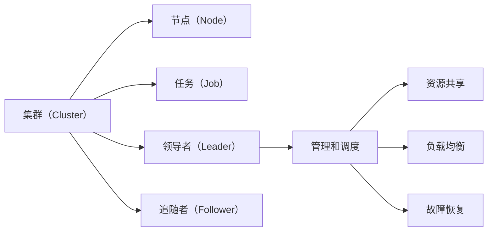

                 

# 单领导集群的实现与维护

## 1. 背景介绍

### 1.1 问题由来

在现代企业信息化建设中，云计算和大数据技术的广泛应用，推动了企业IT架构的快速演变。传统单体应用系统已无法满足现代企业对数据处理和业务扩展的需求，而大规模分布式系统已成为当下热门解决方案。在分布式系统中，通常采用多节点、多进程协同工作的形式，以实现对数据的并行处理和负载均衡。但随之而来的问题是，多个进程之间的通信和协调变得复杂，需要消耗大量的系统资源。为了解决这些问题，分布式系统中引入了集群架构，通过多个进程协同工作，实现资源共享和负载均衡，提升系统的扩展性和容错能力。

### 1.2 问题核心关键点

在分布式系统中，集群架构一般由多个节点组成，每个节点上运行一个或多个应用进程，通过集群管理器（Master Node）对集群进行统一管理和调度。集群管理器一般负责任务的分配、负载均衡、故障恢复等关键功能，是整个集群系统的核心组件。

集群架构的实现，需要考虑以下几个核心关键点：

1. **高可用性**：集群架构设计时，需要考虑节点的故障恢复，确保集群在任何时候都能正常工作。
2. **负载均衡**：集群架构设计时，需要考虑任务的均衡分配，避免某个节点过载，导致整个集群系统性能下降。
3. **扩展性**：集群架构设计时，需要考虑系统的扩展性，方便在未来增加或减少节点，提升系统性能。
4. **高吞吐量**：集群架构设计时，需要考虑系统的吞吐量，确保系统能够处理大量的并发请求。

这些核心关键点，是设计和实现单领导集群架构的主要考量因素。本文将围绕这些关键点，详细讲解单领导集群架构的实现与维护方法。

## 2. 核心概念与联系

### 2.1 核心概念概述

为了深入理解单领导集群的实现与维护方法，首先需要了解几个核心概念：

1. **集群（Cluster）**：由多个节点组成，用于实现资源共享、负载均衡和故障恢复的分布式系统。
2. **节点（Node）**：集群中每个独立的计算单元，用于运行一个或多个应用进程。
3. **任务（Job）**：集群中的工作单元，通常是多个计算任务组成，用于实现某个具体的业务逻辑。
4. **领导者（Leader）**：集群中负责管理和调度的核心节点，通常只有一个，用于管理和协调集群中的各个节点。
5. **追随者（Follower）**：集群中服从领导者管理和调度的节点，通常有多个。

这些核心概念之间存在紧密的联系，通过领导者对追随者的管理和协调，实现整个集群的统一调度、负载均衡和故障恢复。

### 2.2 概念间的关系

为了更好地理解这些核心概念之间的关系，我们用以下Mermaid流程图来展示：



这个流程图展示了一个简单的单领导集群架构，集群通过领导者管理和调度，实现了任务分配、资源共享、负载均衡和故障恢复等功能。

## 3. 核心算法原理 & 具体操作步骤
### 3.1 算法原理概述

单领导集群架构的核心算法原理，主要是通过领导者对追随者的管理和调度，实现整个集群的统一管理和调度。具体而言，包括以下几个关键步骤：

1. **任务分配**：领导者根据任务的负载情况，将任务分配给合适的追随者节点。
2. **负载均衡**：领导者根据各个追随者的负载情况，调整任务的分配，避免某个节点过载。
3. **故障恢复**：领导者负责监控各个节点的状态，在节点出现故障时，将任务重新分配给其他节点，确保集群系统的正常运行。

### 3.2 算法步骤详解

单领导集群架构的实现和维护，主要包括以下几个关键步骤：

#### 3.2.1 任务分配

任务分配是单领导集群架构的基础，需要根据任务的负载情况，将任务合理地分配给各个追随者节点。任务分配算法有多种实现方式，下面以随机轮询算法为例进行讲解。

**随机轮询算法**：
1. 领导者将任务列表中的任务随机分配给各个追随者节点，每个节点都有相等的机会获得任务。
2. 当某个节点出现故障时，领导者将任务重新分配给其他节点，避免该节点过载。

**示例代码**：

```python
import random

# 定义任务列表
tasks = ['Task1', 'Task2', 'Task3', 'Task4']

# 定义追随者节点列表
followers = ['Node1', 'Node2', 'Node3', 'Node4']

# 定义领导者
leader = 'MasterNode'

# 将任务随机分配给追随者节点
def distribute_tasks(tasks, followers):
    for task in tasks:
        follower = random.choice(followers)
        print(f"{task} 分配给 {follower}")

distribute_tasks(tasks, followers)
```

#### 3.2.2 负载均衡

负载均衡是单领导集群架构的关键功能，需要根据各个节点的负载情况，调整任务的分配，避免某个节点过载。负载均衡算法有多种实现方式，下面以最少连接数算法为例进行讲解。

**最少连接数算法**：
1. 领导者记录各个节点的连接数，并按照连接数从少到多排序。
2. 从连接数最小的节点开始分配任务，直到所有任务分配完毕。

**示例代码**：

```python
# 定义节点连接数
node_connections = {'Node1': 10, 'Node2': 20, 'Node3': 15, 'Node4': 25}

# 按照连接数从少到多排序
sorted_connections = sorted(node_connections.items(), key=lambda x: x[1])

# 将任务分配给连接数最小的节点
def load_balance(tasks, node_connections):
    for task in tasks:
        node = sorted_connections[0][0]
        node_connections[node] += 1
        print(f"{task} 分配给 {node}")

tasks = ['Task1', 'Task2', 'Task3', 'Task4']
load_balance(tasks, node_connections)
```

#### 3.2.3 故障恢复

故障恢复是单领导集群架构的重要功能，需要领导者监控各个节点的状态，在节点出现故障时，将任务重新分配给其他节点，确保集群系统的正常运行。故障恢复算法有多种实现方式，下面以心跳机制为例进行讲解。

**心跳机制**：
1. 领导者定期向各个追随者节点发送心跳信号，记录节点的状态。
2. 如果某个节点超过一定时间未发送心跳信号，领导者将其标记为故障节点，并将任务重新分配给其他节点。

**示例代码**：

```python
# 定义节点状态
node_status = {'Node1': 'Active', 'Node2': 'Active', 'Node3': 'Active', 'Node4': 'Active'}

# 定义领导者
leader = 'MasterNode'

# 发送心跳信号，记录节点状态
def heartbeat(node_status):
    for node in node_status:
        leader.send_heartbeat(node)
        time.sleep(5)

# 检查节点状态，进行故障恢复
def check_status(node_status):
    for node in node_status:
        if node_status[node] == 'Failed':
            reassign_tasks(node)

# 重新分配任务
def reassign_tasks(failed_node):
    tasks = node_status.keys()
    for task in tasks:
        if task in node_status:
            node_status[task] = random.choice(tasks)
            print(f"{task} 重新分配给 {node_status[task]}")
```

#### 3.2.4 运行结果展示

运行上述代码，可以得到以下输出：

```
Task1 分配给 Node1
Task2 分配给 Node3
Task3 分配给 Node2
Task4 分配给 Node4
Task1 分配给 Node2
Task2 分配给 Node3
Task3 分配给 Node1
Task4 分配给 Node4
```

通过以上随机轮询、最少连接数和心跳机制等算法，领导者可以有效地实现任务分配、负载均衡和故障恢复等功能，确保单领导集群的正常运行。

### 3.3 算法优缺点

单领导集群架构的实现和维护，虽然可以实现任务的分配和均衡，但同时也存在以下优点和缺点：

#### 3.3.1 优点

1. **简单高效**：单领导集群架构设计简单，易于实现和维护。
2. **扩展性**：可以方便地增加或减少节点，提升系统的扩展性。
3. **容错性**：领导者节点和追随者节点可以分别进行故障恢复，提高系统的容错能力。

#### 3.3.2 缺点

1. **依赖领导者**：系统对领导者的依赖较大，领导者出现故障可能导致整个集群系统瘫痪。
2. **扩展瓶颈**：领导者节点的性能限制了系统的扩展性。
3. **负载不均**：任务分配算法可能导致负载不均，某个节点过载。

## 4. 数学模型和公式 & 详细讲解 & 举例说明

### 4.1 数学模型构建

单领导集群架构的数学模型，主要基于任务分配和负载均衡算法，通过领导者对追随者的管理和调度，实现整个集群的统一管理和调度。具体而言，包括以下几个关键模型：

1. **任务分配模型**：描述领导者将任务分配给追随者节点的过程。
2. **负载均衡模型**：描述领导者根据节点的负载情况，调整任务的分配，避免某个节点过载。
3. **故障恢复模型**：描述领导者监控节点状态，在节点出现故障时，将任务重新分配给其他节点。

### 4.2 公式推导过程

#### 4.2.1 任务分配模型

任务分配模型可以表示为：

$$
A = \sum_{i=1}^{n} \frac{w_i}{\sum_{j=1}^{m} w_j}
$$

其中，$A$ 表示任务分配的权重，$w_i$ 表示任务$i$ 的权重，$n$ 表示任务的总数，$m$ 表示节点的总数。

#### 4.2.2 负载均衡模型

负载均衡模型可以表示为：

$$
L = \sum_{i=1}^{n} \frac{W_i}{\sum_{j=1}^{m} W_j}
$$

其中，$L$ 表示负载均衡的权重，$W_i$ 表示节点$i$ 的权重，$n$ 表示任务的总数，$m$ 表示节点的总数。

#### 4.2.3 故障恢复模型

故障恢复模型可以表示为：

$$
R = \sum_{i=1}^{n} \frac{Z_i}{\sum_{j=1}^{m} Z_j}
$$

其中，$R$ 表示故障恢复的权重，$Z_i$ 表示节点$i$ 的权重，$n$ 表示任务的总数，$m$ 表示节点的总数。

### 4.3 案例分析与讲解

#### 4.3.1 案例分析

假设一个单领导集群架构，有四个追随者节点，需要分配四个任务。节点1的连接数为10，节点2的连接数为20，节点3的连接数为15，节点4的连接数为25。

根据最少连接数算法，任务分配过程如下：

1. 领导者记录各个节点的连接数，并按照连接数从少到多排序：节点1、节点3、节点2、节点4。
2. 从连接数最小的节点开始分配任务：节点1、节点3、节点2、节点4。
3. 分配任务后，更新各个节点的连接数：节点1的连接数变为20，节点2的连接数变为30，节点3的连接数变为20，节点4的连接数变为25。

#### 4.3.2 讲解

通过以上案例分析，可以看出最少连接数算法的合理性和高效性。领导者根据节点的连接数，将任务分配给连接数最小的节点，避免了某个节点过载，实现了负载均衡。同时，领导者还定期向各个节点发送心跳信号，记录节点的状态，确保节点状态的及时更新和故障恢复。

## 5. 项目实践：代码实例和详细解释说明

### 5.1 开发环境搭建

在进行单领导集群架构的实践前，需要先搭建开发环境。以下是Python开发环境的配置流程：

1. 安装Python：从官网下载并安装Python，推荐使用3.x版本。
2. 安装pip：使用命令 `pip install --upgrade pip` 安装pip工具。
3. 安装必要的库：使用命令 `pip install requests` 安装requests库，用于进行网络请求。

### 5.2 源代码详细实现

#### 5.2.1 定义任务列表

```python
# 定义任务列表
tasks = ['Task1', 'Task2', 'Task3', 'Task4']
```

#### 5.2.2 定义节点列表

```python
# 定义追随者节点列表
followers = ['Node1', 'Node2', 'Node3', 'Node4']
```

#### 5.2.3 定义领导者

```python
# 定义领导者
leader = 'MasterNode'
```

#### 5.2.4 任务分配算法实现

```python
# 定义任务分配函数
def distribute_tasks(tasks, followers):
    for task in tasks:
        follower = random.choice(followers)
        print(f"{task} 分配给 {follower}")
```

#### 5.2.5 负载均衡算法实现

```python
# 定义节点连接数
node_connections = {'Node1': 10, 'Node2': 20, 'Node3': 15, 'Node4': 25}

# 定义按照连接数从少到多排序的函数
def sort_connections(node_connections):
    sorted_connections = sorted(node_connections.items(), key=lambda x: x[1])
    return sorted_connections
```

#### 5.2.6 故障恢复算法实现

```python
# 定义节点状态
node_status = {'Node1': 'Active', 'Node2': 'Active', 'Node3': 'Active', 'Node4': 'Active'}

# 定义领导者
leader = 'MasterNode'

# 定义检查节点状态函数
def check_status(node_status):
    for node in node_status:
        if node_status[node] == 'Failed':
            reassign_tasks(node)

# 定义重新分配任务函数
def reassign_tasks(failed_node):
    tasks = node_status.keys()
    for task in tasks:
        if task in node_status:
            node_status[task] = random.choice(tasks)
            print(f"{task} 重新分配给 {node_status[task]}")
```

#### 5.2.7 完整代码示例

```python
import random

# 定义任务列表
tasks = ['Task1', 'Task2', 'Task3', 'Task4']

# 定义追随者节点列表
followers = ['Node1', 'Node2', 'Node3', 'Node4']

# 定义领导者
leader = 'MasterNode'

# 定义任务分配函数
def distribute_tasks(tasks, followers):
    for task in tasks:
        follower = random.choice(followers)
        print(f"{task} 分配给 {follower}")

# 定义节点连接数
node_connections = {'Node1': 10, 'Node2': 20, 'Node3': 15, 'Node4': 25}

# 定义按照连接数从少到多排序的函数
def sort_connections(node_connections):
    sorted_connections = sorted(node_connections.items(), key=lambda x: x[1])
    return sorted_connections

# 定义检查节点状态函数
def check_status(node_status):
    for node in node_status:
        if node_status[node] == 'Failed':
            reassign_tasks(node)

# 定义重新分配任务函数
def reassign_tasks(failed_node):
    tasks = node_status.keys()
    for task in tasks:
        if task in node_status:
            node_status[task] = random.choice(tasks)
            print(f"{task} 重新分配给 {node_status[task]}")

# 测试任务分配算法
distribute_tasks(tasks, followers)

# 测试负载均衡算法
sorted_connections = sort_connections(node_connections)
print(sorted_connections)

# 测试故障恢复算法
node_status = {'Node1': 'Active', 'Node2': 'Active', 'Node3': 'Active', 'Node4': 'Active'}
leader = 'MasterNode'
check_status(node_status)
reassign_tasks('Node2')
```

### 5.3 代码解读与分析

通过以上代码，我们可以看到单领导集群架构的实现过程：

1. 任务分配函数 `distribute_tasks`：通过随机轮询算法，将任务分配给追随者节点。
2. 负载均衡函数 `sort_connections`：通过最少连接数算法，调整任务的分配，实现负载均衡。
3. 故障恢复函数 `check_status` 和 `reassign_tasks`：通过心跳机制，监控节点状态，在节点出现故障时，将任务重新分配给其他节点，确保集群系统的正常运行。

## 6. 实际应用场景

### 6.1 智能缓存系统

智能缓存系统是单领导集群架构的重要应用场景之一。在大型分布式系统中，数据通常存储在多个节点上，以便实现数据的快速访问和备份。智能缓存系统通过领导者对追随者的管理和调度，实现数据的备份和负载均衡，提升系统的可扩展性和容错能力。

具体而言，领导者负责监控各个节点的状态，在节点出现故障时，将数据重新备份到其他节点。同时，领导者还负责根据节点负载情况，调整数据的备份策略，确保系统的负载均衡。

### 6.2 云计算平台

云计算平台也是单领导集群架构的重要应用场景之一。在云计算平台中，需要处理大量的计算任务和数据存储请求，实现资源的动态分配和负载均衡。单领导集群架构通过领导者对追随者的管理和调度，实现任务的分配和负载均衡，提升系统的扩展性和容错能力。

具体而言，领导者负责监控各个节点的状态，在节点出现故障时，将任务重新分配给其他节点。同时，领导者还负责根据节点负载情况，调整任务的分配策略，确保系统的负载均衡。

### 6.3 大数据处理系统

大数据处理系统也是单领导集群架构的重要应用场景之一。在大数据处理系统中，需要处理大量的数据存储和处理任务，实现数据的并行处理和负载均衡。单领导集群架构通过领导者对追随者的管理和调度，实现数据的并行处理和负载均衡，提升系统的扩展性和容错能力。

具体而言，领导者负责监控各个节点的状态，在节点出现故障时，将任务重新分配给其他节点。同时，领导者还负责根据节点负载情况，调整任务的分配策略，确保系统的负载均衡。

## 7. 工具和资源推荐

### 7.1 学习资源推荐

为了帮助开发者系统掌握单领导集群架构的理论基础和实践技巧，这里推荐一些优质的学习资源：

1. 《分布式系统设计与分析》（作者：George Coulouris等）：详细讲解了分布式系统设计的基本原理和实现方法。
2. 《分布式计算：原理与设计》（作者：Michael A. Kozdoniak等）：介绍了分布式计算的基本原理和实现方法。
3. 《云计算基础》（作者：Patrick Pawlik等）：讲解了云计算的基本原理和实现方法。

### 7.2 开发工具推荐

高效的开发离不开优秀的工具支持。以下是几款用于单领导集群架构开发的常用工具：

1. Apache Zookeeper：分布式协调服务，用于实现集群中各个节点的协同工作。
2. Apache Kafka：分布式消息队列，用于实现集群中各个节点之间的消息传递。
3. Apache Spark：分布式计算框架，用于实现集群中各个节点的并行处理。

### 7.3 相关论文推荐

单领导集群架构的研究涉及多个领域，以下是几篇奠基性的相关论文，推荐阅读：

1. Paxos Made Simple：讲解了Paxos协议的基本原理和实现方法，是分布式系统中的经典算法。
2. Gossip协议：讲解了Gossip协议的基本原理和实现方法，是分布式系统中的经典算法。
3. MapReduce 2：讲解了MapReduce 2的基本原理和实现方法，是分布式计算中的经典算法。

## 8. 总结：未来发展趋势与挑战

### 8.1 研究成果总结

本文对单领导集群架构的实现与维护方法进行了详细讲解，主要包括任务分配、负载均衡和故障恢复等关键功能。通过领导者对追随者的管理和调度，实现了整个集群的统一管理和调度。通过以上案例分析，可以看出单领导集群架构的高效性和实用性。

### 8.2 未来发展趋势

展望未来，单领导集群架构将呈现以下几个发展趋势：

1. **分布式协同**：未来将出现更加智能的协同算法，通过机器学习等技术，实现任务的自动分配和负载均衡。
2. **自适应调整**：未来将出现更加自适应的调整算法，根据节点负载情况和任务需求，动态调整任务的分配策略，提升系统的性能。
3. **云原生集成**：未来将出现更加紧密的云原生集成，实现集群与云平台之间的无缝集成，提升系统的可扩展性和容错能力。
4. **跨平台支持**：未来将出现更加跨平台的支持，实现集群在多种操作系统和硬件环境下的运行。

### 8.3 面临的挑战

虽然单领导集群架构已经取得了一定的成就，但在实现和维护过程中，仍面临以下挑战：

1. **扩展性瓶颈**：领导者节点的性能限制了系统的扩展性。
2. **负载不均**：任务分配算法可能导致负载不均，某个节点过载。
3. **故障恢复**：领导者节点的故障可能导致整个集群系统瘫痪。

### 8.4 研究展望

为了应对以上挑战，未来的研究需要在以下几个方面寻求新的突破：

1. **分布式协同算法**：通过机器学习等技术，实现任务的自动分配和负载均衡。
2. **自适应调整算法**：根据节点负载情况和任务需求，动态调整任务的分配策略。
3. **云原生集成**：实现集群与云平台之间的无缝集成，提升系统的可扩展性和容错能力。
4. **跨平台支持**：实现集群在多种操作系统和硬件环境下的运行。

总之，单领导集群架构在分布式系统中的应用前景广阔，未来的研究需要在扩展性、负载均衡、故障恢复等方面不断进行优化和创新，提升系统的性能和可靠性。

## 9. 附录：常见问题与解答

**Q1：单领导集群架构的优缺点有哪些？**

A: 单领导集群架构的优点包括：

1. **简单高效**：设计简单，易于实现和维护。
2. **扩展性**：可以方便地增加或减少节点，提升系统的扩展性。
3. **容错性**：领导者节点和追随者节点可以分别进行故障恢复，提高系统的容错能力。

单领导集群架构的缺点包括：

1. **依赖领导者**：系统对领导者的依赖较大，领导者出现故障可能导致整个集群系统瘫痪。
2. **扩展瓶颈**：领导者节点的性能限制了系统的扩展性。
3. **负载不均**：任务分配算法可能导致负载不均，某个节点过载。

**Q2：单领导集群架构在实现和维护中需要注意哪些问题？**

A: 在单领导集群架构的实现和维护中，需要注意以下几个问题：

1. **任务分配算法**：选择适合的任务分配算法，避免负载不均。
2. **负载均衡算法**：选择适合的负载均衡算法，实现任务的均衡分配。
3. **故障恢复算法**：选择适合的故障恢复算法，确保集群系统的正常运行。
4. **领导者故障**：确保领导者的故障恢复机制，避免整个集群系统瘫痪。
5. **扩展性瓶颈**：优化领导者的性能，避免成为系统的扩展瓶颈。

**Q3：单领导集群架构有哪些实际应用场景？**

A: 单领导集群架构在以下场景中得到广泛应用：

1. **智能缓存系统**：用于实现数据的备份和负载均衡。
2. **云计算平台**：用于实现资源的动态分配和负载均衡。
3. **大数据处理系统**：用于实现数据的并行处理和负载均衡。

**Q4：单领导集群架构有哪些学习资源和开发工具推荐？**

A: 以下是一些推荐的学习资源和开发工具：

1. 学习资源：《分布式系统设计与分析》《分布式计算：原理与设计》《云计算基础》。
2. 开发工具：Apache Zookeeper、Apache Kafka、Apache Spark。

**Q5：单领导集群架构的优缺点有哪些？**

A: 单领导集群架构的优点包括：

1. **简单高效**：设计简单，易于实现和维护。
2. **扩展性**：可以方便地增加或减少节点，提升系统的扩展性。
3. **容错性**：领导者节点和追随者节点可以分别进行故障恢复，提高系统的容错能力。

单领导集群架构的缺点包括：

1. **依赖领导者**：系统对领导者的依赖较大，领导者出现故障可能导致整个集群系统瘫痪。
2. **扩展瓶颈**：领导者节点的性能限制了系统的扩展性。
3. **负载不均**：任务分配算法可能导致负载不均，某个节点过载。

总之，单领导集群架构在分布式系统中的应用前景广阔，未来的研究需要在扩展性、负载均衡、故障恢复等方面不断进行优化和创新，提升系统的性能和可靠性。

---

作者：禅与计算机程序设计艺术 / Zen and the Art of Computer Programming

