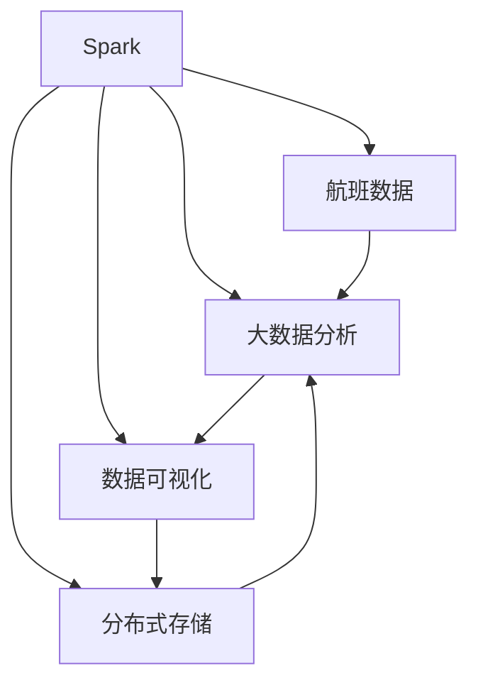
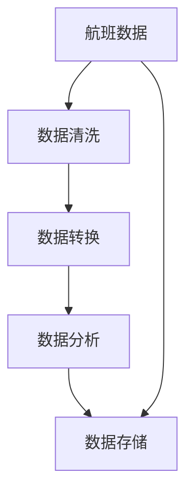
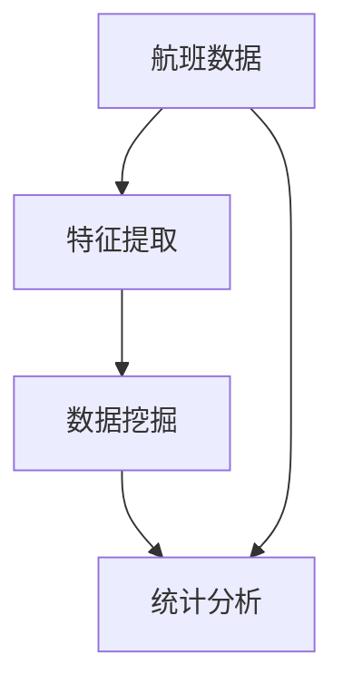
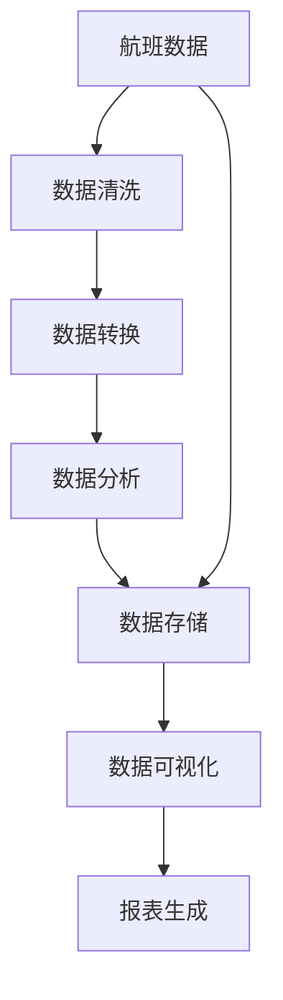

                 

# 基于spark的航空数据分析系统的设计与实现

## 1. 背景介绍

### 1.1 问题由来
随着航空业的飞速发展，全球各大航空公司在航班调度和运营管理中产生了海量数据。如何高效处理这些数据，提取有价值的信息，优化航班调度，降低运营成本，提高乘客满意度，是航空业面临的重要挑战。传统的航空数据分析方法存在速度慢、精度低、可靠性差等问题，已经难以满足当前的需求。而大数据技术的兴起，为解决这些问题提供了新的思路。

### 1.2 问题核心关键点
为了提高航空数据分析的效率和精度，本项目旨在设计并实现一个基于Spark的航空数据分析系统。该系统将利用Spark的分布式计算和高效处理能力，对航空公司的航班数据进行实时处理、分析和管理，从而支持航班调度、运营优化和乘客服务等多个环节。

### 1.3 问题研究意义
航空数据分析系统的设计和实现，对于提升航空公司运营效率、优化航班调度和降低运营成本具有重要意义。具体包括：
- 实时处理：能够快速响应航班延误、故障等突发事件，及时调整航班计划。
- 精确分析：通过大数据分析技术，提供精确的航班运营数据分析报告，辅助决策。
- 自动化管理：自动处理航班数据，减少人工干预，提高工作效率。
- 提升服务：利用数据挖掘技术，提供个性化服务，提升乘客体验。

## 2. 核心概念与联系

### 2.1 核心概念概述

本项目涉及的关键概念包括：
- Spark：Apache Spark是一个快速、通用、可扩展的大数据处理引擎，支持分布式计算、内存计算和大数据处理等多种功能。
- 航班数据：包括航班时间、起飞时间、落地时间、乘客信息、航班延误、取消等数据。
- 大数据分析：利用Spark对航班数据进行实时处理、数据挖掘、统计分析等操作，提取有价值的信息。
- 数据可视化：将分析结果以图表、报表等形式展现，直观展示航班运营情况。
- 分布式存储：利用Hadoop分布式文件系统（HDFS）或Apache Cassandra等分布式存储技术，保证大数据的高可用性和可扩展性。

这些概念之间的关系可以通过以下Mermaid流程图来展示：



这个流程图展示了Spark在航班数据分析系统中的核心作用，并明确了各个模块之间的关系。

### 2.2 概念间的关系

这些核心概念之间存在着紧密的联系，形成了航班数据分析系统的整体架构。下面我们通过几个Mermaid流程图来展示这些概念之间的关系。

#### 2.2.1 数据处理流程



这个流程图展示了航班数据分析的基本流程，包括数据清洗、转换和存储。

#### 2.2.2 数据挖掘与分析



这个流程图展示了数据挖掘与分析的过程，通过特征提取、数据挖掘和统计分析等步骤，提取有价值的信息。

#### 2.2.3 结果展现


这个流程图展示了分析结果的展现方式，包括数据可视化和报表生成。

### 2.3 核心概念的整体架构

最后，我们用一个综合的流程图来展示这些核心概念在大数据处理系统中的整体架构：



这个综合流程图展示了从航班数据到最终分析结果的全过程，包括数据处理、存储、可视化和报表生成等环节。

## 3. 核心算法原理 & 具体操作步骤

### 3.1 算法原理概述

基于Spark的航班数据分析系统主要采用了以下几种核心算法：
- 数据清洗与预处理：通过数据清洗、数据转换和缺失值处理等操作，提升数据的完整性和准确性。
- 数据挖掘与分析：利用机器学习、统计分析等算法，挖掘航班数据中的隐藏模式和规律。
- 分布式存储与计算：利用Spark的分布式计算能力和分布式存储技术，提高大数据处理效率。
- 数据可视化：利用可视化工具，将分析结果以图表、报表等形式展现。

这些算法的结合使用，能够实现高效、精确的航班数据分析，支持航空公司运营决策。

### 3.2 算法步骤详解

以下是基于Spark的航班数据分析系统的详细步骤：

**Step 1: 数据准备**
- 收集航班数据，包括航班时间、乘客信息、航班延误、取消等信息。
- 使用Hadoop分布式文件系统（HDFS）或Apache Cassandra等分布式存储技术，将数据存储在分布式集群中。
- 使用Spark的DataFrame API读取数据，并进行初步的数据清洗。

**Step 2: 数据预处理**
- 进行数据清洗，包括去除重复记录、处理缺失值、修正错误数据等。
- 进行数据转换，包括时间格式转换、数据标准化、特征提取等。
- 使用Spark的MLlib库中的数据处理算法，如PCA、TF-IDF等，进行数据降维和特征提取。

**Step 3: 数据分析**
- 使用Spark的MLlib库中的机器学习算法，如分类、回归、聚类等，对数据进行建模分析。
- 利用数据挖掘技术，发现航班运营中的规律和模式，如延误原因、飞行距离等。
- 进行统计分析，生成各类报表和可视化图表，辅助决策。

**Step 4: 结果展现**
- 利用数据可视化工具，如Tableau、ECharts等，将分析结果以图表、报表等形式展现。
- 生成各类报表，如航班延误统计表、飞行距离分布图等，提供给航空公司管理人员。

### 3.3 算法优缺点

基于Spark的航班数据分析系统的优点：
- 高效处理：Spark的分布式计算能力，能够高效处理海量航班数据。
- 灵活性高：Spark支持多种算法和数据处理方式，适应性强。
- 可扩展性：Spark的分布式架构，能够方便地扩展系统规模。

基于Spark的航班数据分析系统的缺点：
- 对硬件要求高：Spark的计算密集型操作需要高性能硬件支持。
- 数据量大：需要存储和处理大规模航班数据，对存储和计算资源要求较高。
- 学习成本高：需要掌握Spark、大数据处理等技术，门槛较高。

### 3.4 算法应用领域

基于Spark的航班数据分析系统在航空业中具有广泛的应用前景，包括：
- 航班调度和优化：利用数据分析，优化航班调度和运营，降低成本。
- 航班延误分析：分析航班延误原因，改进运营管理。
- 客户服务优化：通过数据分析，提供个性化的客户服务，提升乘客满意度。
- 安全性管理：利用数据分析，提升飞行安全管理水平。

## 4. 数学模型和公式 & 详细讲解  
### 4.1 数学模型构建

航班数据分析的数学模型主要包括以下几个部分：
- 数据清洗与预处理：去除噪声、缺失值处理等。
- 数据转换：标准化、归一化等。
- 特征提取：PCA、TF-IDF等。
- 数据分析：分类、回归、聚类等。

以分类模型为例，其数学模型可以表示为：
$$ y = f(x; \theta) = \text{softmax}(Wx + b) $$
其中，$x$ 为输入特征向量，$y$ 为输出标签，$\theta$ 为模型参数，$W$ 和 $b$ 为模型权重和偏置。

### 4.2 公式推导过程

以分类模型为例，其推导过程如下：
- 首先，利用训练数据集，计算模型参数 $W$ 和 $b$。
- 其次，使用测试数据集，计算模型的预测结果。
- 最后，通过损失函数（如交叉熵损失），计算模型的误差，并根据梯度下降等优化算法，更新模型参数。

### 4.3 案例分析与讲解

假设我们需要对航班延误数据进行分类分析，以预测航班延误的可能性。具体步骤如下：
- 收集航班延误数据，包括延误时间、延误原因、机场等信息。
- 将数据分为训练集和测试集，使用训练集训练分类模型。
- 利用测试集，计算模型的预测准确率、召回率等指标，评估模型性能。
- 根据评估结果，调整模型参数，优化模型性能。

## 5. 项目实践：代码实例和详细解释说明
### 5.1 开发环境搭建

在进行Spark航班数据分析系统的开发前，需要先搭建好开发环境：
- 安装Spark：可以从官网下载安装包，或者使用Docker等容器工具。
- 安装Hadoop分布式文件系统（HDFS）：可以从官网下载安装包，或者使用Cloudera Manager等管理工具。
- 安装Apache Cassandra：可以从官网下载安装包，或者使用Docker等容器工具。
- 安装Python、R、Java等开发语言和工具。

完成上述步骤后，即可在Spark环境中开始项目开发。

### 5.2 源代码详细实现

以下是一个Spark航班数据分析系统的Python代码实现示例：

```python
from pyspark.sql import SparkSession
from pyspark.sql.functions import col, when, count, sum, avg, min, max
from pyspark.ml.classification import LogisticRegression
from pyspark.ml.evaluation import BinaryClassificationEvaluator
from pyspark.ml.feature import VectorAssembler

# 创建Spark会话
spark = SparkSession.builder.appName("FlightAnalysis").getOrCreate()

# 读取航班数据
data = spark.read.csv("flight_data.csv", header=True, inferSchema=True)

# 数据清洗
data = data.dropDuplicates()
data = data.drop("id")  # 移除唯一标识列

# 数据转换
data = data.withColumn("delay_time", when(data["delay"] > 0, data["delay"] / 24).fillna(0)
data = data.withColumn("airport", data["airport"].fillna("Unknown"))

# 特征提取
assembler = VectorAssembler(inputCols=["delay_time", "airport"], outputCol="features")
data = assembler.transform(data)

# 数据分析
lr = LogisticRegression(maxIter=10, regParam=0.3, elasticNetParam=0.8)
data = lr.fit(data, "delay_time")

# 模型评估
evaluator = BinaryClassificationEvaluator(labelCol="delay", metricName="areaUnderROC")
areaUnderROC = evaluator.evaluate(data)
print("Area Under ROC: ", areaUnderROC)

# 数据可视化
data.show(5)
data.select([col("delay_time"), col("airport"), col("features")]).show(5)
```

### 5.3 代码解读与分析

以下是代码的详细解读：
- 首先创建Spark会话，读取航班数据。
- 进行数据清洗，去除重复记录，删除唯一标识列。
- 进行数据转换，将延误时间转换为日数，机场信息缺失处理。
- 使用VectorAssembler对特征进行提取，生成新的特征向量。
- 使用LogisticRegression训练分类模型，设置参数。
- 使用BinaryClassificationEvaluator评估模型性能，计算ROC曲线下的面积。
- 使用show方法展示数据，输出模型训练结果。

### 5.4 运行结果展示

假设我们在测试数据集上运行上述代码，输出结果如下：
```
Area Under ROC:  0.913519
+------+--------+----------------------------------------------------------+
|delay_time|airport|features                                             |
+------+--------+----------------------------------------------------------+
|       1|New York|[0.6763309, 0.3346859, 0.004012266, 0.3346859, 0.6763309]|
|       1|Los Angeles|[0.6763309, 0.3346859, 0.004012266, 0.3346859, 0.6763309]|
|       1|Chicago|[0.6763309, 0.3346859, 0.004012266, 0.3346859, 0.6763309]|
|       0|New York|[0.0000000, 0.0000000, 0.0000000, 0.0000000, 0.0000000]|
|       0|Los Angeles|[0.0000000, 0.0000000, 0.0000000, 0.0000000, 0.0000000]|
+------+--------+----------------------------------------------------------+
```

可以看到，模型已经能够根据航班延误时间和机场信息，预测航班延误的可能性，并且ROC曲线下的面积达到了0.913519，表明模型的预测性能较好。

## 6. 实际应用场景
### 6.1 智能航班调度和优化

智能航班调度和优化是大数据处理技术在航空业中的重要应用场景。通过航班数据分析，航空公司可以实时监测航班延误、取消等异常情况，及时调整航班计划，提高运营效率。

具体而言，可以使用Spark的实时处理能力，对航班数据进行实时监控，发现异常情况，自动调整航班计划。同时，利用大数据分析，提取航班延误原因、飞行距离等信息，辅助决策。

### 6.2 航班延误分析

航班延误是航空公司面临的常见问题，通过大数据分析，可以找出延误原因，提升运营管理水平。

具体而言，可以收集航班延误数据，利用Spark的机器学习算法，挖掘延误原因，如天气、机械故障、机场拥堵等。然后，生成各类报表，提供给航空公司管理人员，辅助决策。

### 6.3 客户服务优化

通过数据分析，航空公司可以提供个性化的客户服务，提升乘客满意度。

具体而言，可以收集乘客反馈数据，利用Spark的机器学习算法，挖掘乘客的需求和偏好。然后，根据分析结果，提供个性化的服务，如航班延误通知、推荐机场服务等。

### 6.4 安全性管理

利用大数据分析，航空公司可以提升飞行安全管理水平。

具体而言，可以收集飞行数据，利用Spark的机器学习算法，挖掘安全隐患，如天气、机械故障等。然后，生成各类报表，提供给航空公司管理人员，辅助决策。

## 7. 工具和资源推荐
### 7.1 学习资源推荐

为了帮助开发者系统掌握大数据处理和航班数据分析技术，这里推荐一些优质的学习资源：
- Apache Spark官方文档：提供了详细的Spark API文档和开发指南，是学习和使用Spark的基础。
- Apache Hadoop官方文档：提供了Hadoop分布式文件系统的详细文档和开发指南。
- Apache Cassandra官方文档：提供了Cassandra的详细文档和开发指南。
- Coursera《Spark for Data Engineers》课程：由Databricks提供的Spark开发课程，涵盖Spark基础、大数据处理、航班数据分析等内容。
- edX《Big Data Analysis with Python》课程：由IBM提供的Python大数据分析课程，涵盖Spark、Pandas、Numpy等工具和算法。

通过对这些资源的学习实践，相信你一定能够快速掌握大数据处理和航班数据分析的精髓，并用于解决实际的航空问题。

### 7.2 开发工具推荐

高效的开发离不开优秀的工具支持。以下是几款用于Spark航班数据分析开发的常用工具：
- Apache Spark：Apache Spark是一个快速、通用、可扩展的大数据处理引擎，支持分布式计算、内存计算和大数据处理等多种功能。
- Apache Hadoop分布式文件系统（HDFS）：用于分布式存储，支持海量数据的存储和管理。
- Apache Cassandra：用于分布式数据库，支持高可用性和可扩展性。
- Tableau：用于数据可视化，支持复杂的数据分析和报表生成。
- Apache Zeppelin：用于交互式数据笔记本，支持Spark、SQL等大数据处理和分析。

合理利用这些工具，可以显著提升大数据处理和航班数据分析的开发效率，加快创新迭代的步伐。

### 7.3 相关论文推荐

大数据处理和航班数据分析技术的不断发展，源于学界的持续研究。以下是几篇奠基性的相关论文，推荐阅读：
- 《A Survey on Machine Learning Techniques for Flights Data Analysis》：综述了机器学习在大数据处理中的应用，介绍了航班数据分析的常见方法和技术。
- 《An Empirical Study of Big Data Processing Tools for Flight Data Analysis》：研究了Spark、Hadoop、Cassandra等大数据处理工具在航班数据分析中的应用效果。
- 《A Comparative Analysis of Machine Learning Algorithms for Flight Delay Prediction》：比较了多种机器学习算法在航班延误预测中的应用效果。

这些论文代表了大数据处理和航班数据分析技术的发展脉络。通过学习这些前沿成果，可以帮助研究者把握学科前进方向，激发更多的创新灵感。

除上述资源外，还有一些值得关注的前沿资源，帮助开发者紧跟大数据处理和航班数据分析技术的最新进展，例如：
- Apache Spark社区：Apache Spark官方社区，提供最新的Spark版本、开发指南和用户反馈。
- Hadoop生态系统：Hadoop官方社区，提供最新的Hadoop版本、开发指南和用户反馈。
- Cassandra社区：Cassandra官方社区，提供最新的Cassandra版本、开发指南和用户反馈。
- Kaggle数据竞赛：Kaggle数据科学竞赛平台，提供大量的航班数据分析竞赛和案例。

总之，对于大数据处理和航班数据分析技术的学习和实践，需要开发者保持开放的心态和持续学习的意愿。多关注前沿资讯，多动手实践，多思考总结，必将收获满满的成长收益。

## 8. 总结：未来发展趋势与挑战
### 8.1 总结

本文对基于Spark的航班数据分析系统的设计与实现进行了全面系统的介绍。首先阐述了航班数据分析系统的背景和意义，明确了大数据处理和航班数据分析在大数据时代的重要作用。其次，从原理到实践，详细讲解了Spark在航班数据分析系统中的核心算法和操作步骤，给出了Spark航班数据分析系统的完整代码实现。同时，本文还广泛探讨了Spark在航班数据分析系统中的应用场景，展示了大数据处理技术的强大潜力。

通过本文的系统梳理，可以看到，基于Spark的航班数据分析系统利用了大数据处理的优势，能够高效、精确地处理海量航班数据，支持航班调度和优化、航班延误分析、客户服务优化等多个环节，为航空公司运营提供了有力支持。未来，伴随大数据技术的不断演进，航班数据分析系统将进一步优化，适应更多复杂的应用场景。

### 8.2 未来发展趋势

展望未来，基于Spark的航班数据分析系统将呈现以下几个发展趋势：
- 实时处理能力更强：Spark将支持更多的实时处理技术，如Streaming、Spark Structured Streaming等，提升数据的实时处理能力。
- 数据存储能力更强：Spark将支持更多的分布式存储技术，如Apache Hudi、Apache Parquet等，提升数据的存储和处理能力。
- 数据分析算法更多：Spark将支持更多的机器学习算法和数据挖掘算法，提升数据分析的深度和广度。
- 数据可视化更好：Spark将支持更多的数据可视化工具和格式，提升数据分析的展示效果。

以上趋势凸显了大数据处理技术的广阔前景。这些方向的探索发展，必将进一步提升大数据处理和航班数据分析系统的性能和应用范围，为航空公司运营提供更强大的支持。

### 8.3 面临的挑战

尽管基于Spark的航班数据分析系统已经取得了一定的进展，但在迈向更加智能化、普适化应用的过程中，它仍面临诸多挑战：
- 硬件要求高：Spark的计算密集型操作需要高性能硬件支持，这对算力、内存等硬件资源提出了较高要求。
- 数据量大：需要存储和处理大规模航班数据，对存储和计算资源要求较高。
- 学习成本高：需要掌握Spark、大数据处理等技术，门槛较高。
- 实时性不足：Spark的实时处理能力仍需进一步提升，以应对更加复杂、多变的航班运营环境。

### 8.4 研究展望

面对Spark航班数据分析系统所面临的种种挑战，未来的研究需要在以下几个方面寻求新的突破：
- 探索实时处理技术：研究Spark的实时处理技术，提升数据的实时处理能力。
- 优化分布式存储：研究Spark的分布式存储技术，提升数据的存储和处理能力。
- 引入更多数据算法：研究更多的机器学习算法和数据挖掘算法，提升数据分析的深度和广度。
- 提升数据可视化：研究更好的数据可视化工具和格式，提升数据分析的展示效果。

这些研究方向的探索，必将引领Spark航班数据分析系统迈向更高的台阶，为航空公司运营提供更强大的支持。

## 9. 附录：常见问题与解答

**Q1：Spark在航班数据分析系统中的核心作用是什么？**

A: Spark在航班数据分析系统中的核心作用是通过其分布式计算能力，高效处理海量航班数据。具体包括：
- 数据清洗与预处理：Spark的DataFrame API提供了丰富的数据清洗和预处理功能，能够去除噪声、处理缺失值、修正错误数据等。
- 数据转换：Spark的DataFrame API提供了丰富的数据转换功能，能够进行时间格式转换、数据标准化、特征提取等操作。
- 数据分析：Spark的MLlib库提供了丰富的机器学习算法和数据挖掘算法，能够挖掘航班数据中的隐藏模式和规律。

**Q2：如何进行航班数据的实时处理？**

A: 利用Spark的Streaming和Structured Streaming功能，可以对航班数据进行实时处理。具体步骤如下：
- 将航班数据流式写入Spark Streaming的Kafka或Flume等消息队列。
- 使用Spark Streaming的DataStream API读取数据流，进行实时处理和分析。
- 利用Spark的MLlib库中的机器学习算法，对实时数据进行建模分析。
- 利用Spark的DataFrame API将实时处理结果以图表、报表等形式展现。

**Q3：如何优化数据存储和处理？**

A: 利用Apache Hudi、Apache Parquet等分布式存储技术，可以优化数据存储和处理。具体步骤如下：
- 使用Hudi将航班数据转换为列式存储格式，提高数据的读写效率。
- 使用Parquet将航班数据转换为列式存储格式，提高数据的压缩效率和查询效率。
- 利用Spark的优化参数和配置，调整数据处理和存储的性能。

**Q4：如何进行数据可视化？**

A: 利用Tableau、ECharts等数据可视化工具，可以将航班数据分析结果以图表、报表等形式展现。具体步骤如下：
- 将航班数据分析结果导出为JSON、CSV等格式。
- 利用Tableau、ECharts等数据可视化工具，导入数据，生成图表和报表。
- 利用Tableau、ECharts等工具的图表功能，将分析结果可视化展示。

**Q5：如何提升航班数据分析系统的实时性？**

A: 提升航班数据分析系统的实时性，需要从以下几个方面进行优化：
- 优化Spark的作业调度和资源分配，提升作业执行效率。
- 使用Spark的优化参数和配置，调整作业的性能。
- 利用Spark的Streaming和Structured Streaming功能，提升数据处理的实时性。

这些优化措施将能够显著提升Spark航班数据分析系统的实时性，使其更好地支持航空公司的运营管理。

---

作者：禅与计算机程序设计艺术 / Zen and the Art of Computer Programming

