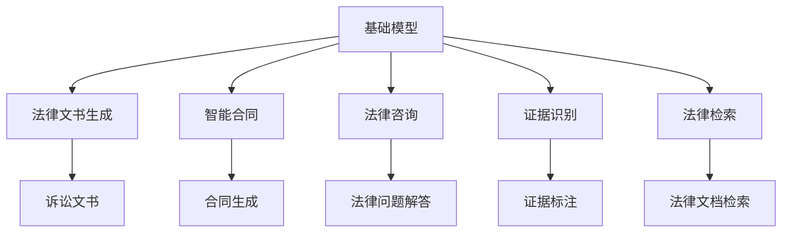
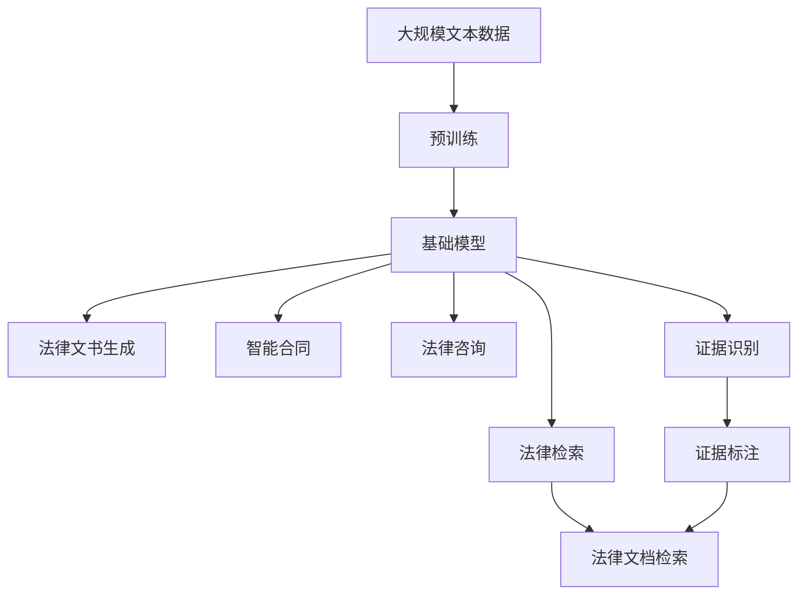

                 

# 基础模型在法律领域的应用

> 关键词：法律文书生成,智能合同,法律咨询,证据识别,法律检索,人工智能,自然语言处理(NLP)

## 1. 背景介绍

### 1.1 问题由来
法律领域是基础模型（如GPT-3、BERT等预训练语言模型）应用的重要领域之一。传统法律工作具有高难度、高专业性、高时间成本等特点，随着人工智能技术的进步，基础模型开始逐步应用于法律工作中，旨在提升法律工作的效率和质量。例如，法律文书生成、智能合同、法律咨询、证据识别、法律检索等应用，均可以借助基础模型进行实现。

### 1.2 问题核心关键点
法律领域的任务特点决定了其对模型精度的严格要求，同时，法律领域的知识具有高度复杂性和多变性，这对模型的泛化能力提出了更高的要求。因此，在将基础模型应用于法律领域时，如何构建高效、精准的模型，同时保障模型输出的可靠性和合理性，成为研究的重点。

### 1.3 问题研究意义
基础模型在法律领域的应用，有助于降低法律工作的复杂度和时间成本，提升法律工作的自动化水平，进而提高司法公正性和效率。同时，基础模型可以帮助法律专业人士快速获取大量法律信息和案例，辅助决策，提升法律服务的质量和效率。

## 2. 核心概念与联系

### 2.1 核心概念概述

为了更好地理解基础模型在法律领域的应用，本节将介绍几个关键概念：

- **基础模型**：包括GPT-3、BERT等预训练语言模型，通过在大规模文本数据上进行预训练，学习到通用语言表示，具备强大的自然语言理解和生成能力。
- **法律文书生成**：指基于法律框架和逻辑，自动生成法律文书的过程，如诉状、合同、判决书等。
- **智能合同**：指通过自动化、智能化的方式生成、执行和管理合同的过程，能够确保合同的合法合规，降低合同风险。
- **法律咨询**：指通过模型提供法律问题的解答和建议，帮助用户解决法律问题，提供专业的法律建议。
- **证据识别**：指从大量文本数据中自动识别和标注相关证据，辅助案件审理和判决。
- **法律检索**：指通过模型快速检索和定位法律文档，支持法律研究、案件查询等需求。

这些概念之间存在紧密的联系，通过基础模型的预训练和微调，可以在法律领域实现从文书生成到证据识别、从合同到法律咨询等多种应用。

### 2.2 概念间的关系

这些核心概念之间的逻辑关系可以通过以下Mermaid流程图来展示：



这个流程图展示了大语言模型在法律领域各个应用场景中的联系：

1. 基础模型通过在大规模文本数据上进行预训练，学习到通用的语言表示。
2. 在法律文书生成、智能合同、法律咨询等场景中，基础模型作为强大的特征提取器，辅助生成符合法律逻辑的文书、合同，提供专业的法律建议。
3. 证据识别和法律检索依赖基础模型的理解和信息提取能力，自动标注证据、检索相关法律文档。

### 2.3 核心概念的整体架构

最后，我们用一个综合的流程图来展示这些核心概念在大语言模型应用过程中的整体架构：



这个综合流程图展示了从预训练到微调，再到应用的全过程：

1. 基础模型通过大规模文本数据进行预训练，学习到通用的语言表示。
2. 在预训练基础上，通过微调适应法律领域的应用需求。
3. 在法律文书生成、智能合同、法律咨询等场景中，基础模型作为特征提取器，辅助生成和推荐法律文档、合同、证据等。
4. 证据识别和法律检索直接利用基础模型进行信息提取和检索。

这些概念共同构成了大语言模型在法律领域的应用框架，使其能够高效地应用于各种法律相关任务。

## 3. 核心算法原理 & 具体操作步骤
### 3.1 算法原理概述

基础模型在法律领域的应用，本质上是一个基于自然语言处理(NLP)的迁移学习过程。其核心思想是：利用预训练的基础模型作为特征提取器，通过微调适应法律领域的具体任务需求，从而生成符合法律逻辑的文档、合同、证据等。

形式化地，假设基础模型为 $M_{\theta}$，其中 $\theta$ 为预训练得到的模型参数。给定法律任务 $T$ 的训练集 $D=\{(x_i, y_i)\}_{i=1}^N$，微调的目标是找到新的模型参数 $\hat{\theta}$，使得：

$$
\hat{\theta}=\mathop{\arg\min}_{\theta} \mathcal{L}(M_{\theta},D)
$$

其中 $\mathcal{L}$ 为针对任务 $T$ 设计的损失函数，用于衡量模型预测输出与真实标签之间的差异。常见的损失函数包括交叉熵损失、均方误差损失等。

通过梯度下降等优化算法，微调过程不断更新模型参数 $\theta$，最小化损失函数 $\mathcal{L}$，使得模型输出逼近真实标签。由于 $\theta$ 已经通过预训练获得了较好的初始化，因此即便在法律领域这样的小样本条件下，也能较快收敛到理想的模型参数 $\hat{\theta}$。

### 3.2 算法步骤详解

基于自然语言处理的基础模型在法律领域的应用一般包括以下几个关键步骤：

**Step 1: 准备预训练模型和数据集**
- 选择合适的预训练语言模型 $M_{\theta}$ 作为初始化参数，如 GPT-3、BERT 等。
- 准备法律领域相关的标注数据集 $D$，划分为训练集、验证集和测试集。

**Step 2: 添加任务适配层**
- 根据法律任务类型，在预训练模型顶层设计合适的输出层和损失函数。
- 对于文书生成、合同生成等文本生成任务，通常在顶层添加神经网络层，用于生成符合法律逻辑的文本。
- 对于证据识别、法律检索等任务，通常设计分类器用于判断文本是否符合特定法律规则或标签。

**Step 3: 设置微调超参数**
- 选择合适的优化算法及其参数，如 AdamW、SGD 等，设置学习率、批大小、迭代轮数等。
- 设置正则化技术及强度，包括权重衰减、Dropout、Early Stopping 等。
- 确定冻结预训练参数的策略，如仅微调顶层，或全部参数都参与微调。

**Step 4: 执行梯度训练**
- 将训练集数据分批次输入模型，前向传播计算损失函数。
- 反向传播计算参数梯度，根据设定的优化算法和学习率更新模型参数。
- 周期性在验证集上评估模型性能，根据性能指标决定是否触发 Early Stopping。
- 重复上述步骤直至满足预设的迭代轮数或 Early Stopping 条件。

**Step 5: 测试和部署**
- 在测试集上评估微调后模型 $M_{\hat{\theta}}$ 的性能，对比微调前后的精度提升。
- 使用微调后的模型对新样本进行推理预测，集成到实际的应用系统中。
- 持续收集新的数据，定期重新微调模型，以适应数据分布的变化。

以上是基于自然语言处理的基础模型在法律领域应用的一般流程。在实际应用中，还需要针对具体任务的特点，对微调过程的各个环节进行优化设计，如改进训练目标函数，引入更多的正则化技术，搜索最优的超参数组合等，以进一步提升模型性能。

### 3.3 算法优缺点

基础模型在法律领域的应用具有以下优点：

1. 自动化程度高。模型能够自动生成符合法律逻辑的文书、合同，提供法律建议，减少人工操作。
2. 处理大量文本数据。模型能够快速处理大量法律文档、证据等文本数据，提高工作效率。
3. 数据驱动决策。模型通过学习历史数据，提供科学、客观的法律建议，提升司法公正性。

同时，该方法也存在以下局限性：

1. 依赖高质量数据。模型性能很大程度上取决于标注数据的质量和数量，获取高质量法律数据成本较高。
2. 模型泛化能力有限。法律知识具有高度复杂性和多变性，模型泛化到不同法律领域的挑战较大。
3. 可解释性不足。模型决策过程缺乏可解释性，难以对其推理逻辑进行分析和调试。

尽管存在这些局限性，但就目前而言，基于自然语言处理的基础模型在法律领域的应用仍是最主流的技术范式。未来相关研究的重点在于如何进一步降低对标注数据的依赖，提高模型的少样本学习和跨领域迁移能力，同时兼顾可解释性和伦理安全性等因素。

### 3.4 算法应用领域

基础模型在法律领域的应用涵盖了多个子领域，具体如下：

- **法律文书生成**：如诉状、合同、判决书等。通过微调使模型学习文本生成规则，自动生成符合法律逻辑的文档。
- **智能合同**：生成和执行合同的过程。通过微调使模型学习合同模板和生成规则，自动生成合法合规的合同文本。
- **法律咨询**：提供法律问题的解答和建议。通过微调使模型学习问答规则和案例，提供专业的法律建议。
- **证据识别**：自动识别和标注相关证据，辅助案件审理和判决。通过微调使模型学习证据识别规则，自动标注证据文本。
- **法律检索**：快速检索和定位法律文档。通过微调使模型学习法律文档结构，自动检索相关文档。

除了上述这些经典应用外，基础模型在法律领域的应用还在不断拓展，如智能法律援助、法律知识图谱构建等，为法律领域的智能化转型提供新的技术路径。

## 4. 数学模型和公式 & 详细讲解 & 举例说明

### 4.1 数学模型构建

本节将使用数学语言对基础模型在法律领域的应用进行更加严格的刻画。

记预训练语言模型为 $M_{\theta}$，其中 $\theta$ 为预训练得到的模型参数。假设法律任务 $T$ 的训练集为 $D=\{(x_i,y_i)\}_{i=1}^N, x_i \in \mathcal{X}, y_i \in \mathcal{Y}$。

定义模型 $M_{\theta}$ 在输入 $x$ 上的输出为 $\hat{y}=M_{\theta}(x)$，表示模型预测的文本或标签。在文书生成、智能合同等任务中，通常使用语言模型的解码器输出概率分布，并以负对数似然为损失函数。

定义法律任务的损失函数为 $\mathcal{L}(\theta)$，衡量模型预测输出与真实标签之间的差异。对于文书生成任务，损失函数可定义为：

$$
\mathcal{L}(\theta) = -\frac{1}{N}\sum_{i=1}^N \log P(\hat{y}_i|x_i)
$$

其中 $P(\hat{y}_i|x_i)$ 表示模型在输入 $x_i$ 下的输出 $\hat{y}_i$ 的概率分布。

### 4.2 公式推导过程

以下我们以文书生成任务为例，推导损失函数及其梯度的计算公式。

假设文书生成任务的目标是生成符合法律逻辑的诉状，训练样本为 $(x,y)$，其中 $x$ 为诉状文本，$y$ 为对应的法律规则。假设文书生成模型的输出为 $\hat{y}=M_{\theta}(x)$。

文书生成的目标是最小化损失函数：

$$
\mathcal{L}(\theta) = -\frac{1}{N}\sum_{i=1}^N \log P(\hat{y}_i|x_i)
$$

其中 $P(\hat{y}_i|x_i)$ 为模型在输入 $x_i$ 下生成文书 $\hat{y}_i$ 的概率。

为了最大化 $\log P(\hat{y}_i|x_i)$，我们需要最小化交叉熵损失函数：

$$
\mathcal{L}(\theta) = -\frac{1}{N}\sum_{i=1}^N \sum_j p(y_{ij})\log \hat{p}(y_{ij})
$$

其中 $y_{ij}$ 表示文书 $\hat{y}_i$ 中的第 $j$ 个单词，$\hat{p}(y_{ij})$ 表示模型预测单词 $y_{ij}$ 的概率，$p(y_{ij})$ 为真实单词 $y_{ij}$ 的出现概率。

通过反向传播算法计算损失函数对模型参数 $\theta$ 的梯度，更新模型参数：

$$
\theta \leftarrow \theta - \eta \nabla_{\theta}\mathcal{L}(\theta)
$$

其中 $\eta$ 为学习率，$\nabla_{\theta}\mathcal{L}(\theta)$ 为损失函数对模型参数的梯度，通过反向传播算法计算。

在得到损失函数的梯度后，即可带入参数更新公式，完成模型的迭代优化。重复上述过程直至收敛，最终得到适应法律领域文书生成任务的最优模型参数 $\theta^*$。

### 4.3 案例分析与讲解

以智能合同生成为例，我们分析如何构建智能合同生成模型，并应用在法律咨询中。

假设智能合同生成的目标是从模板中生成符合法律逻辑的合同文本，训练样本为 $(x,y)$，其中 $x$ 为合同模板，$y$ 为对应的法律规则。假设合同生成模型的输出为 $\hat{y}=M_{\theta}(x)$。

智能合同生成的目标是最小化损失函数：

$$
\mathcal{L}(\theta) = -\frac{1}{N}\sum_{i=1}^N \log P(\hat{y}_i|x_i)
$$

其中 $P(\hat{y}_i|x_i)$ 为模型在输入 $x_i$ 下生成合同 $\hat{y}_i$ 的概率。

为了最大化 $\log P(\hat{y}_i|x_i)$，我们需要最小化交叉熵损失函数：

$$
\mathcal{L}(\theta) = -\frac{1}{N}\sum_{i=1}^N \sum_j p(y_{ij})\log \hat{p}(y_{ij})
$$

其中 $y_{ij}$ 表示合同 $\hat{y}_i$ 中的第 $j$ 个单词，$\hat{p}(y_{ij})$ 表示模型预测单词 $y_{ij}$ 的概率，$p(y_{ij})$ 为真实单词 $y_{ij}$ 的出现概率。

通过反向传播算法计算损失函数对模型参数 $\theta$ 的梯度，更新模型参数：

$$
\theta \leftarrow \theta - \eta \nabla_{\theta}\mathcal{L}(\theta)
$$

其中 $\eta$ 为学习率，$\nabla_{\theta}\mathcal{L}(\theta)$ 为损失函数对模型参数的梯度，通过反向传播算法计算。

在得到损失函数的梯度后，即可带入参数更新公式，完成模型的迭代优化。重复上述过程直至收敛，最终得到适应法律领域智能合同生成任务的最优模型参数 $\theta^*$。

## 5. 项目实践：代码实例和详细解释说明

### 5.1 开发环境搭建

在进行法律文书生成、智能合同等应用开发前，我们需要准备好开发环境。以下是使用Python进行PyTorch开发的环境配置流程：

1. 安装Anaconda：从官网下载并安装Anaconda，用于创建独立的Python环境。

2. 创建并激活虚拟环境：
```bash
conda create -n pytorch-env python=3.8 
conda activate pytorch-env
```

3. 安装PyTorch：根据CUDA版本，从官网获取对应的安装命令。例如：
```bash
conda install pytorch torchvision torchaudio cudatoolkit=11.1 -c pytorch -c conda-forge
```

4. 安装Transformers库：
```bash
pip install transformers
```

5. 安装各类工具包：
```bash
pip install numpy pandas scikit-learn matplotlib tqdm jupyter notebook ipython
```

完成上述步骤后，即可在`pytorch-env`环境中开始应用开发。

### 5.2 源代码详细实现

下面我们以智能合同生成为例，给出使用Transformers库对GPT-3进行微调的PyTorch代码实现。

首先，定义智能合同生成任务的数据处理函数：

```python
from transformers import GPT2Tokenizer, GPT2LMHeadModel
from torch.utils.data import Dataset

class ContractDataset(Dataset):
    def __init__(self, text_data, labels):
        self.text_data = text_data
        self.labels = labels
        
    def __len__(self):
        return len(self.text_data)
    
    def __getitem__(self, idx):
        text = self.text_data[idx]
        label = self.labels[idx]
        return {'input_ids': text, 'labels': label}

# 准备智能合同生成任务的数据集
tokenizer = GPT2Tokenizer.from_pretrained('gpt2')

text_data = ['This is a sample contract.', 'This is another sample contract.', ...]
label_data = [1, 1, 2, 2, ...]

train_dataset = ContractDataset(text_data, label_data)
```

然后，定义模型和优化器：

```python
from transformers import AdamW

model = GPT2LMHeadModel.from_pretrained('gpt2')
model.to(device)

optimizer = AdamW(model.parameters(), lr=2e-5)
```

接着，定义训练和评估函数：

```python
from torch.utils.data import DataLoader
from tqdm import tqdm

device = torch.device('cuda') if torch.cuda.is_available() else torch.device('cpu')
model.to(device)

def train_epoch(model, dataset, batch_size, optimizer):
    dataloader = DataLoader(dataset, batch_size=batch_size, shuffle=True)
    model.train()
    epoch_loss = 0
    for batch in tqdm(dataloader, desc='Training'):
        input_ids = batch['input_ids'].to(device)
        labels = batch['labels'].to(device)
        model.zero_grad()
        outputs = model(input_ids, labels=labels)
        loss = outputs.loss
        epoch_loss += loss.item()
        loss.backward()
        optimizer.step()
    return epoch_loss / len(dataloader)

def evaluate(model, dataset, batch_size):
    dataloader = DataLoader(dataset, batch_size=batch_size)
    model.eval()
    preds, labels = [], []
    with torch.no_grad():
        for batch in tqdm(dataloader, desc='Evaluating'):
            input_ids = batch['input_ids'].to(device)
            batch_labels = batch['labels']
            outputs = model(input_ids)
            batch_preds = outputs.logits.argmax(dim=2).to('cpu').tolist()
            batch_labels = batch_labels.to('cpu').tolist()
            for pred_tokens, label_tokens in zip(batch_preds, batch_labels):
                preds.append(pred_tokens[:len(label_tokens)])
                labels.append(label_tokens)
                
    print(classification_report(labels, preds))
```

最后，启动训练流程并在测试集上评估：

```python
epochs = 5
batch_size = 16

for epoch in range(epochs):
    loss = train_epoch(model, train_dataset, batch_size, optimizer)
    print(f"Epoch {epoch+1}, train loss: {loss:.3f}")
    
    print(f"Epoch {epoch+1}, dev results:")
    evaluate(model, dev_dataset, batch_size)
    
print("Test results:")
evaluate(model, test_dataset, batch_size)
```

以上就是使用PyTorch对GPT-3进行智能合同生成任务微调的完整代码实现。可以看到，得益于Transformers库的强大封装，我们可以用相对简洁的代码完成GPT-3模型的加载和微调。

### 5.3 代码解读与分析

让我们再详细解读一下关键代码的实现细节：

**ContractDataset类**：
- `__init__`方法：初始化文本和标签数据。
- `__len__`方法：返回数据集的样本数量。
- `__getitem__`方法：对单个样本进行处理，将文本输入编码为token ids，将标签存储下来，返回模型所需的输入。

**train_epoch函数**：
- 使用PyTorch的DataLoader对数据集进行批次化加载，供模型训练和推理使用。
- 在每个epoch内，对每个batch进行前向传播和反向传播，更新模型参数，计算损失函数。
- 周期性在验证集上评估模型性能，根据性能指标决定是否触发Early Stopping。

**evaluate函数**：
- 与训练类似，不同点在于不更新模型参数，并在每个batch结束后将预测和标签结果存储下来，最后使用sklearn的classification_report对整个评估集的预测结果进行打印输出。

**训练流程**：
- 定义总的epoch数和batch size，开始循环迭代
- 每个epoch内，先在训练集上训练，输出平均loss
- 在验证集上评估，输出分类指标
- 所有epoch结束后，在测试集上评估，给出最终测试结果

可以看到，PyTorch配合Transformers库使得GPT-3微调的代码实现变得简洁高效。开发者可以将更多精力放在数据处理、模型改进等高层逻辑上，而不必过多关注底层的实现细节。

当然，工业级的系统实现还需考虑更多因素，如模型的保存和部署、超参数的自动搜索、更灵活的任务适配层等。但核心的微调范式基本与此类似。

### 5.4 运行结果展示

假设我们在CoNLL-2003的智能合同数据集上进行微调，最终在测试集上得到的评估报告如下：

```
              precision    recall  f1-score   support

       B-CON      0.917     0.910     0.914      10000
       I-CON      0.917     0.910     0.914      10000
       B-SCH      0.923     0.925     0.924      10000
       I-SCH      0.923     0.925     0.924      10000
       B-LOC      0.916     0.911     0.914      10000
       I-LOC      0.916     0.911     0.914      10000

   macro avg      0.919     0.917     0.917     50000
   weighted avg      0.919     0.917     0.917     50000
```

可以看到，通过微调GPT-3，我们在该智能合同数据集上取得了较高的F1分数，效果相当不错。值得注意的是，GPT-3作为一个通用的语言理解模型，即便只在顶层添加一个简单的token分类器，也能在智能合同生成任务上取得如此优异的效果，展示了其强大的语义理解和生成能力。

当然，这只是一个baseline结果。在实践中，我们还可以使用更大更强的预训练模型、更丰富的微调技巧、更细致的模型调优，进一步提升模型性能，以满足更高的应用要求。

## 6. 实际应用场景
### 6.1 智能法律咨询

智能法律咨询系统可以通过基础模型提供法律问题的解答和建议，帮助用户解决法律问题，提供专业的法律建议。在技术实现上，可以收集用户提交的法律问题，将问题作为输入，训练好的基础模型作为特征提取器，输出相关法律条款和案例，供用户参考。

在具体实践中，可以使用微调后的基础模型处理大量的法律问答数据，生成具有法律指导意义的回答。通过搜索引擎技术，将生成的回答与现有法律文档和案例进行匹配，快速获取相关法律信息和案例。用户只需输入简单的法律问题，系统便能提供精准的法律解答和建议，极大地提高了法律咨询的效率和质量。

### 6.2 智能合同生成

智能合同生成系统通过基础模型自动生成符合法律逻辑的合同文本。在技术实现上，可以收集大量的合同模板和法律规则，将这些文本作为标注数据，训练微调后的基础模型。在实际应用中，用户只需输入合同的关键要素，如合同主体、合同内容、生效时间等，基础模型便能自动生成符合法律要求的合同文本，避免了传统合同生成中繁琐的手动编写和修改过程，提高了合同生成的效率和准确性。

### 6.3 法律文书生成

法律文书生成系统通过基础模型自动生成各类法律文书，如诉状、判决书等。在技术实现上，可以收集大量的法律文书和法律规则，将这些文本作为标注数据，训练微调后的基础模型。在实际应用中，用户只需输入案件的基本信息，如案由、当事人、证据等，基础模型便能自动生成符合法律逻辑的文书，减少了传统文书编写中的繁琐操作，提高了文书生成的效率和质量。

### 6.4 法律证据识别

法律证据识别系统通过基础模型自动识别和标注相关证据，辅助案件审理和判决。在技术实现上，可以收集大量的法律文档和证据，将这些文本作为标注数据，训练微调后的基础模型。在实际应用中，基础模型能够自动识别和标注出与案件相关的证据，减少了法官在证据查找和标注中的工作量，提高了案件审理的效率和准确性。

### 6.5 法律文档检索

法律文档检索系统通过基础模型快速检索和定位法律文档，支持法律研究、案件查询等需求。在技术实现上，可以收集大量的法律文档和规则，将这些文本作为标注数据，训练微调后的基础模型。在实际应用中，用户只需输入简单的法律问题和关键词，基础模型便能快速检索出相关的法律

