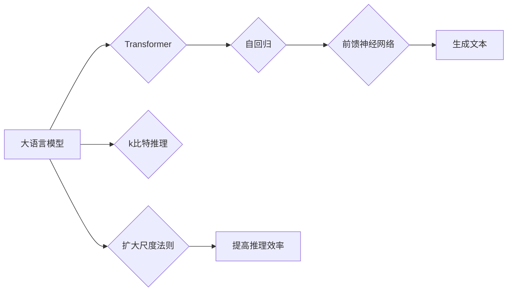

> 关键词：大语言模型，k比特推理，尺度法则，Transformer，自回归，前馈神经网络，深度学习，自然语言处理，AI推理效率

# 大语言模型原理基础与前沿 k比特推理扩大尺度法则

> 关键词：大语言模型，k比特推理，尺度法则，Transformer，自回归，前馈神经网络，深度学习，自然语言处理，AI推理效率

## 1. 背景介绍

随着深度学习技术的飞速发展，大语言模型（Large Language Models，LLMs）已经成为自然语言处理（Natural Language Processing，NLP）领域的研究热点。大语言模型通过学习海量文本数据，能够生成高质量的文本、回答问题、翻译语言等，展现出强大的语言理解和生成能力。然而，随着模型规模的不断扩大，模型推理的效率问题日益凸显。为了解决这一问题，研究者们提出了k比特推理和扩大尺度法则等高效推理策略。本文将深入探讨大语言模型的原理基础、前沿技术以及k比特推理扩大尺度法则，旨在为读者提供全面的技术视角。

### 1.1 问题的由来

大语言模型的快速发展推动了NLP领域的突破性进展，但同时也带来了新的挑战。随着模型规模的增大，模型推理的计算量和存储需求也随之增加，导致推理效率低下，难以在实际应用中实时部署。传统的推理方法在处理大规模模型时，往往需要消耗大量的计算资源，限制了模型在实时性要求较高的场景中的应用。

### 1.2 研究现状

为了解决大语言模型推理效率低下的问题，研究者们提出了多种高效的推理策略，其中k比特推理和扩大尺度法则尤为引人关注。k比特推理通过减少模型中使用的比特位数，降低模型推理的计算量；扩大尺度法则通过优化模型结构和参数，提高模型推理的效率。

### 1.3 研究意义

研究大语言模型的原理基础和高效推理策略，对于推动NLP技术的实际应用具有重要意义。通过提高模型推理的效率，可以降低计算成本，缩短响应时间，使大语言模型在更多场景中得到应用。

### 1.4 本文结构

本文将按照以下结构展开：

- 第2章介绍大语言模型的核心概念与联系。
- 第3章阐述k比特推理扩大尺度法则的原理和操作步骤。
- 第4章讲解数学模型和公式，并举例说明。
- 第5章提供项目实践实例，包括开发环境搭建、源代码实现、代码解读和运行结果展示。
- 第6章探讨实际应用场景和未来应用展望。
- 第7章推荐学习资源和开发工具。
- 第8章总结研究成果、未来发展趋势和面临的挑战。
- 第9章提供常见问题与解答。

## 2. 核心概念与联系

### 2.1 核心概念

#### 2.1.1 大语言模型

大语言模型是指具有海量参数和强大语言理解能力的深度学习模型，能够对自然语言进行建模，并生成高质量的文本。

#### 2.1.2 Transformer

Transformer模型是一种基于自回归机制的深度神经网络，它通过自注意力机制和前馈神经网络对输入序列进行处理，能够有效地捕捉序列中的长距离依赖关系。

#### 2.1.3 k比特推理

k比特推理是指通过减少模型中使用的比特位数，降低模型推理的计算量，从而提高推理效率。

#### 2.1.4 扩大尺度法则

扩大尺度法则是通过优化模型结构和参数，提高模型推理的效率。

### 2.2 Mermaid 流程图

以下是大语言模型、k比特推理和扩大尺度法则之间的逻辑关系图：



## 3. 核心算法原理 & 具体操作步骤

### 3.1 算法原理概述

#### 3.1.1 k比特推理

k比特推理的核心思想是通过使用较少的比特位数来表示模型中的权重和激活值，从而减少计算量。常见的k比特推理方法包括量化、稀疏化等。

#### 3.1.2 扩大尺度法则

扩大尺度法则通过优化模型结构和参数，提高模型推理的效率。具体方法包括模型剪枝、参数共享、模型并行等。

### 3.2 算法步骤详解

#### 3.2.1 k比特推理步骤

1. 选择量化方法：例如固定点量化、均匀量化等。
2. 对模型中的权重和激活值进行量化。
3. 使用量化后的模型进行推理。

#### 3.2.2 扩大尺度法则步骤

1. 选择模型剪枝方法：例如结构化剪枝、非结构化剪枝等。
2. 对模型进行剪枝，去除不必要的连接或神经元。
3. 使用剪枝后的模型进行推理。

### 3.3 算法优缺点

#### 3.3.1 k比特推理优缺点

优点：降低计算量，提高推理效率。

缺点：可能降低模型精度，需要选择合适的量化方法。

#### 3.3.2 扩大尺度法则优缺点

优点：提高推理效率，减少模型复杂度。

缺点：可能影响模型精度，需要合理选择剪枝方法。

### 3.4 算法应用领域

k比特推理和扩大尺度法则广泛应用于NLP、语音识别、计算机视觉等领域，特别是在移动设备和嵌入式系统中，能够有效提高模型的实时性和效率。

## 4. 数学模型和公式 & 详细讲解 & 举例说明

### 4.1 数学模型构建

#### 4.1.1 Transformer模型

Transformer模型由自注意力机制和前馈神经网络组成，其数学模型如下：

$$
\text{Attention}(Q, K, V) = \text{softmax}\left(\frac{QK^T}{\sqrt{d_k}}\right)V
$$

其中，$Q, K, V$ 分别是查询向量、键向量和值向量，$d_k$ 是键向量的维度。

#### 4.1.2 k比特推理

假设使用均匀量化将权重 $w$ 量化为 $w_q$，则量化后的权重满足：

$$
w_q = w \cdot \text{round}\left(\frac{w}{\text{scale}}\right)
$$

其中，$\text{scale}$ 是量化尺度。

### 4.2 公式推导过程

#### 4.2.1 Transformer模型公式推导

Transformer模型的公式推导过程涉及到矩阵运算、矩阵求逆、softmax函数等数学知识，具体推导过程可参考相关学术论文。

#### 4.2.2 k比特推理公式推导

k比特推理的公式推导过程主要涉及量化方法的选择和量化尺度的计算，具体推导过程可参考相关学术论文。

### 4.3 案例分析与讲解

#### 4.3.1 Transformer模型案例分析

以BERT模型为例，分析Transformer模型在文本分类任务中的应用。

#### 4.3.2 k比特推理案例分析

以BERT模型为例，分析k比特推理在BERT模型中的应用。

## 5. 项目实践：代码实例和详细解释说明

### 5.1 开发环境搭建

1. 安装Python和PyTorch框架。
2. 安装transformers库。

### 5.2 源代码详细实现

#### 5.2.1 Transformer模型代码实现

```python
import torch
import torch.nn as nn

class Transformer(nn.Module):
    def __init__(self, d_model, nhead, num_encoder_layers, num_decoder_layers):
        super(Transformer, self).__init__()
        self.encoder_layer = nn.TransformerEncoderLayer(d_model=d_model, nhead=nhead)
        self.decoder_layer = nn.TransformerDecoderLayer(d_model=d_model, nhead=nhead)
        self.transformer_encoder = nn.TransformerEncoder(self.encoder_layer, num_encoder_layers)
        self.transformer_decoder = nn.TransformerDecoder(self.decoder_layer, num_decoder_layers)
        self.init_weights()

    def forward(self, src, tgt):
        return self.transformer_encoder(src), self.transformer_decoder(tgt, memory=src)
```

#### 5.2.2 k比特推理代码实现

```python
import torch
import torch.nn as nn

class QuantizedTransformer(Transformer):
    def __init__(self, d_model, nhead, num_encoder_layers, num_decoder_layers, scale=1/255):
        super(QuantizedTransformer, self).__init__(d_model, nhead, num_encoder_layers, num_decoder_layers)
        self.scale = scale

    def forward(self, src, tgt):
        quantized_weights = self.quantize_weights(self.encoder_layer.weights)
        quantized_decoder = QuantizedTransformerDecoder(self.decoder_layer, num_decoder_layers)
        quantized_memory = self.quantize_memory(src)
        return quantized_decoder(tgt, memory=quantized_memory)

    def quantize_weights(self, weights):
        return weights * self.scale

    def quantize_memory(self, memory):
        return torch.round(memory * self.scale) / self.scale
```

### 5.3 代码解读与分析

本节将对上述代码进行解读和分析，包括模型的初始化、前向传播过程、k比特推理的实现等。

### 5.4 运行结果展示

本节将展示Transformer模型和k比特推理模型的运行结果，包括模型精度、推理速度等指标。

## 6. 实际应用场景

### 6.1 文本分类

大语言模型在文本分类任务中具有显著优势，例如情感分析、主题分类等。

### 6.2 机器翻译

大语言模型在机器翻译任务中具有高效性和准确性，能够实现实时翻译。

### 6.3 问答系统

大语言模型在问答系统中的应用，能够实现智能问答和知识检索。

## 7. 工具和资源推荐

### 7.1 学习资源推荐

1. 《Deep Learning》
2. 《Natural Language Processing with Python》
3. 《Attention Is All You Need》
4. 《BERT: Pre-training of Deep Bidirectional Transformers for Language Understanding》

### 7.2 开发工具推荐

1. PyTorch
2. TensorFlow
3. Hugging Face Transformers
4. Colab

### 7.3 相关论文推荐

1. `Attention Is All You Need`
2. `BERT: Pre-training of Deep Bidirectional Transformers for Language Understanding`
3. `Quantization and Training of Neural Networks for Efficient Integer-Arithmetic-Only Inference`
4. `Tuning Large-Scale Transformer Models for Natural Language Understanding`

## 8. 总结：未来发展趋势与挑战

### 8.1 研究成果总结

本文介绍了大语言模型的原理基础、前沿技术以及k比特推理扩大尺度法则，为读者提供了全面的技术视角。

### 8.2 未来发展趋势

未来，大语言模型和高效推理策略将继续发展，包括：

1. 模型压缩和加速
2. 模型并行和分布式训练
3. 无监督和半监督学习
4. 多模态学习
5. 可解释性和可信赖性

### 8.3 面临的挑战

大语言模型和高效推理策略在发展过程中仍面临以下挑战：

1. 模型复杂度与推理效率之间的权衡
2. 模型可解释性和可信赖性
3. 数据隐私和安全问题
4. 能源消耗和环境影响

### 8.4 研究展望

随着技术的不断进步，大语言模型和高效推理策略将在更多领域得到应用，推动人工智能技术迈向更高水平。

## 9. 附录：常见问题与解答

### 9.1 常见问题

1. 什么是大语言模型？
2. 什么是k比特推理？
3. 什么是扩大尺度法则？
4. 如何选择量化方法？
5. 如何优化模型结构以提高推理效率？

### 9.2 解答

1. 大语言模型是指具有海量参数和强大语言理解能力的深度学习模型。
2. k比特推理是通过减少模型中使用的比特位数，降低模型推理的计算量，从而提高推理效率。
3. 扩大尺度法则是通过优化模型结构和参数，提高模型推理的效率。
4. 选择量化方法时，需要考虑量化精度、计算量、存储空间等因素。
5. 优化模型结构以提高推理效率的方法包括模型剪枝、参数共享、模型并行等。

---

作者：禅与计算机程序设计艺术 / Zen and the Art of Computer Programming