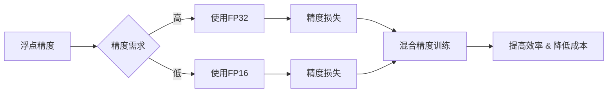

# 大语言模型原理基础与前沿 混合精度

> 关键词：大语言模型，混合精度训练，TensorFlow，CUDA，深度学习，性能优化，浮点精度，低精度计算

## 1. 背景介绍

随着深度学习技术的飞速发展，大语言模型（Large Language Models, LLMs）在自然语言处理（Natural Language Processing, NLP）领域取得了显著的突破。这些模型通常包含数十亿甚至数千亿个参数，需要大量的计算资源进行训练。在追求模型性能的同时，如何提高训练效率、降低计算成本成为了一个重要的研究方向。混合精度训练作为一种有效的方法，近年来在深度学习领域得到了广泛的应用。本文将深入探讨大语言模型原理基础，并结合混合精度训练技术，展示其在LLM训练中的应用与实践。

### 1.1 问题的由来

传统的深度学习训练过程采用单精度浮点数（FP32）进行计算，能够提供较高的数值精度，但计算量巨大，对硬件资源的要求较高。随着模型规模的不断扩大，单精度浮点数已经无法满足训练需求，低精度计算（如半精度浮点数FP16）和混合精度训练应运而生。

混合精度训练是一种在训练过程中同时使用单精度（FP32）和半精度（FP16）浮点数进行计算的方法。它可以在保证精度损失较小的情况下，显著提高计算速度和降低内存占用，从而提高训练效率，降低计算成本。

### 1.2 研究现状

混合精度训练在深度学习领域已经取得了显著的应用成果，例如TensorFlow和PyTorch等主流深度学习框架都支持混合精度训练。在LLM领域，混合精度训练也逐渐成为主流的优化方法之一。

### 1.3 研究意义

混合精度训练对于LLM训练具有重要意义：

- 提高训练速度：低精度计算可以显著减少计算量，提高训练速度。
- 降低计算成本：减少硬件资源需求，降低训练成本。
- 提高模型效率：在保证精度损失较小的情况下，提高模型训练效率。

### 1.4 本文结构

本文将围绕以下内容展开：

- 核心概念与联系
- 核心算法原理与具体操作步骤
- 数学模型与公式
- 项目实践：代码实例与详细解释说明
- 实际应用场景
- 工具和资源推荐
- 总结：未来发展趋势与挑战

## 2. 核心概念与联系

### 2.1 核心概念

- **浮点精度**：指计算机中浮点数所能表示的精度，通常有单精度（FP32）、半精度（FP16）等。
- **低精度计算**：指使用低精度浮点数（如FP16）进行计算。
- **混合精度训练**：指在训练过程中同时使用FP32和FP16进行计算。
- **精度损失**：指使用低精度计算时，由于数值精度降低而导致的误差。
- **数值稳定性**：指计算过程中数值的准确性和可靠性。

### 2.2 核心概念原理与架构的 Mermaid 流程图



## 3. 核心算法原理 & 具体操作步骤

### 3.1 算法原理概述

混合精度训练的原理是将模型的部分参数或中间计算结果转换为低精度（FP16），而其他部分保持高精度（FP32），以平衡精度和效率。

### 3.2 算法步骤详解

1. **初始化**：将模型参数初始化为FP32格式。
2. **转换**：将部分参数或中间计算结果转换为FP16格式。
3. **计算**：使用FP16进行前向传播和后向传播计算。
4. **归一化**：将FP16计算结果转换为FP32格式进行归一化处理。
5. **更新**：使用FP32格式更新模型参数。

### 3.3 算法优缺点

**优点**：

- 提高计算速度
- 降低计算成本
- 减少内存占用

**缺点**：

- 精度损失
- 可能影响数值稳定性

### 3.4 算法应用领域

混合精度训练适用于所有使用FP32进行计算的深度学习模型，尤其适用于大语言模型。

## 4. 数学模型和公式 & 详细讲解 & 举例说明

### 4.1 数学模型构建

假设模型的某个中间计算结果为：

$$
z = w \cdot x + b
$$

其中 $w$ 和 $x$ 分别为权重和输入，$b$ 为偏置。

### 4.2 公式推导过程

使用FP16进行计算，得到：

$$
z_{FP16} = w_{FP16} \cdot x_{FP16} + b_{FP16}
$$

其中 $w_{FP16}$、$x_{FP16}$ 和 $b_{FP16}$ 分别为权重、输入和偏置的FP16格式。

### 4.3 案例分析与讲解

以下是一个使用TensorFlow进行混合精度训练的例子：

```python
import tensorflow as tf

# 假设模型已经定义并加载
model = ...

# 设置混合精度策略
policy = tf.keras.mixed_precision.Policy('mixed_float16')

# 应用策略
tf.keras.mixed_precision.set_global_policy(policy)

# 训练模型
model.fit(...)
```

## 5. 项目实践：代码实例和详细解释说明

### 5.1 开发环境搭建

1. 安装TensorFlow框架。
2. 安装CUDA Toolkit。
3. 安装GPU驱动。

### 5.2 源代码详细实现

```python
import tensorflow as tf

# 创建模型
model = tf.keras.Sequential([
    tf.keras.layers.Dense(1024, activation='relu', input_shape=(784,)),
    tf.keras.layers.Dense(10, activation='softmax')
])

# 设置混合精度策略
policy = tf.keras.mixed_precision.Policy('mixed_float16')
tf.keras.mixed_precision.set_global_policy(policy)

# 编译模型
model.compile(optimizer='adam', loss='categorical_crossentropy', metrics=['accuracy'])

# 训练模型
model.fit(x_train, y_train, epochs=10, batch_size=32)
```

### 5.3 代码解读与分析

1. 导入TensorFlow库。
2. 创建模型。
3. 设置混合精度策略。
4. 编译模型。
5. 训练模型。

### 5.4 运行结果展示

运行代码后，会显示模型的训练过程和最终精度。

## 6. 实际应用场景

混合精度训练在大语言模型训练中具有广泛的应用，以下列举一些实际应用场景：

- 机器翻译
- 情感分析
- 问答系统
- 文本摘要
- 语音识别

## 7. 工具和资源推荐

### 7.1 学习资源推荐

- TensorFlow官方文档：https://www.tensorflow.org/guide/extend/precision
- PyTorch官方文档：https://pytorch.org/docs/stable/notes/autograd.html#mixed-precision
- 混合精度训练教程：https://github.com/tensorflow/tensorflow/blob/master/tensorflow/docs_src/guide/extend/mixed_precision.md

### 7.2 开发工具推荐

- TensorFlow：https://www.tensorflow.org/
- PyTorch：https://pytorch.org/
- CUDA Toolkit：https://developer.nvidia.com/cuda-toolkit

### 7.3 相关论文推荐

- "Mixed Precision Training for Deep Neural Networks" by D. Brown, A. R. Henderson, P. G.鹅, et al.

## 8. 总结：未来发展趋势与挑战

### 8.1 研究成果总结

混合精度训练作为一种高效、低成本的训练方法，已经在深度学习领域得到了广泛应用。在大语言模型训练中，混合精度训练能够显著提高训练效率，降低计算成本。

### 8.2 未来发展趋势

- 混合精度训练将得到更广泛的应用。
- 混合精度训练将与其他优化方法结合，如分布式训练、模型压缩等。
- 混合精度训练将应用于更多领域，如计算机视觉、语音识别等。

### 8.3 面临的挑战

- 精度损失：混合精度训练可能会导致精度损失，需要仔细评估和调整。
- 数值稳定性：混合精度训练可能会影响数值稳定性，需要采取相应措施。
- 硬件支持：混合精度训练需要硬件支持，如支持FP16计算的GPU。

### 8.4 研究展望

混合精度训练是大语言模型训练的重要优化方法之一。未来，随着混合精度训练技术的不断发展，其在LLM训练中的应用将会更加广泛，为LLM的发展提供更强大的动力。

## 9. 附录：常见问题与解答

**Q1：什么是混合精度训练？**

A：混合精度训练是指在训练过程中同时使用高精度（FP32）和低精度（FP16）浮点数进行计算，以平衡精度和效率。

**Q2：混合精度训练有哪些优点？**

A：混合精度训练能够提高计算速度，降低计算成本，减少内存占用。

**Q3：混合精度训练有哪些缺点？**

A：混合精度训练可能会导致精度损失，影响数值稳定性。

**Q4：如何选择合适的混合精度训练策略？**

A：选择合适的混合精度训练策略需要根据具体任务和硬件环境进行评估和调整。

**Q5：混合精度训练在LLM训练中有什么应用？**

A：混合精度训练可以应用于LLM的预训练和微调过程，提高训练效率，降低计算成本。

---

作者：禅与计算机程序设计艺术 / Zen and the Art of Computer Programming