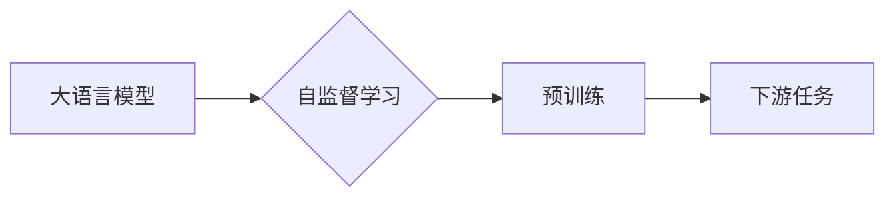

# 大语言模型的自监督学习

> 关键词：大语言模型，自监督学习，预训练，Transformer，BERT，NLP，深度学习

## 1. 背景介绍

随着深度学习技术的飞速发展，自然语言处理（NLP）领域取得了显著的进步。其中，大语言模型（Large Language Model，LLM）凭借其强大的语言理解和生成能力，成为NLP领域的研究热点。自监督学习作为一种无需人工标注数据的训练方法，在大语言模型的预训练过程中扮演着至关重要的角色。本文将深入探讨大语言模型的自监督学习原理、方法与应用，旨在为读者提供全面、深入的理解。

## 2. 核心概念与联系

### 2.1 核心概念

#### 大语言模型

大语言模型是一种基于深度学习的语言处理模型，通过学习海量的文本数据，能够理解、生成和翻译自然语言。代表性的模型包括BERT、GPT系列、T5等。

#### 自监督学习

自监督学习是一种无需人工标注数据的机器学习方法。它通过设计无监督学习任务，使得模型在训练过程中能够自主地从数据中学习到有用的信息。

#### 预训练

预训练是指在无标注数据上对模型进行训练，使其学习到通用的语言知识和特征。预训练模型可以用于解决各种NLP任务，如文本分类、问答系统、机器翻译等。

### 2.2 关系与联系

大语言模型的自监督学习是预训练的一种重要方法。自监督学习通过设计无监督学习任务，使得模型在训练过程中能够学习到丰富的语言知识，为后续的下游任务提供强大的基础。



## 3. 核心算法原理 & 具体操作步骤

### 3.1 算法原理概述

自监督学习算法的核心思想是通过设计无监督学习任务，使得模型在训练过程中能够从数据中学习到有用的信息。在大语言模型中，常见的自监督学习任务包括：

- 语言建模：预测下一个词/字符。
- 词语替换：给定一个词，预测一个或多个可能的替换词。
- 词汇排序：给定一组词，按照概率排序。
- 遮挡语言模型：给定一个部分遮挡的文本，预测遮挡的词或字符。

### 3.2 算法步骤详解

#### 3.2.1 语言建模

语言建模是自监督学习中最常见的任务之一。其基本思想是：给定一个文本序列 $w_1, w_2, \dots, w_n$，预测下一个词 $w_{n+1}$。具体的算法步骤如下：

1. 定义损失函数，如负对数似然损失。
2. 训练模型，最小化损失函数。
3. 评估模型在测试集上的性能。

#### 3.2.2 词语替换

词语替换任务的基本思想是：给定一个词 $w$，预测一个或多个可能的替换词 $w'$。具体的算法步骤如下：

1. 定义损失函数，如交叉熵损失。
2. 训练模型，最小化损失函数。
3. 评估模型在测试集上的性能。

#### 3.2.3 词汇排序

词汇排序任务的基本思想是：给定一组词 $w_1, w_2, \dots, w_n$，按照概率排序。具体的算法步骤如下：

1. 定义损失函数，如排序损失。
2. 训练模型，最小化损失函数。
3. 评估模型在测试集上的性能。

#### 3.2.4 遮挡语言模型

遮挡语言模型任务的基本思想是：给定一个部分遮挡的文本 $w_1, w_2, \dots, w_n, \_, \_, \dots, w_m$，预测遮挡的词或字符。具体的算法步骤如下：

1. 定义损失函数，如交叉熵损失。
2. 训练模型，最小化损失函数。
3. 评估模型在测试集上的性能。

### 3.3 算法优缺点

#### 3.3.1 优点

- 无需人工标注数据，能够高效地从大量无标注数据中学习到有用的信息。
- 预训练模型具有强大的语言理解和生成能力，能够应用于各种NLP任务。
- 自监督学习能够提高模型的泛化能力，使得模型在未见过的数据上也能取得良好的性能。

#### 3.3.2 缺点

- 预训练过程中，模型可能会学习到一些无用的噪声信息。
- 预训练模型的计算成本较高。
- 自监督学习任务的设计需要一定的专业知识。

### 3.4 算法应用领域

自监督学习在大语言模型的应用领域非常广泛，主要包括：

- 文本分类
- 机器翻译
- 问答系统
- 情感分析
- 文本摘要
- 语音识别

## 4. 数学模型和公式 & 详细讲解 & 举例说明

### 4.1 数学模型构建

以语言建模为例，其数学模型如下：

$$
P(w_{n+1} | w_1, w_2, \dots, w_n) = \frac{e^{f(w_1, w_2, \dots, w_n, w_{n+1})}}{\sum_{w' \in V} e^{f(w_1, w_2, \dots, w_n, w')}} 
$$

其中，$w_1, w_2, \dots, w_n$ 为输入序列，$w_{n+1}$ 为预测的下一个词，$V$ 为词汇表，$f$ 为神经网络模型。

### 4.2 公式推导过程

#### 4.2.1 语言建模概率

语言建模概率表示在给定当前文本序列下，预测下一个词的概率。

#### 4.2.2 神经网络模型

神经网络模型用于计算语言建模概率，通常采用多层神经网络，如Transformer、LSTM等。

#### 4.2.3 损失函数

语言建模任务中，常用的损失函数为负对数似然损失：

$$
L = -\sum_{n=1}^{N} \log P(w_n | w_1, w_2, \dots, w_{n-1}) 
$$

其中，$N$ 为文本序列的长度。

### 4.3 案例分析与讲解

以BERT为例，BERT是一种基于Transformer的自监督学习模型，能够有效地捕捉语言中的上下文信息。

- BERT模型采用双向Transformer编码器，能够同时考虑输入序列的上下文信息。
- BERT模型使用掩码语言模型（Masked Language Model，MLM）任务进行预训练，使得模型能够学习到丰富的语言知识和特征。
- BERT模型在多种NLP任务上取得了SOTA的性能，如文本分类、机器翻译、问答系统等。

## 5. 项目实践：代码实例和详细解释说明

### 5.1 开发环境搭建

1. 安装Python环境（推荐Python 3.6及以上版本）。
2. 安装TensorFlow或PyTorch等深度学习框架。
3. 安装Transformers库。

### 5.2 源代码详细实现

以下是一个简单的BERT模型实现：

```python
from transformers import BertModel, BertTokenizer

# 加载预训练的BERT模型和分词器
model = BertModel.from_pretrained('bert-base-uncased')
tokenizer = BertTokenizer.from_pretrained('bert-base-uncased')

# 加载测试数据
text = "Hello, how are you?"

# 将文本转换为BERT模型的输入格式
encoded_input = tokenizer(text, return_tensors='pt')

# 前向传播
output = model(**encoded_input)

# 输出结果
print(output.last_hidden_state)
```

### 5.3 代码解读与分析

1. 加载预训练的BERT模型和分词器。
2. 加载测试文本。
3. 将文本转换为BERT模型的输入格式。
4. 前向传播，计算模型的输出。

### 5.4 运行结果展示

运行上述代码，将得到模型的输出结果，包括词向量、注意力权重等信息。

## 6. 实际应用场景

自监督学习在大语言模型的应用场景非常广泛，以下列举一些典型的应用：

- **文本分类**：例如，将新闻分类为政治、体育、娱乐等类别。
- **机器翻译**：将一种语言的文本翻译成另一种语言。
- **问答系统**：回答用户提出的问题。
- **情感分析**：分析文本中的情感倾向，如正面、负面或中性。
- **文本摘要**：将长文本压缩成简洁的摘要。

## 7. 工具和资源推荐

### 7.1 学习资源推荐

- 《BERT: Pre-training of Deep Bidirectional Transformers for Language Understanding》
- 《Attention Is All You Need》
- 《Transformers: State-of-the-Art General Language Modeling with Transformer》
- 《Natural Language Processing with Transformers》

### 7.2 开发工具推荐

- TensorFlow
- PyTorch
- Hugging Face Transformers库

### 7.3 相关论文推荐

- 《BERT: Pre-training of Deep Bidirectional Transformers for Language Understanding》
- 《Attention Is All You Need》
- 《Transformers: State-of-the-Art General Language Modeling with Transformer》
- 《Masked Language Models are Unsupervised Multitask Learners》

## 8. 总结：未来发展趋势与挑战

### 8.1 研究成果总结

自监督学习在大语言模型预训练中发挥着至关重要的作用。它能够高效地从大量无标注数据中学习到有用的信息，为后续的下游任务提供强大的基础。随着预训练语言模型的不断发展，自监督学习在大语言模型领域的研究和应用将越来越广泛。

### 8.2 未来发展趋势

- **更大规模的语言模型**：未来，更大规模的语言模型将能够学习到更丰富的语言知识和特征。
- **更复杂的自监督学习任务**：设计更复杂的自监督学习任务，进一步提高模型的性能。
- **多模态自监督学习**：将自监督学习扩展到多模态数据，如图像、音频等。

### 8.3 面临的挑战

- **计算资源消耗**：随着语言模型规模的扩大，计算资源消耗将越来越大。
- **数据质量**：自监督学习依赖于大量无标注数据，数据质量将直接影响到模型的性能。
- **模型可解释性**：如何提高自监督学习模型的可解释性，是一个重要的研究课题。

### 8.4 研究展望

自监督学习在大语言模型预训练中具有广阔的应用前景。未来，随着技术的不断发展，自监督学习将在NLP领域发挥更加重要的作用。

## 9. 附录：常见问题与解答

### 9.1 问题1：什么是自监督学习？

自监督学习是一种无需人工标注数据的机器学习方法。它通过设计无监督学习任务，使得模型在训练过程中能够自主地从数据中学习到有用的信息。

### 9.2 问题2：自监督学习在大语言模型中有什么作用？

自监督学习能够帮助大语言模型从大量无标注数据中学习到丰富的语言知识和特征，为后续的下游任务提供强大的基础。

### 9.3 问题3：如何选择合适的自监督学习任务？

选择合适的自监督学习任务需要考虑具体的应用场景和数据特点。常见的自监督学习任务包括语言建模、词语替换、词汇排序、遮挡语言模型等。

### 9.4 问题4：自监督学习在大语言模型中是否会产生过拟合？

自监督学习在预训练过程中可能会产生过拟合，这取决于自监督学习任务的设计和模型结构。可以通过正则化、数据增强等方法来缓解过拟合问题。

### 9.5 问题5：自监督学习在大语言模型中是否需要大量计算资源？

自监督学习在大语言模型中的计算资源消耗较大，这取决于模型的规模和数据量。可以通过模型压缩、混合精度训练等方法来降低计算资源消耗。

---

作者：禅与计算机程序设计艺术 / Zen and the Art of Computer Programming