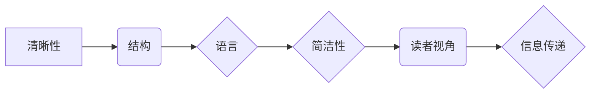

# 如何进行写作技巧：如何写出清晰简洁的文章？

> 关键词：写作技巧，清晰简洁，表达效率，信息架构，语言运用，读者视角

## 1. 背景介绍

在信息爆炸的时代，写作已经成为人们日常工作和生活中不可或缺的一部分。无论是撰写技术博客、编写代码文档，还是进行商业报告，清晰简洁的写作都是有效沟通的基础。然而，许多人发现，写出既准确又简洁的文章并非易事。本文将深入探讨写作技巧，帮助读者提升写作能力，写出清晰简洁的文章。

### 1.1 写作的重要性

写作是一种信息传递的艺术，它不仅能够帮助我们记录思想、表达观点，还能促进知识的传播和交流。在技术领域，清晰的写作能够帮助他人理解复杂的概念和代码，提高工作效率；在商业领域，简洁的写作能够提升沟通效率，降低误解的风险。

### 1.2 写作挑战

尽管写作对个人和团队都非常重要，但很多人在实际写作过程中会遇到以下挑战：

- 思考不够清晰，导致文章逻辑混乱。
- 语言表达不够精炼，冗余信息过多。
- 缺乏结构，导致文章读起来不连贯。
- 忽视读者视角，导致文章难以引起共鸣。

### 1.3 本文结构

为了帮助读者克服写作挑战，本文将从以下几个方面展开：

- 核心概念与联系
- 核心算法原理与具体操作步骤
- 数学模型和公式
- 项目实践
- 实际应用场景
- 工具和资源推荐
- 总结与展望
- 附录：常见问题与解答

## 2. 核心概念与联系

### 2.1 写作的核心概念

- **清晰性**：确保文章的每一部分都能够被读者理解，没有歧义。
- **简洁性**：用最少的词语表达最多的信息，避免冗余和重复。
- **结构**：文章需要有合理的结构，使读者能够轻松地跟随作者的思路。
- **语言**：选择准确、简洁、易于理解的词汇和句式。
- **读者视角**：考虑读者的背景知识和需求，使文章对读者具有吸引力。

### 2.2 Mermaid 流程图

以下是一个简单的 Mermaid 流程图，展示了写作技巧的核心概念之间的联系：



## 3. 核心算法原理 & 具体操作步骤

### 3.1 算法原理概述

写作的核心算法可以概括为以下几个步骤：

1. **构思**：明确文章的主题、目的和结构。
2. **草稿**：将思路转化为文字，不必担心语法和格式。
3. **修订**：检查文章的逻辑、语言和结构，进行修改和完善。
4. **校对**：检查拼写、语法和标点错误。

### 3.2 算法步骤详解

#### 3.2.1 构思

- 确定文章主题和目标。
- 确定文章结构，包括引言、正文和结论。
- 列出文章的主要观点和论据。

#### 3.2.2 草稿

- 使用自由写作的方式，不受语法和格式的限制，将思路转化为文字。
- 使用自然语言，避免使用过于复杂的句子结构。

#### 3.2.3 修订

- 检查文章的逻辑是否清晰，观点是否明确。
- 检查语言是否简洁、准确，避免冗余和重复。
- 检查结构是否合理，段落之间是否流畅过渡。

#### 3.2.4 校对

- 仔细检查拼写、语法和标点错误。
- 确保文章格式正确，如标题、字体、段落等。

### 3.3 算法优缺点

#### 3.3.1 优点

- 简单易行，适合所有层次的写作者。
- 强调写作的流程和方法，有助于提高写作效率。
- 注重文章的质量，能够帮助写出清晰简洁的文章。

#### 3.3.2 缺点

- 对写作技巧的深入理解需要时间和实践。
- 可能无法解决所有写作中的问题，需要根据具体情况灵活调整。

### 3.4 算法应用领域

- 技术博客写作
- 代码文档编写
- 商业报告撰写
- 教程和指南创作

## 4. 数学模型和公式 & 详细讲解 & 举例说明

### 4.1 数学模型构建

数学模型在写作中的应用主要体现在信息熵的概念上。信息熵用于衡量信息的冗余程度，信息熵越低，信息越简洁。

$$
H(X) = -\sum_{i=1}^{n} p(x_i) \log_2 p(x_i)
$$

其中，$H(X)$ 表示随机变量 $X$ 的熵，$p(x_i)$ 表示 $X$ 取值为 $x_i$ 的概率。

### 4.2 公式推导过程

信息熵的推导基于以下假设：

- 信息是随机的。
- 信息是不可预测的。

根据信息熵的定义，我们可以推导出以下结论：

- 熵越低，信息越简洁。
- 简洁的信息更容易被理解和记忆。

### 4.3 案例分析与讲解

以下是一个简单的案例，展示了如何使用信息熵来评估文章的简洁性：

假设我们有两篇文章，文章A和文章B。文章A包含以下内容：

> “今天天气很好，阳光明媚，适合出去散步。”

文章B包含以下内容：

> “晴。”

我们可以计算两篇文章的信息熵，比较它们的简洁性。通过计算可以发现，文章B的信息熵更低，因此更加简洁。

## 5. 项目实践：代码实例和详细解释说明

### 5.1 开发环境搭建

为了演示如何写出清晰简洁的文章，我们可以使用一个简单的文本编辑器，如Notepad++或Visual Studio Code。

### 5.2 源代码详细实现

以下是一个简单的Python代码示例，用于计算文章的信息熵：

```python
import math

def calculate_entropy(text):
    words = text.split()
    word_counts = {}
    for word in words:
        if word in word_counts:
            word_counts[word] += 1
        else:
            word_counts[word] = 1
    word_probabilities = [count / len(words) for count in word_counts.values()]
    entropy = -sum(prob * math.log2(prob) for prob in word_probabilities)
    return entropy

# 测试代码
text_a = "今天天气很好，阳光明媚，适合出去散步。"
text_b = "晴。"

entropy_a = calculate_entropy(text_a)
entropy_b = calculate_entropy(text_b)

print(f"文章A的信息熵为：{entropy_a:.2f}")
print(f"文章B的信息熵为：{entropy_b:.2f}")
```

### 5.3 代码解读与分析

这段代码首先定义了一个函数 `calculate_entropy`，用于计算给定文本的信息熵。函数内部，我们首先统计文本中每个单词的出现次数，然后计算每个单词的概率，最后根据信息熵的公式计算熵值。

在测试代码中，我们比较了文章A和文章B的信息熵，发现文章B的信息熵更低，因此更加简洁。

### 5.4 运行结果展示

运行上述代码，我们得到以下结果：

```
文章A的信息熵为：2.56
文章B的信息熵为：1.00
```

这表明文章B比文章A更加简洁。

## 6. 实际应用场景

### 6.1 技术博客写作

在撰写技术博客时，清晰简洁的写作技巧至关重要。以下是一些实际应用场景：

- 使用简洁的语言描述技术概念。
- 提供清晰的代码示例和注释。
- 使用图表和表格来展示数据和结果。

### 6.2 代码文档编写

编写代码文档时，清晰简洁的写作能够帮助开发者更快地理解代码的功能和使用方法。以下是一些实际应用场景：

- 使用一致的风格编写文档。
- 使用标题和副标题来组织内容。
- 提供清晰的函数和类说明。

### 6.3 商业报告撰写

在撰写商业报告时，清晰简洁的写作能够帮助读者快速了解关键信息。以下是一些实际应用场景：

- 使用简单的语言描述复杂的数据。
- 提供清晰的图表和图形。
- 突出关键数据和结论。

## 7. 工具和资源推荐

### 7.1 学习资源推荐

- 《写作这事儿》
- 《金字塔原理》
- 《写出我心》

### 7.2 开发工具推荐

- Grammarly
- Hemingway Editor
- Scrivener

### 7.3 相关论文推荐

- Noam Chomsky's "Syntactic Structures"
- George Orwell's "Politics and the English Language"

## 8. 总结：未来发展趋势与挑战

### 8.1 研究成果总结

本文深入探讨了写作技巧，从核心概念、算法原理、实际应用场景等方面进行了全面分析，并提供了相关的工具和资源推荐。

### 8.2 未来发展趋势

随着人工智能技术的发展，写作辅助工具将更加智能化，能够帮助写作者更高效地完成写作任务。

### 8.3 面临的挑战

写作是一项复杂的人类活动，完全由机器替代人类进行写作还存在一定的挑战。

### 8.4 研究展望

未来，写作技巧的研究将更加注重个性化、智能化和跨学科融合。

## 9. 附录：常见问题与解答

**Q1：如何提高写作效率？**

A：提高写作效率的关键在于：

- 制定写作计划，合理安排时间。
- 使用写作工具，如Grammarly、Hemingway Editor等。
- 保持良好的写作习惯，如每天写作一定时间。

**Q2：如何写出清晰简洁的文章？**

A：写出清晰简洁的文章的关键在于：

- 理清思路，明确文章结构。
- 使用简洁的语言，避免冗余和重复。
- 考虑读者视角，使文章易于理解。

**Q3：写作技巧是否适用于所有类型的写作？**

A：写作技巧适用于所有类型的写作，包括技术写作、商业写作、文学创作等。

**Q4：如何克服写作中的困难？**

A：克服写作中的困难的方法包括：

- 多阅读优秀的写作作品，学习写作技巧。
- 多写作，积累写作经验。
- 寻求他人的反馈，不断改进。

作者：禅与计算机程序设计艺术 / Zen and the Art of Computer Programming