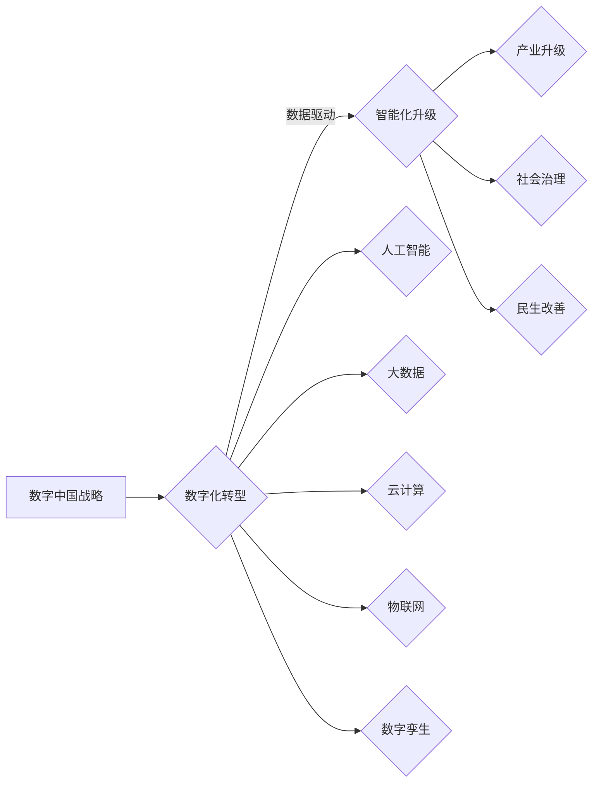

# 数字中国战略与新质生产力的结合点

> 关键词：数字中国战略、新质生产力、数字化转型、人工智能、大数据、云计算、物联网、数字孪生

## 1. 背景介绍

在全球化竞争日益激烈的今天，数字经济发展已成为国家战略，中国提出了“数字中国”战略，旨在通过数字技术与实体经济的深度融合，推动经济高质量发展，提升国家竞争力。新质生产力作为推动经济发展的核心力量，其与数字中国战略的结合点成为关键。本文将深入探讨数字中国战略与新质生产力的结合点，分析其原理、应用场景、未来发展趋势与挑战。

### 1.1 问题的由来

随着信息技术的飞速发展，数字技术逐渐成为经济增长的新引擎。然而，传统的生产方式和管理模式已无法满足数字化时代的需求，迫切需要探索新质生产力与数字中国战略的结合点，以实现产业升级和经济转型。

### 1.2 研究现状

当前，国内外学者对数字中国战略与新质生产力的研究主要集中在以下几个方面：

- 数字化转型：研究如何将数字技术应用于传统产业，提升产业效率和竞争力。
- 人工智能：研究人工智能在各个领域的应用，如智能制造、智能客服等。
- 大数据：研究大数据在资源优化、决策支持等方面的应用。
- 云计算：研究云计算在资源弹性、服务能力等方面的应用。
- 物联网：研究物联网在智能家居、智能城市等领域的应用。
- 数字孪生：研究数字孪生技术在仿真、优化等方面的应用。

### 1.3 研究意义

研究数字中国战略与新质生产力的结合点，对于推动我国经济高质量发展具有重要意义：

- 促进产业结构优化升级，提升国家竞争力。
- 推动经济增长方式转变，实现高质量发展。
- 满足人民群众对美好生活的需要，提升人民生活水平。
- 增强国家治理体系和治理能力现代化。

### 1.4 本文结构

本文将从以下方面展开论述：

- 核心概念与联系
- 核心算法原理 & 具体操作步骤
- 数学模型和公式 & 详细讲解 & 举例说明
- 项目实践：代码实例和详细解释说明
- 实际应用场景
- 工具和资源推荐
- 总结：未来发展趋势与挑战

## 2. 核心概念与联系

### 2.1 核心概念

- 数字中国战略：以数字技术为核心，推动经济社会各领域数字化转型，实现高质量发展。
- 新质生产力：以数字技术为核心，推动经济发展质量和效益提升的生产力。

### 2.2 核心概念原理和架构的 Mermaid 流程图



### 2.3 核心概念的联系

数字中国战略与新质生产力相互促进、相互支撑。数字中国战略为新质生产力提供了发展机遇，而新质生产力则是数字中国战略实现的重要保障。

## 3. 核心算法原理 & 具体操作步骤

### 3.1 算法原理概述

数字中国战略与新质生产力的结合点主要体现在以下几个方面：

- 数据驱动：通过采集、存储、处理和分析海量数据，为企业决策提供支持。
- 智能化升级：利用人工智能技术，实现生产过程的自动化、智能化。
- 产业升级：推动传统产业向高端化、智能化、绿色化方向发展。
- 社会治理：利用数字技术提升政府治理能力和水平。
- 民生改善：利用数字技术改善民生，提高人民生活水平。

### 3.2 算法步骤详解

1. 数据采集与整合：通过物联网、传感器等技术，采集生产、运营、管理等各个环节的数据。
2. 数据存储与处理：使用云计算、分布式存储等技术，对数据进行存储、处理和分析。
3. 人工智能应用：利用人工智能技术，实现生产过程的自动化、智能化。
4. 产业升级：推动传统产业向高端化、智能化、绿色化方向发展。
5. 社会治理：利用数字技术提升政府治理能力和水平。
6. 民生改善：利用数字技术改善民生，提高人民生活水平。

### 3.3 算法优缺点

#### 3.3.1 优点

- 提高生产效率
- 降低生产成本
- 优化资源配置
- 提升产品质量
- 改善民生

#### 3.3.2 缺点

- 技术门槛高
- 数据安全风险
- 数字鸿沟

### 3.4 算法应用领域

数字中国战略与新质生产力的结合点在各个领域都有广泛应用，如：

- 智能制造：通过智能化设备、生产线，实现生产过程的自动化和高效化。
- 智能交通：通过物联网、大数据等技术，实现交通管理的智能化和高效化。
- 智能医疗：通过人工智能、大数据等技术，实现疾病的早期诊断和治疗。
- 智能家居：通过物联网、人工智能等技术，实现家庭生活的智能化和便捷化。

## 4. 数学模型和公式 & 详细讲解 & 举例说明

### 4.1 数学模型构建

数字中国战略与新质生产力的结合点涉及多个数学模型，如：

- 线性回归：用于预测线性关系。
- 决策树：用于分类和回归。
- 支持向量机：用于分类和回归。
- 神经网络：用于复杂的非线性关系预测。

### 4.2 公式推导过程

以线性回归为例，其公式如下：

$$
y = \beta_0 + \beta_1x_1 + \beta_2x_2 + \cdots + \beta_nx_n + \varepsilon
$$

其中，$y$ 为因变量，$x_1, x_2, \cdots, x_n$ 为自变量，$\beta_0, \beta_1, \beta_2, \cdots, \beta_n$ 为模型参数，$\varepsilon$ 为误差项。

### 4.3 案例分析与讲解

以智能制造为例，通过采集生产线的实时数据，使用线性回归模型预测设备故障，从而实现预防性维护。

## 5. 项目实践：代码实例和详细解释说明

### 5.1 开发环境搭建

- Python
- Scikit-learn
- NumPy
- Pandas

### 5.2 源代码详细实现

```python
import numpy as np
from sklearn.linear_model import LinearRegression

# 生成随机数据
np.random.seed(0)
x = np.random.rand(100, 1) * 10
y = 2 + 3 * x + np.random.randn(100, 1) * 0.5

# 创建线性回归模型
model = LinearRegression()

# 训练模型
model.fit(x, y)

# 预测
x_predict = np.array([[5]])
y_predict = model.predict(x_predict)

print(f"预测值：{y_predict}")
```

### 5.3 代码解读与分析

- 导入必要的库
- 生成随机数据
- 创建线性回归模型
- 训练模型
- 预测

## 6. 实际应用场景

### 6.1 智能制造

通过大数据分析、人工智能等技术，实现生产过程的智能化、高效化，降低生产成本，提高产品质量。

### 6.2 智能交通

通过物联网、大数据等技术，实现交通管理的智能化和高效化，缓解交通拥堵，提高交通安全。

### 6.3 智能医疗

通过人工智能、大数据等技术，实现疾病的早期诊断和治疗，提高医疗质量，降低医疗成本。

### 6.4 智能家居

通过物联网、人工智能等技术，实现家庭生活的智能化和便捷化，提高生活品质。

## 7. 工具和资源推荐

### 7.1 学习资源推荐

- 《数字中国建设报告》
- 《人工智能：一种现代的方法》
- 《大数据时代》
- 《云计算：原理与实践》

### 7.2 开发工具推荐

- Python
- Scikit-learn
- NumPy
- Pandas
- TensorFlow
- PyTorch

### 7.3 相关论文推荐

- 《智能制造关键技术及发展趋势》
- 《智能交通系统架构与关键技术》
- 《人工智能在医疗领域的应用》
- 《智能家居关键技术及发展趋势》

## 8. 总结：未来发展趋势与挑战

### 8.1 研究成果总结

本文从数字中国战略与新质生产力的结合点出发，探讨了其原理、应用场景、未来发展趋势与挑战。研究发现，数字中国战略与新质生产力的结合点在各个领域都有广泛应用，为我国经济高质量发展提供了有力支撑。

### 8.2 未来发展趋势

- 跨领域融合：数字技术与各个领域的深度融合，推动产业升级和经济增长。
- 智能化升级：人工智能、大数据等技术推动生产、管理、服务等各个环节的智能化升级。
- 绿色低碳：推动绿色、低碳、可持续发展，实现经济、社会和生态效益的统一。

### 8.3 面临的挑战

- 技术挑战：数字技术发展迅速，如何跟上技术发展趋势，是当前面临的重要挑战。
- 人才挑战：数字化转型需要大量具备数字技能的人才，人才培养是重要挑战。
- 安全挑战：数字技术发展带来新的安全风险，如何保障数据安全、网络安全是重要挑战。

### 8.4 研究展望

未来，数字中国战略与新质生产力的结合点将在以下方面展开深入研究：

- 跨领域融合技术
- 智能化升级技术
- 绿色低碳技术
- 数字安全与隐私保护技术

相信通过不断努力，数字中国战略与新质生产力的结合点将为我国经济高质量发展注入新的动力。

## 9. 附录：常见问题与解答

### 9.1 常见问题

**Q1：数字中国战略与新质生产力是什么？**

A1：数字中国战略是指以数字技术为核心，推动经济社会各领域数字化转型，实现高质量发展。新质生产力是以数字技术为核心，推动经济发展质量和效益提升的生产力。

**Q2：数字中国战略与新质生产力的结合点有哪些？**

A2：数字中国战略与新质生产力的结合点主要体现在数据驱动、智能化升级、产业升级、社会治理、民生改善等方面。

**Q3：如何推动数字中国战略与新质生产力的结合？**

A3：推动数字中国战略与新质生产力的结合，需要从以下几个方面入手：
1. 加强数字基础设施建设。
2. 优化数字产业发展环境。
3. 培养数字人才。
4. 推动跨领域融合。
5. 加强网络安全保障。

### 9.2 解答

**A1**：数字中国战略是指以数字技术为核心，推动经济社会各领域数字化转型，实现高质量发展。新质生产力是以数字技术为核心，推动经济发展质量和效益提升的生产力。

**A2**：数字中国战略与新质生产力的结合点主要体现在数据驱动、智能化升级、产业升级、社会治理、民生改善等方面。

**A3**：推动数字中国战略与新质生产力的结合，需要从以下几个方面入手：
1. 加强数字基础设施建设。
2. 优化数字产业发展环境。
3. 培养数字人才。
4. 推动跨领域融合。
5. 加强网络安全保障。

---

作者：禅与计算机程序设计艺术 / Zen and the Art of Computer Programming