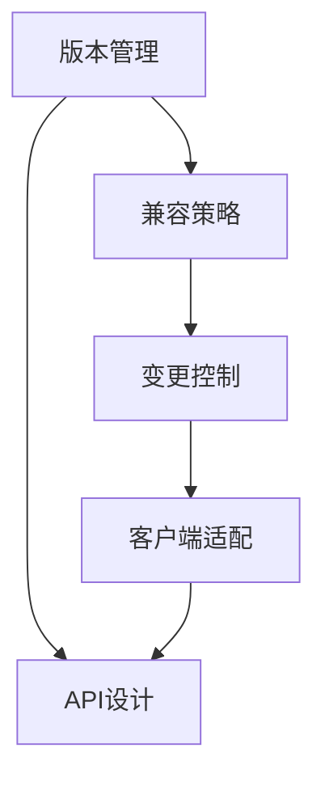
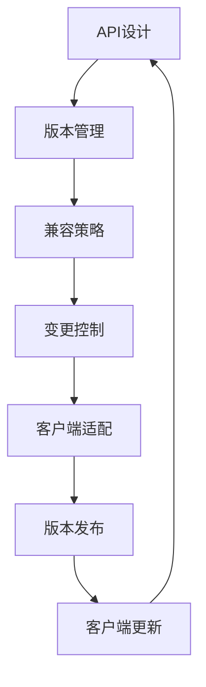

                 

# API 版本控制的重要性

API（应用程序编程接口）在现代软件开发中扮演着至关重要的角色，它连接了不同的软件组件和系统，使得系统之间能够安全、可靠地交互。然而，随着软件系统的不断演化和扩展，API的版本控制变得尤为关键。API版本控制不仅关系到系统的稳定性和兼容性，还直接影响到开发效率和用户体验。

## 1. 背景介绍

### 1.1 API的版本控制需求

在大型软件系统中，API的演化往往涉及到多个方面的变更，如新增功能、性能优化、安全修复等。如果每次变更都直接发布新版本API，可能会导致现有客户端无法兼容新版本的API，从而导致系统崩溃或功能丢失。此外，不恰当的版本控制还可能引发严重的兼容性问题，如数据格式不兼容、业务逻辑冲突等，严重影响系统的稳定性和可靠性。

### 1.2 常见的API版本控制问题

1. **版本升级风险高**：不恰当的版本升级可能导致现有客户端无法兼容新API，引发系统崩溃或功能丢失。
2. **兼容性问题多**：API变更可能导致现有数据格式无法兼容新API，引发数据丢失或解析错误。
3. **维护成本高**：API变更需要同时更新多个客户端，维护成本高，开发效率低下。
4. **版本管理混乱**：没有明确的版本管理策略，容易导致API版本混乱，难以追溯历史变更。

## 2. 核心概念与联系

### 2.1 核心概念概述

API版本控制的核心概念包括：

- **版本管理**：记录和管理API的各个版本，确保历史版本可追溯和回滚。
- **兼容策略**：定义API版本之间的兼容性规则，确保新旧版本API能够平滑过渡。
- **变更控制**：制定API变更的策略和流程，确保变更透明、可控且可审计。
- **客户端适配**：提供客户端的适配方案，确保现有客户端能够兼容新API。

这些核心概念之间存在着紧密的联系，共同构成了API版本控制的完整生态系统。

### 2.2 概念间的关系

通过以下Mermaid流程图，我们可以更加清晰地理解API版本控制中各个概念之间的关系：



这个流程图展示了API版本控制的关键步骤和相关概念。API的设计（E）是基础，版本管理（A）、兼容策略（B）、变更控制（C）和客户端适配（D）则是确保API稳定性和兼容性的关键环节。

### 2.3 核心概念的整体架构

下面是一个综合的流程图，展示了API版本控制的完整流程：



这个流程图展示了从API设计到版本发布，再到客户端更新和新的API设计的完整循环。每个环节都紧密相连，共同保障API的稳定性和兼容性。

## 3. 核心算法原理 & 具体操作步骤

### 3.1 算法原理概述

API版本控制的核心算法原理包括以下几个关键点：

1. **版本号的确定**：通常使用Semantic Versioning（语义化版本控制）规则，即 `MAJOR.MINOR.PATCH` 形式，分别表示大版本号、次版本号和修复版本号。
2. **版本兼容性的定义**：根据语义化版本规则，定义新旧版本API之间的兼容性规则，如向后兼容、向下兼容等。
3. **版本发布和回滚机制**：定义版本发布和回滚的策略和流程，确保版本控制的透明性和可控性。
4. **客户端适配方案**：提供客户端的适配方案，确保现有客户端能够兼容新API。

### 3.2 算法步骤详解

以下是API版本控制的具体操作步骤：

1. **API设计阶段**：在API设计阶段，定义API的版本规则和兼容策略，确保API设计符合语义化版本控制规范。
2. **版本管理阶段**：记录和管理API的各个版本，确保历史版本可追溯和回滚。
3. **版本发布阶段**：根据预定义的兼容策略，发布新版本的API，同时通知相关方进行适配。
4. **客户端适配阶段**：根据API发布版本，更新现有客户端，确保新旧版本API的兼容性。
5. **版本回滚阶段**：在出现问题时，根据需求进行版本回滚，确保系统的稳定性和可靠性。

### 3.3 算法优缺点

API版本控制的优点包括：

1. **稳定性和兼容性**：通过语义化版本控制和兼容策略，确保API的稳定性和兼容性。
2. **透明性和可控性**：定义明确的版本发布和回滚机制，确保版本控制的透明性和可控性。
3. **可追溯性和审计性**：记录和管理API的历史版本，确保历史版本可追溯和审计。

API版本控制的缺点包括：

1. **维护成本高**：API变更需要同时更新多个客户端，维护成本高。
2. **学习曲线陡峭**：需要开发者具备较高的版本控制意识和经验。
3. **历史版本管理复杂**：历史版本管理复杂，需要妥善处理版本冲突和历史变更。

### 3.4 算法应用领域

API版本控制在多个领域都有广泛的应用，包括：

1. **Web API**：Web API的演化和扩展，确保不同版本API的兼容性和稳定性。
2. **移动API**：移动应用的API设计和管理，确保跨平台兼容性和用户体验。
3. **企业内部API**：企业内部的服务架构和组件间的API管理，确保系统间的稳定交互。
4. **第三方API**：第三方API的调用和管理，确保API的可靠性和安全性。

## 4. 数学模型和公式 & 详细讲解  
### 4.1 数学模型构建

API版本控制的数学模型主要涉及以下几个关键概念：

- **版本号**：通常使用`MAJOR.MINOR.PATCH`形式，即`1.2.3`。
- **兼容策略**：定义新旧版本API之间的兼容规则，如向后兼容、向下兼容等。
- **变更日志**：记录API的历史变更记录，确保历史版本可追溯和回滚。

### 4.2 公式推导过程

以下是API版本控制的数学模型公式：

1. **版本号计算**：

   $$
   v = v_0 \times 10^M + v_1 \times 10^M \times 10^N + v_2
   $$

   其中，`v_0`、`v_1`、`v_2`分别表示大版本号、次版本号和修复版本号。

2. **兼容策略定义**：

   ```plaintext
   兼容策略如下：
   - 向后兼容：新旧版本API的接口、参数和返回值相同。
   - 向下兼容：旧版本API调用新版本API时，无需修改代码。
   - 版本间兼容：不同版本API之间的兼容规则，如`1.2.3`调用`1.2.4`时，只需修改特定接口。
   ```

3. **变更日志管理**：

   $$
   变更日志 = \{变更时间, 版本号, 变更内容, 负责人\}
   $$

   记录API的每次变更，确保历史版本可追溯和回滚。

### 4.3 案例分析与讲解

假设我们有一个API `v1.0`，其主要接口如下：

```plaintext
POST /user/login
Content-Type: application/json
{
    "username": "string",
    "password": "string"
}
```

现在需要发布新版本`v1.1`，新增`email`字段。根据语义化版本控制规则，版本号更新为`1.1.0`，兼容策略为向后兼容。具体的变更日志如下：

```plaintext
变更日志：
- 变更时间：2022-05-01
- 版本号：1.1.0
- 变更内容：新增`email`字段
- 负责人：张三
```

在发布新版本后，现有客户端需要更新以支持`email`字段，如更新代码如下：

```plaintext
POST /user/login
Content-Type: application/json
{
    "username": "string",
    "password": "string",
    "email": "string"
}
```

通过这样的管理方式，确保了API的稳定性和兼容性，同时也方便了对历史变更的追溯和回滚。

## 5. 项目实践：代码实例和详细解释说明
### 5.1 开发环境搭建

在进行API版本控制实践前，我们需要准备好开发环境。以下是使用Python进行Flask开发的版本控制环境配置流程：

1. 安装Python：从官网下载并安装Python，推荐使用3.x版本。
2. 安装Flask：使用pip安装Flask，确保版本为1.0以上。

```bash
pip install Flask
```

3. 创建虚拟环境：

```bash
python -m venv venv
source venv/bin/activate
```

完成上述步骤后，即可在虚拟环境中开始版本控制实践。

### 5.2 源代码详细实现

下面我们以一个简单的API版本控制系统为例，使用Flask框架实现版本控制的功能。

首先，创建一个`version.py`文件，定义API版本信息：

```python
# version.py
VERSION_MAJOR = 1
VERSION_MINOR = 2
VERSION_PATCH = 3
VERSION = f"{VERSION_MAJOR}.{VERSION_MINOR}.{VERSION_PATCH}"
```

然后，在`app.py`文件中，定义Flask应用和版本控制逻辑：

```python
# app.py
from flask import Flask
from version import VERSION

app = Flask(__name__)

@app.route('/version')
def version():
    return f'API Version: {VERSION}'

if __name__ == '__main__':
    app.run(debug=True)
```

最后，运行应用，访问`http://localhost:5000/version`，即可查看当前API版本信息。

### 5.3 代码解读与分析

这里我们详细解读一下关键代码的实现细节：

**version.py**：
- `VERSION_MAJOR`、`VERSION_MINOR`、`VERSION_PATCH`分别表示大版本号、次版本号和修复版本号。
- `VERSION`将三个版本号拼接为字符串形式。

**app.py**：
- 创建Flask应用。
- 定义`/version`路由，返回当前API版本信息。
- 在主函数中运行应用。

这个示例展示了如何使用Flask实现简单的API版本控制功能。开发者可以进一步扩展此功能，如版本发布、回滚、历史版本管理等。

### 5.4 运行结果展示

假设我们启动应用，访问`http://localhost:5000/version`，看到如下结果：

```
API Version: 1.2.3
```

这说明API的版本控制功能已经成功实现，可以在实际应用中灵活使用。

## 6. 实际应用场景

### 6.1 开源社区API

开源社区中，项目API的版本控制尤为重要。开发者需要定期发布新版本，确保API的兼容性和稳定性。例如，GitHub提供的REST API，不同版本的API接口有所不同，开发者需要根据API版本进行兼容适配。

### 6.2 企业内部API

企业内部API的版本控制通常涉及多个组件和服务间的交互。通过API版本控制，可以确保各组件间接口的稳定性和兼容性。例如，阿里云的内部API管理系统，通过严格的版本控制策略，确保了企业内部API的可靠性和安全性。

### 6.3 第三方API

第三方API的版本控制直接影响到API用户的体验。例如，Twitter提供的API版本控制，允许开发者选择使用不同的API版本，以适应不同的应用场景。

## 7. 工具和资源推荐
### 7.1 学习资源推荐

为了帮助开发者系统掌握API版本控制的技术基础和实践技巧，这里推荐一些优质的学习资源：

1. **《API设计指南》**：本书详细介绍了API设计的最佳实践，包括版本控制、兼容策略、变更日志等。
2. **《API Versioning Made Easy》**：这篇文章介绍了API版本控制的常见策略和最佳实践，适合快速入门。
3. **《RESTful API Design》**：这本书介绍了RESTful API的设计原则和版本控制策略，适合深入学习。

### 7.2 开发工具推荐

以下是几款用于API版本控制的常用工具：

1. **Swagger**：Swagger是API设计的开源工具，支持版本控制和API文档管理，适合开发者快速原型设计和文档编写。
2. **Postman**：Postman是API测试的常用工具，支持API版本管理和历史版本回滚，适合测试和验证API变更。
3. **Git**：Git是版本控制系统的核心，支持分支管理、合并、回滚等基本功能，适合API版本控制。

### 7.3 相关论文推荐

API版本控制涉及多个领域的研究，以下是几篇代表性的相关论文：

1. **《API Versioning and Compatibility》**：介绍了API版本控制的基本策略和实践方法，适合入门学习。
2. **《Semantic Versioning for APIs》**：介绍了语义化版本控制的原理和应用场景，适合深入理解。
3. **《API Versioning Challenges and Solutions》**：介绍了API版本控制面临的挑战和解决方案，适合解决实际问题。

## 8. 总结：未来发展趋势与挑战

### 8.1 总结

本文对API版本控制的重要性进行了详细探讨，系统介绍了版本管理的核心概念和操作步骤。从API设计到版本发布，再到客户端适配，展示了API版本控制的完整流程。通过具体案例和代码实例，进一步加深了对API版本控制的理解。

### 8.2 未来发展趋势

展望未来，API版本控制将呈现以下几个发展趋势：

1. **自动化工具普及**：API版本控制将逐渐被自动化工具所取代，如GitOps、CI/CD等，提升开发效率和版本管理的可控性。
2. **云服务支持**：云服务提供商如AWS、Azure等将提供完善的API版本控制服务，降低开发者的工作负担。
3. **可视化管理**：API版本控制将变得更加可视化，通过图形界面和仪表板，提升开发和运维的便捷性。
4. **多版本并发管理**：支持同时管理多个版本的API，提升版本控制的灵活性和并发性。
5. **合规性管理**：API版本控制将更加注重合规性，如GDPR、HIPAA等，确保数据安全和隐私保护。

### 8.3 面临的挑战

尽管API版本控制已经取得了不小的进展，但在迈向更加智能化、普适化应用的过程中，它仍面临诸多挑战：

1. **版本管理复杂性**：随着API版本的增加，版本管理变得复杂，需要妥善处理版本冲突和历史变更。
2. **客户端适配难度高**：API变更需要同时更新多个客户端，适配难度高，开发效率低下。
3. **学习成本高**：API版本控制需要开发者具备较高的版本控制意识和经验，学习成本较高。
4. **兼容性问题多**：API变更可能导致现有数据格式无法兼容新API，引发数据丢失或解析错误。

### 8.4 未来突破

面对API版本控制面临的挑战，未来的研究需要在以下几个方面寻求新的突破：

1. **自动化工具**：开发更高效的自动化工具，提升版本控制的可控性和灵活性。
2. **云服务集成**：与云服务提供商深度集成，提供更完善的API版本控制服务。
3. **可视化管理**：开发更直观的可视化管理工具，提升版本控制的用户体验。
4. **合规性支持**：引入合规性管理工具，确保API版本控制的合规性。
5. **版本控制培训**：提供系统化的版本控制培训，提升开发者的版本控制意识和经验。

这些研究方向的探索，必将引领API版本控制技术迈向更高的台阶，为API的稳定性和兼容性提供更强大的保障。面向未来，API版本控制技术还需要与其他API设计和管理技术进行更深入的融合，多路径协同发力，共同推动API的演化和扩展。

## 9. 附录：常见问题与解答

**Q1：API版本控制是否适用于所有API？**

A: API版本控制适用于大多数API，特别是对于版本变更频繁、用户需求多样化的API。但对于一些静态API，如配置文件API，版本控制的需求相对较低。

**Q2：如何进行API版本兼容性管理？**

A: API版本兼容性管理的关键在于定义新旧版本API之间的兼容规则，如向后兼容、向下兼容等。具体步骤如下：
1. 定义API接口的变更规则。
2. 根据变更规则，发布新版本API。
3. 通知相关方进行兼容适配。

**Q3：API版本控制的维护成本高，如何解决？**

A: API版本控制的维护成本高，可以通过以下方式解决：
1. 自动化工具：引入自动化工具如GitOps、CI/CD等，提升版本控制的效率。
2. 模块化设计：将API模块化设计，降低变更的复杂性。
3. 文档管理：建立详细的API文档和变更日志，方便追溯和回滚。

**Q4：API版本控制的兼容性问题如何解决？**

A: API版本控制的兼容性问题可以通过以下方式解决：
1. 定义明确的兼容策略，如向后兼容、向下兼容等。
2. 提供兼容性工具，如Postman、Swagger等，方便客户端适配。
3. 进行兼容性测试，确保新旧版本API的兼容性。

**Q5：API版本控制的自动化工具有哪些？**

A: API版本控制的自动化工具包括：
1. GitOps：通过Git管理API版本，支持自动化部署和回滚。
2. CI/CD：自动化测试和部署工具，支持版本控制的集成。
3. Swagger：API设计和版本控制的自动化工具，支持文档管理和版本控制。

这些工具的使用，可以显著提升API版本控制的效率和可控性，确保API的稳定性和兼容性。总之，API版本控制是确保API稳定性和兼容性的关键技术，需要开发者在系统设计和开发过程中予以重视和应用。通过不断优化和提升，API版本控制必将为API的发展和应用提供更强大的保障。

---

作者：禅与计算机程序设计艺术 / Zen and the Art of Computer Programming

