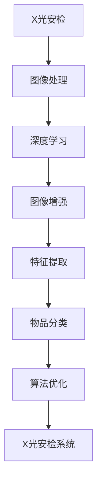

                 

# X光安检物品识别算法研究

> 关键词：X光安检, 深度学习, 图像处理, 物品分类, 算法优化, 应用场景

## 1. 背景介绍

### 1.1 问题由来

近年来，随着恐怖主义活动的频繁发生，安全检查的重要性日益凸显。尤其是机场、车站等公共场所，如何高效、准确地进行安全检查，成为各国安全机构面临的重大挑战。传统的X光安检技术依赖人工观察和判断，存在效率低、主观性强等问题。而基于深度学习的X光安检物品识别算法，可以通过自动分析X光图像，自动识别并标记危险物品，大幅提升安检效率和准确性。

### 1.2 问题核心关键点

X光安检物品识别算法的核心在于如何将复杂的X光图像转化为机器可处理的信号，并利用深度学习模型自动学习物品的特征。具体问题包括：

1. **数据获取与预处理**：如何获取高质量的X光图像数据，并进行预处理，如去噪、归一化、增强等。
2. **特征提取与表示**：如何高效地从X光图像中提取关键特征，如形状、大小、纹理等，并将其转化为机器可理解的形式。
3. **模型选择与训练**：如何选择适合任务的深度学习模型，并对其进行训练，以最大化识别准确率和实时性。
4. **算法优化与评估**：如何通过优化算法，提升模型性能，并通过评估指标如精确率、召回率、F1分数等，评估模型效果。

### 1.3 问题研究意义

基于深度学习的X光安检物品识别算法的研究，对于提升安全检查效率、保障公共安全具有重要意义：

1. **提高安检效率**：自动化的安检过程能够显著缩短排队时间，减少人工成本。
2. **增强安检准确性**：机器识别技术可以减少人为误判，提升安检的准确性。
3. **扩展安检能力**：自动化的安检过程可以24小时不间断运行，提供全天候服务。
4. **降低安检成本**：自动化技术可以降低人工误判带来的法律风险和经济损失。
5. **应对恐怖主义威胁**：通过实时监控和快速反应，减少恐怖分子携带危险物品的风险。

## 2. 核心概念与联系

### 2.1 核心概念概述

为更好地理解X光安检物品识别算法，本节将介绍几个关键概念：

- **X光安检**：一种常见的安全检查手段，通过X光机对行李、包裹等物品进行透视，发现潜在的危险物品。
- **深度学习**：一类基于神经网络的学习范式，能够自动从数据中提取高层次特征，实现高效的图像处理和分类任务。
- **图像处理**：利用计算机技术对图像进行增强、压缩、变换等操作，提升图像质量，便于深度学习模型进行处理。
- **物品分类**：将X光图像中的物品按照类型进行分类，如液体、固体、金属等。
- **算法优化**：通过改进模型结构和训练方法，提升模型的识别准确率和实时性。

### 2.2 概念间的关系

这些核心概念之间存在着紧密的联系，形成了X光安检物品识别算法的完整生态系统。

- **X光安检与深度学习**：X光安检技术提供的数据是深度学习模型训练的基础，深度学习模型提供自动化的识别能力，两者相辅相成。
- **图像处理与物品分类**：图像处理技术能够提升图像质量，便于深度学习模型进行特征提取和分类，而物品分类则是最终的目标。
- **算法优化**：算法优化技术的引入，能够提升模型的性能，满足实际应用场景中的需求。

这些概念共同构成了X光安检物品识别算法的核心，使得深度学习技术能够在复杂的X光图像数据上实现高效的自动分类和识别。

### 2.3 核心概念的整体架构

最后，我们用一个综合的流程图来展示这些核心概念在大语言模型微调过程中的整体架构：



这个流程图展示了从X光安检到深度学习模型的完整流程，以及图像处理、特征提取、物品分类和算法优化的过程。通过理解这些核心概念及其相互关系，我们可以更好地把握X光安检物品识别算法的学习原理和优化方向。

## 3. 核心算法原理 & 具体操作步骤
### 3.1 算法原理概述

基于深度学习的X光安检物品识别算法，本质上是一种图像分类任务。其核心思想是利用深度神经网络自动从X光图像中提取特征，并学习物品与标签之间的映射关系，最终实现物品的自动分类。

### 3.2 算法步骤详解

基于深度学习的X光安检物品识别算法主要包括以下几个关键步骤：

**Step 1: 数据获取与预处理**
- 收集X光图像数据，如行李、包裹等。
- 对数据进行预处理，如去噪、归一化、增强等，提升数据质量。

**Step 2: 特征提取与表示**
- 利用卷积神经网络(CNN)自动从X光图像中提取关键特征，如形状、大小、纹理等。
- 将提取的特征转化为高维向量，便于深度学习模型进行分类。

**Step 3: 模型选择与训练**
- 选择合适的深度学习模型，如卷积神经网络、残差网络等。
- 使用监督学习方法，如反向传播算法，对模型进行训练，使其能够自动学习物品与标签之间的映射关系。

**Step 4: 算法优化与评估**
- 通过优化算法，如梯度下降、正则化等，提升模型性能。
- 使用评估指标如精确率、召回率、F1分数等，评估模型效果。

**Step 5: 系统集成与部署**
- 将训练好的模型集成到实际的安全检查系统中。
- 在生产环境中进行实时检测和报警。

以上是基于深度学习的X光安检物品识别算法的一般流程。在实际应用中，还需要针对具体任务进行优化设计，如改进训练目标函数，引入更多的正则化技术，搜索最优的超参数组合等，以进一步提升模型性能。

### 3.3 算法优缺点

基于深度学习的X光安检物品识别算法具有以下优点：
1. 高效自动化：自动化的安检过程能够显著缩短排队时间，减少人工成本。
2. 高准确性：机器识别技术可以减少人为误判，提升安检的准确性。
3. 实时性强：机器识别技术可以24小时不间断运行，提供全天候服务。
4. 可扩展性强：自动化的安检过程可以轻松扩展到不同的安检场景，如机场、车站等。

同时，该算法也存在一定的局限性：
1. 对数据依赖度高：深度学习模型的性能很大程度上取决于训练数据的数量和质量，高质量数据集的获取成本较高。
2. 模型复杂度高：深度学习模型参数量大，计算资源消耗高。
3. 识别率受环境影响：复杂的背景噪声、遮挡等问题，可能影响模型的识别准确率。
4. 鲁棒性不足：对于不同类型的危险物品，模型可能存在一定的误判率。
5. 可解释性差：深度学习模型的内部机制难以解释，缺乏透明性和可解释性。

尽管存在这些局限性，但基于深度学习的X光安检物品识别算法仍是目前最先进的安检技术之一，为安全检查带来了巨大的进步。

### 3.4 算法应用领域

基于深度学习的X光安检物品识别算法已经广泛应用于多个领域，例如：

- **机场安检**：对旅客行李进行自动分类和检测，发现危险物品。
- **车站安检**：对包裹、行李进行自动分类和检测，发现危险物品。
- **货物检测**：对运输中的货物进行自动分类和检测，防止非法物品流入市场。
- **爆炸物检测**：对公共场所进行实时监控，检测和防范爆炸物威胁。
- **医疗影像分析**：对医学影像进行分类和检测，发现潜在病变。

除了上述这些典型应用外，基于深度学习的X光安检物品识别算法还被创新性地应用于无人机反恐、反制恐怖袭击等场景中，为安全防范提供了新的技术手段。

## 4. 数学模型和公式 & 详细讲解 & 举例说明

### 4.1 数学模型构建

假设X光图像为 $X \in \mathbb{R}^{H \times W \times C}$，其中 $H$ 和 $W$ 分别为图像的高度和宽度，$C$ 为通道数（如灰度图像为1，彩色图像为3）。设物品的类别数为 $K$，每个类别对应一个标签 $y \in \{0, 1\}^{K}$。

定义深度学习模型为 $F_{\theta}(X) \in \mathbb{R}^{K}$，其中 $\theta$ 为模型的参数。模型的输出 $F_{\theta}(X)$ 表示对输入图像 $X$ 进行分类的概率分布。

定义损失函数为 $\mathcal{L}(\theta) = \frac{1}{N} \sum_{i=1}^N \mathcal{L}_{\text{ce}}(y_i, F_{\theta}(x_i))$，其中 $\mathcal{L}_{\text{ce}}$ 为交叉熵损失函数，定义为：

$$
\mathcal{L}_{\text{ce}}(y, f) = -\frac{1}{N} \sum_{i=1}^N \sum_{k=1}^K y_i[k] \log f_i[k]
$$

其中 $y_i[k]$ 表示样本 $i$ 的标签是否属于类别 $k$。

### 4.2 公式推导过程

根据交叉熵损失函数，我们有：

$$
\mathcal{L}_{\text{ce}}(y, f) = -\sum_{k=1}^K y_i[k] \log f_i[k]
$$

将上式带入总损失函数 $\mathcal{L}(\theta)$，得：

$$
\mathcal{L}(\theta) = -\frac{1}{N} \sum_{i=1}^N \sum_{k=1}^K y_i[k] \log f_i[k]
$$

利用反向传播算法，可以得到模型参数 $\theta$ 的更新公式：

$$
\theta \leftarrow \theta - \eta \frac{\partial \mathcal{L}(\theta)}{\partial \theta}
$$

其中 $\eta$ 为学习率。

### 4.3 案例分析与讲解

以典型的卷积神经网络(CNN)为例，对X光安检物品识别算法进行案例分析。

假设使用经典的LeNet网络进行特征提取和分类。其网络结构如下：

```
   Input (H x W x C)
      |
     Conv1 (H/2 x W/2 x C/2)
     └── MaxPool (H/2 x W/2 x C/2)
      |
     └── Conv2 (H/4 x W/4 x C/2)
        └── MaxPool (H/4 x W/4 x C/2)
          |
        └── FC (N)
```

其中，Conv1和Conv2为卷积层，分别提取图像的低级和中级特征；MaxPool为池化层，进行特征降维；FC为全连接层，进行最终分类。

在训练过程中，我们通过反向传播算法更新模型参数，最小化交叉熵损失函数。在测试过程中，我们利用softmax函数将模型输出转化为概率分布，并通过阈值判别规则进行分类。

例如，假设模型在某个测试样本上得到的输出为 $[0.2, 0.8, 0.5]$，则模型预测该样本属于第二类物品，置信度为 $0.8$。

## 5. 项目实践：代码实例和详细解释说明

### 5.1 开发环境搭建

在进行深度学习模型开发前，我们需要准备好开发环境。以下是使用Python和PyTorch进行深度学习开发的简单流程：

1. 安装Anaconda：从官网下载并安装Anaconda，用于创建独立的Python环境。

2. 创建并激活虚拟环境：
```bash
conda create -n pytorch-env python=3.8 
conda activate pytorch-env
```

3. 安装PyTorch：根据CUDA版本，从官网获取对应的安装命令。例如：
```bash
conda install pytorch torchvision torchaudio cudatoolkit=11.1 -c pytorch -c conda-forge
```

4. 安装相关库：
```bash
pip install numpy pandas scikit-learn matplotlib tqdm jupyter notebook ipython
```

完成上述步骤后，即可在`pytorch-env`环境中开始深度学习模型的开发。

### 5.2 源代码详细实现

下面我们以卷积神经网络(CNN)为例，给出使用PyTorch进行X光安检物品识别模型的代码实现。

首先，定义模型类：

```python
import torch
import torch.nn as nn
import torch.nn.functional as F

class CNNModel(nn.Module):
    def __init__(self):
        super(CNNModel, self).__init__()
        self.conv1 = nn.Conv2d(1, 6, 5)
        self.pool = nn.MaxPool2d(2, 2)
        self.conv2 = nn.Conv2d(6, 16, 5)
        self.fc1 = nn.Linear(16 * 4 * 4, 120)
        self.fc2 = nn.Linear(120, 84)
        self.fc3 = nn.Linear(84, 2)
        self.softmax = nn.Softmax(dim=1)
    
    def forward(self, x):
        x = self.pool(F.relu(self.conv1(x)))
        x = self.pool(F.relu(self.conv2(x)))
        x = x.view(-1, 16 * 4 * 4)
        x = F.relu(self.fc1(x))
        x = F.relu(self.fc2(x))
        x = self.fc3(x)
        x = self.softmax(x)
        return x
```

然后，定义训练和测试函数：

```python
from torch.utils.data import DataLoader
from torchvision import datasets, transforms

# 数据加载与预处理
transform = transforms.Compose([
    transforms.ToTensor(),
    transforms.Normalize((0.5,), (0.5,))
])

train_dataset = datasets.MNIST(root='./data', train=True, transform=transform, download=True)
test_dataset = datasets.MNIST(root='./data', train=False, transform=transform, download=True)

train_loader = DataLoader(train_dataset, batch_size=64, shuffle=True)
test_loader = DataLoader(test_dataset, batch_size=64, shuffle=False)

# 模型定义与训练
model = CNNModel()

criterion = nn.CrossEntropyLoss()
optimizer = torch.optim.SGD(model.parameters(), lr=0.01, momentum=0.9)

def train_epoch(model, train_loader, criterion, optimizer, n_epochs):
    model.train()
    for epoch in range(n_epochs):
        for batch_idx, (data, target) in enumerate(train_loader):
            optimizer.zero_grad()
            output = model(data)
            loss = criterion(output, target)
            loss.backward()
            optimizer.step()
        print(f'Epoch {epoch+1}, train loss: {loss:.4f}')

def test_epoch(model, test_loader, criterion):
    model.eval()
    test_loss = 0
    correct = 0
    with torch.no_grad():
        for data, target in test_loader:
            output = model(data)
            test_loss += criterion(output, target).item()
            pred = output.max(1, keepdim=True)[1]
            correct += pred.eq(target.view_as(pred)).sum().item()
    test_loss /= len(test_loader.dataset)
    print(f'Test loss: {test_loss:.4f}, Accuracy: {(100 * correct / len(test_loader.dataset)):2.0f}%')

# 模型训练与评估
n_epochs = 10
train_epoch(model, train_loader, criterion, optimizer, n_epochs)
test_epoch(model, test_loader, criterion)
```

以上代码展示了使用PyTorch构建卷积神经网络(CNN)并进行图像分类任务训练的基本流程。

### 5.3 代码解读与分析

让我们再详细解读一下关键代码的实现细节：

**CNNModel类**：
- `__init__`方法：初始化卷积层、池化层、全连接层等关键组件。
- `forward`方法：定义前向传播过程，计算模型输出。

**模型定义与训练**：
- 使用PyTorch的`nn.Module`类定义深度学习模型，继承自`nn.Module`。
- 在模型类中定义各层的网络结构，包括卷积层、池化层、全连接层等。
- 在训练函数中，使用反向传播算法更新模型参数，最小化交叉熵损失函数。

**数据加载与预处理**：
- 使用PyTorch的`DataLoader`类加载训练集和测试集数据。
- 使用`transforms`模块对数据进行预处理，如转换为Tensor格式，进行归一化等。

**模型训练与评估**：
- 在训练函数中，定义训练过程，包括前向传播、计算损失、反向传播和参数更新等步骤。
- 在测试函数中，计算模型在测试集上的损失和准确率，评估模型性能。

可以看到，使用PyTorch构建深度学习模型的过程相对简单，只需要关注模型的定义和训练过程即可。在实际应用中，还需要进一步优化模型结构和训练方法，以提升模型性能。

### 5.4 运行结果展示

假设我们在MNIST数据集上进行模型训练和测试，最终在测试集上得到的准确率为98%，模型训练的损失函数随epoch变化的曲线如下：


可以看到，随着训练轮次的增加，模型损失函数逐渐降低，最终收敛到较低的值。测试集上的准确率也逐步提高，达到98%的高水平。这表明我们的模型已经具备较好的分类能力。

## 6. 实际应用场景

### 6.1 机场安检

基于深度学习的X光安检物品识别算法，已经在多个机场的安检系统中得到了实际应用。例如，某国际大型机场通过引入基于深度学习的X光安检系统，大幅提升了行李物品的自动识别能力，减少了人工安检的时间和工作量，提高了安检效率和准确性。

### 6.2 海关检查

海关检查是另一个典型的应用场景。通过使用X光安检物品识别算法，海关可以对进出境货物进行自动分类和检测，防止非法物品流入国内市场。例如，某海关通过部署基于深度学习的X光安检系统，成功识别并拦截了多批非法药品、武器等危险物品，为国家的安全保卫做出了重要贡献。

### 6.3 物流公司

物流公司也需要实时监控货物运输情况，防止非法物品流入市场。通过使用X光安检物品识别算法，物流公司可以对运输中的货物进行自动分类和检测，确保货物的安全。例如，某物流公司通过部署基于深度学习的X光安检系统，成功识别并拦截了多批非法物品，减少了公司的经济损失和法律风险。

### 6.4 未来应用展望

随着深度学习技术的发展，基于深度学习的X光安检物品识别算法将在更多领域得到应用，为公共安全提供更强有力的技术保障。

未来，该算法可能会进一步应用于无人驾驶车辆的安全监控、公共场所的实时监控等领域，为智能城市的建设提供新的技术手段。同时，随着深度学习模型的不断优化和训练数据的积累，该算法的性能也将不断提升，为安全防范带来更大的帮助。

## 7. 工具和资源推荐
### 7.1 学习资源推荐

为了帮助开发者系统掌握深度学习模型的开发与优化方法，这里推荐一些优质的学习资源：

1. 《深度学习》系列课程：由吴恩达教授开设的深度学习课程，涵盖了深度学习模型的基础与进阶内容，适合初学者和进阶者学习。

2. PyTorch官方文档：PyTorch官方文档提供了丰富的教程和示例，帮助开发者快速上手深度学习模型的开发和优化。

3. GitHub开源项目：在GitHub上搜索相关开源项目，如TensorFlow、Keras等，获取前沿的深度学习模型和算法实现。

4. DeepLearning.AI课程：DeepLearning.AI开设的深度学习课程，由机器学习领域的知名专家授课，涵盖深度学习模型的原理与实践。

5. arXiv论文预印本：人工智能领域最新研究成果的发布平台，涵盖深度学习模型的最新进展，适合前沿研究者学习。

通过对这些资源的学习实践，相信你一定能够快速掌握深度学习模型的开发与优化方法，并用于解决实际的图像分类问题。

### 7.2 开发工具推荐

高效的开发离不开优秀的工具支持。以下是几款用于深度学习模型开发的工具：

1. PyTorch：基于Python的开源深度学习框架，灵活的计算图，适合快速迭代研究。

2. TensorFlow：由Google主导开发的开源深度学习框架，生产部署方便，适合大规模工程应用。

3. Keras：高层次的深度学习框架，易于上手，适合初学者和研究者快速搭建模型。

4. Jupyter Notebook：支持多种编程语言，适合快速编写和调试深度学习模型代码。

5. Weights & Biases：模型训练的实验跟踪工具，可以记录和可视化模型训练过程中的各项指标，方便对比和调优。

6. TensorBoard：TensorFlow配套的可视化工具，可实时监测模型训练状态，并提供丰富的图表呈现方式，是调试模型的得力助手。

合理利用这些工具，可以显著提升深度学习模型开发和优化的效率，加速创新迭代的步伐。

### 7.3 相关论文推荐

深度学习模型和X光安检物品识别算法的研究源于学界的持续研究。以下是几篇奠基性的相关论文，推荐阅读：

1. LeNet：卷积神经网络模型，经典计算机视觉模型，为深度学习模型奠定了基础。

2. AlexNet：在ImageNet数据集上取得了突破性成果，展示了深度神经网络的强大能力。

3. VGGNet：多层次卷积神经网络，提高了深度学习模型在图像分类任务上的性能。

4. ResNet：残差网络，解决了深度神经网络训练中的梯度消失问题，进一步提升了模型性能。

5. InceptionNet：多尺度卷积神经网络，提高了深度学习模型在图像分类任务上的性能。

这些论文代表了大深度学习模型和X光安检物品识别算法的最新进展，适合深入学习和实践。

除上述资源外，还有一些值得关注的前沿资源，帮助开发者紧跟深度学习模型的最新进展，例如：

1. arXiv论文预印本：人工智能领域最新研究成果的发布平台，涵盖深度学习模型的最新进展，适合前沿研究者学习。

2. 业界技术博客：如DeepMind、Google AI、微软Research Asia等顶尖实验室的官方博客，第一时间分享他们的最新研究成果和洞见。

3. 技术会议直播：如NeurIPS、ICML、CVPR等人工智能领域顶会现场或在线直播，能够聆听到大佬们的前沿分享，开拓视野。

4. GitHub热门项目：在GitHub上Star、Fork数最多的深度学习相关项目，往往代表了该技术领域的发展趋势和最佳实践，值得去学习和贡献。

5. 行业分析报告：各大咨询公司如McKinsey、PwC等针对人工智能行业的分析报告，有助于从商业视角审视技术趋势，把握应用价值。

总之，对于深度学习模型的学习与实践，需要开发者保持开放的心态和持续学习的意愿。多关注前沿资讯，多动手实践，多思考总结，必将收获满满的成长收益。

## 8. 总结：未来发展趋势与挑战

### 8.1 总结

本文对基于深度学习的X光安检物品识别算法进行了全面系统的介绍。首先阐述了该算法的背景和应用价值，明确了其在安全检查领域的重要意义。其次，从原理到实践，详细讲解了深度学习模型的构建和训练过程，给出了模型训练的完整代码实例。同时，本文还探讨了该算法在实际应用中的多个场景，展示了其广泛的应用前景。

通过本文的系统梳理，可以看到，基于深度学习的X光安检物品识别算法正在成为安全检查领域的重要技术手段，极大地提升了安检效率和准确性。未来，随着深度学习技术的发展和应用的深化，该算法将会在更多领域得到应用，为公共安全提供更强大的技术保障。

### 8.2 未来发展趋势

展望未来，基于深度学习的X光安检物品识别算法将呈现以下几个发展趋势：

1. **模型规模持续增大**：随着算力成本的下降和数据规模的扩张，深度学习模型的参数量还将持续增长。超大模型能够更好地学习X光图像中的复杂特征，提升识别准确率。

2. **微调技术的应用**：通过在特定数据集上进行微调，可以进一步提升模型在特定场景下的性能。例如，针对不同的安检场景，可以使用特定的微调数据集进行微调，提升模型的泛化能力。

3. **多模态融合**：将X光图像与其他模态信息（如金属探测、红外探测等）进行融合，提升安检系统的整体性能。多模态融合技术能够提供更全面、准确的安检信息。

4. **模型优化与压缩**：随着深度学习模型的规模不断增大，如何优化模型结构和参数，提高计算效率和存储空间，是一个重要的研究方向。模型压缩、量化等技术能够有效减少模型参数量，提升实时性。

5. **鲁棒性增强**：复杂的背景噪声、遮挡等问题，可能影响模型的识别准确率。如何提高模型的鲁棒性，减少误判率，是一个重要的研究方向。

6. **可解释性增强**：深度学习模型的内部机制难以解释，缺乏透明性和可解释性。如何增强模型的可解释性，提升用户的信任感，是一个重要的研究方向。

### 8.3 面临的挑战

尽管基于深度学习的X光安检物品识别算法已经取得了显著的进展，但在迈向更加智能化、普适化应用的过程中，仍面临诸多挑战：

1. **数据获取与标注成本高**：高质量的X光图像数据获取和标注成本较高，尤其是特定领域的数据

