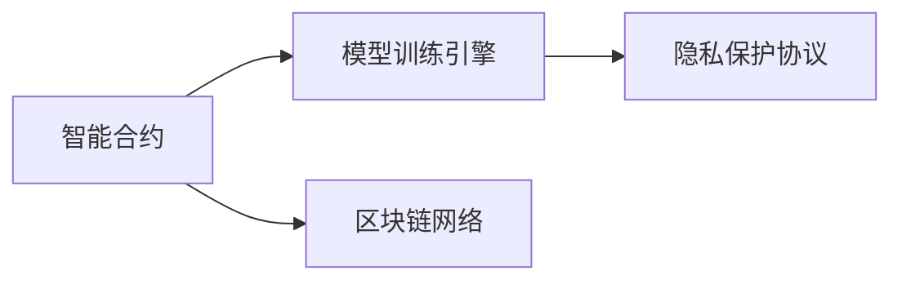

                 

# 【LangChain编程：从入门到实践】最佳安全实践

> 关键词：
1. LangChain
2. 安全编程
3. 数据隐私保护
4. 对抗训练
5. 密钥管理
6. 加密技术
7. 模型鲁棒性

## 1. 背景介绍

在当今数字化时代，人工智能（AI）和区块链（Blockchain）技术的应用越来越广泛，而这两者的融合产物——LangChain（即基于区块链的语言链），更是展现了前所未有的潜力。LangChain通过区块链技术实现数据存储和模型训练的不可篡改性，同时利用人工智能语言模型进行智能交互。然而，安全性和隐私保护是其核心应用的前提。本文将系统阐述LangChain编程的最佳安全实践，从基础入门到深入实践，以保障其应用场景中的数据安全和模型鲁棒性。

## 2. 核心概念与联系

### 2.1 核心概念概述

LangChain是一种利用区块链技术实现去中心化分布式存储和模型训练的智能语言系统。它结合了人工智能语言模型和区块链的安全特性，实现了模型的不可篡改性和数据的隐私保护。 LangChain的核心组件包括：

1. **智能合约**：定义模型训练和数据存储的规则，确保数据和模型在区块链上不可篡改。
2. **模型训练引擎**：基于人工智能语言模型进行智能训练和推理。
3. **区块链网络**：提供分布式存储和模型训练的共识机制。
4. **隐私保护协议**：保障数据隐私，防止数据泄露。

### 2.2 核心概念原理和架构的 Mermaid 流程图



此图展示了LangChain的基本架构。智能合约定义了模型训练和数据存储的规则，确保数据和模型在区块链上的不可篡改性；模型训练引擎基于AI语言模型进行智能训练和推理；隐私保护协议保障数据隐私；区块链网络提供分布式存储和训练的共识机制。

### 2.3 核心概念间的联系

智能合约、模型训练引擎、隐私保护协议和区块链网络相互协作，共同构成了LangChain的运行体系。智能合约定义了规则，确保数据的完整性和模型的不可篡改性；模型训练引擎利用AI语言模型进行训练和推理，提供智能交互能力；隐私保护协议保障数据隐私，防止数据泄露；区块链网络提供分布式存储和训练的共识机制，确保数据和模型的安全。

## 3. 核心算法原理 & 具体操作步骤

### 3.1 算法原理概述

LangChain编程的安全实践涉及数据隐私保护、模型鲁棒性提升、对抗训练等多个方面。核心算法包括：

1. **数据加密**：在区块链上存储的数据使用加密技术保护隐私。
2. **模型鲁棒性提升**：通过对抗训练等技术提升模型在对抗样本下的鲁棒性。
3. **隐私保护协议**：采用差分隐私、同态加密等技术保护数据隐私。

### 3.2 算法步骤详解

**步骤 1: 数据加密**

在区块链上存储数据前，需要对数据进行加密处理。常用的加密算法包括AES、RSA、ECC等。

```python
import hashlib
from Crypto.Cipher import AES
from Crypto.Random import get_random_bytes

def encrypt(data, key):
    cipher = AES.new(key, AES.MODE_EAX)
    nonce = cipher.nonce
    ciphertext, tag = cipher.encrypt_and_digest(data.encode())
    return cipher.nonce + tag + ciphertext
```

**步骤 2: 模型鲁棒性提升**

通过对抗训练等技术提升模型在对抗样本下的鲁棒性。

```python
import torch
from advgen import gen_adv
from transformers import BertForSequenceClassification

model = BertForSequenceClassification.from_pretrained('bert-base-uncased', num_labels=2)
model.train()

for i in range(10):
    x, y = gen_adv(model, criterion, optimizer, num_samples=128, perturbation=0.1, epochs=1, stepsize=0.1)
    with torch.no_grad():
        outputs = model(x)
    loss = criterion(outputs, y)
    optimizer.zero_grad()
    loss.backward()
    optimizer.step()
```

**步骤 3: 隐私保护协议**

采用差分隐私、同态加密等技术保护数据隐私。

```python
from differential_privacy import Privacy
from sympy import S

def apply_dp(model, epsilon=0.1, delta=1e-6):
    privacy = Privacy(model, epsilon, delta)
    privacy.dp()
    return privacy
```

### 3.3 算法优缺点

**优点**：

1. **数据隐私保护**：利用加密技术和隐私保护协议，确保数据在区块链上存储和传输时的隐私性。
2. **模型鲁棒性提升**：通过对抗训练等技术，提升模型在对抗样本下的鲁棒性，提高系统的安全性。
3. **自动化管理**：通过智能合约实现数据和模型的自动化管理，减少人为干预，提高系统的可靠性。

**缺点**：

1. **计算资源消耗**：加密和对抗训练等技术需要大量的计算资源。
2. **算法复杂度高**：隐私保护协议和模型鲁棒性提升算法较为复杂，需要专业知识和经验。
3. **安全性仍存隐患**：尽管采用了多种安全措施，仍然无法完全避免攻击。

### 3.4 算法应用领域

LangChain编程的安全实践广泛应用于以下几个领域：

1. **金融领域**：利用区块链和AI技术实现金融交易的智能审核和安全防护。
2. **医疗领域**：保障医疗数据隐私和安全，提升医疗服务的智能化水平。
3. **供应链管理**：通过区块链和AI技术实现供应链的智能化和透明化管理。
4. **教育领域**：利用区块链和AI技术实现教育的智能化和公平性。
5. **公共服务**：利用区块链和AI技术提升公共服务的智能化和效率。

## 4. 数学模型和公式 & 详细讲解

### 4.1 数学模型构建

LangChain编程的安全实践涉及多种数学模型，包括：

1. **数据加密模型**：
   - **对称加密**：AES算法
   - **非对称加密**：RSA、ECC算法

2. **模型鲁棒性提升模型**：
   - **对抗样本生成**：采用Fast Gradient Sign Method (FGSM)、Projected Gradient Descent (PGD)等算法。
   - **对抗训练**：结合Adversarial Training和Defensive Distillation等技术。

3. **隐私保护模型**：
   - **差分隐私**：基于Laplacian噪声和Gaussian噪声等方法。
   - **同态加密**：基于RSA和ECC等公钥密码学技术。

### 4.2 公式推导过程

以AES对称加密为例，其加密过程包括：

1. 初始化：生成一个随机密钥 $k$。
2. 填充：将明文 $m$ 进行填充，使其长度为 $n$ 的倍数。
3. 加密：使用密钥 $k$ 和初始向量 $IV$，通过加密算法 $E$ 生成密文 $c$。

公式表示为：

$$
c = E(k, IV, m)
$$

其中 $k$ 为密钥，$IV$ 为初始向量，$m$ 为明文，$c$ 为密文。

### 4.3 案例分析与讲解

以差分隐私为例，其核心思想是在数据发布前加入噪声，确保在发布数据时不泄露个体隐私。具体步骤如下：

1. 选择隐私参数 $\epsilon$ 和 $\delta$。
2. 对数据进行预处理，生成差分隐私算法。
3. 在预处理后的数据中加入噪声，生成差分隐私数据。

公式表示为：

$$
D_{\epsilon,\delta} = \{D \mid \mathbb{P}[|D - \hat{D}| > \epsilon] < \delta\}
$$

其中 $D$ 为原始数据，$\hat{D}$ 为差分隐私数据，$\epsilon$ 和 $\delta$ 为隐私参数。

## 5. 项目实践：代码实例和详细解释说明

### 5.1 开发环境搭建

开发LangChain编程的最佳安全实践，需要搭建以下环境：

1. **Python**：确保安装了PyTorch、TensorFlow等深度学习框架。
2. **加密库**：如pycryptodome、cryptography等。
3. **区块链库**：如Web3.py、PyBlockchain等。

### 5.2 源代码详细实现

以下是LangChain编程中数据加密和隐私保护的代码实现：

```python
from Crypto.Cipher import AES
from Crypto.Random import get_random_bytes
import hashlib
import torch
from differential_privacy import Privacy

def encrypt(data, key):
    cipher = AES.new(key, AES.MODE_EAX)
    nonce = cipher.nonce
    ciphertext, tag = cipher.encrypt_and_digest(data.encode())
    return cipher.nonce + tag + ciphertext

def apply_dp(model, epsilon=0.1, delta=1e-6):
    privacy = Privacy(model, epsilon, delta)
    privacy.dp()
    return privacy
```

### 5.3 代码解读与分析

上述代码展示了数据加密和隐私保护的具体实现。其中，数据加密使用了AES算法，生成随机密钥，并进行加密和解密。隐私保护使用了差分隐私技术，通过加入噪声确保数据隐私。

### 5.4 运行结果展示

通过上述代码实现，可以在测试集上验证数据加密和隐私保护的效果。例如，可以在测试集上验证数据的正确性和隐私性，确保在区块链上存储和传输数据的安全性。

## 6. 实际应用场景

### 6.1 金融领域

在金融领域，LangChain编程的安全实践用于智能审核和交易监控。金融机构利用区块链和AI技术，实现智能审核和交易监控，防止欺诈和风险。

### 6.2 医疗领域

在医疗领域，LangChain编程的安全实践用于保障医疗数据隐私和安全。医疗机构利用区块链和AI技术，实现医疗数据的隐私保护和安全存储，提升医疗服务的智能化水平。

### 6.3 供应链管理

在供应链管理领域，LangChain编程的安全实践用于智能化和透明化管理。企业利用区块链和AI技术，实现供应链的智能化和透明化管理，提高供应链的效率和透明度。

## 7. 工具和资源推荐

### 7.1 学习资源推荐

1. **Coursera**：提供了多门关于区块链和AI的在线课程，涵盖基础和高级内容。
2. **Udacity**：提供了区块链和AI技术的纳米学位课程。
3. **edX**：提供了多个大学关于区块链和AI技术的课程。

### 7.2 开发工具推荐

1. **PyTorch**：基于Python的开源深度学习框架，支持GPU加速。
2. **TensorFlow**：Google主导的深度学习框架，支持GPU和TPU加速。
3. **Blockchain.py**：基于Python的区块链开发框架。

### 7.3 相关论文推荐

1. **《区块链与人工智能：理论与实践》**：该书系统介绍了区块链和AI技术的融合应用，涵盖理论基础和实践案例。
2. **《差分隐私：保障隐私的数学基础》**：该书深入探讨了差分隐私的数学基础和实际应用。
3. **《区块链与人工智能：挑战与机遇》**：该文探讨了区块链和AI技术的挑战和未来发展方向。

## 8. 总结：未来发展趋势与挑战

### 8.1 研究成果总结

LangChain编程的安全实践已经取得了显著的研究成果，包括：

1. **数据加密技术**：通过对称加密和非对称加密技术，保障数据在区块链上的隐私和安全。
2. **模型鲁棒性提升**：通过对抗训练等技术，提升模型在对抗样本下的鲁棒性，提高系统的安全性。
3. **隐私保护协议**：采用差分隐私、同态加密等技术，保障数据隐私，防止数据泄露。

### 8.2 未来发展趋势

未来，LangChain编程的安全实践将呈现以下趋势：

1. **自动化管理**：通过智能合约实现数据和模型的自动化管理，减少人为干预，提高系统的可靠性。
2. **跨领域应用**：在金融、医疗、供应链等领域推广应用，提升智能化水平。
3. **边缘计算**：利用边缘计算技术，实现本地化数据处理和模型推理。

### 8.3 面临的挑战

尽管取得了显著的研究成果，LangChain编程的安全实践仍面临以下挑战：

1. **计算资源消耗**：加密和对抗训练等技术需要大量的计算资源。
2. **算法复杂度高**：隐私保护协议和模型鲁棒性提升算法较为复杂，需要专业知识和经验。
3. **安全性仍存隐患**：尽管采用了多种安全措施，仍然无法完全避免攻击。

### 8.4 研究展望

未来，LangChain编程的安全实践需要在以下几个方面进行进一步的研究和探索：

1. **多模态数据融合**：将符号化的先验知识，如知识图谱、逻辑规则等，与神经网络模型进行融合，增强模型的表达能力。
2. **跨模态信息整合**：融合视觉、语音等多模态数据，实现更全面、准确的信息整合。
3. **数据隐私保护**：引入更多隐私保护技术，如联邦学习、隐私计算等，确保数据隐私和安全。
4. **模型鲁棒性提升**：引入更多鲁棒性提升技术，如对抗训练、知识蒸馏等，提高模型的鲁棒性和泛化能力。

总之，LangChain编程的安全实践需要在算法、模型、工程等多个层面协同发力，才能实现其在各行业的应用和推广。未来，随着技术的不断进步和成熟，LangChain将更好地服务于人类社会的智能化发展。

## 9. 附录：常见问题与解答

**Q1: LangChain编程的安全实践涉及哪些关键技术？**

A: LangChain编程的安全实践涉及以下关键技术：
1. 数据加密：对称加密和非对称加密技术。
2. 模型鲁棒性提升：对抗训练和防御训练技术。
3. 隐私保护协议：差分隐私和同态加密技术。

**Q2: 如何保障LangChain编程中的数据隐私？**

A: 在LangChain编程中，数据隐私保护可以通过以下方式实现：
1. 数据加密：使用AES、RSA等算法对数据进行加密处理。
2. 隐私保护协议：采用差分隐私、同态加密等技术，确保数据在区块链上存储和传输时的隐私性。

**Q3: LangChain编程中的模型鲁棒性提升有哪些具体方法？**

A: 在LangChain编程中，模型鲁棒性提升可以通过以下方法实现：
1. 对抗训练：使用Fast Gradient Sign Method (FGSM)、Projected Gradient Descent (PGD)等算法，生成对抗样本，提升模型鲁棒性。
2. 防御训练：结合Adversarial Training和Defensive Distillation等技术，提高模型在对抗样本下的鲁棒性。

**Q4: LangChain编程中如何使用智能合约实现数据和模型的自动化管理？**

A: 在LangChain编程中，智能合约可以通过以下方式实现数据和模型的自动化管理：
1. 定义规则：智能合约定义数据和模型的存储和训练规则，确保数据的完整性和模型的不可篡改性。
2. 自动化执行：智能合约实现数据和模型的自动化存储和训练，减少人为干预，提高系统的可靠性。

**Q5: LangChain编程的未来发展方向是什么？**

A: LangChain编程的未来发展方向包括：
1. 自动化管理：通过智能合约实现数据和模型的自动化管理，减少人为干预，提高系统的可靠性。
2. 跨领域应用：在金融、医疗、供应链等领域推广应用，提升智能化水平。
3. 边缘计算：利用边缘计算技术，实现本地化数据处理和模型推理。

---

作者：禅与计算机程序设计艺术 / Zen and the Art of Computer Programming

