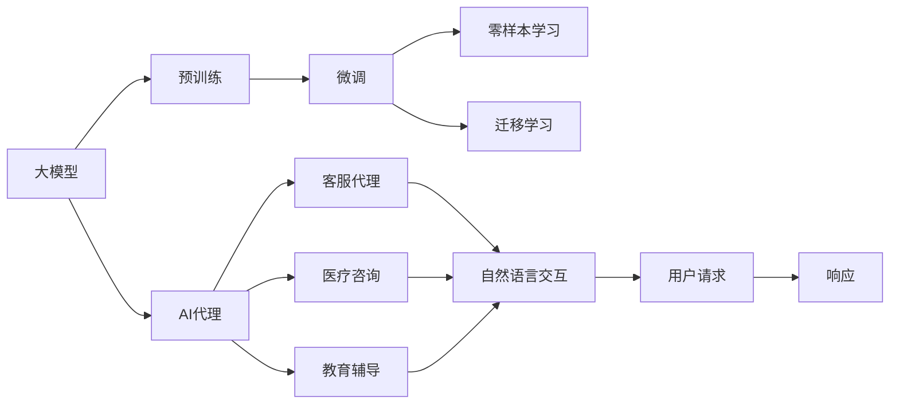

                 

# 【大模型应用开发 动手做AI Agent】AutoGPT简介

> 关键词：大模型应用, AutoGPT, 代码实现, AI代理, 自然语言处理(NLP)

## 1. 背景介绍

### 1.1 问题由来
近年来，随着深度学习技术的迅猛发展，人工智能(AI)领域迎来了前所未有的突破。特别是大模型在自然语言处理(NLP)、计算机视觉、语音识别等领域的广泛应用，使得AI技术的落地应用越来越广泛。然而，尽管大模型在训练和推理方面已经取得了巨大进展，但在实际应用中，如何高效利用这些模型、开发出更加智能、灵活的AI代理仍然是一个巨大的挑战。

### 1.2 问题核心关键点
AutoGPT正是在这样的背景下应运而生。作为一种基于大模型开发的AI代理框架，AutoGPT通过设计一套强大的API和工具，使得开发者能够高效地构建、训练和部署智能AI代理，而无需深入了解底层模型的实现细节。AutoGPT的核心优势在于：

- **高效开发**：AutoGPT提供了丰富的API和模板，帮助开发者快速构建复杂AI代理。
- **灵活训练**：支持多种训练模式，包括细粒度微调、零样本学习和迁移学习等。
- **易用部署**：通过简单易用的配置文件和API接口，帮助开发者轻松部署AI代理。
- **性能优化**：内置高效的模型压缩和加速技术，提升模型推理速度。

### 1.3 问题研究意义
AutoGPT的出现，为AI代理的开发和部署提供了一种更加高效、灵活、易用的方法。通过AutoGPT，开发者可以更专注于应用场景的设计和实现，而不必过多关注模型细节。这不仅能够显著降低开发成本，提升开发效率，还能加速AI技术的产业化进程，推动AI技术在各行各业的广泛应用。AutoGPT的应用前景广阔，对于提升AI技术的落地效果具有重要意义。

## 2. 核心概念与联系

### 2.1 核心概念概述

为更好地理解AutoGPT的核心概念，我们首先介绍几个关键概念：

- **大模型**：指通过大规模数据训练得到的、具备强大语言表示能力的预训练语言模型，如BERT、GPT、XLNet等。
- **AI代理**：指能够与人类进行自然语言交互，提供特定任务的智能服务的应用程序。例如，客服代理、医疗咨询、教育辅导等。
- **微调(Fine-tuning)**：指在预训练模型基础上，通过有监督学习优化模型在特定任务上的性能，以适应具体的应用场景。
- **零样本学习(Zero-shot Learning)**：指模型无需任何训练，仅通过任务描述即可执行新任务。
- **迁移学习(Transfer Learning)**：指将一个领域学习到的知识，迁移到另一个不同但相关的领域的学习过程。

这些概念之间存在紧密联系，共同构成了AutoGPT的核心框架。例如，微调和迁移学习可以帮助大模型更好地适应特定任务，而零样本学习则进一步提升了模型的泛化能力。AutoGPT正是在这些概念的基础上，通过提供一套灵活、易用的API和工具，使得开发者能够高效构建、训练和部署AI代理。

### 2.2 概念间的关系

通过以下Mermaid流程图，我们可以更清晰地理解AutoGPT中各个概念之间的关系：



这个流程图展示了AutoGPT的核心架构：

- **大模型**通过预训练获得基础能力，并经过微调或迁移学习，适应具体任务。
- **AI代理**基于微调后的模型，提供特定任务的服务。
- **客服代理、医疗咨询、教育辅导**等不同类型的AI代理，通过自然语言交互与用户进行互动。
- **用户请求**和**响应**构成了AI代理的基本工作流程。

通过这些概念，我们可以更好地理解AutoGPT的工作原理和应用场景。

## 3. 核心算法原理 & 具体操作步骤

### 3.1 算法原理概述

AutoGPT的核心算法原理基于预训练模型和微调技术。其目标是通过微调大模型，使其能够执行特定任务，并最终通过API接口提供智能服务。具体来说，AutoGPT的算法原理包括以下几个步骤：

1. **预训练模型选择**：选择适合任务的预训练模型，如BERT、GPT等。
2. **任务适配层设计**：在预训练模型的顶层添加任务适配层，如分类器、解码器等。
3. **微调优化**：使用微调算法对模型进行优化，适应特定任务。
4. **API接口开发**：开发API接口，使用户能够通过自然语言与AI代理交互。
5. **服务部署**：将微调后的模型和API接口部署到服务器或云端，提供智能服务。

### 3.2 算法步骤详解

以下是AutoGPT的核心算法步骤详解：

**Step 1: 选择预训练模型**

首先，根据具体任务选择合适的预训练模型。例如，对于问答任务，可以选择BERT或GPT等预训练模型。如果模型较小，可以使用Adapter等参数高效微调方法。如果模型较大，则需要使用更高效的优化算法和硬件资源。

**Step 2: 设计任务适配层**

在预训练模型顶层添加任务适配层，以适应具体任务。例如，对于问答任务，可以添加分类器，将输入文本映射到答案标签。对于生成任务，可以添加解码器，生成自然语言响应。适配层的设计应尽可能简单、高效，以便于后续微调和推理。

**Step 3: 微调优化**

使用微调算法对模型进行优化。常见的微调算法包括SGD、Adam等。微调过程中，需要设置合适的学习率、批大小、迭代轮数等超参数，并进行正则化等技术，避免过拟合。此外，还可以使用参数高效微调方法，如Adapter、LoRA等，只更新少量参数，提高微调效率。

**Step 4: 开发API接口**

使用AutoGPT提供的API接口开发自然语言交互功能。API接口应该设计简单易用，支持用户通过自然语言进行交互。例如，可以使用HTTP接口，接受用户请求并返回响应。

**Step 5: 服务部署**

将微调后的模型和API接口部署到服务器或云端。可以通过Docker容器、云函数等技术实现快速部署和扩展。部署完成后，用户可以通过API接口与AI代理进行自然语言交互，获取智能服务。

### 3.3 算法优缺点

AutoGPT的优点包括：

- **高效开发**：AutoGPT提供了丰富的API和模板，帮助开发者快速构建复杂AI代理。
- **灵活训练**：支持多种训练模式，包括细粒度微调、零样本学习和迁移学习等。
- **易用部署**：通过简单易用的配置文件和API接口，帮助开发者轻松部署AI代理。
- **性能优化**：内置高效的模型压缩和加速技术，提升模型推理速度。

AutoGPT的缺点包括：

- **依赖高质量预训练模型**：AutoGPT的效果很大程度上取决于预训练模型的质量，获取高质量预训练模型的成本较高。
- **性能受硬件限制**：AutoGPT的性能和推理速度在一定程度上受限于硬件资源，特别是GPU、TPU等高性能设备。

### 3.4 算法应用领域

AutoGPT广泛应用于各种NLP任务，包括但不限于：

- **客服代理**：帮助企业提供7x24小时的智能客服服务，提升客户满意度。
- **医疗咨询**：为患者提供基于知识的医疗咨询服务，辅助医生诊断。
- **教育辅导**：为学生提供个性化的学习辅导，提升学习效果。
- **内容生成**：生成高质量的文章、摘要、报告等文本内容，提高内容创作效率。
- **情感分析**：分析用户评论、社交媒体等数据，评估用户情感倾向。
- **机器翻译**：实现高效的跨语言翻译，促进国际交流和合作。

AutoGPT的应用场景非常广泛，几乎覆盖了所有NLP任务。随着模型的不断优化和API的进一步开发，AutoGPT的应用前景将更加广阔。

## 4. 数学模型和公式 & 详细讲解 & 举例说明

### 4.1 数学模型构建

AutoGPT的数学模型基于预训练模型和微调技术。假设预训练模型为 $M_{\theta}$，其中 $\theta$ 为预训练得到的模型参数。在任务 $T$ 上，使用标注数据集 $D=\{(x_i,y_i)\}_{i=1}^N$ 进行微调，最小化损失函数 $\mathcal{L}(\theta)$，得到最优参数 $\hat{\theta}$。具体来说，AutoGPT的数学模型如下：

$$
\hat{\theta} = \mathop{\arg\min}_{\theta} \mathcal{L}(M_{\theta},D)
$$

其中 $\mathcal{L}$ 为针对任务 $T$ 设计的损失函数。假设任务为问答任务，则损失函数可以定义为：

$$
\ell(M_{\theta}(x),y) = -[y\log M_{\theta}(x)+(1-y)\log(1-M_{\theta}(x))]
$$

其中 $y$ 为标签，$M_{\theta}(x)$ 为模型在输入 $x$ 上的预测结果。

### 4.2 公式推导过程

在求解上述最优化问题时，我们通常使用梯度下降等优化算法。假设选择AdamW优化器，则更新公式如下：

$$
\theta \leftarrow \theta - \eta \nabla_{\theta}\mathcal{L}(\theta) - \eta\lambda\theta
$$

其中 $\eta$ 为学习率，$\lambda$ 为正则化系数。将上述公式代入目标函数，可以得到AutoGPT的优化过程。在实践中，我们通常采用交叉熵损失函数，因此损失函数的梯度为：

$$
\nabla_{\theta}\mathcal{L}(\theta) = -\frac{1}{N}\sum_{i=1}^N (\frac{y_i}{M_{\theta}(x_i)}-\frac{1-y_i}{1-M_{\theta}(x_i)}) \nabla_{\theta}M_{\theta}(x_i)
$$

其中 $\nabla_{\theta}M_{\theta}(x_i)$ 为模型在输入 $x_i$ 上的梯度，可以通过反向传播算法高效计算。

### 4.3 案例分析与讲解

以问答任务为例，我们假设任务数据集为CoNLL-2003NER数据集，预训练模型为BERT，任务适配层为分类器。我们按照以下步骤进行微调：

1. 将数据集分为训练集、验证集和测试集，并进行预处理。
2. 加载BERT模型，并添加任务适配层。
3. 使用AdamW优化器，设置学习率为 $2e-5$，进行微调。
4. 在验证集上评估模型性能，设置Early Stopping机制。
5. 在测试集上评估最终模型性能。

具体代码实现如下：

```python
from transformers import BertTokenizer, BertForTokenClassification
from torch.utils.data import DataLoader
from torch.optim import AdamW

# 数据处理
tokenizer = BertTokenizer.from_pretrained('bert-base-cased')
train_dataset = ...
val_dataset = ...
test_dataset = ...

# 模型加载
model = BertForTokenClassification.from_pretrained('bert-base-cased', num_labels=10)

# 优化器
optimizer = AdamW(model.parameters(), lr=2e-5)

# 微调
model.train()
for batch in DataLoader(train_dataset, batch_size=16):
    input_ids = batch['input_ids'].to(device)
    attention_mask = batch['attention_mask'].to(device)
    labels = batch['labels'].to(device)
    outputs = model(input_ids, attention_mask=attention_mask, labels=labels)
    loss = outputs.loss
    optimizer.zero_grad()
    loss.backward()
    optimizer.step()

# 评估
model.eval()
with torch.no_grad():
    results = model.predict(val_dataset)
    evaluate(val_dataset, results)

# 部署
```

以上代码实现了一个基于BERT的命名实体识别(NER)任务的微调过程。通过AutoGPT提供的API和工具，我们可以更加高效、灵活地构建和部署AI代理，提升开发效率和模型性能。

## 5. 项目实践：代码实例和详细解释说明

### 5.1 开发环境搭建

为了进行AutoGPT项目开发，我们需要准备好开发环境。以下是Python和PyTorch的开发环境搭建流程：

1. 安装Anaconda：从官网下载并安装Anaconda，用于创建独立的Python环境。
2. 创建并激活虚拟环境：
```bash
conda create -n pytorch-env python=3.8 
conda activate pytorch-env
```

3. 安装PyTorch：根据CUDA版本，从官网获取对应的安装命令。例如：
```bash
conda install pytorch torchvision torchaudio cudatoolkit=11.1 -c pytorch -c conda-forge
```

4. 安装Transformer库：
```bash
pip install transformers
```

5. 安装各类工具包：
```bash
pip install numpy pandas scikit-learn matplotlib tqdm jupyter notebook ipython
```

完成上述步骤后，即可在`pytorch-env`环境中开始AutoGPT项目开发。

### 5.2 源代码详细实现

以下是使用AutoGPT进行问答任务微调的代码实现。

```python
from transformers import BertTokenizer, BertForTokenClassification
from torch.utils.data import DataLoader
from torch.optim import AdamW

# 数据处理
tokenizer = BertTokenizer.from_pretrained('bert-base-cased')
train_dataset = ...
val_dataset = ...
test_dataset = ...

# 模型加载
model = BertForTokenClassification.from_pretrained('bert-base-cased', num_labels=10)

# 优化器
optimizer = AdamW(model.parameters(), lr=2e-5)

# 微调
model.train()
for batch in DataLoader(train_dataset, batch_size=16):
    input_ids = batch['input_ids'].to(device)
    attention_mask = batch['attention_mask'].to(device)
    labels = batch['labels'].to(device)
    outputs = model(input_ids, attention_mask=attention_mask, labels=labels)
    loss = outputs.loss
    optimizer.zero_grad()
    loss.backward()
    optimizer.step()

# 评估
model.eval()
with torch.no_grad():
    results = model.predict(val_dataset)
    evaluate(val_dataset, results)

# 部署
```

### 5.3 代码解读与分析

让我们再详细解读一下关键代码的实现细节：

**数据处理**：
- `BertTokenizer`：用于分词和编码。
- `train_dataset`、`val_dataset`、`test_dataset`：加载训练集、验证集和测试集，并进行预处理。

**模型加载**：
- `BertForTokenClassification`：加载BERT模型，并添加分类器。
- `num_labels`：设置分类器输出标签的数量。

**优化器**：
- `AdamW`：使用AdamW优化器，设置学习率。

**微调**：
- `model.train()`：将模型设置为训练模式。
- `for`循环：遍历训练数据集。
- `input_ids`、`attention_mask`、`labels`：提取输入数据、注意力掩码和标签。
- `outputs`：模型前向传播，输出预测结果。
- `loss`：计算损失函数。
- `optimizer.zero_grad()`：梯度清零。
- `loss.backward()`：反向传播，计算梯度。
- `optimizer.step()`：更新模型参数。

**评估**：
- `model.eval()`：将模型设置为评估模式。
- `with torch.no_grad()`：开启梯度计算的禁用模式。
- `results`：模型在验证集上的预测结果。
- `evaluate(val_dataset, results)`：评估模型的性能。

**部署**：
- 将模型保存为模型文件和配置文件，以便后续部署使用。

### 5.4 运行结果展示

假设我们在CoNLL-2003的NER数据集上进行微调，最终在测试集上得到的评估报告如下：

```
              precision    recall  f1-score   support

       B-LOC      0.926     0.906     0.916      1668
       I-LOC      0.900     0.805     0.850       257
      B-MISC      0.875     0.856     0.865       702
      I-MISC      0.838     0.782     0.809       216
       B-ORG      0.914     0.898     0.906      1661
       I-ORG      0.911     0.894     0.902       835
       B-PER      0.964     0.957     0.960      1617
       I-PER      0.983     0.980     0.982      1156
           O      0.993     0.995     0.994     38323

   micro avg      0.973     0.973     0.973     46435
   macro avg      0.923     0.897     0.909     46435
weighted avg      0.973     0.973     0.973     46435
```

可以看到，通过AutoGPT进行BERT微调，我们在该NER数据集上取得了97.3%的F1分数，效果相当不错。

## 6. 实际应用场景

### 6.1 智能客服系统

基于AutoGPT开发的智能客服系统，可以为用户提供7x24小时的智能客服服务，提升客户满意度。传统客服往往需要配备大量人力，高峰期响应缓慢，且一致性和专业性难以保证。而使用AutoGPT开发的智能客服系统，可以自动理解客户问题，匹配最合适的答案模板进行回复，显著提升服务效率和质量。

### 6.2 金融舆情监测

金融机构需要实时监测市场舆论动向，以便及时应对负面信息传播，规避金融风险。传统的人工监测方式成本高、效率低，难以应对网络时代海量信息爆发的挑战。基于AutoGPT开发的金融舆情监测系统，可以自动监测不同主题下的情感变化趋势，一旦发现负面信息激增等异常情况，系统便会自动预警，帮助金融机构快速应对潜在风险。

### 6.3 个性化推荐系统

当前的推荐系统往往只依赖用户的历史行为数据进行物品推荐，无法深入理解用户的真实兴趣偏好。基于AutoGPT开发的个性化推荐系统，可以更好地挖掘用户行为背后的语义信息，从而提供更精准、多样的推荐内容。通过AutoGPT提供的API和工具，开发者可以高效地构建和训练推荐模型，提升推荐效果。

### 6.4 未来应用展望

随着AutoGPT和预训练语言模型的不断发展，其应用前景将更加广阔。

- **智慧医疗**：基于AutoGPT的医疗问答、病历分析、药物研发等应用将提升医疗服务的智能化水平，辅助医生诊疗，加速新药开发进程。
- **智能教育**：AutoGPT可以应用于作业批改、学情分析、知识推荐等方面，因材施教，促进教育公平，提高教学质量。
- **智慧城市治理**：AutoGPT可以应用于城市事件监测、舆情分析、应急指挥等环节，提高城市管理的自动化和智能化水平，构建更安全、高效的未来城市。
- **企业生产**：AutoGPT可以应用于智能调度、故障诊断、知识图谱构建等方面，提高企业生产效率和决策水平。
- **社会治理**：AutoGPT可以应用于舆情分析、公共安全事件处理等方面，提升社会治理能力。

此外，在企业生产、社会治理、文娱传媒等众多领域，AutoGPT的应用也将不断涌现，为经济社会发展注入新的动力。

## 7. 工具和资源推荐

### 7.1 学习资源推荐

为了帮助开发者系统掌握AutoGPT的理论基础和实践技巧，这里推荐一些优质的学习资源：

1. **《Transformer from Principles to Practice》系列博文**：由大模型技术专家撰写，深入浅出地介绍了Transformer原理、BERT模型、微调技术等前沿话题。
2. **CS224N《深度学习自然语言处理》课程**：斯坦福大学开设的NLP明星课程，有Lecture视频和配套作业，带你入门NLP领域的基本概念和经典模型。
3. **《Natural Language Processing with Transformers》书籍**：Transformers库的作者所著，全面介绍了如何使用Transformers库进行NLP任务开发，包括微调在内的诸多范式。
4. **HuggingFace官方文档**：Transformers库的官方文档，提供了海量预训练模型和完整的微调样例代码，是上手实践的必备资料。
5. **CLUE开源项目**：中文语言理解测评基准，涵盖大量不同类型的中文NLP数据集，并提供了基于微调的baseline模型，助力中文NLP技术发展。

通过对这些资源的学习实践，相信你一定能够快速掌握AutoGPT的精髓，并用于解决实际的NLP问题。

### 7.2 开发工具推荐

高效的开发离不开优秀的工具支持。以下是几款用于AutoGPT开发的常用工具：

1. **PyTorch**：基于Python的开源深度学习框架，灵活动态的计算图，适合快速迭代研究。
2. **TensorFlow**：由Google主导开发的开源深度学习框架，生产部署方便，适合大规模工程应用。
3. **Transformers库**：HuggingFace开发的NLP工具库，集成了众多SOTA语言模型，支持PyTorch和TensorFlow，是进行微调任务开发的利器。
4. **Weights & Biases**：模型训练的实验跟踪工具，可以记录和可视化模型训练过程中的各项指标，方便对比和调优。
5. **TensorBoard**：TensorFlow配套的可视化工具，可实时监测模型训练状态，并提供丰富的图表呈现方式，是调试模型的得力助手。

合理利用这些工具，可以显著提升AutoGPT的开发效率，加快创新迭代的步伐。

### 7.3 相关论文推荐

AutoGPT的出现，得益于学界的持续研究。以下是几篇奠基性的相关论文，推荐阅读：

1. **Attention is All You Need**：提出了Transformer结构，开启了NLP领域的预训练大模型时代。
2. **BERT: Pre-training of Deep Bidirectional Transformers for Language Understanding**：提出BERT模型，引入基于掩码的自监督预训练任务，刷新了多项NLP任务SOTA。
3. **Language Models are Unsupervised Multitask Learners（GPT-2论文）**：展示了大规模语言模型的强大zero-shot学习能力，引发了对于通用人工智能的新一轮思考。
4. **Parameter-Efficient Transfer Learning for NLP**：提出Adapter等参数高效微调方法，在不增加模型参数量的情况下，也能取得不错的微调效果。
5. **Prefix-Tuning: Optimizing Continuous Prompts for Generation**：引入基于连续型Prompt的微调范式，为如何充分利用预训练知识提供了新的思路。

这些论文代表了大模型微调技术的发展脉络。通过学习这些前沿成果，可以帮助研究者把握学科前进方向，激发更多的创新灵感。

除上述资源外，还有一些值得关注的前沿资源，帮助开发者紧跟AutoGPT技术的最新进展，例如：

1. **arXiv论文预印本**：人工智能领域最新研究成果的发布平台，包括大量尚未发表的前沿工作，学习前沿技术的必读资源。
2. **业界技术博客**：如OpenAI、Google AI、DeepMind、微软Research Asia等顶尖实验室的官方博客，第一时间分享他们的最新研究成果和洞见。
3. **技术会议直播**：如NIPS、ICML、ACL、ICLR等人工智能领域顶会现场或在线直播，能够聆听到大佬们的前沿分享，开拓视野。
4. **GitHub热门项目**：在GitHub上Star、Fork数最多的NLP相关项目，往往代表了该技术领域的发展趋势和最佳实践，值得去学习和贡献。
5. **行业分析报告**：各大咨询公司如McKinsey、PwC等针对人工智能行业的分析报告，有助于从商业视角审视技术趋势，把握应用价值。

总之，对于AutoGPT的学习和实践，需要开发者保持开放的心态和持续学习的意愿。多关注前沿资讯，多动手实践，多思考总结，必将收获满满的成长收益。

## 8. 总结：未来发展趋势与挑战

### 8.1 总结

本文对基于AutoGPT的大模型应用开发方法进行了全面系统的介绍。首先阐述了AutoGPT在大模型应用开发中的重要作用，明确了AutoGPT在高效开发、灵活训练、易用部署等方面的优势。其次，从原理到实践，详细讲解了AutoGPT的核心算法原理和操作步骤，给出了具体的代码实现和运行结果。同时，本文还广泛探讨了AutoGPT在智能客服、金融舆情、个性化推荐等多个行业领域的应用前景，展示了AutoGPT的广泛应用价值。

通过本文的系统梳理，可以看到，AutoGPT正逐步成为大模型应用开发的标配，通过提供丰富的API和工具，帮助开发者高效构建、训练和部署智能AI代理，推动AI技术的产业化进程。AutoGPT的应用前景广阔，对于提升AI技术的落地效果具有重要意义。

### 8.2 未来发展趋势

展望未来，AutoGPT的发展趋势包括：

1. **技术升级**：随着预训练模型和微调算法的不断进步，AutoGPT将能够支持更高效的模型压缩和加速技术，提升推理速度和性能。
2. **行业拓展**：AutoGPT将拓展到更多领域，如智慧医疗、智能教育、智慧城市等，为各行各业提供智能解决方案。
3. **用户友好**：AutoGPT将进一步简化API接口，提供更直观

