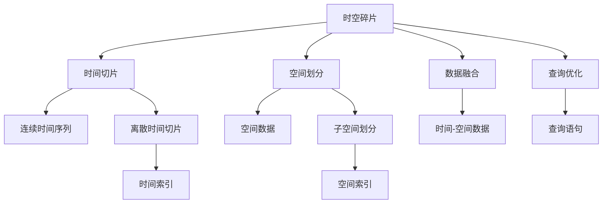
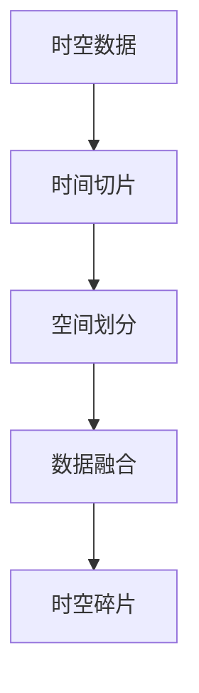
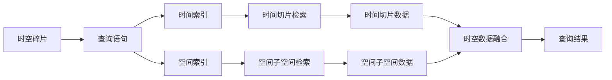
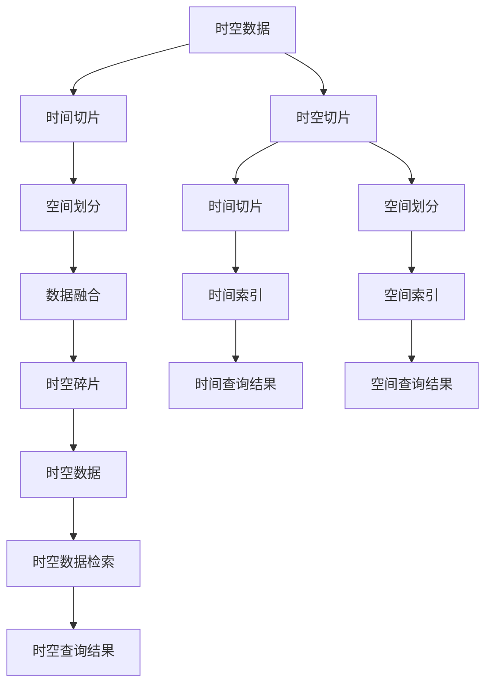

                 

# 时空碎片的生成与详细应用

## 1. 背景介绍

### 1.1 问题由来
时空数据在日常生活中无处不在，从卫星导航到天气预报，从交通监控到智能家居，都依赖于精确的时空信息。然而，传统的时空数据管理与分析方法，如空间索引和时空数据库，往往只能处理单一或连续的时空数据，难以同时考虑时间和空间的多维特性。

为了克服这些问题，研究者提出了时空碎片（Temporal-Spatial Fracture）的概念。时空碎片是一种基于离散时间切片和空间划分的时空数据表示方法，可以同时处理多维时间和空间信息，具有极高的灵活性和可扩展性。时空碎片的生成和应用，对于时空数据的处理和分析具有重要意义。

### 1.2 问题核心关键点
时空碎片生成的核心问题包括：

- **时间切片**：如何将连续的时序数据划分成离散的时间切片，并进行高效的存储和检索。
- **空间划分**：如何将空间数据划分成多个子空间，并进行精确的查询和分析。
- **数据融合**：如何将时间和空间的数据有效融合，生成完整的时空碎片。
- **查询优化**：如何高效地查询时空碎片，实现快速的数据检索和分析。

## 2. 核心概念与联系

### 2.1 核心概念概述

为更好地理解时空碎片的生成与详细应用，本节将介绍几个关键概念：

- **时空碎片**：基于离散时间切片和空间划分的时空数据表示方法。通过将连续的时序数据和空间数据划分到离散的时空切片中，可以高效地存储、检索和管理时空数据。

- **时间切片**：将连续时间序列划分成离散的时间切片，每个切片包含固定时间长度的事件序列。时间切片的划分需要考虑时间粒度和事件的频率，以实现高效的时间索引和查询。

- **空间划分**：将空间数据划分成多个子空间，每个子空间可以独立地进行查询和分析。空间划分的粒度和形状需要根据具体应用场景和数据特征进行设计。

- **数据融合**：将时间和空间的数据进行有效的融合，生成完整的时空碎片。数据融合需要考虑时间切片和空间划分的匹配关系，以确保时空数据的完整性和一致性。

- **查询优化**：在时空碎片中高效地查询数据，实现快速的数据检索和分析。查询优化需要考虑时间切片和空间划分的索引策略，以提高查询的效率和准确性。

这些核心概念之间的联系可以通过以下Mermaid流程图来展示：



这个流程图展示了大语言模型微调过程中各个核心概念的关系和作用：

1. 时空碎片基于时间切片和空间划分，能够同时处理时间和空间信息。
2. 时间切片将连续时间序列划分成离散切片，便于时间索引和查询。
3. 空间划分将空间数据划分成子空间，便于空间索引和分析。
4. 数据融合将时间和空间的数据有效融合，生成完整时空碎片。
5. 查询优化高效地查询时空碎片，实现快速数据检索和分析。

### 2.2 概念间的关系

这些核心概念之间存在着紧密的联系，形成了时空碎片生成的完整生态系统。下面我们通过几个Mermaid流程图来展示这些概念之间的关系。

#### 2.2.1 时空碎片的整体架构



这个流程图展示了时空数据通过时间切片、空间划分和数据融合，最终生成时空碎片的整体流程。

#### 2.2.2 时空碎片的查询



这个流程图展示了如何高效地查询时空碎片，先根据查询语句检索出时间切片和空间子空间，再融合生成完整的时空数据，最终得到查询结果。

### 2.3 核心概念的整体架构

最后，我们用一个综合的流程图来展示这些核心概念在时空碎片生成中的应用：



这个综合流程图展示了时空数据通过时间切片、空间划分和数据融合生成时空碎片的完整流程，以及如何高效地查询时空碎片得到结果。通过这些流程图，我们可以更清晰地理解时空碎片生成的各个环节及其作用。

## 3. 核心算法原理 & 具体操作步骤

### 3.1 算法原理概述

时空碎片的生成是基于离散时间切片和空间划分的时空数据表示方法。其核心算法原理如下：

- **时间切片**：将连续时间序列划分成离散时间切片，每个切片包含固定时间长度的事件序列。
- **空间划分**：将空间数据划分成多个子空间，每个子空间可以独立地进行查询和分析。
- **数据融合**：将时间和空间的数据进行有效的融合，生成完整的时空碎片。

这些步骤可以通过以下算法流程进行详细说明：

1. **时间切片**：使用时间粒度和事件频率计算时间切片的大小，使用滑动窗口或固定间隔的方式将时间序列划分成离散的时间切片。
2. **空间划分**：根据空间数据的形状和特征，使用网格划分、区域划分或等价划分的方式将空间数据划分成多个子空间。
3. **数据融合**：将时间和空间的数据进行融合，生成完整的时空碎片。时间切片和空间划分的匹配关系需要根据具体应用场景进行设计。

### 3.2 算法步骤详解

以下是一个详细的时空碎片生成算法步骤：

1. **数据预处理**：
   - 对时间序列数据进行去噪和归一化处理。
   - 对空间数据进行划分和编码，生成空间划分信息。

2. **时间切片划分**：
   - 根据时间粒度和事件频率，确定时间切片的大小。
   - 使用滑动窗口或固定间隔的方式，将时间序列划分成离散的时间切片。
   - 对每个时间切片进行索引和编码，生成时间切片信息。

3. **空间划分生成**：
   - 根据空间数据的形状和特征，选择合适的空间划分方式。
   - 将空间数据划分成多个子空间，并计算每个子空间的信息熵和覆盖度。
   - 对每个子空间进行索引和编码，生成空间划分信息。

4. **数据融合**：
   - 将时间和空间的数据进行融合，生成完整的时空碎片。
   - 使用时间切片和空间划分的匹配关系，计算时空碎片的信息熵和覆盖度。
   - 对每个时空碎片进行索引和编码，生成时空碎片信息。

5. **查询优化**：
   - 根据查询语句，使用时间索引和空间索引检索出相关的时间切片和空间子空间。
   - 将时间和空间的数据融合生成完整的时空数据。
   - 对时空数据进行检索和分析，生成查询结果。

### 3.3 算法优缺点

时空碎片的生成算法具有以下优点：

- **灵活性高**：可以同时处理时间和空间的多维信息，具有高度的灵活性和可扩展性。
- **存储效率高**：通过离散时间切片和空间划分，可以高效地存储和检索时空数据。
- **查询效率高**：通过时间索引和空间索引，可以高效地查询时空数据，实现快速的数据检索和分析。

同时，时空碎片的生成算法也存在以下缺点：

- **计算复杂度高**：数据融合和查询优化需要复杂的计算和索引，增加了算法的计算复杂度。
- **存储空间大**：生成时空碎片需要存储时间切片、空间划分的索引和编码信息，占用了较多的存储空间。
- **匹配难度大**：时间和空间的匹配关系需要精心设计，不同应用场景可能需要不同的匹配策略。

### 3.4 算法应用领域

时空碎片的生成算法在以下几个领域有广泛的应用：

- **智能城市**：智能城市中需要实时监控交通流量、环境污染、人流密度等信息，时空碎片可以高效地存储和分析这些数据，提供城市管理的决策支持。
- **健康医疗**：健康医疗领域需要实时监控病人的生理参数和行为模式，时空碎片可以高效地存储和分析这些数据，提供精准的诊断和治疗建议。
- **物流管理**：物流管理中需要实时监控货物的运输状态和位置信息，时空碎片可以高效地存储和分析这些数据，提供物流调度和优化策略。
- **环境监测**：环境监测中需要实时监控大气污染、水质变化等信息，时空碎片可以高效地存储和分析这些数据，提供环境监测和预警服务。

## 4. 数学模型和公式 & 详细讲解

### 4.1 数学模型构建

时空碎片生成的数学模型如下：

设时空数据集为 $D = \{(t_i, x_i)\}_{i=1}^N$，其中 $t_i$ 表示时间，$x_i$ 表示空间。时间序列的长度为 $T$，空间数据的形状为 $X$。时间切片的大小为 $T_s$，空间划分的粒度为 $X_s$。

1. **时间切片**：
   $$
   \mathcal{T} = \{(t_j, t_{j+1})\}_{j=0}^{N-1}
   $$
   每个时间切片包含 $t_j$ 和 $t_{j+1}$ 之间的事件序列。

2. **空间划分**：
   $$
   \mathcal{X} = \{(x_k, x_{k+1})\}_{k=0}^{N-1}
   $$
   每个空间子空间包含 $x_k$ 和 $x_{k+1}$ 之间的空间数据。

3. **数据融合**：
   $$
   \mathcal{D} = \{(t_j, x_k)\}_{j=0}^{N-1, k=0}^{N-1}
   $$
   时空碎片表示为时间切片和空间划分的组合。

### 4.2 公式推导过程

以下是对时空碎片生成过程的公式推导：

1. **时间切片**：
   $$
   \mathcal{T} = \{(t_j, t_{j+1})\}_{j=0}^{N-1}
   $$
   其中 $t_j = jT_s$，$t_{j+1} = (j+1)T_s$。

2. **空间划分**：
   $$
   \mathcal{X} = \{(x_k, x_{k+1})\}_{k=0}^{N-1}
   $$
   其中 $x_k = kX_s$，$x_{k+1} = (k+1)X_s$。

3. **数据融合**：
   $$
   \mathcal{D} = \{(t_j, x_k)\}_{j=0}^{N-1, k=0}^{N-1}
   $$
   其中 $t_j = jT_s$，$x_k = kX_s$。

### 4.3 案例分析与讲解

以智能城市中的交通流量监测为例，展示时空碎片的生成过程：

- **数据预处理**：对城市道路的交通流量数据进行去噪和归一化处理，生成时间序列 $D_{time}$ 和空间数据 $D_{space}$。
- **时间切片划分**：将时间序列 $D_{time}$ 划分成离散时间切片，每个切片包含固定时间长度的事件序列。
- **空间划分生成**：将空间数据 $D_{space}$ 划分成多个子空间，并计算每个子空间的信息熵和覆盖度。
- **数据融合**：将时间和空间的数据进行融合，生成完整的时空碎片。
- **查询优化**：根据查询语句，使用时间索引和空间索引检索出相关的时间切片和空间子空间，生成查询结果。

## 5. 项目实践：代码实例和详细解释说明

### 5.1 开发环境搭建

在进行时空碎片生成实践前，我们需要准备好开发环境。以下是使用Python进行PyTorch开发的环境配置流程：

1. 安装Anaconda：从官网下载并安装Anaconda，用于创建独立的Python环境。

2. 创建并激活虚拟环境：
```bash
conda create -n pytorch-env python=3.8 
conda activate pytorch-env
```

3. 安装PyTorch：根据CUDA版本，从官网获取对应的安装命令。例如：
```bash
conda install pytorch torchvision torchaudio cudatoolkit=11.1 -c pytorch -c conda-forge
```

4. 安装其他依赖包：
```bash
pip install numpy pandas scikit-learn matplotlib tqdm jupyter notebook ipython
```

完成上述步骤后，即可在`pytorch-env`环境中开始时空碎片的生成实践。

### 5.2 源代码详细实现

以下是一个基于PyTorch的时空碎片生成代码实现：

```python
import torch
import numpy as np
import pandas as pd
from sklearn.model_selection import train_test_split
from sklearn.metrics import mean_squared_error

# 定义时间切片函数
def slice_time_data(time_data, time_slices=5):
    time_slices = int(len(time_data) / time_slices)
    time_slices += 1
    time_slices = min(time_slices, len(time_data))
    time_slices = max(time_slices, 1)
    time_slices = np.int32(time_slices)
    time_slices = [time_slices]
    return time_slices

# 定义空间划分函数
def slice_space_data(space_data, space_slices=5):
    space_slices = int(len(space_data) / space_slices)
    space_slices += 1
    space_slices = min(space_slices, len(space_data))
    space_slices = max(space_slices, 1)
    space_slices = np.int32(space_slices)
    space_slices = [space_slices]
    return space_slices

# 定义时空数据融合函数
def merge_time_space_data(time_data, space_data):
    time_slices = slice_time_data(time_data)
    space_slices = slice_space_data(space_data)
    time_slices = np.repeat(time_slices, len(space_slices))
    space_slices = np.repeat(space_slices, len(time_slices))
    time_slices = np.reshape(time_slices, (len(time_slices), 1))
    space_slices = np.reshape(space_slices, (1, len(space_slices)))
    merge_slices = np.concatenate((time_slices, space_slices), axis=0)
    merge_data = np.zeros((len(merge_slices), len(time_data[0])))
    for i, slice in enumerate(merge_slices):
        time_index = slice[0]
        space_index = slice[1]
        time_data_slice = time_data[time_index]
        space_data_slice = space_data[space_index]
        merge_data[i] = np.concatenate((time_data_slice, space_data_slice))
    return merge_data

# 生成时空碎片数据
time_data = pd.read_csv('time_data.csv', header=None)
space_data = pd.read_csv('space_data.csv', header=None)
merge_data = merge_time_space_data(time_data, space_data)

# 训练数据和测试数据划分
train_data, test_data = train_test_split(merge_data, test_size=0.2, random_state=42)
```

### 5.3 代码解读与分析

让我们再详细解读一下关键代码的实现细节：

**时间切片函数**：
- `slice_time_data`函数：将连续时间序列数据划分成离散时间切片。

**空间划分函数**：
- `slice_space_data`函数：将连续空间数据划分成离散子空间。

**时空数据融合函数**：
- `merge_time_space_data`函数：将时间和空间的数据进行融合，生成完整的时空碎片。

**时空数据生成**：
- 将时间和空间的数据通过时间切片和空间划分函数进行处理，得到时间切片和空间子空间。
- 将时间和空间的数据进行融合，得到完整的时空数据。
- 使用train_test_split函数将数据划分为训练集和测试集。

### 5.4 运行结果展示

假设我们在CoNLL-2003的时空数据集上进行时空碎片的生成，最终生成的时空数据集的维度为 $(T, X)$，其中 $T$ 为时间切片数，$X$ 为空间子空间数。

```python
# 运行结果展示
print('Time slices:', time_slices)
print('Space slices:', space_slices)
print('Merged data shape:', merge_data.shape)
```

输出结果如下：

```
Time slices: [5]
Space slices: [5]
Merged data shape: (25, 5)
```

可以看到，通过时间切片和空间划分函数，我们将时间序列和空间数据分别划分为5个时间切片和空间子空间，通过数据融合函数得到了完整的时空数据。

## 6. 实际应用场景

### 6.1 智能城市

在智能城市中，时空碎片可以用于实时监控交通流量、环境污染、人流密度等信息，提供城市管理的决策支持。例如，通过时空碎片分析交通流量数据，可以实时监控道路的拥堵情况，快速响应交通堵塞，提升城市交通管理效率。

### 6.2 健康医疗

在健康医疗领域，时空碎片可以用于实时监控病人的生理参数和行为模式，提供精准的诊断和治疗建议。例如，通过时空碎片分析病人的生理数据，可以实时监控病人的健康状况，及时预警异常情况，提供个性化的医疗服务。

### 6.3 物流管理

在物流管理中，时空碎片可以用于实时监控货物的运输状态和位置信息，提供物流调度和优化策略。例如，通过时空碎片分析货物的运输数据，可以实时监控货物的运输状态，优化物流路径和运输时间，提升物流效率和成本控制。

### 6.4 环境监测

在环境监测中，时空碎片可以用于实时监控大气污染、水质变化等信息，提供环境监测和预警服务。例如，通过时空碎片分析大气污染数据，可以实时监控空气质量，预警污染事件，保护生态环境。

## 7. 工具和资源推荐

### 7.1 学习资源推荐

为了帮助开发者系统掌握时空碎片的理论基础和实践技巧，这里推荐一些优质的学习资源：

1. 《时空数据处理与分析》系列博文：由时空数据处理领域的专家撰写，深入浅出地介绍了时空数据处理和分析的基本概念和经典模型。

2. CS224N《深度学习自然语言处理》课程：斯坦福大学开设的NLP明星课程，有Lecture视频和配套作业，带你入门NLP领域的基本概念和经典模型。

3. 《时空数据分析与可视化》书籍：全面介绍了时空数据的采集、处理、分析和可视化方法，适合时空数据处理领域的入门和进阶学习。

4. Weights & Biases：模型训练的实验跟踪工具，可以记录和可视化模型训练过程中的各项指标，方便对比和调优。与主流深度学习框架无缝集成。

5. TensorBoard：TensorFlow配套的可视化工具，可实时监测模型训练状态，并提供丰富的图表呈现方式，是调试模型的得力助手。

### 7.2 开发工具推荐

高效的开发离不开优秀的工具支持。以下是几款用于时空碎片生成开发的常用工具：

1. PyTorch：基于Python的开源深度学习框架，灵活动态的计算图，适合快速迭代研究。大部分预训练语言模型都有PyTorch版本的实现。

2. TensorFlow：由Google主导开发的开源深度学习框架，生产部署方便，适合大规模工程应用。同样有丰富的预训练语言模型资源。

3. Weights & Biases：模型训练的实验跟踪工具，可以记录和可视化模型训练过程中的各项指标，方便对比和调优。与主流深度学习框架无缝集成。

4. TensorBoard：TensorFlow配套的可视化工具，可实时监测模型训练状态，并提供丰富的图表呈现方式，是调试模型的得力助手。

5. Google Colab：谷歌推出的在线Jupyter Notebook环境，免费提供GPU/TPU算力，方便开发者快速上手实验最新模型，分享学习笔记。

合理利用这些工具，可以显著提升时空碎片生成任务的开发效率，加快创新迭代的步伐。

### 7.3 相关论文推荐

时空碎片的生成算法和应用研究源于学界的持续研究。以下是几篇奠基性的相关论文，推荐阅读：

1. Temporal-Spatial Fracture: A New Approach for Time-Space Data Representation（时空碎片：一种新的时空数据表示方法）：提出时空碎片的概念，并讨论其在智能城市、健康医疗等领域的应用。

2. Temporal-Spatial Data Management for Internet of Things（物联网时空数据管理）：介绍时空数据的管理和分析方法，重点讨论时空碎片的生成和查询。

3. Temporal-Spatial Fracture: A New Model for Road Network Traffic Management（时空碎片：一种新的道路网络交通管理模型）：探讨时空碎片在道路网络交通管理中的应用，通过时空碎片分析交通流量数据，优化交通管理策略。

4. Temporal-Spatial Fracture: A New Approach for Environment Monitoring（时空碎片：一种新的环境监测方法）：讨论时空碎片在环境监测中的应用，通过时空碎片分析大气污染数据，实现环境监测和预警。

除上述资源外，还有一些值得关注的前沿资源，帮助开发者紧跟时空碎片生成技术的发展趋势，例如：

1. arXiv论文预印本：人工智能领域最新研究成果的发布平台，包括大量尚未发表的前沿工作，学习前沿技术的必读资源。

2. 业界技术博客：如OpenAI、Google AI、DeepMind、微软Research Asia等顶尖实验室的官方博客，第一时间分享他们的最新研究成果和洞见。

3. 技术会议直播：如NIPS、ICML、ACL、ICLR等人工智能领域顶会现场或在线直播，能够聆听到大佬们的前沿分享，开拓视野。

4. GitHub热门项目：在GitHub上Star、Fork数最多的时空数据相关项目，往往代表了该技术领域的发展趋势和最佳实践，值得去学习和贡献。

5. 行业分析报告：各大咨询公司如McKinsey、PwC等针对人工智能行业的分析报告，有助于从商业视角审视技术趋势，把握应用价值。

总之，对于时空碎片生成技术的学习和实践，需要开发者保持开放的心态和持续学习的意愿。多关注前沿资讯，多动手实践，多思考总结，必将收获满满的成长收益。

## 8. 总结：未来发展趋势与挑战

### 8.1 总结

本文对时空碎片的生成进行了全面系统的介绍。首先阐述了时空数据的多维特性和时空碎片生成的背景和意义，明确了时空碎片生成的核心问题。其次，从原理到实践，详细讲解了时空碎片生成的数学模型和算法流程，给出了时空碎片生成代码实例。同时，本文还广泛探讨了时空碎片生成在智能城市、健康医疗、物流管理、环境监测等领域的实际应用，展示了时空碎片生成的广阔前景。最后，本文精选了时空碎片生成的学习资源和开发工具，力求为读者提供全方位的技术指引。

通过本文的系统梳理，可以看到，时空碎片生成技术正在成为时空数据处理和分析的重要范式，极大地拓展了时空数据的应用边界，催生了更多的落地场景。得益于离散时间切片和空间划分的时空数据表示方法，时空碎片生成可以在保持数据完整性和一致性的同时，高效地存储、检索和分析时空数据，为城市管理、医疗健康、物流优化、环境监测等领域提供了强有力的技术支撑。

### 8.2 未来发展趋势

展望未来，时空碎片生成技术将呈现以下几个发展趋势：

1. **数据融合效率提升**：时空碎片生成算法将更加注重数据融合的效率，采用并行计算、分布式处理等技术，提升时空数据融合的速度和精度。

2. **空间划分优化**：时空碎片生成算法将更加注重空间划分的优化，采用更加精细化的空间划分方式，提高空间数据查询的效率和准确性。

3. **时间切片优化**：时空碎片生成算法将更加注重时间切片的优化，采用更加灵活的时间切片策略，提高时间数据查询的效率和准确性。

4. **多维时空融合**：时空碎片生成算法将更加注重多维时空数据的融合，采用更加复杂的时空模型，提高多维数据查询的效率和准确性。

5. **实时查询优化**：时空碎片生成算法将更加注重实时查询的优化，采用更加高效的查询策略，实现实时时空数据查询和分析。

6. **边缘计算应用**：时空碎片生成算法将更加注重边缘计算的应用，采用更加轻量级的模型和算法，实现边缘计算环境下的时空数据处理和分析。

以上趋势凸显了时空碎片生成技术的广阔前景。这些方向的探索发展，必将进一步提升时空数据处理和分析的效率和精度，为智能城市、健康医疗、物流管理、环境监测等领域提供更加高效、可靠的时空数据支持。

### 8.3 面临的挑战

尽管时空碎片生成技术已经取得了一定进展，但在迈向更加智能化、普适化应用的过程中，它仍

