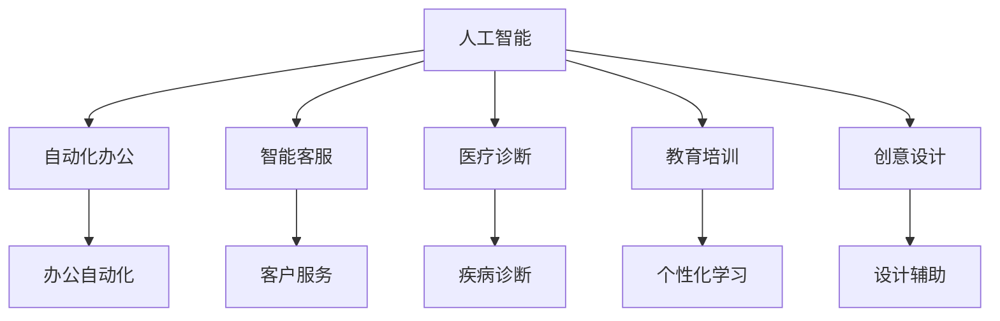

                 

## 1. 背景介绍

随着人工智能（AI）技术的迅猛发展，机器学习、深度学习等技术已经成为推动各行各业创新的重要驱动力。在未来的工作形态中，AI的应用将变得更加广泛和深入，从自动化办公、智能客服、医疗诊断、教育培训到创意设计，AI正在逐步改变我们的工作方式。本文将探讨未来工作形态与AI共存的具体场景，分析AI技术在各行业的应用前景，并提出AI在推动人类工作形态转变的建议。

## 2. 核心概念与联系

### 2.1 核心概念概述

在讨论未来工作形态与AI共存之前，需要先理解几个核心概念：

- **人工智能**：指通过计算机算法和数据训练模型，实现人类智能任务的机器系统。AI涵盖了机器学习、深度学习、自然语言处理、计算机视觉等多个领域。
- **自动化办公**：指利用AI技术简化和自动化重复性、规则性强的办公任务，如数据录入、文档生成、会议安排等。
- **智能客服**：指通过AI模型提供全天候、多渠道的客户服务，实现自动化问答、订单处理、客户关系管理等功能。
- **医疗诊断**：指利用AI技术辅助医生进行疾病诊断、病情评估、治疗方案推荐等。
- **教育培训**：指利用AI技术个性化定制学习计划、提供智能辅导、评估学习效果等，提升教育培训质量。
- **创意设计**：指通过AI技术辅助设计师进行创意构思、图形生成、色彩搭配等，提升设计效率和质量。

这些概念之间存在着紧密的联系。AI技术不仅能够提高工作效率，还能提升工作质量，释放人类从事更高级别的创新活动。这种变革不仅仅局限于技术层面，更是对整个社会生产方式和人类工作形态的深刻影响。

### 2.2 概念间的关系

我们可以用以下Mermaid流程图来展示这些核心概念之间的关系：



这个流程图展示了AI技术在多个行业的应用，以及这些应用如何推动自动化、智能化办公的进展。

## 3. 核心算法原理 & 具体操作步骤

### 3.1 算法原理概述

未来工作形态与AI共存的核心算法原理基于机器学习和深度学习。机器学习通过数据训练模型，从中找到数据之间的规律和模式；深度学习则通过构建多层神经网络，实现更复杂的模式识别和预测。这些算法在处理大规模数据和复杂问题时表现出色，是实现未来工作形态与AI共存的技术基础。

### 3.2 算法步骤详解

下面以智能客服为例，详细介绍基于深度学习的智能客服系统的构建步骤：

1. **数据准备**：收集和标注客户咨询、投诉、服务请求等数据，作为训练集。
2. **模型选择**：选择合适的深度学习模型，如RNN、LSTM、Transformer等，作为智能客服的基础模型。
3. **模型训练**：使用训练集数据训练模型，调整模型参数，使得模型能够理解自然语言，提供准确的回复。
4. **模型评估**：使用验证集数据评估模型性能，选择最优模型进行部署。
5. **系统部署**：将训练好的模型部署到生产环境中，与客户互动，提供智能客服服务。
6. **持续优化**：通过在线反馈和数据分析，不断优化模型，提升服务质量。

### 3.3 算法优缺点

基于深度学习的智能客服系统具有以下优点：

- 高度自动化：能够24小时不间断地提供客户服务，节省人力成本。
- 全天候服务：不受时间限制，支持多语言、多渠道的客户服务。
- 个性化服务：根据客户历史数据，提供个性化的服务和推荐。

同时，也存在以下缺点：

- 数据依赖：模型训练依赖高质量标注数据，获取和标注数据成本较高。
- 解释性不足：深度学习模型通常缺乏可解释性，难以理解其决策过程。
- 安全性问题：深度学习模型可能存在偏见和错误，影响服务质量。

### 3.4 算法应用领域

基于深度学习的智能客服系统在金融、电商、物流等多个行业得到了广泛应用，提升了客户满意度和服务效率。此外，AI技术在医疗诊断、教育培训、创意设计等领域也展示了强大的应用潜力。

## 4. 数学模型和公式 & 详细讲解

### 4.1 数学模型构建

以医疗诊断为例，假设有一个包含疾病和症状的数据集，模型任务是预测给定症状对应的疾病。模型的输入为症状特征向量 $x$，输出为疾病标签 $y$。可以使用以下数学模型来描述这个预测任务：

$$
p(y|x;w) = \frac{e^{x^Tw}}{\sum_{j=1}^{C} e^{x_j^Tw}}
$$

其中 $w$ 为模型参数，$C$ 为疾病的类别数。

### 4.2 公式推导过程

上述模型的推导基于极大似然估计和正则化。通过最大化似然函数，求解模型参数 $w$，使得模型能够准确预测疾病类别。同时，为了控制过拟合，可以在似然函数中加入正则化项，如L2正则化：

$$
\mathcal{L}(w) = -\frac{1}{N}\sum_{i=1}^{N} \log p(y_i|x_i;w) + \frac{\lambda}{2}\|w\|_2^2
$$

其中 $\lambda$ 为正则化系数。

### 4.3 案例分析与讲解

以医疗诊断为例，假设有一个包含心脏病和高血压症状的数据集，模型任务是预测给定症状对应的疾病。使用以上模型和数据，训练得到预测模型后，可以将其部署到生产环境中，实时预测新病人的疾病类型，辅助医生进行诊断和治疗。

## 5. 项目实践：代码实例和详细解释说明

### 5.1 开发环境搭建

要构建一个基于深度学习的医疗诊断系统，需要准备以下开发环境：

1. **Python**：安装Python 3.7及以上版本。
2. **深度学习框架**：如TensorFlow、PyTorch等，用于构建和训练模型。
3. **数据处理工具**：如Pandas、NumPy等，用于数据清洗和处理。
4. **Web服务器**：如Flask、Django等，用于部署模型接口。

### 5.2 源代码详细实现

下面是一个简单的基于TensorFlow的医疗诊断系统的实现示例：

```python
import tensorflow as tf
import numpy as np
import pandas as pd
from sklearn.model_selection import train_test_split

# 加载数据
data = pd.read_csv('medical_data.csv')

# 数据预处理
features = data[['symptom1', 'symptom2', 'symptom3']]
labels = data['disease']
X_train, X_test, y_train, y_test = train_test_split(features, labels, test_size=0.2)

# 构建模型
model = tf.keras.Sequential([
    tf.keras.layers.Dense(64, activation='relu', input_shape=(features.shape[1],)),
    tf.keras.layers.Dense(64, activation='relu'),
    tf.keras.layers.Dense(2, activation='softmax')
])

# 编译模型
model.compile(optimizer='adam', loss='categorical_crossentropy', metrics=['accuracy'])

# 训练模型
model.fit(X_train, y_train, epochs=10, validation_data=(X_test, y_test))

# 评估模型
test_loss, test_acc = model.evaluate(X_test, y_test)
print('Test accuracy:', test_acc)
```

### 5.3 代码解读与分析

在上述代码中，首先使用Pandas加载医疗诊断数据集，然后对数据进行预处理，构建了包含两个隐藏层和一个输出层的神经网络模型。使用TensorFlow的Keras API，定义了模型的结构，并通过编译函数设置优化器和损失函数。通过fit函数训练模型，并使用evaluate函数评估模型性能。

## 6. 实际应用场景

### 6.1 金融行业

在金融行业，智能客服系统可以用于客户咨询、投诉处理、投资建议等场景。通过深度学习模型，系统可以自动分析客户需求，提供个性化的服务和建议。例如，某银行可以开发智能客服系统，实时回答客户关于账户余额、转账、贷款等方面的问题，提升客户体验和服务效率。

### 6.2 电商行业

在电商行业，智能客服系统可以用于订单处理、客户关系管理、产品推荐等场景。通过深度学习模型，系统可以自动分析客户历史行为，提供个性化的推荐和建议。例如，某电商平台可以开发智能客服系统，自动回答客户关于商品、物流、退换货等方面的问题，提升客户满意度和销售额。

### 6.3 教育行业

在教育行业，智能客服系统可以用于学习辅导、个性化推荐、评估反馈等场景。通过深度学习模型，系统可以自动分析学生的学习行为，提供个性化的学习计划和建议。例如，某在线教育平台可以开发智能客服系统，自动回答学生关于课程、学习进度、作业等方面的问题，提升学习效果和平台的用户黏性。

## 7. 工具和资源推荐

### 7.1 学习资源推荐

要深入理解未来工作形态与AI共存，可以参考以下学习资源：

1. **机器学习课程**：如Coursera上的“Machine Learning by Andrew Ng”、edX上的“Deep Learning Specialization”等，系统学习机器学习和深度学习的基础知识。
2. **AI技术博客**：如Towards Data Science、Deep Learning AI、AI China等，了解AI技术在各个行业的应用案例和最新进展。
3. **开源项目**：如TensorFlow、PyTorch、Keras等，下载和部署开源AI项目，实践AI技术的应用。

### 7.2 开发工具推荐

以下是一些常用的开发工具，用于构建和部署AI应用：

1. **Python**：作为AI领域的主要编程语言，Python提供了丰富的库和框架，方便开发者构建和部署AI应用。
2. **TensorFlow**：由Google开发的深度学习框架，支持分布式计算和GPU加速，广泛应用于学术研究和工业应用。
3. **PyTorch**：由Facebook开发的深度学习框架，支持动态计算图和灵活的模型构建，广泛应用于学术研究和工业应用。
4. **Jupyter Notebook**：支持Python和其他编程语言的交互式开发，便于快速迭代和实验。
5. **Flask**：轻量级的Web框架，方便构建和部署API接口，实现AI应用的前端交互。

### 7.3 相关论文推荐

以下是一些关于未来工作形态与AI共存的经典论文，值得深入阅读：

1. **“The Rise of Supervised Learning” by Yann LeCun**：详细介绍了深度学习在图像识别、自然语言处理等领域的应用，以及AI技术对未来工作形态的影响。
2. **“AI for the People” by Andrew Ng**：讨论了AI技术的伦理、安全、隐私等问题，提出了未来AI技术的可持续发展方向。
3. **“Superintelligence: Paths, Dangers, Strategies” by Nick Bostrom**：从哲学和伦理的角度，探讨了未来超级智能AI的潜在风险和应对策略。

## 8. 总结：未来发展趋势与挑战

### 8.1 研究成果总结

未来工作形态与AI共存的研究已经取得了显著进展，主要体现在以下几个方面：

1. **自动化办公**：通过AI技术实现自动化办公，提升工作效率和质量，释放人类从事高级别创新活动的时间和精力。
2. **智能客服**：通过AI技术实现智能客服，提升客户体验和满意度，降低企业运营成本。
3. **医疗诊断**：通过AI技术实现医疗诊断，提升疾病预测和诊断的准确性，辅助医生进行决策。
4. **教育培训**：通过AI技术实现个性化学习，提升教育培训效果，提高学生学习效率。
5. **创意设计**：通过AI技术实现设计辅助，提升设计效率和质量，推动创意产业的发展。

### 8.2 未来发展趋势

未来，随着AI技术的不断发展，我们可以预见以下趋势：

1. **跨领域融合**：AI技术将在更多领域得到应用，如智慧城市、智能交通、智能制造等，推动各行各业的数字化转型。
2. **个性化定制**：基于用户数据和行为分析，AI系统将提供更加个性化的服务和建议，提升用户体验。
3. **自动化和智能化**：AI系统将承担更多重复性和规则性强的任务，人类将从事更高层次的创新和决策工作。
4. **伦理和法律框架**：随着AI技术的应用普及，伦理和法律问题将受到更多关注，相关法规和标准将逐步完善。

### 8.3 面临的挑战

尽管AI技术带来了许多机遇，但也面临一些挑战：

1. **数据隐私和安全**：在数据驱动的AI应用中，如何保护用户隐私和数据安全是一个重要问题。
2. **伦理和法律问题**：AI系统可能存在偏见和错误，如何避免伦理和法律风险是一个重要挑战。
3. **可解释性和透明性**：AI系统的决策过程缺乏可解释性，如何提高系统的透明性和可解释性是一个重要课题。
4. **技术壁垒和普及**：AI技术的应用需要技术人才和基础设施的支持，如何降低技术壁垒，推动AI技术的普及是一个重要挑战。

### 8.4 研究展望

未来，随着AI技术的发展，我们需要在以下几个方面进行研究：

1. **数据隐私和安全技术**：开发和应用数据隐私和安全技术，保护用户隐私和数据安全。
2. **伦理和法律框架**：研究和建立AI技术的伦理和法律框架，保障AI系统的公平、透明和可解释性。
3. **可解释性和透明性技术**：开发和应用可解释性和透明性技术，提高AI系统的透明性和可解释性。
4. **技术普及和教育**：推广AI技术的应用，推动技术人才和基础设施的建设，提高AI技术的普及度。

总之，未来工作形态与AI共存是一个充满机遇和挑战的领域。只有在技术和伦理双轮驱动下，AI技术才能真正服务于人类，推动社会的进步和发展。

## 9. 附录：常见问题与解答

**Q1: 未来工作形态与AI共存如何实现？**

A: 实现未来工作形态与AI共存，需要从以下几个方面入手：

1. **技术准备**：选择合适的AI技术和工具，构建和训练AI模型，开发应用系统。
2. **数据准备**：获取和标注高质量数据，作为模型训练的基础。
3. **业务适配**：根据具体业务需求，适配和优化AI模型和应用系统，提升业务效果。
4. **持续优化**：通过在线反馈和数据分析，不断优化AI模型和应用系统，提升服务质量。

**Q2: AI技术在各个行业中的应用前景如何？**

A: AI技术在各个行业中的应用前景广阔，主要包括：

1. **金融行业**：智能客服、投资建议、风险控制等。
2. **电商行业**：智能客服、推荐系统、库存管理等。
3. **医疗行业**：智能诊断、治疗方案推荐、病历管理等。
4. **教育行业**：个性化学习、智能辅导、评估反馈等。
5. **创意设计**：设计辅助、图形生成、色彩搭配等。

**Q3: AI技术在实际应用中面临哪些挑战？**

A: AI技术在实际应用中面临的挑战主要包括：

1. **数据隐私和安全**：数据驱动的AI应用需要处理大量敏感数据，如何保护用户隐私和数据安全是一个重要问题。
2. **伦理和法律问题**：AI系统可能存在偏见和错误，如何避免伦理和法律风险是一个重要挑战。
3. **可解释性和透明性**：AI系统的决策过程缺乏可解释性，如何提高系统的透明性和可解释性是一个重要课题。
4. **技术壁垒和普及**：AI技术的应用需要技术人才和基础设施的支持，如何降低技术壁垒，推动AI技术的普及是一个重要挑战。

**Q4: AI技术的未来发展方向是什么？**

A: AI技术的未来发展方向主要包括：

1. **跨领域融合**：AI技术将在更多领域得到应用，如智慧城市、智能交通、智能制造等，推动各行各业的数字化转型。
2. **个性化定制**：基于用户数据和行为分析，AI系统将提供更加个性化的服务和建议，提升用户体验。
3. **自动化和智能化**：AI系统将承担更多重复性和规则性强的任务，人类将从事更高层次的创新和决策工作。
4. **伦理和法律框架**：研究和建立AI技术的伦理和法律框架，保障AI系统的公平、透明和可解释性。

**Q5: 如何提高AI系统的可解释性和透明性？**

A: 提高AI系统的可解释性和透明性，可以从以下几个方面入手：

1. **模型简化**：简化模型结构和参数，降低模型的复杂度，提高可解释性。
2. **特征解释**：解释模型的特征和权重，帮助理解模型的决策过程。
3. **规则嵌入**：将规则和知识嵌入到模型中，提高模型的透明性和可解释性。
4. **可视化工具**：使用可视化工具展示模型结构、特征和决策过程，提高可解释性。

总之，未来工作形态与AI共存是一个充满机遇和挑战的领域。只有在技术和伦理双轮驱动下，AI技术才能真正服务于人类，推动社会的进步和发展。

---

作者：禅与计算机程序设计艺术 / Zen and the Art of Computer Programming

