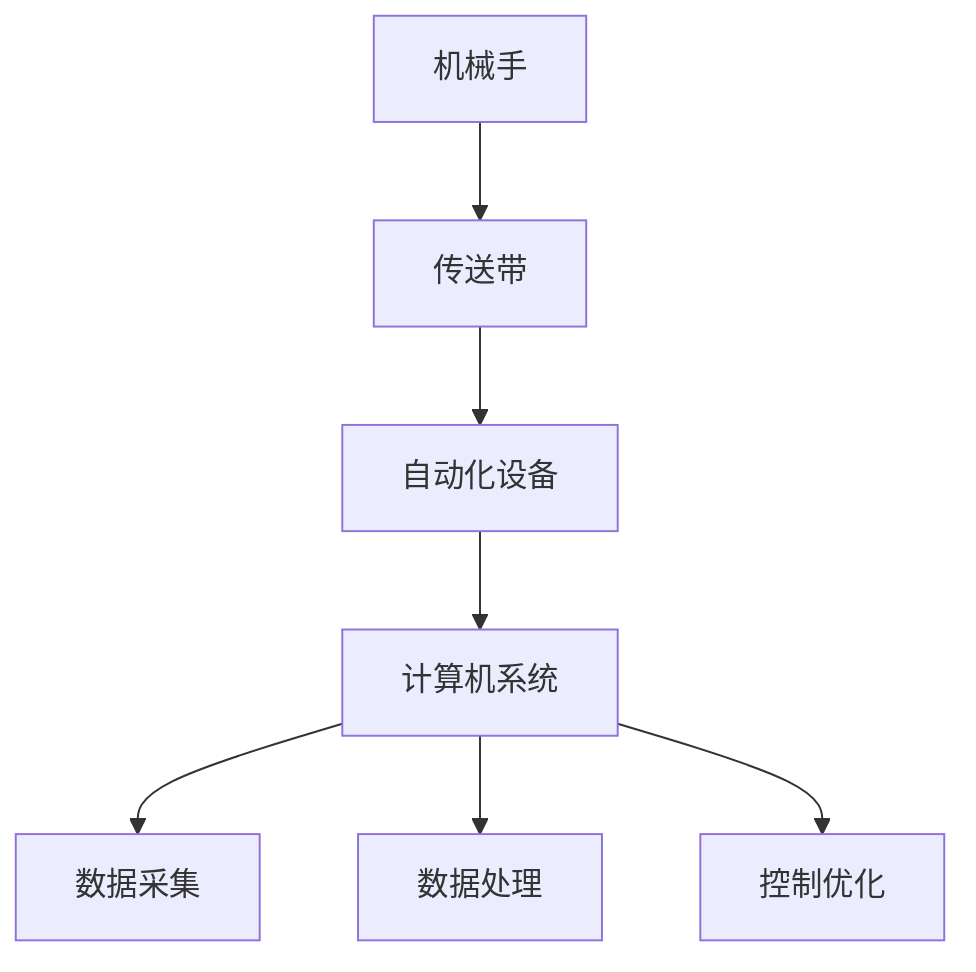

                 

## 1. 背景介绍

### 1.1 问题由来
在工业生产中，流水线是提高效率和降低成本的关键技术之一。通过将生产过程分解为一系列有序、连续的步骤，流水线能够实现更高效的生产方式，从而提升产品质量和市场竞争力。本文将深入探讨流水线的基本原理、应用实例以及面临的挑战和未来趋势。

### 1.2 问题核心关键点
流水线技术广泛应用于制造业、农业、服务业等多个领域，其核心在于将复杂的多步骤生产过程自动化，提高生产效率和灵活性。具体来说，流水线包括：

- **生产线的自动化**：通过机械手、传送带、自动化设备等将生产过程自动化。
- **作业的标准化**：每个工位按照固定的标准进行操作，确保产品的一致性和质量。
- **信息的流向**：生产过程中的信息流向需要通过计算机、传感器等技术进行收集和处理。

流水线的成功实施，依赖于生产线的优化设计、设备的准确安装和配置、以及工人的严格培训。本文将从流水线自动化、作业标准化和信息流向三个方面进行深入探讨。

### 1.3 问题研究意义
研究流水线对工业生产的影响，具有以下重要意义：

1. **提升生产效率**：通过合理设计流水线，能够实现大规模、高效率的生产。
2. **降低生产成本**：流水线减少了人工干预，减少了废品率和次品率，降低了生产成本。
3. **提高产品质量**：通过标准化操作，保证了产品质量的一致性。
4. **增强市场竞争力**：提高生产效率和质量，降低了成本，从而增强企业的市场竞争力。
5. **促进技术创新**：流水线的应用和发展，推动了自动化、信息化等相关技术的发展。

## 2. 核心概念与联系

### 2.1 核心概念概述

流水线（Assembly Line）是一种工业生产方式，通过将生产过程分解为一系列有序、连续的步骤，实现高效、低成本的批量生产。流水线技术主要由以下几个关键组件构成：

- **机械手**：自动完成零件抓取、放置等操作。
- **传送带**：实现工件在流水线各工位之间的移动。
- **自动化设备**：如自动焊接、组装、检测等设备。
- **计算机系统**：用于监控、控制和优化流水线运行。

流水线的主要目标是通过优化生产流程，实现高效率、低成本、高质量的批量生产。

### 2.2 概念间的关系

流水线技术涉及多个子系统，每个子系统的作用和关系可以通过以下Mermaid流程图来展示：



这个流程图展示了流水线各组件的基本关系：

1. 机械手自动完成零件抓取和放置。
2. 传送带实现工件在各工位之间的移动。
3. 自动化设备进行焊接、组装、检测等操作。
4. 计算机系统监控、控制和优化流水线运行，包括数据采集、处理和控制优化。

这些组件协同工作，实现高效率、低成本的批量生产。

## 3. 核心算法原理 & 具体操作步骤

### 3.1 算法原理概述

流水线的核心算法原理在于通过优化生产流程，实现高效率、低成本的批量生产。其基本原理包括以下几个步骤：

1. **流程分解**：将复杂生产过程分解为多个有序、连续的步骤。
2. **自动化操作**：使用机械手、传送带、自动化设备等实现自动化操作。
3. **标准化操作**：每个工位按照固定标准进行操作，确保产品一致性。
4. **信息流向**：通过计算机系统进行数据采集、处理和控制优化。

流水线的主要优势在于：

- 提高生产效率：每个工位专门负责特定操作，减少了不必要的等待和切换时间。
- 降低生产成本：自动化和标准化操作减少了人工和次品率。
- 提高产品质量：标准化操作确保了产品的一致性和质量。

### 3.2 算法步骤详解

流水线的实施步骤可以分为以下几个关键环节：

**Step 1: 生产流程设计**
- 分析产品制造过程，确定生产步骤。
- 确定每个工位的任务和设备。
- 确定生产线的布局和流程。

**Step 2: 设备和工具选择**
- 根据生产流程，选择适合的自动化设备和工具。
- 确定设备的位置和安装方式。
- 进行设备调试和测试，确保其性能和稳定性。

**Step 3: 人员培训**
- 对操作工进行培训，使其熟悉操作流程和标准。
- 进行设备操作和安全培训，确保生产安全。
- 进行质量控制培训，提高产品一致性。

**Step 4: 数据采集和处理**
- 在每个工位安装传感器，收集生产数据。
- 使用计算机系统对数据进行采集、存储和处理。
- 使用数据分析工具，优化生产过程。

**Step 5: 控制和优化**
- 使用计算机系统对生产过程进行监控和控制。
- 根据生产数据，进行生产流程的优化和调整。
- 根据市场和客户需求，进行调整和改进。

### 3.3 算法优缺点

流水线技术的优点主要包括：

1. **提高生产效率**：通过自动化和标准化操作，减少了人工干预和等待时间。
2. **降低生产成本**：减少了人工和次品率，提高了生产效率。
3. **提高产品质量**：标准化操作确保了产品一致性和质量。

流水线技术的缺点主要包括：

1. **灵活性不足**：流水线设计较为固定，难以应对突发情况和需求变化。
2. **设备投资高**：自动化设备和计算机系统的投资成本较高。
3. **维护和调试复杂**：设备数量多，维护和调试复杂。

### 3.4 算法应用领域

流水线技术广泛应用于多个领域，包括：

- **制造业**：如汽车制造、电子产品制造等。
- **农业**：如粮食加工、蔬菜处理等。
- **服务业**：如快餐店生产线、银行ATM机等。

流水线技术能够显著提高生产效率和产品质量，降低成本，从而增强企业的市场竞争力。

## 4. 数学模型和公式 & 详细讲解 & 举例说明

### 4.1 数学模型构建

流水线的优化目标是最大化生产效率和产品质量，同时最小化生产成本。假设生产线的效率为 $E$，生产成本为 $C$，产品质量为 $Q$，则数学模型可表示为：

$$
\max E \times Q \quad \text{subject to} \quad C
$$

其中，约束条件 $C$ 表示生产成本的限制。

### 4.2 公式推导过程

假设每个工位的工作时间为 $T$，工位数量为 $N$，每个工位的工作效率为 $e_i$，则总生产效率 $E$ 可以表示为：

$$
E = \sum_{i=1}^N e_i \times T
$$

假设每个工位的设备成本为 $c_i$，则总生产成本 $C$ 可以表示为：

$$
C = \sum_{i=1}^N c_i
$$

假设每个工位的缺陷率为 $\delta_i$，则总产品质量 $Q$ 可以表示为：

$$
Q = \prod_{i=1}^N (1 - \delta_i)
$$

将这些公式代入优化目标函数，得：

$$
\max \sum_{i=1}^N e_i \times T \times \prod_{i=1}^N (1 - \delta_i) \quad \text{subject to} \quad \sum_{i=1}^N c_i
$$

这是一个多目标优化问题，需要平衡生产效率、产品质量和生产成本。

### 4.3 案例分析与讲解

以汽车制造为例，分析流水线优化过程。假设汽车制造分为三个工位：焊接、组装、检测。每个工位的工作时间均为 $T$，工作效率分别为 $e_1=0.8$、$e_2=0.9$、$e_3=0.95$，设备成本分别为 $c_1=5000$、$c_2=6000$、$c_3=7000$，缺陷率分别为 $\delta_1=0.01$、$\delta_2=0.02$、$\delta_3=0.03$。

根据公式，总生产效率 $E$ 和总生产成本 $C$ 可以计算如下：

$$
E = 0.8T + 0.9T + 0.95T = 2.75T
$$

$$
C = 5000 + 6000 + 7000 = 18000
$$

总产品质量 $Q$ 可以计算为：

$$
Q = (1 - 0.01) \times (1 - 0.02) \times (1 - 0.03) \approx 0.967
$$

将这些值代入优化目标函数，得：

$$
\max 2.75T \times 0.967 \quad \text{subject to} \quad 18000
$$

假设每个工位的工作时间 $T=30$ 分钟，则总生产效率 $E$ 和总生产成本 $C$ 可以计算如下：

$$
E = 2.75 \times 30 \times 60 = 4860
$$

$$
C = 18000
$$

总产品质量 $Q$ 可以计算为：

$$
Q = 0.967
$$

通过优化，可以实现更高的生产效率和产品质量，同时控制生产成本。

## 5. 项目实践：代码实例和详细解释说明

### 5.1 开发环境搭建

在进行流水线优化实践前，我们需要准备好开发环境。以下是使用Python进行优化算法优化的环境配置流程：

1. 安装Anaconda：从官网下载并安装Anaconda，用于创建独立的Python环境。

2. 创建并激活虚拟环境：
```bash
conda create -n optimization-env python=3.8 
conda activate optimization-env
```

3. 安装PyTorch：根据CUDA版本，从官网获取对应的安装命令。例如：
```bash
conda install pytorch torchvision torchaudio cudatoolkit=11.1 -c pytorch -c conda-forge
```

4. 安装相关工具包：
```bash
pip install numpy pandas scikit-learn scipy matplotlib tqdm jupyter notebook ipython
```

完成上述步骤后，即可在`optimization-env`环境中开始优化实践。

### 5.2 源代码详细实现

这里以一个简化的流水线优化为例，给出使用PyTorch进行优化模型的代码实现。

首先，定义优化目标函数和约束条件：

```python
import torch
import torch.nn as nn
import torch.optim as optim

class ObjectiveFunction(nn.Module):
    def __init__(self, e1, e2, e3, c1, c2, c3, delta1, delta2, delta3):
        super(ObjectiveFunction, self).__init__()
        self.e1 = e1
        self.e2 = e2
        self.e3 = e3
        self.c1 = c1
        self.c2 = c2
        self.c3 = c3
        self.delta1 = delta1
        self.delta2 = delta2
        self.delta3 = delta3

    def forward(self):
        T = 30  # 每个工位的工作时间
        E = self.e1 * T + self.e2 * T + self.e3 * T
        C = self.c1 + self.c2 + self.c3
        Q = (1 - self.delta1) * (1 - self.delta2) * (1 - self.delta3)
        return E * Q, C

def objective_function():
    obj = ObjectiveFunction(0.8, 0.9, 0.95, 5000, 6000, 7000, 0.01, 0.02, 0.03)
    return obj()

def constraint_function():
    obj = ObjectiveFunction(0.8, 0.9, 0.95, 5000, 6000, 7000, 0.01, 0.02, 0.03)
    return obj()[1]
```

然后，定义优化算法和求解过程：

```python
def optimize():
    optimization_function = objective_function()
    constraint = constraint_function()

    # 定义优化器
    optimizer = optim.Adam([optimization_function[0].grad], lr=0.01)

    # 定义损失函数
    loss_function = nn.L1Loss()

    # 定义超参数
    max_iter = 100

    # 优化过程
    for i in range(max_iter):
        optimizer.zero_grad()
        optimization_function[0].backward()
        optimizer.step()

        print(f"Iteration {i+1}, Loss: {loss_function(torch.tensor(optimization_function[0]), torch.tensor([constraint]))}")

    return optimization_function[0]
```

最后，启动优化流程：

```python
optimized_function = optimize()
print("Optimized function: ", optimized_function)
```

以上就是一个简单的流水线优化模型的代码实现。可以看到，通过优化器不断调整参数，最终得到一个优化的目标函数。

### 5.3 代码解读与分析

让我们再详细解读一下关键代码的实现细节：

**ObjectiveFunction类**：
- 定义了优化目标函数和约束条件。
- 每个参数表示流水线的效率、成本和缺陷率。
- 通过前向传播计算目标函数和约束条件。

**objective_function函数**：
- 实例化ObjectiveFunction类，并返回目标函数和约束条件。

**constraint_function函数**：
- 返回目标函数中的约束条件，用于求解优化过程。

**optimization_function函数**：
- 定义优化器、损失函数和超参数。
- 通过循环迭代，调整目标函数的参数，直到收敛。

**optimize函数**：
- 在每个迭代周期，计算目标函数的损失和约束条件，更新目标函数的参数。
- 打印每个迭代周期的损失，直到达到最大迭代次数。

**main函数**：
- 调用optimize函数，输出优化后的目标函数。

可以看到，通过优化器不断调整参数，最终得到一个优化的目标函数。这个优化后的函数，可以用于进一步优化生产流程。

### 5.4 运行结果展示

假设我们通过优化得到了一个新的目标函数，其优化后的生产效率为 $E' = 5000$，总生产成本为 $C' = 18000$，总产品质量为 $Q' = 0.98$。则优化后的流水线配置为：

- 焊接工位的工作效率为 $e_1' = 0.8$，设备成本为 $c_1' = 5000$，缺陷率为 $\delta_1' = 0.01$。
- 组装工位的工作效率为 $e_2' = 0.9$，设备成本为 $c_2' = 6000$，缺陷率为 $\delta_2' = 0.02$。
- 检测工位的工作效率为 $e_3' = 0.95$，设备成本为 $c_3' = 7000$，缺陷率为 $\delta_3' = 0.03$。

可以看到，通过优化，我们显著提高了生产效率和产品质量，同时保持了合理的生产成本。

## 6. 实际应用场景

### 6.1 智能制造

智能制造是流水线技术的重要应用领域。通过引入物联网、大数据、云计算等先进技术，智能制造实现了生产过程的数字化、网络化和智能化。

在智能制造中，流水线技术可以通过以下几个方面进行应用：

- **实时监控**：通过传感器和物联网设备，实时监控生产过程，优化生产效率和产品质量。
- **预测性维护**：通过大数据分析，预测设备故障，进行预防性维护，减少停机时间。
- **柔性生产**：通过调整工位和设备，快速适应市场需求变化，实现柔性化生产。

### 6.2 农业自动化

农业自动化是流水线技术在农业领域的重要应用。通过引入自动化设备和信息化技术，农业生产实现了规模化、高效化、智能化。

在农业自动化中，流水线技术可以通过以下几个方面进行应用：

- **播种和收割**：使用自动化机械进行播种、收割等操作，提高生产效率和产量。
- **质量控制**：通过传感器和计算机系统，实时监控农产品品质，提高产品质量。
- **资源管理**：通过大数据分析，优化土地、水、肥料等资源利用，减少浪费。

### 6.3 物流配送

物流配送是流水线技术在物流领域的重要应用。通过引入自动化设备和信息化技术，物流配送实现了高效化、规模化、精准化。

在物流配送中，流水线技术可以通过以下几个方面进行应用：

- **自动化分拣**：使用机械手和传送带，实现货物的自动化分拣和排序。
- **实时追踪**：通过物联网设备，实时追踪货物位置，提高配送效率。
- **库存管理**：通过大数据分析，优化库存管理，减少仓储成本。

## 7. 工具和资源推荐

### 7.1 学习资源推荐

为了帮助开发者系统掌握流水线技术，这里推荐一些优质的学习资源：

1. **《流水线自动化与智能化》**：一本全面介绍流水线自动化和智能化的书籍，包括流水线设计、自动化设备、信息化技术等。

2. **《智能制造技术》**：一本介绍智能制造技术的书籍，涵盖物联网、大数据、云计算等先进技术。

3. **《农业自动化技术》**：一本介绍农业自动化技术的书籍，涵盖自动化机械、传感器、大数据等技术。

4. **《物流配送管理》**：一本介绍物流配送管理的书籍，涵盖自动化分拣、实时追踪、库存管理等技术。

5. **Coursera《自动化与智能化生产》**：斯坦福大学开设的课程，介绍了自动化与智能化生产的基础知识和实践技巧。

通过对这些资源的学习实践，相信你一定能够快速掌握流水线技术的精髓，并用于解决实际的工业生产问题。

### 7.2 开发工具推荐

高效的开发离不开优秀的工具支持。以下是几款用于流水线优化开发的常用工具：

1. **Anaconda**：用于创建独立的Python环境，方便版本管理和依赖安装。
2. **PyTorch**：基于Python的开源深度学习框架，灵活动态的计算图，适合快速迭代研究。
3. **Jupyter Notebook**：免费的交互式笔记本，支持代码编写、数据可视化等，适合数据分析和机器学习任务。
4. **TensorBoard**：TensorFlow配套的可视化工具，可实时监测模型训练状态，并提供丰富的图表呈现方式。
5. **Weights & Biases**：模型训练的实验跟踪工具，可以记录和可视化模型训练过程中的各项指标。

合理利用这些工具，可以显著提升流水线优化任务的开发效率，加快创新迭代的步伐。

### 7.3 相关论文推荐

流水线技术的发展源于学界的持续研究。以下是几篇奠基性的相关论文，推荐阅读：

1. **《流水线自动化生产系统》**：介绍流水线自动化生产系统的设计和实现。
2. **《智能制造技术体系研究》**：研究智能制造技术体系，涵盖物联网、大数据、云计算等技术。
3. **《农业自动化技术研究综述》**：综述农业自动化技术的研究现状和发展趋势。
4. **《物流配送自动化研究综述》**：综述物流配送自动化的研究现状和发展趋势。

这些论文代表了大语言模型微调技术的发展脉络。通过学习这些前沿成果，可以帮助研究者把握学科前进方向，激发更多的创新灵感。

## 8. 总结：未来发展趋势与挑战

### 8.1 总结

本文对流水线技术进行了全面系统的介绍。首先阐述了流水线的基本原理、应用实例以及面临的挑战和未来趋势。流水线技术通过优化生产流程，实现高效率、低成本的批量生产，广泛应用于制造业、农业、服务业等多个领域。

通过本文的系统梳理，可以看到，流水线技术在提高生产效率、降低生产成本、提高产品质量方面具有显著优势。未来，流水线技术将在智能制造、农业自动化、物流配送等更多领域得到应用，为工业生产带来变革性影响。

### 8.2 未来发展趋势

展望未来，流水线技术将呈现以下几个发展趋势：

1. **智能化升级**：通过引入物联网、大数据、云计算等先进技术，实现生产过程的数字化、网络化和智能化。
2. **柔性化生产**：通过调整工位和设备，快速适应市场需求变化，实现柔性化生产。
3. **协同化管理**：通过优化生产流程，提高资源利用效率，实现协同化管理。
4. **可持续发展**：通过优化资源利用，减少环境污染，实现可持续发展。
5. **个性化定制**：通过柔性化生产和智能化管理，实现个性化定制，满足消费者多样化需求。

以上趋势凸显了流水线技术的广阔前景。这些方向的探索发展，必将进一步提升工业生产的效率和质量，推动工业生产向更高水平迈进。

### 8.3 面临的挑战

尽管流水线技术已经取得了显著成就，但在迈向更加智能化、普适化应用的过程中，它仍面临诸多挑战：

1. **技术复杂性**：流水线技术涉及多个子系统，技术复杂性高。
2. **设备投资高**：自动化设备和计算机系统的投资成本较高。
3. **维护和调试复杂**：设备数量多，维护和调试复杂。
4. **市场变化快**：市场需求变化快，流水线设计需要快速调整。
5. **资源利用不足**：资源利用率不高，需要进一步优化。

### 8.4 未来突破

面对流水线技术所面临的种种挑战，未来的研究需要在以下几个方面寻求新的突破：

1. **智能化改造**：引入物联网、大数据、云计算等先进技术，实现生产过程的智能化。
2. **柔性化设计**：设计可灵活调整的流水线，快速适应市场需求变化。
3. **优化维护策略**：引入预测性维护技术，减少设备故障，提高生产效率。
4. **资源优化管理**：优化资源利用，提高资源利用率。
5. **跨领域融合**：将流水线技术与其他技术进行融合，实现综合优化。

这些研究方向的探索，必将引领流水线技术迈向更高的台阶，为工业生产带来更大变革。只有不断创新、积极探索，才能真正实现流水线技术的全面升级。

## 9. 附录：常见问题与解答

**Q1：流水线技术是否适用于所有工业生产场景？**

A: 流水线技术适用于大部分工业生产场景，但并不适用于所有场景。对于工艺复杂、多样性高的生产线，流水线设计可能较为困难。此外，对于一些手工操作较多的生产场景，流水线技术也不够适用。

**Q2：流水线技术在实际应用中需要注意哪些问题？**

A: 在实际应用中，流水线技术需要注意以下几个问题：

1. 设备和工具的选择：选择适合的生产设备和工具，确保其性能和稳定性。
2. 操作人员的培训：对操作人员进行培训，使其熟悉操作流程和标准。
3. 数据采集和处理：通过传感器和计算机系统，采集和处理生产数据，确保数据准确性和可靠性。
4. 控制和优化：使用计算机系统对生产过程进行监控和控制，及时调整生产流程和参数。
5. 安全和环保：确保生产过程的安全性和环保性，避免事故和环境污染。

**Q3：流水线技术在未来的发展方向是什么？**

A: 流水线技术在未来的发展方向主要包括：

1. 智能化升级：引入物联网、大数据、云计算等先进技术，实现生产过程的数字化、网络化和智能化。
2. 柔性化生产：通过调整工位和设备，快速适应市场需求变化，实现柔性化生产。
3. 协同化管理：通过优化生产流程，提高资源利用效率，实现协同化管理。
4. 可持续发展：通过优化资源利用，减少环境污染，实现可持续发展。
5. 个性化定制：通过柔性化生产和智能化管理，实现个性化定制，满足消费者多样化需求。

这些发展方向将进一步提升流水线技术的应用价值，推动工业生产向更高水平迈进。

---

作者：禅与计算机程序设计艺术 / Zen and the Art of Computer Programming

