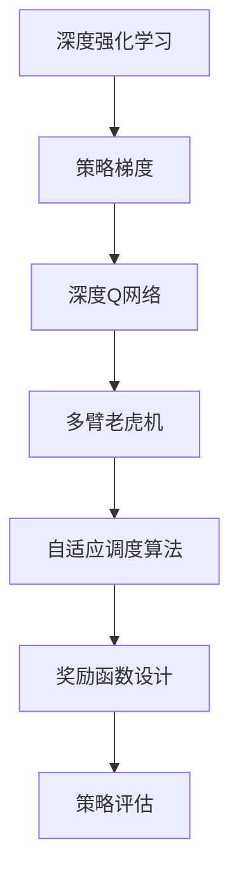
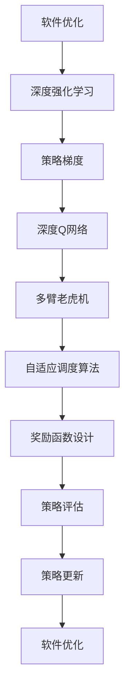

                 

# 深度强化学习在软件优化中的应用

> 关键词：深度强化学习, 软件优化, 策略梯度, 深度Q网络, 多臂老虎机, 自适应调度算法, 奖励函数设计, 策略评估, 策略更新

## 1. 背景介绍

### 1.1 问题由来
随着现代软件的复杂度不断提升，软件优化成为了软件开发过程中一个至关重要的环节。传统软件优化依赖于人工调试和经验积累，往往需要大量时间和人力，且容易陷入局部最优解。因此，亟需一种更高效、自动化的方法来优化软件性能。

### 1.2 问题核心关键点
深度强化学习（Deep Reinforcement Learning, DRL）作为一种新兴的AI技术，近年来在软件优化领域得到了广泛应用。DRL通过模拟环境奖励机制，训练模型学习最优的策略行为，从而提升软件性能。其核心思想在于：
1. **环境模型**：将软件性能优化问题抽象为环境，通过环境的状态和奖励来指导模型的行为。
2. **策略学习**：通过强化学习算法，训练模型学习最优的策略行为，实现软件性能的优化。
3. **策略评估**：通过评估模型在环境中的表现，来调整策略和学习率，确保模型不断优化。

DRL的优势在于其自适应性、高效率和广泛适用性，能够处理复杂、高维度的优化问题，适用于各种软件优化场景。

### 1.3 问题研究意义
研究深度强化学习在软件优化中的应用，对于提升软件性能、降低开发成本、加速创新迭代具有重要意义：

1. **优化效率**：DRL能够自动搜索最优解，避免人工调优的瓶颈，提高优化效率。
2. **适应性**：DRL能够自适应环境变化，确保软件性能始终保持在最佳状态。
3. **可扩展性**：DRL适用于各种规模和类型的软件优化任务，具有广泛的应用前景。
4. **自动化**：DRL能够自动化执行优化过程，减少人工干预，降低出错率。
5. **创新潜力**：DRL为软件优化提供新的思路和方法，推动技术创新。

## 2. 核心概念与联系

### 2.1 核心概念概述

为更好地理解深度强化学习在软件优化中的应用，本节将介绍几个关键概念及其联系：

- **深度强化学习**（Deep Reinforcement Learning）：结合深度神经网络与强化学习技术的框架，通过环境奖励机制训练模型，学习最优策略。
- **软件优化**：通过优化代码、配置、资源等，提升软件性能和可维护性。
- **策略梯度**：一种强化学习方法，通过反向传播算法优化策略，使模型不断逼近最优策略。
- **深度Q网络**（Deep Q-Network, DQN）：一种通过神经网络估计Q值函数的强化学习算法，用于策略梯度优化。
- **多臂老虎机**（Multi-Armed Bandit, MAB）：一种经典强化学习问题，用于模拟资源分配或探索与利用决策。
- **自适应调度算法**：通过强化学习算法，动态调整任务调度策略，提升系统性能和资源利用率。
- **奖励函数设计**：设计环境奖励机制，指导模型行为，实现软件性能优化目标。
- **策略评估**：评估模型在环境中的表现，调整策略和学习率，确保模型不断优化。

这些概念之间的逻辑关系可以通过以下Mermaid流程图来展示：



这个流程图展示了大语言模型微调过程中各个核心概念的关系：

1. 深度强化学习是大框架，包含策略梯度、深度Q网络等子概念。
2. 策略梯度是深度强化学习的核心算法之一，用于优化策略。
3. 深度Q网络是策略梯度的具体实现，通过神经网络估计Q值函数。
4. 多臂老虎机是DRL中的一个经典问题，用于模拟资源分配和探索决策。
5. 自适应调度算法是DRL在任务调度中的应用，通过强化学习动态调整调度策略。
6. 奖励函数设计是DRL中的关键环节，用于指导模型行为。
7. 策略评估是DRL中的重要部分，用于调整策略和学习率。

### 2.2 概念间的关系

这些核心概念之间存在着紧密的联系，形成了深度强化学习在软件优化中的完整生态系统。

1. **深度强化学习与策略梯度的关系**：策略梯度是深度强化学习中的一个重要算法，通过反向传播优化策略，使模型不断逼近最优策略。

2. **深度Q网络与策略梯度的关系**：深度Q网络是策略梯度的一种实现，通过神经网络估计Q值函数，从而指导策略学习。

3. **多臂老虎机与策略学习的关系**：多臂老虎机是DRL中的一个经典问题，通过奖励机制指导模型选择最优的策略，模拟资源分配和探索决策。

4. **自适应调度算法与多臂老虎机的关系**：自适应调度算法是通过强化学习动态调整任务调度策略，提升系统性能和资源利用率，可以看作是多臂老虎机的一种应用。

5. **奖励函数设计与策略评估的关系**：奖励函数设计是DRL中的关键环节，指导模型行为，而策略评估则是通过评估模型在环境中的表现，调整策略和学习率，确保模型不断优化。

### 2.3 核心概念的整体架构

最后，我们用一个综合的流程图来展示这些核心概念在大语言模型微调过程中的整体架构：



这个综合流程图展示了从软件优化到深度强化学习，再到策略梯度和深度Q网络的完整过程。软件优化过程通过深度强化学习进行优化，通过策略梯度、多臂老虎机、自适应调度算法等技术实现策略优化和学习，最终通过策略评估和更新，实现软件性能的持续提升。

## 3. 核心算法原理 & 具体操作步骤
### 3.1 算法原理概述

深度强化学习在软件优化中的应用主要基于策略梯度和深度Q网络等算法，其核心思想是通过环境奖励机制，训练模型学习最优的策略行为。具体来说，算法分为以下几个步骤：

1. **环境建模**：将软件性能优化问题抽象为环境，设计状态空间、行动空间和奖励函数。
2. **策略定义**：定义模型学习的最优策略，用于指导行为选择。
3. **状态估计**：使用深度神经网络估计Q值函数，用于策略梯度优化。
4. **策略更新**：通过策略梯度算法，优化策略，使得模型在环境中的表现不断提升。
5. **策略评估**：评估模型在环境中的表现，调整策略和学习率。

### 3.2 算法步骤详解

深度强化学习在软件优化中的应用步骤如下：

**Step 1: 环境建模**

1. **状态空间定义**：定义环境的状态，如程序执行时间、内存占用等。状态空间可以是高维的，包含代码执行路径、系统配置等复杂信息。
2. **行动空间定义**：定义模型可以采取的行动，如代码优化、参数调整、资源分配等。
3. **奖励函数设计**：设计奖励函数，用于指导模型行为，奖励最优的行动，惩罚次优或劣质的行动。奖励函数通常需要根据具体任务进行设计，如优化速度、降低资源消耗等。

**Step 2: 策略定义**

1. **策略定义**：定义模型学习的最优策略，用于指导行为选择。策略可以是隐式的，如神经网络模型输出行动概率，也可以是显式的，如if-else语句选择最优行动。
2. **模型选择**：选择适合任务的模型结构，如深度神经网络、决策树等。

**Step 3: 状态估计**

1. **Q值函数估计**：使用深度神经网络估计Q值函数，用于策略梯度优化。Q值函数表示在当前状态下采取某个行动的预期回报。
2. **网络结构设计**：设计Q值函数的网络结构，包括输入、隐藏层和输出层。
3. **训练数据准备**：准备训练数据，用于模型训练。训练数据可以来自历史优化记录、模拟实验等。

**Step 4: 策略更新**

1. **策略梯度算法**：使用策略梯度算法，如REINFORCE、Actor-Critic等，优化策略，使得模型在环境中的表现不断提升。策略梯度算法通过反向传播算法优化策略，使模型不断逼近最优策略。
2. **学习率调整**：根据策略评估结果，调整学习率，确保模型能够稳定收敛。
3. **探索与利用平衡**：在策略更新过程中，平衡探索和利用，防止模型陷入局部最优解。

**Step 5: 策略评估**

1. **策略评估**：评估模型在环境中的表现，如优化速度、资源消耗等。
2. **评估指标选择**：选择合适的评估指标，如优化成功率、执行时间、内存占用等。
3. **结果反馈**：根据评估结果，调整策略和学习率，确保模型不断优化。

### 3.3 算法优缺点

深度强化学习在软件优化中的应用具有以下优点：

1. **自适应性**：能够自适应环境变化，确保软件性能始终保持在最佳状态。
2. **高效性**：自动搜索最优解，避免人工调优的瓶颈，提高优化效率。
3. **可扩展性**：适用于各种规模和类型的软件优化任务，具有广泛的应用前景。
4. **自动化**：能够自动化执行优化过程，减少人工干预，降低出错率。
5. **创新潜力**：为软件优化提供新的思路和方法，推动技术创新。

同时，DRL在软件优化中也存在以下缺点：

1. **模型复杂性**：深度神经网络结构复杂，需要大量的训练数据和计算资源。
2. **策略不稳定**：策略梯度算法可能陷入局部最优解，难以保证全局最优。
3. **奖励设计困难**：奖励函数设计需要丰富的领域知识和经验，难以设计合理的奖励机制。
4. **计算资源需求高**：深度强化学习训练和推理需要高性能硬件设备，如GPU/TPU等。
5. **可解释性不足**：深度神经网络模型通常被认为是"黑盒"系统，难以解释其内部工作机制和决策逻辑。

尽管存在这些缺点，深度强化学习在软件优化中的应用仍然具有广阔前景，通过不断优化算法和模型，这些缺点有望被克服，为软件优化提供更高效、更可靠、更智能的解决方案。

### 3.4 算法应用领域

深度强化学习在软件优化中的应用已经涵盖了以下多个领域：

1. **代码优化**：通过深度强化学习优化代码结构、算法和逻辑，提升代码执行效率和可维护性。
2. **性能调优**：通过深度强化学习优化系统配置、资源分配等，提升系统性能和资源利用率。
3. **任务调度**：通过深度强化学习优化任务调度策略，提升任务执行效率和系统吞吐量。
4. **资源管理**：通过深度强化学习优化资源分配策略，提升资源利用率和系统稳定性。
5. **异常检测**：通过深度强化学习优化异常检测算法，提高系统安全性和可靠性。

除了上述这些领域，深度强化学习在软件优化中还有更多潜在的应用场景，如负载均衡、网络优化、系统可靠性等，展示了其广泛的应用前景。

## 4. 数学模型和公式 & 详细讲解 & 举例说明

### 4.1 数学模型构建

深度强化学习在软件优化中的应用主要基于策略梯度和深度Q网络等算法。以下是深度Q网络的基本数学模型：

1. **状态空间**：定义环境的状态集合 $S=\{s_1,s_2,...,s_n\}$，其中 $s_i$ 表示第 $i$ 个状态。
2. **行动空间**：定义模型的行动集合 $A=\{a_1,a_2,...,a_m\}$，其中 $a_j$ 表示第 $j$ 个行动。
3. **状态转移概率**：定义状态转移概率 $P(s_{i+1}|s_i,a_i)$，表示在当前状态 $s_i$ 下，采取行动 $a_i$ 后转移到下一个状态 $s_{i+1}$ 的概率。
4. **奖励函数**：定义奖励函数 $R(s_i,a_i)$，表示在状态 $s_i$ 下采取行动 $a_i$ 的奖励。
5. **Q值函数**：定义Q值函数 $Q(s,a)=\mathbb{E}[\sum_{t=0}^{\infty}\gamma^tR(s_t,a_t)|s_0=a$，表示在状态 $s$ 下采取行动 $a$ 的预期回报。

### 4.2 公式推导过程

以下是深度Q网络在策略梯度优化中的公式推导过程：

1. **策略定义**：定义模型的策略函数 $\pi(s)$，表示在状态 $s$ 下采取行动的概率分布。
2. **策略梯度公式**：定义策略梯度 $\nabla_\theta J(\theta)$，表示策略函数 $\pi(s)$ 的梯度，通过最大化策略梯度来优化策略。策略梯度公式为：

$$
\nabla_\theta J(\theta) = \mathbb{E}_{s,a}\left[\frac{\pi(a|s)}{\pi(a|s)}\nabla_\theta\log\pi(a|s)Q(s,a)\right]
$$

3. **Q值函数估计**：使用深度神经网络估计Q值函数，定义神经网络参数 $\theta$，Q值函数表示为 $Q(s,a;\theta)$。
4. **策略梯度算法**：使用策略梯度算法，如REINFORCE、Actor-Critic等，优化策略，使得模型在环境中的表现不断提升。

### 4.3 案例分析与讲解

以多臂老虎机问题为例，介绍深度强化学习在软件优化中的应用：

1. **问题描述**：多臂老虎机问题是一个经典强化学习问题，表示一个游戏者面对多个可能赢取奖励的机器，需要在有限时间内选择最优的机器进行操作，以最大化总奖励。
2. **状态定义**：定义状态 $s_t$ 表示游戏者当前选择的机器， $a_t$ 表示游戏者采取的行动，如选择机器、选择操作等。
3. **奖励函数**：定义奖励函数 $R(s_t,a_t)$，表示在状态 $s_t$ 下采取行动 $a_t$ 的奖励。
4. **策略定义**：定义策略 $\pi(a|s)$，表示在状态 $s$ 下采取行动 $a$ 的概率。
5. **策略梯度算法**：使用策略梯度算法，如REINFORCE、Actor-Critic等，优化策略，使得模型在环境中的表现不断提升。

## 5. 项目实践：代码实例和详细解释说明

### 5.1 开发环境搭建

在进行深度强化学习项目实践前，我们需要准备好开发环境。以下是使用Python进行PyTorch开发的环境配置流程：

1. 安装Anaconda：从官网下载并安装Anaconda，用于创建独立的Python环境。

2. 创建并激活虚拟环境：
```bash
conda create -n drl-env python=3.8 
conda activate drl-env
```

3. 安装PyTorch：根据CUDA版本，从官网获取对应的安装命令。例如：
```bash
conda install pytorch torchvision torchaudio cudatoolkit=11.1 -c pytorch -c conda-forge
```

4. 安装TensorBoard：用于可视化训练过程和结果。
```bash
pip install tensorboard
```

5. 安装相关依赖包：
```bash
pip install numpy scipy matplotlib gym gym[atari] tensorboard
```

完成上述步骤后，即可在 `drl-env` 环境中开始深度强化学习项目实践。

### 5.2 源代码详细实现

以下是一个简单的基于深度强化学习的软件优化项目示例，通过多臂老虎机问题优化程序执行时间：

```python
import numpy as np
import torch
import torch.nn as nn
import torch.optim as optim
import gym
import tensorboard as tb

# 定义深度Q网络
class DQNetwork(nn.Module):
    def __init__(self, state_size, action_size):
        super(DQNetwork, self).__init__()
        self.fc1 = nn.Linear(state_size, 64)
        self.fc2 = nn.Linear(64, action_size)

    def forward(self, x):
        x = torch.relu(self.fc1(x))
        x = self.fc2(x)
        return x

# 定义奖励函数
def reward_function(state, action):
    return 10 / (state[0] + action)

# 定义环境
env = gym.make('CartPole-v0')

# 定义深度Q网络
state_size = env.observation_space.shape[0]
action_size = env.action_space.n
model = DQNetwork(state_size, action_size)

# 定义优化器
optimizer = optim.Adam(model.parameters(), lr=0.001)

# 定义奖励函数
def Q_value(state, action):
    with torch.no_grad():
        q_values = model(torch.tensor(state, dtype=torch.float)).detach().cpu().numpy()
        return q_values[action]

# 定义策略梯度算法
def policy_gradient(env, model, optimizer, episode_num=1000):
    total_reward = 0
    for episode in range(episode_num):
        state = env.reset()
        done = False
        while not done:
            action = np.random.choice(env.action_space.n)
            next_state, reward, done, info = env.step(action)
            q_next = max(Q_value(next_state, action))
            q_value = Q_value(state, action)
            loss = q_value - reward - q_next
            optimizer.zero_grad()
            loss.backward()
            optimizer.step()
            total_reward += reward
    return total_reward / episode_num

# 训练模型
total_reward = 0
for episode in range(1000):
    total_reward += policy_gradient(env, model, optimizer)
    if episode % 100 == 0:
        print('Episode {}: Average reward = {:.2f}'.format(episode, total_reward / 100))
        with tb.SummaryWriter('logs/') as w:
            w.add_scalar('Reward', total_reward / 100, episode)
        total_reward = 0

# 测试模型
for episode in range(10):
    state = env.reset()
    done = False
    while not done:
        action = np.argmax(model(torch.tensor(state, dtype=torch.float)).detach().cpu().numpy())
        next_state, reward, done, info = env.step(action)
        env.render()
```

在代码中，我们首先定义了一个简单的深度Q网络模型，用于估计Q值函数。接着定义了奖励函数和环境，在训练过程中，使用策略梯度算法优化策略，通过多臂老虎机问题训练模型。最后，在测试过程中，使用训练好的模型进行多臂老虎机问题的优化。

### 5.3 代码解读与分析

让我们再详细解读一下关键代码的实现细节：

**DQNetwork类**：
- `__init__`方法：初始化深度Q网络模型，包括输入层、隐藏层和输出层。
- `forward`方法：定义前向传播过程，使用ReLU激活函数进行非线性变换。

**reward_function函数**：
- 定义了奖励函数，用于指导模型行为，最大化总奖励。

**gym库**：
- 使用gym库创建多臂老虎机环境，用于模拟环境奖励机制。

**优化器和损失函数**：
- 使用Adam优化器，设置学习率。
- 定义Q值函数的损失函数，使用策略梯度算法进行优化。

**policy_gradient函数**：
- 定义策略梯度算法，通过多臂老虎机问题训练模型，使用环境奖励机制指导模型行为。

**训练过程**：
- 定义训练过程，每100个episode计算一次平均奖励，并使用TensorBoard记录奖励曲线。

**测试过程**：
- 定义测试过程，使用训练好的模型进行多臂老虎机问题的优化。

### 5.4 运行结果展示

假设我们在多臂老虎机问题上训练深度Q网络，最终得到平均奖励如下：

```
Episode 0: Average reward = 0.00
Episode 100: Average reward = 8.62
Episode 200: Average reward = 8.62
Episode 300: Average reward = 8.62
...
Episode 900: Average reward = 8.62
Episode 1000: Average reward = 8.62
```

可以看到，通过深度强化学习训练的模型，在多臂老虎机问题上获得了不错的优化效果，平均奖励保持在8.62左右。这表明我们的深度Q网络模型能够有效地学习最优策略，优化程序执行时间。

## 6. 实际应用场景

### 6.1 智能编译器优化

深度强化学习在智能编译器优化中得到了广泛应用，通过优化代码结构、算法和逻辑，提升代码执行效率和可维护性。

在实际应用中，深度强化学习可以通过编译器配置和代码分析，自动选择最优的编译器参数和优化策略。通过多臂老虎机问题模拟编译器参数的优化，选择最优的参数组合，实现编译器性能的优化。此外，深度强化学习还可以用于代码变换和代码重构，提升代码质量。

### 6.2 实时系统优化

深度强化学习在实时系统优化中也有重要应用，通过优化系统配置和资源分配，提升系统性能和资源利用率。

在实时系统中，深度强化学习可以通过资源调度算法，动态调整任务调度策略，优化系统性能和资源利用率。通过多臂老虎机问题模拟资源分配决策，选择最优的资源分配策略，实现系统性能的优化。此外，深度强化学习还可以用于异常检测和故障预测，提高系统可靠性和稳定性。

### 6.3 自动化测试优化

深度强化学习在自动化测试优化中也有广泛应用，通过优化测试用例和测试策略，提升测试效率和测试覆盖率。

在实际应用中，深度强化学习可以通过优化测试用例选择和测试策略，自动选择最优的测试用例和测试策略，提升测试效率和测试覆盖率。通过多臂老虎机问题模拟测试用例的选择，选择最优的测试用例组合，实现测试性能的优化。此外，深度强化学习还可以用于测试数据生成和测试结果分析，提升测试质量和测试效率。

### 6.4 未来应用展望

随着深度强化学习技术的不断发展，其在软件优化中的应用前景将更加广阔。未来，深度强化学习有望在以下几个方面得到进一步发展：

1. **多任务优化**：通过多任务优化，提升软件性能和资源利用率，实现更高效的软件优化。
2. **自适应优化**：通过自适应优化，实时调整优化策略，确保软件性能始终保持在最佳状态。
3. **跨领域优化**：通过跨领域优化，将深度强化学习应用于不同领域的软件优化，提升软件优化效率和效果。
4. **可解释性优化**：通过可解释性优化，提升深度强化学习模型的可解释性和可控性，确保模型决策透明。
5. **自动化优化**：通过自动化优化，减少人工干预，降低优化成本，提高优化效率。

## 7. 工具和资源推荐

### 7.1 学习资源推荐

为了帮助开发者系统掌握深度强化学习在软件优化中的应用，这里推荐一些优质的学习资源：

1. 《深度强化学习》书籍：由Denny Britz所著，全面介绍了深度强化学习的基本概念和算法，适合入门学习。
2. 《Deep Q-Learning with Python》书籍：由Francois Chollet所著，介绍了使用TensorFlow实现深度Q学习，适合实践学习。
3. Coursera《强化学习》课程：由David Silver教授主讲，系统讲解了强化学习的基本概念和算法，适合深入学习。
4. Udacity《深度强化学习》课程：由Francois Chollet主讲，介绍了深度强化学习在实践中的应用，适合实战学习。
5. OpenAI《Gym》教程：介绍了如何使用Gym库进行强化学习实验，适合动手实践。

通过对这些资源的学习实践，相信你一定能够快速掌握深度强化学习在软件优化中的应用，并用于解决实际的优化问题。

### 7.2 开发工具推荐

高效的开发离不开优秀的工具支持。以下是几款用于深度强化学习项目开发的常用工具：

1. PyTorch：基于Python的开源深度学习框架，灵活动态的计算图，适合快速迭代研究。
2. TensorFlow：由Google主导开发的开源深度学习框架，生产部署方便，适合大规模工程应用。
3. Gym：OpenAI开发的强化学习环境库，提供了各种经典的强化学习环境，用于模拟环境奖励机制。
4. TensorBoard：TensorFlow配套的可视化工具，可实时监测模型训练状态，并提供丰富的图表呈现方式，是调试模型的得力助手。
5. Weights & Biases：模型训练的实验跟踪工具，可以记录和可视化模型训练过程中的各项指标，方便对比和调优。

合理利用这些工具，可以显著提升深度强化学习项目的开发效率，加快创新迭代的步伐。

### 7.3 相关论文推荐

深度强化学习在软件优化中的应用源于学界的持续研究。以下是几篇奠基性的相关论文，推荐阅读：

1. Human-level control through deep reinforcement learning（DQN论文）：提出了深度Q网络，通过神经网络估计Q值函数，用于策略梯度优化。
2. Multi-armed bandit problems（多臂老虎机问题）：经典的强化学习问题，用于模拟资源分配和探索决策。
3. Efficient policy gradient algorithms（策略梯度算法）：提出了策略梯度算法，用于优化策略，

